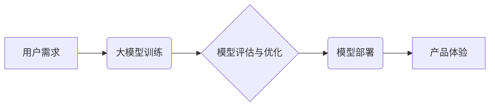

> 大模型、产品体验、优化、企业应用、用户需求、模型训练、数据标注、算法调优、部署优化、监控与评估

## 1. 背景介绍

近年来，大模型技术蓬勃发展，其强大的泛化能力和应用潜力吸引了各行各业的广泛关注。从自然语言处理到计算机视觉，从代码生成到药物研发，大模型正在深刻地改变着我们生活的方方面面。

对于企业而言，大模型的应用能够带来显著的价值提升，例如：

* **提升客户服务体验:** 利用大模型构建智能客服系统，能够快速响应客户需求，提供个性化服务，提升客户满意度。
* **优化营销策略:** 通过大模型分析用户行为数据，精准识别目标客户，制定个性化营销方案，提高营销效率。
* **加速产品研发:** 利用大模型进行代码生成、数据分析等任务，加速产品研发周期，降低研发成本。

然而，将大模型技术成功应用于企业产品中并非易事。大模型的训练成本高昂，部署和维护难度大，模型性能需要不断优化，才能真正满足企业的产品体验需求。

## 2. 核心概念与联系

大模型产品体验优化是一个多学科交叉的领域，涉及到人工智能、软件工程、用户体验设计等多个方面。

**2.1 核心概念**

* **大模型:** 指参数量超过数十亿甚至千亿的大规模神经网络模型，具有强大的泛化能力和学习能力。
* **产品体验:** 指用户使用产品时所感受到的整体感受，包括易用性、可用性、美观度、效率等方面。
* **优化:** 指通过改进模型架构、训练方法、部署方式等手段，提升大模型在特定应用场景下的性能和效率。

**2.2 联系**

大模型产品体验优化旨在通过优化大模型的技术指标和应用场景，提升用户使用产品时的体验感受。

**2.3 架构图**



## 3. 核心算法原理 & 具体操作步骤

**3.1 算法原理概述**

大模型产品体验优化涉及到多种算法和技术，例如：

* **模型训练算法:** 

包括梯度下降、Adam优化器等，用于训练大模型参数，使其能够准确地完成指定任务。
* **模型压缩算法:** 

例如量化、剪枝等，用于减少模型参数量，降低模型部署成本和延迟。
* **模型调优算法:** 

例如超参数调优、迁移学习等，用于优化模型性能，使其在特定应用场景下表现更优。

**3.2 算法步骤详解**

1. **数据收集和预处理:** 收集与目标应用场景相关的海量数据，并进行清洗、格式化、标注等预处理工作。
2. **模型选择和架构设计:** 根据目标任务和数据特点，选择合适的模型架构，并进行参数设置。
3. **模型训练:** 使用训练算法训练模型参数，并通过评估指标监控模型训练过程。
4. **模型评估和优化:** 对训练好的模型进行评估，并根据评估结果进行模型调优，例如调整超参数、增加训练数据等。
5. **模型部署:** 将优化后的模型部署到生产环境中，并进行监控和维护。

**3.3 算法优缺点**

* **优点:** 大模型产品体验优化算法能够有效提升大模型的性能和效率，从而提升用户体验。
* **缺点:** 这些算法的训练成本高昂，需要大量的计算资源和数据支持。

**3.4 算法应用领域**

大模型产品体验优化算法广泛应用于各个领域，例如：

* **智能客服:** 提升智能客服系统的响应速度和准确率，提供更人性化的服务体验。
* **个性化推荐:** 

根据用户的行为数据，提供更精准的商品或内容推荐，提升用户满意度。
* **自动驾驶:** 提升自动驾驶系统的感知能力和决策能力，提高驾驶安全性和舒适度。

## 4. 数学模型和公式 & 详细讲解 & 举例说明

**4.1 数学模型构建**

大模型产品体验优化可以建模为一个优化问题，目标是找到最佳模型参数，使得模型在特定指标下的表现达到最大化。

**4.2 公式推导过程**

假设模型的输出为 $y$，目标变量为 $t$，损失函数为 $L(y,t)$，则模型训练的目标是最小化损失函数：

$$
\min_{\theta} L(y,t)
$$

其中，$\theta$ 为模型参数。

**4.3 案例分析与讲解**

例如，在智能客服场景中，目标是让模型能够准确地理解用户的意图，并给出合适的回复。

损失函数可以定义为交叉熵损失函数，用于衡量模型预测结果与真实意图之间的差异。

$$
L(y,t) = - \sum_{i=1}^{n} t_i \log(y_i)
$$

其中，$t_i$ 为真实意图的 one-hot 编码，$y_i$ 为模型预测的意图概率。

通过最小化损失函数，模型可以学习到更准确的意图识别能力，从而提升用户体验。

## 5. 项目实践：代码实例和详细解释说明

**5.1 开发环境搭建**

* 操作系统: Ubuntu 20.04
* Python 版本: 3.8
* 框架: TensorFlow 2.x

**5.2 源代码详细实现**

```python
import tensorflow as tf

# 定义模型架构
model = tf.keras.Sequential([
    tf.keras.layers.Embedding(input_dim=10000, output_dim=128),
    tf.keras.layers.LSTM(units=64),
    tf.keras.layers.Dense(units=10, activation='softmax')
])

# 定义损失函数和优化器
model.compile(loss='sparse_categorical_crossentropy', optimizer='adam', metrics=['accuracy'])

# 训练模型
model.fit(x_train, y_train, epochs=10, batch_size=32)

# 评估模型
loss, accuracy = model.evaluate(x_test, y_test)
print('Loss:', loss)
print('Accuracy:', accuracy)
```

**5.3 代码解读与分析**

* 模型架构: 使用了 Embedding 层将词向量化，LSTM 层捕捉文本序列的上下文信息，Dense 层输出预测结果。
* 损失函数: 使用了 sparse_categorical_crossentropy 损失函数，用于多分类任务。
* 优化器: 使用了 Adam 优化器，用于更新模型参数。

**5.4 运行结果展示**

训练完成后，可以评估模型的性能，例如准确率、召回率等。

## 6. 实际应用场景

**6.1 智能客服**

大模型可以用于构建智能客服系统，自动回复用户常见问题，提供24/7的客户服务。

**6.2 个性化推荐**

大模型可以分析用户的行为数据，推荐个性化的商品或内容，提升用户体验。

**6.3 内容生成**

大模型可以用于生成各种类型的文本内容，例如新闻报道、广告文案、诗歌等。

**6.4 未来应用展望**

大模型产品体验优化将在未来发挥更重要的作用，例如：

* **更智能的交互体验:** 大模型将能够理解更复杂的自然语言，提供更自然、更人性化的交互体验。
* **更个性化的产品服务:** 大模型将能够根据用户的个性化需求，提供更精准、更个性化的产品和服务。
* **更自动化的工作流程:** 大模型将能够自动化完成许多重复性的工作任务，提高工作效率。

## 7. 工具和资源推荐

**7.1 学习资源推荐**

* **书籍:**
    * 《深度学习》
    * 《自然语言处理》
* **在线课程:**
    * Coursera: 深度学习
    * Udacity: 自然语言处理

**7.2 开发工具推荐**

* **TensorFlow:** 开源深度学习框架
* **PyTorch:** 开源深度学习框架
* **HuggingFace:** 大模型库和工具平台

**7.3 相关论文推荐**

* **BERT: Pre-training of Deep Bidirectional Transformers for Language Understanding**
* **GPT-3: Language Models are Few-Shot Learners**
* **T5: Text-to-Text Transfer Transformer**

## 8. 总结：未来发展趋势与挑战

**8.1 研究成果总结**

大模型产品体验优化取得了显著的成果，例如：

* 模型性能大幅提升
* 产品体验得到显著改善
* 应用场景不断拓展

**8.2 未来发展趋势**

* **模型规模进一步扩大:** 

模型参数量将继续增加，模型能力将进一步提升。
* **模型训练效率提升:** 

研究人员将探索更有效的训练方法，降低模型训练成本。
* **模型解释性增强:** 

研究人员将致力于提高模型的解释性，使模型决策更加透明。

**8.3 面临的挑战**

* **数据获取和标注成本高:** 

大模型训练需要海量数据，数据获取和标注成本较高。
* **模型部署和维护难度大:** 

大模型部署和维护需要强大的计算资源和专业技术。
* **模型安全性和隐私性问题:** 

大模型可能存在安全性和隐私性问题，需要采取相应的措施进行保护。

**8.4 研究展望**

未来，大模型产品体验优化将继续是一个重要的研究方向，需要多学科交叉合作，解决上述挑战，推动大模型技术在各个领域的应用。

## 9. 附录：常见问题与解答

**9.1 如何选择合适的模型架构?**

选择合适的模型架构需要根据目标任务和数据特点进行综合考虑。

**9.2 如何进行模型调优?**

模型调优可以通过调整超参数、增加训练数据等方式进行。

**9.3 如何部署大模型?**

大模型部署可以采用云端部署、边缘部署等方式。

**9.4 如何保证模型的安全性和隐私性?**

可以通过数据加密、模型剪枝等方式保证模型的安全性和隐私性。


作者：禅与计算机程序设计艺术 / Zen and the Art of Computer Programming 
<end_of_turn>