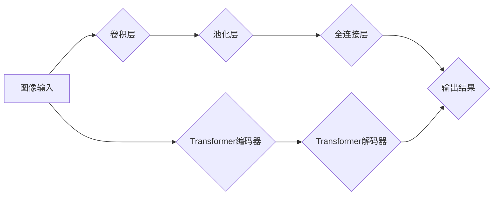

> 大模型，图像处理，计算机视觉，深度学习，Transformer，生成对抗网络 (GAN)，图像分类，目标检测，图像分割

## 1. 背景介绍

图像处理作为计算机视觉领域的核心应用之一，在各个领域都扮演着至关重要的角色。从医疗诊断到自动驾驶，从人脸识别到图像编辑，图像处理技术无处不在。传统的图像处理方法主要依赖于手工设计的特征提取和规则化操作，但随着深度学习技术的兴起，大模型在图像处理领域展现出强大的潜力。

大模型是指参数规模庞大、训练数据海量的人工智能模型。近年来，随着计算能力的提升和训练数据的积累，大模型在自然语言处理、语音识别等领域取得了突破性进展。在图像处理领域，大模型也逐渐成为研究热点，并取得了令人瞩目的成果。

## 2. 核心概念与联系

大模型在图像处理中的应用主要基于深度学习框架，其中卷积神经网络 (CNN) 和 Transformer 两种架构是主流选择。

**2.1 卷积神经网络 (CNN)**

CNN 是一种专门设计用于处理图像数据的深度神经网络架构。其核心结构是卷积层和池化层，通过卷积操作提取图像特征，并通过池化操作降低特征维度，从而实现图像特征的抽象和表示。

**2.2 Transformer**

Transformer 是一种基于注意力机制的深度神经网络架构，最初用于自然语言处理，但近年来也成功应用于图像处理领域。Transformer 可以有效捕捉图像中不同区域之间的长距离依赖关系，从而提升图像理解和生成能力。

**2.3 核心概念与联系流程图**



## 3. 核心算法原理 & 具体操作步骤

### 3.1 算法原理概述

大模型在图像处理中的核心算法主要包括：

* **图像分类:** 将图像分类到预定义的类别中。
* **目标检测:** 在图像中识别和定位目标物体。
* **图像分割:** 将图像分割成不同的区域，每个区域代表不同的物体或场景。
* **图像生成:** 生成新的图像，例如人脸生成、场景合成等。

这些算法通常基于深度学习框架，利用大模型的强大能力进行特征提取、分类、定位和生成。

### 3.2 算法步骤详解

以图像分类为例，大模型在图像分类中的具体操作步骤如下：

1. **数据预处理:** 将图像数据预处理，例如调整大小、归一化等。
2. **特征提取:** 利用 CNN 或 Transformer 等模型提取图像特征。
3. **分类:** 将提取的特征输入全连接层，进行分类预测。
4. **结果输出:** 输出图像所属的类别概率。

### 3.3 算法优缺点

大模型在图像处理中的算法具有以下优点：

* **高精度:** 大模型能够学习到更复杂的图像特征，从而实现更高的分类、检测和分割精度。
* **鲁棒性:** 大模型对图像噪声和变化具有较强的鲁棒性。
* **泛化能力:** 大模型能够在不同数据集上表现良好。

但也存在一些缺点：

* **计算资源消耗:** 训练大模型需要大量的计算资源和时间。
* **数据依赖:** 大模型的性能依赖于训练数据的质量和数量。
* **可解释性:** 大模型的决策过程难以解释。

### 3.4 算法应用领域

大模型在图像处理领域应用广泛，例如：

* **医疗诊断:** 辅助医生诊断疾病，例如癌症检测、眼底病筛查等。
* **自动驾驶:** 识别道路场景、车辆和行人，辅助车辆自动驾驶。
* **人脸识别:** 用于身份验证、安全监控等应用。
* **图像编辑:** 进行图像修复、增强、风格迁移等操作。

## 4. 数学模型和公式 & 详细讲解 & 举例说明

### 4.1 数学模型构建

大模型的训练过程本质上是一个优化问题，目标是找到模型参数，使得模型在训练数据上的损失函数最小化。

损失函数通常采用交叉熵损失函数，用于衡量模型预测结果与真实标签之间的差异。

### 4.2 公式推导过程

交叉熵损失函数的公式如下：

$$
L = -\sum_{i=1}^{N} y_i \log(\hat{y}_i)
$$

其中：

* $N$ 是样本数量。
* $y_i$ 是真实标签。
* $\hat{y}_i$ 是模型预测的概率。

### 4.3 案例分析与讲解

假设我们训练一个图像分类模型，目标是将图像分类到猫和狗两类中。训练数据包含100张猫的图像和100张狗的图像。模型预测结果如下：

* 猫图像预测概率：0.95, 0.05
* 狗图像预测概率：0.05, 0.95

根据交叉熵损失函数公式，可以计算出模型的损失值。

## 5. 项目实践：代码实例和详细解释说明

### 5.1 开发环境搭建

使用 Python 语言和深度学习框架 TensorFlow 或 PyTorch 进行开发。

### 5.2 源代码详细实现

```python
# 使用 TensorFlow 框架实现图像分类模型

import tensorflow as tf

# 定义模型结构
model = tf.keras.models.Sequential([
    tf.keras.layers.Conv2D(32, (3, 3), activation='relu', input_shape=(224, 224, 3)),
    tf.keras.layers.MaxPooling2D((2, 2)),
    tf.keras.layers.Conv2D(64, (3, 3), activation='relu'),
    tf.keras.layers.MaxPooling2D((2, 2)),
    tf.keras.layers.Flatten(),
    tf.keras.layers.Dense(10, activation='softmax')
])

# 编译模型
model.compile(optimizer='adam',
              loss='sparse_categorical_crossentropy',
              metrics=['accuracy'])

# 训练模型
model.fit(x_train, y_train, epochs=10)

# 评估模型
loss, accuracy = model.evaluate(x_test, y_test)
print('Loss:', loss)
print('Accuracy:', accuracy)
```

### 5.3 代码解读与分析

代码首先定义了图像分类模型的结构，包括卷积层、池化层和全连接层。然后，使用 Adam 优化器和交叉熵损失函数编译模型。最后，使用训练数据训练模型，并使用测试数据评估模型的性能。

### 5.4 运行结果展示

训练完成后，可以查看模型的损失值和准确率。

## 6. 实际应用场景

### 6.1 医疗诊断

大模型在医疗诊断领域应用广泛，例如：

* **癌症检测:** 利用大模型分析病理图像，辅助医生诊断癌症。
* **眼底病筛查:** 利用大模型分析眼底图像，筛查糖尿病视网膜病变等眼底疾病。

### 6.2 自动驾驶

大模型在自动驾驶领域应用于：

* **道路场景识别:** 利用大模型识别道路、车道、交通信号灯等场景。
* **车辆和行人检测:** 利用大模型检测道路上的车辆和行人。

### 6.3 人脸识别

大模型在人脸识别领域应用于：

* **身份验证:** 利用大模型识别用户的身份，用于解锁手机、支付等场景。
* **安全监控:** 利用大模型识别嫌疑人，辅助安全监控。

### 6.4 未来应用展望

大模型在图像处理领域还有巨大的发展潜力，未来应用场景将更加广泛，例如：

* **虚拟现实和增强现实:** 利用大模型生成逼真的虚拟场景和增强现实体验。
* **艺术创作:** 利用大模型辅助艺术家创作新的艺术作品。
* **图像修复和编辑:** 利用大模型修复损坏的图像，实现更精细的图像编辑。

## 7. 工具和资源推荐

### 7.1 学习资源推荐

* **书籍:**
    * 深度学习
    * 计算机视觉
* **在线课程:**
    * Coursera
    * edX
    * Udacity

### 7.2 开发工具推荐

* **深度学习框架:** TensorFlow, PyTorch
* **图像处理库:** OpenCV, Pillow

### 7.3 相关论文推荐

* **Attention Is All You Need**
* **ImageNet Classification with Deep Convolutional Neural Networks**
* **Generative Adversarial Networks**

## 8. 总结：未来发展趋势与挑战

### 8.1 研究成果总结

大模型在图像处理领域取得了显著进展，例如图像分类、目标检测、图像分割等任务的精度大幅提升。

### 8.2 未来发展趋势

未来大模型在图像处理领域的发展趋势包括：

* **模型规模和能力的提升:** 训练更大规模、更强大的大模型。
* **模型效率的提升:** 降低大模型的计算资源消耗和训练时间。
* **模型可解释性的提升:** 提高大模型决策过程的可解释性。
* **跨模态学习:** 将图像处理与其他模态数据（例如文本、音频）进行融合学习。

### 8.3 面临的挑战

大模型在图像处理领域也面临一些挑战：

* **数据获取和标注:** 训练大模型需要海量高质量的图像数据，数据获取和标注成本较高。
* **计算资源限制:** 训练大模型需要大量的计算资源，这对于一些研究机构和个人来说是一个挑战。
* **模型安全性:** 大模型可能存在安全风险，例如被用于生成虚假信息或进行恶意攻击。

### 8.4 研究展望

未来，大模型在图像处理领域的研究将更加深入，探索更强大的模型架构、更有效的训练方法和更广泛的应用场景。


## 9. 附录：常见问题与解答

### 9.1 什么是深度学习？

深度学习是一种机器学习的子领域，它利用多层神经网络来学习数据特征。

### 9.2 什么是卷积神经网络 (CNN)？

卷积神经网络 (CNN) 是一种专门设计用于处理图像数据的深度神经网络架构。其核心结构是卷积层和池化层，通过卷积操作提取图像特征，并通过池化操作降低特征维度，从而实现图像特征的抽象和表示。

### 9.3 什么是 Transformer？

Transformer 是一种基于注意力机制的深度神经网络架构，最初用于自然语言处理，但近年来也成功应用于图像处理领域。Transformer 可以有效捕捉图像中不同区域之间的长距离依赖关系，从而提升图像理解和生成能力。


作者：禅与计算机程序设计艺术 / Zen and the Art of Computer Programming 
<end_of_turn>