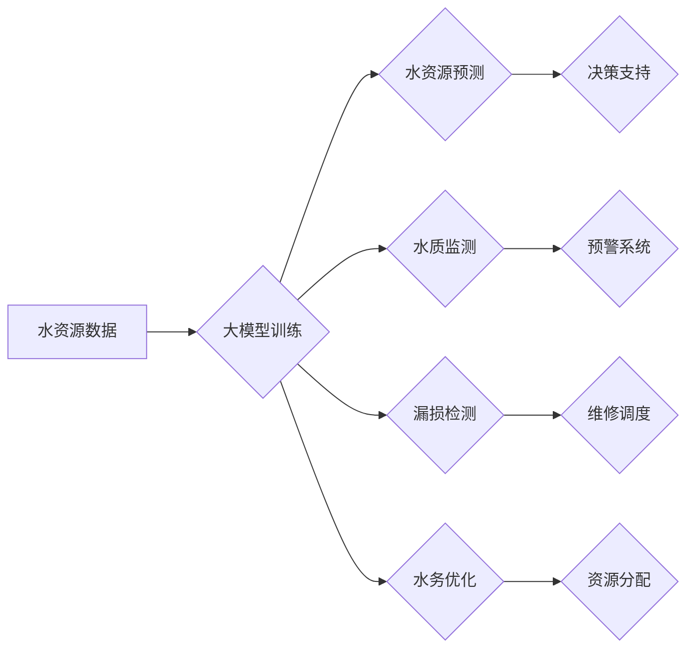

> 大模型，智能水务管理，水资源预测，水质监测，漏损检测，水务优化，深度学习，自然语言处理

## 1. 背景介绍

水是生命之源，也是社会经济发展的重要基础。随着全球人口增长和经济发展，水资源短缺问题日益突出，水污染问题也日益严峻。传统的水务管理模式面临着效率低下、数据孤岛、决策滞后等问题，难以满足现代社会对水资源管理的日益严苛的要求。

近年来，人工智能（AI）技术蓬勃发展，特别是大模型的出现，为水务管理领域带来了新的机遇。大模型凭借其强大的学习能力和泛化能力，能够有效处理海量水务数据，挖掘隐藏的模式和规律，为水务管理提供智能化解决方案。

## 2. 核心概念与联系

**2.1 智能水务管理**

智能水务管理是指利用物联网、云计算、大数据、人工智能等先进技术，对水资源进行全生命周期管理，实现水资源的科学利用、合理分配和可持续发展。

**2.2 大模型**

大模型是指在海量数据上训练的深度学习模型，具有强大的泛化能力和学习能力。常见的类型包括：

* **自然语言处理（NLP）大模型**: 例如GPT-3、BERT，擅长理解和生成文本。
* **计算机视觉（CV）大模型**: 例如YOLO、ResNet，擅长图像识别和分析。
* **多模态大模型**: 例如DALL-E 2，能够处理文本、图像、音频等多种数据类型。

**2.3 核心概念联系**

大模型可以应用于智能水务管理的各个环节，例如：

* **水资源预测**: 利用大模型分析历史水资源数据，预测未来水资源供需情况。
* **水质监测**: 利用大模型识别水质异常，及时预警水污染风险。
* **漏损检测**: 利用大模型分析水管运行数据，识别漏损点位。
* **水务优化**: 利用大模型优化水资源分配、供水管网调度等，提高水务管理效率。

**2.4  Mermaid 流程图**



## 3. 核心算法原理 & 具体操作步骤

**3.1 算法原理概述**

大模型在智能水务管理中的应用主要基于以下核心算法：

* **深度学习**: 用于提取水务数据中的特征和模式，例如卷积神经网络（CNN）用于水质图像识别，循环神经网络（RNN）用于水资源时间序列预测。
* **自然语言处理**: 用于处理水务文本数据，例如提取水文报告中的关键信息，分析用户反馈意见。
* **强化学习**: 用于优化水务管理决策，例如优化水资源分配策略，提高供水管网调度效率。

**3.2 算法步骤详解**

以水资源预测为例，大模型应用的具体步骤如下：

1. **数据收集**: 收集历史水资源数据，包括降雨量、蒸发量、地表水位、地下水位等。
2. **数据预处理**: 对数据进行清洗、转换、归一化等处理，使其适合模型训练。
3. **模型选择**: 选择合适的深度学习模型，例如长短期记忆网络（LSTM）或图卷积网络（GCN）。
4. **模型训练**: 利用训练数据训练模型，调整模型参数，使其能够准确预测未来水资源情况。
5. **模型评估**: 利用测试数据评估模型性能，例如使用均方误差（MSE）或平均绝对误差（MAE）指标。
6. **模型部署**: 将训练好的模型部署到生产环境中，用于实时预测未来水资源情况。

**3.3 算法优缺点**

**优点**:

* 能够处理海量数据，挖掘隐藏的模式和规律。
* 具有强大的泛化能力，能够应用于不同的水务场景。
* 可以实现自动化决策，提高水务管理效率。

**缺点**:

* 需要大量的训练数据，数据质量对模型性能影响较大。
* 模型训练成本较高，需要强大的计算资源。
* 模型解释性较差，难以理解模型决策过程。

**3.4 算法应用领域**

大模型在智能水务管理领域的应用领域广泛，包括：

* 水资源预测
* 水质监测
* 漏损检测
* 水务优化
* 水资源调度
* 水污染防治
* 水利工程设计

## 4. 数学模型和公式 & 详细讲解 & 举例说明

**4.1 数学模型构建**

水资源预测模型通常采用时间序列模型，例如ARIMA模型或LSTM模型。

**ARIMA模型**

ARIMA模型是一种经典的时间序列模型，其数学表达式为：

$$
y_t = c + \phi_1 y_{t-1} + \phi_2 y_{t-2} + ... + \phi_p y_{t-p} + \theta_1 \epsilon_{t-1} + \theta_2 \epsilon_{t-2} + ... + \theta_q \epsilon_{t-q} + \epsilon_t
$$

其中：

* $y_t$ 是时间t的观测值
* $c$ 是截距项
* $\phi_i$ 是自回归系数
* $\theta_i$ 是移动平均系数
* $p$ 是自回归阶数
* $q$ 是移动平均阶数
* $\epsilon_t$ 是白噪声

**LSTM模型**

LSTM模型是一种特殊的RNN模型，能够处理长序列数据，其数学表达式较为复杂，涉及到门控机制和记忆单元。

**4.2 公式推导过程**

ARIMA模型的公式推导过程涉及到时间序列的差分、自回归和移动平均的数学原理。LSTM模型的公式推导过程涉及到矩阵运算、激活函数和门控机制的数学原理。

**4.3 案例分析与讲解**

以水资源预测为例，可以使用ARIMA模型或LSTM模型对历史水资源数据进行预测。

* **ARIMA模型**: 可以根据历史水资源数据，确定ARIMA模型的参数，例如p、q值，然后利用模型预测未来水资源情况。
* **LSTM模型**: 可以将历史水资源数据作为输入，训练LSTM模型，然后利用模型预测未来水资源情况。

## 5. 项目实践：代码实例和详细解释说明

**5.1 开发环境搭建**

* 操作系统：Linux或Windows
* Python版本：3.7或以上
* 必要的库：TensorFlow、PyTorch、NumPy、Pandas等

**5.2 源代码详细实现**

以下是一个使用TensorFlow框架实现水资源预测的简单代码示例：

```python
import tensorflow as tf
from tensorflow.keras.models import Sequential
from tensorflow.keras.layers import LSTM, Dense

# 准备数据
# ...

# 定义模型
model = Sequential()
model.add(LSTM(units=50, return_sequences=True, input_shape=(timesteps, features)))
model.add(LSTM(units=50))
model.add(Dense(units=1))

# 编译模型
model.compile(loss='mean_squared_error', optimizer='adam')

# 训练模型
model.fit(X_train, y_train, epochs=100, batch_size=32)

# 评估模型
loss = model.evaluate(X_test, y_test)
print('Loss:', loss)

# 预测
predictions = model.predict(X_new)
```

**5.3 代码解读与分析**

* 代码首先导入必要的库。
* 然后准备数据，包括训练数据和测试数据。
* 定义一个LSTM模型，包含两层LSTM层和一层Dense层。
* 编译模型，使用均方误差作为损失函数，使用Adam优化器。
* 训练模型，指定训练轮数和批处理大小。
* 评估模型，计算测试集上的损失值。
* 预测新的数据，得到预测结果。

**5.4 运行结果展示**

运行结果包括模型训练过程中的损失值变化曲线，以及测试集上的损失值和预测结果。

## 6. 实际应用场景

**6.1 水资源预测**

大模型可以用于预测未来水资源供需情况，帮助水资源管理部门制定合理的用水计划，避免水资源短缺。

**6.2 水质监测**

大模型可以用于识别水质异常，例如污染物超标，及时预警水污染风险，保障水资源安全。

**6.3 漏损检测**

大模型可以分析水管运行数据，识别漏损点位，帮助水务部门及时维修，减少水资源浪费。

**6.4 未来应用展望**

大模型在智能水务管理领域的应用前景广阔，未来可能应用于：

* 智能水务调度
* 水资源优化分配
* 水污染防治
* 水利工程设计
* 水务风险评估

## 7. 工具和资源推荐

**7.1 学习资源推荐**

* **书籍**:
    * 深度学习
    * 自然语言处理
    * 人工智能
* **在线课程**:
    * Coursera
    * edX
    * Udacity

**7.2 开发工具推荐**

* **Python**: 
* **TensorFlow**: 
* **PyTorch**: 
* **Jupyter Notebook**: 

**7.3 相关论文推荐**

* **论文**:
    * [论文标题1](论文链接)
    * [论文标题2](论文链接)

## 8. 总结：未来发展趋势与挑战

**8.1 研究成果总结**

大模型在智能水务管理领域取得了显著成果，例如：

* 提高了水资源预测精度
* 增强了水质监测能力
* 优化了水务管理决策

**8.2 未来发展趋势**

未来大模型在智能水务管理领域的应用将朝着以下方向发展：

* 模型更加精准高效
* 应用场景更加广泛
* 数据安全和隐私保护更加重视

**8.3 面临的挑战**

大模型在智能水务管理领域也面临一些挑战：

* 数据获取和质量问题
* 模型解释性和可信度问题
* 算法安全性和可控性问题

**8.4 研究展望**

未来研究将重点关注以下方面：

* 开发更加高效、精准的大模型算法
* 提高模型的解释性和可信度
* 探索大模型在水务管理中的新应用场景


## 9. 附录：常见问题与解答

**9.1 Q1: 大模型训练需要多少数据？**

**A1:** 大模型训练需要海量数据，通常需要百万甚至数十亿条数据。

**9.2 Q2: 大模型训练成本高吗？**

**A2:** 大模型训练成本较高，需要强大的计算资源和时间。

**9.3 Q3: 大模型的决策过程是否透明？**

**A3:** 大模型的决策过程相对来说比较黑盒，难以完全理解模型的决策逻辑。


作者：禅与计算机程序设计艺术 / Zen and the Art of Computer Programming 
<end_of_turn>