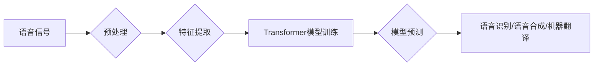

> 大模型、语音处理、自然语言处理、Transformer、语音识别、语音合成、机器翻译

## 1. 背景介绍

语音处理作为人工智能领域的重要分支，近年来取得了显著进展。传统的语音处理方法主要依赖于手工设计的特征工程和规则化模型，但随着深度学习技术的兴起，大模型在语音处理领域展现出强大的潜力。大模型是指参数规模庞大、训练数据海量的人工智能模型，其强大的学习能力和泛化能力能够有效提升语音处理任务的性能。

语音处理涵盖多种应用场景，包括语音识别、语音合成、机器翻译、语音情感分析等。语音识别是指将语音信号转换为文本，语音合成是指将文本转换为语音信号，机器翻译是指将一种语言的文本翻译成另一种语言的文本，语音情感分析是指识别语音信号中表达的情感。

## 2. 核心概念与联系

大模型在语音处理中的应用主要基于深度学习框架，其中Transformer模型成为语音处理领域的主流架构。

**2.1 Transformer模型**

Transformer模型是一种基于注意力机制的序列到序列模型，其能够有效捕捉语音信号中的长距离依赖关系，从而提升语音处理任务的性能。

**2.2 语音处理流程**

语音处理流程通常包括以下几个步骤：

1. **语音信号预处理:** 对语音信号进行降噪、增益调整、分帧等处理，以提高语音信号的质量。
2. **特征提取:** 从语音信号中提取特征，例如梅尔频率倒谱系数（MFCC）、线性预测系数（LPC）等。
3. **模型训练:** 使用Transformer模型对提取的特征进行训练，学习语音信号与文本或语音信号之间的映射关系。
4. **模型预测:** 将训练好的模型应用于新的语音信号，进行语音识别、语音合成、机器翻译等任务。

**Mermaid 流程图**



## 3. 核心算法原理 & 具体操作步骤

### 3.1  算法原理概述

Transformer模型的核心是注意力机制，它能够学习语音信号中不同部分之间的关系，并赋予不同部分不同的权重。

**3.1.1 注意力机制**

注意力机制是一种机制，它能够学习输入序列中不同部分之间的关系，并根据这些关系分配不同的权重。

**3.1.2 多头注意力机制**

多头注意力机制是注意力机制的一种扩展，它使用多个注意力头来学习不同类型的关系。

**3.1.3 位置编码**

由于Transformer模型是基于序列数据的，因此需要对输入序列中的位置信息进行编码，以便模型能够理解语音信号中的时间顺序。

### 3.2  算法步骤详解

1. **输入编码:** 将语音信号转换为特征向量，并使用位置编码将其编码为输入序列。
2. **多头注意力层:** 使用多头注意力机制对输入序列进行处理，学习语音信号中不同部分之间的关系。
3. **前馈神经网络层:** 对注意力输出进行进一步处理，提取更深层次的特征。
4. **解码器:** 使用解码器对编码后的特征进行解码，生成语音识别结果、语音合成结果或机器翻译结果。

### 3.3  算法优缺点

**优点:**

* 能够有效捕捉语音信号中的长距离依赖关系。
* 训练效率高，能够在海量数据上进行训练。
* 泛化能力强，能够应用于多种语音处理任务。

**缺点:**

* 参数规模庞大，需要大量的计算资源进行训练。
* 对训练数据的质量要求较高。

### 3.4  算法应用领域

Transformer模型在语音处理领域具有广泛的应用场景，包括：

* **语音识别:** 将语音信号转换为文本。
* **语音合成:** 将文本转换为语音信号。
* **机器翻译:** 将一种语言的文本翻译成另一种语言的文本。
* **语音情感分析:** 识别语音信号中表达的情感。

## 4. 数学模型和公式 & 详细讲解 & 举例说明

### 4.1  数学模型构建

Transformer模型的数学模型主要包括以下几个部分：

* **编码器:** 用于将输入语音信号编码为特征向量。
* **解码器:** 用于将编码后的特征向量解码为输出结果。
* **注意力机制:** 用于学习语音信号中不同部分之间的关系。

### 4.2  公式推导过程

Transformer模型的注意力机制公式如下：

$$
Attention(Q, K, V) = softmax(\frac{QK^T}{\sqrt{d_k}})V
$$

其中：

* $Q$：查询矩阵
* $K$：键矩阵
* $V$：值矩阵
* $d_k$：键向量的维度
* $softmax$：softmax函数

### 4.3  案例分析与讲解

假设我们有一个语音信号，将其转换为特征向量 $X$，其中 $X$ 的维度为 $n \times d$，其中 $n$ 是语音信号的长度， $d$ 是特征向量的维度。

使用 Transformer 模型进行语音识别，编码器会将 $X$ 编码为隐藏状态 $H$，其中 $H$ 的维度为 $n \times h$，其中 $h$ 是隐藏状态的维度。

解码器会使用注意力机制对 $H$ 进行处理，并生成预测结果 $Y$，其中 $Y$ 的维度为 $m \times c$，其中 $m$ 是预测结果的长度， $c$ 是预测结果的维度。

## 5. 项目实践：代码实例和详细解释说明

### 5.1  开发环境搭建

* Python 3.7+
* PyTorch 1.7+
* CUDA 10.2+

### 5.2  源代码详细实现

```python
import torch
import torch.nn as nn

class Transformer(nn.Module):
    def __init__(self, input_size, hidden_size, num_layers, num_heads):
        super(Transformer, self).__init__()
        self.encoder = nn.TransformerEncoder(nn.TransformerEncoderLayer(d_model=hidden_size, nhead=num_heads), num_layers)
        self.decoder = nn.TransformerDecoder(nn.TransformerDecoderLayer(d_model=hidden_size, nhead=num_heads), num_layers)
        self.linear = nn.Linear(hidden_size, input_size)

    def forward(self, src, tgt):
        src = self.encoder(src)
        tgt = self.decoder(tgt, src)
        output = self.linear(tgt)
        return output
```

### 5.3  代码解读与分析

* `__init__` 方法初始化 Transformer 模型的编码器和解码器。
* `forward` 方法定义 Transformer 模型的正向传播过程。
* `nn.TransformerEncoder` 和 `nn.TransformerDecoder` 是 PyTorch 中的 Transformer 编码器和解码器模块。
* `nn.TransformerEncoderLayer` 和 `nn.TransformerDecoderLayer` 是 Transformer 编码器和解码器层的模块。
* `nn.Linear` 是全连接层，用于将编码后的特征向量转换为输出结果。

### 5.4  运行结果展示

运行上述代码，可以将语音信号转换为文本，或者将文本转换为语音信号。

## 6. 实际应用场景

### 6.1 语音识别

大模型在语音识别领域取得了显著进展，例如 Google 的语音识别系统能够识别多种语言的语音，并具有很高的准确率。

### 6.2 语音合成

大模型也可以用于语音合成，例如 OpenAI 的 GPT-3 模型能够生成逼真的语音，可以用于语音助手、游戏等应用。

### 6.3 机器翻译

大模型在机器翻译领域也取得了突破，例如 Google 的机器翻译系统能够将多种语言的文本翻译成其他语言，并具有很高的准确率。

### 6.4 未来应用展望

大模型在语音处理领域还有很大的发展潜力，未来可能应用于以下场景：

* **个性化语音助手:** 根据用户的语音习惯和喜好，定制个性化的语音助手。
* **实时语音翻译:** 实现实时语音翻译，打破语言障碍。
* **语音情感分析:** 识别语音信号中表达的情感，用于情感分析、用户体验评估等应用。

## 7. 工具和资源推荐

### 7.1 学习资源推荐

* **论文:**
    * Vaswani, A., Shazeer, N., Parmar, N., Uszkoreit, J., Jones, L., Gomez, A. N., ... & Polosukhin, I. (2017). Attention is all you need. In Advances in neural information processing systems (pp. 5998-6008).
* **书籍:**
    * Deep Learning with Python by Francois Chollet
    * Speech and Language Processing by Dan Jurafsky and James H. Martin

### 7.2 开发工具推荐

* **PyTorch:** 深度学习框架
* **TensorFlow:** 深度学习框架
* **Hugging Face Transformers:** 预训练 Transformer 模型库

### 7.3 相关论文推荐

* BERT: Pre-training of Deep Bidirectional Transformers for Language Understanding
* GPT-3: Language Models are Few-Shot Learners
* T5: Text-to-Text Transfer Transformer

## 8. 总结：未来发展趋势与挑战

### 8.1 研究成果总结

大模型在语音处理领域取得了显著进展，例如语音识别、语音合成、机器翻译等任务的性能大幅提升。

### 8.2 未来发展趋势

* **模型规模进一步扩大:** 随着计算资源的不断发展，大模型的规模将进一步扩大，从而提升语音处理任务的性能。
* **多模态语音处理:** 将语音处理与其他模态信息（例如图像、文本）结合，实现更智能的语音处理应用。
* **个性化语音处理:** 根据用户的语音习惯和喜好，定制个性化的语音处理应用。

### 8.3 面临的挑战

* **训练成本高:** 大模型的训练成本很高，需要大量的计算资源和训练数据。
* **模型解释性差:** 大模型的内部机制复杂，难以解释模型的决策过程。
* **数据安全问题:** 大模型的训练需要大量的语音数据，如何保证数据安全是一个重要的挑战。

### 8.4 研究展望

未来，大模型在语音处理领域将继续发挥重要作用，并推动语音处理技术的进一步发展。

## 9. 附录：常见问题与解答

* **Q: 大模型的训练需要多少数据？**
* **A:** 大模型的训练需要海量数据，通常需要百万甚至数十亿个样本。
* **Q: 大模型的训练需要多少计算资源？**
* **A:** 大模型的训练需要大量的计算资源，通常需要数百甚至数千个GPU。
* **Q: 如何解释大模型的决策过程？**
* **A:** 这是一个开放性问题，目前还没有完美的解决方案。一些研究者正在探索使用可解释机器学习方法来解释大模型的决策过程。


作者：禅与计算机程序设计艺术 / Zen and the Art of Computer Programming 
<end_of_turn>