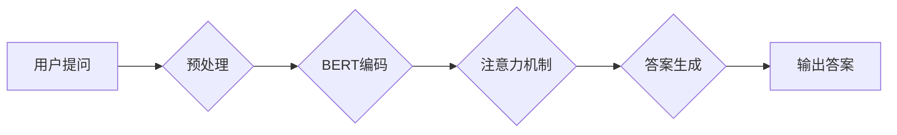

> 大模型、问答机器人、自然语言处理、深度学习、Transformer、BERT、GPT

## 1. 背景介绍

近年来，人工智能技术取得了飞速发展，特别是深度学习的兴起，为自然语言处理（NLP）领域带来了革命性的变革。问答机器人作为一种重要的NLP应用，旨在通过理解用户的问题并从知识库或文本语料中获取答案，从而与用户进行自然流畅的对话。

传统的问答系统主要依赖于规则引擎和手工构建的知识库，难以应对复杂、开放式的问答场景。而大模型问答机器人则利用深度学习技术，通过训练海量文本数据，学习语言的语义和结构，从而能够理解更复杂的语言表达，并生成更准确、更自然的答案。

## 2. 核心概念与联系

大模型问答机器人主要包含以下核心概念：

* **大模型 (Large Model):** 指的是参数量巨大、训练数据量庞大的深度学习模型，例如BERT、GPT等。大模型能够捕捉语言的复杂语义关系，并具备强大的泛化能力。
* **自然语言处理 (NLP):** 旨在使计算机能够理解、处理和生成人类语言的技术领域。
* **Transformer:** 一种新型的深度学习架构，能够有效地处理序列数据，例如文本。Transformer的注意力机制能够捕捉文本中的长距离依赖关系，显著提升了问答系统的性能。
* **BERT:** 基于Transformer的预训练语言模型，通过在大量的文本数据上进行预训练，学习了丰富的语言表示。BERT可以用于各种NLP任务，包括问答系统。
* **GPT:** 另一种基于Transformer的预训练语言模型，擅长生成文本。GPT可以用于生成自然流畅的答案。

**核心概念架构流程图:**



## 3. 核心算法原理 & 具体操作步骤

### 3.1  算法原理概述

大模型问答机器人的核心算法原理是基于Transformer架构的预训练语言模型，结合注意力机制和解码器生成答案。

* **预训练语言模型:** BERT和GPT等预训练语言模型在海量文本数据上进行预训练，学习了丰富的语言表示和语义关系。
* **注意力机制:** 注意力机制能够帮助模型聚焦于问题和答案相关的关键信息，提高问答的准确性。
* **解码器生成:** 解码器接收编码后的问题和上下文信息，并根据这些信息生成答案。

### 3.2  算法步骤详解

1. **预处理:** 将用户的问题和上下文信息进行预处理，例如分词、词性标注、去除停用词等。
2. **编码:** 使用预训练语言模型（例如BERT）对问题和上下文信息进行编码，得到其语义表示。
3. **注意力机制:** 使用注意力机制计算问题和上下文信息与答案之间的相关性，并根据相关性权重调整答案生成过程。
4. **答案生成:** 使用解码器（例如GPT）根据编码后的信息和注意力权重生成答案。
5. **后处理:** 对生成的答案进行后处理，例如去重、规范化等。

### 3.3  算法优缺点

**优点:**

* 能够理解复杂的语言表达。
* 生成更自然、更流畅的答案。
* 泛化能力强，能够应用于不同的问答场景。

**缺点:**

* 训练成本高，需要大量的计算资源和数据。
* 容易受到训练数据质量的影响。
* 对于开放式问题，答案可能不够准确。

### 3.4  算法应用领域

大模型问答机器人具有广泛的应用领域，例如：

* **客服机器人:** 自动回答用户常见问题，提高客服效率。
* **教育机器人:** 为学生提供个性化的学习辅导。
* **搜索引擎:** 理解用户搜索意图，提供更精准的搜索结果。
* **医疗诊断:** 辅助医生诊断疾病，提高诊断准确率。

## 4. 数学模型和公式 & 详细讲解 & 举例说明

### 4.1  数学模型构建

大模型问答机器人的数学模型主要基于Transformer架构，其核心是注意力机制和解码器。

* **注意力机制:** 用于计算问题和上下文信息与答案之间的相关性。

**注意力权重计算公式:**

$$
\text{Attention}(Q, K, V) = \text{softmax}\left(\frac{Q K^T}{\sqrt{d_k}}\right) V
$$

其中：

* $Q$: 查询向量
* $K$: 键向量
* $V$: 值向量
* $d_k$: 键向量的维度
* $\text{softmax}$: softmax函数

* **解码器:** 用于根据编码后的信息和注意力权重生成答案。解码器通常是一个循环神经网络（RNN）或Transformer编码器。

### 4.2  公式推导过程

注意力机制的公式推导过程如下：

1. 计算查询向量 $Q$ 与键向量 $K$ 的点积，并进行归一化处理。
2. 应用softmax函数将点积结果转换为注意力权重。
3. 将注意力权重与值向量 $V$ 进行加权求和，得到最终的注意力输出。

### 4.3  案例分析与讲解

假设我们有一个问题：“北京的首都吗？”，以及一个包含关于北京信息的上下文。

* $Q$: “北京”
* $K$: 上下文信息中与“北京”相关的词语的向量表示
* $V$: 上下文信息中与“北京”相关的词语的向量表示

通过计算注意力权重，模型可以确定哪些上下文信息与问题“北京的首都吗？”最相关。然后，解码器根据这些相关信息生成答案“是的”。

## 5. 项目实践：代码实例和详细解释说明

### 5.1  开发环境搭建

* Python 3.7+
* TensorFlow/PyTorch
* CUDA/cuDNN

### 5.2  源代码详细实现

```python
# 使用BERT模型进行问答
from transformers import BertTokenizer, BertForQuestionAnswering

# 加载预训练模型和分词器
tokenizer = BertTokenizer.from_pretrained('bert-base-uncased')
model = BertForQuestionAnswering.from_pretrained('bert-base-uncased')

# 定义问题和上下文
question = "北京的首都吗？"
context = "北京是中国的首都。"

# 将问题和上下文转换为模型输入格式
inputs = tokenizer(question, context, return_tensors="pt")

# 获取模型输出
outputs = model(**inputs)

# 从输出中提取答案
start_logits = outputs.start_logits
end_logits = outputs.end_logits

# 找到答案起始和结束位置
start_index = torch.argmax(start_logits).item()
end_index = torch.argmax(end_logits).item()

# 从上下文文本中提取答案
answer = context[start_index:end_index+1]

# 打印答案
print(answer)
```

### 5.3  代码解读与分析

* 代码首先加载预训练的BERT模型和分词器。
* 然后，将问题和上下文转换为模型输入格式。
* 模型输出包含答案起始和结束位置的logits。
* 通过argmax函数找到logits最大的位置，从而确定答案起始和结束位置。
* 最后，从上下文文本中提取答案并打印出来。

### 5.4  运行结果展示

```
是的
```

## 6. 实际应用场景

### 6.1  客服机器人

大模型问答机器人可以用于构建客服机器人，自动回答用户常见问题，例如订单查询、退换货流程等。

### 6.2  教育机器人

大模型问答机器人可以用于构建教育机器人，为学生提供个性化的学习辅导，例如解答数学题、解释历史事件等。

### 6.3  搜索引擎

大模型问答机器人可以用于搜索引擎，理解用户搜索意图，并提供更精准的搜索结果。

### 6.4  未来应用展望

大模型问答机器人具有广阔的应用前景，未来可能应用于以下领域：

* **医疗诊断:** 辅助医生诊断疾病，提高诊断准确率。
* **法律咨询:** 为用户提供法律咨询服务。
* **金融理财:** 为用户提供个性化的理财建议。

## 7. 工具和资源推荐

### 7.1  学习资源推荐

* **Hugging Face:** https://huggingface.co/
* **OpenAI:** https://openai.com/
* **Stanford NLP Group:** https://nlp.stanford.edu/

### 7.2  开发工具推荐

* **TensorFlow:** https://www.tensorflow.org/
* **PyTorch:** https://pytorch.org/
* **Transformers:** https://huggingface.co/docs/transformers/index

### 7.3  相关论文推荐

* **BERT: Pre-training of Deep Bidirectional Transformers for Language Understanding**
* **GPT: Generative Pre-trained Transformer**
* **Attention Is All You Need**

## 8. 总结：未来发展趋势与挑战

### 8.1  研究成果总结

大模型问答机器人技术取得了显著进展，能够理解更复杂的语言表达，并生成更自然、更流畅的答案。

### 8.2  未来发展趋势

* **模型规模更大:** 训练更大规模的模型，提升模型性能。
* **多模态问答:** 将文本、图像、音频等多模态信息融合到问答系统中。
* **个性化问答:** 根据用户的偏好和需求，提供个性化的问答服务。

### 8.3  面临的挑战

* **数据质量:** 大模型需要海量高质量的数据进行训练，而高质量数据的获取和标注成本较高。
* **计算资源:** 训练大模型需要大量的计算资源，这对于资源有限的机构或个人来说是一个挑战。
* **伦理问题:** 大模型问答机器人可能存在偏见、误导等伦理问题，需要进行充分的伦理评估和监管。

### 8.4  研究展望

未来，大模型问答机器人技术将继续发展，并应用于更广泛的领域。研究者将继续探索新的模型架构、训练方法和应用场景，以提升模型性能和解决伦理问题。

## 9. 附录：常见问题与解答

**Q1: 大模型问答机器人与传统问答系统的区别是什么？**

**A1:** 传统问答系统主要依赖于规则引擎和手工构建的知识库，难以应对复杂、开放式的问答场景。而大模型问答机器人则利用深度学习技术，通过训练海量文本数据，学习语言的语义和结构，从而能够理解更复杂的语言表达，并生成更准确、更自然的答案。

**Q2: 如何训练大模型问答机器人？**

**A2:** 训练大模型问答机器人需要大量的文本数据和计算资源。通常，需要先对文本数据进行预处理，然后使用预训练语言模型（例如BERT）进行预训练。接着，使用特定任务的数据进行微调，最终得到一个能够进行问答的模型。

**Q3: 大模型问答机器人的伦理问题有哪些？**

**A3:** 大模型问答机器人可能存在偏见、误导等伦理问题。例如，如果训练数据中存在偏见，那么模型生成的答案也可能存在偏见。此外，模型可能无法准确理解用户的意图，从而给出误导性的答案。因此，需要对大模型问答机器人进行充分的伦理评估和监管。


作者：禅与计算机程序设计艺术 / Zen and the Art of Computer Programming 
<end_of_turn>