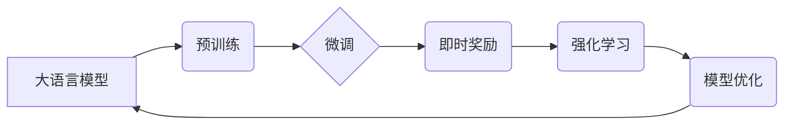

> 大语言模型、即时奖励、强化学习、Transformer、预训练、微调、应用场景

## 1. 背景介绍

近年来，大语言模型（LLM）在自然语言处理领域取得了显著进展，展现出强大的文本生成、理解和翻译能力。这些模型通常基于Transformer架构，通过预训练和微调的方式学习语言的复杂模式。然而，传统的训练方法主要依赖于离线监督学习，缺乏对模型行为的实时反馈和调整机制。

即时奖励机制的引入为LLM训练带来了新的思路。它借鉴了强化学习的思想，将奖励信号作为模型训练的指导，引导模型朝着更符合预期目标的方向学习。这种方法能够有效地解决传统监督学习方法难以捕捉的细粒度任务和长序列依赖问题，并提升模型的泛化能力和鲁棒性。

## 2. 核心概念与联系

**2.1 核心概念**

* **大语言模型 (LLM):** 
   - 拥有大量参数的深度神经网络，能够理解和生成人类语言。
   - 常用 Transformer 架构，例如 GPT、BERT、T5 等。
* **强化学习 (RL):** 
   - 一种机器学习方法，通过与环境交互，学习最优策略以最大化奖励。
   - 包含状态、动作、奖励、策略等核心概念。
* **即时奖励:** 
   - 在训练过程中，实时根据模型输出的质量给予奖励信号，引导模型学习。
   - 与传统的离线监督学习相比，更能反映模型在实际应用中的表现。

**2.2 架构关系**



## 3. 核心算法原理 & 具体操作步骤

**3.1 算法原理概述**

即时奖励机制的核心思想是将强化学习的思想应用于LLM的训练过程中。

1. **环境:**  LLM的输入文本可以看作是环境的状态，输出文本是模型的动作。
2. **奖励函数:**  根据模型输出的质量，设计一个奖励函数来评估模型的表现。奖励函数可以基于多种指标，例如BLEU分数、ROUGE分数、人类评价等。
3. **策略梯度:**  利用策略梯度算法，根据奖励信号更新模型的参数，引导模型朝着更高的奖励方向学习。

**3.2 算法步骤详解**

1. **预训练:**  使用大量的文本数据对LLM进行预训练，学习语言的语法和语义知识。
2. **微调:**  根据具体的任务需求，使用少量标注数据对LLM进行微调，使其能够更好地完成目标任务。
3. **即时奖励:**  在微调过程中，实时收集用户反馈或其他评估指标作为奖励信号，并将其反馈给模型。
4. **策略更新:**  利用策略梯度算法，根据奖励信号更新模型的参数，优化模型的策略。
5. **迭代训练:**  重复步骤3和4，直到模型达到预期的性能水平。

**3.3 算法优缺点**

* **优点:**
    - 能够有效地解决传统监督学习方法难以捕捉的细粒度任务和长序列依赖问题。
    - 提升模型的泛化能力和鲁棒性。
    - 能够更好地适应用户需求和动态变化的环境。
* **缺点:**
    - 需要设计合适的奖励函数，这往往是一个复杂的任务。
    - 训练过程可能比较耗时和资源密集。

**3.4 算法应用领域**

* **对话系统:**  训练更自然、更流畅的对话机器人。
* **文本生成:**  生成高质量的新闻文章、小说、诗歌等文本。
* **机器翻译:**  提高机器翻译的准确性和流畅度。
* **代码生成:**  自动生成代码，提高开发效率。

## 4. 数学模型和公式 & 详细讲解 & 举例说明

**4.1 数学模型构建**

假设我们有一个大语言模型 $M$，它接受一个输入序列 $x$，并输出一个预测序列 $y$。我们的目标是最大化模型在给定奖励函数 $R(y, x)$ 下的累积奖励。

我们可以使用强化学习的Bellman方程来描述模型的价值函数 $V(x)$：

$$V(x) = \max_{\pi} \mathbb{E}_{\tau \sim \pi} \left[ \sum_{t=0}^{T} \gamma^t R(y_t, x_t) \right]$$

其中：

* $\pi$ 是模型的策略，即在给定输入 $x$ 时选择输出 $y$ 的概率分布。
* $\tau$ 是一个轨迹，由一系列状态 $x_t$ 和动作 $y_t$ 组成。
* $\gamma$ 是折扣因子，控制未来奖励的权重。
* $T$ 是轨迹的长度。

**4.2 公式推导过程**

策略梯度算法的目标是找到一个策略 $\pi$，使得模型的价值函数 $V(x)$ 最大化。我们可以使用梯度上升法来更新策略参数：

$$\theta_{t+1} = \theta_t + \alpha \nabla_{\theta} \mathbb{E}_{\tau \sim \pi} \left[ \sum_{t=0}^{T} \gamma^t R(y_t, x_t) \right]$$

其中：

* $\theta$ 是策略参数。
* $\alpha$ 是学习率。

**4.3 案例分析与讲解**

假设我们训练一个文本生成模型，目标是生成流畅、语法正确的句子。我们可以设计一个奖励函数，根据生成的句子的BLEU分数来评估模型的表现。

当模型生成一个BLEU分数较高的句子时，给予较高的奖励；反之，给予较低的奖励。通过策略梯度算法，模型会逐渐学习到生成高BLEU分数句子的策略。

## 5. 项目实践：代码实例和详细解释说明

**5.1 开发环境搭建**

* Python 3.7+
* PyTorch 1.7+
* Transformers 4.0+

**5.2 源代码详细实现**

```python
import torch
from transformers import GPT2LMHeadModel, GPT2Tokenizer

# 加载预训练模型和词典
model = GPT2LMHeadModel.from_pretrained('gpt2')
tokenizer = GPT2Tokenizer.from_pretrained('gpt2')

# 定义奖励函数
def reward_function(text):
    # 使用BLEU分数评估文本质量
    # ...
    return score

# 训练循环
for epoch in range(num_epochs):
    for batch in data_loader:
        # 前向传播
        outputs = model(input_ids=batch['input_ids'], labels=batch['labels'])
        loss = outputs.loss

        # 计算奖励
        rewards = [reward_function(text) for text in model.generate(batch['input_ids'])]

        # 反向传播
        loss.backward()
        optimizer.step()

        # 打印训练进度
        print(f'Epoch: {epoch}, Loss: {loss.item()}')
```

**5.3 代码解读与分析**

* 代码首先加载预训练的GPT-2模型和词典。
* 定义了一个奖励函数，用于评估模型生成的文本质量。
* 训练循环中，模型首先进行前向传播，计算损失。
* 然后计算奖励信号，并将其反馈给模型进行反向传播和参数更新。

**5.4 运行结果展示**

训练完成后，可以评估模型的性能，例如使用BLEU分数来衡量生成的文本质量。

## 6. 实际应用场景

**6.1 对话系统**

* 使用即时奖励机制训练对话机器人，使其能够更好地理解用户意图，并生成更自然、更流畅的回复。

**6.2 文本生成**

* 训练文本生成模型，例如新闻文章、小说、诗歌等，并使用奖励函数来引导模型生成高质量的文本。

**6.3 机器翻译**

* 训练机器翻译模型，并使用奖励函数来评估翻译质量，提高翻译的准确性和流畅度。

**6.4 代码生成**

* 训练代码生成模型，并使用奖励函数来评估生成的代码质量，提高代码的正确性和可读性。

**6.5 未来应用展望**

* 结合其他人工智能技术，例如知识图谱和推理引擎，构建更智能、更强大的应用。
* 应用于更广泛的领域，例如教育、医疗、金融等。

## 7. 工具和资源推荐

**7.1 学习资源推荐**

* **书籍:**
    * 《Reinforcement Learning: An Introduction》 by Sutton and Barto
    * 《Deep Reinforcement Learning Hands-On》 by Maxim Lapan
* **在线课程:**
    * Coursera: Reinforcement Learning Specialization
    * Udacity: Deep Reinforcement Learning Nanodegree

**7.2 开发工具推荐**

* **PyTorch:** 深度学习框架
* **TensorFlow:** 深度学习框架
* **OpenAI Gym:** 强化学习环境

**7.3 相关论文推荐**

* **Proximal Policy Optimization Algorithms**
* **Trust Region Policy Optimization**
* **Deep Reinforcement Learning with Double Q-Learning**

## 8. 总结：未来发展趋势与挑战

**8.1 研究成果总结**

即时奖励机制为LLM的训练带来了新的思路，有效地提升了模型的性能和泛化能力。

**8.2 未来发展趋势**

* **更有效的奖励函数设计:**  探索更精准、更有效的奖励函数设计方法，以更好地指导模型学习。
* **多模态强化学习:**  将强化学习与其他模态数据（例如图像、音频）结合，训练更全面的LLM。
* **联邦学习:**  利用联邦学习技术，在保护用户隐私的前提下训练更强大的LLM。

**8.3 面临的挑战**

* **奖励函数设计复杂:**  设计合适的奖励函数是一个复杂的任务，需要深入理解任务需求和模型行为。
* **训练过程耗时:**  训练大型LLM模型需要大量的计算资源和时间。
* **伦理问题:**  LLM的应用可能带来一些伦理问题，例如生成虚假信息、偏见和歧视等，需要引起重视和解决。

**8.4 研究展望**

未来，我们将继续探索即时奖励机制在LLM训练中的应用，并致力于解决上述挑战，推动LLM技术的发展和应用。

## 9. 附录：常见问题与解答

**9.1 如何设计奖励函数？**

奖励函数的设计需要根据具体的任务需求和模型行为进行设计。一般来说，奖励函数应该能够准确地反映模型输出的质量，并引导模型朝着更符合预期目标的方向学习。

**9.2 训练过程需要多长时间？**

训练大型LLM模型需要大量的计算资源和时间，具体时间取决于模型规模、数据集大小和硬件配置等因素。

**9.3 如何解决LLM的伦理问题？**

LLM的应用可能带来一些伦理问题，例如生成虚假信息、偏见和歧视等。我们需要加强对LLM伦理问题的研究和讨论，并制定相应的规范和制度，确保LLM技术安全、可控和可持续发展。


作者：禅与计算机程序设计艺术 / Zen and the Art of Computer Programming 
<end_of_turn>