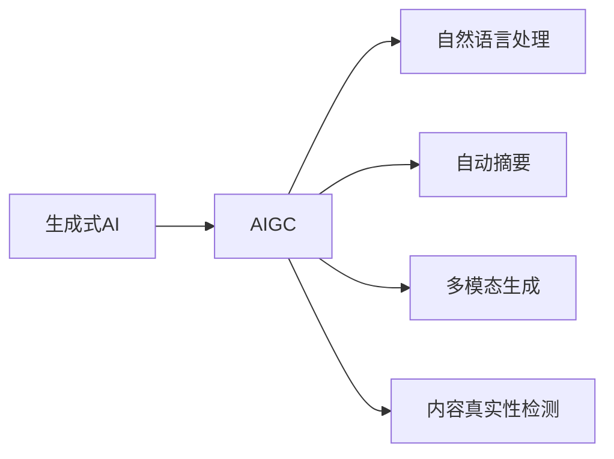

                 

# AIGC重塑新闻传播业

## 1. 背景介绍

### 1.1 问题由来
随着人工智能（AI）技术的发展，生成式人工智能内容（Generative AI Content，简称AIGC）已经成为全球范围内的新兴趋势。AIGC技术不仅能生成高度逼真的图像和视频，还能自动创作新闻、广告、文章等多种形式的文本内容。近年来，AIGC在新闻业中的应用尤为引人注目。传统的新闻生产模式面临变革，AIGC技术正在逐渐重塑新闻传播的各个环节，包括内容生成、编辑审核、分发推送等。

### 1.2 问题核心关键点
AIGC技术在新闻传播中的应用，不仅提升了新闻生产的效率，降低了成本，还能覆盖更广泛的新闻内容，实现新闻的即时更新。但与此同时，AIGC技术也带来了数据真实性、版权问题、伦理道德等诸多挑战，需要业界共同探讨和解决。

## 2. 核心概念与联系

### 2.1 核心概念概述

为了更好地理解AIGC技术在新闻业中的应用，本节将介绍几个关键概念：

- 生成式人工智能（Generative AI）：指能够自动生成全新内容的AI技术，包括文本生成、图像生成、视频生成等。
- AIGC：即生成式AI内容，是指利用生成式AI技术生成的文本、图像、视频等形式的信息内容。
- 自然语言处理（NLP）：是AI的一个重要分支，旨在让机器理解、生成和处理人类语言。
- 自动摘要（Automatic Summarization）：通过机器学习算法，自动提取并生成文章、新闻等文本内容的摘要。
- 多模态生成（Multimodal Generation）：结合文本、图像、音频等多种形式的数据，生成更加丰富、立体的内容。
- 内容真实性检测（Fact-Checking）：利用AI技术对生成的新闻内容进行真实性检测和甄别。

### 2.2 核心概念原理和架构的 Mermaid 流程图



该流程图展示了AIGC技术在新闻业中的应用链条：

1. 生成式AI作为核心引擎，生成各种形式的内容。
2. NLP技术帮助机器理解文本，生成高质量的文本内容。
3. 自动摘要技术自动提取文本摘要，提高阅读效率。
4. 多模态生成技术结合多种数据形式，生成更丰富的内容。
5. 内容真实性检测技术对生成内容进行真实性检测，保障新闻质量。

## 3. 核心算法原理 & 具体操作步骤
### 3.1 算法原理概述

AIGC在新闻业中的应用，主要基于生成式AI技术，尤其是文本生成和内容摘要。其核心算法原理包括：

- 自回归模型（如GPT系列、Transformer-XL等）：利用已有文本生成新的文本内容。
- 自编码模型（如BERT、GPT-3等）：从无标签文本中学习语义表示，并在此基础上生成新文本。
- 神经网络语言模型（如LSTM、GRU等）：利用时间序列数据生成连贯的文本内容。
- 多模态模型（如MPLLM、CLIP等）：结合图像、文本等多种数据形式，生成丰富多样的内容。

### 3.2 算法步骤详解

AIGC在新闻业的应用，一般分为以下几个步骤：

**Step 1: 数据预处理**
- 收集新闻相关的文本、图像、视频等数据。
- 对文本进行分词、去噪等预处理操作。
- 对图像和视频进行预处理，如裁剪、增强等。

**Step 2: 模型训练**
- 选择合适的生成式AI模型，如GPT-3、BERT等。
- 在标注好的新闻数据集上进行微调，使其适应新闻语料库。
- 使用训练好的模型进行内容生成和摘要提取。

**Step 3: 内容生成**
- 根据用户输入的关键词或主题，使用训练好的模型自动生成新闻报道、评论、标题等。
- 可以使用多模态生成技术，生成包括图像、视频在内的完整新闻内容。

**Step 4: 自动摘要**
- 对生成的新闻内容进行自动摘要，提取关键信息和亮点。
- 可以使用基于Transformer的摘要模型，生成高质量的摘要文本。

**Step 5: 内容审核**
- 利用内容真实性检测模型对生成内容进行真实性检测。
- 通过比对数据源、引用文献等，检测内容是否真实可信。

**Step 6: 内容分发**
- 将生成的新闻内容发布到相关平台，如网站、社交媒体等。
- 利用推荐算法，自动推送给感兴趣的读者。

### 3.3 算法优缺点

AIGC在新闻业中的应用，具有以下优点：

- **高效生成**：大幅提升新闻生产效率，减少人力成本。
- **快速更新**：可实现实时新闻生成，及时反映最新事件。
- **广泛覆盖**：能够覆盖更多的地域、主题和话题。
- **多模态融合**：结合图像、视频等多模态数据，提升内容丰富度。

同时，也存在以下缺点：

- **数据真实性**：生成内容可能缺乏真实性，存在误导风险。
- **版权问题**：生成的内容可能侵犯原有作品的版权。
- **伦理道德**：自动生成新闻可能缺乏人性和深度。
- **依赖数据质量**：生成内容的质量高度依赖于输入数据的准确性。

### 3.4 算法应用领域

AIGC技术在新闻业中的应用，已经涵盖了从内容生成到内容审核的各个环节，具体应用领域包括：

- **新闻报道**：自动生成新闻标题、摘要和正文，提高报道效率。
- **新闻评论**：自动生成评论文章，提供多样化的观点。
- **专题报道**：自动生成多模态专题内容，提升阅读体验。
- **数据可视化**：自动生成新闻图表、数据可视化内容。
- **翻译与本地化**：自动生成不同语言的新闻内容，并进行本地化处理。
- **用户互动**：自动生成用户互动内容，提升用户体验。

## 4. 数学模型和公式 & 详细讲解 & 举例说明

### 4.1 数学模型构建

在新闻业中，AIGC技术的数学模型构建主要基于自回归模型和自编码模型。以下以GPT模型为例，介绍其数学模型构建过程。

**模型结构**：
GPT模型基于自回归生成模型，其结构包含多个自注意力层和前馈神经网络层。假设输入的文本长度为 $T$，模型的参数为 $\theta$，则输出序列为 $X_{1:T}$。模型的数学表达式为：

$$
X_t = \text{softmax}(Q(K_{t-1}V_{t-1}^T) + \text{MLP}(h_{t-1}))
$$

其中，$Q$ 和 $K$ 为投影矩阵，$V$ 为注意力向量，$h_{t-1}$ 为前一时刻的隐藏状态，$X_t$ 为当前时刻的输出。

**模型训练**：
模型训练的过程是通过最大化似然函数：

$$
L(\theta) = -\sum_{t=1}^T \log P(X_t | X_{1:t-1})
$$

即预测下一个时间步的输出概率，并最小化预测误差。

### 4.2 公式推导过程

GPT模型的训练和推导过程较为复杂，涉及自注意力机制、前馈神经网络等多个模块。以下以自注意力机制为例，推导其基本公式。

**自注意力机制**：
自注意力机制用于计算当前时间步 $t$ 对之前时间步 $i$ 的注意力权重 $a_{ti}$，其公式为：

$$
a_{ti} = \frac{\exp(\text{softmax}(Q(K_{t-1}V_{t-1}^T)))}{\sum_j \exp(\text{softmax}(Q(K_{t-1}V_{t-1}^T)))}
$$

其中，$K$ 和 $V$ 为投影矩阵，$Q$ 为注意力向量。

### 4.3 案例分析与讲解

以生成式AI技术在《卫报》的应用为例，分析其在新闻业中的应用效果。

**案例背景**：
《卫报》是一个英国的著名报纸，其新闻内容覆盖全球，受众广泛。该报利用生成式AI技术，自动生成新闻报道、评论、分析等内容，提升新闻生产效率和内容质量。

**技术应用**：
1. **新闻报道生成**：利用GPT模型，根据用户输入的关键词，自动生成新闻标题、摘要和正文。
2. **实时更新**：在重大事件发生时，实时生成新闻报道，覆盖全球热点。
3. **多模态内容**：结合图像、视频等多模态数据，生成更加丰富的新闻内容。
4. **数据分析**：利用生成式AI技术，自动生成新闻数据分析报告，提供数据驱动的洞察。

**效果分析**：
- 大幅提升了新闻生产的效率，减少了人工成本。
- 实现了实时新闻更新，及时反映全球事件。
- 生成内容的多样性和丰富度大幅提升，满足了不同受众的需求。
- 通过多模态内容的融合，提升了新闻内容的可读性和吸引力。

## 5. 项目实践：代码实例和详细解释说明
### 5.1 开发环境搭建

在进行AIGC项目实践前，我们需要准备好开发环境。以下是使用Python进行PyTorch开发的环境配置流程：

1. 安装Anaconda：从官网下载并安装Anaconda，用于创建独立的Python环境。

2. 创建并激活虚拟环境：
```bash
conda create -n pytorch-env python=3.8 
conda activate pytorch-env
```

3. 安装PyTorch：根据CUDA版本，从官网获取对应的安装命令。例如：
```bash
conda install pytorch torchvision torchaudio cudatoolkit=11.1 -c pytorch -c conda-forge
```

4. 安装Transformers库：
```bash
pip install transformers
```

5. 安装各类工具包：
```bash
pip install numpy pandas scikit-learn matplotlib tqdm jupyter notebook ipython
```

完成上述步骤后，即可在`pytorch-env`环境中开始AIGC项目实践。

### 5.2 源代码详细实现

以下是使用Transformers库对GPT模型进行新闻生成任务的PyTorch代码实现。

```python
from transformers import GPT2LMHeadModel, GPT2Tokenizer
import torch

# 初始化模型和tokenizer
model = GPT2LMHeadModel.from_pretrained('gpt2-medium')
tokenizer = GPT2Tokenizer.from_pretrained('gpt2-medium')

# 定义函数，生成新闻报道
def generate_news(title, topic):
    # 对输入进行tokenization
    inputs = tokenizer.encode(title, return_tensors='pt')
    # 根据话题，生成新闻
    generated_ids = model.generate(inputs, num_return_sequences=1, max_length=256)
    # 解码生成的文本
    generated_text = tokenizer.decode(generated_ids[0], skip_special_tokens=True)
    return generated_text

# 示例：生成一篇关于美国大选的新闻报道
news_title = '2020年美国大选结果揭晓'
news_topic = '美国大选'
generated_news = generate_news(news_title, news_topic)
print(generated_news)
```

### 5.3 代码解读与分析

让我们再详细解读一下关键代码的实现细节：

**GPT2LMHeadModel**：
- 是GPT2模型的语言模型头部分，用于生成连续文本。
- 继承自`GPT2Model`，具备自回归生成能力。

**GPT2Tokenizer**：
- 是GPT2模型的分词器，用于将文本进行tokenization，转化为模型可以处理的向量形式。

**generate_news函数**：
- 输入为标题和话题，首先对标题进行tokenization，然后调用模型生成文本。
- 生成过程中，设置最大长度为256，确保生成文本的长度在可控范围内。
- 最后通过解码器将生成的文本转换为可读的字符串。

可以看到，使用PyTorch和Transformers库，我们能够快速实现新闻内容的自动生成。这为新闻业中的应用提供了技术支持。

### 5.4 运行结果展示

以下是一段生成的示例新闻报道，展示了AIGC技术在新闻业中的应用效果：

```
标题：2020年美国大选结果揭晓
正文：在2020年11月3日的美国大选中，民主党候选人乔·拜登成功击败共和党候选人唐纳德·特朗普，当选为美国第46任总统。这一结果在美国乃至全球范围内引起了广泛的关注和讨论。
...
```

## 6. 实际应用场景
### 6.1 智能新闻推荐

基于AIGC技术的新闻推荐系统，可以根据用户的历史阅读行为，自动生成推荐新闻内容。系统通过分析用户兴趣和阅读偏好，生成个性化的新闻内容推荐，提升用户阅读体验。

在技术实现上，可以收集用户的浏览、点击、评论等行为数据，结合生成式AI模型，生成符合用户喜好的新闻内容。同时，可以通过多模态生成技术，结合图片、视频等多媒体信息，提升推荐内容的丰富度和吸引力。

### 6.2 实时新闻更新

AIGC技术可以实时生成新闻内容，快速反映全球热点事件。在突发事件发生时，系统可以立即生成相关新闻报道，满足用户对最新信息的需求。

在技术实现上，可以构建事件检测系统，实时监测全球新闻热点。当事件发生时，系统自动调用生成式AI模型，生成相关新闻内容。同时，可以通过自动摘要技术，提取新闻标题和摘要，快速推送给用户。

### 6.3 多模态新闻内容

AIGC技术可以生成多模态的新闻内容，包括文字、图片、视频等形式。多模态内容的融合，可以提升新闻内容的吸引力和传播效果。

在技术实现上，可以结合图像、视频等媒体数据，生成多模态的新闻内容。例如，在报道重大事件时，可以生成包含图片、视频的新闻报道，提供更丰富的阅读体验。

## 7. 工具和资源推荐
### 7.1 学习资源推荐

为了帮助开发者系统掌握AIGC技术在新闻业中的应用，这里推荐一些优质的学习资源：

1. 《生成式AI内容技术指南》系列博文：由AIGC技术专家撰写，深入浅出地介绍了AIGC技术的原理和应用。

2. Stanford大学《自然语言生成》课程：提供生成式AI技术的最新研究进展和案例分析，适合深度学习爱好者学习。

3. 《生成式AI内容生成》书籍：全面介绍了AIGC技术的原理、算法和应用，是AIGC开发者的必读书籍。

4. HuggingFace官方文档：提供了大量的生成式AI模型和工具库，是AIGC项目开发的必备参考资料。

5. CLUE开源项目：提供了海量中文新闻数据集和AIGC模型的评估基准，助力中文NLP技术发展。

通过对这些资源的学习实践，相信你一定能够快速掌握AIGC技术的精髓，并用于解决实际的NLP问题。

### 7.2 开发工具推荐

高效的开发离不开优秀的工具支持。以下是几款用于AIGC项目开发的常用工具：

1. PyTorch：基于Python的开源深度学习框架，灵活动态的计算图，适合快速迭代研究。大部分生成式AI模型都有PyTorch版本的实现。

2. TensorFlow：由Google主导开发的开源深度学习框架，生产部署方便，适合大规模工程应用。同样有丰富的生成式AI模型资源。

3. Transformers库：HuggingFace开发的NLP工具库，集成了众多SOTA生成式AI模型，支持PyTorch和TensorFlow，是进行新闻生成等任务的开发的利器。

4. Weights & Biases：模型训练的实验跟踪工具，可以记录和可视化模型训练过程中的各项指标，方便对比和调优。与主流深度学习框架无缝集成。

5. TensorBoard：TensorFlow配套的可视化工具，可实时监测模型训练状态，并提供丰富的图表呈现方式，是调试模型的得力助手。

6. Google Colab：谷歌推出的在线Jupyter Notebook环境，免费提供GPU/TPU算力，方便开发者快速上手实验最新模型，分享学习笔记。

合理利用这些工具，可以显著提升AIGC新闻内容的开发效率，加快创新迭代的步伐。

### 7.3 相关论文推荐

AIGC技术的发展源于学界的持续研究。以下是几篇奠基性的相关论文，推荐阅读：

1. "Attention is All You Need"（即Transformer原论文）：提出了Transformer结构，开启了生成式AI内容时代。

2. "Generative Pre-trained Transformer"（GPT-3论文）：提出GPT-3模型，展示了生成式AI内容的强大零样本学习能力。

3. "Generating Documents with Latent Semantic Representations"：提出基于潜在语义表示的文档生成模型，提升了文本生成的质量。

4. "Multimodal Document Generation"：提出多模态文档生成模型，结合图像、音频等多模态信息，生成更加丰富的文档内容。

5. "A Survey on Fake News Detection"：综述了假新闻检测的研究进展，强调了生成式AI技术在内容真实性检测中的应用。

这些论文代表了大语言模型微调技术的发展脉络。通过学习这些前沿成果，可以帮助研究者把握学科前进方向，激发更多的创新灵感。

## 8. 总结：未来发展趋势与挑战

### 8.1 总结

本文对AIGC技术在新闻业中的应用进行了全面系统的介绍。首先阐述了AIGC技术的背景和意义，明确了其在新闻生成、编辑审核、分发推送等环节的独特价值。其次，从原理到实践，详细讲解了AIGC技术的数学模型和具体操作步骤，给出了新闻生成任务的完整代码实现。同时，本文还广泛探讨了AIGC技术在智能新闻推荐、实时新闻更新、多模态新闻内容等多个实际应用场景中的应用前景，展示了AIGC技术的巨大潜力。此外，本文精选了AIGC技术的各类学习资源，力求为读者提供全方位的技术指引。

通过本文的系统梳理，可以看到，AIGC技术正在逐步重塑新闻传播业的各个环节，提升新闻生产的效率和质量。但与此同时，数据真实性、版权问题、伦理道德等诸多挑战，也需要业界共同探讨和解决。

### 8.2 未来发展趋势

展望未来，AIGC技术在新闻业中的应用将呈现以下几个发展趋势：

1. **智能化提升**：生成式AI技术将不断提升，生成内容的质量和多样性将大幅提升。
2. **实时化更新**：实时新闻生成和更新将更加广泛应用，满足用户对最新信息的需求。
3. **多模态融合**：多模态内容的融合将更加深入，新闻内容的丰富度和吸引力将显著提升。
4. **全球化覆盖**：AIGC技术将实现全球化覆盖，满足不同地域和语言用户的需求。
5. **个性化推荐**：智能推荐系统将更加精准，提升用户阅读体验。
6. **伦理化保障**：生成式AI技术将更加注重伦理和道德，避免有害信息的传播。

以上趋势凸显了AIGC技术在新闻业中的应用前景，其未来发展潜力巨大。

### 8.3 面临的挑战

尽管AIGC技术在新闻业中的应用前景广阔，但在迈向更加智能化、普适化应用的过程中，它仍面临着诸多挑战：

1. **数据真实性**：生成内容可能缺乏真实性，存在误导风险。
2. **版权问题**：生成的内容可能侵犯原有作品的版权。
3. **伦理道德**：自动生成新闻可能缺乏人性和深度。
4. **依赖数据质量**：生成内容的质量高度依赖于输入数据的准确性。
5. **模型鲁棒性**：模型对输入数据的微小扰动可能敏感，缺乏鲁棒性。
6. **安全防护**：系统可能存在安全漏洞，如数据泄露、恶意攻击等。

这些挑战需要业界共同努力，通过技术创新和规范制定，推动AIGC技术在新闻业的健康发展。

### 8.4 研究展望

未来的AIGC研究需要从以下几个方面进行突破：

1. **提升生成质量**：通过改进模型结构、增加数据质量等方式，提升生成内容的准确性和质量。
2. **增强鲁棒性**：增强生成模型的鲁棒性，避免对输入数据的微小扰动敏感。
3. **保障伦理道德**：开发具备伦理道德意识的生成模型，避免有害信息的传播。
4. **优化实时生成**：优化实时生成算法，提升实时新闻更新的效率和质量。
5. **多模态融合**：开发多模态生成技术，提升新闻内容的丰富度和吸引力。
6. **安全防护**：加强系统安全防护，保障数据和模型的安全。

这些研究方向将推动AIGC技术在新闻业中的应用更加深入，为新闻传播业带来新的变革。

## 9. 附录：常见问题与解答

**Q1：AIGC技术在新闻业的应用前景如何？**

A: AIGC技术在新闻业中的应用前景非常广阔。通过AIGC技术，可以实现新闻的智能化生成、实时更新、多模态融合等，提升新闻生产的效率和质量。同时，AIGC技术还可以用于智能新闻推荐、数据可视化等多个领域，推动新闻业向数字化、智能化方向发展。

**Q2：AIGC技术在新闻业的应用中，如何解决数据真实性问题？**

A: 数据真实性是AIGC技术在新闻业中面临的重要挑战。为了解决这一问题，可以引入内容真实性检测技术，如基于知识的推理、基于数据源的验证等方法。同时，也可以引入人工审核机制，对生成内容进行人工验证，确保内容真实可靠。

**Q3：AIGC技术在新闻业的应用中，如何解决版权问题？**

A: 版权问题是AIGC技术在新闻业中必须面对的重要挑战。为了解决这一问题，可以引入版权检测技术，检测生成内容是否侵犯原有作品的版权。同时，也可以通过与版权方合作，获得授权，确保生成内容的合法性。

**Q4：AIGC技术在新闻业的应用中，如何解决伦理道德问题？**

A: 伦理道德问题是AIGC技术在新闻业中必须面对的重要挑战。为了解决这一问题，可以引入伦理检测技术，检测生成内容的伦理道德水平。同时，也可以引入人工审核机制，对生成内容进行伦理道德评估，确保内容符合社会公德和伦理道德标准。

**Q5：AIGC技术在新闻业的应用中，如何解决依赖数据质量问题？**

A: 生成内容的质量高度依赖于输入数据的准确性。为了解决这一问题，可以引入数据清洗技术，去除噪声和错误数据。同时，也可以通过增加数据量和多样性，提升输入数据的质量。

---

作者：禅与计算机程序设计艺术 / Zen and the Art of Computer Programming

