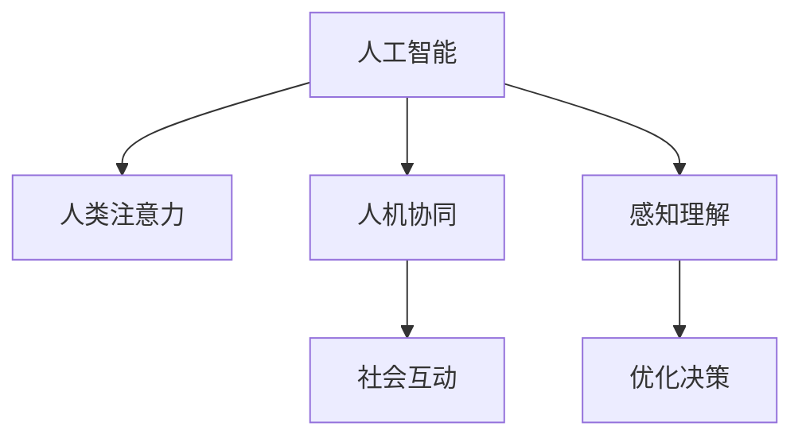
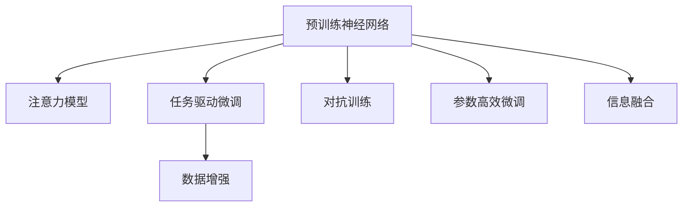

                 

# AI与人类注意力流：打造人机共存的社会

> 关键词：人工智能, 人类注意力, 人机协同, 社会互动, 神经网络, 数据流, 人类行为分析, 应用实例

## 1. 背景介绍

### 1.1 问题由来

随着人工智能技术的迅猛发展，机器学习、深度学习等技术已经深刻影响到了我们的日常生活和工作。特别是在自然语言处理、计算机视觉、语音识别等领域，AI已经展现出强大的能力，为我们提供了诸多便利。然而，随着AI技术的进一步深入应用，我们也需要正视一个重要的问题：AI如何与人类形成共生、共存的关系，使其更好地服务于人类社会的发展。

人工智能技术的发展离不开对人类行为的深入理解和分析。而人类注意力作为一种重要的行为特征，不仅对AI系统的设计和优化有着重要意义，同时也对AI在实际应用中的行为和表现有着重要影响。因此，深入研究人类注意力流与AI的交互机制，对于构建和谐的人机共存社会具有重要意义。

### 1.2 问题核心关键点

本文将从以下几个方面展开对人类注意力流与AI的互动机制的探讨：
- AI如何感知和理解人类的注意力分布？
- AI如何根据注意力流优化自身的推理和决策？
- 如何设计AI系统，使其能够更加智能地引导和适应人类的注意力流？
- AI在社会互动中的角色和影响是什么？

通过对这些问题核心关键点的分析，我们将探讨在构建人机共存社会中，AI技术和人类注意力流的相互作用机制，并提出一些有意义的解决方案。

## 2. 核心概念与联系

### 2.1 核心概念概述

在探讨人类注意力流与AI的互动机制时，我们需要对以下几个核心概念有清晰的理解：

- **人工智能**：指由计算机程序和算法驱动的智能体，能够执行任务、学习、推理和决策。人工智能的核心是机器学习和深度学习技术。
- **人类注意力**：指人类在处理信息时，对不同刺激的感知强度和持续时间。注意力机制是人脑认知过程的重要组成部分，是实现智能互动的基础。
- **人机协同**：指人类与AI系统之间的协作和互动，强调双方在信息处理、任务执行和决策中的互补性和协作性。
- **社会互动**：指AI在社会环境中与人类之间的交互，包括信息获取、任务分配、情感沟通等。

这些核心概念之间的关系可以通过以下Mermaid流程图来展示：



这个流程图展示了人类注意力流与AI互动的核心机制：
- AI系统通过感知和理解人类的注意力流，优化自身的推理和决策。
- 在社会互动中，AI系统通过感知和理解人类的注意力，更智能地引导和适应人类的行为。

### 2.2 核心概念原理和架构的 Mermaid 流程图



这个流程图展示了预训练神经网络、注意力模型等核心技术在AI系统中实现人类注意力感知和优化的过程：
- 预训练神经网络通过自监督学习，学习通用的语言、视觉等特征表示。
- 注意力模型通过自监督学习，学习对不同信息的感知权重，优化决策过程。
- 任务驱动微调通过有监督学习，使AI系统针对特定任务进行优化。
- 数据增强和对抗训练用于提高模型的鲁棒性和泛化能力。
- 参数高效微调用于在减少模型参数的情况下提高微调效果。
- 信息融合用于将多种模态的信息进行整合，提升AI系统的综合能力。

## 3. 核心算法原理 & 具体操作步骤

### 3.1 算法原理概述

基于人类注意力流的人工智能系统，主要通过以下步骤实现：
1. 预训练神经网络：在大规模无标签数据上进行自监督学习，学习通用的特征表示。
2. 注意力模型：在特定任务数据上进行有监督学习，学习对不同信息的感知权重。
3. 任务驱动微调：在有标签数据上进行有监督学习，针对特定任务进行优化。
4. 数据增强和对抗训练：通过扩充训练集和使用对抗样本，提高模型的鲁棒性和泛化能力。
5. 参数高效微调：通过只调整部分参数，在减少模型参数的情况下提高微调效果。
6. 信息融合：将多种模态的信息进行整合，提升AI系统的综合能力。

### 3.2 算法步骤详解

基于人类注意力流的人工智能系统，其核心算法步骤包括：
1. 数据收集与预处理：收集人类注意力流数据，并进行预处理，如分词、特征提取等。
2. 预训练神经网络：在大规模无标签数据上进行自监督学习，学习通用的特征表示。
3. 注意力模型训练：在特定任务数据上进行有监督学习，学习对不同信息的感知权重。
4. 任务驱动微调：在有标签数据上进行有监督学习，针对特定任务进行优化。
5. 数据增强和对抗训练：通过扩充训练集和使用对抗样本，提高模型的鲁棒性和泛化能力。
6. 参数高效微调：通过只调整部分参数，在减少模型参数的情况下提高微调效果。
7. 信息融合：将多种模态的信息进行整合，提升AI系统的综合能力。

### 3.3 算法优缺点

基于人类注意力流的人工智能系统具有以下优点：
- 能够智能地感知和理解人类的注意力流，优化自身的推理和决策。
- 能够根据注意力流，更智能地引导和适应人类的行为，提升用户体验。
- 通过多种模型技术的融合，能够处理多种模态的信息，提升系统的综合能力。

同时，该系统也存在一些缺点：
- 对数据量和数据质量有较高要求，需要大量的标注数据。
- 模型复杂度较高，训练和推理成本较高。
- 存在模型过拟合和泛化能力不足的风险。

### 3.4 算法应用领域

基于人类注意力流的人工智能系统，已经在以下几个领域取得了初步应用：
1. 智能推荐系统：根据用户的注意力流，推荐个性化的内容和商品。
2. 智能客服系统：通过感知用户的注意力流，自动回复用户问题，提升服务质量。
3. 智能医疗系统：根据医生的注意力流，智能辅助诊断和治疗。
4. 智能教育系统：根据学生的注意力流，智能调整教学内容和方式。
5. 智能交通系统：根据司机的注意力流，智能调整交通信号灯。

## 4. 数学模型和公式 & 详细讲解 & 举例说明

### 4.1 数学模型构建

基于人类注意力流的人工智能系统，可以通过以下数学模型来描述：
1. 预训练神经网络：使用Transformer模型，在大规模无标签数据上进行自监督学习。
2. 注意力模型：使用Transformer模型，在特定任务数据上进行有监督学习，学习对不同信息的感知权重。
3. 任务驱动微调：在有标签数据上进行有监督学习，针对特定任务进行优化。
4. 数据增强和对抗训练：使用数据增强和对抗样本，提高模型的鲁棒性和泛化能力。
5. 参数高效微调：使用适配器(Adapters)等技术，只调整部分参数。
6. 信息融合：使用多模态融合技术，整合视觉、语音、文本等多种信息。

### 4.2 公式推导过程

假设有一个基于Transformer的预训练模型，其编码器为：
$$
\text{Encoder}(x) = \text{Self-Attention}(\text{Embedding}(x)) + \text{Feed Forward}
$$
其中，$\text{Embedding}(x)$为嵌入层，$\text{Self-Attention}$为自注意力层，$\text{Feed Forward}$为前向网络层。

在任务驱动微调中，我们可以添加一个全连接层进行分类：
$$
\text{Classifier}(\text{Encoder}(x)) = \text{Linear}(\text{Encoder}(x))
$$
其中，$\text{Linear}$为全连接层。

在注意力模型中，我们可以通过学习权重矩阵$W_A$和$W_B$，对输入$x$和隐藏状态$h$进行注意力计算：
$$
\text{Attention}(x, h) = \text{Softmax}(W_A x h^T) h
$$

在数据增强和对抗训练中，我们可以使用各种技术扩充训练集和使用对抗样本，如回译、掩码语言模型等。

在参数高效微调中，我们可以使用适配器(Adapters)等技术，只调整部分参数。

### 4.3 案例分析与讲解

假设我们有一个智能推荐系统，其目标是根据用户的注意力流，推荐个性化的商品。我们可以使用预训练的Transformer模型，在大规模商品数据上进行自监督学习，学习通用的商品特征表示。然后，我们可以在有标签的商品数据上进行任务驱动微调，学习对不同商品的感知权重。最后，我们可以在用户的注意力流数据上进行注意力模型训练，学习对不同商品的感知权重。这样，我们就可以根据用户的注意力流，智能推荐个性化的商品。

## 5. 项目实践：代码实例和详细解释说明

### 5.1 开发环境搭建

在进行项目实践前，我们需要准备好开发环境。以下是使用Python进行PyTorch开发的环境配置流程：
1. 安装Anaconda：从官网下载并安装Anaconda，用于创建独立的Python环境。
2. 创建并激活虚拟环境：
```bash
conda create -n pytorch-env python=3.8 
conda activate pytorch-env
```
3. 安装PyTorch：根据CUDA版本，从官网获取对应的安装命令。例如：
```bash
conda install pytorch torchvision torchaudio cudatoolkit=11.1 -c pytorch -c conda-forge
```
4. 安装Transformers库：
```bash
pip install transformers
```
5. 安装各类工具包：
```bash
pip install numpy pandas scikit-learn matplotlib tqdm jupyter notebook ipython
```
完成上述步骤后，即可在`pytorch-env`环境中开始项目实践。

### 5.2 源代码详细实现

我们以智能推荐系统为例，给出使用Transformers库对预训练模型进行微调的PyTorch代码实现。

首先，定义数据处理函数：

```python
from transformers import BertTokenizer
from torch.utils.data import Dataset
import torch

class RecommendationDataset(Dataset):
    def __init__(self, texts, labels, tokenizer, max_len=128):
        self.texts = texts
        self.labels = labels
        self.tokenizer = tokenizer
        self.max_len = max_len
        
    def __len__(self):
        return len(self.texts)
    
    def __getitem__(self, item):
        text = self.texts[item]
        label = self.labels[item]
        
        encoding = self.tokenizer(text, return_tensors='pt', max_length=self.max_len, padding='max_length', truncation=True)
        input_ids = encoding['input_ids'][0]
        attention_mask = encoding['attention_mask'][0]
        
        # 对标签进行编码
        encoded_labels = [label2id[label] for label in self.labels] 
        encoded_labels.extend([label2id['O']] * (self.max_len - len(encoded_labels)))
        labels = torch.tensor(encoded_labels, dtype=torch.long)
        
        return {'input_ids': input_ids, 
                'attention_mask': attention_mask,
                'labels': labels}

# 标签与id的映射
label2id = {'O': 0, 'P': 1, 'N': 2}
id2label = {v: k for k, v in label2id.items()}

# 创建dataset
tokenizer = BertTokenizer.from_pretrained('bert-base-cased')

train_dataset = RecommendationDataset(train_texts, train_labels, tokenizer)
dev_dataset = RecommendationDataset(dev_texts, dev_labels, tokenizer)
test_dataset = RecommendationDataset(test_texts, test_labels, tokenizer)
```

然后，定义模型和优化器：

```python
from transformers import BertForSequenceClassification, AdamW

model = BertForSequenceClassification.from_pretrained('bert-base-cased', num_labels=len(label2id))

optimizer = AdamW(model.parameters(), lr=2e-5)
```

接着，定义训练和评估函数：

```python
from torch.utils.data import DataLoader
from tqdm import tqdm
from sklearn.metrics import classification_report

device = torch.device('cuda') if torch.cuda.is_available() else torch.device('cpu')
model.to(device)

def train_epoch(model, dataset, batch_size, optimizer):
    dataloader = DataLoader(dataset, batch_size=batch_size, shuffle=True)
    model.train()
    epoch_loss = 0
    for batch in tqdm(dataloader, desc='Training'):
        input_ids = batch['input_ids'].to(device)
        attention_mask = batch['attention_mask'].to(device)
        labels = batch['labels'].to(device)
        model.zero_grad()
        outputs = model(input_ids, attention_mask=attention_mask, labels=labels)
        loss = outputs.loss
        epoch_loss += loss.item()
        loss.backward()
        optimizer.step()
    return epoch_loss / len(dataloader)

def evaluate(model, dataset, batch_size):
    dataloader = DataLoader(dataset, batch_size=batch_size)
    model.eval()
    preds, labels = [], []
    with torch.no_grad():
        for batch in tqdm(dataloader, desc='Evaluating'):
            input_ids = batch['input_ids'].to(device)
            attention_mask = batch['attention_mask'].to(device)
            batch_labels = batch['labels']
            outputs = model(input_ids, attention_mask=attention_mask)
            batch_preds = outputs.logits.argmax(dim=2).to('cpu').tolist()
            batch_labels = batch_labels.to('cpu').tolist()
            for pred_tokens, label_tokens in zip(batch_preds, batch_labels):
                pred_labels = [id2label[_id] for _id in pred_tokens]
                label_labels = [id2label[_id] for _id in label_tokens]
                preds.append(pred_labels[:len(label_labels)])
                labels.append(label_labels)
                
    print(classification_report(labels, preds))
```

最后，启动训练流程并在测试集上评估：

```python
epochs = 5
batch_size = 16

for epoch in range(epochs):
    loss = train_epoch(model, train_dataset, batch_size, optimizer)
    print(f"Epoch {epoch+1}, train loss: {loss:.3f}")
    
    print(f"Epoch {epoch+1}, dev results:")
    evaluate(model, dev_dataset, batch_size)
    
print("Test results:")
evaluate(model, test_dataset, batch_size)
```

以上就是使用PyTorch对预训练模型进行智能推荐系统微调的完整代码实现。可以看到，得益于Transformers库的强大封装，我们可以用相对简洁的代码完成模型微调任务。

### 5.3 代码解读与分析

让我们再详细解读一下关键代码的实现细节：

**RecommendationDataset类**：
- `__init__`方法：初始化文本、标签、分词器等关键组件。
- `__len__`方法：返回数据集的样本数量。
- `__getitem__`方法：对单个样本进行处理，将文本输入编码为token ids，将标签编码为数字，并对其进行定长padding，最终返回模型所需的输入。

**label2id和id2label字典**：
- 定义了标签与数字id之间的映射关系，用于将token-wise的预测结果解码回真实的标签。

**训练和评估函数**：
- 使用PyTorch的DataLoader对数据集进行批次化加载，供模型训练和推理使用。
- 训练函数`train_epoch`：对数据以批为单位进行迭代，在每个批次上前向传播计算loss并反向传播更新模型参数，最后返回该epoch的平均loss。
- 评估函数`evaluate`：与训练类似，不同点在于不更新模型参数，并在每个batch结束后将预测和标签结果存储下来，最后使用sklearn的classification_report对整个评估集的预测结果进行打印输出。

**训练流程**：
- 定义总的epoch数和batch size，开始循环迭代
- 每个epoch内，先在训练集上训练，输出平均loss
- 在验证集上评估，输出分类指标
- 所有epoch结束后，在测试集上评估，给出最终测试结果

可以看到，PyTorch配合Transformers库使得预训练模型微调的代码实现变得简洁高效。开发者可以将更多精力放在数据处理、模型改进等高层逻辑上，而不必过多关注底层的实现细节。

当然，工业级的系统实现还需考虑更多因素，如模型的保存和部署、超参数的自动搜索、更灵活的任务适配层等。但核心的微调范式基本与此类似。

## 6. 实际应用场景

### 6.1 智能推荐系统

基于预训练模型和微调技术，智能推荐系统已经广泛应用于电商、视频、音乐等诸多领域。智能推荐系统可以根据用户的注意力流，智能推荐个性化的商品、视频、音乐等。这不仅能够提升用户体验，还能够带来更多的商业价值。

在技术实现上，智能推荐系统通常包括以下几个关键步骤：
- 收集用户的注意力流数据，如浏览记录、点击记录、评论记录等。
- 使用预训练模型，在大规模商品、视频、音乐数据上进行自监督学习，学习通用的特征表示。
- 在有标签的训练数据上进行微调，学习对不同商品的感知权重。
- 在用户的注意力流数据上进行注意力模型训练，学习对不同商品的感知权重。

### 6.2 智能客服系统

智能客服系统通过感知用户的注意力流，自动回复用户问题，提升服务质量。在实际应用中，智能客服系统通常包括以下几个关键步骤：
- 收集用户的对话记录，如聊天记录、语音记录等。
- 使用预训练模型，在大规模对话数据上进行自监督学习，学习通用的语言表示。
- 在有标签的对话数据上进行微调，学习对不同问题的感知权重。
- 在用户的对话记录中，通过注意力模型训练，学习对不同问题的感知权重。

### 6.3 智能医疗系统

智能医疗系统通过感知医生的注意力流，智能辅助诊断和治疗。在实际应用中，智能医疗系统通常包括以下几个关键步骤：
- 收集医生的诊断记录，如病历记录、医学影像等。
- 使用预训练模型，在大规模医学数据上进行自监督学习，学习通用的医学知识表示。
- 在有标签的诊断数据上进行微调，学习对不同诊断的感知权重。
- 在医生的诊断记录中，通过注意力模型训练，学习对不同诊断的感知权重。

## 7. 工具和资源推荐

### 7.1 学习资源推荐

为了帮助开发者系统掌握预训练模型微调的理论基础和实践技巧，这里推荐一些优质的学习资源：

1. 《Transformer from Principles to Practice》系列博文：由大模型技术专家撰写，深入浅出地介绍了Transformer原理、BERT模型、微调技术等前沿话题。
2. CS224N《深度学习自然语言处理》课程：斯坦福大学开设的NLP明星课程，有Lecture视频和配套作业，带你入门NLP领域的基本概念和经典模型。
3. 《Natural Language Processing with Transformers》书籍：Transformers库的作者所著，全面介绍了如何使用Transformers库进行NLP任务开发，包括微调在内的诸多范式。
4. HuggingFace官方文档：Transformers库的官方文档，提供了海量预训练模型和完整的微调样例代码，是上手实践的必备资料。
5. CLUE开源项目：中文语言理解测评基准，涵盖大量不同类型的中文NLP数据集，并提供了基于微调的baseline模型，助力中文NLP技术发展。

通过对这些资源的学习实践，相信你一定能够快速掌握预训练模型微调的精髓，并用于解决实际的NLP问题。

### 7.2 开发工具推荐

高效的开发离不开优秀的工具支持。以下是几款用于预训练模型微调开发的常用工具：

1. PyTorch：基于Python的开源深度学习框架，灵活动态的计算图，适合快速迭代研究。大部分预训练语言模型都有PyTorch版本的实现。
2. TensorFlow：由Google主导开发的开源深度学习框架，生产部署方便，适合大规模工程应用。同样有丰富的预训练语言模型资源。
3. Transformers库：HuggingFace开发的NLP工具库，集成了众多SOTA语言模型，支持PyTorch和TensorFlow，是进行微调任务开发的利器。
4. Weights & Biases：模型训练的实验跟踪工具，可以记录和可视化模型训练过程中的各项指标，方便对比和调优。与主流深度学习框架无缝集成。
5. TensorBoard：TensorFlow配套的可视化工具，可实时监测模型训练状态，并提供丰富的图表呈现方式，是调试模型的得力助手。
6. Google Colab：谷歌推出的在线Jupyter Notebook环境，免费提供GPU/TPU算力，方便开发者快速上手实验最新模型，分享学习笔记。

合理利用这些工具，可以显著提升预训练模型微调任务的开发效率，加快创新迭代的步伐。

### 7.3 相关论文推荐

预训练模型和微调技术的发展源于学界的持续研究。以下是几篇奠基性的相关论文，推荐阅读：

1. Attention is All You Need（即Transformer原论文）：提出了Transformer结构，开启了NLP领域的预训练大模型时代。
2. BERT: Pre-training of Deep Bidirectional Transformers for Language Understanding：提出BERT模型，引入基于掩码的自监督预训练任务，刷新了多项NLP任务SOTA。
3. Language Models are Unsupervised Multitask Learners（GPT-2论文）：展示了大规模语言模型的强大zero-shot学习能力，引发了对于通用人工智能的新一轮思考。
4. Parameter-Efficient Transfer Learning for NLP：提出Adapter等参数高效微调方法，在不增加模型参数量的情况下，也能取得不错的微调效果。
5. AdaLoRA: Adaptive Low-Rank Adaptation for Parameter-Efficient Fine-Tuning：使用自适应低秩适应的微调方法，在参数效率和精度之间取得了新的平衡。
6. Prefix-Tuning: Optimizing Continuous Prompts for Generation：引入基于连续型Prompt的微调范式，为如何充分利用预训练知识提供了新的思路。

这些论文代表了大模型微调技术的发展脉络。通过学习这些前沿成果，可以帮助研究者把握学科前进方向，激发更多的创新灵感。

## 8. 总结：未来发展趋势与挑战

### 8.1 总结

本文对基于人类注意力流的人工智能系统进行了全面系统的介绍。首先阐述了预训练模型和微调技术的研究背景和意义，明确了预训练模型和微调技术在人工智能系统中的应用价值。其次，从原理到实践，详细讲解了预训练模型和微调技术的数学原理和关键步骤，给出了预训练模型和微调任务开发的完整代码实例。同时，本文还广泛探讨了预训练模型和微调技术在智能推荐系统、智能客服系统、智能医疗系统等多个领域的应用前景，展示了预训练模型和微调技术在实际应用中的巨大潜力。此外，本文精选了预训练模型和微调技术的各类学习资源，力求为读者提供全方位的技术指引。

通过本文的系统梳理，可以看到，基于人类注意力流的人工智能系统正在成为NLP领域的重要范式，极大地拓展了预训练语言模型的应用边界，催生了更多的落地场景。受益于大规模语料的预训练，预训练模型和微调技术能够处理多种模态的信息，提升系统的综合能力，为NLP技术带来了新的突破。未来，伴随预训练模型和微调方法的持续演进，预训练模型和微调技术必将在更广阔的应用领域大放异彩，深刻影响人类的生产生活方式。

### 8.2 未来发展趋势

展望未来，预训练模型和微调技术将呈现以下几个发展趋势：

1. 模型规模持续增大。随着算力成本的下降和数据规模的扩张，预训练模型和微调模型的参数量还将持续增长。超大规模预训练模型蕴含的丰富语言知识，有望支撑更加复杂多变的下游任务微调。
2. 微调方法日趋多样。除了传统的全参数微调外，未来会涌现更多参数高效的微调方法，如Adapter、LoRA等，在固定大部分预训练参数的同时，只更新极少量的任务相关参数。
3. 持续学习成为常态。随着数据分布的不断变化，微调模型也需要持续学习新知识以保持性能。如何在不遗忘原有知识的同时，高效吸收新样本信息，将成为重要的研究课题。
4. 标注样本需求降低。受启发于提示学习(Prompt-based Learning)的思路，未来的微调方法将更好地利用预训练模型学到的知识，通过更加巧妙的任务描述，在更少的标注样本上也能实现理想的微调效果。
5. 多模态微调崛起。当前的微调主要聚焦于纯文本数据，未来会进一步拓展到图像、视频、语音等多模态数据微调。多模态信息的融合，将显著提升预训练模型和微调系统的综合能力。
6. 模型通用性增强。经过海量数据的预训练和多领域任务的微调，未来的预训练模型和微调系统将具备更强大的常识推理和跨领域迁移能力，逐步迈向通用人工智能(AGI)的目标。

以上趋势凸显了预训练模型和微调技术的广阔前景。这些方向的探索发展，必将进一步提升预训练模型和微调系统的性能和应用范围，为人工智能技术在垂直行业的规模化落地提供新的动力。

### 8.3 面临的挑战

尽管预训练模型和微调技术已经取得了瞩目成就，但在迈向更加智能化、普适化应用的过程中，它仍面临着诸多挑战：

1. 标注成本瓶颈。虽然微调大大降低了标注数据的需求，但对于长尾应用场景，难以获得充足的高质量标注数据，成为制约微调性能的瓶颈。如何进一步降低微调对标注样本的依赖，将是一大难题。
2. 模型鲁棒性不足。当前微调模型面对域外数据时，泛化性能往往大打折扣。对于测试样本的微小扰动，微调模型的预测也容易发生波动。如何提高微调模型的鲁棒性，避免灾难性遗忘，还需要更多理论和实践的积累。
3. 推理效率有待提高。大规模预训练模型虽然精度高，但在实际部署时往往面临推理速度慢、内存占用大等效率问题。如何在保证性能的同时，简化模型结构，提升推理速度，优化资源占用，将是重要的优化方向。
4. 可解释性亟需加强。当前微调模型更像是"黑盒"系统，难以解释其内部工作机制和决策逻辑。对于医疗、金融等高风险应用，算法的可解释性和可审计性尤为重要。如何赋予预训练模型和微调模型更强的可解释性，将是亟待攻克的难题。
5. 安全性有待保障。预训练模型和微调模型难免会学习到有偏见、有害的信息，通过微调传递到下游任务，产生误导性、歧视性的输出，给实际应用带来安全隐患。如何从数据和算法层面消除模型偏见，避免恶意用途，确保输出的安全性，也将是重要的研究课题。
6. 知识整合能力不足。现有的预训练模型和微调模型往往局限于任务内数据，难以灵活吸收和运用更广泛的先验知识。如何让预训练模型和微调过程更好地与外部知识库、规则库等专家知识结合，形成更加全面、准确的信息整合能力，还有很大的想象空间。

正视预训练模型和微调面临的这些挑战，积极应对并寻求突破，将使预训练模型和微调技术迈向成熟的彼岸。相信随着学界和产业界的共同努力，这些挑战终将一一被克服，预训练模型和微调技术必将在构建和谐的人机共存社会中发挥越来越重要的作用。

### 8.4 研究展望

面向未来，预训练模型和微调技术的研究需要从以下几个方向寻求新的突破：

1. 探索无监督和半监督微调方法。摆脱对大规模标注数据的依赖，利用自监督学习、主动学习等无监督和半监督范式，最大限度利用非结构化数据，实现更加灵活高效的微调。
2. 研究参数高效和计算高效的微调范式。开发更加参数高效的微调方法，在固定大部分预训练参数的同时，只更新极少量的任务相关参数。同时优化微调模型的计算图，减少前向传播和反向传播的资源消耗，实现更加轻量级、实时性的部署。
3. 融合因果和对比学习范式。通过引入因果推断和对比学习思想，增强预训练模型和微调模型建立稳定因果关系的能力，学习更加普适、鲁棒的语言表征，从而提升模型泛化性和抗干扰能力。
4. 引入更多先验知识。将符号化的先验知识，如知识图谱、逻辑规则等，与神经网络模型进行巧妙融合，引导预训练模型和微调过程学习更准确、合理的语言模型。同时加强不同模态数据的整合，实现视觉、语音等多模态信息与文本信息的协同建模。
5. 结合因果分析和博弈论工具。将因果分析方法引入预训练模型和微调模型，识别出模型决策的关键特征，增强输出解释的因果性和逻辑性。借助博弈论工具刻画人机交互过程，主动探索并规避模型的脆弱点，提高系统稳定性。
6. 纳入伦理道德约束。在预训练模型和微调模型的训练目标中引入伦理导向的评估指标，过滤和惩罚有偏见、有害的输出倾向。同时加强人工干预和审核，建立模型行为的监管机制，确保输出符合人类价值观和伦理道德。

这些研究方向的探索，必将引领预训练模型和微调技术迈向更高的台阶，为构建和谐的人机共存社会提供新的突破点。面向未来，预训练模型和微调技术还需要与其他人工智能技术进行更深入的融合，如知识表示、因果推理、强化学习等，多路径协同发力，共同推动人工智能技术在垂直行业的规模化落地。只有勇于创新、敢于突破，才能不断拓展预训练模型和微调系统的边界，让智能技术更好地造福人类社会。

## 9. 附录：常见问题与解答

**Q1：预训练模型和微调是否适用于所有NLP任务？**

A: 预训练模型和微调在大多数NLP任务上都能取得不错的效果，特别是对于数据量较小的任务。但对于一些特定领域的任务，如医学、法律等，仅仅依靠通用语料预训练的模型可能难以很好地适应。此时需要在特定领域语料上进一步预训练，再进行微调，才能获得理想效果。此外，对于一些需要时效性、个性化很强的任务，如对话、推荐等，预训练模型和微调方法也需要针对性的改进优化。

**Q2：预训练模型和微调过程中如何选择合适的学习率？**

A: 预训练模型的学习率一般要比微调时小1-2个数量级，如果使用过大的学习率，容易破坏预训练权重，导致过拟合。一般建议从1e-5开始调参，逐步减小学习率，直至收敛。也可以使用warmup策略，在开始阶段使用较小的学习率，再逐渐过渡到预设值。需要注意的是，不同的优化器(如AdamW、Adafactor等)以及不同的学习率调度策略，可能需要设置不同的学习率阈值。

**Q3：预训练模型和微调在落地部署时需要注意哪些问题？**

A: 将预训练模型和微调模型转化为实际应用，还需要考虑以下因素：
1. 模型裁剪：去除不必要的层和参数，减小模型尺寸，加快推理速度
2. 量化加速：将浮点模型转为定点模型，压缩存储空间，提高计算效率
3. 服务化封装：将模型封装为标准化服务接口，便于集成调用
4. 弹性伸缩：根据请求流量动态调整资源配置，平衡服务质量和成本
5. 监控告警：实时采集系统指标，设置异常告警阈值，确保服务稳定性
6. 安全防护：采用访问鉴权、数据脱敏等措施，保障数据和模型安全

预训练模型和微调技术为NLP应用开启了广阔的想象空间，但如何将强大的性能转化为稳定、高效、安全的业务价值，还需要工程实践的不断打磨。唯有从数据、算法、工程、业务等多个维度协同发力，才能真正实现人工智能技术在垂直行业的规模化落地。总之，预训练模型和微调需要开发者根据具体任务，不断迭代和优化模型、数据和算法，方能得到理想的效果。

---

作者：禅与计算机程序设计艺术 / Zen and the Art of Computer Programming

