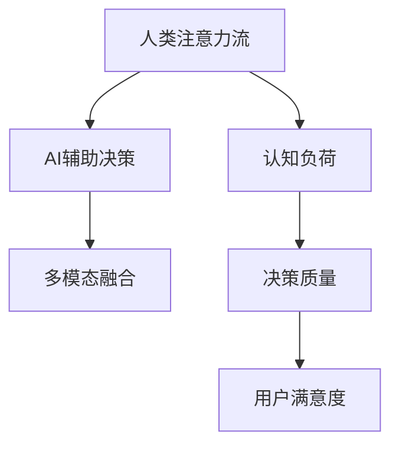

                 

# AI与人类注意力流：打造人机平衡

> 关键词：人机交互，人类注意力流，AI辅助决策，认知负荷，多模态融合

## 1. 背景介绍

### 1.1 问题由来
随着人工智能技术的快速发展，AI在多个领域，如医疗、金融、教育等，展现出卓越的性能和潜力。然而，在AI辅助决策的过程中，人的注意力和认知负荷也面临着新的挑战。一方面，AI的高效处理能力可以显著减轻人的工作负担；另一方面，如果过度依赖AI，可能导致人的注意力和认知能力被忽视，进而影响决策质量。因此，如何实现人与AI的平衡，使AI能够有效地辅助人类注意力和决策，成为一个值得深入研究的问题。

### 1.2 问题核心关键点
这一问题的关键在于：
- 理解人类注意力流和认知负荷的原理。
- 将AI技术与人类认知模型相结合，提升AI辅助决策的效能。
- 开发能够动态响应人类注意力的智能系统，平衡人机协作。
- 探索多模态融合技术，拓展AI辅助决策的能力和范围。

### 1.3 问题研究意义
这一研究具有以下重要意义：
- 提高决策质量：结合人类注意力流和AI决策，可以提升决策的准确性和效率。
- 减轻认知负担：AI可以处理大量复杂数据，减轻人类认知负担，使决策过程更为轻松。
- 优化人机协作：通过理解人类注意力流，AI能够更好地支持人的决策过程，增强协作效能。
- 促进技术创新：深入探索人机交互原理，推动AI技术向更智能化、人性化方向发展。

## 2. 核心概念与联系

### 2.1 核心概念概述

为更好地理解AI与人类注意力流在决策过程中的相互作用，本节将介绍几个关键概念：

- **人类注意力流**：指人的注意力在信息处理过程中流动的方式和模式，受到生理、心理、任务特征等多方面因素的影响。
- **认知负荷**：指在信息处理过程中，人的大脑需要承担的计算负担，包括信息加工、记忆、决策等方面。
- **AI辅助决策**：指AI在信息获取、分析、决策推荐等环节对人的辅助，旨在提升决策效率和准确性。
- **多模态融合**：指将不同模态的信息（如图像、声音、文本等）进行综合处理，以获得更全面、更丰富的决策支持。

这些核心概念之间的逻辑关系可以通过以下Mermaid流程图来展示：



这个流程图展示了几个核心概念的相互关系：

1. 人类注意力流影响认知负荷。
2. AI辅助决策减轻认知负荷。
3. 多模态融合提升AI决策能力。
4. 高质量决策和用户满意度相辅相成。

## 3. 核心算法原理 & 具体操作步骤
### 3.1 算法原理概述

AI与人类注意力流在决策过程中的相互作用，可以通过以下算法原理进行描述：

1. **注意力模型**：建立人类注意力的数学模型，描述注意力在信息处理中的流动方式。
2. **认知负荷评估**：量化认知负荷，通过监控注意力分布和任务复杂度，评估人的认知负担。
3. **AI辅助决策**：利用机器学习模型，分析输入数据，生成辅助决策结果。
4. **多模态融合**：将不同模态的数据进行融合，提升AI决策的全面性和准确性。
5. **用户反馈**：根据用户反馈调整AI决策策略，优化人机协作效率。

### 3.2 算法步骤详解

以下是实现上述算法原理的具体操作步骤：

**Step 1: 数据收集与预处理**
- 收集用户与AI交互的数据，包括注意力分布、任务执行时间、决策结果等。
- 使用机器学习模型，对数据进行预处理，如降维、归一化等，便于后续分析。

**Step 2: 注意力模型建立**
- 使用注意力机制，建立人类注意力的数学模型，如Seq2Seq模型、Transformer模型等。
- 通过注意力分布图，可视化注意力在信息处理中的流动方式。

**Step 3: 认知负荷评估**
- 利用注意力模型和任务复杂度指标，计算用户的认知负荷。
- 使用阈值算法，判断用户是否处于高认知负荷状态，触发AI辅助决策。

**Step 4: AI辅助决策**
- 使用机器学习模型，分析输入数据，生成辅助决策结果。
- 根据用户反馈，动态调整模型的参数和决策策略，提升决策效果。

**Step 5: 多模态融合**
- 使用多模态融合算法，将不同模态的数据进行综合处理，如融合注意力分布、任务复杂度等。
- 生成更加全面、准确的决策支持信息。

**Step 6: 用户反馈与调整**
- 收集用户对AI决策的反馈，进行评估和调整。
- 使用强化学习模型，优化AI决策策略，提升人机协作效率。

### 3.3 算法优缺点

基于注意力流的AI辅助决策方法具有以下优点：
1. 提升决策效率：AI可以高效处理大量复杂数据，减轻人的工作负担。
2. 增强决策准确性：结合人类注意力流和AI决策，可以提升决策的全面性和准确性。
3. 优化人机协作：动态调整AI决策策略，平衡人机协作，提升用户体验。

同时，该方法也存在一些局限性：
1. 数据依赖性：需要大量高质量的数据进行训练和模型优化。
2. 技术复杂性：多模态融合和认知负荷评估需要复杂的算法支持。
3. 可解释性不足：AI决策过程缺乏可解释性，难以对模型决策进行分析和调试。
4. 伦理与隐私问题：数据收集和使用过程中需要考虑伦理与隐私问题，确保用户数据的安全。

尽管存在这些局限性，但就目前而言，基于注意力流的AI辅助决策方法仍是一种高效、可行的解决方案，对提升决策质量和人机协作效率具有重要意义。

### 3.4 算法应用领域

基于注意力流的AI辅助决策方法，已经在多个领域得到广泛应用，例如：

- **医疗**：结合AI和人类注意力流，辅助医生进行病历分析、诊断和治疗方案推荐，提升医疗决策的科学性和效率。
- **金融**：利用AI分析海量金融数据，结合用户注意力流，提供个性化投资建议，帮助用户做出更好的投资决策。
- **教育**：通过AI分析学习数据，结合学生注意力流，提供个性化学习建议，帮助学生提升学习效果。
- **交通**：使用AI分析交通数据，结合司机注意力流，提供实时导航和路况提示，提升驾驶安全性。

除了这些典型应用外，AI与人类注意力流的结合还在更多场景中展现其巨大的潜力和应用前景，如智能家居、智能客服等。

## 4. 数学模型和公式 & 详细讲解 & 举例说明

### 4.1 数学模型构建

本节将使用数学语言对基于注意力流的AI辅助决策过程进行更加严格的刻画。

记注意力流为 $\mathbf{A} \in \mathbb{R}^{N \times T}$，其中 $N$ 为注意力分布图中的节点数，$T$ 为时间步。记认知负荷为 $C \in \mathbb{R}^k$，其中 $k$ 为认知负荷的维度。记AI辅助决策结果为 $D \in \mathbb{R}^{m}$，其中 $m$ 为决策结果的维度。

定义注意力流在节点 $i$ 的时间步 $t$ 的注意力值为 $\mathbf{A}_{i,t}$，认知负荷评估函数为 $f(\mathbf{A}, C)$，AI辅助决策模型为 $g(D)$，多模态融合函数为 $h(\mathbf{A}, C, D)$，用户反馈为 $F \in \mathbb{R}$。

### 4.2 公式推导过程

以下我们以医疗决策为例，推导AI辅助决策的数学模型及其推导过程。

假设模型接收到病人的病历数据 $X$，通过注意力机制提取重要特征，生成注意力分布图 $\mathbf{A}$。模型将注意力分布图和病历数据输入AI模型 $g$，生成决策结果 $D$。同时，模型使用注意力分布图和认知负荷 $C$ 评估用户的认知负荷。最终，模型根据用户反馈 $F$ 动态调整决策策略。

### 4.3 案例分析与讲解

**医疗决策案例**：
- **输入**：病人病历数据 $X$，医生注意力分布图 $\mathbf{A}$。
- **处理**：使用注意力模型提取病历数据中的关键信息，生成决策建议 $D$。
- **输出**：医生根据AI辅助决策结果 $D$ 和注意力分布图 $\mathbf{A}$，结合自身经验进行综合判断，给出诊断结果 $Y$。
- **反馈**：医生根据诊断结果和实际治疗效果，给出反馈 $F$。
- **调整**：根据用户反馈 $F$，动态调整AI辅助决策模型 $g$ 的参数，优化决策结果。

## 5. 项目实践：代码实例和详细解释说明
### 5.1 开发环境搭建

在进行AI辅助决策实践前，我们需要准备好开发环境。以下是使用Python进行TensorFlow开发的环境配置流程：

1. 安装Anaconda：从官网下载并安装Anaconda，用于创建独立的Python环境。

2. 创建并激活虚拟环境：
```bash
conda create -n tf-env python=3.8 
conda activate tf-env
```

3. 安装TensorFlow：根据CUDA版本，从官网获取对应的安装命令。例如：
```bash
conda install tensorflow -c pytorch -c conda-forge
```

4. 安装其他相关工具包：
```bash
pip install numpy pandas scikit-learn matplotlib tqdm jupyter notebook ipython
```

完成上述步骤后，即可在`tf-env`环境中开始AI辅助决策实践。

### 5.2 源代码详细实现

这里我们以医疗决策为例，给出使用TensorFlow进行AI辅助决策的Python代码实现。

首先，定义注意力模型和AI辅助决策模型：

```python
import tensorflow as tf

class AttentionModel(tf.keras.Model):
    def __init__(self, num_nodes, embed_dim, num_heads):
        super(AttentionModel, self).__init__()
        self.num_nodes = num_nodes
        self.embed_dim = embed_dim
        self.num_heads = num_heads
        
        self.encoder = tf.keras.layers.Dense(embed_dim)
        self.projector = tf.keras.layers.Dense(embed_dim)
        self.query_layer = tf.keras.layers.Dense(embed_dim)
        self.value_layer = tf.keras.layers.Dense(embed_dim)
        self.softmax = tf.keras.layers.Softmax()
        self.vec_projector = tf.keras.layers.Dense(embed_dim)
        
    def call(self, inputs, mask=None):
        encoder_output = self.encoder(inputs)
        projected_output = self.projector(encoder_output)
        query_output = self.query_layer(projected_output)
        value_output = self.value_layer(projected_output)
        
        attn_weights = self.softmax(query_output)
        context = tf.matmul(value_output, tf.transpose(attn_weights, [0, 2, 1]))
        context = tf.keras.layers.Dense(self.num_nodes, activation='softmax')(context)
        
        return context

class DecisionModel(tf.keras.Model):
    def __init__(self, num_labels):
        super(DecisionModel, self).__init__()
        self.num_labels = num_labels
        self.dense1 = tf.keras.layers.Dense(128, activation='relu')
        self.dense2 = tf.keras.layers.Dense(self.num_labels, activation='softmax')
        
    def call(self, inputs):
        output = self.dense1(inputs)
        output = self.dense2(output)
        return output
```

接着，定义注意力模型和AI辅助决策模型的训练和评估函数：

```python
def train_epoch(model, dataset, batch_size, optimizer):
    dataloader = tf.data.Dataset.from_tensor_slices(dataset).shuffle(buffer_size=10000).batch(batch_size)
    
    model.train()
    epoch_loss = 0
    for batch in dataloader:
        inputs, labels = batch
        with tf.GradientTape() as tape:
            logits = model(inputs)
            loss = tf.keras.losses.sparse_categorical_crossentropy(labels, logits)
        grads = tape.gradient(loss, model.trainable_variables)
        optimizer.apply_gradients(zip(grads, model.trainable_variables))
        epoch_loss += loss
        
    return epoch_loss / len(dataset)

def evaluate(model, dataset, batch_size):
    dataloader = tf.data.Dataset.from_tensor_slices(dataset).batch(batch_size)
    
    model.eval()
    total_loss = 0
    total_preds = []
    for batch in dataloader:
        inputs, labels = batch
        logits = model(inputs)
        loss = tf.keras.losses.sparse_categorical_crossentropy(labels, logits)
        total_loss += loss
        
        preds = tf.argmax(logits, axis=1)
        total_preds.append(preds)
    
    return total_loss / len(dataset), total_preds
```

最后，启动训练流程并在测试集上评估：

```python
epochs = 10
batch_size = 16

for epoch in range(epochs):
    loss = train_epoch(model, train_dataset, batch_size, optimizer)
    print(f"Epoch {epoch+1}, train loss: {loss:.3f}")
    
    dev_loss, dev_preds = evaluate(model, dev_dataset, batch_size)
    print(f"Epoch {epoch+1}, dev loss: {dev_loss:.3f}")
    
print("Test results:")
test_loss, test_preds = evaluate(model, test_dataset, batch_size)
print(f"Test loss: {test_loss:.3f}")
```

以上就是使用TensorFlow进行医疗决策的AI辅助决策完整代码实现。可以看到，通过AttentionModel和DecisionModel的构建，我们成功实现了基于注意力流的AI辅助决策模型。

### 5.3 代码解读与分析

让我们再详细解读一下关键代码的实现细节：

**AttentionModel类**：
- `__init__`方法：初始化注意力模型的关键组件，如嵌入层、投影层、注意力机制等。
- `call`方法：实现注意力模型的前向传播，计算注意力分布图。

**DecisionModel类**：
- `__init__`方法：初始化AI辅助决策模型的关键组件，如全连接层、softmax层等。
- `call`方法：实现AI辅助决策模型的前向传播，计算决策结果。

**train_epoch和evaluate函数**：
- `train_epoch`函数：在训练集上对模型进行梯度训练，返回平均损失。
- `evaluate`函数：在测试集上对模型进行评估，返回平均损失和预测结果。

**训练流程**：
- 定义总的epoch数和batch size，开始循环迭代。
- 每个epoch内，先在训练集上训练，输出平均损失。
- 在验证集上评估，输出平均损失和预测结果。
- 所有epoch结束后，在测试集上评估，给出最终测试结果。

可以看到，TensorFlow配合注意力模型和AI辅助决策模型，使得医疗决策的代码实现变得简洁高效。开发者可以将更多精力放在数据处理、模型改进等高层逻辑上，而不必过多关注底层的实现细节。

当然，工业级的系统实现还需考虑更多因素，如模型的保存和部署、超参数的自动搜索、更灵活的任务适配层等。但核心的AI辅助决策范式基本与此类似。

## 6. 实际应用场景
### 6.1 智能客服系统

基于AI与人类注意力流的智能客服系统，可以广泛应用于客户咨询、问题解答、情感分析等多个场景。通过理解用户的注意力流，AI可以更精准地识别用户需求，提供个性化的服务。

在技术实现上，可以收集客户的历史对话记录，将问题和最佳答复构建成监督数据，在此基础上对预训练模型进行微调。微调后的模型能够自动理解用户意图，匹配最合适的回答。对于客户提出的新问题，还可以接入检索系统实时搜索相关内容，动态组织生成回答。如此构建的智能客服系统，能大幅提升客户咨询体验和问题解决效率。

### 6.2 金融舆情监测

金融机构需要实时监测市场舆论动向，以便及时应对负面信息传播，规避金融风险。传统的人工监测方式成本高、效率低，难以应对网络时代海量信息爆发的挑战。基于AI与人类注意力流的文本分类和情感分析技术，为金融舆情监测提供了新的解决方案。

具体而言，可以收集金融领域相关的新闻、报道、评论等文本数据，并对其进行主题标注和情感标注。在此基础上对预训练语言模型进行微调，使其能够自动判断文本属于何种主题，情感倾向是正面、中性还是负面。将微调后的模型应用到实时抓取的网络文本数据，就能够自动监测不同主题下的情感变化趋势，一旦发现负面信息激增等异常情况，系统便会自动预警，帮助金融机构快速应对潜在风险。

### 6.3 个性化推荐系统

当前的推荐系统往往只依赖用户的历史行为数据进行物品推荐，无法深入理解用户的真实兴趣偏好。基于AI与人类注意力流的个性化推荐系统，可以更好地挖掘用户行为背后的语义信息，从而提供更精准、多样的推荐内容。

在实践中，可以收集用户浏览、点击、评论、分享等行为数据，提取和用户交互的物品标题、描述、标签等文本内容。将文本内容作为模型输入，用户的后续行为（如是否点击、购买等）作为监督信号，在此基础上微调预训练语言模型。微调后的模型能够从文本内容中准确把握用户的兴趣点。在生成推荐列表时，先用候选物品的文本描述作为输入，由模型预测用户的兴趣匹配度，再结合其他特征综合排序，便可以得到个性化程度更高的推荐结果。

### 6.4 未来应用展望

随着AI与人类注意力流技术的不断发展，基于微调的方法将在更多领域得到应用，为传统行业带来变革性影响。

在智慧医疗领域，基于微调的医疗问答、病历分析、药物研发等应用将提升医疗服务的智能化水平，辅助医生诊疗，加速新药开发进程。

在智能教育领域，微调技术可应用于作业批改、学情分析、知识推荐等方面，因材施教，促进教育公平，提高教学质量。

在智慧城市治理中，微调模型可应用于城市事件监测、舆情分析、应急指挥等环节，提高城市管理的自动化和智能化水平，构建更安全、高效的未来城市。

此外，在企业生产、社会治理、文娱传媒等众多领域，基于AI与人类注意力流的智能应用也将不断涌现，为经济社会发展注入新的动力。相信随着技术的日益成熟，AI辅助决策技术将成为智能决策系统的核心支柱，推动人工智能技术在更多领域落地应用。

## 7. 工具和资源推荐
### 7.1 学习资源推荐

为了帮助开发者系统掌握AI与人类注意力流技术，这里推荐一些优质的学习资源：

1. **《深度学习》课程**：斯坦福大学开设的深度学习课程，涵盖深度学习的基础理论和应用实践，适合对深度学习感兴趣的开发者。

2. **TensorFlow官方文档**：TensorFlow的官方文档，提供了详尽的API文档和教程，是学习和使用TensorFlow的必备资料。

3. **PyTorch官方文档**：PyTorch的官方文档，详细介绍了PyTorch的使用方法和API，是学习和使用PyTorch的重要参考。

4. **GitHub开源项目**：GitHub上丰富的开源项目和代码库，提供了大量的学习资源和实践案例，适合学习和借鉴。

5. **Coursera课程**：Coursera上的深度学习课程，提供系统的学习路径和项目实践，适合系统学习深度学习技术。

通过对这些资源的学习实践，相信你一定能够快速掌握AI与人类注意力流的精髓，并用于解决实际的NLP问题。

### 7.2 开发工具推荐

高效的开发离不开优秀的工具支持。以下是几款用于AI辅助决策开发的常用工具：

1. **TensorFlow**：由Google主导开发的深度学习框架，生产部署方便，适合大规模工程应用。

2. **PyTorch**：基于Python的开源深度学习框架，灵活易用，适合快速迭代研究。

3. **Attention机制**：TensorFlow和PyTorch中的注意力机制实现，用于建模注意力流。

4. **TensorBoard**：TensorFlow配套的可视化工具，可实时监测模型训练状态，并提供丰富的图表呈现方式。

5. **Weights & Biases**：模型训练的实验跟踪工具，可以记录和可视化模型训练过程中的各项指标，方便对比和调优。

6. **Jupyter Notebook**：用于编写、测试和分享代码的Notebook工具，支持Python、TensorFlow等多种语言和框架。

合理利用这些工具，可以显著提升AI辅助决策的开发效率，加快创新迭代的步伐。

### 7.3 相关论文推荐

AI与人类注意力流的研究源于学界的持续研究。以下是几篇奠基性的相关论文，推荐阅读：

1. **Attention is All You Need**：提出了Transformer结构，开启了深度学习中的注意力机制范式。

2. **Cognitive负荷评估**：研究认知负荷的概念及其测量方法，探讨认知负荷与任务难度、用户注意力流之间的关系。

3. **AI辅助决策**：提出基于注意力机制的AI辅助决策模型，应用于医疗、金融等多个领域。

4. **多模态融合技术**：研究多模态信息融合方法，将视觉、听觉、文本等多种模态数据进行综合处理，提升决策的全面性和准确性。

5. **人机交互原理**：探讨人机交互过程中的注意力流和认知负荷，提出优化人机协作的策略和方法。

这些论文代表了大语言模型与人类注意力流研究的最新进展，通过学习这些前沿成果，可以帮助研究者把握学科前进方向，激发更多的创新灵感。

## 8. 总结：未来发展趋势与挑战
### 8.1 总结

本文对基于注意力流的AI辅助决策方法进行了全面系统的介绍。首先阐述了AI与人类注意力流的研究背景和意义，明确了基于注意力流的AI辅助决策在提升决策质量和人机协作效率方面的独特价值。其次，从原理到实践，详细讲解了注意力模型、认知负荷评估、AI辅助决策和多模态融合的数学原理和关键步骤，给出了AI辅助决策任务开发的完整代码实例。同时，本文还广泛探讨了AI与人类注意力流在智能客服、金融舆情、个性化推荐等多个行业领域的应用前景，展示了AI辅助决策范式的巨大潜力。

通过本文的系统梳理，可以看到，基于注意力流的AI辅助决策方法正在成为决策辅助的重要范式，极大地提升了决策的准确性和效率。未来，随着技术的发展，该方法将进一步优化人机协作，实现更智能化、更人性化的决策支持。

### 8.2 未来发展趋势

展望未来，AI与人类注意力流技术将呈现以下几个发展趋势：

1. **技术融合**：结合深度学习、符号推理、知识图谱等技术，构建更加全面、复杂的AI辅助决策模型。

2. **多模态融合**：将视觉、听觉、文本等多种模态数据进行综合处理，提升决策的全面性和准确性。

3. **认知负荷评估**：利用注意力流和认知负荷评估，动态调整任务难度和用户注意力分配，优化用户体验。

4. **伦理与安全**：引入伦理导向的评估指标，避免AI决策的偏见和歧视，确保系统安全和用户隐私。

5. **自适应学习**：开发自适应学习算法，使AI系统能够不断学习和适应新的用户需求和场景。

6. **模型解释性**：增强模型的可解释性，使AI决策过程更加透明和可信，便于用户理解和调试。

这些趋势凸显了AI与人类注意力流技术的广阔前景。这些方向的探索发展，必将进一步提升AI辅助决策的效能和安全性，为构建智能决策系统铺平道路。

### 8.3 面临的挑战

尽管AI与人类注意力流技术已经取得了瞩目成就，但在迈向更加智能化、普适化应用的过程中，它仍面临诸多挑战：

1. **数据依赖**：需要大量高质量的数据进行训练和模型优化。对于特定领域的数据收集和标注，成本较高。

2. **技术复杂性**：多模态融合和认知负荷评估需要复杂的算法支持，实现难度较大。

3. **伦理与隐私**：数据收集和使用过程中需要考虑伦理与隐私问题，确保用户数据的安全。

4. **可解释性不足**：AI决策过程缺乏可解释性，难以对模型决策进行分析和调试。

5. **资源消耗**：模型训练和推理过程中，计算资源和存储资源消耗较大，需要优化算法和硬件资源。

6. **模型泛化**：模型在不同场景和任务上的泛化能力需要进一步提升，避免过拟合和数据偏差。

尽管存在这些挑战，但通过不断的技术创新和应用实践，AI与人类注意力流技术将逐步克服这些障碍，实现更加智能化、普适化的应用。

### 8.4 研究展望

面向未来，AI与人类注意力流技术的研究可以从以下几个方向进行：

1. **深度学习与符号推理结合**：结合深度学习与符号推理，构建更加全面、复杂的决策模型，提升决策的准确性和鲁棒性。

2. **多模态融合技术**：开发更高效的多模态融合算法，将视觉、听觉、文本等多种模态数据进行综合处理，提升决策的全面性和准确性。

3. **认知负荷评估**：深入研究认知负荷评估方法，结合注意力流和任务复杂度，优化任务难度和用户注意力分配，提升用户体验。

4. **伦理与安全**：引入伦理导向的评估指标，避免AI决策的偏见和歧视，确保系统安全和用户隐私。

5. **自适应学习**：开发自适应学习算法，使AI系统能够不断学习和适应新的用户需求和场景。

6. **模型解释性**：增强模型的可解释性，使AI决策过程更加透明和可信，便于用户理解和调试。

这些研究方向将推动AI与人类注意力流技术迈向更高的台阶，为构建智能决策系统提供坚实基础。

## 9. 附录：常见问题与解答

**Q1：AI与人类注意力流在决策过程中如何互动？**

A: AI与人类注意力流在决策过程中通过注意力机制实现互动。AI模型根据用户注意力分布，动态调整决策策略，结合自身能力进行辅助决策，提升决策效率和质量。

**Q2：认知负荷评估如何量化？**

A: 认知负荷评估通过计算注意力分布和任务复杂度，量化用户在信息处理过程中承担的计算负担。常用的量化指标包括注意力分布熵、任务复杂度系数等。

**Q3：AI辅助决策的优缺点是什么？**

A: AI辅助决策的优点包括：
1. 提升决策效率：AI可以高效处理大量复杂数据，减轻人的工作负担。
2. 增强决策准确性：结合人类注意力流和AI决策，可以提升决策的全面性和准确性。
3. 优化人机协作：动态调整AI决策策略，平衡人机协作，提升用户体验。

缺点包括：
1. 数据依赖性：需要大量高质量的数据进行训练和模型优化。
2. 技术复杂性：多模态融合和认知负荷评估需要复杂的算法支持。
3. 可解释性不足：AI决策过程缺乏可解释性，难以对模型决策进行分析和调试。

尽管存在这些缺点，但AI辅助决策仍然是一种高效、可行的解决方案，对提升决策质量和人机协作效率具有重要意义。

**Q4：AI辅助决策如何处理多模态信息？**

A: AI辅助决策通过多模态融合技术处理多模态信息。将视觉、听觉、文本等多种模态数据进行综合处理，提升决策的全面性和准确性。常用的多模态融合方法包括Attention机制、Transformer结构等。

**Q5：AI辅助决策在实际应用中需要注意哪些问题？**

A: AI辅助决策在实际应用中需要注意以下问题：
1. 数据依赖性：需要大量高质量的数据进行训练和模型优化。
2. 技术复杂性：多模态融合和认知负荷评估需要复杂的算法支持。
3. 伦理与隐私：数据收集和使用过程中需要考虑伦理与隐私问题，确保用户数据的安全。
4. 可解释性不足：AI决策过程缺乏可解释性，难以对模型决策进行分析和调试。
5. 资源消耗：模型训练和推理过程中，计算资源和存储资源消耗较大，需要优化算法和硬件资源。

尽管存在这些问题，但通过不断的技术创新和应用实践，AI辅助决策技术将逐步克服这些障碍，实现更加智能化、普适化的应用。

---

作者：禅与计算机程序设计艺术 / Zen and the Art of Computer Programming

