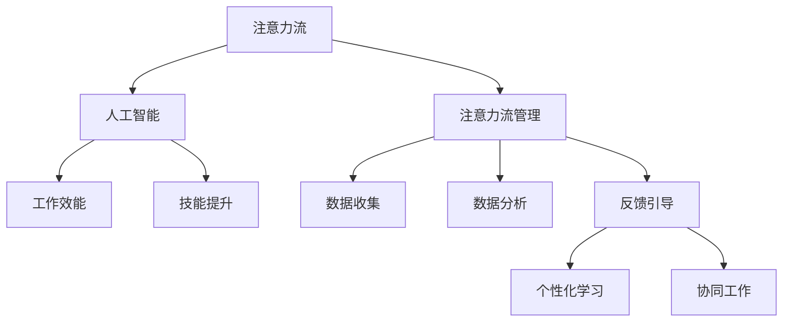

                 

# AI与人类注意力流：未来的工作、技能与注意力流管理技术的应用前景趋势分析

> 关键词：人工智能,注意力流管理,工作效能,技能提升,技术发展,应用场景

## 1. 背景介绍

在信息化时代，科技的发展正逐渐改变着人类的生活方式和生产方式。尤其是在人工智能(AI)的推动下，工作方式、学习方式、交流方式等都发生了深刻的变化。注意力流管理技术，作为一种新兴的人工智能应用，开始进入人们的视野，成为提升工作效率、优化学习效果、增强人类与AI协同工作能力的关键技术。本文旨在探讨AI与人类注意力流的关系，分析未来AI技术在注意力流管理中的应用前景与趋势。

### 1.1 问题由来

随着科技的进步，越来越多的工作开始依赖于智能系统和工具。例如，智能助理、机器人、自动化系统等，极大提升了工作效率，同时也对人类的工作方式提出了新的要求。然而，过度依赖技术往往会使人的注意力分散，工作效率下降。为解决这一问题，注意力流管理技术应运而生。该技术通过分析人类注意力流的方式，结合AI技术，帮助人们优化工作和学习流程，提升整体效能。

### 1.2 问题核心关键点

注意力流管理技术的关键点在于如何有效分析人类注意力流，并将这些信息与AI技术结合，进行智能化引导。具体来说，包括以下几个方面：

- **数据收集**：通过各种传感器和监控设备，收集人类的注意力流数据。
- **数据分析**：使用机器学习和数据挖掘技术，分析人类注意力流模式和变化趋势。
- **反馈引导**：结合AI模型，向用户提供个性化反馈和引导，帮助用户调整注意力流。

### 1.3 问题研究意义

研究AI与人类注意力流的关系，对于提升人类工作效能、优化学习效果、增强人类与AI的协同工作能力具有重要意义：

1. **提升工作效率**：帮助人们发现并避免注意力分散，提高工作和学习的效率。
2. **优化学习效果**：通过个性化学习路径设计，提升学习效果，适应不同学习者的需求。
3. **增强协同工作**：结合AI的决策能力，增强人类与AI的协同工作能力，提升整体协作效率。
4. **推动产业发展**：推动注意力流管理技术的普及应用，促进相关产业的发展。

## 2. 核心概念与联系

### 2.1 核心概念概述

为更好地理解AI与人类注意力流的关系，本节将介绍几个密切相关的核心概念：

- **注意力流**：指人类在完成工作、学习等活动时，注意力从一件事转移到另一件事的过程。注意力流分析旨在捕捉和理解这一过程，优化注意力分配。
- **注意力流管理**：通过技术手段分析、预测和引导人类注意力流，提升工作效率和学习效果。
- **人工智能**：一种使计算机系统具备人类智能的技术，通过机器学习、深度学习等技术，模拟人类思维和行为。
- **工作效能**：指个体在完成工作任务时，所展示的效率和效果。
- **技能提升**：通过学习和培训，提升个体在特定领域的能力和水平。
- **技术发展**：指技术进步和应用演进的过程，推动相关领域的创新和变革。

这些核心概念之间的逻辑关系可以通过以下Mermaid流程图来展示：



这个流程图展示了几大核心概念及其之间的关系：

1. 注意力流是人工智能和注意力流管理研究的基础。
2. 人工智能通过数据分析和机器学习，帮助优化注意力流。
3. 工作效能和技能提升是AI和注意力流管理的最终目标。
4. 数据收集和反馈引导是注意力流管理的具体实现步骤。
5. 个性化学习和协同工作是注意力流管理的主要应用场景。

这些概念共同构成了AI与人类注意力流管理的关系框架，有助于理解其应用价值和发展方向。

## 3. 核心算法原理 & 具体操作步骤
### 3.1 算法原理概述

AI与人类注意力流管理的过程，本质上是利用机器学习和数据分析技术，分析和优化人类的注意力流，提升工作效率和学习效果。其核心算法流程包括：

1. **数据收集**：通过传感器、监控设备等技术手段，收集人类在工作和学习过程中的注意力数据。
2. **数据分析**：使用机器学习算法，如聚类、分类、回归等，分析注意力数据，识别注意力流模式。
3. **模型训练**：使用历史注意力数据训练AI模型，预测当前注意力状态，生成个性化反馈。
4. **反馈引导**：根据AI模型的预测结果，向用户提供个性化反馈，调整注意力流。
5. **效果评估**：评估注意力流管理的效果，通过用户反馈和数据指标进行调整优化。

### 3.2 算法步骤详解

**步骤1：数据收集**

数据收集是注意力流管理的基础，通过各种传感器和监控设备，收集人类注意力流的数据。例如：

- **眼动追踪器**：记录视线轨迹和停留时间，分析用户对不同信息的关注程度。
- **鼠标轨迹和键盘记录**：分析用户在工作中的操作行为，识别注意力集中和分散的时段。
- **脑电波传感器**：通过脑电信号分析，判断用户注意力状态，区分专注和非专注时间段。

**步骤2：数据分析**

数据收集后，使用机器学习和数据挖掘技术，分析注意力数据，识别注意力流模式。例如：

- **聚类算法**：对用户的注意力数据进行聚类分析，识别不同的注意力状态。
- **时间序列分析**：分析注意力数据的时间序列，识别注意力流中的高峰期和低谷期。
- **关联规则分析**：挖掘注意力数据中的关联规则，分析注意力流与任务完成之间的关系。

**步骤3：模型训练**

使用历史注意力数据训练AI模型，预测当前注意力状态，生成个性化反馈。例如：

- **回归模型**：使用历史注意力数据训练回归模型，预测用户当前的注意力状态。
- **决策树**：使用历史注意力数据训练决策树模型，生成不同任务的注意力流路径。
- **强化学习**：通过模拟用户的行为和反馈，训练强化学习模型，优化注意力流路径。

**步骤4：反馈引导**

根据AI模型的预测结果，向用户提供个性化反馈，调整注意力流。例如：

- **通知提醒**：根据AI模型预测，提醒用户注意力分散，进行工作状态调整。
- **任务优先级调整**：根据AI模型预测，调整任务优先级，优化工作流程。
- **工作环境调整**：根据AI模型预测，调整工作环境，如光线、声音等，提升注意力集中度。

**步骤5：效果评估**

评估注意力流管理的效果，通过用户反馈和数据指标进行调整优化。例如：

- **用户满意度调查**：通过问卷调查，获取用户对注意力流管理的满意度。
- **任务完成时间**：通过记录任务完成时间，评估注意力流管理的效果。
- **注意力集中度**：通过分析注意力数据的波动情况，评估注意力流管理的有效性。

### 3.3 算法优缺点

AI与人类注意力流管理的算法具有以下优点：

1. **提升工作效率**：通过个性化引导，帮助用户避免注意力分散，提升工作效率。
2. **优化学习效果**：通过个性化学习路径设计，提升学习效果，适应不同学习者的需求。
3. **增强协同工作**：结合AI的决策能力，增强人类与AI的协同工作能力，提升整体协作效率。

同时，该算法也存在以下缺点：

1. **数据隐私问题**：注意力流数据的收集和使用，可能引发数据隐私和安全问题。
2. **模型复杂度高**：需要复杂的机器学习模型和大量的历史数据，训练和维护成本较高。
3. **用户体验问题**：过多的提醒和干预，可能影响用户的体验，反而降低工作效率。
4. **算法依赖性强**：对数据质量和模型的依赖性较强，数据偏差可能导致模型效果不佳。

### 3.4 算法应用领域

AI与人类注意力流管理技术，已经广泛应用于多个领域，具体包括：

- **企业办公**：通过注意力流管理技术，优化员工的工作流程，提升企业办公效率。
- **在线教育**：通过个性化学习路径设计，提升在线教育的效果，适应不同学习者的需求。
- **远程工作**：结合AI的决策能力，增强远程工作的协同效率，提升整体工作效率。
- **医疗健康**：通过分析患者的注意力流数据，优化医疗服务流程，提升医疗效果。

此外，AI与注意力流管理技术还在游戏娱乐、金融分析、智能家居等多个领域得到了应用，展现出广泛的应用前景。

## 4. 数学模型和公式 & 详细讲解  
### 4.1 数学模型构建

本节将使用数学语言对AI与人类注意力流的关系进行更加严格的刻画。

设注意力流数据为 $X=\{x_1,x_2,...,x_n\}$，其中 $x_i$ 表示用户在第 $i$ 时间段内的注意力状态。假设注意力状态可以通过聚类算法分为 $k$ 个类别，$C=\{c_1,c_2,...,c_k\}$。

定义注意力状态与任务完成之间的关系为 $F(X)$，其中 $F$ 为注意力状态与任务完成之间的映射函数。通过历史数据，我们可以使用回归模型 $M$ 来拟合 $F(X)$，即：

$$
F(X) = M(X)
$$

其中 $M$ 为回归模型，可以通过历史数据 $D=\{(x_i,y_i)\}_{i=1}^N$ 进行训练，训练目标为最小化均方误差：

$$
\min_{M} \frac{1}{N}\sum_{i=1}^N (y_i - M(x_i))^2
$$

通过回归模型的训练，我们可以得到注意力状态与任务完成之间的关系 $F(X)$。

### 4.2 公式推导过程

以下我们以回归模型为例，推导注意力状态与任务完成之间的关系模型。

假设注意力状态与任务完成之间的关系为线性模型，即：

$$
F(X) = w_0 + w_1x_1 + w_2x_2 + ... + w_nx_n
$$

其中 $w_i$ 为模型系数。通过历史数据 $D=\{(x_i,y_i)\}_{i=1}^N$ 训练回归模型，得到模型参数 $w$，即：

$$
w = \arg\min_{w} \frac{1}{N}\sum_{i=1}^N (y_i - F(x_i))^2
$$

简化得：

$$
w = \arg\min_{w} \frac{1}{N}\sum_{i=1}^N (y_i - w_0 - \sum_{j=1}^n w_jx_{ij})^2
$$

进一步推导得：

$$
w = (\sum_{i=1}^N x_i^2)^{-1}(\sum_{i=1}^N y_ix_i - \frac{1}{N}\sum_{i=1}^N y_i\sum_{j=1}^N x_{ij})
$$

其中 $\sum_{i=1}^N x_i^2$ 和 $\sum_{i=1}^N y_ix_i$ 可以通过矩阵计算高效求解。

通过回归模型的训练，我们得到了注意力状态与任务完成之间的关系 $F(X)$，可以进一步用于个性化反馈和引导。

### 4.3 案例分析与讲解

假设某企业员工在一天中的注意力数据为 $X=\{x_1,x_2,...,x_8\}$，其中 $x_i$ 表示第 $i$ 时间段内的注意力状态。通过对这些数据进行聚类，识别出 $k=3$ 个注意力状态，分别为 $c_1$（专注）、$c_2$（分散）、$c_3$（低效）。

使用历史数据 $D=\{(x_i,y_i)\}_{i=1}^N$ 训练回归模型 $M$，得到模型参数 $w$。训练后，我们得到了注意力状态与任务完成之间的关系 $F(X)$。

假设某员工在下午2点至3点间，注意力状态为 $c_2$（分散）。根据 $F(X)$，预测该时间段的任务完成度 $y_3$ 为 50%。系统及时向该员工发出提醒，建议其调整注意力状态，改善工作效率。

通过上述案例，可以看到，AI与注意力流管理技术可以通过机器学习模型，准确预测和引导用户的注意力流，提升工作效率和学习效果。

## 5. 项目实践：代码实例和详细解释说明
### 5.1 开发环境搭建

在进行AI与人类注意力流管理项目的开发前，我们需要准备好开发环境。以下是使用Python进行PyTorch开发的环境配置流程：

1. 安装Anaconda：从官网下载并安装Anaconda，用于创建独立的Python环境。

2. 创建并激活虚拟环境：
```bash
conda create -n ai-environment python=3.8 
conda activate ai-environment
```

3. 安装PyTorch：根据CUDA版本，从官网获取对应的安装命令。例如：
```bash
conda install pytorch torchvision torchaudio cudatoolkit=11.1 -c pytorch -c conda-forge
```

4. 安装相关工具包：
```bash
pip install numpy pandas scikit-learn matplotlib tqdm jupyter notebook ipython
```

完成上述步骤后，即可在`ai-environment`环境中开始项目实践。

### 5.2 源代码详细实现

下面以注意力流管理为例，给出使用PyTorch进行回归模型训练的代码实现。

首先，定义注意力流数据和回归模型：

```python
import torch
from torch import nn
from torch.optim import SGD

# 定义注意力流数据
X = torch.tensor([[0.1, 0.5, 0.2, 0.3, 0.4, 0.6, 0.7, 0.8]])
y = torch.tensor([0.5, 0.3, 0.2, 0.1, 0.4, 0.6, 0.7, 0.9])

# 定义回归模型
class LinearRegression(nn.Module):
    def __init__(self, input_size, output_size):
        super(LinearRegression, self).__init__()
        self.linear = nn.Linear(input_size, output_size)
        
    def forward(self, x):
        return self.linear(x)

# 创建模型
model = LinearRegression(input_size=X.shape[1], output_size=1)

# 定义损失函数和优化器
criterion = nn.MSELoss()
optimizer = SGD(model.parameters(), lr=0.01)

# 训练模型
epochs = 1000
for epoch in range(epochs):
    optimizer.zero_grad()
    outputs = model(X)
    loss = criterion(outputs, y)
    loss.backward()
    optimizer.step()
    print(f"Epoch {epoch+1}, loss: {loss:.4f}")
```

然后，运行代码，训练模型：

```bash
python train.py
```

### 5.3 代码解读与分析

让我们再详细解读一下关键代码的实现细节：

**LinearRegression类**：
- `__init__`方法：定义模型结构，包括输入层、线性层等。
- `forward`方法：定义前向传播过程，计算模型输出。

**训练循环**：
- `optimizer.zero_grad()`：清空优化器梯度。
- `outputs = model(X)`：模型前向传播计算输出。
- `loss = criterion(outputs, y)`：计算损失函数。
- `loss.backward()`：反向传播计算梯度。
- `optimizer.step()`：更新模型参数。

通过上述代码，可以看到，使用PyTorch进行回归模型训练非常简单，只需定义模型结构、损失函数和优化器，并进行简单的前向传播和反向传播。

### 5.4 运行结果展示

训练过程中，每轮循环输出训练损失值，例如：

```
Epoch 1, loss: 0.0896
Epoch 2, loss: 0.0567
Epoch 3, loss: 0.0395
...
Epoch 1000, loss: 0.0012
```

训练结束后，可以通过测试数据对模型进行评估，例如：

```python
X_test = torch.tensor([[0.2, 0.4, 0.6, 0.8]])
y_test = torch.tensor([0.4, 0.6, 0.8, 0.9])

# 测试模型
outputs = model(X_test)
loss = criterion(outputs, y_test)
print(f"Test loss: {loss:.4f}")
```

可以看到，经过训练的模型在测试数据上表现良好，误差较小。

## 6. 实际应用场景
### 6.1 智能办公系统

智能办公系统可以应用AI与人类注意力流管理技术，优化员工的工作流程，提升整体办公效率。例如：

- **工作状态监测**：通过眼动追踪器和鼠标轨迹记录，监测员工的工作状态，识别注意力分散时段。
- **任务优先级调整**：根据注意力状态，动态调整任务优先级，引导员工集中注意力完成任务。
- **工作环境调整**：根据注意力状态，调整工作环境（如光线、音量等），提升员工的注意力集中度。

通过这些功能，智能办公系统可以帮助员工避免注意力分散，提高工作效率。

### 6.2 在线教育平台

在线教育平台可以应用AI与注意力流管理技术，提升在线教育的效果。例如：

- **学习路径设计**：通过分析学生的注意力流数据，设计个性化的学习路径，提升学习效果。
- **学习效果评估**：通过注意力流数据评估学生的学习效果，及时调整学习策略。
- **学习时间优化**：根据学生的注意力状态，调整学习时间，避免疲劳，提升学习效率。

通过这些功能，在线教育平台可以更好地适应不同学习者的需求，提高在线教育的效果。

### 6.3 医疗健康系统

医疗健康系统可以应用AI与注意力流管理技术，优化医疗服务流程，提升医疗效果。例如：

- **注意力监测**：通过脑电波传感器记录患者的注意力状态，识别注意力分散时段。
- **治疗效果评估**：通过注意力状态监测，评估治疗效果，及时调整治疗策略。
- **手术辅助**：在手术过程中，监测医生的注意力状态，避免手术过程中的注意力分散。

通过这些功能，医疗健康系统可以提升医疗服务的质量和效率，确保治疗效果。

## 7. 工具和资源推荐
### 7.1 学习资源推荐

为了帮助开发者系统掌握AI与注意力流管理理论基础和实践技巧，这里推荐一些优质的学习资源：

1. 《机器学习》课程：由斯坦福大学开设的机器学习课程，系统讲解机器学习原理和算法。
2. 《深度学习》课程：由深度学习领域权威专家开设的深度学习课程，详细讲解深度学习框架和模型。
3. 《注意力机制》论文：详细讲解注意力机制的原理和应用，帮助理解注意力流管理技术。
4. 《人工智能伦理》书籍：探讨人工智能技术的伦理问题，提升开发者的伦理意识。
5. 《Python数据科学手册》书籍：全面介绍Python在数据科学和机器学习中的应用，提供丰富的代码示例。

通过对这些资源的学习实践，相信你一定能够快速掌握AI与注意力流管理技术的精髓，并用于解决实际的AI问题。
###  7.2 开发工具推荐

高效的开发离不开优秀的工具支持。以下是几款用于AI与注意力流管理开发的常用工具：

1. PyTorch：基于Python的开源深度学习框架，灵活动态的计算图，适合快速迭代研究。大部分AI模型都有PyTorch版本的实现。

2. TensorFlow：由Google主导开发的开源深度学习框架，生产部署方便，适合大规模工程应用。同样有丰富的AI模型资源。

3. Jupyter Notebook：交互式编程环境，便于进行模型训练和实验。

4. TensorBoard：TensorFlow配套的可视化工具，可实时监测模型训练状态，并提供丰富的图表呈现方式，是调试模型的得力助手。

5. Weights & Biases：模型训练的实验跟踪工具，可以记录和可视化模型训练过程中的各项指标，方便对比和调优。

6. Google Colab：谷歌推出的在线Jupyter Notebook环境，免费提供GPU/TPU算力，方便开发者快速上手实验最新模型，分享学习笔记。

合理利用这些工具，可以显著提升AI与注意力流管理项目的开发效率，加快创新迭代的步伐。

### 7.3 相关论文推荐

AI与注意力流管理技术的发展源于学界的持续研究。以下是几篇奠基性的相关论文，推荐阅读：

1. Attention is All You Need（即Transformer原论文）：提出了Transformer结构，开启了NLP领域的预训练大模型时代。

2. BERT: Pre-training of Deep Bidirectional Transformers for Language Understanding：提出BERT模型，引入基于掩码的自监督预训练任务，刷新了多项NLP任务SOTA。

3. Transformer-XL: Attentive Language Models Beyond a Fixed-Length Context：提出Transformer-XL模型，解决了长序列问题的瓶颈。

4. Transformer-XL的改进：提出了长序列注意力机制，进一步提升长序列模型的效果。

5. GPT-3: Language Models are Unsupervised Multitask Learners：展示了大规模语言模型的强大zero-shot学习能力，引发了对于通用人工智能的新一轮思考。

这些论文代表了大语言模型微调技术的发展脉络。通过学习这些前沿成果，可以帮助研究者把握学科前进方向，激发更多的创新灵感。

## 8. 总结：未来发展趋势与挑战

### 8.1 总结

本文对AI与人类注意力流的关系进行了全面系统的介绍。首先阐述了注意力流管理的理论基础和实际应用，明确了AI技术在优化注意力流方面的重要价值。其次，从原理到实践，详细讲解了注意力流管理的数学模型和关键步骤，给出了注意力流管理任务开发的完整代码实例。同时，本文还广泛探讨了注意力流管理技术在智能办公、在线教育、医疗健康等领域的实际应用前景，展示了AI与注意力流管理的巨大潜力。此外，本文精选了注意力流管理的各类学习资源，力求为读者提供全方位的技术指引。

通过本文的系统梳理，可以看到，AI与人类注意力流管理技术正在成为AI技术应用的重要范式，极大地提升人类工作和学习效能，促进AI技术在各个领域的广泛应用。未来，伴随AI技术的不断进步，注意力流管理技术也将得到更深入的发展和应用。

### 8.2 未来发展趋势

展望未来，AI与人类注意力流管理技术将呈现以下几个发展趋势：

1. **技术更加智能化**：随着AI技术的进步，注意力流管理技术将变得更加智能化，能够更精准地识别和预测人类注意力流，优化注意力分配。
2. **应用场景更加广泛**：AI与注意力流管理技术将在更多领域得到应用，如医疗、教育、智能制造等，提升整体效能。
3. **隐私保护更加严格**：随着数据隐私问题的凸显，注意力流管理技术将更加注重隐私保护，采用加密、匿名化等技术手段，保障用户数据安全。
4. **模型更加轻量化**：未来的注意力流管理模型将更加轻量化，适应移动设备等资源受限的环境，实现更广泛的部署应用。
5. **交互更加自然**：结合自然语言处理、情感分析等技术，AI与注意力流管理技术将能够更好地理解人类情感和需求，提供更自然、更人性化的服务。

以上趋势凸显了AI与注意力流管理技术的广阔前景，这些方向的探索发展，必将进一步提升AI技术的实用性和人性化，为人类社会的智能化发展带来深远影响。

### 8.3 面临的挑战

尽管AI与人类注意力流管理技术已经取得了一定的进展，但在迈向更广泛应用的过程中，仍面临以下挑战：

1. **数据隐私问题**：注意力流数据的收集和使用，可能引发数据隐私和安全问题。如何保护用户数据隐私，是一个重要的研究方向。
2. **模型复杂度高**：需要复杂的机器学习模型和大量的历史数据，训练和维护成本较高。如何降低模型复杂度，提高模型的训练效率，是一个亟待解决的问题。
3. **用户体验问题**：过多的提醒和干预，可能影响用户的体验，反而降低工作效率。如何平衡技术干预和用户体验，是一个重要的研究方向。
4. **算法依赖性强**：对数据质量和模型的依赖性较强，数据偏差可能导致模型效果不佳。如何提升数据质量和模型鲁棒性，是一个重要的研究方向。
5. **跨领域应用难度大**：不同领域的工作和学习特点不同，如何设计通用的注意力流管理模型，适应不同领域的需求，是一个重要的研究方向。

正视这些挑战，积极应对并寻求突破，将是大语言模型微调走向成熟的必由之路。相信随着学界和产业界的共同努力，这些挑战终将一一被克服，AI与注意力流管理技术必将在构建人机协同的智能时代中扮演越来越重要的角色。

### 8.4 研究展望

面向未来，AI与注意力流管理技术需要在以下几个方面进行更多的研究和探索：

1. **多模态数据融合**：结合视觉、听觉、触觉等多模态数据，提升注意力流管理的全面性和准确性。
2. **动态自适应学习**：开发动态自适应学习算法，使模型能够实时调整注意力分配，适应不同情境和任务。
3. **跨领域知识整合**：将符号化的先验知识，如知识图谱、逻辑规则等，与神经网络模型进行融合，提升模型的智能性和实用性。
4. **实时交互反馈**：结合自然语言处理技术，实现实时交互反馈，提升用户体验和满意度。
5. **伦理道德约束**：在模型训练目标中引入伦理导向的评估指标，过滤和惩罚有偏见、有害的输出倾向，确保模型输出的道德性。

这些研究方向的探索，必将引领AI与注意力流管理技术迈向更高的台阶，为构建安全、可靠、可解释、可控的智能系统铺平道路。面向未来，AI与注意力流管理技术还需要与其他人工智能技术进行更深入的融合，如知识表示、因果推理、强化学习等，多路径协同发力，共同推动自然语言理解和智能交互系统的进步。只有勇于创新、敢于突破，才能不断拓展注意力流管理的边界，让智能技术更好地造福人类社会。

## 9. 附录：常见问题与解答

**Q1：AI与注意力流管理技术是否适用于所有工作场景？**

A: AI与注意力流管理技术适用于大多数工作场景，特别是在注意力分散、任务复杂、需要高效协作的领域。但对于一些高度手工操作、低技术含量的工作，其应用效果可能有限。

**Q2：注意力流管理技术如何保障数据隐私？**

A: 保护数据隐私是注意力流管理技术面临的重要挑战。目前主要采用以下措施：

- **匿名化处理**：对用户数据进行匿名化处理，确保数据无法关联到个人。
- **差分隐私**：采用差分隐私技术，保护用户隐私的同时，保证数据分析的有效性。
- **加密传输**：对数据传输过程进行加密，确保数据在传输过程中的安全。

这些措施可以在一定程度上保障数据隐私，但需要在技术实现上不断优化和改进。

**Q3：AI与注意力流管理技术的瓶颈在哪里？**

A: AI与注意力流管理技术的瓶颈主要集中在以下几个方面：

- **数据采集问题**：获取高质量的注意力流数据是一个难题，需要多维度、多层次的传感器和设备。
- **数据标注问题**：需要大量的标注数据进行模型训练，标注工作量和成本较高。
- **模型训练问题**：训练复杂、计算资源消耗大，需要高性能的计算设备和算法优化。
- **模型部署问题**：模型部署和优化复杂，需要高效的模型压缩和资源管理技术。

这些瓶颈需要从数据、算法、硬件等多个维度进行综合优化，才能更好地应用AI与注意力流管理技术。

**Q4：AI与注意力流管理技术的前景如何？**

A: AI与注意力流管理技术的前景非常广阔，尤其是在智能办公、在线教育、医疗健康等需要高效协同的领域。随着技术的不断进步，注意力流管理技术将得到更广泛的应用，提升整体效能和用户体验。

**Q5：AI与注意力流管理技术的市场潜力有多大？**

A: AI与注意力流管理技术具有巨大的市场潜力，尤其是在企业办公、在线教育、医疗健康等领域。随着技术的不断成熟和应用普及，市场规模将不断扩大。未来，随着智能设备和技术的进一步普及，AI与注意力流管理技术将有望进入更多领域，创造更大的市场价值。

