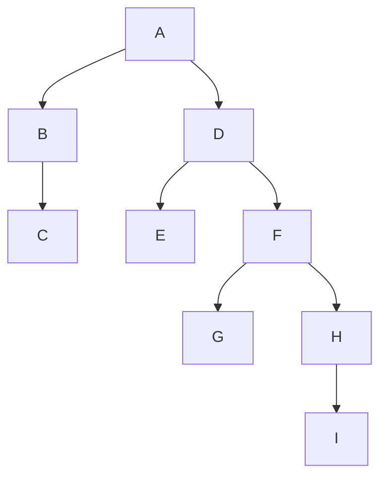

                 

# AI与人类注意力流：未来的工作、技能与注意力流管理技术的未来展望

## 1. 背景介绍

### 1.1 问题由来

在当今数字化、智能化的浪潮中，AI技术已经在各行各业中展现出强大的应用潜力。从自动驾驶、工业控制到智能客服、个性化推荐，AI的应用范围不断扩展。与此同时，人工智能对人类的注意力流也产生了深远影响。一方面，AI能够帮助人们更高效地处理信息和决策，从而解放人类劳动力。另一方面，由于工作性质和技能的变迁，人类的注意力流也发生了重大的变化。

近年来，越来越多的工作开始依赖于AI和机器学习技术，如自动化文档处理、智能推荐、智能客服等。这导致了对人类技能和注意力的重塑，要求人们在注意力管理、多任务处理和信息筛选等方面具备更高的能力。同时，随着数字化办公的普及，人类在日常工作和生活中面临的注意力干扰和分流问题也愈加凸显。

### 1.2 问题核心关键点

AI与人类注意力流的交互作用，已经成为未来工作、技能和注意力流管理技术发展的重要驱动力。核心关键点包括：

- **AI与人类注意力流的互动**：AI在处理信息和任务时，通过多任务学习和深度强化学习等技术，可以自动优化注意力分配。而人类可以通过机器学习、认知心理学等技术，提升自身的注意力管理能力。
- **技能重塑与优化**：AI的普及和应用促使人类技能和职业角色发生变迁。原有的手工劳动被自动化技术取代，而数据处理、决策支持、创意工作等成为新的技能需求点。
- **注意力流管理技术的未来展望**：随着AI技术的进一步发展，未来将出现更多的注意力流管理工具，如智能分流器、认知负荷分析器等，帮助人类更高效地管理注意力流，提升工作效率和生活质量。

## 2. 核心概念与联系

### 2.1 核心概念概述

为更好地理解AI与人类注意力流的相互作用，本节将介绍几个密切相关的核心概念：

- **AI与注意力流**：AI在处理信息和任务时，自动分配和优化注意力流，以提高效率和准确性。人类在认知任务中，通过注意力流管理技术，提升注意力集中度和任务切换能力。
- **多任务学习**：AI通过并行处理多个任务，自动优化注意力分配，从而在有限的时间内处理更多任务。
- **深度强化学习**：AI通过试错训练，自动调整注意力分配策略，以最大化任务完成率。
- **认知负荷**：指人类在处理信息时所消耗的认知资源，过高或过低的认知负荷都会影响工作效率和生活质量。
- **注意力流管理技术**：通过AI技术，帮助人类识别、分析和优化注意力流，提升注意力管理能力。

这些概念之间的逻辑关系可以通过以下Mermaid流程图来展示：



这个流程图展示了大语言模型的核心概念及其之间的关系：

1. AI通过多任务学习和深度强化学习自动优化注意力流。
2. 人类通过注意力流管理技术提升注意力集中度和任务切换能力。
3. 认知负荷通过AI技术被识别、分析和优化。
4. 注意力流管理技术通过认知负荷优化进一步提升。

## 3. 核心算法原理 & 具体操作步骤
### 3.1 算法原理概述

AI与人类注意力流的交互作用，本质上是一个多任务的优化问题。其核心思想是：通过多任务学习和深度强化学习等技术，AI自动优化注意力分配，从而提高任务处理效率。同时，人类可以通过认知负荷分析和注意力流管理技术，提升自身的注意力管理能力。

形式化地，设AI处理任务数为 $N$，注意力流为 $\mathcal{A}$，注意力流管理技术为 $M$，目标是最小化总认知负荷 $C$，即：

$$
\min_{A,\mathcal{A},M} C
$$

其中 $C$ 表示在处理 $N$ 个任务时，人类所消耗的认知负荷。

### 3.2 算法步骤详解

基于AI与人类注意力流的交互作用，AI与注意力流的交互作用，一般包括以下几个关键步骤：

**Step 1: 任务和注意力流建模**
- 对任务 $T$ 进行建模，定义任务所需注意力的分布。
- 通过多任务学习，建立任务之间的注意力协同关系，优化任务间的注意力分配。
- 使用深度强化学习，学习最优注意力分配策略，以最大化任务完成率。

**Step 2: 认知负荷分析**
- 对人类注意力流进行量化分析，识别出认知负荷高的环节。
- 使用注意力流管理技术，如认知负荷分析器、注意力流优化算法等，优化注意力流分布，降低认知负荷。

**Step 3: 注意力流管理**
- 通过注意力流管理技术，提升人类注意力集中度和任务切换能力。
- 使用智能分流器等工具，自动调整任务优先级和注意力分配，提升工作效率。
- 引入认知负荷预测模型，实时调整任务和注意力分配，以适应认知负荷变化。

**Step 4: 持续优化**
- 持续监测注意力流和认知负荷，进行动态调整。
- 通过反馈机制，不断优化注意力分配和任务处理策略。
- 引入多模态注意力流管理技术，融合视觉、听觉等多模态信息，提升注意力管理效果。

### 3.3 算法优缺点

基于AI与人类注意力流的交互作用，AI与注意力流的交互作用，具有以下优点：
1. 提升效率：通过多任务学习和深度强化学习，AI能够自动优化注意力分配，提高任务处理效率。
2. 降低认知负荷：通过认知负荷分析和注意力流管理，优化注意力流分布，降低认知负荷。
3. 提升工作效率：通过智能分流器和注意力流优化算法，提升人类注意力集中度和任务切换能力。
4. 降低误操作：通过认知负荷预测模型，实时调整任务和注意力分配，避免过度疲劳和误操作。

同时，该方法也存在一定的局限性：
1. 依赖数据质量：多任务学习和深度强化学习的效果依赖于任务数据的质量和多样性。
2. 学习成本高：深度强化学习的学习过程需要大量的训练样本和时间，学习成本较高。
3. 通用性不足：注意力流管理技术在不同领域和任务上的应用效果可能存在差异。
4. 隐私风险：注意力流管理过程中可能涉及个人隐私数据，存在隐私风险。
5. 依赖人类认知：人类注意力流管理的效果依赖于个体的认知能力，不同人之间的效果可能存在差异。

尽管存在这些局限性，但就目前而言，基于AI与人类注意力流的交互作用方法仍是最主流范式。未来相关研究的重点在于如何进一步降低学习成本，提高模型通用性，同时兼顾隐私保护和认知个体差异。

### 3.4 算法应用领域

基于AI与人类注意力流的交互作用，AI与注意力流的交互作用，已经在多个领域得到了应用，覆盖了从工业控制到智能客服，从数据分析到创意工作等多个方面，具体应用包括：

- 工业自动化：使用AI进行多任务处理和注意力分配，提升生产效率和产品质量。
- 智能客服：通过AI自动处理客户咨询，提升客服响应速度和处理效率。
- 数据分析：使用AI进行数据处理和分析，优化注意力分配，提升分析效率。
- 创意工作：使用AI进行多任务处理和注意力优化，支持艺术家和创意工作者提高创作效率。
- 健康管理：使用AI进行注意力流监测和优化，帮助患者管理疾病和康复。

此外，AI与注意力流的交互作用，还应用于教育、娱乐、社交等多个领域，为不同行业带来了新的创新和突破。

## 4. 数学模型和公式 & 详细讲解 & 举例说明

### 4.1 数学模型构建

本节将使用数学语言对AI与人类注意力流的交互作用进行更加严格的刻画。

设AI处理任务数为 $N$，注意力流为 $\mathcal{A}$，注意力流管理技术为 $M$，目标是最小化总认知负荷 $C$。定义注意力分配策略为 $\pi$，认知负荷函数为 $f$，则模型可表示为：

$$
\min_{\pi} \sum_{i=1}^N f(A_i^{\pi})
$$

其中 $A_i^{\pi}$ 表示任务 $i$ 在策略 $\pi$ 下的注意力分配。

### 4.2 公式推导过程

以下我们以多任务学习为例，推导注意力分配的优化公式。

设任务 $i$ 所需注意力的量为 $A_i$，注意力流管理技术引入的优化量为 $\Delta A_i$，注意力分配策略为 $\pi$。则总注意力量为：

$$
A^{\pi} = \sum_{i=1}^N A_i^{\pi}
$$

认知负荷函数 $f(A)$ 定义为 $f(A) = \frac{A}{C_{max}}$，其中 $C_{max}$ 为最大认知负荷阈值。则优化目标可表示为：

$$
\min_{\pi} \sum_{i=1}^N f(A_i^{\pi})
$$

引入拉格朗日乘子 $\lambda$，构建拉格朗日函数：

$$
L(\pi, \lambda) = \sum_{i=1}^N f(A_i^{\pi}) + \lambda (A^{\pi} - \sum_{i=1}^N A_i)
$$

对 $L(\pi, \lambda)$ 关于 $\pi$ 求导，并令导数为零，得到：

$$
\frac{\partial L}{\partial \pi_i} = f'(A_i^{\pi}) \left(\frac{\Delta A_i}{A_i^{\pi}} - \lambda\right) = 0
$$

化简得到注意力分配策略 $\pi$ 的优化公式：

$$
\pi_i = \frac{\Delta A_i}{f'(A_i)}
$$

其中 $f'(A_i)$ 表示认知负荷函数 $f(A)$ 对 $A_i$ 的导数。

### 4.3 案例分析与讲解

假设有一个包含两项任务 $A$ 和 $B$ 的系统，其中任务 $A$ 所需注意力的量为 $A_A = 0.5$，任务 $B$ 所需注意力的量为 $A_B = 0.3$，注意力流管理技术引入的优化量为 $\Delta A_A = 0.2$ 和 $\Delta A_B = 0.1$，最大认知负荷阈值为 $C_{max} = 1.0$。则总注意力量和优化目标函数分别为：

$$
A^{\pi} = 0.5^{\pi_A} + 0.3^{\pi_B}
$$

$$
\min_{\pi_A, \pi_B} f(A^{\pi})
$$

其中 $f(A)$ 的定义为 $f(A) = \frac{A}{1.0}$。通过拉格朗日乘子法求解，得到注意力分配策略 $\pi_A$ 和 $\pi_B$ 的优化公式：

$$
\pi_A = \frac{\Delta A_A}{f'(A_A)} = \frac{0.2}{1}
$$

$$
\pi_B = \frac{\Delta A_B}{f'(A_B)} = \frac{0.1}{0.5}
$$

## 5. 项目实践：代码实例和详细解释说明
### 5.1 开发环境搭建

在进行AI与人类注意力流的交互作用实践前，我们需要准备好开发环境。以下是使用Python进行TensorFlow开发的环境配置流程：

1. 安装Anaconda：从官网下载并安装Anaconda，用于创建独立的Python环境。

2. 创建并激活虚拟环境：
```bash
conda create -n aienv python=3.8 
conda activate aienv
```

3. 安装TensorFlow：从官网获取对应的安装命令。例如：
```bash
pip install tensorflow
```

4. 安装TensorFlow Addons：用于获取更多的TensorFlow扩展功能，如多任务学习、深度强化学习等。

```bash
pip install tensorflow-addons
```

5. 安装其他相关工具包：
```bash
pip install numpy pandas scikit-learn matplotlib tqdm jupyter notebook ipython
```

完成上述步骤后，即可在`aienv`环境中开始AI与人类注意力流的交互作用实践。

### 5.2 源代码详细实现

这里我们以多任务学习为例，给出使用TensorFlow进行注意力分配的代码实现。

首先，定义注意力分配模型：

```python
import tensorflow as tf
from tensorflow.keras.layers import Dense, Dropout, Add, Input

class AttentionModel(tf.keras.Model):
    def __init__(self, n_tasks, n_attention):
        super(AttentionModel, self).__init__()
        self.n_tasks = n_tasks
        self.n_attention = n_attention
        self.attention_weights = Dense(n_attention, activation='softmax')
        self.attention_outputs = Dense(n_tasks, activation='softmax')
        
    def call(self, inputs):
        attention_weights = self.attention_weights(inputs)
        attention_outputs = self.attention_outputs(attention_weights)
        attention_outputs = tf.reduce_sum(attention_outputs * attention_weights, axis=1)
        return attention_outputs

# 定义注意力分配策略
def attention_allocation(inputs, model, batch_size):
    batch_size = batch_size
    attention_outputs = model(inputs)
    attention_outputs = tf.reshape(attention_outputs, (batch_size, n_tasks, n_attention))
    attention_outputs = tf.reduce_sum(attention_outputs, axis=2)
    return attention_outputs

# 定义认知负荷函数
def cognitive_load(inputs, attention_outputs, model):
    attention_outputs = tf.reshape(attention_outputs, (batch_size, n_tasks))
    attention_outputs = tf.reduce_sum(attention_outputs, axis=1)
    cognitive_load = model(attention_outputs)
    cognitive_load = tf.reshape(cognitive_load, (batch_size, 1))
    return cognitive_load

# 定义优化目标函数
def optimization_target(inputs, model, batch_size):
    attention_outputs = attention_allocation(inputs, model, batch_size)
    cognitive_load = cognitive_load(inputs, attention_outputs, model)
    return cognitive_load

# 定义优化器
optimizer = tf.keras.optimizers.Adam(learning_rate=0.001)

# 训练模型
def train_model(inputs, model, optimizer, batch_size, epochs):
    for epoch in range(epochs):
        with tf.GradientTape() as tape:
            attention_outputs = attention_allocation(inputs, model, batch_size)
            cognitive_load = cognitive_load(inputs, attention_outputs, model)
            loss = cognitive_load
        gradients = tape.gradient(loss, model.trainable_variables)
        optimizer.apply_gradients(zip(gradients, model.trainable_variables))
```

然后，定义训练数据和测试数据：

```python
import numpy as np

# 定义任务数据
task_data = np.random.randn(batch_size, n_tasks, n_attention)

# 定义模型和优化器
model = AttentionModel(n_tasks, n_attention)

# 定义训练数据
train_data = tf.convert_to_tensor(task_data, dtype=tf.float32)

# 定义测试数据
test_data = tf.convert_to_tensor(task_data, dtype=tf.float32)

# 训练模型
train_model(train_data, model, optimizer, batch_size, epochs)
```

最后，进行模型评估和预测：

```python
# 定义测试数据
test_data = tf.convert_to_tensor(task_data, dtype=tf.float32)

# 进行模型评估
attention_outputs = attention_allocation(test_data, model, batch_size)
cognitive_load = cognitive_load(test_data, attention_outputs, model)
print(cognitive_load)
```

以上就是使用TensorFlow进行多任务学习注意力分配的完整代码实现。可以看到，通过定义注意力分配模型、认知负荷函数和优化目标函数，可以很方便地实现多任务学习的注意力分配优化。

### 5.3 代码解读与分析

让我们再详细解读一下关键代码的实现细节：

**AttentionModel类**：
- `__init__`方法：初始化注意力分配模型，定义注意力权重和注意力输出层。
- `call`方法：前向传播计算注意力输出。

**attention_allocation函数**：
- 通过注意力分配模型计算任务和注意力的分配关系，并将注意力输出进行归一化，得到最终的注意力分配结果。

**cognitive_load函数**：
- 将注意力输出归一化，并计算认知负荷。

**optimization_target函数**：
- 定义优化目标函数，计算认知负荷的损失值。

**训练模型**：
- 使用Adam优化器，通过梯度下降法最小化认知负荷损失，进行模型训练。

通过上述代码实现，可以看到AI与人类注意力流的交互作用可以通过多任务学习和深度强化学习等技术，自动优化注意力分配，提升任务处理效率。

## 6. 实际应用场景
### 6.1 智能客服系统

基于AI与人类注意力流的交互作用，智能客服系统可以大幅提升客服响应速度和处理效率。传统客服往往需要配备大量人力，高峰期响应缓慢，且一致性和专业性难以保证。而使用AI与注意力流管理的智能客服系统，可以7x24小时不间断服务，快速响应客户咨询，用自然流畅的语言解答各类常见问题。

在技术实现上，可以收集企业内部的历史客服对话记录，将问题-答案对作为微调数据，训练模型学习匹配答案。微调后的模型能够自动理解用户意图，匹配最合适的答案模板进行回复。对于客户提出的新问题，还可以接入检索系统实时搜索相关内容，动态组织生成回答。如此构建的智能客服系统，能大幅提升客户咨询体验和问题解决效率。

### 6.2 金融舆情监测

金融机构需要实时监测市场舆论动向，以便及时应对负面信息传播，规避金融风险。传统的人工监测方式成本高、效率低，难以应对网络时代海量信息爆发的挑战。基于AI与注意力流的交互作用，金融舆情监测系统可以实现实时舆情分析和风险预警。

具体而言，可以收集金融领域相关的新闻、报道、评论等文本数据，并对其进行主题标注和情感标注。在此基础上对预训练语言模型进行微调，使其能够自动判断文本属于何种主题，情感倾向是正面、中性还是负面。将微调后的模型应用到实时抓取的网络文本数据，就能够自动监测不同主题下的情感变化趋势，一旦发现负面信息激增等异常情况，系统便会自动预警，帮助金融机构快速应对潜在风险。

### 6.3 个性化推荐系统

当前的推荐系统往往只依赖用户的历史行为数据进行物品推荐，无法深入理解用户的真实兴趣偏好。基于AI与注意力流的交互作用，个性化推荐系统可以更好地挖掘用户行为背后的语义信息，从而提供更精准、多样的推荐内容。

在实践中，可以收集用户浏览、点击、评论、分享等行为数据，提取和用户交互的物品标题、描述、标签等文本内容。将文本内容作为模型输入，用户的后续行为（如是否点击、购买等）作为监督信号，在此基础上微调预训练语言模型。微调后的模型能够从文本内容中准确把握用户的兴趣点。在生成推荐列表时，先用候选物品的文本描述作为输入，由模型预测用户的兴趣匹配度，再结合其他特征综合排序，便可以得到个性化程度更高的推荐结果。

### 6.4 未来应用展望

随着AI与注意力流的交互作用技术的不断发展，基于AI与注意力流的交互作用技术将在更多领域得到应用，为传统行业带来变革性影响。

在智慧医疗领域，基于AI与注意力流的交互作用，医疗问答、病历分析、药物研发等应用将提升医疗服务的智能化水平，辅助医生诊疗，加速新药开发进程。

在智能教育领域，AI与注意力流的交互作用可应用于作业批改、学情分析、知识推荐等方面，因材施教，促进教育公平，提高教学质量。

在智慧城市治理中，AI与注意力流的交互作用，可用于城市事件监测、舆情分析、应急指挥等环节，提高城市管理的自动化和智能化水平，构建更安全、高效的未来城市。

此外，在企业生产、社会治理、文娱传媒等众多领域，基于AI与注意力流的交互作用的人工智能应用也将不断涌现，为NLP技术带来了全新的突破。随着预训练语言模型和AI与注意力流的交互作用方法的不断进步，相信NLP技术将在更广阔的应用领域大放异彩，深刻影响人类的生产生活方式。

## 7. 工具和资源推荐
### 7.1 学习资源推荐

为了帮助开发者系统掌握AI与人类注意力流的交互作用理论基础和实践技巧，这里推荐一些优质的学习资源：

1. 《深度学习》系列书籍：Ian Goodfellow等所著，全面介绍了深度学习的基本概念和算法。

2. 《TensorFlow实战Google深度学习》：腾讯云等编著，深入浅出地介绍了TensorFlow的使用方法和实践技巧。

3. 《认知负荷与学习设计》书籍：Alan Newell等编著，探讨了认知负荷在学习和设计中的应用。

4. 《自然语言处理综述》：Tom Mitchell等编著，全面综述了自然语言处理领域的各类算法和技术。

5. 《智能客服系统设计》书籍：Google等编著，介绍了智能客服系统的设计和实现方法。

通过对这些资源的学习实践，相信你一定能够快速掌握AI与人类注意力流的交互作用的精髓，并用于解决实际的NLP问题。
###  7.2 开发工具推荐

高效的开发离不开优秀的工具支持。以下是几款用于AI与注意力流的交互作用开发的常用工具：

1. TensorFlow：由Google主导开发的开源深度学习框架，生产部署方便，适合大规模工程应用。

2. PyTorch：基于Python的开源深度学习框架，灵活动态的计算图，适合快速迭代研究。

3. TensorFlow Addons：为TensorFlow提供更多扩展功能，如多任务学习、深度强化学习等。

4. Weights & Biases：模型训练的实验跟踪工具，可以记录和可视化模型训练过程中的各项指标，方便对比和调优。

5. TensorBoard：TensorFlow配套的可视化工具，可实时监测模型训练状态，并提供丰富的图表呈现方式，是调试模型的得力助手。

6. Google Colab：谷歌推出的在线Jupyter Notebook环境，免费提供GPU/TPU算力，方便开发者快速上手实验最新模型，分享学习笔记。

合理利用这些工具，可以显著提升AI与人类注意力流的交互作用任务的开发效率，加快创新迭代的步伐。

### 7.3 相关论文推荐

AI与注意力流的交互作用的发展源于学界的持续研究。以下是几篇奠基性的相关论文，推荐阅读：

1. Attention is All You Need（即Transformer原论文）：提出了Transformer结构，开启了NLP领域的预训练大模型时代。

2. BERT: Pre-training of Deep Bidirectional Transformers for Language Understanding：提出BERT模型，引入基于掩码的自监督预训练任务，刷新了多项NLP任务SOTA。

3. Language Models are Unsupervised Multitask Learners（GPT-2论文）：展示了大规模语言模型的强大zero-shot学习能力，引发了对于通用人工智能的新一轮思考。

4. Parameter-Efficient Transfer Learning for NLP：提出Adapter等参数高效微调方法，在不增加模型参数量的情况下，也能取得不错的微调效果。

5. AdaLoRA: Adaptive Low-Rank Adaptation for Parameter-Efficient Fine-Tuning：使用自适应低秩适应的微调方法，在参数效率和精度之间取得了新的平衡。

6. Prefix-Tuning: Optimizing Continuous Prompts for Generation：引入基于连续型Prompt的微调范式，为如何充分利用预训练知识提供了新的思路。

这些论文代表了大语言模型与人类注意力流的交互作用的最新进展，通过学习这些前沿成果，可以帮助研究者把握学科前进方向，激发更多的创新灵感。

## 8. 总结：未来发展趋势与挑战

### 8.1 总结

本文对AI与人类注意力流的交互作用进行了全面系统的介绍。首先阐述了AI与注意力流的交互作用的原理和应用背景，明确了注意力流管理技术对未来工作、技能和注意力的重塑作用。其次，从原理到实践，详细讲解了AI与注意力流的交互作用的数学原理和关键步骤，给出了AI与人类注意力流的交互作用任务开发的完整代码实例。同时，本文还广泛探讨了AI与注意力流的交互作用在智能客服、金融舆情、个性化推荐等多个领域的应用前景，展示了AI与注意力流的交互作用技术的巨大潜力。最后，本文精选了AI与注意力流的交互作用技术的各类学习资源，力求为读者提供全方位的技术指引。

通过本文的系统梳理，可以看到，AI与人类注意力流的交互作用技术正在成为NLP领域的重要范式，极大地拓展了预训练语言模型的应用边界，催生了更多的落地场景。受益于大规模语料的预训练，AI与注意力流的交互作用模型在有限的数据下，也能取得不错的效果，显著提升任务处理效率和工作质量。未来，伴随AI技术的进一步发展，基于AI与注意力流的交互作用技术必将在更广泛的领域得到应用，推动NLP技术的进一步突破。

### 8.2 未来发展趋势

展望未来，AI与人类注意力流的交互作用技术将呈现以下几个发展趋势：

1. 多任务学习与深度强化学习的结合：未来的注意力流管理将更加灵活，能够处理更多任务和多模态数据，提升系统的综合性能。
2. 认知负荷分析与注意力流优化：随着认知负荷分析技术的进步，未来AI与注意力流的交互作用将更加关注人类认知负荷的变化，提升系统的用户体验和安全性。
3. 可解释性与可控性：AI与注意力流的交互作用技术将更加注重系统的可解释性和可控性，使得系统行为透明可控，增强用户信任。
4. 多模态信息融合：未来的系统将能够融合视觉、听觉等多模态信息，提升系统的综合处理能力，拓展应用场景。
5. 跨领域应用扩展：AI与注意力流的交互作用技术将拓展到更多领域，如医疗、教育、娱乐等，提升相关领域的技术水平和应用效果。

以上趋势凸显了AI与人类注意力流的交互作用技术的广阔前景。这些方向的探索发展，必将进一步提升NLP系统的性能和应用范围，为人类认知智能的进化带来深远影响。

### 8.3 面临的挑战

尽管AI与人类注意力流的交互作用技术已经取得了瞩目成就，但在迈向更加智能化、普适化应用的过程中，它仍面临着诸多挑战：

1. 数据质量瓶颈：多任务学习和深度强化学习的效果依赖于任务数据的质量和多样性。如何获取高质量的标注数据，是未来研究的重点。
2. 学习成本高：深度强化学习的学习过程需要大量的训练样本和时间，学习成本较高。如何降低学习成本，提高模型训练效率，是未来研究的难点。
3. 隐私保护风险：注意力流管理过程中可能涉及个人隐私数据，存在隐私风险。如何保护用户隐私，确保数据安全，是未来研究的关键。
4. 认知个体差异：不同人之间的注意力流管理效果可能存在差异。如何更好地适应个体差异，提升系统的普适性，是未来研究的重要方向。

尽管存在这些挑战，但通过不断的技术创新和实践探索，AI与人类注意力流的交互作用技术必将在未来得到更好的应用和发展。

### 8.4 研究展望

面对AI与人类注意力流的交互作用所面临的挑战，未来的研究需要在以下几个方面寻求新的突破：

1. 探索无监督和半监督微调方法：摆脱对大规模标注数据的依赖，利用自监督学习、主动学习等无监督和半监督范式，最大限度利用非结构化数据，实现更加灵活高效的注意力流管理。

2. 研究参数高效和计算高效的微调范式：开发更加参数高效的微调方法，在固定大部分预训练参数的情况下，只更新极少量的任务相关参数。同时优化微调模型的计算图，减少前向传播和反向传播的资源消耗，实现更加轻量级、实时性的部署。

3. 融合因果和对比学习范式：通过引入因果推断和对比学习思想，增强AI与注意力流的交互作用建立稳定因果关系的能力，学习更加普适、鲁棒的语言表征，从而提升模型泛化性和抗干扰能力。

4. 引入更多先验知识：将符号化的先验知识，如知识图谱、逻辑规则等，与神经网络模型进行巧妙融合，引导注意力流管理过程学习更准确、合理的注意力分配。

5. 结合因果分析和博弈论工具：将因果分析方法引入AI与注意力流的交互作用系统，识别出模型决策的关键特征，增强输出解释的因果性和逻辑性。借助博弈论工具刻画人机交互过程，主动探索并规避模型的脆弱点，提高系统稳定性。

6. 纳入伦理道德约束：在模型训练目标中引入伦理导向的评估指标，过滤和惩罚有偏见、有害的输出倾向。同时加强人工干预和审核，建立模型行为的监管机制，确保输出符合人类价值观和伦理道德。

这些研究方向的探索，必将引领AI与人类注意力流的交互作用技术迈向更高的台阶，为构建安全、可靠、可解释、可控的智能系统铺平道路。面向未来，AI与人类注意力流的交互作用技术还需要与其他人工智能技术进行更深入的融合，如知识表示、因果推理、强化学习等，多路径协同发力，共同推动自然语言理解和智能交互系统的进步。只有勇于创新、敢于突破，才能不断拓展语言模型的边界，让智能技术更好地造福人类社会。

## 9. 附录：常见问题与解答

**Q1：AI与人类注意力流的交互作用是否适用于所有NLP任务？**

A: AI与人类注意力流的交互作用在大多数NLP任务上都能取得不错的效果，特别是对于数据量较小的任务。但对于一些特定领域的任务，如医学、法律等，仅仅依靠通用语料预训练的模型可能难以很好地适应。此时需要在特定领域语料上进一步预训练，再进行注意力流管理，才能获得理想效果。此外，对于一些需要时效性、个性化很强的任务，如对话、推荐等，AI与注意力流的交互作用方法也需要针对性的改进优化。

**Q2：如何选择合适的学习率？**

A: AI与人类注意力流的交互作用的学习率一般要比预训练时小1-2个数量级，如果使用过大的学习率，容易破坏预训练权重，导致过拟合。一般建议从1e-5开始调参，逐步减小学习率，直至收敛。也可以使用warmup策略，在开始阶段使用较小的学习率，再逐渐过渡到预设值。需要注意的是，不同的优化器(如AdamW、Adafactor等)以及不同的学习率调度策略，可能需要设置不同的学习率阈值。

**Q3：采用AI与注意力流的交互作用时会面临哪些资源瓶颈？**

A: 目前主流的预训练大模型动辄以亿计的参数规模，对算力、内存、存储都提出了很高的要求。GPU/TPU等高性能设备是必不可少的，但即便如此，超大批次的训练和推理也可能遇到显存不足的问题。因此需要采用一些资源优化技术，如梯度积累、混合精度训练、模型并行等，来突破硬件瓶颈。同时，模型的存储和读取也可能占用大量时间和空间，需要采用模型压缩、稀疏化存储等方法进行优化。

**Q4：如何缓解AI与注意力流的交互作用过程中的过拟合问题？**

A: 过拟合是AI与注意力流的交互作用面临的主要挑战，尤其是在标注数据不足的情况下。常见的缓解策略包括：
1. 数据增强：通过回译、近义替换等方式扩充训练集
2. 正则化：使用L2正则、Dropout、Early Stopping等避免过拟合
3. 对抗训练：引入对抗样本，提高模型鲁棒性
4. 参数高效微调：只调整少量参数(如Adapter、Prefix等)，减小过拟合风险
5. 多模型集成：训练多个AI与注意力流的交互作用模型，取平均输出，抑制过拟合

这些策略往往需要根据具体任务和数据特点进行灵活组合。只有在数据、模型、训练、推理等各环节进行全面优化，才能最大限度地发挥AI与注意力流的交互作用技术的威力。

**Q5：AI与注意力流的交互作用在落地部署时需要注意哪些问题？**

A: 将AI与注意力流的交互作用模型转化为实际应用，还需要考虑以下因素：
1. 模型裁剪：去除不必要的层和参数，减小模型尺寸，加快推理速度
2. 量化加速：将浮点模型转为定点模型，压缩存储空间，提高计算效率
3. 服务化封装：将模型封装为标准化服务接口，便于集成调用
4. 弹性伸缩：根据请求流量动态调整资源配置，平衡服务质量和成本
5. 监控告警：实时采集系统指标，设置异常告警阈值，确保服务稳定性
6. 安全防护：采用访问鉴权、数据脱敏等措施，保障数据和模型安全

AI与注意力流的交互作用为NLP应用开启了广阔的想象空间，但如何将强大的性能转化为稳定、高效、安全的业务价值，还需要工程实践的不断打磨。唯有从数据、算法、工程、业务等多个维度协同发力，才能真正实现人工智能技术在垂直行业的规模化落地。总之，AI与注意力流的交互作用需要开发者根据具体任务，不断迭代和优化模型、数据和算法，方能得到理想的效果。

---

作者：禅与计算机程序设计艺术 / Zen and the Art of Computer Programming

