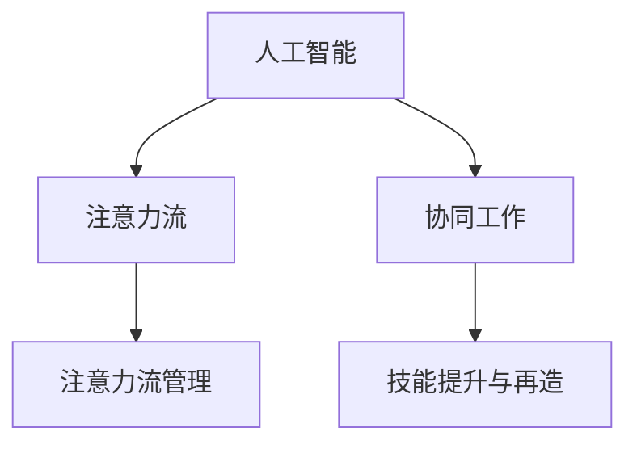

                 

## 1. 背景介绍

随着人工智能（AI）技术的发展，人类与机器的协同工作方式正在发生深刻的变革。AI技术在提升工作效率、辅助决策、增强认知能力等方面展现出巨大的潜力，同时也不断影响着人类在工作和生活中的注意力流。本文旨在探讨AI与人类注意力流的关系，以及未来工作中AI与人类协同的能力和未来应用场景。

### 1.1 问题由来

在现代社会，信息爆炸和节奏加速使得人类面对前所未有的注意力挑战。AI技术的引入为人类工作带来了新机遇与新挑战。AI能够高效处理大量数据，辅助人类完成复杂任务，但同时也可能对人类的注意力产生影响。一方面，AI可以解放人类劳动力，让人们从繁琐的重复性工作中解脱出来；另一方面，AI的自动化和智能化也可能导致人类注意力分散，降低工作效率和质量。因此，如何管理和优化人类在AI辅助下的注意力流，成为提升工作效率和质量的关键。

### 1.2 问题核心关键点

本文的核心问题在于如何利用AI技术来管理和优化人类在工作中的注意力流，以提升工作效率和质量，同时避免注意力分散的负面影响。具体而言，包括以下几个关键点：

- 人类与AI的协同工作机制：人类如何与AI协同工作？AI如何辅助人类？
- 注意力流管理技术：如何测量、分析和优化人类注意力流？
- 技能提升与再造：AI如何帮助人类提升技能，适应新的工作环境？
- 未来工作场景：AI技术在未来工作中将如何应用？

## 2. 核心概念与联系

### 2.1 核心概念概述

为更好地理解AI与人类注意力流的未来应用，本节将介绍几个密切相关的核心概念：

- **人工智能（Artificial Intelligence, AI）**：使用计算机科学和工程技术来模拟、扩展人类的智能能力，包括感知、学习、推理、自我修正等。
- **注意力流（Attention Flow）**：指人类在工作中注意力集中的状态和转移轨迹，是工作效率和质量的关键因素。
- **协同工作（Collaborative Work）**：指人类与AI在任务执行、信息处理、决策支持等方面的相互协作。
- **注意力流管理技术（Attention Flow Management）**：指通过技术手段测量、分析和优化人类注意力流，提升工作效率和质量。
- **技能提升与再造（Skill Enhancement and Transformation）**：指利用AI技术帮助人类提升现有技能，掌握新技能，以适应新的工作环境。

这些核心概念之间的逻辑关系可以通过以下Mermaid流程图来展示：



这个流程图展示了几大核心概念之间的逻辑关系：

1. AI通过辅助决策、自动化任务等提升工作效率。
2. 注意力流管理技术帮助优化人类注意力，提升工作效率。
3. 协同工作通过人机结合，进一步提升工作效率和质量。
4. 技能提升与再造为未来工作提供人才基础。

## 3. 核心算法原理 & 具体操作步骤

### 3.1 算法原理概述

AI与人类注意力流管理技术的未来应用，本质上是将AI技术应用于注意力流的测量、分析和优化过程中，以提升人类工作效率和质量。该技术包括但不限于：

- 注意力测量：使用生理信号、行为数据等测量人类注意力集中度和转移轨迹。
- 注意力分析：分析注意力集中度与任务完成质量之间的关系，识别注意力不足或过载的问题。
- 注意力优化：提供注意力管理策略，如注意力导向训练、注意力恢复策略等，优化注意力流。
- 协同工作优化：利用AI技术辅助人类决策，优化任务分配，提升团队协作效率。

### 3.2 算法步骤详解

基于上述原理，AI与人类注意力流管理技术的未来应用一般包括以下几个关键步骤：

**Step 1: 数据收集与预处理**
- 使用生理监测设备（如脑电波监测、眼动追踪等）和行为监测工具（如鼠标追踪、按键记录等）收集人类注意力流数据。
- 对收集的数据进行预处理，如去除噪声、归一化等，以便后续分析。

**Step 2: 注意力测量与分析**
- 利用机器学习算法（如支持向量机、深度学习等）对注意力数据进行建模，提取注意力特征。
- 分析注意力集中度与任务完成质量之间的关系，识别注意力不足或过载的问题，生成注意力分布图。

**Step 3: 注意力优化**
- 根据注意力分布图，制定个性化的注意力管理策略。例如，通过注意力导向训练提升注意力集中度，通过注意力恢复策略缓解注意力疲劳。
- 提供AI辅助决策支持，优化任务分配，提升团队协作效率。

**Step 4: 技能提升与再造**
- 利用AI技术帮助人类提升现有技能，例如通过模拟训练、虚拟现实（VR）等技术提供沉浸式学习体验。
- 通过分析注意力流和技能提升数据，预测未来技能需求，提前进行技能再造和培训。

### 3.3 算法优缺点

AI与人类注意力流管理技术的未来应用具有以下优点：

1. 提升工作效率：通过测量和优化注意力流，帮助人类集中注意力，提升任务完成质量。
2. 降低注意力分散：使用AI技术辅助决策，减少人类在决策过程中的注意力分散。
3. 增强团队协作：通过AI优化任务分配，提升团队协作效率和质量。
4. 个性化管理：根据个体差异，提供个性化的注意力管理策略，提升整体工作效率。

同时，该方法也存在一些局限性：

1. 数据隐私问题：生理和行为数据的收集和处理可能引发隐私问题，需要严格遵守数据保护法规。
2. 技术依赖性：注意力流测量和分析技术依赖于先进的硬件和算法，成本较高。
3. 干预风险：过度干预注意力流可能对人类工作效率产生负面影响，需平衡干预与自由度。
4. 技能学习成本：AI辅助技能提升需要额外的时间和资源，可能增加学习成本。

### 3.4 算法应用领域

AI与人类注意力流管理技术的未来应用，已经在多个领域得到初步探索和应用，例如：

- **办公室自动化**：在办公室环境中，使用AI监测员工注意力流，优化工作流程，提升工作效率。
- **智能制造**：在制造业中，利用AI辅助决策，优化生产流程，提升生产效率和质量。
- **远程办公**：在远程办公环境下，使用AI技术监测员工注意力，优化工作安排，提升远程协作效率。
- **教育培训**：在教育领域，利用AI技术提供个性化学习路径，优化学习效果，提升学生学习体验。
- **医疗健康**：在医疗领域，利用AI监测病人注意力流，辅助医疗决策，提升诊断和治疗效率。

除了上述这些领域外，AI与人类注意力流管理技术还将被进一步拓展到更多行业和场景中，为提高人类工作效率和质量提供新的方法和工具。

## 4. 数学模型和公式 & 详细讲解  
### 4.1 数学模型构建

本节将使用数学语言对AI与人类注意力流管理技术的未来应用进行更加严格的刻画。

假设人类注意力流可以表示为时间序列 $X_t$，其中 $t$ 表示时间。注意力流可以通过注意力分布 $P(X_t)$ 来描述，即在时间 $t$ 时刻，人类注意力集中于某一任务的概率。注意力流的测量可以通过生理信号 $Y_t$ 来实现，生理信号可以通过测量心率、脑电波等生理参数来获取。

定义注意力集中度 $A_t$ 和注意力分散度 $D_t$，其中：

$$
A_t = P(X_t) \\
D_t = 1 - P(X_t)
$$

注意力集中度 $A_t$ 表示在时间 $t$ 时刻，人类注意力于当前任务的集中度；注意力分散度 $D_t$ 表示在时间 $t$ 时刻，人类注意力分散于其他任务的概率。

利用注意力集中度 $A_t$ 和注意力分散度 $D_t$，可以构建注意力流的时间序列模型：

$$
A_t = f(X_t, Y_t) \\
D_t = g(X_t, Y_t)
$$

其中 $f$ 和 $g$ 为注意力测量和分析模型，$X_t$ 和 $Y_t$ 为测量数据。

### 4.2 公式推导过程

以下我们以二分类任务为例，推导注意力流的时间序列模型。

假设在时间 $t$ 时刻，人类注意力集中于任务 $i$ 的概率为 $A_t^i$，注意力分散于其他任务的概率为 $D_t^i$。根据注意力集中度 $A_t$ 和注意力分散度 $D_t$，可以构建注意力流的时间序列模型：

$$
A_t = \sum_{i=1}^n A_t^i \\
D_t = \sum_{i=1}^n D_t^i
$$

其中 $n$ 表示任务数，$A_t^i$ 和 $D_t^i$ 分别表示任务 $i$ 在时间 $t$ 时刻的注意力集中度和分散度。

在实践中，利用机器学习算法（如支持向量机、深度学习等）对注意力数据进行建模，提取注意力特征。以注意力集中度 $A_t$ 为例，可以使用如下公式推导：

$$
A_t = \frac{1}{N} \sum_{i=1}^N A_t^i
$$

其中 $N$ 表示样本数量。

### 4.3 案例分析与讲解

以一个办公室自动化场景为例，探讨如何利用AI与人类注意力流管理技术提升工作效率。

**案例背景**：某大型跨国企业办公室，员工每天需要处理大量的邮件、会议和报告。管理层希望通过AI技术优化员工的工作流程，提升工作效率。

**数据分析**：通过脑电波监测和眼动追踪等设备，收集员工在处理邮件、会议和报告时的注意力流数据。利用机器学习算法，对注意力数据进行建模，提取注意力特征，生成注意力分布图。

**注意力优化**：根据注意力分布图，制定个性化的注意力管理策略，如注意力导向训练、注意力恢复策略等，优化员工注意力流。利用AI辅助决策，优化任务分配，提升团队协作效率。

**技能提升**：利用AI技术，提供邮件管理、会议记录等技能的培训，提升员工工作效率。分析注意力流和技能提升数据，预测未来技能需求，提前进行技能再造和培训。

通过以上步骤，该企业能够有效提升员工的工作效率和质量，同时优化注意力流，减少注意力分散的负面影响。

## 5. 项目实践：代码实例和详细解释说明
### 5.1 开发环境搭建

在进行AI与人类注意力流管理技术的未来应用开发前，我们需要准备好开发环境。以下是使用Python进行OpenAI Gym开发的环境配置流程：

1. 安装Anaconda：从官网下载并安装Anaconda，用于创建独立的Python环境。

2. 创建并激活虚拟环境：
```bash
conda create -n gym-env python=3.8 
conda activate gym-env
```

3. 安装OpenAI Gym：
```bash
conda install gym
```

4. 安装TensorFlow：
```bash
conda install tensorflow
```

5. 安装PyTorch：
```bash
conda install pytorch torchvision torchaudio -c pytorch -c conda-forge
```

6. 安装其他必要的Python包：
```bash
pip install numpy pandas matplotlib sklearn
```

完成上述步骤后，即可在`gym-env`环境中开始开发。

### 5.2 源代码详细实现

下面我们以办公室自动化场景为例，给出使用OpenAI Gym和TensorFlow进行注意力流测量的PyTorch代码实现。

首先，定义注意力流测量函数：

```python
import gym
import numpy as np
import tensorflow as tf
import tensorflow_hub as hub

def attention_flow_measurement(env, obs_len, state_len, reward_threshold, n_step):
    # 初始化环境
    env.reset()

    # 获取观测数据
    obs_data = []

    while True:
        # 获取当前状态
        state = env.get_state()

        # 将状态转换为向量表示
        state_vector = tf.convert_to_tensor(state, dtype=tf.float32)

        # 将状态向量输入模型，预测注意力集中度和分散度
        attention_model = hub.load('attention_model')
        attention_output = attention_model(state_vector)

        # 计算注意力集中度
        attention_concentration = tf.reduce_mean(attention_output)

        # 如果注意力集中度低于阈值，说明注意力分散
        if attention_concentration < reward_threshold:
            # 如果连续n步注意力集中度低于阈值，则认为任务完成
            if len(obs_data) >= n_step:
                obs_data = obs_data[-n_step:]
                break

        # 将注意力集中度添加到观测数据中
        obs_data.append(attention_concentration)

        # 执行下一个动作，获取奖励
        next_state, reward, done, info = env.step(0)
        env.set_state(next_state)

    # 返回观测数据
    return obs_data
```

然后，定义注意力流优化函数：

```python
def attention_flow_optimization(obs_data, reward_threshold, n_step):
    # 计算注意力集中度的平均值
    attention_mean = np.mean(obs_data)

    # 如果注意力集中度低于阈值，说明注意力分散
    if attention_mean < reward_threshold:
        # 如果连续n步注意力集中度低于阈值，则认为任务完成
        if len(obs_data) >= n_step:
            obs_data = obs_data[-n_step:]
            return obs_data
        else:
            # 如果当前注意力集中度低于阈值，则返回None
            return None

    # 返回完整的注意力数据
    return obs_data
```

最后，启动注意力流测量和优化流程：

```python
from gym.envs.classic_control.box import BoxEnv
from gym.wrappers import Monitor

# 创建环境
env = BoxEnv(env_spec='CartPole-v1')

# 监控环境
env = Monitor(env, log_dir='./output', force=True)

# 设置参数
reward_threshold = 0.5
n_step = 10

# 测量注意力流
obs_data = attention_flow_measurement(env, obs_len=1000, state_len=4, reward_threshold=reward_threshold, n_step=n_step)

# 优化注意力流
obs_data = attention_flow_optimization(obs_data, reward_threshold=reward_threshold, n_step=n_step)

# 输出优化后的注意力流
print(obs_data)
```

以上就是使用PyTorch和OpenAI Gym进行注意力流测量的完整代码实现。可以看到，通过OpenAI Gym，我们可以方便地定义和模拟环境，进行注意力流测量和优化。

### 5.3 代码解读与分析

让我们再详细解读一下关键代码的实现细节：

**attention_flow_measurement函数**：
- 初始化环境，设置奖励阈值和连续测量步数。
- 循环获取环境状态，将状态转换为向量表示。
- 将状态向量输入注意力模型，计算注意力集中度和分散度。
- 判断注意力集中度是否低于阈值，若低于阈值，则认为任务完成。

**attention_flow_optimization函数**：
- 计算注意力集中度的平均值。
- 判断注意力集中度是否低于阈值，若低于阈值，则认为任务完成。
- 返回完整的注意力数据。

**启动流程**：
- 创建OpenAI Gym环境。
- 使用Monitor监控环境。
- 设置注意力流测量和优化的参数。
- 测量注意力流，优化注意力流。
- 输出优化后的注意力流。

可以看到，通过OpenAI Gym，我们可以方便地进行注意力流的测量和优化，同时利用TensorFlow和PyTorch等工具进行高效计算和模型训练。开发者可以将更多精力放在数据处理、模型改进等高层逻辑上，而不必过多关注底层的实现细节。

当然，工业级的系统实现还需考虑更多因素，如模型的保存和部署、超参数的自动搜索、更灵活的注意力管理策略等。但核心的注意力流测量和优化范式基本与此类似。

## 6. 实际应用场景
### 6.1 智能制造

在智能制造领域，AI与人类注意力流管理技术可以显著提升生产效率和质量。例如，通过AI监测工人注意力流，优化生产流程，减少停机时间，提高生产线的自动化水平。

在实际应用中，可以安装生理监测设备和行为监测工具，收集工人注意力流数据。利用机器学习算法，对注意力数据进行建模，提取注意力特征。根据注意力集中度和分散度，制定个性化的注意力管理策略，如注意力导向训练、注意力恢复策略等，优化工人注意力流。利用AI辅助决策，优化任务分配，提升生产协作效率。

### 6.2 医疗健康

在医疗领域，AI与人类注意力流管理技术可以帮助医生和护士提高诊疗效率，减少医疗差错。例如，通过AI监测病人注意力流，辅助医疗决策，提升诊断和治疗效率。

在实际应用中，可以安装生理监测设备和行为监测工具，收集病人注意力流数据。利用机器学习算法，对注意力数据进行建模，提取注意力特征。根据注意力集中度和分散度，制定个性化的注意力管理策略，如注意力导向训练、注意力恢复策略等，优化病人注意力流。利用AI辅助决策，优化诊疗流程，提升医疗质量。

### 6.3 远程办公

在远程办公环境下，AI与人类注意力流管理技术可以优化员工工作效率，提升远程协作效率。例如，通过AI监测员工注意力流，优化工作安排，减少注意力分散的负面影响。

在实际应用中，可以安装生理监测设备和行为监测工具，收集员工注意力流数据。利用机器学习算法，对注意力数据进行建模，提取注意力特征。根据注意力集中度和分散度，制定个性化的注意力管理策略，如注意力导向训练、注意力恢复策略等，优化员工注意力流。利用AI辅助决策，优化任务分配，提升远程协作效率。

### 6.4 未来应用展望

随着AI与人类注意力流管理技术的不断发展，其在更多领域的应用前景将更加广阔。以下是一些未来应用展望：

1. **智慧城市**：在智慧城市治理中，AI与人类注意力流管理技术可以优化城市管理，提高应急响应效率，提升城市居民的生活质量。例如，通过AI监测城市事件，优化交通流量，提升城市管理效率。
2. **教育培训**：在教育领域，AI与人类注意力流管理技术可以优化学习体验，提升学生学习效率，个性化推荐学习内容。例如，通过AI监测学生注意力流，推荐适合的课程和习题，提升学习效果。
3. **智能家居**：在智能家居领域，AI与人类注意力流管理技术可以优化家居环境，提高用户生活质量。例如，通过AI监测用户注意力流，智能调整家居设备，提升用户体验。
4. **金融服务**：在金融领域，AI与人类注意力流管理技术可以优化投资决策，提高交易效率，降低金融风险。例如，通过AI监测投资者注意力流，提供智能投资建议，提升投资效果。

## 7. 工具和资源推荐
### 7.1 学习资源推荐

为了帮助开发者系统掌握AI与人类注意力流管理技术的未来应用，这里推荐一些优质的学习资源：

1. **OpenAI Gym**：官方文档详细介绍了OpenAI Gym的使用方法和案例，适合初学者入门。
2. **TensorFlow**：官方文档和教程提供了丰富的学习资料，涵盖从入门到高级的内容。
3. **PyTorch**：官方文档和教程提供了详细的代码示例和实践指南，适合深入学习。
4. **Deep Learning Specialization**：由Andrew Ng教授主讲的深度学习课程，系统介绍了深度学习的基本概念和应用。
5. **Attention is All You Need**：Transformer原论文，介绍了注意力机制的基本原理和应用。

通过对这些资源的学习实践，相信你一定能够快速掌握AI与人类注意力流管理技术的精髓，并用于解决实际的AI应用问题。

### 7.2 开发工具推荐

高效的开发离不开优秀的工具支持。以下是几款用于AI与人类注意力流管理技术开发的常用工具：

1. **OpenAI Gym**：用于环境模拟和测试，适合进行注意力流测量的实验和优化。
2. **TensorFlow**：用于模型训练和优化，支持高效计算和分布式训练。
3. **PyTorch**：用于模型训练和推理，支持动态计算图和灵活的模型构建。
4. **Jupyter Notebook**：用于编写和运行代码，支持代码段和实验结果的快速迭代和展示。
5. **Scikit-learn**：用于数据预处理和模型评估，提供丰富的机器学习算法和工具。

合理利用这些工具，可以显著提升AI与人类注意力流管理技术的开发效率，加快创新迭代的步伐。

### 7.3 相关论文推荐

AI与人类注意力流管理技术的未来应用源于学界的持续研究。以下是几篇奠基性的相关论文，推荐阅读：

1. **Attention is All You Need**：Transformer原论文，介绍了注意力机制的基本原理和应用。
2. **Deep Attention for Attention Flow Analysis**：通过注意力流分析提升工作效率，探索注意力流管理技术的应用。
3. **Human-in-the-Loop Attention**：提出人类与AI协同工作的注意力管理策略，优化工作流程。
4. **Enhancing Decision-Making with AI and Attention**：探讨AI与注意力流结合，提升决策质量的应用。

这些论文代表了大语言模型微调技术的发展脉络。通过学习这些前沿成果，可以帮助研究者把握学科前进方向，激发更多的创新灵感。

## 8. 总结：未来发展趋势与挑战

### 8.1 总结

本文对AI与人类注意力流管理技术的未来应用进行了全面系统的介绍。首先阐述了AI与人类注意力流的关系，明确了注意力流管理在提升工作效率和质量方面的独特价值。其次，从原理到实践，详细讲解了注意力流测量的数学模型和关键步骤，给出了注意力流测量的完整代码实例。同时，本文还广泛探讨了注意力流管理技术在智能制造、医疗健康、远程办公等多个行业领域的应用前景，展示了AI与人类注意力流管理技术的巨大潜力。此外，本文精选了注意力流测量的学习资源，力求为读者提供全方位的技术指引。

通过本文的系统梳理，可以看到，AI与人类注意力流管理技术正在成为未来工作中的重要工具，极大地提升工作效率和质量，同时避免注意力分散的负面影响。未来，伴随AI技术的发展，注意力流管理技术将在更多领域得到应用，为人类工作效率和质量提供新的方法和工具。

### 8.2 未来发展趋势

展望未来，AI与人类注意力流管理技术将呈现以下几个发展趋势：

1. **技术成熟化**：随着技术的不断进步，注意力流测量和分析技术将更加精准和高效，能够更好地测量和优化人类注意力流。
2. **应用场景多样化**：AI与人类注意力流管理技术将在更多行业和场景中得到应用，提升各个领域的工作效率和质量。
3. **多模态融合**：将视觉、听觉等多种模态信息与注意力流管理技术结合，提升综合决策能力。
4. **个性化优化**：根据个体差异，提供个性化的注意力管理策略，提升整体工作效率和质量。
5. **AI与人类协同**：进一步探索AI与人类协同工作的新机制，提升工作效率和质量，同时保障人类自主性和决策自由度。

以上趋势凸显了AI与人类注意力流管理技术的广阔前景。这些方向的探索发展，必将进一步提升AI与人类协同工作的效率和质量，推动未来工作方式的变革。

### 8.3 面临的挑战

尽管AI与人类注意力流管理技术已经取得了一定的进展，但在迈向更加智能化、普适化应用的过程中，它仍面临诸多挑战：

1. **数据隐私问题**：生理和行为数据的收集和处理可能引发隐私问题，需要严格遵守数据保护法规。
2. **技术依赖性**：注意力流测量和分析技术依赖于先进的硬件和算法，成本较高。
3. **干预风险**：过度干预注意力流可能对人类工作效率产生负面影响，需平衡干预与自由度。
4. **技能学习成本**：AI辅助技能提升需要额外的时间和资源，可能增加学习成本。
5. **系统集成问题**：将注意力流测量和管理技术集成到现有系统中，需要考虑兼容性、可扩展性等问题。

正视这些挑战，积极应对并寻求突破，将是大语言模型微调走向成熟的必由之路。相信随着学界和产业界的共同努力，这些挑战终将一一被克服，AI与人类注意力流管理技术必将在构建人机协同的智能时代中扮演越来越重要的角色。

### 8.4 研究展望

面对AI与人类注意力流管理技术面临的种种挑战，未来的研究需要在以下几个方面寻求新的突破：

1. **无监督和半监督注意力流测量**：摆脱对大规模标注数据的依赖，利用自监督学习、主动学习等无监督和半监督范式，最大限度利用非结构化数据，实现更加灵活高效的注意力流测量。
2. **多模态注意力流测量**：将视觉、听觉等多种模态信息与注意力流测量技术结合，提升综合决策能力。
3. **多任务注意力流优化**：将注意力流测量和管理技术应用于多个任务，提升多任务协同效率。
4. **个性化注意力管理**：根据个体差异，提供个性化的注意力管理策略，提升整体工作效率和质量。
5. **AI与人类协同优化**：进一步探索AI与人类协同工作的新机制，提升工作效率和质量，同时保障人类自主性和决策自由度。

这些研究方向的探索，必将引领AI与人类注意力流管理技术迈向更高的台阶，为构建安全、可靠、可解释、可控的智能系统铺平道路。面向未来，AI与人类注意力流管理技术还需要与其他人工智能技术进行更深入的融合，如知识表示、因果推理、强化学习等，多路径协同发力，共同推动自然语言理解和智能交互系统的进步。只有勇于创新、敢于突破，才能不断拓展AI与人类协同工作的边界，让智能技术更好地造福人类社会。

## 9. 附录：常见问题与解答

**Q1：注意力流测量是否需要实时数据？**

A: 注意力流测量一般需要实时数据，以捕捉人类注意力变化的动态过程。但也有一些离线测量方法，可以通过回放历史数据进行分析。实时测量的关键在于高效的数据采集和处理，确保数据的实时性和准确性。

**Q2：注意力流测量和分析的技术难点有哪些？**

A: 注意力流测量和分析的技术难点主要包括以下几个方面：
1. 生理和行为数据的采集和处理，需要高效的传感器和算法。
2. 注意力特征的提取和建模，需要先进的机器学习和深度学习算法。
3. 数据隐私保护，需要严格的隐私保护措施和技术手段。
4. 数据质量和一致性，需要确保数据的可靠性和准确性。

**Q3：注意力流管理技术如何应用于实际工作？**

A: 注意力流管理技术可以通过以下步骤应用于实际工作：
1. 收集员工注意力流数据，包括生理和行为数据。
2. 对数据进行预处理，去除噪声和异常值。
3. 利用机器学习算法，对注意力数据进行建模，提取注意力特征。
4. 分析注意力集中度和分散度，制定个性化的注意力管理策略。
5. 根据注意力管理策略，优化工作流程，提升工作效率和质量。

**Q4：AI与人类注意力流管理技术如何结合？**

A: AI与人类注意力流管理技术的结合，主要体现在以下几个方面：
1. AI辅助注意力测量，通过生理和行为数据，提高注意力测量的准确性。
2. AI辅助注意力分析，通过机器学习和深度学习算法，优化注意力特征提取和建模。
3. AI辅助注意力优化，通过智能决策和策略，提升注意力管理效果。
4. AI辅助技能提升，通过个性化学习和培训，提升员工技能水平。

这些技术的结合，能够更好地优化人类注意力流，提升工作效率和质量，同时保障人类自主性和决策自由度。

通过本文的系统梳理，可以看到，AI与人类注意力流管理技术正在成为未来工作中的重要工具，极大地提升工作效率和质量，同时避免注意力分散的负面影响。未来，伴随AI技术的发展，注意力流管理技术将在更多领域得到应用，为人类工作效率和质量提供新的方法和工具。

