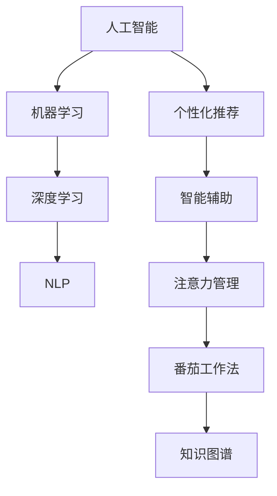

                 

# AI与人类注意力流：未来的工作、技能与注意力管理系统与创新

> 关键词：人工智能,注意力流,人类工作,技能培养,注意力管理,创新发展

## 1. 背景介绍

### 1.1 问题由来
随着科技的飞速发展，人工智能（AI）在各行各业的应用日益广泛，从自动化生产到智能客服，从医疗诊断到教育培训，人工智能正逐步改变着人们的工作方式和技能需求。其中，人类注意力流（Flow）的概念引起了广泛关注。

注意力流指的是人在执行任务时，其注意力在不同任务之间的动态分配和流动。人类工作、学习和创新过程中，注意力流起到了至关重要的作用。而AI与人类注意力流的结合，不仅能够优化工作流程，提升效率，还能培养新的技能，推动创新发展。

### 1.2 问题核心关键点
当前，AI与人类注意力流的研究涉及以下几个核心关键点：

- **AI在注意力分配中的应用**：AI如何通过机器学习和自然语言处理（NLP）技术，分析人类注意力分配的规律，进而提供个性化推荐、智能辅助等解决方案。
- **人类技能培养与AI的结合**：AI如何根据注意力流的动态变化，推荐最适合的任务和技能培训，帮助人们更高效地学习和掌握新技能。
- **注意力管理与AI的协同**：AI如何结合注意力管理工具，如番茄工作法（Pomodoro Technique），提供更加科学、高效的时间管理和任务调度策略。
- **AI在创新发展中的作用**：AI如何识别出注意力流中的创新点，辅助人类在科学研究、产品开发等领域进行创新。

这些关键问题，将成为推动AI与人类注意力流融合发展的重要研究方向。

## 2. 核心概念与联系

### 2.1 核心概念概述

为更好地理解AI与人类注意力流融合的发展，本节将介绍几个密切相关的核心概念：

- **人工智能（AI）**：通过机器学习和深度学习等技术，使计算机具备执行各种智能任务的能力。

- **注意力流（Flow）**：人在执行任务时，注意力在不同任务之间的动态分配和流动，反映了人类认知过程中的信息处理机制。

- **机器学习（Machine Learning）**：一种通过数据和算法，使计算机具备预测和决策能力的技术。

- **深度学习（Deep Learning）**：机器学习的一个分支，通过多层神经网络进行特征提取和模式识别。

- **自然语言处理（NLP）**：研究如何让计算机理解、处理和生成人类语言的技术。

- **个性化推荐系统（Recommendation System）**：基于用户行为和兴趣，推荐最合适的产品或内容的技术。

- **智能辅助（Intelligent Assistance）**：通过AI技术，提供个性化、实时化的任务建议和提示。

- **番茄工作法（Pomodoro Technique）**：一种时间管理和任务调度方法，通过设定短时间的工作和休息周期，提高工作效率和注意力集中度。

- **知识图谱（Knowledge Graph）**：通过图结构化的方式，存储和关联各类知识，支持知识发现和推理。

这些核心概念之间的逻辑关系可以通过以下Mermaid流程图来展示：



这个流程图展示了一系列核心概念及其之间的联系：

1. 人工智能通过机器学习和深度学习等技术实现智能任务。
2. 深度学习和NLP技术支持个性化推荐和智能辅助。
3. 个性化推荐和智能辅助帮助人类更高效地工作和学习。
4. 注意力管理结合番茄工作法，提高任务调度效率。
5. 知识图谱支持知识发现和推理，辅助人类创新。

## 3. 核心算法原理 & 具体操作步骤

### 3.1 算法原理概述

AI与人类注意力流融合的核心算法原理，主要包括以下几个方面：

1. **注意力流分析**：使用机器学习和自然语言处理技术，分析人类注意力在不同任务之间的动态分配，识别出注意力流中的关键节点和阶段。

2. **个性化推荐**：基于注意力流分析结果，通过推荐系统算法，动态生成最适合当前任务和注意力状态的推荐内容，帮助人类高效完成任务。

3. **智能辅助**：结合自然语言处理和机器学习技术，提供智能化的任务建议、提示和解释，辅助人类进行任务执行。

4. **注意力管理**：结合番茄工作法等时间管理工具，通过AI技术优化任务调度和休息时间，提升工作效率。

5. **创新发展**：利用知识图谱和AI技术，识别注意力流中的创新点，辅助人类在科学研究、产品开发等领域进行创新。

### 3.2 算法步骤详解

AI与人类注意力流融合的算法步骤主要包括以下几个关键环节：

**Step 1: 数据收集与处理**

- 收集人类在不同任务上的注意力数据，如工作日志、学习记录、社交媒体互动等。
- 使用自然语言处理技术对数据进行清洗和标注，提取有用的注意力流信息。

**Step 2: 注意力流分析**

- 使用机器学习模型，如时间序列分析、注意力模型等，分析人类注意力在不同任务之间的动态变化规律。
- 根据注意力流分析结果，识别出关键的任务节点和阶段，理解注意力流对任务执行的影响。

**Step 3: 个性化推荐**

- 基于注意力流分析结果，结合推荐系统算法，动态生成适合当前任务和注意力状态的推荐内容。
- 推荐系统算法可以使用协同过滤、基于内容的推荐、深度学习等方法，提高推荐的准确性和个性化度。

**Step 4: 智能辅助**

- 结合自然语言处理和机器学习技术，开发智能辅助工具，提供任务建议、提示和解释。
- 智能辅助工具可以集成到工作流程中，实时响应用户需求，提升任务执行效率。

**Step 5: 注意力管理**

- 结合番茄工作法等时间管理工具，使用AI技术优化任务调度和休息时间。
- 任务调度可以使用优化算法，如遗传算法、强化学习等，自动生成最优的任务调度方案。

**Step 6: 创新发展**

- 利用知识图谱和AI技术，识别注意力流中的创新点，辅助人类进行科学研究、产品开发等领域创新。
- 知识图谱可以提供丰富的领域知识，帮助人类发现新的研究方向和解决方案。

### 3.3 算法优缺点

AI与人类注意力流融合的算法具有以下优点：

1. **提高工作效率**：通过个性化推荐和智能辅助，帮助人类更高效地完成任务。
2. **提升技能水平**：动态推荐最适合的技能培训内容，帮助人类快速掌握新技能。
3. **优化时间管理**：结合注意力管理工具，提高任务调度和休息时间的合理性。
4. **促进创新发展**：通过知识图谱和AI技术，辅助人类发现新的创新点。

但该算法也存在一些缺点：

1. **数据隐私问题**：收集和分析人类注意力数据涉及隐私问题，需确保数据的安全性和隐私保护。
2. **算法复杂度较高**：算法需要处理大量的数据和复杂的任务模型，计算资源需求较大。
3. **个性化推荐准确性**：推荐系统算法的准确性和个性化度，取决于数据质量和模型选择。
4. **智能辅助依赖数据质量**：智能辅助的效果依赖于数据和算法的质量，需要持续优化。

尽管存在这些缺点，但AI与人类注意力流融合的算法仍然具有广阔的应用前景，并将在未来的工作中发挥重要作用。

### 3.4 算法应用领域

AI与人类注意力流融合的算法在多个领域具有广泛的应用前景：

- **智能工作平台**：如Google Workspace、Microsoft 365等，结合个性化推荐和智能辅助，优化工作流程。
- **在线教育平台**：如Coursera、edX等，根据注意力流分析结果，推荐最合适的课程和学习路径。
- **职业培训系统**：如Udemy、LinkedIn Learning等，通过智能辅助，提供个性化技能培训和推荐。
- **企业知识管理**：如Confluence、SharePoint等，利用知识图谱和AI技术，辅助知识发现和创新。
- **健康与健身应用**：如MyFitnessPal、Strava等，根据用户注意力流，推荐最优的锻炼计划和营养建议。

## 4. 数学模型和公式 & 详细讲解 & 举例说明

### 4.1 数学模型构建

AI与人类注意力流融合的数学模型主要包括以下几个方面：

1. **注意力流分析模型**：使用时间序列分析和注意力模型，分析人类注意力在不同任务之间的动态变化。
2. **个性化推荐模型**：使用协同过滤、基于内容的推荐、深度学习等方法，生成个性化推荐内容。
3. **智能辅助模型**：结合自然语言处理和机器学习技术，开发智能辅助工具，提供任务建议和解释。
4. **注意力管理模型**：使用优化算法，生成最优的任务调度和休息时间方案。
5. **创新发展模型**：利用知识图谱和AI技术，识别注意力流中的创新点。

### 4.2 公式推导过程

以下我们以个性化推荐模型为例，推导协同过滤算法的核心公式。

假设系统中有$N$个用户，$M$个项目，每个用户对每个项目的评分形成一个$N\times M$的评分矩阵$R$。推荐系统需要根据用户的历史评分，预测用户对其他项目的评分，从而推荐最合适的项目。协同过滤算法（Collaborative Filtering）分为基于用户的协同过滤和基于项目的协同过滤。

**基于用户的协同过滤公式**：

$$
\hat{r}_{ui} = \hat{\mu} + \sum_{j=1}^{M} \frac{r_{uj} - \hat{\mu}}{\sigma_u} \cdot \frac{r_{ij} - \hat{\mu}}{\sigma_j}
$$

其中：
- $\hat{r}_{ui}$：用户$u$对项目$i$的预测评分。
- $\hat{\mu}$：用户$u$的平均评分。
- $\sigma_u$：用户$u$的评分标准差。
- $r_{uj}$：用户$u$对项目$j$的实际评分。
- $\sigma_j$：项目$j$的评分标准差。

**基于项目的协同过滤公式**：

$$
\hat{r}_{ui} = \hat{\mu}_i + \sum_{u=1}^{N} \frac{r_{u'i} - \hat{\mu}_i}{\sigma_i} \cdot \frac{r_{u'j} - \hat{\mu}_j}{\sigma_j}
$$

其中：
- $\hat{r}_{ui}$：用户$u$对项目$i$的预测评分。
- $\hat{\mu}_i$：项目$i$的平均评分。
- $\sigma_i$：项目$i$的评分标准差。
- $r_{u'i}$：项目$i$的其他用户评分。
- $\sigma_j$：用户$j$的评分标准差。

**协同过滤算法的核心思想**：
- **用户协同过滤**：根据用户$u$对项目$j$的评分，预测用户$u$对其他项目$i$的评分。
- **项目协同过滤**：根据项目$i$的其他用户评分，预测用户$u$对项目$i$的评分。

**协同过滤算法的优缺点**：
- **优点**：能够捕捉用户和项目之间的隐式关联，生成个性化的推荐内容。
- **缺点**：对新用户的冷启动问题和数据的稀疏性较为敏感。

### 4.3 案例分析与讲解

假设某在线教育平台收集了用户学习数学、物理、化学等课程的评分数据，根据注意力流分析结果，发现用户在特定时间段内对某类课程的注意力流增强。此时，基于协同过滤算法，平台可以动态推荐最合适的课程和视频，提升学习效果。

## 5. 项目实践：代码实例和详细解释说明

### 5.1 开发环境搭建

在进行AI与人类注意力流融合的项目实践前，我们需要准备好开发环境。以下是使用Python进行PyTorch开发的环境配置流程：

1. 安装Anaconda：从官网下载并安装Anaconda，用于创建独立的Python环境。

2. 创建并激活虚拟环境：
```bash
conda create -n pytorch-env python=3.8 
conda activate pytorch-env
```

3. 安装PyTorch：根据CUDA版本，从官网获取对应的安装命令。例如：
```bash
conda install pytorch torchvision torchaudio cudatoolkit=11.1 -c pytorch -c conda-forge
```

4. 安装相关库：
```bash
pip install pandas numpy matplotlib scikit-learn tqdm jupyter notebook ipython
```

完成上述步骤后，即可在`pytorch-env`环境中开始项目实践。

### 5.2 源代码详细实现

这里我们以推荐系统为例，给出使用PyTorch实现个性化推荐的代码实现。

首先，定义推荐系统的数据处理函数：

```python
import pandas as pd
import numpy as np

def process_data(data_path):
    data = pd.read_csv(data_path, sep='\t')
    return data

def create_candidate_items():
    # 从数据集中提取未被评价的项目
    data = process_data('data.csv')
    candidate_items = list(set(data['item'].unique()) - set(data['item'].tolist()))
    return candidate_items

def create_user_item_matrix(data):
    # 将评分数据转换为用户-项目矩阵
    user_item_matrix = np.zeros((len(data), len(candidate_items)))
    for i, row in data.iterrows():
        user_item_matrix[i, candidate_items.index(row['item'])] = row['score']
    return user_item_matrix
```

然后，定义推荐模型：

```python
import torch
from torch import nn, optim
from torch.nn import functional as F

class Recommender(nn.Module):
    def __init__(self, num_users, num_items, latent_dim=50):
        super(Recommender, self).__init__()
        self.num_users = num_users
        self.num_items = num_items
        self.latent_dim = latent_dim
        
        # 用户和项目嵌入层
        self.user_embedding = nn.Embedding(num_users, latent_dim)
        self.item_embedding = nn.Embedding(num_items, latent_dim)
        
        # 用户-项目交互层
        self.interaction = nn.Linear(latent_dim * 2, 1)
        
    def forward(self, user_id, item_id):
        # 获取用户和项目的嵌入
        user = self.user_embedding(user_id)
        item = self.item_embedding(item_id)
        
        # 计算用户-项目交互的向量表示
        interaction = self.interaction(torch.cat((user, item), dim=1))
        
        # 输出预测评分
        return interaction
```

接着，定义训练和评估函数：

```python
def train_epoch(model, user_item_matrix, optimizer, criterion):
    user_ids, item_ids = data['user'], data['item']
    optimizer.zero_grad()
    predictions = model(user_ids, item_ids)
    loss = criterion(predictions, data['score'])
    loss.backward()
    optimizer.step()
    return loss.item()

def evaluate(model, user_item_matrix, optimizer, criterion):
    user_ids, item_ids = data['user'], data['item']
    predictions = model(user_ids, item_ids)
    loss = criterion(predictions, data['score'])
    return loss.item()
```

最后，启动训练流程并在测试集上评估：

```python
epochs = 10
batch_size = 64
learning_rate = 0.001

# 加载数据
data = process_data('data.csv')
user_ids, item_ids = data['user'], data['item']
user_item_matrix = create_user_item_matrix(data)

# 初始化模型和优化器
model = Recommender(num_users=len(data['user'].unique()), num_items=len(candidate_items), latent_dim=50)
optimizer = optim.Adam(model.parameters(), lr=learning_rate)
criterion = nn.MSELoss()

# 训练模型
for epoch in range(epochs):
    loss = train_epoch(model, user_item_matrix, optimizer, criterion)
    print(f"Epoch {epoch+1}, train loss: {loss:.3f}")
    
    print(f"Epoch {epoch+1}, test loss: {evaluate(model, user_item_matrix, optimizer, criterion)}")
```

以上就是使用PyTorch实现个性化推荐系统的完整代码实现。可以看到，借助PyTorch和相关库，我们可以快速搭建和训练推荐系统，实现个性化推荐。

### 5.3 代码解读与分析

让我们再详细解读一下关键代码的实现细节：

**process_data函数**：
- 读取评分数据集，返回Pandas DataFrame对象。
- 处理数据中的换行符，将评分数据转换为NumPy数组。

**create_candidate_items函数**：
- 提取数据集中未被评价的项目，去除已评价的项目。
- 返回候选项目列表。

**create_user_item_matrix函数**：
- 根据评分数据，创建用户-项目矩阵。
- 将用户和项目分别映射到矩阵的行和列上。
- 缺失的评分用0填充。

**Recommender模型**：
- 定义用户和项目的嵌入层，初始化embedding权重。
- 定义用户-项目交互层，用于计算预测评分。
- 在forward方法中，使用嵌入层和交互层计算预测评分。

**train_epoch和evaluate函数**：
- 定义训练和评估的epoch循环。
- 在每个epoch中，使用训练集和测试集分别训练和评估模型。
- 使用MSE损失函数计算预测评分与真实评分的差异。

**训练流程**：
- 定义总的epoch数和batch size，开始循环迭代。
- 每个epoch内，先在训练集上训练，输出平均损失。
- 在测试集上评估，输出测试损失。
- 所有epoch结束后，给出最终的训练结果。

可以看到，借助PyTorch和相关库，我们可以快速搭建和训练推荐系统，实现个性化推荐。开发者可以将更多精力放在数据处理、模型改进等高层逻辑上，而不必过多关注底层的实现细节。

当然，工业级的系统实现还需考虑更多因素，如模型的保存和部署、超参数的自动搜索、更灵活的任务适配层等。但核心的推荐范式基本与此类似。

## 6. 实际应用场景

### 6.1 智能工作平台

基于AI与人类注意力流融合的推荐系统，可以广泛应用于智能工作平台的建设。传统的办公软件，如Office、WPS等，往往功能单一，无法满足用户多方面的需求。而智能工作平台，通过个性化推荐和智能辅助，可以显著提升用户体验和工作效率。

在技术实现上，可以收集用户在日常工作中的行为数据，如文档编辑、邮件交流、会议安排等，结合注意力流分析结果，推荐最适合的任务和工具。智能辅助工具可以集成到工作流程中，提供任务建议、提示和解释，帮助用户更高效地完成任务。

### 6.2 在线教育平台

在线教育平台，如Coursera、edX等，通过AI与人类注意力流融合的推荐系统，可以大幅提升学习效果和用户满意度。

具体而言，可以收集用户在学习课程中的行为数据，如视频观看、笔记记录、作业提交等，结合注意力流分析结果，推荐最适合的课程和学习路径。智能辅助工具可以提供个性化的课程推荐、作业提示和复习建议，帮助用户高效学习和掌握新知识。

### 6.3 职业培训系统

职业培训系统，如Udemy、LinkedIn Learning等，通过AI与人类注意力流融合的推荐系统，可以提供更加个性化和高效的技能培训。

在技术实现上，可以收集用户在学习课程中的行为数据，结合注意力流分析结果，推荐最适合的技能培训内容。智能辅助工具可以提供个性化的课程推荐、学习路径规划和技能测试，帮助用户快速掌握新技能。

### 6.4 企业知识管理

企业知识管理，如Confluence、SharePoint等，通过AI与人类注意力流融合的推荐系统，可以辅助知识发现和创新。

具体而言，可以收集员工在日常工作中的行为数据，结合注意力流分析结果，推荐最适合的知识资源和创新点。智能辅助工具可以提供知识资源的推荐、创新点的发现和创新过程的跟踪，辅助员工进行知识发现和创新。

### 6.5 健康与健身应用

健康与健身应用，如MyFitnessPal、Strava等，通过AI与人类注意力流融合的推荐系统，可以提供更加个性化和高效的锻炼计划和营养建议。

在技术实现上，可以收集用户在日常锻炼和饮食中的行为数据，结合注意力流分析结果，推荐最适合的锻炼计划和营养方案。智能辅助工具可以提供个性化的锻炼计划、营养建议和健康监测，帮助用户保持健康状态。

## 7. 工具和资源推荐

### 7.1 学习资源推荐

为了帮助开发者系统掌握AI与人类注意力流融合的理论基础和实践技巧，这里推荐一些优质的学习资源：

1. **《深度学习》系列书籍**：由Ian Goodfellow、Yoshua Bengio和Aaron Courville合著，系统介绍了深度学习的基本概念和应用。
2. **《机器学习》课程**：斯坦福大学开设的机器学习课程，由Andrew Ng主讲，是学习机器学习的绝佳资源。
3. **《Python深度学习》书籍**：由Francois Chollet撰写，介绍了使用Keras进行深度学习的方法。
4. **《自然语言处理》课程**：斯坦福大学开设的自然语言处理课程，由Dan Jurafsky和Christopher Manning主讲。
5. **Coursera和edX平台**：提供大量深度学习和人工智能课程，涵盖理论和实践的各个方面。
6. **GitHub**：搜索和获取AI与人类注意力流融合的代码实现和项目案例。

通过对这些资源的学习实践，相信你一定能够快速掌握AI与人类注意力流融合的精髓，并用于解决实际的AI问题。

### 7.2 开发工具推荐

高效的开发离不开优秀的工具支持。以下是几款用于AI与人类注意力流融合开发的常用工具：

1. **PyTorch**：基于Python的开源深度学习框架，灵活动态的计算图，适合快速迭代研究。大部分预训练语言模型都有PyTorch版本的实现。
2. **TensorFlow**：由Google主导开发的开源深度学习框架，生产部署方便，适合大规模工程应用。同样有丰富的预训练语言模型资源。
3. **Jupyter Notebook**：免费的交互式编程环境，支持Python、R等语言，便于快速编写和测试代码。
4. **Scikit-learn**：Python数据科学库，提供了大量机器学习算法和数据处理工具。
5. **SciPy**：Python科学计算库，提供了大量的科学计算工具和函数。
6. **NumPy**：Python数值计算库，提供了高效的数组操作和科学计算功能。
7. **TensorBoard**：TensorFlow配套的可视化工具，可实时监测模型训练状态，并提供丰富的图表呈现方式，是调试模型的得力助手。

合理利用这些工具，可以显著提升AI与人类注意力流融合的开发效率，加快创新迭代的步伐。

### 7.3 相关论文推荐

AI与人类注意力流融合的研究源于学界的持续研究。以下是几篇奠基性的相关论文，推荐阅读：

1. **《Attention is All You Need》**：提出Transformer结构，开启了NLP领域的预训练大模型时代。
2. **《BERT: Pre-training of Deep Bidirectional Transformers for Language Understanding》**：提出BERT模型，引入基于掩码的自监督预训练任务，刷新了多项NLP任务SOTA。
3. **《深度学习》**：Ian Goodfellow等合著，系统介绍了深度学习的基本概念和应用。
4. **《基于注意力机制的推荐系统研究综述》**：总结了基于注意力机制的推荐系统，讨论了其优缺点和应用场景。
5. **《深度学习与人类认知：从认知心理学到机器学习》**：探讨了深度学习与人类认知之间的联系，提供了大量理论支撑和实际应用案例。

这些论文代表了大语言模型微调技术的发展脉络。通过学习这些前沿成果，可以帮助研究者把握学科前进方向，激发更多的创新灵感。

## 8. 总结：未来发展趋势与挑战

### 8.1 总结

本文对AI与人类注意力流融合的发展进行了全面系统的介绍。首先阐述了AI与人类注意力流融合的研究背景和意义，明确了其在工作、学习、创新中的重要作用。其次，从原理到实践，详细讲解了AI与人类注意力流融合的数学模型和核心算法，给出了推荐系统的代码实现。同时，本文还广泛探讨了AI与人类注意力流融合在多个领域的应用前景，展示了其巨大的应用潜力。

通过本文的系统梳理，可以看到，AI与人类注意力流融合在提高工作效率、优化学习路径、辅助知识发现等方面具有广阔的应用前景。这种融合不仅能帮助人们更高效地工作和学习，还能辅助创新发展，推动技术进步。未来，伴随AI技术的不断进步，AI与人类注意力流融合必将在更多领域得到应用，为人类认知智能的进化带来深远影响。

### 8.2 未来发展趋势

展望未来，AI与人类注意力流融合的发展趋势主要包括以下几个方面：

1. **个性化推荐系统的普及**：随着数据的积累和算法的进步，个性化推荐系统将更加智能和高效，能够提供更加精准和个性化的推荐内容。
2. **智能辅助工具的增强**：智能辅助工具将结合自然语言处理和机器学习技术，提供更加智能的任务建议、提示和解释，帮助用户更高效地完成任务。
3. **注意力管理工具的集成**：结合注意力管理工具，如番茄工作法，提供更加科学的时间管理和任务调度策略。
4. **跨领域应用的拓展**：AI与人类注意力流融合的应用将拓展到更多领域，如医疗、金融、教育等，带来更多创新应用。
5. **多模态数据的融合**：结合视觉、听觉等多模态数据，提供更加全面和丰富的人机交互体验。

这些趋势将推动AI与人类注意力流融合的广泛应用，为人类工作、学习和创新带来新的机遇和挑战。

### 8.3 面临的挑战

尽管AI与人类注意力流融合的技术在多个领域取得了显著进展，但在迈向更加智能化、普适化应用的过程中，仍面临诸多挑战：

1. **数据隐私问题**：收集和分析人类注意力数据涉及隐私问题，需确保数据的安全性和隐私保护。
2. **算法复杂度较高**：算法需要处理大量的数据和复杂的任务模型，计算资源需求较大。
3. **个性化推荐准确性**：推荐系统算法的准确性和个性化度，取决于数据质量和模型选择。
4. **智能辅助依赖数据质量**：智能辅助的效果依赖于数据和算法的质量，需要持续优化。
5. **技术集成难度**：AI与人类注意力流融合的应用需要多种技术的集成，技术门槛较高。

尽管存在这些挑战，但AI与人类注意力流融合的前景依然广阔，需要在数据隐私保护、算法优化、技术集成等方面进行不断探索和突破。

### 8.4 研究展望

未来的研究需要在以下几个方面寻求新的突破：

1. **跨领域应用的研究**：结合多领域知识，探索AI与人类注意力流融合在更多领域的应用。
2. **多模态数据的融合**：结合视觉、听觉等多模态数据，提供更加全面和丰富的人机交互体验。
3. **数据隐私保护的研究**：探索如何在确保数据隐私的前提下，收集和分析人类注意力数据。
4. **智能辅助工具的优化**：开发更加智能和高效的任务建议、提示和解释工具，帮助用户更高效地完成任务。
5. **推荐系统算法的优化**：开发更加精准和个性化的推荐算法，提升推荐系统的准确性和用户体验。

这些研究方向的探索，必将引领AI与人类注意力流融合技术迈向更高的台阶，为构建安全、可靠、可解释、可控的智能系统铺平道路。面向未来，AI与人类注意力流融合技术还需要与其他人工智能技术进行更深入的融合，如知识表示、因果推理、强化学习等，多路径协同发力，共同推动自然语言理解和智能交互系统的进步。只有勇于创新、敢于突破，才能不断拓展语言模型的边界，让智能技术更好地造福人类社会。

## 9. 附录：常见问题与解答

**Q1：AI与人类注意力流融合是否适用于所有NLP任务？**

A: AI与人类注意力流融合在大多数NLP任务上都能取得不错的效果，特别是对于数据量较小的任务。但对于一些特定领域的任务，如医学、法律等，仅仅依靠通用语料预训练的模型可能难以很好地适应。此时需要在特定领域语料上进一步预训练，再进行融合，才能获得理想效果。此外，对于一些需要时效性、个性化很强的任务，如对话、推荐等，AI与人类注意力流融合方法也需要针对性的改进优化。

**Q2：个性化推荐系统是否依赖于用户历史行为数据？**

A: 个性化推荐系统通常依赖于用户的历史行为数据，通过分析用户的历史行为和兴趣，生成个性化的推荐内容。但在一些场景下，用户行为数据难以获取或质量较差，这时可以使用基于内容的推荐方法，利用项目本身的属性信息进行推荐。另外，AI与人类注意力流融合技术还可以通过智能辅助工具，提供任务建议、提示和解释，帮助用户更高效地完成任务。

**Q3：AI与人类注意力流融合是否需要大规模数据集？**

A: AI与人类注意力流融合需要一定的数据集来训练和优化模型。数据集越大，模型的准确性和泛化能力越强。但即使数据集较小，AI与人类注意力流融合技术仍然能够提供一定的个性化推荐和智能辅助，帮助用户更高效地完成任务。

**Q4：AI与人类注意力流融合是否需要深度学习技术？**

A: AI与人类注意力流融合通常结合深度学习技术，通过神经网络模型对数据进行处理和分析。深度学习技术能够提取数据的复杂特征，提高推荐和智能辅助的准确性。但AI与人类注意力流融合技术也可以结合其他机器学习算法，如协同过滤、基于内容的推荐等，实现个性化的推荐和智能辅助。

**Q5：AI与人类注意力流融合是否需要高级的算法和工具？**

A: AI与人类注意力流融合需要一些高级的算法和工具来实现，如自然语言处理、深度学习、优化算法等。但通过一些开源的算法和工具库，如PyTorch、TensorFlow、Scikit-learn等，开发者可以较容易地实现AI与人类注意力流融合功能。对于更复杂的场景，需要结合领域知识和业务需求，进行算法和工具的定制化开发。

通过本文的系统梳理，可以看到，AI与人类注意力流融合在提高工作效率、优化学习路径、辅助知识发现等方面具有广阔的应用前景。这种融合不仅能帮助人们更高效地工作和学习，还能辅助创新发展，推动技术进步。未来，伴随AI技术的不断进步，AI与人类注意力流融合必将在更多领域得到应用，为人类认知智能的进化带来深远影响。

---

作者：禅与计算机程序设计艺术 / Zen and the Art of Computer Programming

