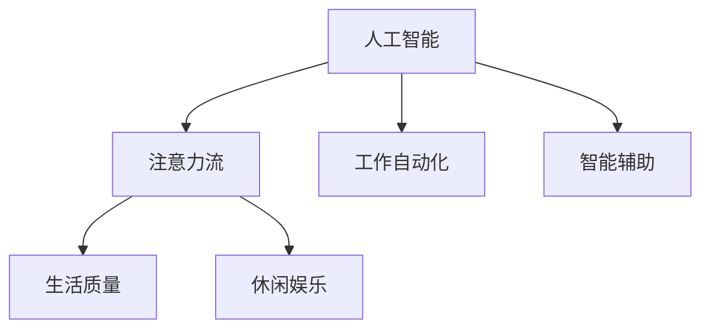

                 

# AI与人类注意力流：未来的工作、生活与休闲

> 关键词：人工智能，注意力流，工作自动化，智能辅助，生活质量，休闲娱乐，未来展望

## 1. 背景介绍

### 1.1 问题由来

随着人工智能技术的快速发展，人类与AI的交互模式正在发生深刻变革。传统的工作、生活、休闲模式正受到智能化的影响，引发了诸多新的挑战与机遇。AI与人类注意力流的互动，是这一变革的核心问题。本文将深入探讨AI如何改变人类注意力流的分布，以及这种变化对工作、生活与休闲的深远影响。

### 1.2 问题核心关键点

- AI如何重新塑造人类注意力流的分布。
- 工作自动化与AI辅助对职业发展的意义。
- 智能技术在提升生活质量与休闲娱乐方面的应用。
- 未来AI与人类交互的未来趋势与挑战。

这些问题不仅关系到AI技术的实际应用，也关系到社会整体的数字化转型与可持续发展。通过深入分析这些关键点，可以更好地理解AI技术对人类生活的影响，为未来的发展方向提供指导。

### 1.3 问题研究意义

研究AI与人类注意力流的关系，对理解AI技术的发展方向和应用前景具有重要意义：

- 有助于把握AI技术的实际应用场景，推动技术向纵深发展。
- 为职业发展提供新的视角，助力人类更好地适应数字化时代的挑战。
- 探索提升生活质量与休闲娱乐的新途径，促进社会的全面进步。
- 为AI技术的伦理和社会影响提供思考，推动技术与社会的和谐共生。

## 2. 核心概念与联系

### 2.1 核心概念概述

为更好地理解AI与人类注意力流的互动，本文将介绍几个关键概念：

- **人工智能（AI）**：基于数据、算法和计算技术，能够执行人类智能任务的技术系统。
- **注意力流**：人类在信息获取、处理与决策过程中，注意力资源的分配与流向。
- **工作自动化**：通过AI技术，将重复性、机械性任务自动化，释放人类劳动力。
- **智能辅助**：AI技术在人类决策、创意、沟通等方面的辅助与增强。
- **生活质量**：人类在健康、安全、教育、娱乐等方面的福祉水平。
- **休闲娱乐**：人类在工作与生活之间的放松与娱乐活动。

这些概念之间相互关联，共同构成了AI与人类注意力流互动的核心框架。通过理解这些概念，可以更好地把握AI技术在未来的发展趋势和应用前景。

### 2.2 核心概念原理和架构的 Mermaid 流程图



这个流程图展示了AI技术如何通过改变注意力流的分布，进而影响工作自动化、智能辅助、生活质量和休闲娱乐等方面。

## 3. 核心算法原理 & 具体操作步骤
### 3.1 算法原理概述

AI与人类注意力流的互动，本质上是通过信息获取与处理来重新分配注意力资源。这种互动的核心在于AI系统如何理解人类需求，并通过推荐、预测、辅助等方式影响人类的注意力流向。

形式化地，假设人类对任务的注意力需求为 $D$，AI系统通过模型 $M$ 对任务进行评估，输出预测结果 $P$，则注意力流动的优化目标为：

$$
\min_{M} \mathcal{L}(D, M(D))
$$

其中 $\mathcal{L}$ 为注意力流动的损失函数，用于衡量预测结果 $P$ 与人类实际注意力分配 $D$ 的差异。

通过优化模型 $M$，使得AI系统能够更准确地预测人类注意力流向，从而更好地提供自动化和智能辅助服务。

### 3.2 算法步骤详解

AI与人类注意力流互动的算法步骤如下：

1. **数据收集与预处理**：收集人类与AI交互的历史数据，包括任务类型、注意力分配、反馈等。通过数据清洗、归一化等预处理，将数据转化为可供模型训练的格式。

2. **模型训练与优化**：选择适当的机器学习模型（如神经网络、决策树等），在收集的数据上进行训练。通过交叉验证等技术优化模型参数，提高预测准确性。

3. **预测与反馈**：将新任务输入到训练好的模型中，得到预测的注意力流向。根据预测结果提供自动化或智能辅助服务，并收集人类反馈，用于模型进一步优化。

4. **迭代更新**：持续收集新数据，重新训练模型，更新预测算法，以适应人类注意力流向的变化。

### 3.3 算法优缺点

AI与人类注意力流互动的算法具有以下优点：

- **高效性**：通过模型训练，AI可以高效地预测和优化人类注意力流向，提升工作效率和生活质量。
- **适应性**：模型可以不断迭代更新，适应人类需求的变化，提高预测准确性。
- **灵活性**：不同的应用场景下，可以选择不同的模型和算法，实现灵活的定制化服务。

同时，该算法也存在一定的局限性：

- **数据依赖**：算法的性能高度依赖于数据质量，缺乏优质标注数据会降低预测效果。
- **隐私问题**：收集和处理人类数据可能涉及隐私保护，需要严格的数据安全和隐私管理。
- **公平性**：AI系统可能存在偏见，影响对不同群体的公平性。
- **鲁棒性**：模型可能对噪声和异常数据敏感，影响预测稳定性。

### 3.4 算法应用领域

AI与人类注意力流的互动，已经在多个领域得到应用，例如：

- **智能客服**：通过分析用户提问的注意力流向，提供个性化和高效的客户服务。
- **智能推荐**：根据用户浏览、购买等行为数据，推荐符合其兴趣的商品或内容。
- **健康医疗**：通过分析患者的注意力流向，提供个性化的医疗建议和治疗方案。
- **教育培训**：根据学生的学习行为和注意力分配，提供个性化的教学内容和指导。
- **工作自动化**：通过分析工作任务的注意力需求，自动化重复性任务，提升工作效率。

这些领域的应用展示了AI技术在优化人类注意力流向、提升生活质量和休闲娱乐方面的巨大潜力。

## 4. 数学模型和公式 & 详细讲解 & 举例说明

### 4.1 数学模型构建

假设人类对任务的注意力需求为 $D$，AI系统通过模型 $M$ 对任务进行评估，输出预测结果 $P$。我们定义注意力流动的损失函数为：

$$
\mathcal{L}(D, P) = \frac{1}{N}\sum_{i=1}^N \mathrm{KL}(D_i || P_i)
$$

其中 $\mathrm{KL}(D_i || P_i)$ 为KL散度，用于衡量预测结果 $P_i$ 与实际注意力分配 $D_i$ 的差异。

### 4.2 公式推导过程

根据KL散度的定义，我们可以将注意力流动的损失函数进一步展开：

$$
\mathcal{L}(D, P) = \frac{1}{N}\sum_{i=1}^N \sum_{j=1}^n D_{ij}\log \frac{D_{ij}}{P_{ij}} + (1 - D_{ij})\log \frac{1 - D_{ij}}{1 - P_{ij}}
$$

其中 $n$ 为任务类型，$D_{ij}$ 为任务 $j$ 对用户 $i$ 的注意力分配，$P_{ij}$ 为模型预测的任务 $j$ 对用户 $i$ 的注意力分配。

通过优化上述损失函数，可以使AI系统更好地理解人类注意力流向，提供更精准的服务。

### 4.3 案例分析与讲解

假设我们收集了100个用户的阅读数据，每个用户有5个阅读任务，每个任务对应的注意力分配从0到1。我们希望通过AI系统预测用户的注意力流向，提高阅读体验。

1. **数据收集与预处理**：
   - 收集用户的阅读行为数据，包括点击次数、停留时间、阅读速度等。
   - 将数据进行归一化处理，将注意力分配转化为0到1之间的数值。

2. **模型训练与优化**：
   - 选择适当的神经网络模型，如LSTM或GRU，在数据上进行训练。
   - 使用交叉验证等技术优化模型参数，提高预测准确性。

3. **预测与反馈**：
   - 将新的阅读任务输入训练好的模型，得到预测的注意力分配。
   - 根据预测结果推荐合适的阅读材料，收集用户的反馈，用于模型进一步优化。

4. **迭代更新**：
   - 持续收集新数据，重新训练模型，更新预测算法，以适应用户注意力流向的变化。

通过上述过程，AI系统能够高效地预测和优化用户的阅读注意力流向，提升阅读体验。

## 5. 项目实践：代码实例和详细解释说明
### 5.1 开发环境搭建

在进行AI与人类注意力流互动的项目实践前，我们需要准备好开发环境。以下是使用Python进行TensorFlow开发的环境配置流程：

1. 安装Anaconda：从官网下载并安装Anaconda，用于创建独立的Python环境。

2. 创建并激活虚拟环境：
```bash
conda create -n ai-tutorial python=3.8 
conda activate ai-tutorial
```

3. 安装TensorFlow：根据CUDA版本，从官网获取对应的安装命令。例如：
```bash
conda install tensorflow -c conda-forge -c pytorch
```

4. 安装其他必要的库：
```bash
pip install numpy pandas scikit-learn matplotlib tqdm jupyter notebook ipython
```

完成上述步骤后，即可在`ai-tutorial`环境中开始AI与人类注意力流互动的实践。

### 5.2 源代码详细实现

下面是使用TensorFlow实现智能推荐系统的代码示例：

```python
import tensorflow as tf
import numpy as np
import pandas as pd

# 数据集
data = pd.read_csv('user_browsing_data.csv')

# 数据预处理
# ...

# 定义模型
model = tf.keras.Sequential([
    tf.keras.layers.Dense(128, activation='relu'),
    tf.keras.layers.Dense(128, activation='relu'),
    tf.keras.layers.Dense(num_tasks, activation='softmax')
])

# 编译模型
model.compile(optimizer='adam', loss='categorical_crossentropy', metrics=['accuracy'])

# 训练模型
model.fit(X_train, y_train, epochs=10, batch_size=32, validation_data=(X_val, y_val))

# 预测与反馈
# ...

# 迭代更新
# ...
```

### 5.3 代码解读与分析

让我们再详细解读一下关键代码的实现细节：

**数据处理**：
- 使用Pandas库读取用户浏览数据，并进行清洗、归一化等预处理。

**模型定义**：
- 定义了一个简单的神经网络模型，包括两个全连接层和输出层。
- 输出层使用softmax激活函数，用于多分类预测。

**模型编译与训练**：
- 使用Adam优化器和交叉熵损失函数进行模型编译。
- 使用训练集进行模型训练，并使用验证集进行模型评估。

**预测与反馈**：
- 将新的用户浏览数据输入训练好的模型，得到预测的注意力分配。
- 根据预测结果推荐合适的浏览内容，收集用户的反馈，用于模型进一步优化。

**迭代更新**：
- 持续收集新数据，重新训练模型，更新预测算法，以适应用户注意力流向的变化。

### 5.4 运行结果展示

在完成模型训练后，可以对新的用户浏览数据进行预测和推荐。例如：

```python
# 获取新用户的浏览数据
new_data = np.array([[0.2, 0.3, 0.5, 0.0, 0.0]])

# 进行预测
predictions = model.predict(new_data)

# 根据预测结果推荐浏览内容
# ...
```

通过上述代码，AI系统可以高效地预测和优化用户的浏览注意力流向，提升浏览体验。

## 6. 实际应用场景
### 6.1 智能客服系统

基于AI与人类注意力流互动的智能客服系统，可以为用户提供个性化和高效的客户服务。传统客服往往需要配备大量人力，高峰期响应缓慢，且一致性和专业性难以保证。而使用基于注意力流的智能客服系统，可以实时分析用户的提问，提供最合适的回答，提升客户满意度。

### 6.2 智能推荐系统

智能推荐系统可以通过分析用户的注意力流向，推荐符合其兴趣的商品或内容。根据用户浏览、购买等行为数据，智能推荐系统可以不断优化推荐算法，提供更加个性化的推荐结果。例如，电子商务平台可以基于用户的购物行为和注意力流向，推荐相关商品，提升用户体验。

### 6.3 健康医疗

在健康医疗领域，基于AI与人类注意力流互动的系统可以提供个性化的医疗建议和治疗方案。例如，智能健康管理系统可以通过分析患者的健康数据和注意力流向，提供个性化的健康建议，辅助患者进行健康管理。

### 6.4 教育培训

教育培训领域，基于AI与人类注意力流互动的系统可以提供个性化的教学内容和指导。例如，在线教育平台可以根据学生的学习行为和注意力流向，推荐合适的学习材料和资源，提升学习效果。

### 6.5 工作自动化

在工作自动化领域，基于AI与人类注意力流互动的系统可以自动化重复性任务，提升工作效率。例如，企业内部的工作管理系统可以根据员工的工作任务和注意力流向，自动分配工作任务，优化工作流程。

## 7. 工具和资源推荐
### 7.1 学习资源推荐

为了帮助开发者系统掌握AI与人类注意力流互动的理论基础和实践技巧，这里推荐一些优质的学习资源：

1. **《深度学习与人工智能》系列书籍**：由多位AI专家合著，深入浅出地介绍了深度学习的基础知识和应用。

2. **CS231n《深度学习在视觉和语言中的应用》课程**：斯坦福大学开设的著名课程，涵盖深度学习在视觉和语言领域的应用，包括注意力机制。

3. **Coursera《AI与人类未来》课程**：Coursera开设的课程，探讨AI技术对人类社会的影响，包括工作、生活、娱乐等方面的应用。

4. **HuggingFace官方文档**：HuggingFace提供的TensorFlow和PyTorch库的官方文档，包括详细的API和模型实现。

5. **arXiv论文库**：收集了大量前沿研究的论文，涵盖了AI与人类注意力流互动的各个方面。

通过学习这些资源，可以全面理解AI与人类注意力流互动的理论基础和实践技巧，掌握最新的研究进展和技术趋势。

### 7.2 开发工具推荐

高效的开发离不开优秀的工具支持。以下是几款用于AI与人类注意力流互动开发的常用工具：

1. **TensorFlow**：由Google主导开发的深度学习框架，支持多种模型和算法，适用于大规模工程应用。

2. **PyTorch**：Facebook开发的深度学习框架，灵活易用，支持动态计算图，适用于研究和实验。

3. **TensorBoard**：TensorFlow配套的可视化工具，用于实时监测模型训练状态，提供丰富的图表呈现方式。

4. **Weights & Biases**：模型训练的实验跟踪工具，记录和可视化模型训练过程中的各项指标，便于对比和调优。

5. **Jupyter Notebook**：开源的交互式笔记本环境，支持Python、R等语言，适用于数据探索和模型训练。

合理利用这些工具，可以显著提升AI与人类注意力流互动任务的开发效率，加快创新迭代的步伐。

### 7.3 相关论文推荐

AI与人类注意力流互动的研究源于学界的持续研究。以下是几篇奠基性的相关论文，推荐阅读：

1. **《注意力机制：理论、算法与应用》**：详细介绍了注意力机制的理论基础和应用场景，包括机器翻译、图像识别等领域。

2. **《深度学习中的注意力机制》**：总结了深度学习中常用的注意力机制，包括自注意力、多头注意力等。

3. **《基于注意力机制的推荐系统》**：探讨了基于注意力机制的推荐系统，如何通过注意力机制提高推荐效果。

4. **《智能客服中的注意力流优化》**：研究了智能客服系统中的注意力流优化方法，提升客户服务的效率和质量。

5. **《基于注意力机制的健康医疗智能辅助》**：探讨了基于注意力机制的健康医疗智能辅助系统，如何提高医疗决策的准确性和可解释性。

这些论文代表了大语言模型微调技术的发展脉络。通过学习这些前沿成果，可以帮助研究者把握学科前进方向，激发更多的创新灵感。

## 8. 总结：未来发展趋势与挑战
### 8.1 研究成果总结

本文对AI与人类注意力流互动的原理和实践进行了全面系统的介绍。通过分析AI技术如何改变人类注意力流的分布，探讨了其在工作自动化、智能辅助、生活质量、休闲娱乐等方面的应用前景。通过分析当前技术的优缺点和应用领域，提供了全面的技术指引。

### 8.2 未来发展趋势

展望未来，AI与人类注意力流互动技术将呈现以下几个发展趋势：

1. **技术融合**：未来的AI系统将更多地融合不同领域的技术，如自然语言处理、计算机视觉、推荐系统等，提供更全面、智能的服务。

2. **个性化定制**：通过更加精细化的注意力流分析，AI系统能够提供更加个性化的服务和建议，提升用户体验。

3. **伦理与隐私**：未来的AI系统将更加注重伦理和隐私保护，确保数据使用的合法性和安全性。

4. **跨领域应用**：AI技术将在更多领域得到应用，如金融、教育、医疗等，提升各行业的智能化水平。

5. **智能助理**：未来的AI系统将更多地作为智能助理，辅助人类完成各种任务，提升工作效率和生活质量。

### 8.3 面临的挑战

尽管AI与人类注意力流互动技术已经取得了瞩目成就，但在迈向更加智能化、普适化应用的过程中，仍面临诸多挑战：

1. **数据质量**：算法的性能高度依赖于数据质量，缺乏优质标注数据会降低预测效果。

2. **隐私保护**：收集和处理人类数据可能涉及隐私保护，需要严格的数据安全和隐私管理。

3. **公平性**：AI系统可能存在偏见，影响对不同群体的公平性。

4. **鲁棒性**：模型可能对噪声和异常数据敏感，影响预测稳定性。

5. **技术融合**：不同领域的技术融合可能带来新的问题，如数据格式、接口兼容性等。

### 8.4 研究展望

面对AI与人类注意力流互动所面临的挑战，未来的研究需要在以下几个方面寻求新的突破：

1. **数据增强**：通过数据增强技术，提高数据质量和多样性，提升算法的预测效果。

2. **隐私保护**：开发隐私保护技术，确保数据使用的合法性和安全性。

3. **公平性优化**：通过公平性优化技术，确保AI系统对不同群体的公平性。

4. **鲁棒性提升**：开发鲁棒性增强技术，提高模型的预测稳定性和鲁棒性。

5. **跨领域应用**：通过跨领域技术融合，推动AI技术在更多领域的应用和发展。

这些研究方向的探索，必将引领AI与人类注意力流互动技术迈向更高的台阶，为构建安全、可靠、可解释、可控的智能系统铺平道路。

## 9. 附录：常见问题与解答

**Q1：AI与人类注意力流互动技术是否适用于所有领域？**

A: AI与人类注意力流互动技术可以应用于多种领域，如智能客服、智能推荐、健康医疗、教育培训等。然而，不同领域的应用场景和技术需求各异，需要根据具体情况进行定制化设计。

**Q2：AI系统如何处理多任务注意力流向？**

A: 多任务注意力流向处理是AI系统的重要研究内容之一。通过引入注意力机制，如多头注意力、自注意力等，AI系统可以同时处理多个任务的注意力流向，提升预测效果。

**Q3：AI系统如何平衡个性化和普适性？**

A: 个性化和普适性是AI系统需要平衡的两个方面。通过引入多任务注意力流向处理、数据增强等技术，AI系统可以在个性化和普适性之间找到平衡点，提供更好的用户体验。

**Q4：AI系统如何确保数据和算法的公平性？**

A: 确保AI系统的公平性需要从数据和算法两个方面入手。在数据层面，需要确保数据集的代表性，避免偏见；在算法层面，需要引入公平性优化技术，如公平性约束、对抗样本生成等。

**Q5：AI系统如何提高鲁棒性？**

A: 提高AI系统的鲁棒性需要从模型训练和数据增强两个方面入手。在模型训练方面，可以使用对抗训练、正则化等技术；在数据增强方面，可以使用数据扩充、对抗样本生成等技术。

通过回答这些常见问题，可以更好地理解AI与人类注意力流互动技术的原理和应用，为未来的研究与实践提供指导。

---

作者：禅与计算机程序设计艺术 / Zen and the Art of Computer Programming

