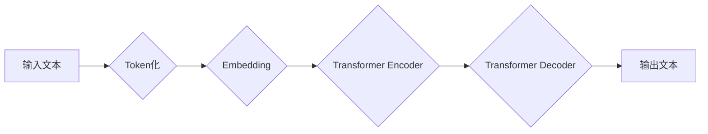

> 大语言模型、Transformer、BERT、GPT、LLM、自然语言处理、深度学习、文本生成

## 1. 背景介绍

近年来，人工智能领域取得了令人瞩目的进展，其中大语言模型（Large Language Model，LLM）作为一种强大的工具，在自然语言处理（Natural Language Processing，NLP）领域展现出巨大的潜力。LLM能够理解和生成人类语言，并完成各种复杂的任务，例如文本摘要、机器翻译、对话系统等。

传统的NLP方法主要依赖于手工设计的特征工程和规则化方法，而LLM则通过深度学习的方式，从海量文本数据中学习语言的结构和语义，从而实现更准确、更自然的语言理解和生成。

## 2. 核心概念与联系

大语言模型的核心概念包括：

* **Transformer:** Transformer是一种新型的深度学习架构，其主要特点是利用注意力机制（Attention Mechanism）来捕捉文本序列中的长距离依赖关系，从而有效提升了模型的性能。

* **BERT:** BERT（Bidirectional Encoder Representations from Transformers）是一种基于Transformer的预训练语言模型，它通过双向编码的方式学习文本的上下文信息，并在各种下游任务中取得了优异的成绩。

* **GPT:** GPT（Generative Pre-trained Transformer）是一种基于Transformer的生成式语言模型，它能够根据输入的文本生成流畅、连贯的文本。

**Mermaid 流程图:**



## 3. 核心算法原理 & 具体操作步骤

### 3.1  算法原理概述

大语言模型的核心算法是基于Transformer架构的深度学习模型。Transformer模型通过多层编码器和解码器结构，利用注意力机制和前馈神经网络来处理文本序列。

* **注意力机制:** 注意力机制能够帮助模型关注文本序列中重要的信息，并捕捉长距离依赖关系。

* **前馈神经网络:** 前馈神经网络用于对文本特征进行非线性变换，并提取更深层次的语义信息。

### 3.2  算法步骤详解

1. **Token化:** 将输入文本分割成一个个独立的单词或子词，称为Token。

2. **Embedding:** 将每个Token映射到一个低维向量空间中，称为Embedding向量。

3. **编码器:** 将Embedding向量输入到多层编码器中，通过注意力机制和前馈神经网络，学习文本的上下文信息和语义表示。

4. **解码器:** 将编码器的输出作为输入，通过注意力机制和前馈神经网络，生成目标文本序列。

5. **输出:** 将生成的文本序列解码成可读的文本。

### 3.3  算法优缺点

**优点:**

* 能够捕捉长距离依赖关系，提升文本理解和生成能力。
* 训练效率高，能够在海量数据上进行训练。
* 在各种下游任务中取得了优异的成绩。

**缺点:**

* 计算资源消耗大，训练成本高。
* 对训练数据质量要求高，容易受到数据偏差的影响。
* 缺乏对真实世界知识的理解，生成的文本可能存在逻辑错误或不合理之处。

### 3.4  算法应用领域

大语言模型在以下领域具有广泛的应用前景：

* **自然语言理解:** 文本分类、情感分析、问答系统、文本摘要等。
* **自然语言生成:** 机器翻译、对话系统、文本创作、代码生成等。
* **其他领域:** 搜索引擎优化、知识图谱构建、数据分析等。

## 4. 数学模型和公式 & 详细讲解 & 举例说明

### 4.1  数学模型构建

大语言模型的数学模型主要基于深度学习框架，包括多层感知机、卷积神经网络和循环神经网络等。

**Transformer模型的数学模型:**

Transformer模型的核心是注意力机制和多头注意力机制。

* **注意力机制:**

$$
Attention(Q, K, V) = \frac{exp(Q \cdot K^T / \sqrt{d_k})}{exp(Q \cdot K^T / \sqrt{d_k})} \cdot V
$$

其中，Q、K、V分别代表查询矩阵、键矩阵和值矩阵，$d_k$代表键向量的维度。

* **多头注意力机制:**

多头注意力机制将注意力机制应用于多个不同的子空间，并通过拼接和线性变换来融合信息。

### 4.2  公式推导过程

注意力机制的公式推导过程可以参考相关文献，例如Vaswani et al. (2017)的论文《Attention Is All You Need》。

### 4.3  案例分析与讲解

**举例说明:**

假设我们有一个句子“The cat sat on the mat”，我们想要计算“cat”这个词对于整个句子的注意力权重。

1. 将句子中的每个词都转换为Embedding向量。

2. 计算“cat”的查询向量Q和所有词的键向量K之间的点积。

3. 将点积结果进行softmax归一化，得到“cat”对于每个词的注意力权重。

4. 将注意力权重与所有词的价值向量V进行加权求和，得到“cat”对于整个句子的上下文表示。

## 5. 项目实践：代码实例和详细解释说明

### 5.1  开发环境搭建

* Python 3.6+
* TensorFlow/PyTorch
* CUDA/cuDNN

### 5.2  源代码详细实现

```python
# 使用HuggingFace Transformers库加载预训练模型
from transformers import AutoModelForSequenceClassification, AutoTokenizer

# 加载BERT模型
model_name = "bert-base-uncased"
tokenizer = AutoTokenizer.from_pretrained(model_name)
model = AutoModelForSequenceClassification.from_pretrained(model_name)

# 输入文本
text = "This is a sample text."

# Token化
inputs = tokenizer(text, return_tensors="pt")

# 前向传播
outputs = model(**inputs)

# 获取预测结果
predicted_class = outputs.logits.argmax().item()
```

### 5.3  代码解读与分析

* 使用HuggingFace Transformers库可以方便地加载预训练模型和进行文本处理。
* BERT模型可以用于各种下游任务，例如文本分类。
* 代码示例展示了如何使用BERT模型对文本进行分类。

### 5.4  运行结果展示

运行代码后，会输出预测的文本类别。

## 6. 实际应用场景

### 6.1  文本分类

大语言模型可以用于对文本进行分类，例如情感分析、主题分类、垃圾邮件过滤等。

### 6.2  机器翻译

大语言模型可以用于机器翻译，将一种语言的文本翻译成另一种语言。

### 6.3  对话系统

大语言模型可以用于构建对话系统，例如聊天机器人、虚拟助手等。

### 6.4  未来应用展望

大语言模型在未来将有更广泛的应用场景，例如：

* **个性化教育:** 根据学生的学习情况提供个性化的学习内容和辅导。
* **医疗诊断:** 辅助医生进行疾病诊断和治疗方案制定。
* **法律服务:** 自动化法律文件处理和法律咨询。

## 7. 工具和资源推荐

### 7.1  学习资源推荐

* **书籍:**
    * 《深度学习》
    * 《自然语言处理》
* **在线课程:**
    * Coursera: 自然语言处理
    * edX: 深度学习
* **博客和网站:**
    * HuggingFace
    * TensorFlow Blog
    * PyTorch Blog

### 7.2  开发工具推荐

* **Python:** 
* **TensorFlow:** 
* **PyTorch:** 
* **HuggingFace Transformers:** 

### 7.3  相关论文推荐

* Vaswani et al. (2017). Attention Is All You Need.
* Devlin et al. (2018). BERT: Pre-training of Deep Bidirectional Transformers for Language Understanding.
* Radford et al. (2019). Language Models are Few-Shot Learners.

## 8. 总结：未来发展趋势与挑战

### 8.1  研究成果总结

大语言模型在自然语言处理领域取得了显著的进展，展现出强大的能力和潜力。

### 8.2  未来发展趋势

* **模型规模和能力的提升:** 未来将会有更大规模、更强大的大语言模型出现。
* **多模态学习:** 将文本与其他模态信息（例如图像、音频）进行融合，实现更全面的理解和生成。
* **可解释性增强:** 提高大语言模型的透明度和可解释性，帮助人们更好地理解模型的决策过程。

### 8.3  面临的挑战

* **数据获取和标注:** 大语言模型需要海量高质量的数据进行训练，数据获取和标注成本高昂。
* **计算资源消耗:** 训练大语言模型需要大量的计算资源，成本高昂。
* **伦理和安全问题:** 大语言模型可能被用于生成虚假信息、进行恶意攻击等，需要关注其伦理和安全问题。

### 8.4  研究展望

未来研究将重点关注以下方面:

* **高效训练方法:** 开发更有效的训练方法，降低训练成本和时间。
* **可解释性研究:** 研究大语言模型的决策机制，提高其透明度和可解释性。
* **安全性和伦理问题:** 研究大语言模型的潜在风险，并制定相应的安全和伦理规范。

## 9. 附录：常见问题与解答

* **Q: 大语言模型的训练数据是什么？**

* **A:** 大语言模型的训练数据通常是公开可用的文本数据，例如书籍、文章、网站内容等。

* **Q: 如何评估大语言模型的性能？**

* **A:** 大语言模型的性能通常通过在各种下游任务上的准确率、F1-score等指标进行评估。

* **Q: 大语言模型的应用场景有哪些？**

* **A:** 大语言模型的应用场景非常广泛，例如文本分类、机器翻译、对话系统、代码生成等。


作者：禅与计算机程序设计艺术 / Zen and the Art of Computer Programming 
<end_of_turn>