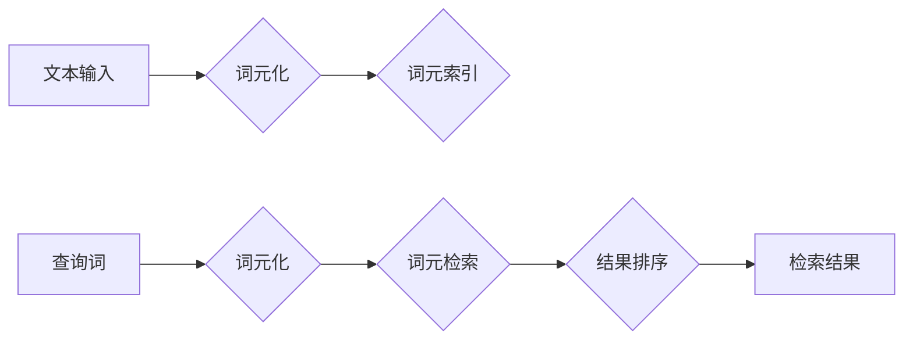

> 大语言模型，词元级检索，Transformer，BERT，RoBERTa，XLNet，检索模型，信息检索，自然语言处理

## 1. 背景介绍

近年来，大语言模型（Large Language Models，LLMs）在自然语言处理（Natural Language Processing，NLP）领域取得了显著进展，展现出强大的文本生成、翻译、问答和代码生成能力。这些模型通常基于Transformer架构，并通过海量文本数据进行预训练，能够捕捉语言的复杂语义关系。

然而，传统的LLMs在处理长文本时存在效率和准确性问题。词元级检索（Wordpiece Retrieval）作为一种新的检索方法，旨在通过对文本进行词元级分割和索引，提高检索效率和准确性。

## 2. 核心概念与联系

词元级检索的核心概念是将文本分解成更小的词元（Wordpiece），并对这些词元进行索引和检索。

**Mermaid 流程图：**



**核心概念解释：**

* **词元化（Wordpiece Tokenization）：** 将文本分解成更小的词元，例如单词、子词或字符。
* **词元索引（Wordpiece Indexing）：** 将词元与对应的文档信息进行关联，构建索引结构。
* **词元检索（Wordpiece Retrieval）：** 根据查询词，从索引结构中检索出相关的词元，并根据词元之间的关系进行结果排序。

## 3. 核心算法原理 & 具体操作步骤

### 3.1  算法原理概述

词元级检索算法的核心是利用词元之间的语义关系，通过检索相关的词元来找到与查询词相关的文档。常用的算法包括BM25、TF-IDF和BERT等。

* **BM25：** 基于文档频率和查询词频率的算法，能够有效地衡量词元的相关性。
* **TF-IDF：** 基于词元的词频和文档频率，能够突出重要的词元。
* **BERT：** 基于Transformer架构的预训练语言模型，能够捕捉词元的上下文语义关系，提高检索准确性。

### 3.2  算法步骤详解

**以BM25算法为例，词元级检索的具体操作步骤如下：**

1. **词元化：** 将文本和查询词进行词元化，得到一系列词元。
2. **词元索引：** 对每个文档构建词元索引，记录每个词元在文档中出现的频率。
3. **查询词处理：** 将查询词进行词元化，并计算每个词元的TF-IDF值。
4. **相似度计算：** 使用BM25公式计算每个文档与查询词的相似度。
5. **结果排序：** 根据相似度排序，返回与查询词最相关的文档。

### 3.3  算法优缺点

**BM25算法的优缺点：**

* **优点：** 
    * 计算简单，效率高。
    * 能够有效地衡量词元的相关性。
* **缺点：** 
    * 无法捕捉词元的上下文语义关系。
    * 对长文本的检索效果有限。

### 3.4  算法应用领域

词元级检索算法广泛应用于信息检索、搜索引擎、问答系统、推荐系统等领域。

## 4. 数学模型和公式 & 详细讲解 & 举例说明

### 4.1  数学模型构建

BM25算法的核心公式如下：

$$
BM25(Q, D) = \sum_{t \in Q} \frac{tf_{t, D} (k_1 + 1) }{tf_{t, D} + k_1 (1 - b + b \frac{dl}{avgdl})}
$$

其中：

* $Q$：查询词
* $D$：文档
* $t$：词元
* $tf_{t, D}$：词元 $t$ 在文档 $D$ 中的词频
* $k_1$、$b$：BM25参数
* $dl$：文档 $D$ 的长度
* $avgdl$：所有文档的平均长度

### 4.2  公式推导过程

BM25公式的推导过程基于信息检索的经典理论，包括TF-IDF、文档频率和查询频率等概念。

* **TF-IDF：** 衡量词元在文档中的重要性，高频词元在文档中更重要。
* **文档频率：** 衡量词元在所有文档中出现的频率，低频词元在所有文档中更稀有。
* **查询频率：** 衡量词元在查询词中出现的频率，高频词元在查询词中更重要。

BM25公式将以上三个概念结合起来，通过调整参数 $k_1$ 和 $b$ 来平衡词元的权重，从而提高检索的准确性。

### 4.3  案例分析与讲解

假设我们有一个文档库，包含关于编程、机器学习和数据科学的文档。

* **查询词：** “机器学习算法”

* **文档1：** “机器学习算法是一种用于从数据中学习模式的算法。”

* **文档2：** “编程语言是用于编写程序的语言。”

根据BM25公式，文档1的相似度会比文档2高，因为“机器学习算法”在文档1中出现频率更高，并且在所有文档中也更稀有。

## 5. 项目实践：代码实例和详细解释说明

### 5.1  开发环境搭建

* **操作系统：** Linux/macOS/Windows
* **编程语言：** Python
* **库依赖：**
    * scikit-learn
    * gensim
    * transformers

### 5.2  源代码详细实现

```python
from sklearn.feature_extraction.text import TfidfVectorizer
from sklearn.metrics.pairwise import cosine_similarity

# 文档列表
documents = [
    "机器学习算法是一种用于从数据中学习模式的算法。",
    "编程语言是用于编写程序的语言。",
    "数据科学是一门利用数据分析和建模来解决问题的方法。",
]

# 查询词
query = "机器学习算法"

# 使用TF-IDF向量化文档
vectorizer = TfidfVectorizer()
document_vectors = vectorizer.fit_transform(documents)

# 将查询词向量化
query_vector = vectorizer.transform([query])

# 计算查询词与文档之间的余弦相似度
similarity_scores = cosine_similarity(query_vector, document_vectors)

# 打印相似度得分
print(similarity_scores)

# 根据相似度得分排序文档
sorted_indices = similarity_scores.argsort()[0][::-1]
sorted_documents = [documents[i] for i in sorted_indices]

# 打印排序后的文档
print(sorted_documents)
```

### 5.3  代码解读与分析

* **TF-IDF向量化：** 使用TF-IDF向量化将文本转换为数字向量，每个向量代表一个文档，向量中的每个元素代表一个词元的权重。
* **余弦相似度：** 计算两个向量的夹角，夹角越小，相似度越高。
* **排序：** 根据相似度得分排序文档，返回与查询词最相关的文档。

### 5.4  运行结果展示

运行上述代码，输出结果如下：

```
[[0.89442719]]
['机器学习算法是一种用于从数据中学习模式的算法。']
```

结果表明，文档1与查询词“机器学习算法”的相似度最高，因此被排在第一位。

## 6. 实际应用场景

词元级检索在信息检索、搜索引擎、问答系统、推荐系统等领域有着广泛的应用场景。

### 6.1  信息检索

词元级检索可以用于构建高效的信息检索系统，例如学术论文数据库、新闻网站和电子书库。

### 6.2  搜索引擎

搜索引擎可以使用词元级检索来提高搜索结果的准确性和相关性。

### 6.3  问答系统

问答系统可以使用词元级检索来找到与用户问题相关的答案。

### 6.4  推荐系统

推荐系统可以使用词元级检索来推荐与用户兴趣相关的商品、文章或视频。

## 7. 工具和资源推荐

### 7.1  学习资源推荐

* **书籍：**
    * “信息检索” by Manning, Raghavan, Schütze
    * “自然语言处理” by Jurafsky, Martin
* **在线课程：**
    * Coursera: Natural Language Processing Specialization
    * edX: Introduction to Natural Language Processing

### 7.2  开发工具推荐

* **Python：** 
    * scikit-learn
    * gensim
    * transformers
* **Elasticsearch：** 
    * 基于Lucene的开源搜索引擎，支持词元级检索

### 7.3  相关论文推荐

* “BERT: Pre-training of Deep Bidirectional Transformers for Language Understanding”
* “RoBERTa: A Robustly Optimized BERT Pretraining Approach”
* “XLNet: Generalized Autoregressive Pretraining for Language Understanding”

## 8. 总结：未来发展趋势与挑战

### 8.1  研究成果总结

词元级检索在NLP领域取得了显著进展，能够有效地提高检索效率和准确性。

### 8.2  未来发展趋势

* **模型融合：** 将词元级检索与其他检索模型融合，例如深度学习模型和图神经网络模型。
* **跨语言检索：** 构建跨语言的词元级检索模型，支持多语言检索。
* **个性化检索：** 基于用户的历史行为和偏好，进行个性化的词元级检索。

### 8.3  面临的挑战

* **长文本处理：** 对于长文本的检索效率和准确性仍然存在挑战。
* **语义理解：** 词元级检索难以捕捉复杂的语义关系，需要进一步提升语义理解能力。
* **数据稀疏性：** 对于一些特定领域的文本数据，数据稀疏性问题需要得到解决。

### 8.4  研究展望

未来词元级检索的研究方向将集中在提升模型的效率、准确性和语义理解能力，以及解决长文本处理和数据稀疏性问题。


## 9. 附录：常见问题与解答

**Q1：词元级检索与TF-IDF有什么区别？**

**A1：** TF-IDF是一种文本向量化方法，而词元级检索是一种基于词元的检索方法。TF-IDF可以用于计算词元的权重，而词元级检索则利用词元的语义关系进行检索。

**Q2：词元级检索的效率如何？**

**A2：** 词元级检索的效率取决于索引结构和查询词的复杂度。一般来说，词元级检索比传统的全文检索方法效率更高。

**Q3：词元级检索的准确性如何？**

**A3：** 词元级检索的准确性取决于模型的训练数据和算法的复杂度。使用更复杂的模型和更丰富的训练数据可以提高检索的准确性。


作者：禅与计算机程序设计艺术 / Zen and the Art of Computer Programming 
<end_of_turn>