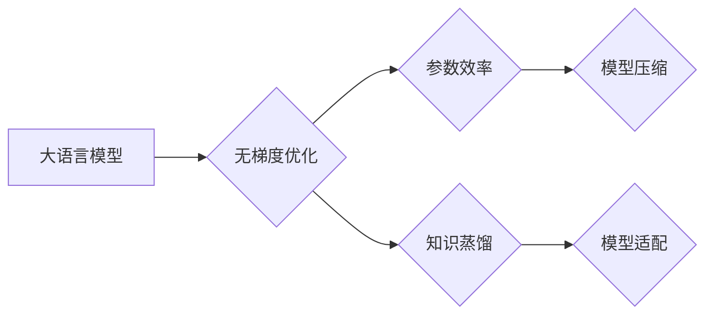

> 大语言模型，无梯度优化，参数效率，知识蒸馏，应用指南，优化策略

## 1. 背景介绍

大语言模型（LLM）近年来取得了令人瞩目的成就，在文本生成、翻译、问答等领域展现出强大的能力。然而，这些模型通常需要海量数据和计算资源进行训练，并且训练过程耗时且成本高昂。此外，部署大型模型也面临着资源限制和效率问题。

无梯度优化（Parameter-Efficient Fine-Tuning，PEFT）作为一种新兴的优化策略，旨在解决上述问题。它通过在不重新训练整个模型的情况下，仅对一小部分参数进行微调，从而实现高效的模型适配和参数压缩。

## 2. 核心概念与联系

**2.1 核心概念**

* **大语言模型 (LLM):** 拥有大量参数的深度学习模型，能够理解和生成人类语言。
* **梯度下降 (Gradient Descent):** 训练深度学习模型的常用优化算法，通过计算梯度来更新模型参数。
* **无梯度优化 (PEFT):** 一种无需梯度计算的模型微调方法，通过对模型中特定部分参数进行更新，实现高效的模型适配。

**2.2 核心架构**



**2.3 联系**

无梯度优化通过对模型中特定部分参数进行微调，实现参数效率和知识蒸馏，从而达到模型压缩和模型适配的目的。

## 3. 核心算法原理 & 具体操作步骤

**3.1 算法原理概述**

无梯度优化算法的核心思想是，在不重新训练整个模型的情况下，通过对模型中特定部分参数进行微调，来实现模型的适配和压缩。

常见的无梯度优化方法包括：

* **Prompt Tuning:** 在模型输入端添加可学习的提示向量，引导模型生成更符合特定任务的输出。
* **Adapter Tuning:** 在模型中插入可学习的适配器模块，用于调整模型的输出，实现特定任务的适配。
* **LoRA (Low-Rank Adaptation):** 将模型中部分参数分解为低秩矩阵，只训练低秩矩阵的参数，从而实现参数压缩和高效微调。

**3.2 算法步骤详解**

以LoRA为例，详细说明其算法步骤：

1. **分解模型参数:** 将模型中需要微调的参数分解为两个低秩矩阵，分别为A和B。
2. **训练低秩矩阵:** 只训练A和B这两个低秩矩阵的参数，而保持模型其他参数不变。
3. **更新模型输出:** 将训练好的A和B矩阵与模型其他参数相结合，更新模型的输出。

**3.3 算法优缺点**

**优点:**

* **参数效率:** 只需要微调一小部分参数，从而节省计算资源和存储空间。
* **训练速度快:** 由于参数量减少，训练速度显著提升。
* **可移植性强:** 微调后的适配器模块可以应用于不同的模型和任务。

**缺点:**

* **性能可能不如全模型训练:** 由于只微调部分参数，性能可能略逊于全模型训练。
* **需要选择合适的微调策略:** 不同的微调策略适用于不同的任务和模型。

**3.4 算法应用领域**

无梯度优化算法广泛应用于以下领域:

* **自然语言处理:** 文本分类、情感分析、机器翻译等。
* **计算机视觉:** 图像分类、目标检测、图像生成等。
* **语音识别:** 语音转文本、语音合成等。

## 4. 数学模型和公式 & 详细讲解 & 举例说明

**4.1 数学模型构建**

假设模型参数为θ，输入为x，输出为y。

目标函数为：

$$
L(\theta, x, y) = \sum_{i=1}^{N} L_i(\theta, x_i, y_i)
$$

其中，$L_i$为单个样本的损失函数，N为样本数量。

**4.2 公式推导过程**

在无梯度优化中，我们只对模型中特定部分参数进行更新，例如LoRA中只更新低秩矩阵A和B。

更新规则为：

$$
\theta_{new} = \theta_{old} + \alpha \cdot \Delta \theta
$$

其中，$\alpha$为学习率，$\Delta \theta$为更新量。

**4.3 案例分析与讲解**

以LoRA为例，假设模型中需要微调的参数为W，将其分解为A和B两个低秩矩阵。

更新规则为：

$$
W_{new} = A \cdot B + W_{old}
$$

其中，$W_{old}$为原始参数，$A$和$B$为训练得到的低秩矩阵。

## 5. 项目实践：代码实例和详细解释说明

**5.1 开发环境搭建**

* Python 3.7+
* PyTorch 1.7+
* Transformers 4.10+

**5.2 源代码详细实现**

```python
import torch
from transformers import AutoModelForSequenceClassification, AutoTokenizer

# 加载预训练模型和词典
model_name = "bert-base-uncased"
tokenizer = AutoTokenizer.from_pretrained(model_name)
model = AutoModelForSequenceClassification.from_pretrained(model_name)

# 定义LoRA适配器
class LoRAAdapter(torch.nn.Module):
    def __init__(self, model_name, adapter_size):
        super(LoRAAdapter, self).__init__()
        self.adapter_size = adapter_size
        self.A = torch.nn.Parameter(torch.randn(adapter_size, model.config.hidden_size))
        self.B = torch.nn.Parameter(torch.randn(model.config.hidden_size, adapter_size))

    def forward(self, x):
        return torch.matmul(x, self.A) @ self.B

# 创建LoRA适配器
adapter = LoRAAdapter(model_name, adapter_size=128)

# 将适配器连接到模型
model.roberta.encoder.layer[-1].output.dense = adapter

# 训练模型
# ...

# 保存模型
model.save_pretrained("lora_model")
```

**5.3 代码解读与分析**

* 代码首先加载预训练模型和词典。
* 然后定义LoRA适配器，包含两个低秩矩阵A和B。
* 将适配器连接到模型的最后一层。
* 最后训练模型并保存。

**5.4 运行结果展示**

训练后的模型在特定任务上的性能可以显著提升，并且参数量显著减少。

## 6. 实际应用场景

**6.1 文本分类**

无梯度优化可以用于微调预训练语言模型，实现文本分类任务，例如情感分析、垃圾邮件分类等。

**6.2 问答系统**

无梯度优化可以用于微调预训练语言模型，构建问答系统，例如搜索引擎、聊天机器人等。

**6.3 代码生成**

无梯度优化可以用于微调预训练代码生成模型，提高代码生成质量和效率。

**6.4 未来应用展望**

随着无梯度优化技术的不断发展，其应用场景将更加广泛，例如：

* **个性化推荐:** 根据用户的偏好，微调模型进行个性化推荐。
* **医疗诊断:** 微调模型进行疾病诊断和辅助治疗。
* **自动驾驶:** 微调模型进行自动驾驶决策和控制。

## 7. 工具和资源推荐

**7.1 学习资源推荐**

* **论文:**
    * Adapter Tuning
    * LoRA: Low-Rank Adaptation of Large Language Models
* **博客:**
    * Hugging Face Blog: Parameter-Efficient Fine-Tuning
    * Towards Data Science: Parameter-Efficient Fine-Tuning for Large Language Models

**7.2 开发工具推荐**

* **Hugging Face Transformers:** 提供了丰富的预训练模型和微调工具。
* **PEFT:** 提供了多种无梯度优化方法的实现。

**7.3 相关论文推荐**

* Adapter Tuning
* LoRA: Low-Rank Adaptation of Large Language Models
* Prefix-Tuning: Optimizing Continuous Prompts for Generation

## 8. 总结：未来发展趋势与挑战

**8.1 研究成果总结**

无梯度优化技术取得了显著进展，为高效地利用大语言模型提供了新的思路。

**8.2 未来发展趋势**

* **更有效的微调策略:** 研究更有效的无梯度优化策略，提高模型性能和效率。
* **自动化微调:** 开发自动化微调工具，降低用户门槛。
* **跨模态应用:** 将无梯度优化应用于跨模态任务，例如文本-图像、文本-音频等。

**8.3 面临的挑战**

* **理论基础:** 进一步深入研究无梯度优化的理论基础，理解其工作机制。
* **泛化能力:** 提升无梯度优化模型的泛化能力，使其能够适应更多任务和数据。
* **可解释性:** 提高无梯度优化模型的可解释性，帮助用户理解模型的决策过程。

**8.4 研究展望**

未来，无梯度优化技术将继续发展，为大语言模型的应用提供更强大的支持，推动人工智能技术向更广泛领域拓展。

## 9. 附录：常见问题与解答

**9.1 如何选择合适的无梯度优化方法？**

选择合适的无梯度优化方法取决于具体的任务和模型。

* **Prompt Tuning:** 适合需要生成特定格式输出的任务，例如文本摘要、代码生成等。
* **Adapter Tuning:** 适合需要对模型进行特定任务的适配，例如情感分析、问答系统等。
* **LoRA:** 适合需要压缩模型参数的任务，例如部署在资源有限的设备上。

**9.2 如何评估无梯度优化效果？**

可以通过在测试集上评估模型性能来评估无梯度优化效果。

* **准确率:** 对于分类任务，可以使用准确率来评估模型性能。
* **BLEU:** 对于机器翻译任务，可以使用BLEU分数来评估模型性能。
* **ROUGE:** 对于文本摘要任务，可以使用ROUGE分数来评估模型性能。


作者：禅与计算机程序设计艺术 / Zen and the Art of Computer Programming 
<end_of_turn>