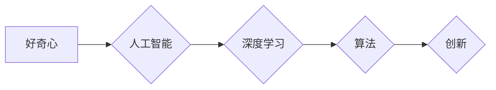

>  好奇心、人工智能、探索、学习、创新、算法、深度学习、机器学习

## 1. 背景介绍

在瞬息万变的科技时代，人类对未知世界的探索永不停歇。从最初的火种，到如今的智能机器，每一次突破都源于人类对未知的渴望和探索。而这种渴望，这种对未知的追寻，正是我们称之为“好奇心”的力量。

好奇心是人类天生的本能，它驱使我们去探索世界，去理解事物，去寻求答案。对于程序员而言，好奇心更是至关重要的驱动力。它让我们不断学习新知识，探索新的技术，并最终将这些知识转化为创新的解决方案。

然而，在当今科技发展日新月异的时代，单纯的“好奇心”可能显得不够强大。我们需要将好奇心与更强大的工具和方法相结合，才能真正地探索世界的奥秘。

## 2. 核心概念与联系

### 2.1  好奇心与人工智能

人工智能（AI）作为科技发展的重要方向，正在深刻地改变着我们的生活。AI的本质是模拟人类的智能，而好奇心正是人类智能的核心驱动力。

我们可以将好奇心视为一种“学习驱动”，它促使我们去收集信息、分析数据、建立模型，最终获得对世界的更深入的理解。而人工智能的学习机制也正是基于这种“好奇心”驱动。

通过深度学习、机器学习等算法，AI可以从海量数据中学习，不断完善自己的知识体系，并最终能够像人类一样，对世界提出问题，并寻求答案。

### 2.2  好奇心与算法

算法是人工智能的核心，它决定了AI如何学习、思考和决策。而好奇心则可以作为算法设计和改进的灵感来源。

例如，我们可以设计一种“好奇心驱动的算法”，它能够主动探索未知领域，并根据探索结果不断调整自己的学习策略。这种算法能够帮助AI更有效地学习，并最终获得更深刻的理解。

### 2.3  好奇心与创新

好奇心是创新的源泉。它让我们敢于打破常规，探索新的可能性，并最终创造出新的价值。

对于程序员而言，好奇心可以帮助他们发现新的技术，并将其应用于实际问题中。它可以激发他们对代码的探索，并最终编写出更优雅、更高效的程序。

**Mermaid 流程图**



## 3. 核心算法原理 & 具体操作步骤

### 3.1  算法原理概述

“好奇心驱动的算法”是一种基于强化学习的算法，它能够通过奖励机制来引导AI的探索行为。

该算法的核心思想是：AI会根据自己的探索行为获得奖励或惩罚，并根据这些反馈信息不断调整自己的行为策略，最终找到最优的探索路径。

### 3.2  算法步骤详解

1. **环境建模:** 首先，需要构建一个模拟真实世界的环境，并定义AI的目标和奖励机制。
2. **状态表示:** 将环境的状态表示为一个向量，以便AI能够理解和感知环境的变化。
3. **动作空间:** 定义AI可以执行的动作，例如探索新的区域、收集信息、与其他AI交互等。
4. **奖励函数:** 定义一个奖励函数，用于评估AI的行为是否符合目标，并给予相应的奖励或惩罚。
5. **策略学习:** 使用强化学习算法，例如Q-learning，来学习最优的探索策略，即在不同状态下执行哪个动作能够获得最大的奖励。
6. **探索与利用:** 在实际执行过程中，AI需要平衡探索新知识和利用已知知识。可以使用探索-利用算法，例如ε-贪婪算法，来控制探索和利用的比例。

### 3.3  算法优缺点

**优点:**

* 可以引导AI主动探索未知领域，并发现新的知识。
* 可以适应动态变化的环境，并不断调整探索策略。
* 可以提高AI的学习效率，并最终获得更深刻的理解。

**缺点:**

* 需要构建复杂的奖励机制，并确保奖励函数能够有效地引导AI的行为。
* 探索过程可能需要很长时间，并且可能需要大量的计算资源。
* 算法的性能取决于环境的复杂性和数据质量。

### 3.4  算法应用领域

* **机器人探索:** 可以引导机器人探索未知环境，并发现新的路径或资源。
* **科学发现:** 可以帮助科学家探索新的科学领域，并发现新的规律或现象。
* **个性化学习:** 可以根据学生的学习情况，定制个性化的学习路径，并提高学习效率。

## 4. 数学模型和公式 & 详细讲解 & 举例说明

### 4.1  数学模型构建

我们可以使用马尔可夫决策过程（MDP）来建模好奇心驱动的算法。

在MDP中，环境的状态空间为S，动作空间为A，奖励函数为R(s,a)，状态转移概率为P(s',a|s)。AI的目标是找到一个策略π(s)，使得在执行该策略时，获得的总奖励最大化。

### 4.2  公式推导过程

Q-learning算法是一种常用的强化学习算法，它可以用来学习最优的策略。

Q-learning算法的目标是学习一个Q函数，Q(s,a)，表示在状态s执行动作a的期望奖励。

Q函数的更新规则为：

$$Q(s,a) = Q(s,a) + \alpha [R(s,a) + \gamma \max_{a'} Q(s',a') - Q(s,a)]$$

其中：

* α为学习率，控制着学习速度。
* γ为折扣因子，控制着未来奖励的权重。
* R(s,a)为在状态s执行动作a的奖励。
* s'为执行动作a后进入的状态。
* a'为在状态s'执行的动作。

### 4.3  案例分析与讲解

假设我们有一个机器人需要在迷宫中找到出口。我们可以将迷宫建模为一个MDP，其中状态空间为迷宫中的每个位置，动作空间为向四个方向移动，奖励函数为到达出口时获得最大奖励，其他情况下获得较小的奖励。

使用Q-learning算法，机器人可以学习最优的移动策略，最终找到出口。

## 5. 项目实践：代码实例和详细解释说明

### 5.1  开发环境搭建

* Python 3.x
* TensorFlow 或 PyTorch
* Jupyter Notebook

### 5.2  源代码详细实现

```python
import numpy as np

# 定义环境
class MazeEnv:
    def __init__(self, maze):
        self.maze = maze
        self.state = (0, 0)  # 初始状态

    def step(self, action):
        # 根据动作更新状态
        # ...

        # 计算奖励
        # ...

        # 返回新的状态、奖励、是否结束游戏
        # ...

# 定义Q-learning算法
class QLearning:
    def __init__(self, env, alpha=0.1, gamma=0.9, epsilon=0.1):
        self.env = env
        self.alpha = alpha
        self.gamma = gamma
        self.epsilon = epsilon
        self.q_table = np.zeros((env.maze.shape[0] * env.maze.shape[1], env.action_space.n))

    def choose_action(self, state):
        # 使用ε-贪婪策略选择动作
        # ...

    def learn(self, num_episodes):
        for episode in range(num_episodes):
            # 重置环境
            self.env.reset()

            # 执行每个时间步
            while True:
                # 选择动作
                action = self.choose_action(self.env.state)

                # 执行动作并获取奖励
                next_state, reward, done = self.env.step(action)

                # 更新Q值
                self.q_table[self.env.state, action] += self.alpha * (reward + self.gamma * np.max(self.q_table[next_state, :]) - self.q_table[self.env.state, action])

                # 更新状态
                self.env.state = next_state

                # 如果游戏结束，则退出循环
                if done:
                    break

# 创建环境和算法实例
env = MazeEnv(maze)
agent = QLearning(env)

# 训练算法
agent.learn(num_episodes=1000)

# 测试算法
# ...
```

### 5.3  代码解读与分析

* **环境建模:** `MazeEnv`类定义了迷宫环境，包括状态空间、动作空间、奖励函数等。
* **Q-learning算法:** `QLearning`类实现了Q-learning算法，包括选择动作、更新Q值等步骤。
* **ε-贪婪策略:** 在选择动作时，使用ε-贪婪策略，以概率ε选择随机动作，以概率1-ε选择Q值最大的动作。
* **Q值更新:** Q值更新规则根据Bellman方程进行更新，将当前状态、动作、奖励和下一个状态的Q值最大值作为更新依据。

### 5.4  运行结果展示

训练完成后，可以将训练好的Q值表用于控制机器人探索迷宫。

## 6. 实际应用场景

### 6.1  科学探索

好奇心驱动的算法可以帮助科学家探索未知领域，例如：

* **宇宙探索:** 可以引导机器人探索太空，并发现新的行星或星系。
* **深海探索:** 可以帮助机器人探索深海，并发现新的海洋生物或资源。
* **基因组研究:** 可以帮助AI分析基因组数据，并发现新的基因或疾病机制。

### 6.2  教育领域

好奇心驱动的算法可以帮助学生个性化学习，例如：

* **个性化学习路径:** 根据学生的学习情况，定制个性化的学习路径，并提供更有效的学习资源。
* **主动学习:** 鼓励学生主动探索知识，并提出问题，从而提高学习兴趣和效率。
* **游戏化学习:** 将学习内容融入游戏，激发学生的学习兴趣，并提高学习效果。

### 6.3  商业应用

好奇心驱动的算法可以帮助企业发现新的市场机会，例如：

* **市场调研:** 分析用户数据，发现新的市场需求和趋势。
* **产品开发:** 根据用户反馈，改进产品功能，并开发新的产品。
* **客户服务:** 利用AI聊天机器人，提供更智能和个性化的客户服务。

### 6.4  未来应用展望

随着人工智能技术的不断发展，好奇心驱动的算法将有更广泛的应用场景，例如：

* **医疗诊断:** AI可以帮助医生诊断疾病，并提供个性化的治疗方案。
* **自动驾驶:** AI可以帮助汽车自主驾驶，提高交通安全和效率。
* **艺术创作:** AI可以帮助艺术家创作新的艺术作品，并探索新的艺术形式。

## 7. 工具和资源推荐

### 7.1  学习资源推荐

* **书籍:**
    * 《Reinforcement Learning: An Introduction》 by Richard S. Sutton and Andrew G. Barto
    * 《Deep Learning》 by Ian Goodfellow, Yoshua Bengio, and Aaron Courville
* **在线课程:**
    * Coursera: Reinforcement Learning Specialization
    * Udacity: Deep Learning Nanodegree

### 7.2  开发工具推荐

* **Python:** 广泛用于人工智能开发，拥有丰富的库和工具。
* **TensorFlow:** 开源深度学习框架，支持多种硬件平台。
* **PyTorch:** 开源深度学习框架，以其灵活性和易用性而闻名。

### 7.3  相关论文推荐

* **Curiosity-Driven Exploration by Self-Reward** by  Pathak et al. (2017)
* **Intrinsic Motivation and Autonomous Learning** by  Schmidhuber (2010)
* **Deep Reinforcement Learning: An Overview** by  Mnih et al. (2015)

## 8. 总结：未来发展趋势与挑战

### 8.1  研究成果总结

好奇心驱动的算法取得了显著