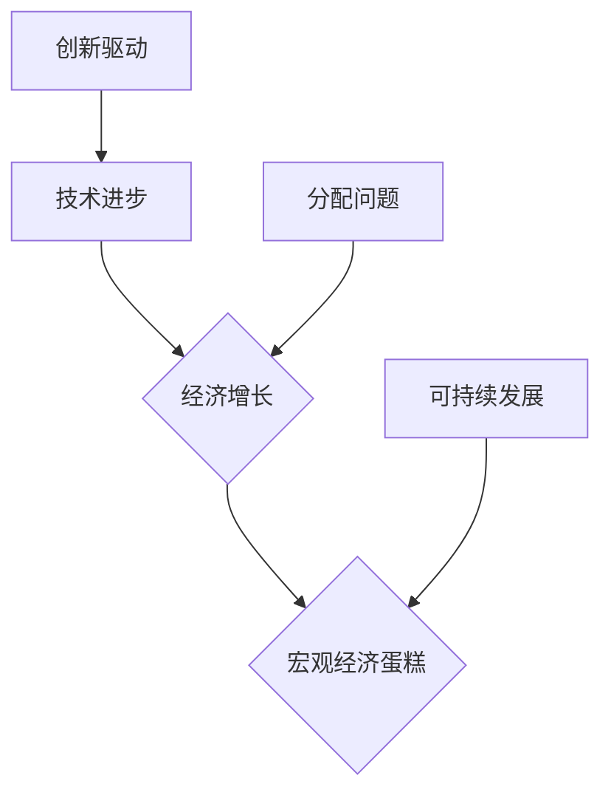

> 宏观经济、蛋糕大小、技术进步、分配问题、创新驱动、经济增长、可持续发展

## 1. 背景介绍

宏观经济的增长一直是各国政府和社会各界关注的焦点。然而，近年来，全球经济增长乏力，宏观经济蛋糕增长的速度明显放缓。这引发了人们对经济增长模式的反思，以及如何推动经济持续健康发展的问题。

从技术进步的角度来看，科技创新一直是推动经济增长的重要引擎。然而，近年来，尽管科技发展日新月异，但宏观经济蛋糕的增长却并未得到显著提升。这表明，单纯依靠技术进步无法解决宏观经济增长乏力的问题。

## 2. 核心概念与联系

**2.1 宏观经济蛋糕**

宏观经济蛋糕是指一个国家或地区的总经济产出，它反映了社会生产总值（GDP）的规模。宏观经济蛋糕的大小决定了国民生活水平和社会福利水平。

**2.2 技术进步**

技术进步是指人类生产力水平的提高，它可以带来生产效率的提升、新产品的诞生以及新的产业结构。技术进步是推动经济增长的重要动力。

**2.3 分配问题**

分配问题是指经济产出如何分配给不同社会群体的问题。合理的分配机制可以促进社会公平正义，提高社会整体福利。

**2.4 创新驱动**

创新驱动是指以科技创新为核心，以市场机制为导向，以人才为支撑，推动经济发展的新模式。创新驱动是实现可持续经济增长的关键。

**2.5 经济增长**

经济增长是指一个国家或地区的经济产出在一定时期内按一定比例增加的现象。经济增长是社会进步的重要标志。

**2.6 可持续发展**

可持续发展是指满足当前世代需求，而不损害未来世代满足其自身需求的能力。可持续发展是实现经济、社会和环境协调发展的目标。

**2.7 核心概念联系**

技术进步可以推动经济增长，但分配问题和创新驱动是影响宏观经济蛋糕大小的关键因素。合理的分配机制可以促进社会公平正义，提高社会整体福利，从而为经济增长创造更加有利的条件。而创新驱动则可以不断推动技术进步，带来新的经济增长点。



## 3. 核心算法原理 & 具体操作步骤

**3.1 算法原理概述**

宏观经济蛋糕的增长是一个复杂的过程，涉及到众多因素的相互作用。为了更好地理解宏观经济蛋糕的增长机制，我们可以借鉴一些算法原理，例如：

* **生产函数**: 生产函数描述了投入要素与产出的关系，可以用来分析技术进步对经济增长的影响。
* **经济增长模型**: 经济增长模型可以模拟经济发展的过程，并预测未来经济增长的趋势。
* **分配模型**: 分配模型可以分析经济产出如何分配给不同社会群体，并评估分配机制的公平性。

**3.2 算法步骤详解**

1. **数据收集**: 收集宏观经济数据，例如GDP、劳动力、资本、技术进步等指标。
2. **模型构建**: 根据收集到的数据，构建相应的经济增长模型、分配模型等。
3. **参数估计**: 利用统计方法估计模型参数，例如生产函数的弹性系数、分配模型的分配系数等。
4. **模拟分析**: 利用构建的模型进行模拟分析，预测未来宏观经济蛋糕的增长趋势。
5. **政策建议**: 根据模拟分析结果，提出相应的政策建议，例如促进技术进步、优化分配机制等。

**3.3 算法优缺点**

* **优点**: 算法可以提供定量分析结果，帮助我们更好地理解宏观经济蛋糕的增长机制。
* **缺点**: 算法模型的准确性取决于数据的质量和模型的合理性，因此需要谨慎使用。

**3.4 算法应用领域**

* **宏观经济预测**: 预测未来经济增长的趋势。
* **经济政策制定**: 为经济政策制定提供参考依据。
* **产业结构调整**: 分析产业结构变化对宏观经济的影响。

## 4. 数学模型和公式 & 详细讲解 & 举例说明

**4.1 数学模型构建**

一个简单的经济增长模型可以表示为：

$$Y_t = F(K_t, L_t)$$

其中：

* $Y_t$ 表示t时期经济产出（宏观经济蛋糕大小）。
* $K_t$ 表示t时期资本存量。
* $L_t$ 表示t时期劳动力规模。
* $F$ 表示生产函数，描述了资本和劳动力投入与产出的关系。

**4.2 公式推导过程**

假设生产函数为Cobb-Douglas型，即：

$$F(K_t, L_t) = K_t^{\alpha}L_t^{1-\alpha}$$

其中：

* $\alpha$ 表示资本的生产函数弹性系数。

**4.3 案例分析与讲解**

假设$\alpha = 0.3$，$K_t$增长10%，$L_t$增长2%，则经济产出$Y_t$增长率为：

$$
\begin{aligned}
\frac{\Delta Y_t}{Y_t} &= \alpha \frac{\Delta K_t}{K_t} + (1-\alpha) \frac{\Delta L_t}{L_t} \\
&= 0.3 \times 0.1 + (1-0.3) \times 0.02 \\
&= 0.03 + 0.014 \\
&= 0.044
\end{aligned}
$$

因此，在该情况下，经济产出增长率为4.4%。

## 5. 项目实践：代码实例和详细解释说明

**5.1 开发环境搭建**

可以使用Python语言和相应的库进行宏观经济模型的开发。例如，可以使用NumPy库进行数值计算，Pandas库进行数据处理，Matplotlib库进行数据可视化。

**5.2 源代码详细实现**

```python
import numpy as np
import pandas as pd
import matplotlib.pyplot as plt

# 定义生产函数
def production_function(K, L, alpha):
    return K**alpha * L**(1-alpha)

# 数据准备
K = np.array([100, 110, 121, 133.1, 146.41])  # 资本存量
L = np.array([1000, 1020, 1040.4, 1061.68, 1083.97])  # 劳动力规模
alpha = 0.3  # 资本的生产函数弹性系数

# 计算经济产出
Y = production_function(K, L, alpha)

# 数据可视化
plt.plot(K, Y, label='经济产出')
plt.xlabel('资本存量')
plt.ylabel('经济产出')
plt.title('经济产出与资本存量的关系')
plt.legend()
plt.show()
```

**5.3 代码解读与分析**

该代码首先定义了一个生产函数，然后准备了资本存量和劳动力规模的数据。接着，利用生产函数计算了相应的经济产出。最后，使用Matplotlib库绘制了经济产出与资本存量的关系图。

**5.4 运行结果展示**

运行该代码后，会生成一个图表，展示了经济产出与资本存量的关系。从图表中可以看出，随着资本存量的增加，经济产出也呈现出增长趋势。

## 6. 实际应用场景

宏观经济蛋糕的增长模型可以应用于以下场景：

* **经济政策制定**: 政府可以利用该模型预测不同政策措施对经济增长的影响，制定更加有效的经济政策。
* **企业战略规划**: 企业可以利用该模型分析市场环境和竞争对手，制定更加合理的战略规划。
* **投资决策**: 投资者可以利用该模型评估不同投资项目的风险和收益，做出更加明智的投资决策。

**6.4 未来应用展望**

随着数据量的增加和计算能力的提升，宏观经济蛋糕的增长模型将会更加完善和精准。未来，该模型可以应用于更广泛的领域，例如：

* **个性化经济预测**: 根据个人的消费习惯和收入水平，预测其未来经济增长的趋势。
* **区域经济发展规划**: 根据不同地区的经济结构和发展水平，制定更加精准的区域经济发展规划。
* **全球经济治理**: 利用宏观经济蛋糕的增长模型，分析全球经济发展趋势，促进全球经济合作与发展。

## 7. 工具和资源推荐

**7.1 学习资源推荐**

* **书籍**:
    * 《宏观经济学》
    * 《经济增长理论》
    * 《计量经济学》
* **在线课程**:
    * Coursera上的宏观经济学课程
    * edX上的经济增长理论课程

**7.2 开发工具推荐**

* **Python**: 
    * NumPy
    * Pandas
    * Matplotlib
* **R**: 
    * Tidyverse
    * ggplot2

**7.3 相关论文推荐**

* **Solow Growth Model**: Robert Solow, "A Contribution to the Theory of Economic Growth," Quarterly Journal of Economics, 1956.
* **Endogenous Growth Theory**: Paul Romer, "Endogenous Technological Change," Journal of Political Economy, 1990.
* **Distribution and Growth**: Thomas Piketty, "Capital in the Twenty-First Century," 2013.

## 8. 总结：未来发展趋势与挑战

**8.1 研究成果总结**

宏观经济蛋糕的增长是一个复杂的过程，涉及到众多因素的相互作用。通过构建经济增长模型和分析数据，我们可以更好地理解宏观经济蛋糕的增长机制，并为经济政策制定提供参考依据。

**8.2 未来发展趋势**

未来，宏观经济蛋糕的增长模型将会更加完善和精准，应用于更广泛的领域。例如，个性化经济预测、区域经济发展规划、全球经济治理等。

**8.3 面临的挑战**

宏观经济蛋糕的增长模型仍然面临着一些挑战，例如：

* 数据质量问题：宏观经济数据往往存在缺失、不完整和误差等问题，这会影响模型的准确性。
* 模型复杂性问题：宏观经济模型往往非常复杂，难以理解和应用。
* 预测不确定性问题：宏观经济发展充满了不确定性，模型的预测结果也存在一定的误差。

**8.4 研究展望**

未来，我们需要继续加强宏观经济蛋糕的增长模型的研究，解决数据质量问题、模型复杂性和预测不确定性等挑战，使其更加完善和实用。


## 9. 附录：常见问题与解答

**9.1 宏观经济蛋糕的增长速度为什么越来越慢？**

宏观经济蛋糕的增长速度放缓的原因有很多，包括技术进步的减速、人口增长率的下降、资源枯竭等。

**9.2 如何促进宏观经济蛋糕的增长？**

促进宏观经济蛋糕的增长需要多方面努力，例如：

* 推动科技创新，提高生产力水平。
* 优化分配机制，促进社会公平正义。
* 扩大内需，刺激消费需求。
* 完善基础设施建设，提高生产效率。

**9.3 宏观经济蛋糕的增长与个人生活水平有什么关系？**

宏观经济蛋糕的增长与个人生活水平密切相关。宏观经济蛋糕的增长意味着社会生产总值增加，这可以带来更高的工资水平、更好的社会福利和更丰富的消费选择。

作者：禅与计算机程序设计艺术 / Zen and the Art of Computer Programming


<end_of_turn>