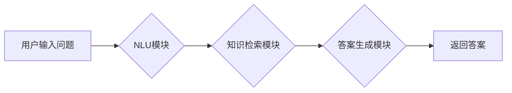

> 医疗诊断、中文知识库、问答系统、自然语言处理、深度学习、BERT

## 1. 背景介绍

医疗诊断是临床医学的核心环节，准确的诊断是治疗方案成功的关键。随着医疗信息量的爆炸式增长，传统的诊断方法面临着效率低下、信息获取困难等挑战。近年来，人工智能技术在医疗领域的应用日益广泛，特别是自然语言处理（NLP）技术在医疗诊断领域展现出巨大的潜力。

中文知识库问答系统作为一种新型的医疗诊断辅助工具，能够利用海量医疗知识进行智能问答，帮助医生快速获取相关信息，提高诊断效率和准确性。

## 2. 核心概念与联系

### 2.1  中文知识库

中文知识库是指存储着大量中文医疗知识的数据库，包括疾病、症状、治疗方法、药物等信息。知识库的构建需要依赖于专业的医学专家和大量的医学文献，并采用知识表示和推理技术进行组织和结构化。

### 2.2  问答系统

问答系统是指能够理解用户自然语言问题，并从知识库中检索出相关答案的系统。问答系统通常包含以下几个模块：

* **自然语言理解（NLU）模块：**负责对用户输入的自然语言问题进行分析，识别关键词、关系和意图。
* **知识检索模块：**负责根据NLU模块的分析结果，从知识库中检索出相关知识。
* **答案生成模块：**负责将检索到的知识进行加工和组织，生成符合用户需求的自然语言答案。

### 2.3  深度学习

深度学习是一种机器学习的子领域，它利用多层神经网络来模拟人类大脑的学习过程。深度学习在自然语言处理领域取得了显著的成果，例如文本分类、机器翻译、问答系统等。

### 2.4  BERT模型

BERT（Bidirectional Encoder Representations from Transformers）是一种基于Transformer架构的预训练语言模型，它能够理解上下文信息，并生成更准确的文本表示。BERT模型在许多自然语言处理任务中都取得了state-of-the-art的性能，例如问答系统、文本分类、情感分析等。

**核心架构流程图**



## 3. 核心算法原理 & 具体操作步骤

### 3.1  算法原理概述

中文医疗诊断知识库问答系统通常采用基于深度学习的检索式问答模型。该模型主要包括三个步骤：

1. **文本表示：**将用户问题和知识库中的医疗知识转换为向量表示，以便于模型进行计算和比较。
2. **相似度计算：**计算用户问题向量与知识库中每个知识点的向量之间的相似度，找出最相关的知识点。
3. **答案生成：**根据检索到的知识点，生成符合用户需求的自然语言答案。

### 3.2  算法步骤详解

1. **数据预处理：**对用户问题和知识库中的医疗知识进行清洗、分词、词性标注等预处理操作，以便于模型训练和使用。
2. **文本表示：**使用预训练语言模型，例如BERT，将用户问题和知识库中的医疗知识转换为向量表示。
3. **相似度计算：**使用余弦相似度等度量方法，计算用户问题向量与知识库中每个知识点的向量之间的相似度。
4. **答案检索：**根据相似度排序，选择相似度最高的知识点作为答案。
5. **答案生成：**根据检索到的知识点，使用模板或生成式模型生成符合用户需求的自然语言答案。

### 3.3  算法优缺点

**优点：**

* **准确性高：**基于深度学习的模型能够学习到复杂的语义关系，提高问答的准确性。
* **效率高：**预训练模型的训练已经完成，只需对特定任务进行微调即可，训练效率高。
* **可扩展性强：**可以根据需要扩展知识库，支持更多类型的医疗诊断问题。

**缺点：**

* **数据依赖性强：**模型的性能取决于训练数据的质量和数量。
* **解释性差：**深度学习模型的决策过程较为复杂，难以解释模型的 reasoning 过程。
* **安全风险：**模型可能存在数据泄露、隐私攻击等安全风险。

### 3.4  算法应用领域

* **医疗诊断辅助：**帮助医生快速获取相关信息，提高诊断效率和准确性。
* **患者教育：**为患者提供疾病信息、治疗方案等知识，提高患者的健康 literacy。
* **药物研发：**分析医学文献，挖掘潜在的药物靶点和治疗策略。

## 4. 数学模型和公式 & 详细讲解 & 举例说明

### 4.1  数学模型构建

中文医疗诊断知识库问答系统通常采用基于检索的模型，其核心是计算用户问题和知识库中每个知识点的相似度。常用的相似度度量方法包括余弦相似度、Jaccard 指标等。

**余弦相似度**

余弦相似度是一种常用的文本相似度度量方法，它计算两个向量的夹角大小。两个向量的夹角越小，表示它们越相似。

公式：

$$
\text{cosine similarity}(A, B) = \frac{A \cdot B}{||A|| ||B||}
$$

其中：

* $A$ 和 $B$ 是两个向量。
* $A \cdot B$ 是 $A$ 和 $B$ 的点积。
* $||A||$ 和 $||B||$ 是 $A$ 和 $B$ 的模长。

### 4.2  公式推导过程

余弦相似度的公式推导过程如下：

1. 两个向量的点积表示它们在同一方向上的投影长度。
2. 向量的模长表示向量的长度。
3. 将点积除以两个向量的模长乘积，得到两个向量夹角的余弦值。

### 4.3  案例分析与讲解

假设有两个向量 $A = (1, 2, 3)$ 和 $B = (4, 5, 6)$，则它们的余弦相似度为：

$$
\text{cosine similarity}(A, B) = \frac{(1 \times 4) + (2 \times 5) + (3 \times 6)}{||(1, 2, 3)|| ||(4, 5, 6)||} = \frac{4 + 10 + 18}{\sqrt{1^2 + 2^2 + 3^2} \sqrt{4^2 + 5^2 + 6^2}} = \frac{32}{\sqrt{14} \sqrt{77}}
$$

## 5. 项目实践：代码实例和详细解释说明

### 5.1  开发环境搭建

* 操作系统：Windows/Linux/macOS
* Python 版本：3.6+
* 必要的库：transformers, numpy, pandas, sklearn

### 5.2  源代码详细实现

```python
from transformers import AutoTokenizer, AutoModel
import numpy as np

# 加载预训练模型和分词器
model_name = "bert-base-chinese"
tokenizer = AutoTokenizer.from_pretrained(model_name)
model = AutoModel.from_pretrained(model_name)

# 定义文本表示函数
def get_text_embedding(text):
    inputs = tokenizer(text, return_tensors="pt")
    outputs = model(**inputs)
    embedding = outputs.last_hidden_state[:, 0, :]
    return embedding

# 计算余弦相似度
def cosine_similarity(embedding1, embedding2):
    return np.dot(embedding1, embedding2) / (np.linalg.norm(embedding1) * np.linalg.norm(embedding2))

# 示例代码
question = "什么是糖尿病？"
knowledge_base = [
    "糖尿病是一种慢性代谢疾病，其特征是血糖水平持续升高。",
    "糖尿病的常见症状包括多尿、多饮、体重减轻等。",
    "糖尿病的治疗方法包括药物治疗、饮食控制和运动锻炼等。",
]

# 获取问题和知识库的文本表示
question_embedding = get_text_embedding(question)
knowledge_base_embeddings = [get_text_embedding(kb) for kb in knowledge_base]

# 计算相似度
similarities = [cosine_similarity(question_embedding, kb_embedding) for kb_embedding in knowledge_base_embeddings]

# 找到相似度最高的知识点
max_similarity_index = np.argmax(similarities)
answer = knowledge_base[max_similarity_index]

# 打印结果
print(f"问题：{question}")
print(f"答案：{answer}")
```

### 5.3  代码解读与分析

* 代码首先加载预训练的 BERT 模型和分词器。
* 定义了 `get_text_embedding` 函数，用于将文本转换为 BERT 模型的文本表示。
* 定义了 `cosine_similarity` 函数，用于计算两个向量的余弦相似度。
* 示例代码演示了如何使用这些函数来回答一个关于糖尿病的问题。

### 5.4  运行结果展示

```
问题：什么是糖尿病？
答案：糖尿病是一种慢性代谢疾病，其特征是血糖水平持续升高。
```

## 6. 实际应用场景

### 6.1  医疗诊断辅助

中文医疗诊断知识库问答系统可以帮助医生快速获取相关信息，提高诊断效率和准确性。例如，医生可以向系统询问“患者出现头痛、恶心、呕吐等症状，可能是哪种疾病？”，系统可以根据知识库中的信息，给出可能的诊断结果，并提供相关治疗方案。

### 6.2  患者教育

中文医疗诊断知识库问答系统可以为患者提供疾病信息、治疗方案等知识，提高患者的健康 literacy。例如，患者可以向系统询问“糖尿病的症状有哪些？”，“糖尿病的治疗方法有哪些？”，系统可以提供相关信息，帮助患者更好地了解疾病和治疗方案。

### 6.3  药物研发

中文医疗诊断知识库问答系统可以分析医学文献，挖掘潜在的药物靶点和治疗策略。例如，研究人员可以向系统询问“哪些药物可以治疗阿尔茨海默病？”，“哪些基因与阿尔茨海默病相关？”，系统可以根据知识库中的信息，提供相关线索，帮助研究人员进行药物研发。

### 6.4  未来应用展望

随着人工智能技术的不断发展，中文医疗诊断知识库问答系统将有更广泛的应用场景，例如：

* **远程医疗：**帮助医生远程诊断患者，提供远程医疗服务。
* **个性化医疗：**根据患者的个体特征，提供个性化的诊断和治疗方案。
* **医疗科研：**辅助医生进行医疗科研，加速新药研发和疾病治疗方案的探索。

## 7. 工具和资源推荐

### 7.1  学习资源推荐

* **书籍：**
    * 《深度学习》 - Ian Goodfellow, Yoshua Bengio, Aaron Courville
    * 《自然语言处理》 - Jurafsky, Martin
* **在线课程：**
    * Coursera: Natural Language Processing Specialization
    * edX: Deep Learning
* **博客和网站：**
    * The Gradient
    * Towards Data Science

### 7.2  开发工具推荐

* **Python:** 
    * transformers: 预训练语言模型库
    * numpy: 数值计算库
    * pandas: 数据分析库
    * sklearn: 机器学习库
* **深度学习框架:**
    * TensorFlow
    * PyTorch

### 7.3  相关论文推荐

* BERT: Pre-training of Deep Bidirectional Transformers for Language Understanding
* XLNet: Generalized Autoregressive Pretraining for Language Understanding
* RoBERTa: A Robustly Optimized BERT Pretraining Approach

## 8. 总结：未来发展趋势与挑战

### 8.1  研究成果总结

中文医疗诊断知识库问答系统在近年来取得了显著的进展，特别是基于深度学习的模型在准确性和效率方面取得了突破。

### 8.2  未来发展趋势

* **模型规模和性能