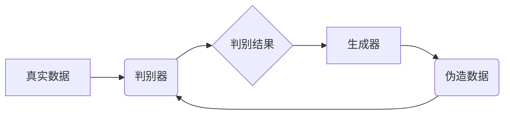

> 对抗学习，生成对抗网络，GAN，生成模型，判别模型，训练策略，代码实例，实践应用

## 1. 背景介绍

在深度学习领域，生成对抗网络（Generative Adversarial Networks，GAN）作为一种强大的生成模型，近年来取得了令人瞩目的成就。它能够生成逼真、高质量的图像、文本、音频等数据，在图像编辑、数据增强、艺术创作等领域展现出巨大的潜力。

传统的生成模型通常依赖于概率分布的建模，而GAN则采用了一种全新的训练策略，通过两个相互竞争的网络——生成器和判别器，实现数据的生成。生成器试图生成逼真的数据样本，而判别器则试图区分真实数据和生成数据。这种对抗性的训练机制使得GAN能够学习到数据的复杂分布，并生成更逼真的样本。

## 2. 核心概念与联系

GAN的核心概念是两个相互竞争的网络：

* **生成器 (Generator):** 负责生成新的数据样本，例如图像、文本等。
* **判别器 (Discriminator):** 负责判断数据样本是真实数据还是生成数据。

这两个网络在训练过程中相互对抗，生成器试图生成更逼真的数据样本以欺骗判别器，而判别器则试图提高识别生成数据的准确率。这种对抗性的训练机制使得GAN能够不断提升生成数据的质量。

**Mermaid 流程图:**



## 3. 核心算法原理 & 具体操作步骤

### 3.1  算法原理概述

GAN的训练过程可以概括为以下步骤：

1. **初始化生成器和判别器网络参数。**
2. **从真实数据集中随机采样数据，输入到判别器中，并获取判别结果。**
3. **生成器从随机噪声中生成数据样本，输入到判别器中，并获取判别结果。**
4. **根据判别器的输出结果，更新生成器和判别器的参数。**
5. **重复步骤2-4，直到生成器能够生成逼真的数据样本。**

### 3.2  算法步骤详解

1. **数据采样:** 从真实数据集中随机采样数据，作为判别器的训练数据。
2. **判别器训练:** 将真实数据和生成器生成的伪造数据输入到判别器中，并根据判别结果更新判别器的参数。
3. **生成器训练:** 将随机噪声输入到生成器中，生成数据样本，并将这些样本输入到判别器中。根据判别器的输出结果，更新生成器的参数。

### 3.3  算法优缺点

**优点:**

* **生成逼真数据:** GAN能够学习到数据的复杂分布，生成逼真的数据样本。
* **无监督学习:** GAN可以利用未标记的数据进行训练。
* **应用广泛:** GAN在图像生成、文本生成、音频生成等领域都有广泛的应用。

**缺点:**

* **训练困难:** GAN的训练过程比较复杂，容易出现模式崩溃等问题。
* **评价指标不完善:** 对生成数据的评价指标尚不完善。
* **生成样本多样性不足:** 一些GAN模型生成的样本多样性不足。

### 3.4  算法应用领域

* **图像生成:** 生成逼真的图像，例如人脸、风景、物体等。
* **文本生成:** 生成自然语言文本，例如文章、故事、对话等。
* **音频生成:** 生成逼真的音频，例如音乐、语音、音效等。
* **数据增强:** 生成新的数据样本，用于训练其他机器学习模型。
* **艺术创作:** 生成艺术作品，例如绘画、雕塑、音乐等。

## 4. 数学模型和公式 & 详细讲解 & 举例说明

### 4.1  数学模型构建

GAN的数学模型主要由两个部分组成：生成器 (G) 和判别器 (D)。

* **生成器 (G):** 接收随机噪声向量 z 作为输入，输出生成的数据样本 x。

* **判别器 (D):** 接收数据样本 x 作为输入，输出判断该样本是真实数据还是生成数据的概率。

### 4.2  公式推导过程

GAN的训练目标是使生成器能够生成逼真的数据样本，以欺骗判别器。为此，我们定义两个损失函数：

* **判别器损失函数 (D_loss):** 判别器试图区分真实数据和生成数据，其损失函数定义为：

$$D_{loss} = - \frac{1}{m} \sum_{i=1}^{m} \log(D(x_i)) - \frac{1}{m} \sum_{i=1}^{m} \log(1 - D(G(z_i)))$$

其中，$x_i$ 是真实数据样本，$z_i$ 是随机噪声向量，$m$ 是样本数量。

* **生成器损失函数 (G_loss):** 生成器试图生成逼真的数据样本，以欺骗判别器，其损失函数定义为：

$$G_{loss} = - \frac{1}{m} \sum_{i=1}^{m} \log(D(G(z_i)))$$

### 4.3  案例分析与讲解

假设我们使用GAN生成人脸图像。

* **真实数据:** 从互联网上收集大量的人脸图像。
* **生成器:** 使用卷积神经网络 (CNN) 作为生成器，学习人脸图像的特征。
* **判别器:** 使用CNN作为判别器，学习区分真实人脸图像和生成人脸图像的特征。

通过训练GAN模型，生成器能够学习到人脸图像的复杂特征，并生成逼真的人脸图像。

## 5. 项目实践：代码实例和详细解释说明

### 5.1  开发环境搭建

* **操作系统:** Ubuntu 18.04
* **Python版本:** 3.7
* **深度学习框架:** TensorFlow 2.0

### 5.2  源代码详细实现

```python
import tensorflow as tf

# 定义生成器网络
def generator(z):
    # ...

# 定义判别器网络
def discriminator(x):
    # ...

# 定义损失函数和优化器
optimizer_G = tf.keras.optimizers.Adam(learning_rate=0.0002, beta_1=0.5)
optimizer_D = tf.keras.optimizers.Adam(learning_rate=0.0002, beta_1=0.5)
loss_fn = tf.keras.losses.BinaryCrossentropy()

# 定义训练循环
def train_step(real_images, z):
    # ...

# 训练模型
for epoch in range(num_epochs):
    for batch in range(num_batches):
        # ...

```

### 5.3  代码解读与分析

* **生成器网络:** 使用多层卷积神经网络 (CNN) 作为生成器，学习人脸图像的特征。
* **判别器网络:** 使用多层卷积神经网络 (CNN) 作为判别器，学习区分真实人脸图像和生成人脸图像的特征。
* **损失函数:** 使用二元交叉熵损失函数 (BinaryCrossentropy) 作为损失函数，训练判别器和生成器。
* **优化器:** 使用Adam优化器 (Adam) 优化模型参数。

### 5.4  运行结果展示

训练完成后，生成器能够生成逼真的人脸图像。

## 6. 实际应用场景

* **图像编辑:** 使用GAN生成新的图像内容，例如添加背景、修改人物表情等。
* **数据增强:** 使用GAN生成新的数据样本，用于训练其他机器学习模型，例如图像分类、目标检测等。
* **艺术创作:** 使用GAN生成艺术作品，例如绘画、音乐、雕塑等。

### 6.4  未来应用展望

* **医疗领域:** 使用GAN生成医学图像，辅助医生诊断疾病。
* **金融领域:** 使用GAN检测金融欺诈，识别风险。
* **教育领域:** 使用GAN生成个性化学习内容，提高学习效率。

## 7. 工具和资源推荐

### 7.1  学习资源推荐

* **书籍:**
    * 《Generative Deep Learning》 by David Foster
    * 《Deep Learning》 by Ian Goodfellow, Yoshua Bengio, and Aaron Courville
* **在线课程:**
    * Coursera: Deep Learning Specialization
    * Udacity: Deep Learning Nanodegree

### 7.2  开发工具推荐

* **TensorFlow:** https://www.tensorflow.org/
* **PyTorch:** https://pytorch.org/
* **Keras:** https://keras.io/

### 7.3  相关论文推荐

* **Generative Adversarial Networks** by Ian Goodfellow et al. (2014)
* **Improved Techniques for Training GANs** by Alec Radford et al. (2015)
* **Wasserstein GAN** by Martin Arjovsky et al. (2017)

## 8. 总结：未来发展趋势与挑战

### 8.1  研究成果总结

GAN在图像生成、文本生成、音频生成等领域取得了显著的成果，展现出强大的生成能力。

### 8.2  未来发展趋势

* **模型架构创新:** 研究更有效的GAN模型架构，提高生成质量和效率。
* **训练策略优化:** 探索新的训练策略，解决GAN训练的困难问题。
* **应用领域拓展:** 将GAN应用于更多领域，例如医疗、金融、教育等。

### 8.3  面临的挑战

* **模式崩溃:** GAN训练过程中容易出现模式崩溃问题，导致生成样本质量下降。
* **评价指标不完善:** 对生成数据的评价指标尚不完善，难以准确评估GAN的性能。
* **伦理问题:** GAN能够生成逼真的数据样本，可能被用于生成虚假信息，引发伦理问题。

### 8.4  研究展望

未来，GAN的研究将继续深入，探索更有效的模型架构、训练策略和应用场景，并解决其面临的挑战，推动人工智能技术的发展。

## 9. 附录：常见问题与解答

* **Q: GAN训练过程为什么容易出现模式崩溃问题？**

* **A:** 模式崩溃问题是由于生成器和判别器之间的博弈失衡造成的。生成器过于专注于生成满足判别器要求的样本，而忽略了数据分布的完整性，导致生成样本缺乏多样性。

* **Q: 如何评价GAN生成的样本质量？**

* **A:** 目前常用的评价指标包括Inception Score (IS)、Fréchet Inception Distance (FID)等。

* **Q: GAN的应用有哪些伦理问题？**

* **A:** GAN能够生成逼真的虚假信息，可能被用于制造假新闻、深度伪造等，引发社会问题。


作者：禅与计算机程序设计艺术 / Zen and the Art of Computer Programming 
<end_of_turn>