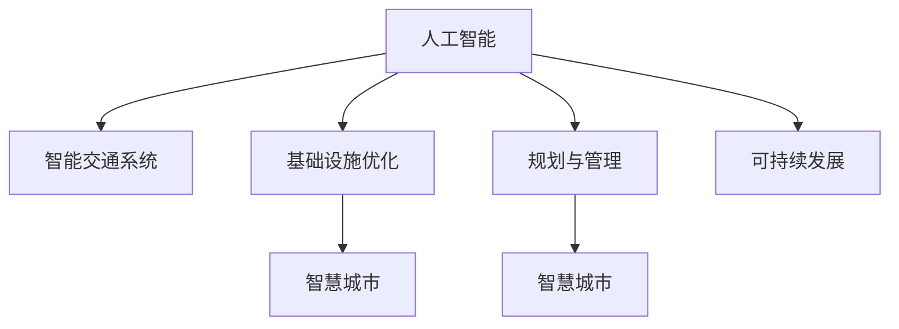

                 

# AI与人类计算：打造可持续发展的城市交通与基础设施建设与规划建设与管理建设

> 关键词：
    - 人工智能(AI)
    - 城市交通
    - 基础设施建设
    - 规划与管理
    - 智能城市
    - 物联网(IoT)
    - 机器学习
    - 数据分析
    - 可持续发展

## 1. 背景介绍

### 1.1 问题由来

在现代社会，城市交通与基础设施建设与管理建设是每一个城市发展的重要基石。随着城市人口的增长和经济的快速发展，城市交通面临着交通拥堵、环境污染、能源消耗等问题。这些问题不仅影响居民的生活质量，也给城市的可持续发展带来了巨大挑战。

人工智能(AI)作为一项前沿技术，其在城市交通与基础设施建设与管理中的应用，提供了一种全新的解决方案。AI不仅能够提升交通系统的智能化水平，还能优化基础设施的规划与管理，推动城市的可持续发展。因此，AI与人类计算的结合，是打造智能城市、实现可持续发展的重要途径。

### 1.2 问题核心关键点

AI与人类计算在城市交通与基础设施建设与管理建设中的应用，主要集中在以下几个方面：

1. **智能交通系统**：通过AI技术，实现对交通流的实时监测、分析和预测，优化交通信号灯控制，减少交通拥堵，提升道路通行效率。
2. **基础设施优化**：利用AI进行基础设施的智能化监测与维护，提升道路、桥梁、隧道等基础设施的使用寿命，减少维护成本。
3. **规划与管理**：通过AI对大数据的深度分析，优化城市规划，提高管理效率，实现资源的合理分配和利用。

## 2. 核心概念与联系

### 2.1 核心概念概述

为更好地理解AI与人类计算在城市交通与基础设施建设与管理建设中的应用，本节将介绍几个密切相关的核心概念：

- **人工智能(AI)**：通过模拟、扩展人类的智能活动，使机器具有感知、学习、推理等能力，以实现特定任务的技术。AI涵盖的领域包括机器学习、深度学习、自然语言处理等。
- **城市交通系统**：指包括道路、桥梁、隧道、公共交通、自行车道等在内的交通设施及其运营管理系统。
- **基础设施建设**：指城市建设中的各种基础性设施，如道路、桥梁、供水供电、通信网络等。
- **城市规划与管理**：指对城市发展进行科学规划，以及通过管理手段实现城市资源的优化配置和合理利用。
- **智能城市**：基于物联网(IoT)、大数据、云计算等技术，构建的智慧化、可持续发展的城市。
- **可持续发展**：在满足当代人的需求的同时，不损害后代人满足其需求能力的发展模式。

这些核心概念之间的逻辑关系可以通过以下Mermaid流程图来展示：



这个流程图展示了一些核心概念及其之间的关系：

1. AI技术为智能交通系统、基础设施优化、规划与管理提供了技术支持。
2. 智能交通系统、基础设施优化、规划与管理构成了智慧城市的核心组成部分。
3. 智慧城市的目标是实现可持续发展。

## 3. 核心算法原理 & 具体操作步骤

### 3.1 算法原理概述

AI与人类计算在城市交通与基础设施建设与管理建设中的应用，主要基于机器学习、深度学习等AI技术，通过对数据的深度分析，实现对城市交通与基础设施的智能化管理。

以智能交通系统为例，其核心算法原理包括：

1. **数据采集与处理**：通过传感器、摄像头等设备，收集交通流量、道路状况、气象信息等数据。
2. **数据建模与预测**：利用机器学习模型对交通数据进行建模，预测未来交通流量变化，优化交通信号控制。
3. **决策与控制**：根据预测结果，实时调整交通信号灯，缓解交通拥堵。

### 3.2 算法步骤详解

AI与人类计算在城市交通与基础设施建设与管理建设中的应用，一般包括以下几个关键步骤：

**Step 1: 数据采集与预处理**

- 选择合适的传感器和摄像头，收集交通流量、道路状况、气象信息等数据。
- 对原始数据进行清洗和预处理，包括数据去噪、缺失值处理、标准化等。

**Step 2: 数据建模与训练**

- 根据实际需求选择合适的机器学习模型，如线性回归、随机森林、深度学习等。
- 对模型进行训练，使用历史数据进行参数优化。
- 利用交叉验证等技术评估模型的性能。

**Step 3: 模型部署与优化**

- 将训练好的模型部署到交通管理系统，实时处理交通数据。
- 根据实际情况调整模型参数，优化模型性能。

**Step 4: 效果评估与反馈**

- 对模型效果进行评估，如交通流量预测准确率、道路通行效率等。
- 收集反馈数据，进一步优化模型。

### 3.3 算法优缺点

AI与人类计算在城市交通与基础设施建设与管理建设中的应用，具有以下优点：

1. **提升交通效率**：通过实时数据分析和预测，优化交通信号控制，减少交通拥堵，提升道路通行效率。
2. **降低维护成本**：利用AI进行基础设施的智能化监测与维护，及时发现并修复问题，减少维护成本。
3. **优化资源利用**：通过数据分析，优化城市规划与管理，提高资源的利用效率。

同时，该方法也存在一定的局限性：

1. **数据依赖**：AI的应用依赖于高质量的数据，数据的缺失、噪声等问题可能影响模型性能。
2. **计算资源需求高**：AI模型训练和部署需要较高的计算资源，可能对硬件设施提出较高的要求。
3. **模型泛化能力有限**：AI模型在特定环境下的效果可能受到限制，模型泛化能力需要进一步提升。

尽管存在这些局限性，但就目前而言，AI与人类计算在城市交通与基础设施建设与管理建设中的应用，仍是提升城市智能化水平的重要手段。未来相关研究的重点在于如何进一步降低AI对数据的依赖，提高模型的泛化能力，同时兼顾计算效率和成本因素。

### 3.4 算法应用领域

AI与人类计算在城市交通与基础设施建设与管理建设中的应用，涵盖了多个领域：

- **智能交通系统**：如交通流量预测、交通信号控制、自动驾驶等。
- **基础设施优化**：如道路养护、桥梁健康监测、供水供电系统优化等。
- **规划与管理**：如城市土地利用规划、能源消耗优化、智能停车管理等。

这些应用领域都直接关系到城市的发展和居民的生活质量，AI与人类计算的结合，有望为城市建设与管理带来革命性的变化。

## 4. 数学模型和公式 & 详细讲解 & 举例说明

### 4.1 数学模型构建

在本节中，我们将以交通流量预测为例，介绍AI在城市交通中的应用数学模型构建。

记交通流量为 $y$，影响因素包括历史交通数据 $x_1, x_2, ..., x_n$，气象数据 $z_1, z_2, ..., z_m$，道路状况 $w_1, w_2, ..., w_k$。假设交通流量 $y$ 可以表示为这些因素的线性组合，数学模型如下：

$$
y = \alpha x_1 + \beta x_2 + \gamma x_3 + ... + \delta w_1 + \epsilon
$$

其中 $\alpha, \beta, \gamma, ...$ 为模型参数，$\epsilon$ 为随机误差。

### 4.2 公式推导过程

为了预测未来交通流量，我们需要将历史交通数据 $x_1, x_2, ..., x_n$ 和气象数据 $z_1, z_2, ..., z_m$ 代入模型，求解参数 $\alpha, \beta, \gamma, ...$，得到未来交通流量的预测值。

首先，我们将数据进行标准化处理：

$$
x_i' = \frac{x_i - \mu_i}{\sigma_i}, z_i' = \frac{z_i - \mu_z}{\sigma_z}
$$

其中 $\mu_i$ 和 $\sigma_i$ 分别为 $x_i$ 和 $z_i$ 的均值和标准差。

然后，利用最小二乘法求解模型参数 $\alpha, \beta, \gamma, ...$：

$$
\begin{align*}
\min_{\alpha, \beta, \gamma, ...} & \frac{1}{N} \sum_{i=1}^N (y_i - \alpha x_i' - \beta x_j' - \gamma x_k' - ...)^2 \\
\text{s.t.} & \quad \frac{1}{N} \sum_{i=1}^N x_i'^2 = 1, \frac{1}{M} \sum_{j=1}^M z_j'^2 = 1
\end{align*}
$$

通过求解上述优化问题，可以得到最优参数 $\alpha, \beta, \gamma, ...$，进而得到未来交通流量的预测值。

### 4.3 案例分析与讲解

假设我们有一个城市的交通流量数据，以及历史天气数据和道路状况数据，我们希望预测未来一小时的交通流量。

1. **数据准备**：收集历史交通流量数据、气象数据和道路状况数据，进行标准化处理。
2. **模型构建**：构建上述的线性模型，并选择合适的损失函数和优化器。
3. **模型训练**：使用历史数据对模型进行训练，调整参数以最小化预测误差。
4. **模型评估**：利用测试数据评估模型性能，如均方误差(MSE)等。
5. **模型应用**：将训练好的模型部署到交通管理系统，实时预测未来交通流量。

## 5. 项目实践：代码实例和详细解释说明

### 5.1 开发环境搭建

在进行AI与人类计算在城市交通与基础设施建设与管理建设中的应用开发前，我们需要准备好开发环境。以下是使用Python进行TensorFlow开发的环境配置流程：

1. 安装Anaconda：从官网下载并安装Anaconda，用于创建独立的Python环境。

2. 创建并激活虚拟环境：
```bash
conda create -n ai-env python=3.8 
conda activate ai-env
```

3. 安装TensorFlow：根据CUDA版本，从官网获取对应的安装命令。例如：
```bash
conda install tensorflow -c tensorflow -c conda-forge
```

4. 安装必要的工具包：
```bash
pip install pandas numpy scikit-learn matplotlib
```

完成上述步骤后，即可在`ai-env`环境中开始AI与人类计算的开发实践。

### 5.2 源代码详细实现

下面我们以交通流量预测为例，给出使用TensorFlow进行预测的PyTorch代码实现。

首先，定义模型的输入和输出：

```python
import tensorflow as tf

# 定义输入和输出维度
input_dim = 10
output_dim = 1

# 定义输入和输出占位符
inputs = tf.placeholder(tf.float32, shape=[None, input_dim])
targets = tf.placeholder(tf.float32, shape=[None, output_dim])
```

然后，定义模型结构：

```python
# 定义模型参数
W = tf.Variable(tf.random_normal([input_dim, output_dim]))
b = tf.Variable(tf.random_normal([output_dim]))

# 定义模型计算过程
prediction = tf.matmul(inputs, W) + b
```

接着，定义损失函数和优化器：

```python
# 定义损失函数（均方误差）
loss = tf.reduce_mean(tf.square(prediction - targets))

# 定义优化器（Adam）
optimizer = tf.train.AdamOptimizer(learning_rate=0.001).minimize(loss)
```

最后，定义训练过程：

```python
# 定义训练参数
epochs = 100
batch_size = 32

# 定义训练数据
# 假设训练数据为x_train和y_train，其中x_train为输入数据，y_train为输出数据

# 定义训练过程
with tf.Session() as sess:
    sess.run(tf.global_variables_initializer())
    for epoch in range(epochs):
        epoch_loss = 0
        for i in range(0, len(x_train), batch_size):
            batch_x = x_train[i:i+batch_size]
            batch_y = y_train[i:i+batch_size]
            _, batch_loss = sess.run([optimizer, loss], feed_dict={inputs: batch_x, targets: batch_y})
            epoch_loss += batch_loss
        print("Epoch {}, Loss: {:.4f}".format(epoch+1, epoch_loss))
```

以上就是使用TensorFlow进行交通流量预测的完整代码实现。可以看到，通过TensorFlow的强大API，我们可以用相对简洁的代码完成模型的构建和训练。

### 5.3 代码解读与分析

让我们再详细解读一下关键代码的实现细节：

**模型的定义**：
- `inputs`和`targets`：定义输入和输出的占位符，用于喂入数据和输出结果。
- `W`和`b`：定义模型参数，表示线性模型的权重和偏置。
- `prediction`：计算模型的预测输出，即`inputs`经过`W`和`b`的线性变换。

**损失函数的定义**：
- `loss`：计算均方误差损失，即预测值与真实值之间的差距。

**优化器的定义**：
- `optimizer`：定义优化器，使用Adam算法最小化损失函数。

**训练过程的实现**：
- `epochs`和`batch_size`：定义训练的轮数和批次大小。
- 通过`for`循环遍历每个epoch，每个epoch内通过`for`循环遍历每个batch，计算损失并更新模型参数。

可以看到，TensorFlow的API使得模型的构建和训练变得简单易懂，开发者可以将更多精力放在模型优化和应用场景的设计上，而不必过多关注底层的实现细节。

当然，工业级的系统实现还需考虑更多因素，如模型的保存和部署、超参数的自动搜索、更灵活的任务适配层等。但核心的预测过程基本与此类似。

## 6. 实际应用场景

### 6.1 智能交通系统

AI与人类计算在智能交通系统中的应用，可以大幅度提升交通系统的智能化水平，优化交通管理，提升交通效率。

1. **交通流量预测**：通过AI模型对历史交通数据进行训练，预测未来交通流量变化，优化交通信号控制，缓解交通拥堵。
2. **自动驾驶**：利用AI技术实现车辆的自动驾驶，提高道路通行效率，减少交通事故。
3. **智能停车管理**：通过AI模型分析实时停车数据，预测停车需求，优化停车位分配，减少停车拥堵。

### 6.2 基础设施优化

AI与人类计算在基础设施优化中的应用，可以显著提升基础设施的使用效率，降低维护成本。

1. **道路养护**：通过AI模型对道路使用数据进行分析，预测道路磨损情况，优化养护计划，延长道路使用寿命。
2. **桥梁健康监测**：利用AI技术对桥梁结构进行实时监测，预测潜在故障，及时进行维护。
3. **供水供电系统优化**：通过AI模型对供水供电数据进行分析，预测能源需求，优化资源分配，降低能耗。

### 6.3 规划与管理

AI与人类计算在规划与管理中的应用，可以优化城市资源的配置和利用，提升管理效率。

1. **土地利用规划**：通过AI模型对城市土地数据进行分析，优化土地利用规划，提高土地利用率。
2. **能源消耗优化**：利用AI技术对能源消耗数据进行分析，预测能源需求，优化能源分配，降低能源消耗。
3. **智能停车管理**：通过AI模型对停车数据进行分析，预测停车需求，优化停车位分配，减少停车拥堵。

### 6.4 未来应用展望

随着AI与人类计算的不断发展，其在城市交通与基础设施建设与管理建设中的应用前景将更加广阔。

1. **智慧城市建设**：AI与人类计算的应用将推动智慧城市的建设，实现城市交通、基础设施、公共服务的智能化管理。
2. **数据驱动决策**：通过AI技术对城市数据进行深度分析，实现数据驱动的决策，提升城市管理效率。
3. **可持续发展**：AI与人类计算的应用将促进城市的可持续发展，推动绿色交通、能源高效利用等环保项目。

## 7. 工具和资源推荐

### 7.1 学习资源推荐

为了帮助开发者系统掌握AI与人类计算在城市交通与基础设施建设与管理建设中的应用理论基础和实践技巧，这里推荐一些优质的学习资源：

1. **《深度学习》系列书籍**：深度学习领域的经典教材，涵盖机器学习、深度学习、自然语言处理等前沿技术。
2. **Google TensorFlow官方文档**：TensorFlow的官方文档，提供了丰富的API和教程，是深度学习开发者的必备资料。
3. **Coursera《深度学习》课程**：由斯坦福大学教授Andrew Ng主讲的深度学习课程，涵盖深度学习的基本概念和算法。
4. **Kaggle数据竞赛**：Kaggle提供了大量的数据集和比赛，通过参与数据竞赛，可以积累实战经验，提升解决问题的能力。
5. **Arxiv论文预印本**：Arxiv提供了大量前沿研究成果的预印本，是了解最新技术进展的重要来源。

通过对这些资源的学习实践，相信你一定能够快速掌握AI与人类计算在城市交通与基础设施建设与管理建设中的应用精髓，并用于解决实际的NLP问题。

### 7.2 开发工具推荐

高效的开发离不开优秀的工具支持。以下是几款用于AI与人类计算在城市交通与基础设施建设与管理建设中的应用开发的常用工具：

1. **TensorFlow**：由Google主导开发的开源深度学习框架，生产部署方便，适合大规模工程应用。
2. **PyTorch**：基于Python的开源深度学习框架，灵活动态的计算图，适合快速迭代研究。
3. **Scikit-learn**：机器学习领域的常用工具包，提供了丰富的机器学习算法和数据处理工具。
4. **Jupyter Notebook**：交互式的编程环境，方便开发者进行代码编写和数据可视化。
5. **Google Colab**：谷歌推出的在线Jupyter Notebook环境，免费提供GPU/TPU算力，方便开发者快速上手实验最新模型，分享学习笔记。

合理利用这些工具，可以显著提升AI与人类计算在城市交通与基础设施建设与管理建设中的应用开发效率，加快创新迭代的步伐。

### 7.3 相关论文推荐

AI与人类计算在城市交通与基础设施建设与管理建设中的应用，源于学界的持续研究。以下是几篇奠基性的相关论文，推荐阅读：

1. **《智能交通系统中的深度学习应用》**：介绍了深度学习在交通流量预测、自动驾驶等智能交通系统中的应用。
2. **《基于机器学习的基础设施优化》**：利用机器学习对基础设施数据进行分析，预测维护需求，优化资源配置。
3. **《智慧城市中的数据驱动决策》**：探讨了AI技术在智慧城市建设中的重要作用，推动数据驱动的决策和城市管理。
4. **《可持续发展的智能城市》**：分析了AI技术在推动绿色交通、能源高效利用等环保项目中的作用。

这些论文代表了大语言模型微调技术的发展脉络。通过学习这些前沿成果，可以帮助研究者把握学科前进方向，激发更多的创新灵感。

## 8. 总结：未来发展趋势与挑战

### 8.1 总结

本文对AI与人类计算在城市交通与基础设施建设与管理建设中的应用进行了全面系统的介绍。首先阐述了AI与人类计算在城市交通与基础设施建设与管理建设中的研究背景和意义，明确了AI与人类计算在提升城市交通与基础设施管理智能化水平中的独特价值。其次，从原理到实践，详细讲解了AI与人类计算在城市交通与基础设施建设与管理建设中的数学原理和关键步骤，给出了AI与人类计算在城市交通与基础设施建设与管理建设中的应用代码实例。同时，本文还广泛探讨了AI与人类计算在智能交通、基础设施优化、规划与管理等多个领域的应用前景，展示了AI与人类计算的巨大潜力。此外，本文精选了AI与人类计算在城市交通与基础设施建设与管理建设中的应用学习资源，力求为读者提供全方位的技术指引。

通过本文的系统梳理，可以看到，AI与人类计算在城市交通与基础设施建设与管理建设中的应用，正在成为推动城市智能化发展的重要手段。AI与人类计算的结合，为城市交通与基础设施建设与管理建设带来了革命性的变革，极大地提升了城市管理的智能化水平，推动了城市的可持续发展。未来，伴随AI与人类计算技术的不断发展，其在城市交通与基础设施建设与管理建设中的应用前景将更加广阔。

### 8.2 未来发展趋势

展望未来，AI与人类计算在城市交通与基础设施建设与管理建设中的应用将呈现以下几个发展趋势：

1. **智能化程度提升**：随着AI技术的不断发展，智能交通系统和基础设施管理的智能化程度将进一步提升，实现更高效的交通管理和服务。
2. **数据融合与分析**：通过AI技术对多源异构数据进行深度融合与分析，提升决策的科学性和准确性。
3. **实时性提升**：利用AI技术对实时数据进行实时处理和分析，实现交通流量的实时预测和优化。
4. **跨领域融合**：AI与人类计算的应用将与物联网(IoT)、大数据、云计算等技术进一步融合，实现更全面的城市智能化管理。

以上趋势凸显了AI与人类计算在城市交通与基础设施建设与管理建设中的广阔前景。这些方向的探索发展，必将进一步提升城市交通与基础设施管理的智能化水平，为城市的可持续发展注入新的动力。

### 8.3 面临的挑战

尽管AI与人类计算在城市交通与基础设施建设与管理建设中的应用已经取得了一定的成果，但在迈向更加智能化、普适化应用的过程中，它仍面临着诸多挑战：

1. **数据质量与完整性**：数据质量不高、数据缺失等问题可能影响AI模型的性能，需要进一步提升数据收集和处理的精度。
2. **模型复杂性与资源消耗**：AI模型的复杂性和资源消耗可能对硬件设施提出更高的要求，需要进一步优化模型结构和算法。
3. **模型泛化能力**：AI模型在特定环境下的效果可能受到限制，需要进一步提升模型的泛化能力。
4. **隐私与安全**：在数据收集和应用过程中，需要确保数据的隐私和安全，防止数据泄露和滥用。
5. **伦理与法律**：AI技术的应用需要遵循伦理和法律规定，确保技术的公正、透明和可解释。

正视AI与人类计算在城市交通与基础设施建设与管理建设中面临的这些挑战，积极应对并寻求突破，将是大语言模型微调技术迈向成熟的必由之路。相信随着学界和产业界的共同努力，这些挑战终将一一被克服，AI与人类计算在城市交通与基础设施建设与管理建设中的应用必将在构建人机协同的智能城市中扮演越来越重要的角色。

### 8.4 研究展望

面对AI与人类计算在城市交通与基础设施建设与管理建设中面临的种种挑战，未来的研究需要在以下几个方面寻求新的突破：

1. **提升数据质量与完整性**：通过优化数据采集和处理流程，提升数据的精度和完整性，确保AI模型的性能。
2. **优化模型结构与算法**：开发更加高效、轻量级的AI模型，减少计算资源消耗，提升实时性。
3. **增强模型泛化能力**：利用更多的先验知识，如知识图谱、逻辑规则等，增强模型的泛化能力。
4. **强化隐私与安全保护**：在数据收集和应用过程中，确保数据的隐私和安全，防止数据泄露和滥用。
5. **推动伦理与法律研究**：在AI技术的应用中，遵循伦理和法律规定，确保技术的公正、透明和可解释。

这些研究方向的探索，必将引领AI与人类计算在城市交通与基础设施建设与管理建设中的应用走向更高的台阶，为构建安全、可靠、可解释、可控的智能城市铺平道路。面向未来，AI与人类计算在城市交通与基础设施建设与管理建设中的应用还需要与其他人工智能技术进行更深入的融合，如知识表示、因果推理、强化学习等，多路径协同发力，共同推动自然语言理解和智能交互系统的进步。只有勇于创新、敢于突破，才能不断拓展语言模型的边界，让智能技术更好地造福人类社会。

## 9. 附录：常见问题与解答

**Q1：AI与人类计算在城市交通与基础设施建设与管理建设中的应用是否适用于所有城市？**

A: AI与人类计算在城市交通与基础设施建设与管理建设中的应用，并不一定适用于所有城市。其效果和适用性取决于城市的规模、经济水平、交通状况等因素。对于资源有限的中小城市，可能需要根据实际情况调整模型和算法。

**Q2：AI与人类计算在城市交通与基础设施建设与管理建设中的应用是否需要大量的数据支持？**

A: AI与人类计算在城市交通与基础设施建设与管理建设中的应用，确实需要大量的数据支持。数据的质量和完整性对模型的性能至关重要。因此，在数据采集和处理过程中，需要确保数据的精度和完整性。

**Q3：AI与人类计算在城市交通与基础设施建设与管理建设中的应用是否需要高昂的计算资源？**

A: 确实，AI与人类计算在城市交通与基础设施建设与管理建设中的应用，通常需要较高的计算资源。但随着硬件设施的发展，如GPU、TPU等高性能设备的应用，可以显著降低计算资源的消耗。同时，通过优化算法和模型结构，也可以进一步提升计算效率。

**Q4：AI与人类计算在城市交通与基础设施建设与管理建设中的应用是否存在安全风险？**

A: 确实，AI与人类计算在城市交通与基础设施建设与管理建设中的应用，存在数据隐私和安全问题。在数据采集和应用过程中，需要确保数据的隐私和安全，防止数据泄露和滥用。可以通过数据加密、访问控制等手段来保障数据安全。

**Q5：AI与人类计算在城市交通与基础设施建设与管理建设中的应用是否需要考虑伦理和法律问题？**

A: 确实，AI与人类计算在城市交通与基础设施建设与管理建设中的应用，需要考虑伦理和法律问题。在AI技术的应用中，需要遵循伦理和法律规定，确保技术的公正、透明和可解释。同时，需要建立模型行为的监管机制，确保输出符合人类价值观和伦理道德。

---

作者：禅与计算机程序设计艺术 / Zen and the Art of Computer Programming

