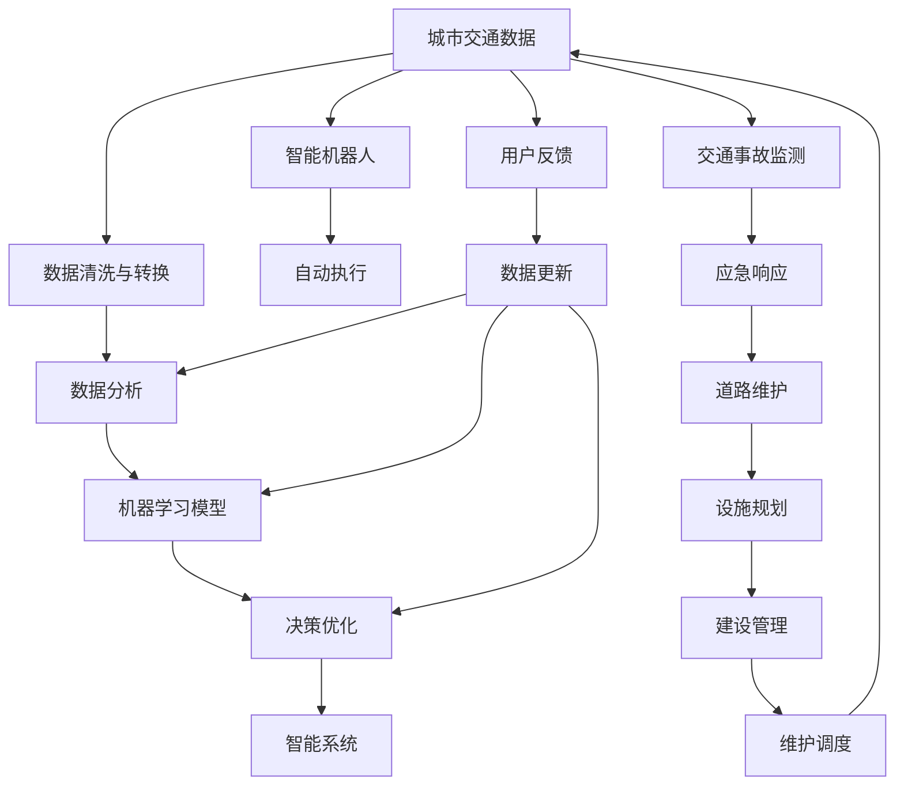

                 

# AI与人类计算：打造可持续发展的城市交通与基础设施建设与规划建设管理

## 1. 背景介绍

### 1.1 问题由来

随着全球化进程的加速和城市化率的提升，城市交通和基础设施建设管理面临空前的压力与挑战。如何高效、可持续地管理城市交通，提高居民生活质量，是各大城市政府关注的重点。传统的数据驱动方式依赖人工手动分析，效率低下且误差较大。为了提升管理效率，人工智能(AI)技术开始被引入。

### 1.2 问题核心关键点

1. **数据融合与分析**：城市交通和基础设施管理涉及大量实时数据，包括交通流量、路网信息、车辆位置等。如何高效融合这些数据，并从中提取有用信息，是AI应用的核心。
2. **实时监控与预测**：实时监控城市交通状态，预测交通拥堵、事故风险等，提前采取措施，减轻突发事件对城市交通的影响。
3. **智能调度与优化**：智能调度交通信号灯、公交线路、停车资源等，优化城市交通系统运行效率，提升用户体验。
4. **居民参与与反馈**：利用AI技术收集居民出行习惯和满意度，优化交通服务，实现精细化管理。
5. **可持续性考量**：考虑到城市交通与基础设施对环境的影响，AI系统需要具备绿色低碳的理念，减少能源消耗和碳排放。

### 1.3 问题研究意义

利用AI技术对城市交通与基础设施进行智能化管理，可显著提高城市管理效率，缓解交通压力，提升居民生活质量，同时减少能源消耗，具有重要的现实意义：

1. **提升管理效率**：AI系统能够快速分析大量数据，提供精准的决策支持，缩短管理响应时间。
2. **优化资源配置**：通过AI预测与调度，实现交通资源的动态分配，避免资源浪费。
3. **改善环境质量**：智能交通系统减少能源消耗和排放，有助于城市可持续发展。
4. **提升居民体验**：智能化管理提升出行政策精准度，改善交通环境，提升居民出行体验。
5. **推动技术进步**：城市交通AI应用催生了新技术和新方法，推动AI领域发展。

## 2. 核心概念与联系

### 2.1 核心概念概述

为更好地理解AI在城市交通与基础设施建设管理中的应用，本节将介绍几个密切相关的核心概念：

- **人工智能(AI)**：使用算法、数据、计算资源，模拟人类智能行为，解决复杂问题。
- **城市交通与基础设施管理**：城市交通运行监测、交通信号控制、公交系统管理、停车管理、智能导航、公共交通信息服务、城市道路与设施规划、建设与维护。
- **数据分析与处理**：收集城市交通数据，进行清洗、转换和分析，提取有价值的信息。
- **机器学习与深度学习**：利用算法训练模型，从中提取特征，预测未来事件，优化决策过程。
- **智能系统与机器人**：构建基于AI的系统或机器人，实现自动执行管理任务。

这些核心概念之间通过数据流动和算法转换相互关联，共同构建城市交通与基础设施智能化管理的基础框架。

### 2.2 核心概念原理和架构的 Mermaid 流程图(Mermaid 流程节点中不要有括号、逗号等特殊字符)



## 3. 核心算法原理 & 具体操作步骤

### 3.1 算法原理概述

AI在城市交通与基础设施建设管理中的应用，主要基于机器学习和深度学习的算法原理。

- **监督学习**：利用标注好的数据，训练模型，预测未知样本的标签。广泛应用于交通流量预测、交通事故分类等任务。
- **无监督学习**：从未标注的数据中挖掘特征，用于聚类、降维等任务。适用于交通模式分析、智能导航优化等。
- **强化学习**：通过与环境的交互，优化智能系统决策策略，实现动态调度和资源分配。适用于交通信号控制、公交路线优化等。
- **迁移学习**：将在大规模数据集上训练的模型，应用到小规模数据集上，提升模型泛化能力。适用于不同城市交通管理中的相似问题。
- **半监督学习**：结合少量标注数据和大量未标注数据，提高模型准确率。适用于交通监控系统中的异常检测任务。

### 3.2 算法步骤详解

**Step 1: 数据准备与清洗**
- 收集城市交通与基础设施相关的各类数据，包括交通流量、车辆位置、交通信号灯状态等。
- 清洗数据，去除噪声和错误，保证数据质量。

**Step 2: 数据特征提取**
- 对清洗后的数据进行特征提取，如计算车辆速度、方向、到达时间等特征。
- 应用特征工程，构建新的特征，提升模型性能。

**Step 3: 模型训练与优化**
- 选择合适的机器学习算法，如随机森林、SVM、神经网络等。
- 利用历史数据进行模型训练，优化模型参数。
- 应用交叉验证等技术，避免过拟合。

**Step 4: 模型评估与部署**
- 在测试集上评估模型性能，如准确率、召回率、F1值等。
- 部署模型到生产环境，集成到交通管理系统。

**Step 5: 模型监测与更新**
- 实时监测模型性能，根据反馈数据不断优化模型。
- 定期更新模型，适应新的交通数据和需求。

### 3.3 算法优缺点

**优点**：
1. 高效处理大量数据，提供精准的决策支持。
2. 实时响应城市交通动态变化，提升管理效率。
3. 智能化、自动化管理，降低人力成本。
4. 数据驱动决策，提高决策科学性。

**缺点**：
1. 依赖高质量数据，数据获取成本高。
2. 模型复杂度高，训练和部署成本大。
3. 可能存在算法偏见，影响决策公平性。
4. 模型解释性差，决策过程难以理解。

### 3.4 算法应用领域

AI在城市交通与基础设施建设管理中的应用，主要包括以下几个领域：

- **交通流量预测与调度**：利用AI模型预测交通流量变化，优化交通信号控制，减少拥堵。
- **智能导航与路径规划**：利用AI算法计算最优路径，提高出行效率。
- **交通事故监测与预警**：应用AI识别交通事故，实时预警，快速响应。
- **公交系统优化**：优化公交线路、站点设置、发车间隔等，提升公交服务质量。
- **停车管理**：利用AI优化停车资源分配，解决城市停车难问题。
- **智能监控与分析**：实时监控城市交通运行状态，提取关键信息，分析交通模式。

## 4. 数学模型和公式 & 详细讲解 & 举例说明

### 4.1 数学模型构建

基于AI的城市交通与基础设施建设管理，可以抽象为以下几个数学模型：

- **交通流量预测模型**：利用历史交通数据，构建时间序列预测模型，预测未来交通流量。
- **公交路线优化模型**：构建图优化模型，优化公交线路设计，减少出行时间。
- **智能信号控制模型**：构建基于红绿灯状态的交通信号优化模型，减少交通拥堵。
- **智能停车资源管理模型**：构建多层次的停车资源分配模型，提升停车效率。

### 4.2 公式推导过程

以交通流量预测为例，利用时间序列模型进行预测：

设交通流量 $y_t$ 随时间 $t$ 变化的模型为：

$$ y_t = f(y_{t-1}, y_{t-2}, \ldots, y_{t-k}, x_t) $$

其中 $f$ 为预测函数，$x_t$ 为影响交通流量的外部因素，如天气、节假日等。

常用的时间序列模型包括ARIMA、LSTM、GRU等，具体推导过程如下：

**ARIMA模型**：
$$ y_t = c + \sum_{i=1}^{p} \alpha_i y_{t-i} + \sum_{i=1}^{d} \Delta^i y_t + \sum_{j=1}^{q} \beta_j \epsilon_{t-j} $$

**LSTM模型**：
$$ h_t = f(h_{t-1}, y_{t-1}, x_t) $$

$$ y_t = g(h_t) $$

其中 $h_t$ 为LSTM中的隐藏状态，$\epsilon_t$ 为随机误差项，$g$ 为输出函数。

### 4.3 案例分析与讲解

以公交路线优化为例，构建图优化模型：

设公交路线图为 $G=(V, E)$，节点 $V$ 为站点，边 $E$ 表示站点之间的道路。目标最小化总出行时间 $T$：

$$ T = \sum_{i=1}^n t_i $$

其中 $t_i$ 为站点 $i$ 到站点 $i+1$ 的出行时间，可表示为：

$$ t_i = d_i \cdot \text{cost}(a_i, b_i) $$

其中 $d_i$ 为站点 $i$ 到站点 $i+1$ 的距离，$\text{cost}(a_i, b_i)$ 为成本函数，如车辆速度、道路状况等。

利用Dijkstra算法或A*算法求解最小出行时间路径，优化公交线路。

## 5. 项目实践：代码实例和详细解释说明

### 5.1 开发环境搭建

在进行AI实践前，我们需要准备好开发环境。以下是使用Python进行TensorFlow开发的环境配置流程：

1. 安装Anaconda：从官网下载并安装Anaconda，用于创建独立的Python环境。

2. 创建并激活虚拟环境：
```bash
conda create -n ai-env python=3.8 
conda activate ai-env
```

3. 安装TensorFlow：根据CUDA版本，从官网获取对应的安装命令。例如：
```bash
conda install tensorflow -c tensorflow -c conda-forge
```

4. 安装各类工具包：
```bash
pip install numpy pandas scikit-learn matplotlib tqdm jupyter notebook ipython
```

完成上述步骤后，即可在`ai-env`环境中开始AI实践。

### 5.2 源代码详细实现

下面我们以公交路线优化为例，给出使用TensorFlow进行图优化模型的PyTorch代码实现。

首先，定义图优化模型：

```python
import tensorflow as tf
from tensorflow.keras import layers
from tensorflow.keras import optimizers

class GraphOptimizer(tf.keras.Model):
    def __init__(self, num_stops, num_edges):
        super(GraphOptimizer, self).__init__()
        self.num_stops = num_stops
        self.num_edges = num_edges
        self.layers = self.build_layers()
        
    def build_layers(self):
        layers = []
        for i in range(self.num_stops-1):
            layers.append(layers.Dense(16, activation='relu'))
        return layers
    
    def call(self, inputs):
        x = inputs
        for layer in self.layers:
            x = layer(x)
        return x
```

然后，定义优化器与损失函数：

```python
optimizer = optimizers.Adam()
loss_fn = tf.keras.losses.MeanSquaredError()
```

接着，定义训练和评估函数：

```python
def train_step(inputs, labels):
    with tf.GradientTape() as tape:
        predictions = model(inputs)
        loss = loss_fn(labels, predictions)
    grads = tape.gradient(loss, model.trainable_variables)
    optimizer.apply_gradients(zip(grads, model.trainable_variables))
    return loss

def evaluate(model, inputs, labels):
    predictions = model(inputs)
    loss = loss_fn(labels, predictions)
    return loss
```

最后，启动训练流程并在测试集上评估：

```python
epochs = 100
batch_size = 32

for epoch in range(epochs):
    total_loss = 0
    for i in range(0, len(train_dataset), batch_size):
        batch_inputs, batch_labels = train_dataset[i:i+batch_size]
        loss = train_step(batch_inputs, batch_labels)
        total_loss += loss
    print(f"Epoch {epoch+1}, train loss: {total_loss/len(train_dataset):.3f}")
    
    print(f"Epoch {epoch+1}, test loss:")
    test_loss = evaluate(test_dataset, test_inputs, test_labels)
    print(test_loss)
```

以上就是使用TensorFlow进行公交路线优化模型的完整代码实现。可以看到，通过定义图优化模型、设置优化器与损失函数、训练和评估函数，我们实现了对公交路线进行智能优化的AI应用。

### 5.3 代码解读与分析

让我们再详细解读一下关键代码的实现细节：

**GraphOptimizer类**：
- `__init__`方法：初始化模型的输入和输出节点数量。
- `build_layers`方法：构建多层感知器网络，每层包含16个神经元，使用ReLU激活函数。
- `call`方法：将输入数据通过多层感知器进行前向传播，得到预测结果。

**优化器与损失函数**：
- 使用Adam优化器进行模型训练，更新模型参数。
- 损失函数使用均方误差，用于评估预测结果与真实标签之间的差异。

**训练和评估函数**：
- `train_step`函数：在每个批次上进行前向传播，计算损失，并使用梯度下降优化模型参数。
- `evaluate`函数：在测试集上进行前向传播，计算损失，评估模型性能。

**训练流程**：
- 定义总的epoch数和批大小，开始循环迭代
- 每个epoch内，在训练集上训练，输出平均损失
- 在测试集上评估，输出测试损失
- 所有epoch结束后，在测试集上评估，给出最终测试结果

可以看到，通过上述步骤，我们构建了一个基本的AI模型，用于对公交路线进行智能优化。当然，在实际应用中，还需要进一步细化模型架构、优化算法参数、集成更多数据源等，以提升模型性能和应用效果。

## 6. 实际应用场景

### 6.1 智能交通信号控制

智能交通信号控制是AI在城市交通管理中最具代表性的应用之一。通过AI实时监控交通流量，动态调整信号灯的时长和顺序，可以大幅缓解交通拥堵，提升交通效率。

在技术实现上，可以部署多组摄像头和传感器，实时获取城市道路的交通状态。利用机器学习算法分析实时数据，预测未来交通流量变化，自动调整信号灯时长和顺序。同时，通过强化学习算法不断优化信号控制策略，提升交通系统应对突发事件的能力。

### 6.2 智能公交调度

智能公交调度系统利用AI优化公交线路设计，动态调整发车间隔，提升公交系统的运行效率和服务质量。

在技术实现上，可以收集公交车的GPS位置数据和乘客需求信息，构建图优化模型，求解最小出行时间路径，优化公交线路设计。通过强化学习算法动态调整发车间隔，平衡公交车的到达率和准点率。

### 6.3 智能停车管理

智能停车管理利用AI优化停车资源的分配和调度，解决城市停车难问题。

在技术实现上，可以部署多组摄像头和传感器，实时获取停车场车位状态信息。利用机器学习算法预测未来停车需求，自动调度空闲车位，提升停车资源的利用率。同时，通过强化学习算法优化停车位调度策略，提升用户体验。

### 6.4 未来应用展望

随着AI技术的不断进步，未来城市交通与基础设施管理将迎来更多创新应用：

1. **自动驾驶**：自动驾驶技术将大幅提升道路运输效率，降低交通事故率。
2. **智能交通导航**：利用AI技术实时获取路况信息，提供最优导航路线，提升出行效率。
3. **智慧城市治理**：AI系统集成多部门数据，实现城市综合治理，提升管理效率。
4. **绿色交通系统**：AI系统实时监测交通状况，动态调整交通流，减少能源消耗和碳排放。
5. **交通预测与预警**：利用AI预测交通拥堵、事故等风险，提前采取措施，保障城市安全。

## 7. 工具和资源推荐

### 7.1 学习资源推荐

为了帮助开发者系统掌握AI在城市交通与基础设施管理中的应用，这里推荐一些优质的学习资源：

1. 《Deep Learning for Self-Driving Cars》系列博文：由AI专家撰写，介绍自动驾驶中的深度学习算法和实践。

2. 《TensorFlow Developer Guide》书籍：TensorFlow官方文档，提供详细的使用指南和代码示例。

3. 《Advanced Traffic and Transport Systems: Planning, Control and Management》书籍：系统介绍交通系统规划、控制与管理的技术和应用。

4. 《Machine Learning for Smart Cities》课程：斯坦福大学开设的智能城市课程，涵盖AI在城市管理中的应用。

5. 《Smart Cities with AI》书籍：介绍AI在智慧城市建设中的应用案例和实践经验。

通过对这些资源的学习实践，相信你一定能够快速掌握AI在城市交通与基础设施管理中的应用方法，并用于解决实际的交通问题。

### 7.2 开发工具推荐

高效的开发离不开优秀的工具支持。以下是几款用于AI开发常用的工具：

1. TensorFlow：基于Python的开源深度学习框架，支持动态计算图和分布式训练，适合大规模模型部署。

2. PyTorch：基于Python的开源深度学习框架，灵活性高，支持动态图和静态图，适合快速迭代研究。

3. Scikit-Learn：基于Python的机器学习库，提供丰富的算法和工具，适合数据分析和模型构建。

4. OpenCV：计算机视觉库，提供图像处理和分析工具，适合视频监控和图像识别任务。

5. Jupyter Notebook：开源笔记本工具，支持代码编写、数据可视化、模型训练和部署，适合协作开发。

合理利用这些工具，可以显著提升AI系统开发的效率，加快创新迭代的步伐。

### 7.3 相关论文推荐

AI在城市交通与基础设施管理中的应用研究，涉及多个领域和方向。以下是几篇具有代表性的相关论文，推荐阅读：

1. "Deep Learning for Traffic Prediction and Management"：介绍深度学习在交通预测和管理中的应用。

2. "Intelligent Traffic Signal Control with Deep Reinforcement Learning"：利用深度强化学习优化交通信号控制。

3. "Public Transport Network Design and Optimization with Machine Learning"：使用机器学习优化公共交通网络设计。

4. "Smart Parking System with Deep Neural Networks"：利用深度神经网络优化智能停车系统。

5. "Urban Traffic Management Using AI and IoT"：利用AI和物联网技术进行城市交通管理。

这些论文代表了大规模数据驱动的交通管理领域的研究进展，值得深入学习和研究。

## 8. 总结：未来发展趋势与挑战

### 8.1 总结

本文对AI在城市交通与基础设施建设管理中的应用进行了全面系统的介绍。首先阐述了城市交通与基础设施管理的研究背景和意义，明确了AI技术在提升管理效率、优化资源配置、降低环境影响等方面的独特价值。其次，从原理到实践，详细讲解了AI技术在交通流量预测、智能导航、智能停车等领域的应用方法，给出了具体代码实现。同时，本文还广泛探讨了AI技术在智能交通系统、绿色交通系统、智慧城市治理等方面的应用前景，展示了AI技术的广阔前景。

通过本文的系统梳理，可以看到，AI技术正在逐步融入城市交通与基础设施建设管理，成为推动城市智能化发展的重要手段。AI的应用不仅提升了管理效率，还带来了更高的智能化水平，为城市可持续发展提供了有力支撑。

### 8.2 未来发展趋势

展望未来，AI在城市交通与基础设施建设管理中的应用将呈现以下几个发展趋势：

1. **深度学习与强化学习结合**：AI系统将更多结合深度学习和强化学习，实现更加复杂和动态的决策优化。
2. **多源数据融合**：AI系统将融合多源数据，如视频监控、GPS、传感器等，提供更加全面和准确的信息支持。
3. **实时性提升**：AI系统将实现实时响应，及时调整交通信号、调度公交车辆等，提升用户体验。
4. **智能系统集成**：AI系统将集成更多智能模块，如自动驾驶、智能导航、绿色交通等，提供全方位的智慧服务。
5. **用户参与与反馈**：AI系统将引入用户反馈机制，不断优化模型，提升服务质量。
6. **可持续发展理念**：AI系统将结合绿色低碳理念，减少能源消耗和碳排放，促进城市可持续发展。

### 8.3 面临的挑战

尽管AI技术在城市交通与基础设施管理中取得了显著成果，但在迈向更加智能化、普适化应用的过程中，仍面临诸多挑战：

1. **数据隐私与安全**：城市交通与基础设施管理涉及大量敏感数据，数据隐私和安全保护成为重要问题。
2. **模型复杂度与解释性**：AI模型复杂度不断增加，模型解释性难以满足监管需求。
3. **算法偏见与公平性**：AI算法可能存在偏见，影响决策公平性，需要引入公平性评估和修正机制。
4. **硬件资源限制**：AI系统对计算资源和存储资源要求较高，需优化模型架构和资源配置。
5. **标准化与互操作性**：AI系统需遵循标准化协议，实现系统间互操作和数据共享。
6. **跨领域知识整合**：AI系统需与传统领域知识进行有效结合，实现更加全面和准确的决策支持。

### 8.4 研究展望

面对AI技术在城市交通与基础设施管理中的挑战，未来的研究需要在以下几个方面寻求新的突破：

1. **隐私保护与数据安全**：引入隐私保护算法，如差分隐私、联邦学习等，保障数据安全。
2. **模型简化与解释性**：简化模型架构，提升可解释性，满足监管需求。
3. **公平性评估与修正**：引入公平性评估机制，纠正算法偏见，保障决策公平性。
4. **硬件优化与资源配置**：优化模型架构和资源配置，实现高效计算。
5. **标准化与互操作性**：推动标准化协议制定，实现系统间互操作和数据共享。
6. **跨领域知识融合**：将AI技术与其他领域知识进行整合，提升决策支持效果。

通过这些研究方向的探索，相信AI技术将在城市交通与基础设施建设管理中发挥更大的作用，为城市可持续发展提供更强大的技术支撑。

## 9. 附录：常见问题与解答

**Q1: AI在城市交通与基础设施管理中的应用有哪些？**

A: AI在城市交通与基础设施管理中的应用广泛，主要包括：
1. 交通流量预测与调度：利用AI模型预测交通流量，优化交通信号控制。
2. 智能公交调度：优化公交线路设计，动态调整发车间隔，提升公交系统效率。
3. 智能停车管理：优化停车资源分配，解决城市停车难问题。
4. 智能交通信号控制：实时监控交通流量，动态调整信号灯时长和顺序，缓解交通拥堵。
5. 智能交通导航：利用AI技术实时获取路况信息，提供最优导航路线。
6. 智能交通监控与预警：利用AI识别交通事故，实时预警，快速响应。

**Q2: 如何选择合适的AI算法？**

A: 选择AI算法应考虑以下几个因素：
1. 数据类型：选择合适的算法处理不同类型的输入数据，如图像、文本、时间序列等。
2. 数据规模：大数据集适合使用深度学习算法，如神经网络、卷积神经网络等；小数据集适合使用机器学习算法，如随机森林、SVM等。
3. 任务类型：分类任务适合使用SVM、决策树等算法；回归任务适合使用线性回归、深度学习等算法。
4. 模型复杂度：简单任务适合使用简单的线性模型，复杂任务适合使用深度神经网络等复杂模型。
5. 计算资源：计算资源充足时，可以使用复杂的深度学习模型；资源有限时，选择较简单的模型。

**Q3: AI在城市交通与基础设施管理中面临哪些挑战？**

A: AI在城市交通与基础设施管理中面临的挑战包括：
1. 数据隐私与安全：城市交通与基础设施管理涉及大量敏感数据，数据隐私和安全保护成为重要问题。
2. 模型复杂度与解释性：AI模型复杂度不断增加，模型解释性难以满足监管需求。
3. 算法偏见与公平性：AI算法可能存在偏见，影响决策公平性，需要引入公平性评估和修正机制。
4. 硬件资源限制：AI系统对计算资源和存储资源要求较高，需优化模型架构和资源配置。
5. 标准化与互操作性：AI系统需遵循标准化协议，实现系统间互操作和数据共享。
6. 跨领域知识整合：AI系统需与传统领域知识进行有效结合，实现更加全面和准确的决策支持。

**Q4: 如何优化AI系统性能？**

A: 优化AI系统性能应考虑以下几个方面：
1. 数据质量：保证数据质量，去除噪声和错误，提升模型性能。
2. 算法优化：选择合适的算法和参数，避免过拟合，提升模型泛化能力。
3. 模型简化：简化模型架构，提升可解释性，满足监管需求。
4. 硬件优化：优化模型架构和资源配置，实现高效计算。
5. 模型集成：集成多个模型，提升系统鲁棒性和泛化能力。
6. 持续学习：引入持续学习机制，模型能够不断学习新知识，适应数据分布变化。

这些优化方法需要根据具体应用场景和数据特点进行灵活组合，以达到最优效果。

通过这些研究方向的探索，相信AI技术将在城市交通与基础设施建设管理中发挥更大的作用，为城市可持续发展提供更强大的技术支撑。

---

作者：禅与计算机程序设计艺术 / Zen and the Art of Computer Programming

