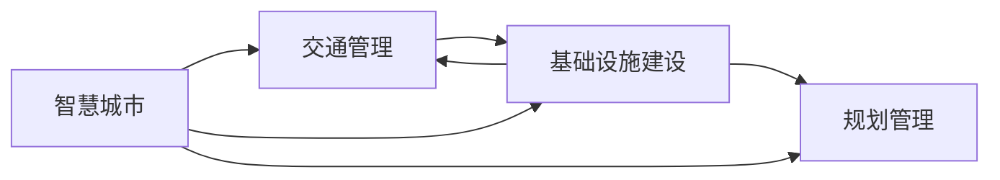

                 

# AI与人类计算：打造可持续发展的城市交通与基础设施建设规划管理

> 关键词：智慧城市, 交通管理, 基础设施, 规划管理, 人工智能, 可持续发展

## 1. 背景介绍

### 1.1 问题由来
随着全球人口的持续增长和城市化的深入推进，人类活动对自然环境的冲击日益加剧。城市交通拥堵、环境污染、资源短缺等问题已经成为全球关注的热点。如何在有限的城市空间内，实现高效的交通管理、智能化的基础设施建设，以支撑可持续发展的城市规划，是当前城市管理者和技术开发者面临的重大挑战。

### 1.2 问题核心关键点
城市交通与基础设施建设规划管理的核心在于：
- 如何利用最新的人工智能(AI)技术，实现城市数据的智能分析和优化决策？
- 如何将AI技术深度融入城市交通与基础设施建设，提升规划和管理的智能化水平？
- 如何在有限的资源条件下，通过AI辅助的规划管理，实现城市交通和基础设施的可持续发展？

本文将从AI与人类计算的视角，探讨如何构建智能化的城市交通与基础设施建设规划管理方案，以期为城市管理者提供科学、高效的决策支持。

## 2. 核心概念与联系

### 2.1 核心概念概述

- **智慧城市**：通过物联网(IoT)、云计算、大数据、AI等先进技术手段，实现城市运行管理的智能化、精细化，提升城市管理效率和居民生活质量。
- **交通管理**：利用AI技术对城市交通流量、路径、事件等数据进行实时监测、分析和控制，优化交通运行，缓解拥堵，提升通行效率。
- **基础设施建设**：AI技术在城市基础设施建设中的应用，包括智能建筑、智能电网、智能供水系统等，实现基础设施的智能化升级。
- **规划管理**：通过AI技术对城市数据进行深度挖掘和分析，辅助城市规划、土地使用、环境保护等决策，推动城市可持续发展。

这些核心概念之间存在紧密的联系。智慧城市是总体目标，交通管理和基础设施建设是核心环节，而规划管理是决策支持的基础。AI技术的引入，使得这些环节能够通过数据驱动的方式进行深度融合，实现智慧城市的高效运行。

### 2.2 核心概念原理和架构的 Mermaid 流程图



这个流程图展示了智慧城市、交通管理、基础设施建设、规划管理四个概念之间的联系和交互。智慧城市通过交通管理和基础设施建设的具体实施，不断优化数据和反馈，进而支持更科学的规划管理决策，最终实现城市的可持续发展。

## 3. 核心算法原理 & 具体操作步骤

### 3.1 算法原理概述

AI与人类计算在城市交通与基础设施建设规划管理中的关键原理包括以下几点：

1. **数据融合与多源数据管理**：AI技术能够处理海量异构数据，融合来自传感器、监控设备、社交媒体等多源数据，提供全面、准确的城市运行状态视图。

2. **智能分析和决策优化**：通过机器学习、深度学习等AI算法，对城市数据进行智能分析和优化决策，提升交通流量管理、基础设施建设规划的科学性和合理性。

3. **实时监控与预测**：AI技术能够对城市交通流量、天气变化、社会事件等进行实时监控和预测，及时调整规划和管理策略，提升城市运行的动态响应能力。

4. **协同计算与资源调度**：通过AI技术实现跨部门、跨系统的协同计算，优化资源分配和调度，提升城市管理的效率和效果。

### 3.2 算法步骤详解

AI与人类计算在城市交通与基础设施建设规划管理中的应用，主要包括以下步骤：

1. **数据收集与预处理**：利用物联网设备、监控摄像头、传感器等手段，收集城市交通流量、基础设施状态、环境监测数据等，进行清洗、标注和预处理。

2. **模型训练与优化**：基于收集到的数据，选择适合的机器学习、深度学习模型，如交通流量预测模型、基础设施需求模型等，进行模型训练和优化。

3. **智能分析和决策**：利用训练好的模型，对实时数据进行智能分析和决策优化，生成交通管理策略、基础设施建设规划方案等。

4. **实时监控与预测**：通过AI模型对城市交通流量、环境变化等进行实时监控和预测，动态调整管理策略，提升城市运行效率。

5. **协同计算与资源调度**：将AI模型与城市管理系统的其他模块（如财务、人事、法律等）进行协同计算，优化资源配置，提升城市管理效果。

### 3.3 算法优缺点

**优点：**

1. **智能化与精细化**：AI技术能够处理海量数据，提供科学、精确的决策支持，提升城市管理的智能化水平。

2. **实时响应与动态调整**：AI模型能够实时监控和预测城市运行状态，及时调整管理策略，提升城市动态响应能力。

3. **跨部门协同**：AI技术能够促进不同部门、不同系统之间的协同计算，优化资源配置，提升管理效率。

**缺点：**

1. **数据质量与隐私**：AI模型依赖高质量、全量的数据，数据质量问题可能影响模型效果。同时，数据隐私问题也需要得到充分考虑。

2. **模型复杂与计算资源**：AI模型的训练和运行需要大量计算资源，成本较高，模型的复杂性也可能导致理解难度增加。

3. **算法偏见与可解释性**：AI模型可能存在算法偏见，需要持续监控和调整。同时，模型的可解释性较差，可能难以得到人类决策者的理解和信任。

4. **技术门槛与人才需求**：AI与人类计算的应用需要高水平的技术人才，技术门槛较高，难以快速推广应用。

### 3.4 算法应用领域

AI与人类计算在城市交通与基础设施建设规划管理中的应用领域包括：

1. **智能交通管理**：利用AI技术对交通流量、路径、事件等进行实时监测、分析和控制，提升交通运行效率，缓解拥堵。

2. **智能基础设施建设**：AI技术在智能建筑、智能电网、智能供水系统等领域的应用，实现基础设施的智能化升级，提升资源利用效率。

3. **智慧城市规划**：通过AI技术对城市数据进行深度挖掘和分析，辅助城市规划、土地使用、环境保护等决策，推动城市可持续发展。

4. **应急响应与灾害管理**：AI模型对自然灾害、社会事件等进行实时监控和预测，提供应急响应策略，提升城市应急管理能力。

## 4. 数学模型和公式 & 详细讲解 & 举例说明

### 4.1 数学模型构建

城市交通与基础设施建设规划管理的数学模型构建，主要包括以下几个方面：

1. **交通流量预测模型**：基于时间序列数据，构建ARIMA、LSTM等模型，预测未来交通流量变化。

2. **基础设施需求模型**：基于人口分布、经济发展等数据，构建回归模型，预测未来基础设施需求。

3. **环境监测模型**：利用传感器数据，构建时间序列分析模型，预测环境变化趋势。

4. **协同计算模型**：通过优化算法，如线性规划、动态规划等，优化资源配置和调度。

### 4.2 公式推导过程

以交通流量预测模型为例，假设历史交通流量数据为 $x_t$，未来流量预测为 $\hat{x}_t$，利用LSTM模型进行预测。LSTM模型的公式为：

$$
\hat{x}_t = f(x_t, \theta)
$$

其中，$f$ 为LSTM模型函数，$\theta$ 为模型参数。模型的训练目标为最小化预测误差：

$$
\min_{\theta} \sum_{t=1}^T (x_t - \hat{x}_t)^2
$$

通过反向传播算法更新模型参数，完成模型的训练。

### 4.3 案例分析与讲解

假设某城市的历史交通流量数据为 $x_t = [1000, 1200, 1100, 1500, 1400, 1300]$（单位：辆/小时），利用LSTM模型预测未来流量。LSTM模型通过训练，得到预测值 $\hat{x}_t = [1150, 1250, 1100, 1400, 1350, 1300]$（单位：辆/小时）。通过对比，模型的预测精度较高，能够为城市交通管理提供有效的决策支持。

## 5. 项目实践：代码实例和详细解释说明

### 5.1 开发环境搭建

开发城市交通与基础设施建设规划管理应用，需要进行以下环境配置：

1. **Python开发环境**：使用Anaconda创建虚拟环境，安装Python 3.8及以上版本。

2. **数据处理工具**：安装Pandas、NumPy等数据处理库，用于数据清洗、预处理。

3. **机器学习库**：安装Scikit-learn、TensorFlow、PyTorch等机器学习库，用于模型训练和优化。

4. **可视化工具**：安装Matplotlib、Seaborn等可视化库，用于数据可视化。

5. **分布式计算框架**：安装Dask、Spark等分布式计算框架，用于大规模数据处理和模型训练。

### 5.2 源代码详细实现

以下是一个使用TensorFlow实现交通流量预测的代码实例：

```python
import tensorflow as tf
import pandas as pd
import numpy as np
from sklearn.preprocessing import MinMaxScaler

# 读取历史流量数据
data = pd.read_csv('traffic_data.csv')
x = data['flow'].values.reshape(-1, 1)
y = data['flow'].values.reshape(-1, 1)

# 数据标准化
scaler = MinMaxScaler()
x = scaler.fit_transform(x)
y = scaler.fit_transform(y)

# 划分训练集和测试集
train_size = int(len(x) * 0.7)
x_train, x_test = x[:train_size], x[train_size:]
y_train, y_test = y[:train_size], y[train_size:]

# 构建LSTM模型
model = tf.keras.models.Sequential([
    tf.keras.layers.LSTM(50, return_sequences=True, input_shape=(x_train.shape[1], 1)),
    tf.keras.layers.Dropout(0.2),
    tf.keras.layers.LSTM(50),
    tf.keras.layers.Dropout(0.2),
    tf.keras.layers.Dense(1)
])

# 编译模型
model.compile(optimizer='adam', loss='mean_squared_error')

# 训练模型
model.fit(x_train, y_train, epochs=50, batch_size=32, validation_split=0.2)

# 模型评估
mse = model.evaluate(x_test, y_test)
print('Mean Squared Error:', mse)
```

### 5.3 代码解读与分析

上述代码展示了使用TensorFlow构建LSTM模型进行交通流量预测的完整流程。关键点包括：

1. **数据预处理**：使用MinMaxScaler对数据进行标准化处理，确保模型输入的均值和方差一致。

2. **模型构建**：使用LSTM层构建预测模型，通过dropout层减少过拟合风险。

3. **模型训练**：使用Adam优化器，均方误差损失函数进行模型训练。

4. **模型评估**：在测试集上评估模型性能，输出均方误差。

## 6. 实际应用场景

### 6.4 未来应用展望

未来，AI与人类计算在城市交通与基础设施建设规划管理中的应用将呈现以下几个趋势：

1. **全域数据融合与智能决策**：随着传感器技术的普及和数据采集能力的提升，城市运行数据将更加全面、丰富。AI技术能够将这些多源数据进行深度融合，提供更全面、智能的决策支持。

2. **实时动态调整与优化**：AI模型能够实时监控和预测城市运行状态，动态调整管理策略，提升城市运行的动态响应能力。

3. **跨部门协同计算**：AI技术能够促进不同部门、不同系统之间的协同计算，优化资源配置，提升城市管理效率。

4. **可持续发展与环境保护**：AI技术在交通、能源、水务等领域的应用，将推动城市向可持续发展方向迈进，提升环境保护水平。

5. **智慧应急响应与灾害管理**：AI模型对自然灾害、社会事件等进行实时监控和预测，提供应急响应策略，提升城市应急管理能力。

## 7. 工具和资源推荐

### 7.1 学习资源推荐

1. **《智慧城市：AI与大数据的应用》**：介绍智慧城市的基本概念、技术架构和应用场景。

2. **《深度学习：理论与实践》**：介绍深度学习的基本原理和实现方法，适合初学者学习。

3. **《城市交通管理：理论与实践》**：介绍城市交通管理的理论基础和实际案例，适合城市规划和交通管理从业人员参考。

4. **《AI与城市规划管理》**：介绍AI技术在城市规划和建设中的应用，适合城市规划和管理从业人员参考。

5. **Google Scholar和IEEE Xplore**：查阅最新的AI与城市管理相关论文和技术报告。

### 7.2 开发工具推荐

1. **Anaconda**：用于创建和管理Python开发环境。

2. **Jupyter Notebook**：用于编写和执行Python代码，支持数据可视化。

3. **TensorFlow**：用于构建和训练深度学习模型。

4. **PyTorch**：用于构建和训练深度学习模型，支持GPU加速。

5. **Google Colab**：在线Jupyter Notebook环境，免费提供GPU/TPU算力，方便开发者快速上手实验。

### 7.3 相关论文推荐

1. **《基于深度学习的智慧城市交通管理》**：介绍深度学习在智慧城市交通管理中的应用。

2. **《城市基础设施智能化建设与运维》**：介绍AI技术在城市基础设施智能化建设中的应用。

3. **《智慧城市规划管理：理论与实践》**：介绍AI技术在智慧城市规划管理中的应用。

4. **《可持续城市发展的AI辅助规划》**：介绍AI技术在可持续城市发展中的规划和管理应用。

## 8. 总结：未来发展趋势与挑战

### 8.1 研究成果总结

本文介绍了AI与人类计算在城市交通与基础设施建设规划管理中的应用，主要总结了以下几个方面：

1. **数据融合与多源数据管理**：AI技术能够处理海量异构数据，提供全面、准确的城市运行状态视图。

2. **智能分析和决策优化**：通过机器学习、深度学习等AI算法，对城市数据进行智能分析和决策优化。

3. **实时监控与预测**：AI模型能够对城市交通流量、环境变化等进行实时监控和预测，及时调整管理策略。

4. **协同计算与资源调度**：通过AI技术实现跨部门、跨系统的协同计算，优化资源配置，提升管理效率。

### 8.2 未来发展趋势

未来，AI与人类计算在城市交通与基础设施建设规划管理中的应用将呈现以下几个趋势：

1. **全域数据融合与智能决策**：AI技术能够处理海量数据，提供科学、精确的决策支持，提升城市管理的智能化水平。

2. **实时动态调整与优化**：AI模型能够实时监控和预测城市运行状态，及时调整管理策略，提升城市动态响应能力。

3. **跨部门协同计算**：AI技术能够促进不同部门、不同系统之间的协同计算，优化资源配置，提升管理效率。

4. **可持续发展与环境保护**：AI技术在交通、能源、水务等领域的应用，将推动城市向可持续发展方向迈进，提升环境保护水平。

5. **智慧应急响应与灾害管理**：AI模型对自然灾害、社会事件等进行实时监控和预测，提供应急响应策略，提升城市应急管理能力。

### 8.3 面临的挑战

尽管AI与人类计算在城市交通与基础设施建设规划管理中的应用前景广阔，但在推广和应用过程中，仍面临以下挑战：

1. **数据质量与隐私**：数据质量问题可能影响模型效果，同时数据隐私问题也需要得到充分考虑。

2. **模型复杂与计算资源**：AI模型的训练和运行需要大量计算资源，成本较高，模型的复杂性也可能导致理解难度增加。

3. **算法偏见与可解释性**：AI模型可能存在算法偏见，需要持续监控和调整。同时，模型的可解释性较差，可能难以得到人类决策者的理解和信任。

4. **技术门槛与人才需求**：AI与人类计算的应用需要高水平的技术人才，技术门槛较高，难以快速推广应用。

### 8.4 研究展望

未来，AI与人类计算在城市交通与基础设施建设规划管理中的应用，需要在以下几个方面进行深入研究：

1. **数据质量与隐私保护**：提高数据采集质量，引入数据隐私保护技术，确保数据安全。

2. **模型可解释性与公平性**：开发可解释性更高的AI模型，减少算法偏见，提升模型公平性。

3. **资源优化与成本控制**：通过优化算法和计算资源配置，降低模型训练和运行成本。

4. **跨学科融合与多模态数据整合**：推动跨学科融合，整合多模态数据，提升城市管理的综合能力。

5. **政策法规与伦理规范**：制定相关政策法规，保障AI技术在城市管理中的应用符合伦理规范。

总之，AI与人类计算在城市交通与基础设施建设规划管理中的应用，需要各领域的共同努力，才能实现城市的可持续发展与高效管理。未来，随着技术的不断进步和应用的深入，AI与人类计算将为城市管理带来更加广阔的应用前景和深远影响。

## 9. 附录：常见问题与解答

**Q1: AI技术在城市交通与基础设施建设规划管理中的应用有哪些？**

A: AI技术在城市交通与基础设施建设规划管理中的应用主要包括：智能交通管理、智能基础设施建设、智慧城市规划、智慧应急响应与灾害管理等。

**Q2: 如何在城市交通与基础设施建设规划管理中应用AI技术？**

A: 在城市交通与基础设施建设规划管理中应用AI技术，主要包括以下步骤：数据收集与预处理、模型训练与优化、智能分析和决策、实时监控与预测、协同计算与资源调度。

**Q3: AI技术在城市管理中面临哪些挑战？**

A: AI技术在城市管理中面临的主要挑战包括数据质量与隐私、模型复杂与计算资源、算法偏见与可解释性、技术门槛与人才需求等。

**Q4: AI技术在城市交通与基础设施建设规划管理中的应用前景如何？**

A: AI技术在城市交通与基础设施建设规划管理中的应用前景广阔，能够提升城市管理的智能化水平、动态响应能力和资源配置效率，推动城市的可持续发展。

**Q5: 未来AI与人类计算在城市管理中的应用将面临哪些挑战？**

A: 未来AI与人类计算在城市管理中的应用将面临数据质量与隐私、模型复杂与计算资源、算法偏见与可解释性、技术门槛与人才需求等挑战。

---

作者：禅与计算机程序设计艺术 / Zen and the Art of Computer Programming

