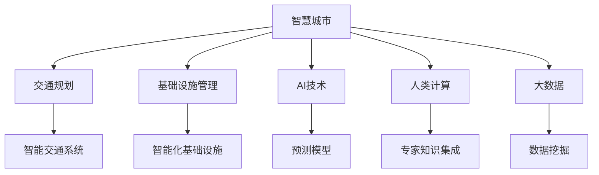

                 

# AI与人类计算：打造可持续发展的城市交通与基础设施规划

> 关键词：智慧城市, 交通规划, 基础设施管理, AI技术, 人类计算, 大数据, 可持续性, 系统优化, 智能决策

## 1. 背景介绍

### 1.1 问题由来

在当今快速发展的城市化进程中，城市交通和基础设施规划面临着严峻的挑战。人口增长、交通拥堵、环境污染、资源分配不均等问题亟待解决。传统的规划方法依赖于人工经验和统计分析，耗时耗力且效果有限。智慧城市建设和大数据技术的兴起为城市交通与基础设施规划提供了新的思路。AI技术，特别是人类计算范式，为解决这些问题提供了新的可能性。

### 1.2 问题核心关键点

AI与人类计算的核心在于结合人工智能技术的强大计算能力与人类专家的智慧，共同解决问题。具体来说，AI计算能够快速处理和分析海量数据，发现潜在的规律和趋势；而人类专家则利用其丰富的经验和直觉，对AI的输出结果进行修正和验证。这种结合方式能够有效提升规划的准确性和全面性，同时节省大量时间和资源。

## 2. 核心概念与联系

### 2.1 核心概念概述

为更好地理解AI与人类计算在城市交通与基础设施规划中的应用，本节将介绍几个关键概念：

- **智慧城市**：利用信息技术、AI和大数据等手段，优化城市资源配置，提升城市管理效率，提高居民生活质量。
- **交通规划**：基于城市交通流量、路线分布、交通需求等数据，合理设计和调整城市交通网络，以缓解交通拥堵，提高交通效率。
- **基础设施管理**：对城市道路、桥梁、地铁、供水、供电等基础设施进行规划、建设和维护，确保其稳定运行和高效使用。
- **AI技术**：包括机器学习、深度学习、自然语言处理等，用于数据挖掘、模式识别、预测分析等任务。
- **人类计算**：利用专家知识与智能算法相结合，共同解决问题。特别适用于解决复杂、需要专业知识支撑的问题。
- **大数据**：通过收集、存储、处理和分析大规模数据集，发现隐藏在数据中的规律和趋势。

这些概念之间的逻辑关系可以通过以下Mermaid流程图来展示：



这个流程图展示了一个典型的智慧城市构建流程，从智慧城市的总体设计到具体应用场景的实现，体现了AI与人类计算的综合作用。

## 3. 核心算法原理 & 具体操作步骤

### 3.1 算法原理概述

AI与人类计算在城市交通与基础设施规划中的应用，本质上是基于数据驱动的智能决策过程。其核心思想是利用AI技术对大量数据进行高效分析和处理，并结合人类专家的知识和经验，共同做出更加合理、科学的决策。

具体而言，通过以下步骤实现AI与人类计算在城市交通与基础设施规划中的集成：

1. **数据收集与处理**：收集城市交通、人口、地理环境等数据，并进行清洗和预处理，确保数据的准确性和完整性。
2. **AI模型训练**：使用机器学习或深度学习模型，对历史数据进行训练，预测未来的交通流量、需求等。
3. **人类专家验证与修正**：人类专家根据AI模型输出的结果，结合实际经验进行验证和修正，以提升预测的准确性。
4. **决策制定**：综合AI模型的预测结果和人类专家的经验，制定最优的城市交通和基础设施规划方案。
5. **方案实施与评估**：实施规划方案，并实时监测其效果，根据评估结果进行优化和调整。

### 3.2 算法步骤详解

#### 步骤1：数据收集与处理

数据是AI与人类计算的基础。在城市交通与基础设施规划中，需要收集以下几类关键数据：

- **交通流量数据**：包括车辆数量、流量、速度等，通常通过交通监控摄像头、交通传感器、GPS等设备获取。
- **人口流动数据**：包括人口分布、人口密度、出行模式等，通常通过人口普查、交通流量数据分析等获取。
- **地理环境数据**：包括道路状况、地形地貌、天气状况等，通常通过卫星遥感、气象站等设备获取。
- **经济数据**：包括经济增长、产业发展、居民收入等，通常通过政府统计数据、经济分析报告等获取。

数据收集完成后，需要进行预处理和清洗，包括数据格式转换、缺失值处理、异常值检测等。预处理后的数据应保证准确性、完整性和一致性，以便后续分析和建模。

#### 步骤2：AI模型训练

AI模型训练是AI与人类计算中的关键环节。通过训练模型，可以从历史数据中提取规律和趋势，预测未来的交通流量、需求等。常用的AI模型包括：

- **回归模型**：用于预测数值型数据，如交通流量、人口流动等。
- **分类模型**：用于分类问题，如交通拥堵等级、基础设施维护需求等。
- **序列模型**：用于时间序列预测，如交通流量预测、道路维护需求预测等。
- **图神经网络**：用于分析和处理网络数据，如交通网络、基础设施网络等。

模型训练过程中，需要注意以下几点：

- **特征选择**：选择与预测目标最相关的特征，提升模型的准确性和泛化能力。
- **模型选择**：根据问题类型选择合适的模型，如线性回归、决策树、随机森林、神经网络等。
- **超参数调优**：通过交叉验证、网格搜索等方法，寻找最优的模型超参数，提升模型性能。
- **模型评估**：使用准确率、召回率、F1分数等指标评估模型性能，确保模型可靠。

#### 步骤3：人类专家验证与修正

AI模型的输出结果，需要经过人类专家的验证和修正。人类专家的主要作用包括：

- **知识集成**：利用专家的经验和知识，补充AI模型的不足，提升预测的准确性。
- **结果修正**：根据实际情况和专家的经验，对AI模型的输出结果进行修正，确保规划方案的合理性。
- **决策支持**：结合AI模型和专家的知识，制定最优的城市交通和基础设施规划方案。

人类专家的验证与修正过程，通常包括以下几个步骤：

1. **结果对比**：将AI模型的输出结果与历史数据进行对比，评估模型的准确性和可靠性。
2. **专家讨论**：组织专家团队，对AI模型的输出结果进行讨论和评估，提出改进意见。
3. **方案优化**：根据专家的反馈，优化AI模型，并重新进行预测和验证，确保规划方案的科学性和合理性。

#### 步骤4：决策制定

在AI模型和人类专家的共同努力下，制定最优的城市交通和基础设施规划方案。具体步骤包括：

1. **方案设计**：基于AI模型和专家的知识，设计城市交通和基础设施规划方案，包括交通网络布局、基础设施建设、维护计划等。
2. **方案评估**：对规划方案进行评估，使用模拟和仿真工具评估方案的可行性和效果。
3. **决策决策**：综合AI模型和专家的评估结果，做出最终的决策，实施规划方案。
4. **方案实施**：根据决策结果，实施规划方案，并实时监测其效果，进行必要的调整。

#### 步骤5：方案实施与评估

方案实施与评估是城市交通与基础设施规划的最后一个环节。具体步骤包括：

1. **方案实施**：根据决策结果，实施规划方案，如建设道路、地铁、桥梁等，调整交通流量等。
2. **效果监测**：实时监测规划方案的效果，包括交通流量、道路状况、居民满意度等。
3. **优化调整**：根据监测结果，对规划方案进行优化和调整，确保方案的有效性和可持续性。
4. **持续改进**：根据实际情况和反馈，不断改进和优化规划方案，确保其科学性和合理性。

### 3.3 算法优缺点

#### 优点

- **高效性**：AI与人类计算结合，能够高效处理和分析大量数据，快速做出决策。
- **全面性**：结合AI的强大计算能力和人类的专业经验，能够全面考虑各种因素，提升规划的科学性和合理性。
- **灵活性**：能够根据实际情况和反馈，动态调整规划方案，提升方案的适应性和可操作性。

#### 缺点

- **依赖数据**：AI与人类计算依赖于高质量、全面性的数据，数据质量不足可能导致决策偏差。
- **知识集成难度**：人类专家的知识集成需要时间和资源，对专家的依赖可能导致决策过程缓慢。
- **复杂性**：结合AI和人类专家的决策过程较为复杂，需要高度协调和管理。

### 3.4 算法应用领域

AI与人类计算在城市交通与基础设施规划中的应用，已经应用于多个领域，包括：

- **智能交通系统**：通过AI与人类计算，优化交通信号灯、智能停车场、公共交通等，提高交通效率，缓解交通拥堵。
- **基础设施管理**：利用AI与人类计算，优化道路建设、桥梁维护、供水供电等基础设施的规划和管理。
- **环境保护**：通过AI与人类计算，优化城市绿化、污水处理、垃圾处理等，提升城市环境质量。
- **公共安全**：利用AI与人类计算，预测和应对突发事件、灾害等，提升城市应急管理能力。
- **智慧医疗**：通过AI与人类计算，优化医疗资源分配、疾病预测等，提升医疗服务质量。

这些应用领域展示了AI与人类计算在城市交通与基础设施规划中的广泛应用，提升了城市的智能化和可持续性。

## 4. 数学模型和公式 & 详细讲解 & 举例说明

### 4.1 数学模型构建

在城市交通与基础设施规划中，可以使用多种数学模型进行建模和预测。以下以线性回归模型为例，介绍如何构建数学模型：

设预测目标为 $y$，影响因素为 $x_1, x_2, ..., x_n$，则线性回归模型的数学模型为：

$$ y = \beta_0 + \beta_1 x_1 + \beta_2 x_2 + ... + \beta_n x_n + \epsilon $$

其中，$\beta_0, \beta_1, ..., \beta_n$ 为模型系数，$\epsilon$ 为误差项。

### 4.2 公式推导过程

#### 最小二乘法求解

最小二乘法是求解线性回归模型的常用方法。其基本思想是使得预测值与实际值之间的误差平方和最小化。具体推导过程如下：

设训练集为 $D = \{(x_i, y_i)\}_{i=1}^n$，其中 $x_i = [x_{i1}, x_{i2}, ..., x_{in}]$，$y_i$ 为实际值。最小二乘法的目标函数为：

$$ \sum_{i=1}^n (y_i - \hat{y_i})^2 $$

其中，$\hat{y_i}$ 为预测值，即：

$$ \hat{y_i} = \beta_0 + \beta_1 x_{i1} + \beta_2 x_{i2} + ... + \beta_n x_{in} $$

通过求导，可得到最优的系数解为：

$$ \beta = (X^TX)^{-1}X^Ty $$

其中 $X = [x_1^T, x_2^T, ..., x_n^T]$。

### 4.3 案例分析与讲解

#### 案例：交通流量预测

假设已知城市某一路段的历史交通流量数据 $D = \{(x_i, y_i)\}_{i=1}^n$，其中 $x_i$ 为日期和时间，$y_i$ 为交通流量。目标是预测未来某个时间段的交通流量。

**数据准备**：将历史数据分为训练集和测试集，并预处理数据，包括数据清洗、特征选择等。

**模型训练**：使用线性回归模型，对训练集进行训练，得到模型系数 $\beta$。

**结果评估**：在测试集上，使用均方误差（MSE）评估模型预测的准确性。

$$ MSE = \frac{1}{n} \sum_{i=1}^n (y_i - \hat{y_i})^2 $$

**结果修正**：根据实际交通情况和专家的经验，对模型输出结果进行修正。

**决策制定**：结合AI模型的预测结果和专家的经验，制定最优的交通流量管理方案，如调整信号灯、优化公共交通等。

## 5. 项目实践：代码实例和详细解释说明

### 5.1 开发环境搭建

#### 环境准备

在项目实践前，需要准备开发环境。以下是使用Python进行PyTorch开发的环境配置流程：

1. 安装Anaconda：从官网下载并安装Anaconda，用于创建独立的Python环境。

2. 创建并激活虚拟环境：
```bash
conda create -n pytorch-env python=3.8 
conda activate pytorch-env
```

3. 安装PyTorch：根据CUDA版本，从官网获取对应的安装命令。例如：
```bash
conda install pytorch torchvision torchaudio cudatoolkit=11.1 -c pytorch -c conda-forge
```

4. 安装相关库：
```bash
pip install pandas numpy sklearn matplotlib seaborn jupyter notebook ipython
```

完成上述步骤后，即可在`pytorch-env`环境中开始项目实践。

### 5.2 源代码详细实现

#### 数据处理

```python
import pandas as pd
from sklearn.model_selection import train_test_split

# 加载数据
data = pd.read_csv('traffic_flow.csv')

# 数据预处理
data = data.dropna()
data = data.drop_duplicates()

# 特征选择
X = data[['date', 'time']]  # 日期和时间作为特征
y = data['flow']  # 交通流量作为目标变量

# 划分训练集和测试集
X_train, X_test, y_train, y_test = train_test_split(X, y, test_size=0.2, random_state=42)
```

#### 模型训练

```python
from sklearn.linear_model import LinearRegression
from sklearn.metrics import mean_squared_error

# 初始化模型
model = LinearRegression()

# 训练模型
model.fit(X_train, y_train)

# 预测
y_pred = model.predict(X_test)

# 评估
mse = mean_squared_error(y_test, y_pred)
print('MSE:', mse)
```

#### 结果展示

```python
# 可视化
import matplotlib.pyplot as plt

plt.scatter(X_test['date'], y_test, label='Actual')
plt.scatter(X_test['date'], y_pred, label='Prediction')
plt.legend()
plt.show()
```

### 5.3 代码解读与分析

**数据处理**：数据清洗是模型训练的前提。通过删除缺失值和重复记录，确保数据的完整性和一致性。特征选择是模型训练的关键，应选择与预测目标最相关的特征。

**模型训练**：使用线性回归模型对训练集进行训练，得到模型系数。在测试集上评估模型预测的准确性，使用均方误差作为评估指标。

**结果展示**：通过可视化工具展示预测结果与实际值的对比，直观地评估模型性能。

## 6. 实际应用场景

### 6.1 智能交通系统

智能交通系统是AI与人类计算在城市交通规划中的重要应用。通过AI与人类计算，可以实现以下功能：

- **交通流量预测**：预测未来的交通流量，优化交通信号灯和公共交通。
- **路径规划**：根据实时交通数据，动态调整路线，减少拥堵。
- **智能停车**：利用AI技术识别空闲停车位，智能分配，提升停车效率。
- **事故预防**：利用AI技术分析交通事故数据，预防交通事故，提升道路安全。

### 6.2 基础设施管理

基础设施管理是AI与人类计算在城市基础设施规划中的重要应用。通过AI与人类计算，可以实现以下功能：

- **道路维护**：利用AI技术预测道路维护需求，提前安排维护计划，提升道路运行效率。
- **桥梁监测**：利用AI技术监测桥梁结构状态，预测可能的安全隐患，提前进行维修。
- **供水供电**：利用AI技术预测供水供电需求，优化资源分配，提升资源利用率。
- **垃圾处理**：利用AI技术分析垃圾分类数据，优化垃圾处理流程，提升环保效率。

### 6.3 智慧医疗

智慧医疗是AI与人类计算在城市公共服务中的应用。通过AI与人类计算，可以实现以下功能：

- **疾病预测**：利用AI技术分析患者数据，预测疾病风险，提前进行干预。
- **医疗资源优化**：利用AI技术优化医疗资源分配，提高医疗服务质量。
- **医疗影像分析**：利用AI技术分析医学影像，辅助医生诊断。
- **患者管理**：利用AI技术分析患者数据，提供个性化医疗服务。

### 6.4 未来应用展望

随着AI与人类计算技术的不断发展，其在城市交通与基础设施规划中的应用将更加广泛和深入。

- **多模态融合**：结合图像、视频、传感器等多种数据源，提升规划的全面性和准确性。
- **智能决策支持**：利用AI技术提供决策支持，提升规划的科学性和合理性。
- **实时监测与优化**：利用实时数据进行监测和优化，提升规划的动态性和灵活性。
- **用户参与**：利用众包平台，鼓励用户参与规划，提升规划的民主性和多样性。

## 7. 工具和资源推荐

### 7.1 学习资源推荐

为了帮助开发者系统掌握AI与人类计算的理论基础和实践技巧，这里推荐一些优质的学习资源：

1. 《人工智能基础》课程：由斯坦福大学开设，介绍人工智能的基本概念和常用算法。
2. 《机器学习实战》书籍：通过实践案例，介绍机器学习和深度学习的核心技术。
3. 《深度学习》课程：由Coursera开设，介绍深度学习的基本原理和应用场景。
4. 《智慧城市》报告：由联合国发布，介绍智慧城市建设的全球实践和经验。
5. 《人类计算》论文：探讨人类计算在复杂问题解决中的作用和应用。

通过对这些资源的学习实践，相信你一定能够快速掌握AI与人类计算的精髓，并用于解决实际的NLP问题。

### 7.2 开发工具推荐

高效的开发离不开优秀的工具支持。以下是几款用于AI与人类计算开发的常用工具：

1. PyTorch：基于Python的开源深度学习框架，灵活动态的计算图，适合快速迭代研究。
2. TensorFlow：由Google主导开发的开源深度学习框架，生产部署方便，适合大规模工程应用。
3. Scikit-learn：Python的机器学习库，提供简单易用的机器学习算法和工具。
4. Weights & Biases：模型训练的实验跟踪工具，可以记录和可视化模型训练过程中的各项指标。
5. TensorBoard：TensorFlow配套的可视化工具，可实时监测模型训练状态，并提供丰富的图表呈现方式。

合理利用这些工具，可以显著提升AI与人类计算任务的开发效率，加快创新迭代的步伐。

### 7.3 相关论文推荐

AI与人类计算的发展源于学界的持续研究。以下是几篇奠基性的相关论文，推荐阅读：

1. "Human-in-the-loop Machine Learning" by Pedro Domingos
2. "When Humans and Machine Learning Models Disagree" by Pedro Domingos
3. "Human-AI Collaboration: A Survey" by Elena J. Surowiec
4. "A Survey on Human-AI Collaboration" by Mehul Shah
5. "AI and Human Collaboration in Medicine: A Review" by Suma R. Chandrasekar

这些论文代表了大语言模型微调技术的发展脉络。通过学习这些前沿成果，可以帮助研究者把握学科前进方向，激发更多的创新灵感。

## 8. 总结：未来发展趋势与挑战

### 8.1 总结

本文对AI与人类计算在城市交通与基础设施规划中的应用进行了全面系统的介绍。首先阐述了AI与人类计算的研究背景和意义，明确了其在城市交通与基础设施规划中的独特价值。其次，从原理到实践，详细讲解了AI与人类计算的数学模型和操作步骤，给出了具体案例的详细实现。同时，本文还广泛探讨了AI与人类计算在智能交通、基础设施管理、智慧医疗等多个领域的应用前景，展示了其在城市规划中的广阔应用潜力。此外，本文精选了AI与人类计算技术的各类学习资源，力求为读者提供全方位的技术指引。

通过本文的系统梳理，可以看到，AI与人类计算技术正在成为城市交通与基础设施规划的重要范式，极大地提升规划的科学性和合理性，推动城市智能化进程。

### 8.2 未来发展趋势

展望未来，AI与人类计算技术将呈现以下几个发展趋势：

1. **智能化水平提升**：随着AI技术的不断进步，智能决策能力将进一步提升，优化城市资源配置，提升公共服务水平。
2. **数据融合与分析**：利用多种数据源进行融合分析，提升规划的全面性和准确性。
3. **实时监测与反馈**：利用实时数据进行监测和反馈，提升规划的动态性和适应性。
4. **公众参与与共治**：鼓励公众参与城市规划，提升规划的民主性和透明度。
5. **跨领域应用**：在智慧城市建设中，AI与人类计算的应用将进一步拓展到更多领域，如智慧医疗、智慧教育等。

以上趋势凸显了AI与人类计算技术的广阔前景。这些方向的探索发展，必将进一步提升城市规划的科学性和合理性，为构建智慧城市奠定坚实基础。

### 8.3 面临的挑战

尽管AI与人类计算技术已经取得了瞩目成就，但在迈向更加智能化、普适化应用的过程中，它仍面临诸多挑战：

1. **数据质量与可用性**：高质量、全面性的数据是AI与人类计算的基础，但实际数据往往存在缺失、噪声等问题，影响决策的准确性。
2. **知识融合与集成**：人类专家的知识往往具有主观性和不确定性，难以与AI模型无缝融合，影响决策的一致性和可靠性。
3. **模型复杂性与可解释性**：复杂的AI模型往往难以解释其决策过程，影响决策的透明性和可信度。
4. **技术集成与协作**：AI与人类计算技术需要高度集成与协作，涉及多个部门和领域的协同工作，协调管理难度较大。
5. **伦理与隐私问题**：AI与人类计算涉及大量个人数据，需要严格保护用户隐私和数据安全，确保合规性。

正视这些挑战，积极应对并寻求突破，将是大语言模型微调走向成熟的必由之路。

### 8.4 研究展望

面对AI与人类计算面临的挑战，未来的研究需要在以下几个方面寻求新的突破：

1. **数据预处理与清洗**：开发高效的数据预处理和清洗技术，确保数据的准确性和一致性。
2. **知识集成与融合**：探索如何将人类专家的知识与AI模型无缝集成，提升决策的全面性和一致性。
3. **模型简化与可解释性**：开发简单易懂的模型，提升模型的可解释性和透明性，确保决策的可信度。
4. **技术融合与协作**：探索多种技术的融合与协作，提升系统的整体性能和适应性。
5. **伦理与隐私保护**：研究如何在保证数据安全和隐私的前提下，进行AI与人类计算的应用。

这些研究方向的探索，必将引领AI与人类计算技术迈向更高的台阶，为构建智慧城市提供新的动力。面向未来，AI与人类计算技术还需要与其他人工智能技术进行更深入的融合，如知识表示、因果推理、强化学习等，多路径协同发力，共同推动智慧城市建设。只有勇于创新、敢于突破，才能不断拓展AI与人类计算的边界，让智能技术更好地造福人类社会。

## 9. 附录：常见问题与解答

**Q1：AI与人类计算是否适用于所有城市规划问题？**

A: AI与人类计算在解决复杂、需要专业知识支撑的城市规划问题中具有优势，但对于一些简单、明确的问题，完全依靠人类专家即可。此外，对于数据量较小、计算资源有限的问题，AI与人类计算的优势不太明显。

**Q2：如何选择合适的数据源？**

A: 选择数据源时，应考虑数据的质量、完整性、代表性等因素。优先选择权威、可信的数据源，如政府统计数据、科研机构发布的报告等。同时，应确保数据的时效性和一致性，避免使用过时或陈旧的数据。

**Q3：如何处理数据噪声和缺失值？**

A: 数据噪声和缺失值是数据预处理的重要环节。常用的处理方式包括：

- **数据清洗**：删除明显的噪声和异常值，确保数据质量。
- **数据插补**：使用插补方法填补缺失值，如均值插补、回归插补等。
- **数据标准化**：对数据进行标准化处理，如归一化、中心化等，确保数据的可比性。

通过数据预处理，可以有效提升模型的准确性和稳定性。

**Q4：如何优化模型性能？**

A: 优化模型性能是AI与人类计算中的关键环节。常用的优化方式包括：

- **特征选择**：选择与预测目标最相关的特征，提升模型的准确性和泛化能力。
- **模型选择**：根据问题类型选择合适的模型，如线性回归、决策树、神经网络等。
- **超参数调优**：通过交叉验证、网格搜索等方法，寻找最优的模型超参数，提升模型性能。
- **集成学习**：使用集成学习技术，如Bagging、Boosting等，提升模型的稳定性和鲁棒性。

通过优化模型性能，可以提升AI与人类计算的应用效果，更好地解决实际问题。

**Q5：如何评估模型性能？**

A: 模型评估是AI与人类计算中的重要环节。常用的评估指标包括：

- **准确率**：模型预测结果与实际结果的匹配程度。
- **召回率**：模型预测结果中包含实际结果的比例。
- **F1分数**：准确率和召回率的调和平均，综合评估模型性能。
- **均方误差**：用于回归问题，评估模型预测的准确性。
- **ROC曲线和AUC值**：用于分类问题，评估模型预测的准确性和鲁棒性。

通过模型评估，可以全面了解模型的性能和效果，进行必要的优化和调整。

---

作者：禅与计算机程序设计艺术 / Zen and the Art of Computer Programming

