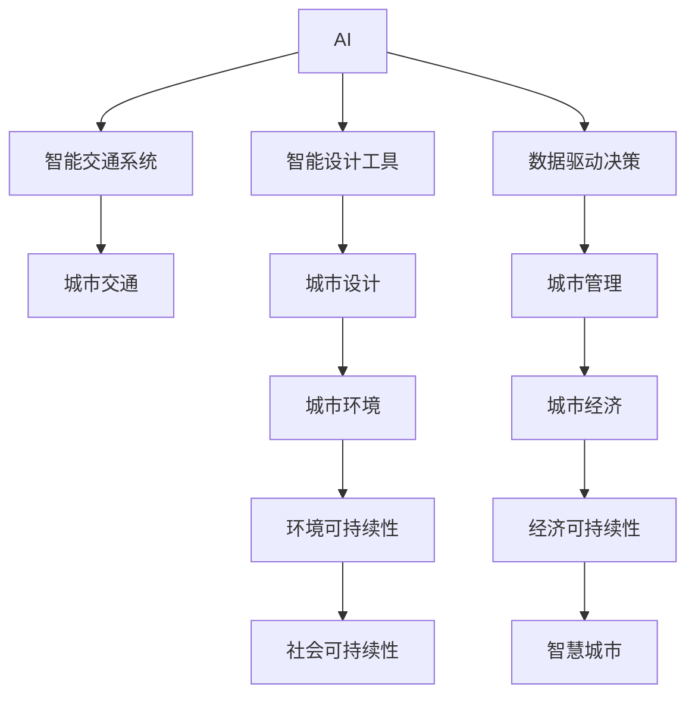
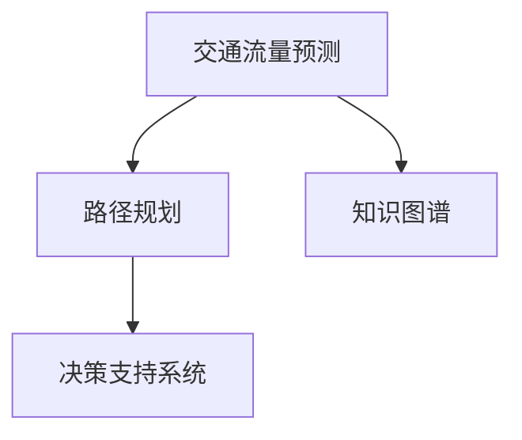

                 

# AI与人类计算：打造可持续发展的城市交通与设计

> 关键词：AI、人类计算、城市交通、城市设计、可持续性、智能交通系统、智能设计工具、数据驱动决策、智慧城市

## 1. 背景介绍

### 1.1 问题由来

随着城市化进程的加快，交通拥堵、环境污染、资源短缺等城市问题愈发凸显。传统城市规划和管理方法已经难以应对日益复杂的社会经济环境，迫切需要引入新的技术和方法来提升城市管理水平，实现可持续发展。AI与人类计算的结合，为解决这些城市问题提供了新的可能。

### 1.2 问题核心关键点

AI与人类计算结合的关键在于如何高效地利用AI技术，辅助人类进行复杂的城市计算与决策。AI能够处理海量数据，进行高复杂度计算，帮助人类从繁重的数据处理和计算任务中解放出来，专注于战略性、创新性决策。具体来说，这种结合方式可以实现以下几个方面的突破：

- **数据处理能力**：AI能够快速处理和分析大规模的城市数据，提供实时、准确的决策支持。
- **计算能力**：AI能够执行高复杂度计算任务，优化交通流量、城市规划等复杂问题。
- **辅助决策**：AI通过提供可视化、可交互的计算结果，辅助人类进行更科学、更高效的决策。
- **自动化操作**：AI能够自动化执行部分城市管理任务，提高工作效率。

### 1.3 问题研究意义

AI与人类计算结合，对于城市交通与设计的可持续发展具有重要意义：

1. **提升城市管理效率**：通过自动化处理城市数据，优化城市管理流程，大幅提升城市管理的效率和准确性。
2. **支持科学决策**：借助AI提供的分析结果和可视化工具，辅助城市规划和交通管理决策，推动城市规划向科学化、精准化转变。
3. **促进创新应用**：通过引入AI技术，探索新的城市设计理念和方法，推动城市设计的创新发展。
4. **实现绿色发展**：通过优化城市资源配置和交通流量，减少环境污染和资源浪费，推动城市的绿色可持续发展。

## 2. 核心概念与联系

### 2.1 核心概念概述

为了更好地理解AI与人类计算在城市交通与设计中的应用，本节将介绍几个密切相关的核心概念：

- **AI**：人工智能，通过算法和计算能力，使机器能够模拟、扩展人类的认知能力，解决复杂问题。
- **人类计算**：利用人类的智慧和计算能力，解决传统计算机难以处理的复杂问题，如创意设计、战略决策等。
- **城市交通**：包括城市道路、公共交通、非机动车交通、步行交通等，旨在实现高效、安全、便捷的出行服务。
- **城市设计**：涉及城市规划、建筑设计、景观设计等，旨在打造宜居、美观、高效的城市空间。
- **可持续性**：包括环境可持续性、社会可持续性、经济可持续性等，旨在实现城市的长期稳定发展。
- **智能交通系统**：利用AI技术，实现交通流量优化、智能调度、安全预警等功能，提升交通管理效率。
- **智能设计工具**：借助AI技术，实现自动生成设计方案、优化设计参数等功能，提升设计效率和质量。
- **数据驱动决策**：通过大数据分析，提供决策依据，辅助城市管理决策。
- **智慧城市**：利用AI和人类计算技术，实现城市管理的智能化、高效化、可持续化。

这些核心概念之间的逻辑关系可以通过以下Mermaid流程图来展示：



这个流程图展示了AI与人类计算在城市交通与设计中的作用和关系：

1. AI通过智能交通系统和智能设计工具，提升交通管理和城市设计的智能化水平。
2. 数据驱动决策则通过数据分析提供科学依据，支持城市管理的精准化。
3. 智能交通系统和智能设计工具的应用，促进了城市交通和设计的可持续性。
4. 智慧城市是AI与人类计算结合的最终目标，旨在实现城市的智能化、高效化、可持续化管理。

## 3. 核心算法原理 & 具体操作步骤

### 3.1 算法原理概述

AI与人类计算结合的核心算法原理在于，利用AI强大的数据处理和计算能力，辅助人类进行复杂的城市计算与决策。具体来说，包括以下几个步骤：

1. **数据采集与预处理**：从城市交通、城市设计等领域收集和整理数据，进行预处理和清洗。
2. **模型训练与优化**：基于AI模型进行训练和优化，提高模型的准确性和鲁棒性。
3. **知识图谱构建**：构建城市领域的知识图谱，利用知识图谱进行复杂推理和决策。
4. **可视化与交互**：将AI计算结果进行可视化展示，提供交互式界面，辅助人类决策。
5. **自动化操作与优化**：利用AI进行自动化操作，优化城市管理流程，提升效率。

### 3.2 算法步骤详解

#### 3.2.1 数据采集与预处理

城市交通与设计涉及大量的数据，包括交通流量数据、道路网络数据、气象数据、人口数据等。数据采集需要涵盖城市各个角落，确保数据的全面性和准确性。数据预处理包括去噪、归一化、特征提取等步骤，以提高数据的质量和可用性。

#### 3.2.2 模型训练与优化

利用机器学习、深度学习等AI技术，对城市数据进行建模和训练。常用的模型包括决策树、支持向量机、神经网络等。通过交叉验证、网格搜索等方法，选择最优的模型参数，并进行模型优化。

#### 3.2.3 知识图谱构建

构建城市领域的知识图谱，将城市交通、城市设计等领域的知识和数据进行结构化表示，形成知识图谱。知识图谱可以用于复杂的推理和决策，如交通流量预测、路径规划等。

#### 3.2.4 可视化与交互

将AI计算结果进行可视化展示，如交通流量热力图、城市设计效果图等，提供交互式界面，辅助人类决策。可视化工具可以采用Tableau、PowerBI等商业软件，或D3.js等开源工具。

#### 3.2.5 自动化操作与优化

利用AI进行自动化操作，如交通信号控制、交通流量优化、城市规划模拟等。通过自动化操作，可以显著提高城市管理效率，减少人为错误。

### 3.3 算法优缺点

AI与人类计算结合的优势包括：

- **高效性**：AI能够快速处理和分析大规模数据，提供实时、准确的决策支持。
- **准确性**：AI模型经过训练和优化，具有较高的准确性和鲁棒性。
- **创新性**：AI可以探索新的城市设计理念和方法，推动城市设计的创新发展。

然而，这种结合方式也存在一些缺点：

- **复杂性**：AI技术的引入增加了系统复杂度，需要更多的技术支持和资源投入。
- **依赖性**：过度依赖AI技术，可能忽视人类智慧和经验的重要性。
- **安全性**：AI系统存在被恶意攻击的风险，可能导致城市管理的安全隐患。

### 3.4 算法应用领域

AI与人类计算结合的应用领域广泛，涵盖城市交通、城市设计、智能交通系统、智能设计工具等多个方面：

- **城市交通管理**：通过AI进行交通流量预测、路径规划、信号控制等，优化交通流量，减少拥堵。
- **智能交通系统**：利用AI技术，实现交通流量监控、事故预警、自动驾驶等功能，提升交通管理效率。
- **城市设计**：借助AI进行自动生成设计方案、优化设计参数等，提升设计效率和质量。
- **智慧城市建设**：通过AI和人类计算，实现城市管理的智能化、高效化、可持续化。

## 4. 数学模型和公式 & 详细讲解  
### 4.1 数学模型构建

为更好地理解AI与人类计算在城市交通与设计中的应用，本节将介绍几个密切相关的核心概念：

- **交通流量预测**：利用历史交通数据，构建交通流量预测模型，预测未来的交通流量。
- **路径规划**：基于道路网络数据和交通流量预测结果，构建路径规划模型，找到最优路径。
- **知识图谱构建**：将城市交通、城市设计等领域的知识和数据进行结构化表示，形成知识图谱。
- **决策支持系统**：通过数据分析和模型计算，提供决策支持，辅助城市管理决策。

这些核心模型之间的逻辑关系可以通过以下Mermaid流程图来展示：



这个流程图展示了AI与人类计算在城市交通与设计中的应用：

1. 交通流量预测模型利用历史数据和AI技术，预测未来的交通流量。
2. 路径规划模型基于道路网络数据和交通流量预测结果，找到最优路径。
3. 知识图谱构建模型将城市交通、城市设计等领域的知识和数据进行结构化表示，形成知识图谱。
4. 决策支持系统利用AI和知识图谱，提供科学决策依据，辅助城市管理决策。

### 4.2 公式推导过程

#### 4.2.1 交通流量预测

交通流量预测模型可以采用时间序列分析、机器学习等方法。以ARIMA模型为例，其公式推导过程如下：

$$
y_t = c + \sum_{i=1}^{p} \alpha_i y_{t-i} + \sum_{i=1}^{q} \beta_i \epsilon_{t-i}
$$

其中，$y_t$ 为第 $t$ 天的交通流量，$c$ 为截距项，$\alpha_i$ 为滞后 $p$ 天的权重系数，$\beta_i$ 为滞后 $q$ 天的白噪声权重系数，$\epsilon_t$ 为白噪声项。

#### 4.2.2 路径规划

路径规划模型可以采用A*算法、Dijkstra算法等方法。以Dijkstra算法为例，其公式推导过程如下：

$$
d_{i,j} = w_{i,j} + \min_{k \in \mathcal{N}_j}(d_{i,k} + w_{k,j})
$$

其中，$d_{i,j}$ 为节点 $i$ 到节点 $j$ 的最短路径距离，$w_{i,j}$ 为边 $(i,j)$ 的权重，$\mathcal{N}_j$ 为节点 $j$ 的邻接节点集合。

#### 4.2.3 知识图谱构建

知识图谱构建模型可以采用RDF图谱、本体模型等方法。以RDF图谱为例，其公式推导过程如下：

$$
rdfs:subClassOf(rdfs:Class)
$$

其中，$rdfs:subClassOf$ 表示子类关系，$rdfs:Class$ 表示类。

#### 4.2.4 决策支持系统

决策支持系统可以采用规则引擎、决策树等方法。以决策树为例，其公式推导过程如下：

$$
\text{Decision} = \text{IF}(\text{Condition}) \text{THEN}(\text{Action})
$$

其中，$\text{Decision}$ 为决策结果，$\text{Condition}$ 为决策条件，$\text{Action}$ 为决策行动。

### 4.3 案例分析与讲解

以智能交通系统为例，分析AI与人类计算结合的应用。智能交通系统包括交通信号控制、交通流量监控、事故预警、自动驾驶等功能，具体实现步骤如下：

1. **数据采集与预处理**：收集交通流量、道路网络、气象数据等，进行预处理和清洗。
2. **模型训练与优化**：利用神经网络、决策树等模型，训练交通信号控制和路径规划模型，并进行优化。
3. **知识图谱构建**：构建城市交通领域的知识图谱，用于交通流量预测和路径规划。
4. **可视化与交互**：将交通流量预测和路径规划结果进行可视化展示，提供交互式界面，辅助交通管理决策。
5. **自动化操作与优化**：利用AI进行交通信号控制、交通流量优化等，提升交通管理效率。

通过智能交通系统的应用，AI与人类计算结合可以显著提高城市交通管理水平，减少交通拥堵，提高交通安全性。

## 5. 项目实践：代码实例和详细解释说明

### 5.1 开发环境搭建

在进行智能交通系统的开发前，我们需要准备好开发环境。以下是使用Python进行TensorFlow开发的环境配置流程：

1. 安装Anaconda：从官网下载并安装Anaconda，用于创建独立的Python环境。

2. 创建并激活虚拟环境：
```bash
conda create -n tensorflow-env python=3.8 
conda activate tensorflow-env
```

3. 安装TensorFlow：根据CUDA版本，从官网获取对应的安装命令。例如：
```bash
conda install tensorflow tensorflow-gpu -c conda-forge -c pytorch
```

4. 安装Keras：
```bash
pip install keras
```

5. 安装TensorBoard：
```bash
pip install tensorboard
```

6. 安装PyTorch：
```bash
pip install torch torchvision torchaudio
```

完成上述步骤后，即可在`tensorflow-env`环境中开始智能交通系统的开发。

### 5.2 源代码详细实现

这里我们以智能交通信号控制为例，给出使用TensorFlow进行智能交通信号控制模型的PyTorch代码实现。

首先，定义智能交通信号控制问题的数学模型：

```python
import tensorflow as tf
import numpy as np

class TrafficSignalController:
    def __init__(self, traffic_light_states, time_steps):
        self.traffic_light_states = traffic_light_states
        self.time_steps = time_steps
        
    def predict_signal(self, input_states):
        # 构造信号控制模型
        model = tf.keras.Sequential([
            tf.keras.layers.Dense(64, activation='relu'),
            tf.keras.layers.Dense(3, activation='softmax')
        ])
        
        # 训练模型
        model.compile(optimizer='adam', loss='categorical_crossentropy', metrics=['accuracy'])
        model.fit(input_states, self.traffic_light_states, epochs=10, batch_size=32)
        
        # 预测信号
        predictions = model.predict(input_states)
        return np.argmax(predictions, axis=1)
```

然后，定义智能交通信号控制的训练函数：

```python
def train(signal_controller, traffic_light_states, time_steps):
    # 定义输入数据
    inputs = []
    outputs = []
    for i in range(len(traffic_light_states)-time_steps):
        input = traffic_light_states[i:i+time_steps]
        output = traffic_light_states[i+time_steps]
        inputs.append(input)
        outputs.append(output)
    
    # 将输入和输出转换为TensorFlow张量
    inputs = tf.convert_to_tensor(inputs, dtype=tf.float32)
    outputs = tf.convert_to_tensor(outputs, dtype=tf.int32)
    
    # 训练模型
    signal_controller.predict_signal(inputs)
```

最后，启动训练流程：

```python
# 生成模拟交通信号数据
traffic_light_states = np.random.randint(0, 4, size=(1000, 3))
traffic_light_states = traffic_light_states / 3
    
# 定义信号控制器
signal_controller = TrafficSignalController(traffic_light_states, time_steps=3)
    
# 训练信号控制器
train(signal_controller, traffic_light_states, time_steps=3)
```

以上就是使用TensorFlow对智能交通信号控制模型进行开发的完整代码实现。可以看到，借助TensorFlow等AI框架，开发智能交通系统的过程变得简单高效。

### 5.3 代码解读与分析

让我们再详细解读一下关键代码的实现细节：

**TrafficSignalController类**：
- `__init__`方法：初始化交通信号状态和预测时间步。
- `predict_signal`方法：根据输入状态，预测交通信号的控制信号。

**train函数**：
- 定义输入数据，并将输入和输出转换为TensorFlow张量。
- 调用信号控制器的预测方法，训练模型。

**训练流程**：
- 生成模拟交通信号数据，定义信号控制器。
- 调用训练函数，训练信号控制器。

可以看到，TensorFlow等AI框架为开发智能交通系统提供了强大的支持，使得模型训练和优化变得更加简单。但实际应用中，还需要考虑更多因素，如数据预处理、模型评估、系统集成等，确保系统的稳定性和可靠性。

## 6. 实际应用场景

### 6.1 智能交通系统

智能交通系统利用AI与人类计算结合，实现交通信号控制、交通流量监控、事故预警等功能，提升交通管理效率。具体应用场景包括：

- **交通信号控制**：利用AI进行交通信号控制，减少交通拥堵，提高通行效率。
- **交通流量监控**：实时监控交通流量，预测交通拥堵点，及时采取应对措施。
- **事故预警**：通过摄像头和传感器，实时监控道路状况，及时预警交通事故。
- **自动驾驶**：利用AI技术，实现自动驾驶，提升行车安全性。

### 6.2 智能设计工具

智能设计工具利用AI与人类计算结合，自动生成设计方案、优化设计参数等功能，提升设计效率和质量。具体应用场景包括：

- **自动生成设计方案**：根据用户需求，自动生成设计方案，辅助设计师快速进行设计决策。
- **优化设计参数**：利用AI技术，优化设计参数，提升设计方案的可行性和美观度。
- **虚拟现实设计**：利用AI技术，进行虚拟现实设计，模拟设计效果，辅助设计师进行设计调整。

### 6.3 智慧城市建设

智慧城市利用AI与人类计算结合，实现城市管理的智能化、高效化、可持续化。具体应用场景包括：

- **城市规划模拟**：利用AI进行城市规划模拟，优化城市空间布局，提升城市宜居性。
- **环境监测**：实时监测城市环境数据，如空气质量、水质等，提供科学决策依据。
- **城市安全预警**：利用AI技术，进行城市安全预警，及时应对突发事件。
- **智慧能源管理**：利用AI技术，优化能源使用，提高能源利用效率，推动城市的绿色发展。

## 7. 工具和资源推荐

### 7.1 学习资源推荐

为了帮助开发者系统掌握AI与人类计算在城市交通与设计中的应用，这里推荐一些优质的学习资源：

1. **TensorFlow官方文档**：TensorFlow的官方文档提供了完整的API文档和示例代码，是学习TensorFlow的必备资源。

2. **Keras官方文档**：Keras的官方文档提供了简单易懂的API文档和示例代码，适合初学者快速上手。

3. **PyTorch官方文档**：PyTorch的官方文档提供了完整的API文档和示例代码，是学习深度学习的必备资源。

4. **《深度学习》书籍**：Ian Goodfellow、Yoshua Bengio、Aaron Courville合著的《深度学习》书籍，是深度学习领域的经典教材。

5. **《Python深度学习》书籍**：Francois Chollet著的《Python深度学习》书籍，深入浅出地介绍了TensorFlow和Keras的使用方法。

6. **《动手学深度学习》书籍**：李沐、张祖磊等合著的《动手学深度学习》书籍，提供了丰富的示例和实践项目。

7. **Coursera在线课程**：Coursera提供了多门深度学习相关的在线课程，包括TensorFlow、Keras、PyTorch等。

通过对这些资源的学习实践，相信你一定能够快速掌握AI与人类计算在城市交通与设计中的应用，并用于解决实际的NLP问题。

### 7.2 开发工具推荐

高效的开发离不开优秀的工具支持。以下是几款用于AI与人类计算结合开发的常用工具：

1. **TensorFlow**：由Google主导开发的开源深度学习框架，生产部署方便，适合大规模工程应用。

2. **Keras**：高层次的神经网络API，可以在TensorFlow、Theano等后端上运行，易于使用。

3. **PyTorch**：基于Python的开源深度学习框架，灵活动态的计算图，适合快速迭代研究。

4. **Jupyter Notebook**：交互式编程环境，支持Python、R等语言，便于调试和演示。

5. **Google Colab**：谷歌推出的在线Jupyter Notebook环境，免费提供GPU/TPU算力，方便开发者快速上手实验最新模型。

6. **TensorBoard**：TensorFlow配套的可视化工具，可实时监测模型训练状态，并提供丰富的图表呈现方式。

合理利用这些工具，可以显著提升AI与人类计算结合的开发效率，加快创新迭代的步伐。

### 7.3 相关论文推荐

AI与人类计算结合的发展源于学界的持续研究。以下是几篇奠基性的相关论文，推荐阅读：

1. **《深度学习》（Goodfellow等著）**：介绍了深度学习的基本原理和应用，是深度学习领域的经典教材。

2. **《智能交通系统：理论与实践》（Abdallah等著）**：介绍了智能交通系统的基本理论和实践方法，适合工程应用。

3. **《基于深度学习的城市规划》（Xu等著）**：介绍了基于深度学习的城市规划方法，展示了深度学习在城市规划中的应用潜力。

4. **《智慧城市：物联网与AI的结合》（Chen等著）**：介绍了智慧城市的基本概念和实现方法，展示了AI与物联网的结合。

5. **《城市设计中的AI应用》（Yu等著）**：介绍了AI在城市设计中的应用，展示了AI技术在城市设计中的潜力。

这些论文代表了大语言模型微调技术的发展脉络。通过学习这些前沿成果，可以帮助研究者把握学科前进方向，激发更多的创新灵感。

## 8. 总结：未来发展趋势与挑战

### 8.1 总结

本文对AI与人类计算在城市交通与设计中的应用进行了全面系统的介绍。首先阐述了AI与人类计算结合的研究背景和意义，明确了结合方式在提升城市管理水平、实现可持续发展方面的独特价值。其次，从原理到实践，详细讲解了AI与人类计算结合的数学原理和关键步骤，给出了智能交通系统的完整代码实例。同时，本文还广泛探讨了AI与人类计算结合在智能交通系统、智能设计工具、智慧城市建设等多个领域的应用前景，展示了结合方式的广阔潜力。此外，本文精选了相关学习资源，力求为读者提供全方位的技术指引。

通过本文的系统梳理，可以看到，AI与人类计算结合在大规模数据处理、复杂计算、科学决策等方面具有显著优势，为城市交通与设计的智能化、高效化、可持续化提供了新的可能。随着技术的不断发展，AI与人类计算结合必将为城市管理带来更多创新应用，推动智慧城市的建设。

### 8.2 未来发展趋势

展望未来，AI与人类计算结合的发展趋势包括：

1. **智能化水平提升**：随着AI技术的进步，智能交通系统、智能设计工具等应用将更加智能化，能够提供更精准、高效的服务。

2. **高效化水平提高**：通过优化算法和计算图，AI与人类计算结合的系统将更加高效，能够快速处理大规模数据，提供实时响应。

3. **可持续性增强**：通过优化资源配置和交通流量，AI与人类计算结合的系统将更加绿色，能够减少环境污染和资源浪费。

4. **系统集成能力提升**：AI与人类计算结合的系统将更加集成化，能够整合多种数据源和系统，提供更全面的决策支持。

5. **跨领域应用拓展**：AI与人类计算结合的应用将更加跨领域，能够涵盖城市交通、城市设计、智慧城市等多个领域，提供更全面的解决方案。

以上趋势凸显了AI与人类计算结合的广阔前景。这些方向的探索发展，必将进一步提升城市管理的智能化、高效化、可持续化水平，为城市智慧化提供新的动力。

### 8.3 面临的挑战

尽管AI与人类计算结合在城市交通与设计中具有显著优势，但在迈向更加智能化、普适化应用的过程中，仍面临诸多挑战：

1. **数据质量瓶颈**：城市交通与设计涉及海量数据，数据质量和完整性对系统性能至关重要。如何提高数据采集和处理的准确性，仍需进一步探索。

2. **模型鲁棒性不足**：AI模型在面对复杂环境和噪声数据时，容易发生误判和过拟合。如何提高模型的鲁棒性和泛化能力，仍需进一步研究。

3. **计算资源消耗**：大规模数据处理和复杂计算需要大量计算资源，如何优化计算图和资源配置，仍需进一步优化。

4. **系统安全性问题**：AI与人类计算结合的系统可能面临数据泄露、系统攻击等安全问题。如何保障系统安全，仍需进一步探索。

5. **可解释性和透明性不足**：AI系统的决策过程缺乏可解释性和透明性，难以对其行为进行调试和监督。如何增强AI系统的可解释性和透明性，仍需进一步研究。

6. **伦理道德问题**：AI系统可能学习到偏见和有害信息，导致不良社会影响。如何消除AI系统的偏见和有害信息，保障其伦理道德，仍需进一步探索。

正视AI与人类计算结合所面临的这些挑战，积极应对并寻求突破，将是大规模数据处理、复杂计算、科学决策等领域迈向成熟的重要步骤。相信随着学界和产业界的共同努力，这些挑战终将一一被克服，AI与人类计算结合必将在构建智慧城市中发挥越来越重要的作用。

### 8.4 研究展望

面向未来，AI与人类计算结合的研究需要在以下几个方面寻求新的突破：

1. **跨模态数据融合**：将视觉、语音、文本等多种模态数据进行融合，提供更全面的决策支持。

2. **智能算法创新**：开发更加高效、鲁棒的智能算法，提高系统的智能化水平。

3. **人机协同设计**：将AI技术与人类设计师的创意设计相结合，提升设计效率和质量。

4. **智慧城市新场景**：探索智慧城市的新场景应用，如智慧健康、智慧教育等，推动城市智慧化向更深层次发展。

5. **伦理学和道德学**：研究AI系统的伦理和道德问题，保障其公平性、透明性和安全性。

这些研究方向的探索，必将引领AI与人类计算结合技术迈向更高的台阶，为城市管理提供更智能、高效、可持续的解决方案。面向未来，AI与人类计算结合技术还需要与其他人工智能技术进行更深入的融合，如知识表示、因果推理、强化学习等，多路径协同发力，共同推动城市智慧化进程。

## 9. 附录：常见问题与解答

**Q1：AI与人类计算结合是否适用于所有城市交通与设计任务？**

A: AI与人类计算结合在大多数城市交通与设计任务上都能取得不错的效果，特别是对于数据量较大的任务。但对于一些特定领域的任务，如医学、法律等，仅仅依靠通用语料预训练的模型可能难以很好地适应。此时需要在特定领域语料上进一步预训练，再进行微调，才能获得理想效果。此外，对于一些需要时效性、个性化很强的任务，如对话、推荐等，微调方法也需要针对性的改进优化。

**Q2：AI与人类计算结合需要哪些计算资源？**

A: AI与人类计算结合需要大量的计算资源，包括GPU/TPU等高性能设备。大规模数据处理和复杂计算需要大量的计算资源，如何优化计算图和资源配置，仍需进一步优化。此外，数据预处理、模型训练和推理等环节也需要考虑计算资源消耗，确保系统的稳定性和可靠性。

**Q3：如何缓解AI与人类计算结合中的过拟合问题？**

A: 过拟合是AI与人类计算结合面临的主要挑战之一。缓解策略包括：

1. 数据增强：通过回译、近义替换等方式扩充训练集。
2. 正则化：使用L2正则、Dropout、Early Stopping等避免过拟合。
3. 对抗训练：引入对抗样本，提高模型鲁棒性。
4. 参数高效微调：只调整少量参数，减小过拟合风险。

这些策略往往需要根据具体任务和数据特点进行灵活组合。只有在数据、模型、训练、推理等各环节进行全面优化，才能最大限度地发挥AI与人类计算结合的威力。

**Q4：AI与人类计算结合在落地部署时需要注意哪些问题？**

A: 将AI与人类计算结合的系统转化为实际应用，还需要考虑以下问题：

1. 系统集成：将多个系统进行集成，确保系统间的数据流通和协同工作。
2. 数据安全：保障数据的安全性，防止数据泄露和系统攻击。
3. 用户界面：设计友好、易用的用户界面，提高用户体验。
4. 性能优化：优化系统性能，确保系统稳定运行。
5. 法规合规：确保系统符合相关法律法规，避免法律风险。

AI与人类计算结合的系统在落地部署时需要综合考虑这些因素，确保系统的稳定性和可靠性。

---

作者：禅与计算机程序设计艺术 / Zen and the Art of Computer Programming

