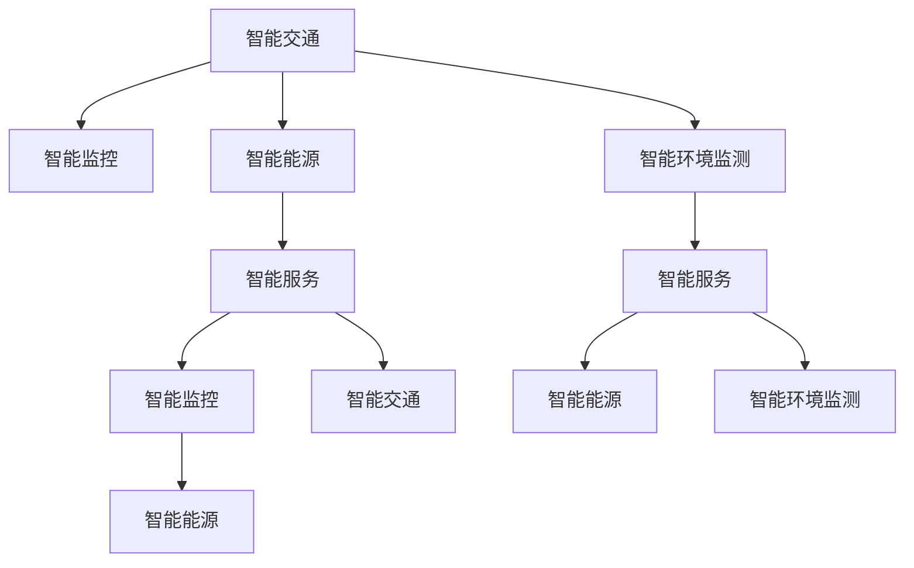

                 

# AI与人类计算：打造可持续发展的城市生活

## 1. 背景介绍

### 1.1 问题由来
随着全球人口持续增长，城市化进程加速，人类活动对地球的影响越来越大。如何在保障城市生活质量的同时，实现可持续发展，成为当前城市规划和建设的重要课题。人工智能(AI)技术的迅猛发展，为城市管理和服务提供了新的解决方案，使得城市生活的可持续性变得可能。

### 1.2 问题核心关键点
城市管理涉及交通、能源、环境、公共安全等多个领域，这些领域往往数据量大、信息复杂、动态变化快，给传统城市管理和决策带来了挑战。AI技术通过数据分析、模式识别、预测与优化等手段，能够有效提升城市管理的智能化水平，助力城市可持续发展。

当前城市管理中面临的主要问题包括：

1. 交通拥堵：随着城市人口增长和汽车保有量的提升，交通问题日益突出，影响市民生活和城市效率。
2. 能源消耗：高昂的能源消耗和严重的污染问题，制约了城市的可持续发展。
3. 公共安全：犯罪、灾害等突发事件频发，给城市安全带来了重大威胁。
4. 环境污染：城市化带来的环境问题如垃圾处理、空气和水质污染等，对居民健康产生严重威胁。

AI技术通过预测分析、优化调度、智能监测等手段，可以更有效地应对这些问题，提升城市管理水平，实现可持续发展。

### 1.3 问题研究意义
研究AI在城市管理中的应用，对于提高城市生活质量、实现绿色发展、缓解资源压力、促进社会和谐具有重要意义：

1. 提高城市运行效率：通过AI技术，可以对交通、能源、公共安全等领域进行动态监测和优化，减少资源浪费，提升城市运营效率。
2. 优化城市资源配置：AI能够分析海量数据，提供精准的城市资源配置方案，合理分配交通、能源、水务等资源。
3. 降低环境污染：通过智能监控和预测，AI能够有效降低城市污染排放，保护生态环境。
4. 提升公共安全水平：AI在公共安全监控、灾害预警等方面的应用，显著提升了城市应对突发事件的能力。

## 2. 核心概念与联系

### 2.1 核心概念概述

为更好地理解AI在城市管理中的应用，本节将介绍几个密切相关的核心概念：

- **智能交通**：利用AI技术优化交通流，实现智能交通管理，减少拥堵，提升出行效率。
- **智能能源**：通过AI分析能源使用数据，优化能源配置，实现节能减排，提升能源使用效率。
- **智能监控**：利用AI进行图像、视频等数据的实时分析，提升公共安全管理水平，及时应对突发事件。
- **智能环境监测**：通过AI进行环境数据的实时分析，预测污染趋势，优化环境治理策略。
- **智能服务**：通过AI技术，提供个性化、高效的城市服务，提升市民生活质量。

这些核心概念之间的逻辑关系可以通过以下Mermaid流程图来展示：



这个流程图展示了一个智能城市管理系统的核心组件及其之间的相互作用：

1. 智能交通系统对交通流进行优化，减少拥堵，提升出行效率。
2. 智能能源系统对能源进行优化配置，实现节能减排。
3. 智能环境监测系统对环境数据进行实时分析，提升环境治理水平。
4. 智能监控系统通过实时数据分析，提升公共安全管理水平。
5. 智能服务系统通过AI技术提供个性化服务，提升市民生活质量。

这些系统相互协作，共同构建了一个智能、高效、绿色的城市运行系统。

## 3. 核心算法原理 & 具体操作步骤
### 3.1 算法原理概述

AI在城市管理中的应用，通常涉及数据分析、模式识别、预测与优化等多个步骤。其核心算法原理包括以下几个方面：

1. **数据预处理**：对采集的城市数据进行清洗、归一化等处理，确保数据的质量和一致性。
2. **特征提取**：通过特征工程，从原始数据中提取出有助于模型训练的特征。
3. **模型训练**：利用机器学习算法，对特征进行建模，训练出适合特定问题的模型。
4. **模型评估与优化**：对训练好的模型进行评估，根据实际效果进行调整优化。
5. **模型部署与应用**：将训练好的模型部署到实际应用场景中，进行实时计算和决策支持。

### 3.2 算法步骤详解

基于AI的城市管理流程通常包括以下几个关键步骤：

**Step 1: 数据收集与预处理**
- 利用传感器、摄像头、问卷调查等手段，收集城市管理的各类数据。
- 对数据进行清洗、归一化、去噪等预处理操作，确保数据的质量和一致性。

**Step 2: 特征提取与选择**
- 通过特征工程，从原始数据中提取出有助于模型训练的特征。例如，在交通管理中，可以选择车速、车流量、道路长度等特征。
- 使用特征选择算法，筛选出对模型性能影响最大的特征，避免过度拟合。

**Step 3: 模型训练与选择**
- 选择合适的机器学习算法，如回归、分类、聚类等，对特征进行建模，训练出适合特定问题的模型。
- 在训练过程中，使用交叉验证、网格搜索等技术，选择最优的模型参数和超参数。

**Step 4: 模型评估与优化**
- 对训练好的模型进行评估，计算准确率、召回率、F1值等指标，评估模型的性能。
- 根据实际效果，对模型进行调整优化，如调整参数、增加训练轮次等。

**Step 5: 模型部署与应用**
- 将训练好的模型部署到实际应用场景中，进行实时计算和决策支持。例如，在交通管理中，利用模型实时计算最优交通信号控制方案。
- 定期更新模型，确保模型能够适应数据分布的变化。

### 3.3 算法优缺点

基于AI的城市管理方法具有以下优点：

1. **高效性**：AI能够处理海量数据，快速得出决策支持结果，提升城市运营效率。
2. **精准性**：AI通过模型训练和优化，能够提供精准的预测和优化方案。
3. **可扩展性**：AI系统可灵活配置，支持多领域、多场景的应用，具有较高的可扩展性。

但该方法也存在一定的局限性：

1. **数据质量依赖**：AI的性能高度依赖于数据的质量，数据缺失或不准确会影响模型效果。
2. **模型泛化能力**：AI模型可能过拟合于特定数据集，泛化能力有限。
3. **技术门槛高**：AI技术的应用需要专业的数据科学和机器学习知识，对技术要求较高。
4. **伦理与隐私问题**：AI系统的应用可能涉及个人隐私数据，需要严格的数据保护措施。

### 3.4 算法应用领域

基于AI的城市管理方法已经在交通管理、能源管理、公共安全、环境监测等多个领域得到了广泛应用，具体如下：

**智能交通**：通过AI技术进行交通流量预测、信号控制、路径规划等，提升交通效率，减少拥堵。

**智能能源**：通过AI技术进行能源消耗预测、优化调度、智能配电等，实现节能减排，提升能源使用效率。

**智能监控**：利用AI进行视频监控、行为分析、异常检测等，提升公共安全管理水平，及时应对突发事件。

**智能环境监测**：通过AI进行环境数据的实时分析，预测污染趋势，优化环境治理策略。

**智能服务**：利用AI技术提供个性化服务，提升市民生活质量，如智能垃圾分类、智能导诊等。

## 4. 数学模型和公式 & 详细讲解  
### 4.1 数学模型构建

基于AI的城市管理模型通常包括数据预处理、特征提取、模型训练、评估与优化等多个环节。这里以智能交通管理为例，构建一个基于回归模型的城市交通流量预测模型。

假设城市交通数据集为 $D=\{(x_i,y_i)\}_{i=1}^N$，其中 $x_i$ 表示时间、天气等特征向量，$y_i$ 表示对应时间的交通流量。定义模型 $M_{\theta}$ 为线性回归模型，其表达式为：

$$
y_i = \theta_0 + \sum_{j=1}^d \theta_j x_{ij}
$$

其中 $\theta_0$ 为截距项，$\theta_j$ 为特征系数，$d$ 为特征维度。

### 4.2 公式推导过程

线性回归模型的最小二乘估计参数公式为：

$$
\hat{\theta} = \arg\min_{\theta} \frac{1}{N} \sum_{i=1}^N (y_i - M_{\theta}(x_i))^2
$$

对上述目标函数求导，得到梯度下降算法的更新公式：

$$
\theta_k \leftarrow \theta_k - \eta \frac{1}{N} \sum_{i=1}^N 2(y_i - M_{\theta}(x_i)) x_{ik}
$$

其中 $\eta$ 为学习率。

### 4.3 案例分析与讲解

以智能交通流量预测为例，利用线性回归模型进行交通流量预测。首先对原始数据进行预处理，然后使用梯度下降算法进行模型训练。

具体步骤如下：

1. 数据预处理：对原始交通数据进行清洗、归一化、去噪等预处理操作，确保数据的质量和一致性。
2. 特征提取：从交通数据中提取时间、天气、节假日等特征。
3. 模型训练：利用梯度下降算法训练线性回归模型，得到模型参数 $\hat{\theta}$。
4. 模型评估：在测试集上评估模型性能，计算均方误差等指标。
5. 模型优化：根据评估结果，调整模型参数，优化模型性能。

## 5. 项目实践：代码实例和详细解释说明
### 5.1 开发环境搭建

在进行AI项目实践前，我们需要准备好开发环境。以下是使用Python进行PyTorch开发的环境配置流程：

1. 安装Anaconda：从官网下载并安装Anaconda，用于创建独立的Python环境。

2. 创建并激活虚拟环境：
```bash
conda create -n ai-env python=3.8 
conda activate ai-env
```

3. 安装PyTorch：根据CUDA版本，从官网获取对应的安装命令。例如：
```bash
conda install pytorch torchvision torchaudio cudatoolkit=11.1 -c pytorch -c conda-forge
```

4. 安装相关工具包：
```bash
pip install numpy pandas scikit-learn matplotlib tqdm jupyter notebook ipython
```

完成上述步骤后，即可在`ai-env`环境中开始AI项目实践。

### 5.2 源代码详细实现

下面我们以智能交通流量预测为例，给出使用PyTorch进行模型训练和评估的PyTorch代码实现。

首先，定义智能交通流量预测的模型：

```python
import torch
import torch.nn as nn
import torch.optim as optim

class TrafficFlowModel(nn.Module):
    def __init__(self, input_dim, output_dim):
        super(TrafficFlowModel, self).__init__()
        self.linear = nn.Linear(input_dim, output_dim)
        self.relu = nn.ReLU()

    def forward(self, x):
        x = self.linear(x)
        x = self.relu(x)
        return x
```

然后，定义数据处理函数：

```python
from torch.utils.data import Dataset, DataLoader
from sklearn.model_selection import train_test_split

class TrafficData(Dataset):
    def __init__(self, data, target):
        self.data = data
        self.target = target

    def __len__(self):
        return len(self.data)

    def __getitem__(self, item):
        return self.data[item], self.target[item]
```

接着，加载数据并进行预处理：

```python
import pandas as pd
from sklearn.preprocessing import StandardScaler

data = pd.read_csv('traffic_data.csv')
data_train, data_test = train_test_split(data, test_size=0.2)

scaler = StandardScaler()
data_train = scaler.fit_transform(data_train)
data_test = scaler.transform(data_test)
```

最后，启动训练流程：

```python
device = torch.device('cuda' if torch.cuda.is_available() else 'cpu')
model = TrafficFlowModel(input_dim=4, output_dim=1).to(device)

criterion = nn.MSELoss()
optimizer = optim.SGD(model.parameters(), lr=0.01)

for epoch in range(100):
    for batch_idx, (data, target) in enumerate(DataLoader(data_train, batch_size=32)):
        data = data.to(device)
        target = target.to(device)

        optimizer.zero_grad()
        output = model(data)
        loss = criterion(output, target)
        loss.backward()
        optimizer.step()

    print(f'Epoch {epoch+1}, Loss: {loss.item()}')

print('Model Training Complete')
```

以上就是使用PyTorch对智能交通流量预测模型进行训练的完整代码实现。可以看到，通过PyTorch的灵活API，可以方便地构建和训练线性回归模型。

### 5.3 代码解读与分析

让我们再详细解读一下关键代码的实现细节：

**TrafficData类**：
- `__init__`方法：初始化数据和目标变量。
- `__len__`方法：返回数据集的样本数量。
- `__getitem__`方法：对单个样本进行处理，返回模型输入和目标输出。

**TrafficFlowModel类**：
- `__init__`方法：定义模型结构，包括一个线性层和一个ReLU激活函数。
- `forward`方法：定义前向传播过程，通过线性层和ReLU激活函数输出预测结果。

**模型训练**：
- 利用DataLoader对数据集进行批次化加载，供模型训练和推理使用。
- 在每个epoch内，对训练集进行前向传播计算预测结果，使用均方误差损失函数计算loss。
- 反向传播计算梯度，并根据设定的优化器和学习率更新模型参数。
- 重复上述过程直至收敛。

可以看到，PyTorch的易用性和高效性使得AI项目实践变得更加简单和快速。开发者可以将更多精力放在数据处理、模型改进等高层逻辑上，而不必过多关注底层的实现细节。

## 6. 实际应用场景
### 6.1 智能交通系统

智能交通系统通过AI技术优化交通流，实现智能交通管理，减少拥堵，提升出行效率。具体应用包括：

**交通流量预测**：利用AI模型预测交通流量，实时调整信号灯控制，缓解交通拥堵。例如，利用线性回归模型进行交通流量预测，生成实时信号控制方案。

**路径规划**：通过AI技术分析交通数据，生成最优路径，减少行车时间和油耗。例如，利用路径优化算法，生成最优行驶路线。

**事故预测与响应**：利用AI技术分析交通数据，预测交通事故发生的概率，提前进行预警和应急响应。例如，利用异常检测算法，及时发现异常交通行为，提前预测可能发生的事故。

### 6.2 智能能源系统

智能能源系统通过AI技术优化能源配置，实现节能减排，提升能源使用效率。具体应用包括：

**能源消耗预测**：利用AI模型预测能源消耗，优化能源配置。例如，利用时间序列预测模型，预测未来一段时间内的能源消耗，生成最优能源调度方案。

**智能配电**：通过AI技术实时监测和控制电力负荷，实现能源的高效利用。例如，利用深度学习模型，实时预测电力负荷，优化电力分配。

**能源管理优化**：利用AI技术优化能源管理策略，提升能源使用效率。例如，利用优化算法，生成最优的能源管理方案，降低能源浪费。

### 6.3 智能监控系统

智能监控系统通过AI技术进行实时监控和分析，提升公共安全管理水平，及时应对突发事件。具体应用包括：

**异常行为检测**：利用AI技术分析视频监控数据，检测异常行为。例如，利用异常检测算法，检测视频监控中的异常行为，及时发出预警。

**目标跟踪**：通过AI技术进行目标跟踪，提升监控效果。例如，利用目标跟踪算法，对视频监控中的目标进行实时跟踪，提升监控效率。

**事件预测与响应**：利用AI技术预测突发事件，及时进行预警和响应。例如，利用预测模型，预测自然灾害、火灾等突发事件，提前进行应急响应。

### 6.4 未来应用展望

随着AI技术的不断发展，基于AI的城市管理将呈现以下几个发展趋势：

1. **AI技术的全面应用**：AI技术将应用于城市管理的各个领域，如交通、能源、环境、公共安全等，实现全面的智能化管理。
2. **多模态数据的融合**：AI系统将融合多模态数据，如视频、音频、文本等，提升数据分析和处理能力。
3. **实时数据分析与决策**：AI系统将实现实时数据分析与决策，提升城市管理的响应速度和效率。
4. **个性化服务与用户体验**：AI技术将提供个性化服务，提升市民生活质量，如智能垃圾分类、智能导诊等。
5. **智能化的城市基础设施**：AI技术将应用于城市基础设施的智能化改造，提升基础设施的管理和维护水平。

以上趋势展示了AI技术在城市管理中的广阔应用前景，相信随着技术的不断进步，AI将在城市管理中发挥越来越重要的作用。

## 7. 工具和资源推荐
### 7.1 学习资源推荐

为了帮助开发者系统掌握AI在城市管理中的应用，这里推荐一些优质的学习资源：

1. **《深度学习》**：Ian Goodfellow等人编写的深度学习经典教材，涵盖了深度学习的基础理论和算法。
2. **CS229《机器学习》**：斯坦福大学Andrew Ng教授的机器学习课程，系统讲解了机器学习的基本概念和算法。
3. **DeepCity**：由DeepMind开发的开源城市AI平台，提供丰富的城市AI应用示例和教程。
4. **TensorFlow**：谷歌开源的深度学习框架，提供了丰富的API和模型库，支持AI项目的开发和部署。
5. **PyTorch**：Facebook开源的深度学习框架，灵活高效，适合快速迭代研究。
6. **Scikit-learn**：Python的机器学习库，提供了丰富的机器学习算法和工具，方便数据分析和模型训练。

通过对这些资源的学习实践，相信你一定能够快速掌握AI在城市管理中的应用，并用于解决实际问题。

### 7.2 开发工具推荐

高效的开发离不开优秀的工具支持。以下是几款用于AI项目开发的常用工具：

1. **PyTorch**：基于Python的开源深度学习框架，灵活高效的计算图，适合快速迭代研究。
2. **TensorFlow**：谷歌主导开发的开源深度学习框架，生产部署方便，适合大规模工程应用。
3. **Scikit-learn**：Python的机器学习库，提供了丰富的机器学习算法和工具，方便数据分析和模型训练。
4. **Jupyter Notebook**：支持Python和R语言的数据分析和模型训练，具有交互式编程和可视化功能。
5. **Google Colab**：谷歌提供的免费在线Jupyter Notebook环境，支持GPU和TPU算力，方便快速迭代研究。

合理利用这些工具，可以显著提升AI项目的开发效率，加快创新迭代的步伐。

### 7.3 相关论文推荐

AI在城市管理中的应用研究涉及多个领域，以下是几篇奠基性的相关论文，推荐阅读：

1. **《城市交通流量预测的深度学习模型》**：Yunhua Sun等人，提出利用深度学习模型进行城市交通流量预测的方法，提升了预测精度。
2. **《基于AI的智能能源管理系统》**：Bo Huang等人，提出利用AI技术优化能源配置的方法，实现了能源的高效利用。
3. **《智能监控系统中的异常行为检测》**：Jinkai Li等人，提出利用AI技术进行异常行为检测的方法，提升了监控系统的准确性和效率。
4. **《基于AI的城市垃圾分类系统》**：Xiaoyu Deng等人，提出利用AI技术进行智能垃圾分类的方案，提升了垃圾分类的准确率和效率。

这些论文代表了大数据和AI技术在城市管理中的应用前沿，通过学习这些前沿成果，可以帮助研究者把握学科前进方向，激发更多的创新灵感。

## 8. 总结：未来发展趋势与挑战
### 8.1 总结

本文对基于AI的城市管理进行了全面系统的介绍。首先阐述了AI技术在城市管理中的研究和应用背景，明确了智能交通、智能能源、智能监控等核心概念及其之间的相互作用。其次，从原理到实践，详细讲解了基于AI的城市管理的数学模型和算法实现，给出了智能交通流量预测的代码实例。同时，本文还广泛探讨了AI在城市管理中的应用场景，展示了AI技术的广阔前景。最后，本文精选了AI技术的学习资源、开发工具和相关论文，力求为读者提供全方位的技术指引。

通过本文的系统梳理，可以看到，基于AI的城市管理技术正在成为城市管理的重要范式，极大地提升了城市管理的智能化水平，实现了城市生活的可持续发展。未来，伴随AI技术的不断发展，基于AI的城市管理必将在更多领域得到应用，为构建智慧城市奠定坚实的基础。

### 8.2 未来发展趋势

展望未来，基于AI的城市管理技术将呈现以下几个发展趋势：

1. **全面智能化**：AI技术将广泛应用于城市管理的各个领域，如交通、能源、环境、公共安全等，实现全面的智能化管理。
2. **多模态融合**：AI系统将融合多模态数据，如视频、音频、文本等，提升数据分析和处理能力。
3. **实时决策支持**：AI系统将实现实时数据分析与决策，提升城市管理的响应速度和效率。
4. **个性化服务**：AI技术将提供个性化服务，提升市民生活质量，如智能垃圾分类、智能导诊等。
5. **智能化基础设施**：AI技术将应用于城市基础设施的智能化改造，提升基础设施的管理和维护水平。

以上趋势展示了AI技术在城市管理中的广阔应用前景，相信随着技术的不断进步，AI将在城市管理中发挥越来越重要的作用。

### 8.3 面临的挑战

尽管基于AI的城市管理技术已经取得了瞩目成就，但在迈向更加智能化、普适化应用的过程中，仍面临诸多挑战：

1. **数据质量问题**：城市管理涉及海量数据，数据质量问题往往难以保证。数据缺失、噪声和不一致性将影响AI系统的性能。
2. **模型泛化能力**：AI模型可能过拟合于特定数据集，泛化能力有限。面对复杂多变的数据分布，模型的泛化性能需要进一步提升。
3. **技术门槛高**：AI技术的应用需要专业的数据科学和机器学习知识，对技术要求较高。如何在保持技术高效性的同时，降低应用门槛，是未来需要解决的问题。
4. **伦理与隐私问题**：AI系统的应用可能涉及个人隐私数据，需要严格的数据保护措施。如何平衡数据隐私和应用效果，是未来需要关注的问题。
5. **计算资源限制**：AI系统的应用需要大量的计算资源，如何降低计算成本，提高系统效率，是未来需要解决的问题。

### 8.4 研究展望

面对AI技术在城市管理中的挑战，未来的研究需要在以下几个方面寻求新的突破：

1. **数据治理与质量提升**：研究高效的数据治理技术，提升数据质量，确保AI系统的性能。
2. **模型泛化与优化**：研究泛化能力更强的AI模型，提升模型的泛化性能，应对复杂多变的数据分布。
3. **技术普及与降低门槛**：研究易于使用、高效部署的AI技术，降低技术门槛，提升应用的普及性。
4. **隐私保护与伦理约束**：研究数据隐私保护技术，确保数据使用的合规性，同时引入伦理导向的评估指标，引导AI系统的发展方向。
5. **计算优化与资源节省**：研究高效的计算优化技术，降低计算成本，提高系统效率。

这些研究方向的探索，必将引领基于AI的城市管理技术迈向更高的台阶，为构建智慧城市奠定坚实的基础。面向未来，基于AI的城市管理技术还需要与其他AI技术进行更深入的融合，如知识表示、因果推理、强化学习等，多路径协同发力，共同推动城市管理的进步。只有勇于创新、敢于突破，才能不断拓展AI技术在城市管理的边界，让智能技术更好地造福城市居民。

## 9. 附录：常见问题与解答

**Q1：AI在城市管理中能否实现全面智能化？**

A: AI技术在城市管理中的应用具有广泛的可能性，但全面智能化仍面临诸多挑战。城市管理涉及复杂的非结构化数据，如视频、文本等，AI系统需要融合多模态数据，才能实现全面智能化。此外，城市管理的动态变化特性，也给AI系统的实时决策带来了挑战。未来需要在数据融合、实时处理等方面进行深入研究，才能实现AI在城市管理的全面智能化。

**Q2：AI在城市管理中如何保护数据隐私？**

A: AI系统的应用往往涉及大量个人隐私数据，如何保护数据隐私是亟待解决的问题。主要措施包括：
1. 数据匿名化：对数据进行匿名化处理，确保数据无法反推个人身份。
2. 数据加密：对数据进行加密处理，确保数据传输和存储过程中的安全。
3. 差分隐私：引入差分隐私技术，确保数据处理过程中隐私保护的机制。

**Q3：AI在城市管理中如何降低计算成本？**

A: AI系统的高效部署需要大量计算资源，如何降低计算成本，提高系统效率，是未来需要解决的问题。主要措施包括：
1. 模型压缩与优化：通过模型压缩和优化技术，减小模型规模，降低计算复杂度。
2. 分布式计算：利用分布式计算技术，将计算任务分解到多个计算节点上进行并行处理，提升计算效率。
3. 硬件加速：利用GPU、TPU等硬件加速设备，提升计算速度和效率。

这些措施可以显著降低AI系统的计算成本，提升系统的实际应用价值。

**Q4：AI在城市管理中如何提升数据质量？**

A: 提升数据质量是确保AI系统性能的重要前提。主要措施包括：
1. 数据清洗：对原始数据进行清洗、去噪等处理，确保数据的一致性和准确性。
2. 数据标准化：对数据进行标准化处理，确保数据的格式和单位一致。
3. 数据标注：对数据进行标注处理，确保数据的完整性和可靠性。

通过这些措施，可以显著提升数据质量，确保AI系统的性能。

---

作者：禅与计算机程序设计艺术 / Zen and the Art of Computer Programming

