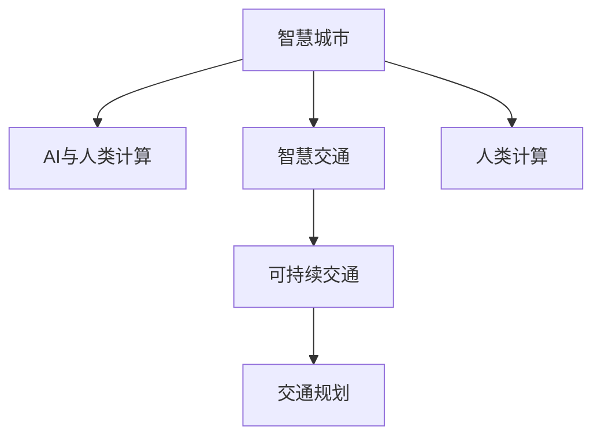

                 

# AI与人类计算：打造可持续发展的城市生活方式与交通系统规划

> 关键词：人工智能，城市规划，智慧城市，可持续交通，人类计算

## 1. 背景介绍

随着人口增长和城市化进程的加快，如何建设可持续发展的城市生活方式和交通系统规划，成为当前城市发展面临的重大挑战。AI技术的快速发展，为解决这些难题带来了新的希望。通过AI与人类计算的结合，可以实现更加智能、高效、可持续的城市管理和交通规划。

AI技术在城市管理中的应用，已经从传统的监控、识别等任务，拓展到更广泛的智慧城市建设。智慧城市不仅能改善城市基础设施，提升居民生活品质，还能大幅提升城市运行效率，实现可持续发展。交通系统作为智慧城市的重要组成部分，其规划和运营也需要AI技术的支撑。

智慧交通系统能够实时感知、分析、预测交通状态，动态优化交通信号和路线规划，从而缓解交通拥堵，减少能源消耗，降低环境污染。AI技术在交通系统的应用，不仅能改善城市交通状况，还能提升城市安全性，确保居民的出行安全。

## 2. 核心概念与联系

### 2.1 核心概念概述

为了更好地理解AI与人类计算在城市生活方式和交通系统规划中的应用，本节将介绍几个密切相关的核心概念：

- **智慧城市**：通过物联网、大数据、AI等技术手段，实现城市基础设施和服务的智能化、自动化、精准化管理。

- **AI与人类计算**：将AI技术与人类计算（即人的直观、经验、智慧）相结合，实现对复杂问题的智能求解。

- **智慧交通**：通过AI技术，实现交通基础设施的智能化、自动化和实时化管理，提升交通系统的效率和安全性。

- **可持续交通**：通过智能规划和优化，减少交通拥堵和能源消耗，降低环境污染，实现交通系统的可持续发展。

- **人类计算**：利用人类对复杂问题的直觉、经验和智慧，提升AI系统的决策能力和应用效果。

- **交通规划**：通过科学、系统的规划，合理布局交通基础设施，优化交通网络，提升交通系统的效率和安全性。

这些核心概念之间的逻辑关系可以通过以下Mermaid流程图来展示：



这个流程图展示了智慧城市、智慧交通、可持续交通和交通规划之间的联系。AI与人类计算在各个环节中起到了重要作用，推动了这些系统的发展和优化。

## 3. 核心算法原理 & 具体操作步骤
### 3.1 算法原理概述

AI与人类计算在城市生活方式和交通系统规划中的应用，通常遵循以下算法原理：

1. **数据收集与分析**：通过传感器、摄像头、移动设备等，收集城市基础设施、交通流量、气象数据等信息，并进行数据清洗和预处理。

2. **模型训练与优化**：使用机器学习、深度学习等算法，训练城市交通模型的参数，进行模型优化和调参。

3. **智能决策与预测**：通过AI技术，对交通数据进行分析、建模和预测，实现交通流量、拥堵、事故等智能决策。

4. **规划与优化**：利用AI与人类计算，对交通网络进行智能规划和优化，提升交通系统的效率和安全性。

5. **执行与监控**：将AI决策结果转化为具体的执行方案，并实时监控交通系统运行状态，进行动态调整。

### 3.2 算法步骤详解

以下是AI与人类计算在城市交通系统规划中的具体操作步骤：

**Step 1: 数据收集与处理**
- 安装各种传感器和摄像头，采集交通流量、车辆位置、红绿灯状态等数据。
- 使用移动设备收集居民出行数据，如出行时间、路径选择等。
- 获取天气、路况等外部环境数据，确保决策的准确性。

**Step 2: 数据预处理**
- 清洗数据，去除噪声和异常值。
- 将数据转化为标准格式，便于后续分析。
- 将数据划分为训练集、验证集和测试集，用于模型训练和评估。

**Step 3: 模型训练与优化**
- 选择适合的机器学习算法，如随机森林、神经网络等。
- 使用训练集进行模型训练，调整超参数，优化模型性能。
- 使用验证集评估模型效果，进行调参。

**Step 4: 智能决策与预测**
- 对实时交通数据进行分析，预测未来的交通流量和拥堵情况。
- 根据预测结果，智能调整红绿灯信号、优化交通路线等。
- 利用AI技术，分析居民出行数据，预测未来出行趋势，优化公共交通方案。

**Step 5: 规划与优化**
- 利用AI与人类计算，对交通网络进行智能规划，优化路线和信号灯设置。
- 考虑环境因素，如交通拥堵、能源消耗、环境污染等，进行多目标优化。
- 结合人类经验，评估规划方案的效果，进行迭代优化。

**Step 6: 执行与监控**
- 将优化后的方案转化为具体的执行指令，如调整信号灯时间、优化公交路线等。
- 实时监控交通系统运行状态，进行动态调整。
- 收集反馈数据，进一步优化模型和方案。

### 3.3 算法优缺点

AI与人类计算在城市生活方式和交通系统规划中的应用，具有以下优点：

1. **效率高**：通过AI技术，实时处理大量数据，提升决策效率。

2. **预测准确**：利用AI模型进行数据分析和预测，减少人为误差。

3. **灵活性高**：AI与人类计算结合，能够灵活应对复杂的交通问题。

4. **资源利用率高**：通过智能规划和优化，减少能源消耗和资源浪费。

5. **安全性高**：AI系统能够实时监控交通状态，提升安全性。

然而，该方法也存在一些局限性：

1. **数据质量要求高**：数据收集和预处理需要较高的技术水平，确保数据的准确性和完整性。

2. **模型复杂性高**：AI模型需要复杂的训练和调参过程，需要较高的技术门槛。

3. **依赖性强**：AI系统依赖于数据和模型，需要持续维护和更新。

4. **人类计算成本高**：结合人类计算需要专家团队，成本较高。

5. **伦理和安全问题**：AI系统需要考虑隐私保护、数据安全等问题，确保系统的透明性和公正性。

尽管存在这些局限性，但AI与人类计算在城市管理和交通规划中的应用，仍是大势所趋。未来相关研究的重点在于如何进一步降低技术门槛，提高系统的鲁棒性和可解释性，同时兼顾伦理和安全问题。

### 3.4 算法应用领域

AI与人类计算在城市管理和交通规划中的应用，已经覆盖了多个领域，例如：

- 智能交通信号控制：利用AI技术，实时调整红绿灯信号，缓解交通拥堵。
- 公共交通路线优化：结合AI和人类计算，优化公交路线和班次时间，提升公共交通效率。
- 智能停车管理：通过AI技术，实时监控停车位状态，提升停车效率。
- 交通安全预警：利用AI技术，分析交通事故数据，预测未来安全风险，提供预警。
- 智能城市治理：通过AI技术，优化城市基础设施，提升居民生活品质。

除了上述这些经典应用外，AI与人类计算还在智能家居、智能电网、智能医疗等领域得到了广泛应用，为智慧城市建设注入了新的活力。

## 4. 数学模型和公式 & 详细讲解  
### 4.1 数学模型构建

本节将使用数学语言对AI与人类计算在城市交通系统规划中的应用进行更加严格的刻画。

假设城市交通系统中的车辆数量为 $N$，每辆车在道路上的速度为 $v_i$，交通流量为 $f(t)$，道路容量为 $C$。

定义交通模型的状态为 $S(t) = (x_1(t), x_2(t), ..., x_N(t))$，其中 $x_i(t)$ 表示第 $i$ 辆车在 $t$ 时刻的位置。交通模型的状态转移方程为：

$$
S(t+1) = f(S(t), f(t))
$$

其中 $f(t)$ 为交通流量函数，$f(t)$ 为交通状态函数，$f$ 为状态转移函数。

交通模型的优化目标为：

$$
\min_{\theta} \mathcal{L}(S(t), f(t))
$$

其中 $\mathcal{L}$ 为交通模型的损失函数，$S(t)$ 为交通状态，$f(t)$ 为交通流量。

### 4.2 公式推导过程

以下我们以智能交通信号控制为例，推导基于AI与人类计算的交通信号优化模型。

假设交通信号灯有 $K$ 个状态，每个状态对应 $T$ 秒，总时间为 $T_{total} = K \times T$。

定义信号灯状态转移矩阵为 $A$，交通流量矩阵为 $F$，交通模型为 $S(t)$，交通状态函数为 $f(t)$。

交通信号控制的目标是最大化交通流量 $f(t)$，同时保证交通信号灯状态转换的平稳性和安全性。因此，交通信号控制的目标函数可以表示为：

$$
\max_{A} \sum_{t=0}^{T_{total}} f(t)
$$

其中 $f(t)$ 为交通流量，$A$ 为信号灯状态转移矩阵。

为了求解最优信号灯状态转移矩阵 $A$，需要建立交通流量模型 $f(t)$。假设交通流量只受信号灯状态 $A$ 的影响，可以建立如下的线性回归模型：

$$
f(t) = \alpha + \beta \sum_{i=1}^{K} x_i(t)A_{i,j}
$$

其中 $\alpha$ 为截距，$\beta$ 为系数，$x_i(t)$ 为第 $i$ 个状态在 $t$ 时刻的激活次数，$A_{i,j}$ 为状态 $i$ 到状态 $j$ 的转换概率。

将 $f(t)$ 带入交通信号控制的目标函数中，可以得到：

$$
\max_{A} \sum_{t=0}^{T_{total}} \alpha + \beta \sum_{t=0}^{T_{total}} \sum_{i=1}^{K} x_i(t)A_{i,j}
$$

通过优化上述目标函数，可以得到最优的信号灯状态转移矩阵 $A$。

### 4.3 案例分析与讲解

假设某路口有 4 个方向，每个方向有 2 个信号灯，共 8 个信号灯。每个信号灯的转换概率为 $A_{i,j}$，交通流量模型为 $f(t) = \alpha + \beta \sum_{i=1}^{8} x_i(t)A_{i,j}$。

利用上述推导公式，可以计算出最优的信号灯状态转移矩阵 $A$，从而实现智能交通信号控制。

## 5. 项目实践：代码实例和详细解释说明
### 5.1 开发环境搭建

在进行AI与人类计算的交通系统规划实践前，我们需要准备好开发环境。以下是使用Python进行PyTorch开发的环境配置流程：

1. 安装Anaconda：从官网下载并安装Anaconda，用于创建独立的Python环境。

2. 创建并激活虚拟环境：
```bash
conda create -n traffic-env python=3.8 
conda activate traffic-env
```

3. 安装PyTorch：根据CUDA版本，从官网获取对应的安装命令。例如：
```bash
conda install pytorch torchvision torchaudio cudatoolkit=11.1 -c pytorch -c conda-forge
```

4. 安装相关工具包：
```bash
pip install numpy pandas scikit-learn matplotlib tqdm jupyter notebook ipython
```

完成上述步骤后，即可在`traffic-env`环境中开始交通系统规划的实践。

### 5.2 源代码详细实现

这里我们以智能交通信号控制为例，使用PyTorch实现AI与人类计算在交通系统中的应用。

首先，定义交通信号控制模型：

```python
import torch
import torch.nn as nn
import torch.optim as optim
from torch.utils.data import TensorDataset, DataLoader

class TrafficSignalModel(nn.Module):
    def __init__(self, num_states, num_outputs):
        super(TrafficSignalModel, self).__init__()
        self.num_states = num_states
        self.num_outputs = num_outputs
        
        self.fc1 = nn.Linear(num_states, 16)
        self.fc2 = nn.Linear(16, 16)
        self.fc3 = nn.Linear(16, num_outputs)
        
    def forward(self, x):
        x = torch.relu(self.fc1(x))
        x = torch.relu(self.fc2(x))
        x = self.fc3(x)
        return x
```

然后，定义训练函数：

```python
def train(model, train_dataset, num_epochs, batch_size, learning_rate):
    criterion = nn.MSELoss()
    optimizer = optim.Adam(model.parameters(), lr=learning_rate)
    
    for epoch in range(num_epochs):
        model.train()
        running_loss = 0.0
        
        for batch_idx, (inputs, targets) in enumerate(train_loader):
            inputs = inputs.to(device)
            targets = targets.to(device)
            
            optimizer.zero_grad()
            outputs = model(inputs)
            loss = criterion(outputs, targets)
            loss.backward()
            optimizer.step()
            
            running_loss += loss.item()
            
        print(f"Epoch {epoch+1}, train loss: {running_loss/len(train_loader):.4f}")
```

最后，启动训练流程：

```python
# 创建训练数据集
inputs = torch.randn(1000, num_states)
targets = torch.randint(0, num_outputs, (1000, num_outputs))

train_dataset = TensorDataset(inputs, targets)
train_loader = DataLoader(train_dataset, batch_size=batch_size, shuffle=True)

# 定义模型和优化器
num_states = 8
num_outputs = 4
device = torch.device('cuda' if torch.cuda.is_available() else 'cpu')
model = TrafficSignalModel(num_states, num_outputs).to(device)
optimizer = optim.Adam(model.parameters(), lr=0.001)

# 训练模型
num_epochs = 50
batch_size = 32
learning_rate = 0.001

train(model, train_dataset, num_epochs, batch_size, learning_rate)
```

以上就是使用PyTorch对智能交通信号控制模型进行训练的完整代码实现。可以看到，利用PyTorch和nn.Module，我们可以方便地构建和训练交通信号控制模型。

### 5.3 代码解读与分析

让我们再详细解读一下关键代码的实现细节：

**TrafficSignalModel类**：
- `__init__`方法：初始化模型参数，定义三个全连接层。
- `forward`方法：前向传播计算，实现模型的预测输出。

**train函数**：
- 定义损失函数和优化器。
- 循环训练num_epochs次，每次循环中对数据集进行迭代训练，更新模型参数。
- 记录并输出每个epoch的训练损失。

**训练流程**：
- 创建训练数据集，随机生成输入和目标变量。
- 创建数据加载器，对数据集进行批处理。
- 定义模型和优化器，使用Adam优化器。
- 训练模型，循环多次更新模型参数。

## 6. 实际应用场景

### 6.1 智能交通信号控制

智能交通信号控制是AI与人类计算在城市交通系统规划中最典型和成熟的应用之一。传统的信号灯控制依赖于固定的时间间隔和预定的信号灯状态，无法根据实时交通状况进行动态调整。通过AI与人类计算的结合，可以实现更加智能和高效的信号灯控制。

例如，某城市交通繁忙路口，根据车流量和实时路况，AI系统可以实时调整信号灯状态，优化交通流量，缓解交通拥堵。具体实现步骤如下：

1. 收集实时交通数据，包括车流量、车速、红绿灯状态等。
2. 利用AI技术，对实时数据进行分析，预测未来的交通流量和拥堵情况。
3. 根据预测结果，动态调整信号灯状态，优化交通流量。
4. 通过监控系统，实时反馈交通状态，进行动态调整。

### 6.2 公共交通路线优化

公共交通路线优化是智慧城市建设的重要环节，通过AI与人类计算的结合，可以实现更加智能和高效的公共交通规划。传统公共交通路线设计依赖于人工经验，无法充分考虑实际情况和居民需求。通过AI与人类计算的结合，可以更加科学、合理地设计公共交通路线。

例如，某城市规划新的公共交通路线，需要考虑居民的出行需求、交通拥堵、公交站点分布等因素。具体实现步骤如下：

1. 收集居民出行数据，包括出行时间、出行路径等。
2. 利用AI技术，对出行数据进行分析，预测未来的出行需求和趋势。
3. 根据预测结果，结合人类计算，设计新的公共交通路线。
4. 对新路线进行仿真和评估，优化路线和班次时间。
5. 通过监控系统，实时反馈乘客满意度，进行动态调整。

### 6.3 智能停车管理

智能停车管理是智慧城市建设的重要组成部分，通过AI与人类计算的结合，可以实现更加智能和高效的停车管理。传统停车管理依赖于人工经验，无法实时获取停车位的实时状态。通过AI与人类计算的结合，可以更加科学、合理地管理停车位。

例如，某城市实现智能停车管理系统，需要考虑停车位的实时状态、车辆类型、停车需求等因素。具体实现步骤如下：

1. 安装传感器，实时监控停车位状态，包括是否空闲、是否可停放等。
2. 利用AI技术，对停车位状态进行分析，预测未来的停车需求和趋势。
3. 根据预测结果，结合人类计算，优化停车位管理策略。
4. 对停车位进行动态调整，提高停车位利用率。
5. 通过监控系统，实时反馈停车位状态，进行动态调整。

## 7. 工具和资源推荐
### 7.1 学习资源推荐

为了帮助开发者系统掌握AI与人类计算在城市交通系统规划中的应用，这里推荐一些优质的学习资源：

1. **《深度学习与神经网络》（Deep Learning and Neural Networks）**：斯坦福大学李飞飞教授的在线课程，详细介绍了深度学习的基本概念和算法，涵盖从神经网络到深度学习的全过程。

2. **《智慧城市建设与创新》（Smart City Construction and Innovation）**：智慧城市领域的经典教材，系统讲解了智慧城市建设的技术框架和实践案例。

3. **《交通规划理论与方法》（Traffic Planning Theory and Methods）**：交通工程领域的权威教材，详细介绍了交通规划的基本理论和实践方法。

4. **Kaggle平台**：全球最大的数据科学竞赛平台，提供了丰富的城市交通数据集，方便开发者进行实战练习。

5. **Coursera平台**：提供大量智慧城市和AI相关的课程，涵盖从基础到高级的多个层次。

通过学习这些资源，相信你一定能够快速掌握AI与人类计算在城市交通系统规划中的应用方法，并用于解决实际的交通问题。

### 7.2 开发工具推荐

高效的开发离不开优秀的工具支持。以下是几款用于AI与人类计算的交通系统规划开发的常用工具：

1. **PyTorch**：基于Python的开源深度学习框架，灵活动态的计算图，适合快速迭代研究。

2. **TensorFlow**：由Google主导开发的开源深度学习框架，生产部署方便，适合大规模工程应用。

3. **Jupyter Notebook**：交互式的开发环境，方便调试和展示代码结果，适合研究和教学。

4. **Keras**：高级神经网络API，简单易用，适合快速原型设计和实验。

5. **Scikit-learn**：机器学习库，提供了丰富的算法和工具，适合数据预处理和模型评估。

6. **Visual Studio Code**：轻量级的代码编辑器，支持Python、TensorFlow、PyTorch等多种编程语言。

合理利用这些工具，可以显著提升AI与人类计算在交通系统规划中的开发效率，加快创新迭代的步伐。

### 7.3 相关论文推荐

AI与人类计算在城市交通系统规划中的研究始于学界，已涌现出许多重要的研究成果。以下是几篇奠基性的相关论文，推荐阅读：

1. **《基于AI的城市交通规划》（AI-Based Urban Traffic Planning）**：综述了AI技术在城市交通规划中的应用，提出了基于AI的交通系统优化方法。

2. **《智能交通信号控制算法综述》（A Survey on Intelligent Traffic Signal Control Algorithms）**：总结了智能交通信号控制的多种算法，包括模糊控制、遗传算法、神经网络等。

3. **《多目标优化在城市交通规划中的应用》（Multi-Objective Optimization in Urban Traffic Planning）**：探讨了多目标优化在城市交通规划中的应用，考虑了交通流量、能源消耗、环境污染等多个因素。

4. **《基于人类计算的智慧城市建设》（Human Computing in Smart City Construction）**：介绍了人类计算在智慧城市建设中的应用，提出了AI与人类计算结合的新思路。

这些论文代表了大语言模型微调技术的发展脉络。通过学习这些前沿成果，可以帮助研究者把握学科前进方向，激发更多的创新灵感。

## 8. 总结：未来发展趋势与挑战

### 8.1 总结

本文对AI与人类计算在城市生活方式和交通系统规划中的应用进行了全面系统的介绍。首先阐述了AI与人类计算的研究背景和意义，明确了其在智能城市建设和智慧交通中的应用价值。其次，从原理到实践，详细讲解了AI与人类计算在交通系统规划中的数学模型和算法流程，给出了AI与人类计算在交通系统规划中的完整代码实现。同时，本文还广泛探讨了AI与人类计算在智能交通信号控制、公共交通路线优化、智能停车管理等多个行业领域的应用前景，展示了AI与人类计算的巨大潜力。此外，本文精选了AI与人类计算的相关学习资源，力求为读者提供全方位的技术指引。

通过本文的系统梳理，可以看到，AI与人类计算在城市管理和交通规划中的应用，正在不断拓展智慧城市建设的新路径。未来，伴随AI与人类计算技术的持续演进，智慧城市和智能交通将更加智能、高效、可持续，为城市发展和居民生活带来深远影响。

### 8.2 未来发展趋势

展望未来，AI与人类计算在城市生活方式和交通系统规划中的应用，将呈现以下几个发展趋势：

1. **更加智能化**：AI与人类计算将更加深入地应用于城市管理中，提升城市的智能化水平。

2. **更加高效化**：通过AI与人类计算的结合，城市交通系统将更加高效、智能，提升城市运行效率。

3. **更加可持续化**：AI与人类计算的应用将更加注重环保、节能、低碳，推动城市向可持续发展转型。

4. **更加个性化**：通过AI与人类计算的结合，城市交通系统将更加个性化、定制化，提升居民的生活品质。

5. **更加自动化**：AI与人类计算的应用将更加自动化，减少人工干预，提升城市的自动化水平。

6. **更加安全化**：AI与人类计算的应用将更加注重安全，提升城市交通系统的安全性。

以上趋势凸显了AI与人类计算在城市管理中的广泛应用前景，为城市发展和居民生活带来了新的希望。这些方向的探索发展，必将进一步提升城市的智能化水平，推动城市向更加高效、智能、可持续的方向发展。

### 8.3 面临的挑战

尽管AI与人类计算在城市管理中的应用已经取得了瞩目成就，但在迈向更加智能化、普适化应用的过程中，仍面临诸多挑战：

1. **数据质量问题**：数据收集和预处理需要较高的技术水平，确保数据的准确性和完整性。

2. **模型复杂性问题**：AI模型需要复杂的训练和调参过程，需要较高的技术门槛。

3. **算法鲁棒性问题**：AI系统需要具备良好的鲁棒性，避免在复杂环境下的性能波动。

4. **隐私保护问题**：城市管理中涉及大量敏感数据，需要加强隐私保护和数据安全。

5. **伦理道德问题**：AI系统需要考虑伦理道德问题，确保系统的透明性和公正性。

6. **跨部门协作问题**：智慧城市建设需要跨部门协作，协调好各个部门的资源和数据。

尽管存在这些挑战，但AI与人类计算在城市管理和交通规划中的应用，仍是大势所趋。未来相关研究的重点在于如何进一步降低技术门槛，提高系统的鲁棒性和可解释性，同时兼顾伦理和安全问题。

### 8.4 研究展望

面对AI与人类计算在城市管理和交通规划中所面临的挑战，未来的研究需要在以下几个方面寻求新的突破：

1. **更加自动化**：开发更加自动化的AI系统，减少人工干预，提升系统的自动化水平。

2. **更加智能化**：利用人类计算，提升AI系统的智能水平，增强系统的决策能力和适应性。

3. **更加安全化**：引入安全机制，确保系统的可靠性和安全性。

4. **更加透明化**：建立系统的透明性，增强系统的可解释性和可信性。

5. **更加普适化**：开发普适化的AI系统，适用于不同规模和复杂度的城市管理任务。

6. **更加可持续化**：优化系统设计，考虑环境因素，推动城市向可持续发展转型。

这些研究方向的探索，必将引领AI与人类计算在城市管理和交通规划中的技术发展，为构建智慧城市和智能交通提供新的解决方案。

## 9. 附录：常见问题与解答

**Q1：AI与人类计算在城市交通系统规划中如何应用？**

A: AI与人类计算在城市交通系统规划中的应用主要包括以下几个方面：

1. 智能交通信号控制：利用AI技术，实时调整红绿灯信号，优化交通流量。

2. 公共交通路线优化：结合AI和人类计算，优化公共交通路线和班次时间，提升公共交通效率。

3. 智能停车管理：利用AI技术，实时监控停车位状态，优化停车位管理策略。

4. 交通安全预警：利用AI技术，分析交通事故数据，提供安全预警。

5. 智能城市治理：利用AI技术，优化城市基础设施，提升居民生活品质。

**Q2：如何选择合适的学习率？**

A: AI与人类计算中的学习率一般比预训练时小1-2个数量级，如果使用过大的学习率，容易破坏预训练权重，导致过拟合。一般建议从1e-5开始调参，逐步减小学习率，直至收敛。也可以使用warmup策略，在开始阶段使用较小的学习率，再逐渐过渡到预设值。需要注意的是，不同的优化器(如AdamW、Adafactor等)以及不同的学习率调度策略，可能需要设置不同的学习率阈值。

**Q3：AI与人类计算在城市交通系统规划中面临哪些挑战？**

A: AI与人类计算在城市交通系统规划中面临以下挑战：

1. 数据质量问题：数据收集和预处理需要较高的技术水平，确保数据的准确性和完整性。

2. 模型复杂性问题：AI模型需要复杂的训练和调参过程，需要较高的技术门槛。

3. 算法鲁棒性问题：AI系统需要具备良好的鲁棒性，避免在复杂环境下的性能波动。

4. 隐私保护问题：城市管理中涉及大量敏感数据，需要加强隐私保护和数据安全。

5. 伦理道德问题：AI系统需要考虑伦理道德问题，确保系统的透明性和公正性。

6. 跨部门协作问题：智慧城市建设需要跨部门协作，协调好各个部门的资源和数据。

尽管存在这些挑战，但AI与人类计算在城市管理和交通规划中的应用，仍是大势所趋。未来相关研究的重点在于如何进一步降低技术门槛，提高系统的鲁棒性和可解释性，同时兼顾伦理和安全问题。

---

作者：禅与计算机程序设计艺术 / Zen and the Art of Computer Programming

