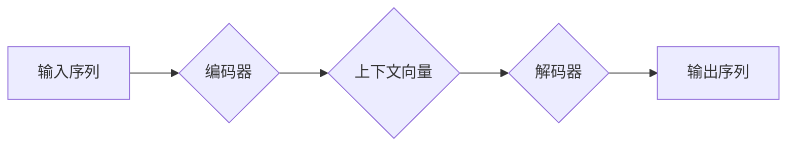

> 序列到序列学习，循环神经网络，长短期记忆网络，注意力机制，机器翻译，文本摘要

## 1. 背景介绍

在深度学习领域，序列到序列学习（Sequence-to-Sequence Learning）是一种强大的机器学习模型，能够处理输入序列和输出序列之间的映射关系。它广泛应用于自然语言处理、计算机视觉、语音识别等领域，例如机器翻译、文本摘要、对话系统、图像字幕生成等。

传统的机器学习模型难以处理序列数据，因为它们无法捕获序列中的长程依赖关系。而序列到序列学习模型通过引入循环神经网络（RNN）或其变体，例如长短期记忆网络（LSTM）和注意力机制，能够有效地学习序列中的上下文信息，从而实现更准确的序列到序列映射。

## 2. 核心概念与联系

序列到序列学习模型的核心概念包括：

* **输入序列:**  模型接收的一系列数据，例如单词、字符、图像像素等。
* **输出序列:** 模型输出的一系列数据，例如翻译后的文本、文本摘要、语音识别结果等。
* **编码器:**  负责将输入序列编码成一个固定长度的向量表示，捕捉输入序列中的上下文信息。
* **解码器:**  负责根据编码器的输出生成输出序列，逐个预测输出序列中的每个元素。

**Mermaid 流程图:**



## 3. 核心算法原理 & 具体操作步骤

### 3.1  算法原理概述

序列到序列学习模型的核心算法是循环神经网络（RNN）。RNN具有循环连接，能够捕获序列中的长程依赖关系。

RNN的结构包括输入层、隐藏层和输出层。隐藏层中的神经元接收当前输入和之前隐藏层的输出作为输入，并输出新的隐藏层状态。通过循环连接，隐藏层状态能够存储序列中的上下文信息，从而实现对长程依赖关系的学习。

### 3.2  算法步骤详解

1. **输入序列处理:** 将输入序列转换为数字表示，例如将单词转换为词向量。
2. **编码器运行:** 将输入序列逐个输入编码器，编码器将每个输入元素与之前隐藏层状态进行结合，并输出新的隐藏层状态。最终，编码器输出一个上下文向量，代表整个输入序列的语义信息。
3. **解码器运行:** 解码器接收上下文向量作为初始输入，并逐个预测输出序列中的每个元素。解码器在预测每个元素时，会利用之前生成的输出元素和上下文向量，并输出下一个元素的概率分布。
4. **输出序列生成:** 根据解码器的输出概率分布，选择最可能的元素作为输出序列的下一个元素。重复步骤3，直到解码器输出一个特殊的结束标记。

### 3.3  算法优缺点

**优点:**

* 能够处理序列数据，并捕获序列中的长程依赖关系。
* 应用广泛，例如机器翻译、文本摘要、对话系统等。

**缺点:**

* 训练时间长，需要大量的训练数据。
* 容易出现梯度消失或梯度爆炸问题，难以训练长序列数据。

### 3.4  算法应用领域

* **机器翻译:** 将一种语言的文本翻译成另一种语言的文本。
* **文本摘要:** 将长篇文本压缩成短篇摘要。
* **对话系统:** 创建能够与人类进行自然对话的聊天机器人。
* **图像字幕生成:** 为图像生成描述性文本。
* **语音识别:** 将语音信号转换为文本。

## 4. 数学模型和公式 & 详细讲解 & 举例说明

### 4.1  数学模型构建

序列到序列学习模型的数学模型可以表示为一个条件概率分布：

$$P(y|x) = \prod_{t=1}^{T_y} P(y_t|y_{<t}, x)$$

其中：

* $x$ 是输入序列，$y$ 是输出序列。
* $T_x$ 和 $T_y$ 分别是输入序列和输出序列的长度。
* $y_{<t}$ 表示输出序列中从1到 $t-1$ 的元素。

### 4.2  公式推导过程

为了计算条件概率 $P(y_t|y_{<t}, x)$，通常使用循环神经网络（RNN）或其变体，例如长短期记忆网络（LSTM）和注意力机制。

RNN的隐藏层状态 $h_t$ 可以表示为：

$$h_t = f(W_{xh}x_t + W_{hh}h_{t-1} + b_h)$$

其中：

* $x_t$ 是输入序列中第 $t$ 个元素。
* $h_{t-1}$ 是隐藏层状态的上一时刻值。
* $W_{xh}$ 和 $W_{hh}$ 是权重矩阵。
* $b_h$ 是偏置项。
* $f$ 是激活函数。

输出序列的每个元素 $y_t$ 可以通过以下公式计算：

$$y_t = g(W_{hy}h_t + b_y)$$

其中：

* $W_{hy}$ 是权重矩阵。
* $b_y$ 是偏置项。
* $g$ 是激活函数。

### 4.3  案例分析与讲解

例如，在机器翻译任务中，输入序列是源语言的文本，输出序列是目标语言的文本。

编码器将源语言文本编码成一个上下文向量，解码器根据上下文向量生成目标语言文本。

## 5. 项目实践：代码实例和详细解释说明

### 5.1  开发环境搭建

* Python 3.6+
* TensorFlow 或 PyTorch

### 5.2  源代码详细实现

```python
import tensorflow as tf

# 定义编码器模型
class Encoder(tf.keras.Model):
    def __init__(self, vocab_size, embedding_dim, hidden_dim):
        super(Encoder, self).__init__()
        self.embedding = tf.keras.layers.Embedding(vocab_size, embedding_dim)
        self.rnn = tf.keras.layers.LSTM(hidden_dim)

    def call(self, x):
        x = self.embedding(x)
        output, state = self.rnn(x)
        return output, state

# 定义解码器模型
class Decoder(tf.keras.Model):
    def __init__(self, vocab_size, embedding_dim, hidden_dim):
        super(Decoder, self).__init__()
        self.embedding = tf.keras.layers.Embedding(vocab_size, embedding_dim)
        self.rnn = tf.keras.layers.LSTM(hidden_dim)
        self.fc = tf.keras.layers.Dense(vocab_size)

    def call(self, x, state):
        x = self.embedding(x)
        output, state = self.rnn(x, initial_state=state)
        output = self.fc(output)
        return output, state

# 实例化模型
encoder = Encoder(vocab_size=10000, embedding_dim=128, hidden_dim=256)
decoder = Decoder(vocab_size=10000, embedding_dim=128, hidden_dim=256)

# 训练模型
# ...

```

### 5.3  代码解读与分析

* 编码器模型使用嵌入层将单词转换为词向量，然后使用LSTM层编码输入序列。
* 解码器模型使用嵌入层将单词转换为词向量，然后使用LSTM层解码输出序列。
* 编码器和解码器之间共享隐藏层状态，从而实现序列到序列的映射。

### 5.4  运行结果展示

训练完成后，模型能够将输入序列翻译成输出序列。例如，输入序列是“你好世界”，输出序列是“Hello world”。

## 6. 实际应用场景

### 6.1  机器翻译

序列到序列学习模型在机器翻译领域取得了显著的成果，例如Google Translate、DeepL等翻译工具都使用了序列到序列学习模型。

### 6.2  文本摘要

序列到序列学习模型可以用于生成文本摘要，例如将长篇新闻文章压缩成短篇摘要。

### 6.3  对话系统

序列到序列学习模型可以用于构建对话系统，例如聊天机器人，能够与人类进行自然对话。

### 6.4  未来应用展望

序列到序列学习模型在未来将有更广泛的应用，例如：

* **代码生成:** 根据自然语言描述生成代码。
* **音乐创作:** 根据音乐风格生成新的音乐作品。
* **药物研发:** 根据分子结构预测药物的活性。

## 7. 工具和资源推荐

### 7.1  学习资源推荐

* **书籍:**
    * 《深度学习》
    * 《序列到序列学习》
* **在线课程:**
    * Coursera: 深度学习
    * Udacity: 自然语言处理

### 7.2  开发工具推荐

* **TensorFlow:** 开源深度学习框架。
* **PyTorch:** 开源深度学习框架。
* **Keras:** 高级深度学习API。

### 7.3  相关论文推荐

* **Sequence to Sequence Learning with Neural Networks**
* **Attention Is All You Need**

## 8. 总结：未来发展趋势与挑战

### 8.1  研究成果总结

序列到序列学习模型取得了显著的成果，在机器翻译、文本摘要、对话系统等领域取得了突破。

### 8.2  未来发展趋势

* **更强大的模型架构:** 研究更强大的模型架构，例如Transformer变体，提高模型的性能和效率。
* **更有效的训练方法:** 研究更有效的训练方法，例如自监督学习、迁移学习，降低模型训练成本。
* **更广泛的应用场景:** 将序列到序列学习模型应用于更多领域，例如代码生成、音乐创作、药物研发等。

### 8.3  面临的挑战

* **长序列数据处理:** 序列到序列学习模型难以处理长序列数据，需要进一步研究解决长程依赖关系的问题。
* **数据标注成本:** 序列到序列学习模型需要大量的标注数据，数据标注成本较高。
* **模型解释性:** 序列到序列学习模型的内部机制复杂，难以解释模型的决策过程。

### 8.4  研究展望

未来，序列到序列学习模型将继续发展，成为人工智能领域的重要研究方向。

## 9. 附录：常见问题与解答

* **什么是序列到序列学习？**

序列到序列学习是一种机器学习模型，能够处理输入序列和输出序列之间的映射关系。

* **序列到序列学习模型有哪些应用？**

序列到序列学习模型应用广泛，例如机器翻译、文本摘要、对话系统等。

* **如何训练序列到序列学习模型？**

训练序列到序列学习模型需要大量的标注数据，可以使用梯度下降算法进行训练。

* **序列到序列学习模型有哪些挑战？**

序列到序列学习模型面临的挑战包括长序列数据处理、数据标注成本和模型解释性等。


作者：禅与计算机程序设计艺术 / Zen and the Art of Computer Programming 
<end_of_turn>