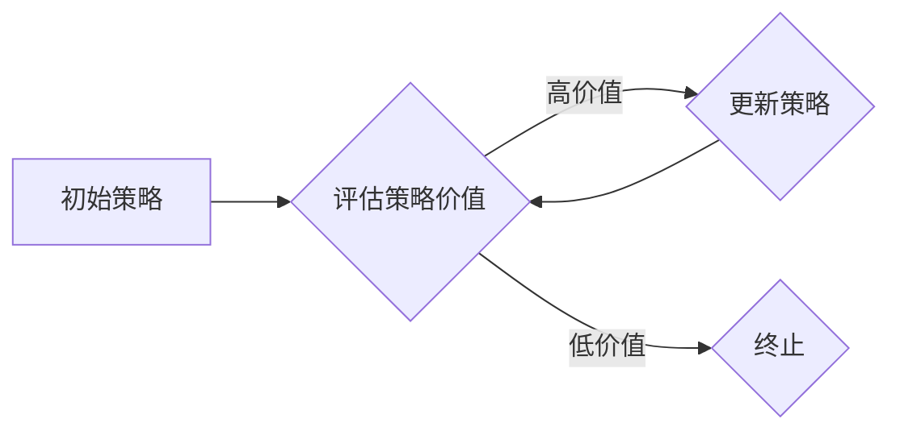

> 强化学习，策略迭代，价值函数，策略更新，蒙特卡罗方法，深度强化学习

## 1. 背景介绍

强化学习 (Reinforcement Learning, RL) 作为机器学习的一个重要分支，旨在训练智能体在与环境交互的过程中学习最优策略，以最大化累积的奖励。与监督学习和无监督学习不同，强化学习中，智能体需要通过试错和探索环境来学习，并根据环境反馈调整策略。策略迭代算法是强化学习中经典的算法之一，它通过迭代更新策略，最终收敛到最优策略。

## 2. 核心概念与联系

在策略迭代算法中，核心概念包括：

* **状态 (State):** 智能体所处的环境状态。
* **动作 (Action):** 智能体可以采取的动作。
* **奖励 (Reward):** 环境对智能体采取的动作给予的反馈。
* **价值函数 (Value Function):**  评估状态或状态-动作对的价值，即未来累积奖励的期望。
* **策略 (Policy):**  描述智能体在不同状态下采取动作的概率分布。

策略迭代算法的核心思想是：

1. **评估策略:** 使用价值函数评估当前策略的价值。
2. **更新策略:** 根据价值函数的评估结果，更新策略，使得新的策略在评估时获得更高的价值。

**Mermaid 流程图:**



## 3. 核心算法原理 & 具体操作步骤

### 3.1  算法原理概述

策略迭代算法的核心是通过迭代更新策略，最终收敛到最优策略。算法的基本步骤如下：

1. **初始化策略:** 选择一个初始策略，例如随机策略。
2. **评估策略价值:** 使用价值函数评估当前策略的价值。
3. **更新策略:** 根据价值函数的评估结果，更新策略，使得新的策略在评估时获得更高的价值。
4. **重复步骤2-3:** 直到策略收敛，即策略价值不再发生显著变化。

### 3.2  算法步骤详解

1. **初始化策略:** 选择一个初始策略，例如随机策略。
2. **评估策略价值:** 使用价值函数评估当前策略的价值。常用的价值函数包括状态价值函数和状态-动作价值函数。
3. **更新策略:** 根据价值函数的评估结果，更新策略。策略更新方法有很多种，例如贪婪策略更新和ε-贪婪策略更新。
4. **重复步骤2-3:** 直到策略收敛，即策略价值不再发生显著变化。

### 3.3  算法优缺点

**优点:**

* 理论上可以收敛到最优策略。
* 算法相对简单易懂。

**缺点:**

* 算法收敛速度可能较慢。
* 需要评估策略价值，计算量较大。

### 3.4  算法应用领域

策略迭代算法广泛应用于各种强化学习领域，例如：

* **游戏 AI:** 训练游戏 AI 策略，例如围棋、Go、象棋等。
* **机器人控制:** 训练机器人控制策略，例如导航、抓取等。
* **推荐系统:** 训练推荐系统策略，例如个性化推荐、内容推荐等。

## 4. 数学模型和公式 & 详细讲解 & 举例说明

### 4.1  数学模型构建

在策略迭代算法中，常用的数学模型包括：

* **状态价值函数:**  V(s) 表示状态 s 的价值，即从状态 s 开始执行最优策略的累积奖励期望。
* **状态-动作价值函数:** Q(s, a) 表示在状态 s 下执行动作 a 的价值，即从状态 s 执行动作 a 后，按照最优策略执行的累积奖励期望。

### 4.2  公式推导过程

* **状态价值函数的更新公式:**

$$V(s) = \sum_{a} \pi(a|s) Q(s, a)$$

其中，π(a|s) 表示策略在状态 s 下执行动作 a 的概率。

* **状态-动作价值函数的更新公式:**

$$Q(s, a) = R(s, a) + \gamma \max_{a'} Q(s', a')$$

其中，R(s, a) 表示在状态 s 执行动作 a 的奖励，γ 表示折扣因子，s' 表示执行动作 a 后进入的状态。

### 4.3  案例分析与讲解

假设有一个简单的强化学习环境，智能体可以采取两种动作：向上和向下。环境状态表示智能体的当前位置，奖励为到达目标位置时获得的奖励。

使用策略迭代算法训练智能体，可以迭代更新策略，最终使智能体能够找到到达目标位置的最优策略。

## 5. 项目实践：代码实例和详细解释说明

### 5.1  开发环境搭建

本项目使用 Python 语言进行开发，需要安装以下库：

* NumPy
* matplotlib

### 5.2  源代码详细实现

```python
import numpy as np

# 定义环境
class Environment:
    def __init__(self):
        self.state = 0
        self.goal = 10

    def step(self, action):
        if action == 0:  # 向上
            self.state = min(self.state + 1, self.goal)
        elif action == 1:  # 向下
            self.state = max(self.state - 1, 0)
        reward = 0
        if self.state == self.goal:
            reward = 1
        return self.state, reward

# 定义策略迭代算法
def policy_iteration(env, gamma=0.9, epsilon=0.01):
    # 初始化策略
    policy = np.random.rand(env.goal + 1)
    # 迭代更新策略
    while True:
        # 评估策略价值
        values = evaluate_policy(env, policy, gamma)
        # 更新策略
        new_policy = update_policy(env, values, gamma)
        # 判断策略是否收敛
        if np.sum(np.abs(policy - new_policy)) < epsilon:
            break
        policy = new_policy
    return policy

# 评估策略价值
def evaluate_policy(env, policy, gamma):
    values = np.zeros(env.goal + 1)
    while True:
        # 更新状态价值函数
        for state in range(env.goal + 1):
            values[state] = np.sum(policy[state] * (
                env.step(0)[1] + gamma * values[env.step(0)[0]]
            ))
        break
    return values

# 更新策略
def update_policy(env, values, gamma):
    new_policy = np.zeros(env.goal + 1)
    for state in range(env.goal + 1):
        # 贪婪策略更新
        action = np.argmax(
            np.array([env.step(0)[1] + gamma * values[env.step(0)[0]],
                      env.step(1)[1] + gamma * values[env.step(1)[0]]])
        )
        new_policy[state] = np.array([1 if i == action else 0 for i in range(2)])
    return new_policy

# 实例化环境
env = Environment()
# 训练策略
policy = policy_iteration(env)
# 打印策略
print(policy)
```

### 5.3  代码解读与分析

* **环境定义:** `Environment` 类定义了强化学习环境，包括状态、动作、奖励等。
* **策略迭代算法:** `policy_iteration` 函数实现了策略迭代算法，包括策略初始化、策略评估、策略更新和收敛判断等步骤。
* **策略评估:** `evaluate_policy` 函数评估策略价值，使用价值迭代算法计算状态价值函数。
* **策略更新:** `update_policy` 函数更新策略，使用贪婪策略更新方法选择最优动作。
* **代码运行:** 代码运行后，会输出智能体在不同状态下采取动作的概率分布，即训练得到的策略。

### 5.4  运行结果展示

运行代码后，输出的策略表示智能体在不同状态下采取向上或向下的概率。例如，如果输出的策略为 [0.8, 0.2]，则表示在状态 0 时，智能体选择向上动作的概率为 0.8，选择向下动作的概率为 0.2。

## 6. 实际应用场景

策略迭代算法在实际应用场景中广泛应用，例如：

* **游戏 AI:** 训练游戏 AI 策略，例如围棋、Go、象棋等。
* **机器人控制:** 训练机器人控制策略，例如导航、抓取等。
* **推荐系统:** 训练推荐系统策略，例如个性化推荐、内容推荐等。

### 6.4  未来应用展望

随着深度学习技术的进步，策略迭代算法与深度学习的结合，例如深度强化学习 (Deep Reinforcement Learning)，在未来将有更广泛的应用前景，例如：

* **自动驾驶:** 训练自动驾驶汽车的控制策略。
* **医疗诊断:** 训练医疗诊断系统，辅助医生进行诊断。
* **金融投资:** 训练金融投资策略，进行智能投资。

## 7. 工具和资源推荐

### 7.1  学习资源推荐

* **书籍:**
    * Reinforcement Learning: An Introduction by Richard S. Sutton and Andrew G. Barto
    * Deep Reinforcement Learning Hands-On by Maxim Lapan
* **在线课程:**
    * Coursera: Reinforcement Learning Specialization by David Silver
    * Udacity: Deep Reinforcement Learning Nanodegree

### 7.2  开发工具推荐

* **Python:** 作为强化学习开发的主要语言。
* **TensorFlow:** 深度学习框架，可用于实现深度强化学习算法。
* **PyTorch:** 深度学习框架，可用于实现深度强化学习算法。

### 7.3  相关论文推荐

* **Deep Q-Network (DQN):** Mnih et al. (2015)
* **Proximal Policy Optimization (PPO):** Schulman et al. (2017)
* **Trust Region Policy Optimization (TRPO):** Schulman et al. (2015)

## 8. 总结：未来发展趋势与挑战

### 8.1  研究成果总结

策略迭代算法是强化学习领域的重要算法之一，在理论和实践上取得了显著成果。

### 8.2  未来发展趋势

* **深度强化学习:** 将深度学习与强化学习结合，提高算法的学习能力和泛化能力。
* **强化学习安全:** 研究强化学习算法的安全性和可靠性，使其能够应用于更安全的环境。
* **强化学习可解释性:** 研究强化学习算法的决策过程，提高算法的可解释性和透明度。

### 8.3  面临的挑战

* **样本效率:** 强化学习算法通常需要大量的样本数据进行训练，这在现实应用中可能难以实现。
* **探索与利用的平衡:** 强化学习算法需要在探索新策略和利用已知策略之间进行平衡，这在某些情况下可能比较困难。
* **复杂环境:** 强化学习算法在复杂环境中学习和应用仍然存在挑战。

### 8.4  研究展望

未来，强化学习领域将继续朝着更智能、更安全、更可解释的方向发展，并将在更多领域得到应用。


## 9. 附录：常见问题与解答

**问题 1:** 策略迭代算法的收敛速度较慢，有什么方法可以提高收敛速度？

**解答:**

* 使用更优的价值函数估计方法，例如 TD(λ) 方法。
* 使用更优的策略更新方法，例如 ε-贪婪策略更新。
* 使用多步策略迭代算法，例如 Q-learning。

**问题