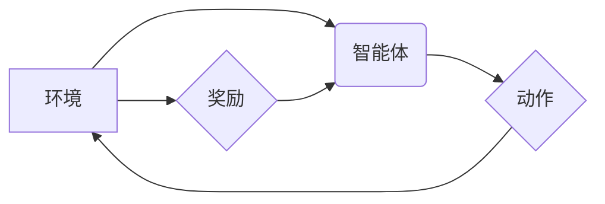

> 强化学习，能效管理，深度强化学习，智能控制，资源优化

## 1. 背景介绍

随着全球能源需求的不断增长和环境问题的日益严峻，提高能源利用效率已成为全球共同关注的议题。能效管理系统旨在通过智能控制和资源优化，有效降低能源消耗，提高能源利用效率。传统能效管理系统主要依赖于预设规则和经验模型，难以适应复杂多变的运行环境和用户需求。

近年来，深度强化学习（Deep Reinforcement Learning，DRL）作为一种强大的机器学习方法，在解决复杂决策问题方面展现出巨大的潜力。DRL能够通过与环境交互学习，不断优化策略，实现智能控制和资源优化，为能效管理系统带来新的突破。

## 2. 核心概念与联系

**2.1 强化学习概述**

强化学习是一种基于交互学习的机器学习方法，其核心思想是通过奖励机制引导智能体学习最优策略。在强化学习中，智能体与环境交互，根据环境反馈的奖励信号，不断调整策略，最终达到最大化累积奖励的目标。

**2.2 能效管理系统概述**

能效管理系统旨在通过智能控制和资源优化，提高能源利用效率。其主要功能包括：

* **能源监测和分析：**实时监测能源消耗数据，分析能源使用模式和趋势。
* **智能控制：**根据实时数据和预设目标，智能控制设备运行状态，优化能源分配。
* **资源优化：**根据能源需求和资源供应情况，优化资源配置和调度，提高资源利用效率。

**2.3 强化学习与能效管理的结合**

将强化学习应用于能效管理系统，可以实现以下优势：

* **智能化控制：**DRL能够学习复杂的能源使用模式，实现智能化控制，提高能源利用效率。
* **自适应性强：**DRL能够根据环境变化和用户需求动态调整策略，适应复杂多变的运行环境。
* **优化决策：**DRL能够通过最大化累积奖励目标，优化能源分配和资源调度，提高系统整体性能。

**2.4 架构图**



## 3. 核心算法原理 & 具体操作步骤

**3.1 算法原理概述**

深度强化学习算法的核心是利用深度神经网络学习智能体的策略。智能体通过与环境交互，获得状态信息和奖励信号，并利用深度神经网络预测最佳动作。通过不断学习和调整策略，智能体最终能够实现最大化累积奖励的目标。

**3.2 算法步骤详解**

1. **环境建模：**构建能效管理系统的环境模型，包括状态空间、动作空间和奖励函数。
2. **智能体设计：**设计智能体架构，通常采用深度神经网络作为策略网络，用于预测最佳动作。
3. **训练过程：**智能体与环境交互，根据环境反馈的奖励信号，更新策略网络参数，不断优化策略。
4. **策略评估：**评估训练后的策略性能，并根据评估结果进行策略调整。
5. **部署与应用：**将训练好的策略部署到实际能效管理系统中，实现智能控制和资源优化。

**3.3 算法优缺点**

**优点：**

* **智能化控制：**能够学习复杂的能源使用模式，实现智能化控制，提高能源利用效率。
* **自适应性强：**能够根据环境变化和用户需求动态调整策略，适应复杂多变的运行环境。
* **优化决策：**能够通过最大化累积奖励目标，优化能源分配和资源调度，提高系统整体性能。

**缺点：**

* **训练复杂：**DRL算法训练过程复杂，需要大量数据和计算资源。
* **收敛性问题：**DRL算法收敛性问题较为突出，需要精心设计算法参数和训练策略。
* **解释性差：**DRL算法的决策过程较为黑盒，难以解释其决策依据。

**3.4 算法应用领域**

DRL算法在能效管理系统之外，还广泛应用于其他领域，例如：

* **机器人控制：**实现机器人自主导航、目标识别和任务执行。
* **游戏人工智能：**开发智能游戏对手，提高游戏体验。
* **金融投资：**优化投资策略，提高投资收益。

## 4. 数学模型和公式 & 详细讲解 & 举例说明

**4.1 数学模型构建**

强化学习模型通常由以下几个核心要素组成：

* **状态空间 (S)：**表示系统可能存在的各种状态。
* **动作空间 (A)：**表示智能体可以采取的各种动作。
* **奖励函数 (R)：**根据当前状态和采取的动作，给予智能体相应的奖励信号。
* **策略 (π)：**智能体根据当前状态选择动作的策略。

**4.2 公式推导过程**

强化学习的目标是找到最优策略 π*，使得智能体在与环境交互的过程中，累积的总奖励最大化。

**Bellman方程**是强化学习的核心公式，用于描述状态价值函数和策略价值函数之间的关系。

$$
V^{\pi}(s) = R(s,a) + \gamma \max_{a'} V^{\pi}(s')
$$

其中：

* $V^{\pi}(s)$ 表示在策略 π 下，状态 s 的价值函数。
* $R(s,a)$ 表示在状态 s 下采取动作 a 的奖励。
* $\gamma$ 表示折扣因子，控制未来奖励的权重。
* $s'$ 表示采取动作 a 后进入的下一个状态。

**4.3 案例分析与讲解**

假设一个简单的能效管理系统，智能体需要控制空调的温度设定值，以达到节能的目标。

* 状态空间：空调的当前温度。
* 动作空间：调节空调温度设定值。
* 奖励函数：根据空调的能耗和用户舒适度，给予相应的奖励。

通过训练 DRL 算法，智能体可以学习到最优的温度设定策略，以实现节能的目标。

## 5. 项目实践：代码实例和详细解释说明

**5.1 开发环境搭建**

* Python 3.x
* TensorFlow 或 PyTorch 深度学习框架
* OpenAI Gym 或其他强化学习环境

**5.2 源代码详细实现**

```python
import gym
import tensorflow as tf

# 定义环境
env = gym.make('CartPole-v1')

# 定义神经网络模型
model = tf.keras.Sequential([
    tf.keras.layers.Dense(128, activation='relu'),
    tf.keras.layers.Dense(env.action_space.n)
])

# 定义损失函数和优化器
optimizer = tf.keras.optimizers.Adam()
loss_fn = tf.keras.losses.SparseCategoricalCrossentropy()

# 训练循环
for episode in range(1000):
    state = env.reset()
    done = False
    total_reward = 0

    while not done:
        # 选择动作
        action = model.predict(state[None, :])[0]
        action = tf.argmax(action).numpy()

        # 执行动作
        next_state, reward, done, _ = env.step(action)

        # 更新状态
        state = next_state

        # 计算损失
        with tf.GradientTape() as tape:
            predictions = model(state[None, :])
            loss = loss_fn(tf.one_hot(action, depth=env.action_space.n), predictions)

        # 反向传播
        gradients = tape.gradient(loss, model.trainable_variables)
        optimizer.apply_gradients(zip(gradients, model.trainable_variables))

        # 更新总奖励
        total_reward += reward

    print(f'Episode {episode+1}, Total Reward: {total_reward}')

# 保存模型
model.save('cartpole_model.h5')
```

**5.3 代码解读与分析**

* 代码首先定义了环境和神经网络模型。
* 然后，代码实现了训练循环，包括选择动作、执行动作、更新状态、计算损失和反向传播等步骤。
* 最后，代码保存了训练好的模型。

**5.4 运行结果展示**

训练完成后，模型能够控制机器人平衡木杆，并保持平衡的时间越来越长。

## 6. 实际应用场景

**6.1 数据中心能效管理**

DRL可以用于优化数据中心服务器的运行状态，根据负载情况动态调整服务器的功耗，提高数据中心能效。

**6.2 智能建筑能效管理**

DRL可以用于智能控制建筑的照明、空调、通风等系统，根据用户需求和环境变化，优化能源消耗，提高建筑能效。

**6.3 电力网能效管理**

DRL可以用于优化电力网的调度和控制，根据电力需求和资源供应情况，提高电力网的运行效率，降低能源浪费。

**6.4 未来应用展望**

随着人工智能技术的不断发展，DRL在能效管理系统中的应用场景将更加广泛，例如：

* **微电网能效管理：**DRL可以用于优化微电网的能源分配和调度，提高微电网的可靠性和效率。
* **可再生能源管理：**DRL可以用于优化可再生能源的利用，提高可再生能源的稳定性和可靠性。
* **工业过程能效管理：**DRL可以用于优化工业过程中的能源消耗，提高工业生产的效率和节能效果。

## 7. 工具和资源推荐

**7.1 学习资源推荐**

* **书籍：**
    * Reinforcement Learning: An Introduction by Richard S. Sutton and Andrew G. Barto
    * Deep Reinforcement Learning Hands-On by Maxim Lapan
* **在线课程：**
    * Deep Reinforcement Learning Specialization by DeepLearning.AI
    * Reinforcement Learning by David Silver (University of DeepMind)

**7.2 开发工具推荐**

* **TensorFlow:** https://www.tensorflow.org/
* **PyTorch:** https://pytorch.org/
* **OpenAI Gym:** https://gym.openai.com/

**7.3 相关论文推荐**

* **Deep Reinforcement Learning for Energy Management in Smart Grids**
* **Deep Reinforcement Learning for Building Energy Management**
* **Deep Reinforcement Learning for Industrial Process Optimization**

## 8. 总结：未来发展趋势与挑战

**8.1 研究成果总结**

DRL在能效管理系统中的应用取得了显著成果，能够有效提高能源利用效率，降低能源消耗。

**8.2 未来发展趋势**

* **模型复杂度提升：**开发更复杂、更强大的DRL模型，能够学习更复杂的能效管理策略。
* **数据驱动学习：**利用大规模数据驱动DRL模型训练，提高模型的泛化能力和鲁棒性。
* **多智能体协作：**研究多智能体协作的DRL算法，实现更有效的能效管理。

**8.3 面临的挑战**

* **训练效率问题：**DRL算法训练过程复杂，需要大量数据和计算资源，提高训练效率是一个关键挑战。
* **安全性和可靠性问题：**DRL算法的决策过程较为黑盒，难以保证其安全性和可靠性，需要进一步研究算法解释性和可解释性。
* **数据隐私问题：**DRL算法训练需要大量数据，如何保护数据隐私是一个重要的挑战。

**8.4 研究展望**

未来，DRL在能效管理系统中的应用将更加广泛，并与其他人工智能技术相结合，例如机器学习、自然语言处理等，实现更智能、更高效的能效管理。


## 9. 附录：常见问题与解答

**9.1 Q：DRL算法训练需要多少数据？**

**A：**DRL算法训练的数据量取决于模型复杂度和任务难度。一般来说，需要收集大量的历史数据，才能