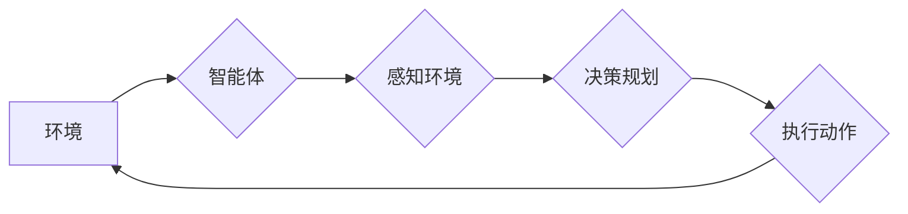

> 强化学习，自动驾驶，决策规划，深度强化学习，模型预测控制，强化学习算法

## 1. 背景介绍

自动驾驶技术作为未来交通运输的重要发展方向，其核心之一便是实现智能决策规划，即在复杂路况下，能够准确预测未来环境变化，并制定最优的驾驶策略。传统自动驾驶决策规划方法主要依赖于规则-基于模型的方法，例如基于地图的路径规划、基于预设规则的决策逻辑等。然而，这些方法存在局限性：

* **规则难以覆盖所有场景：** 交通环境复杂多变，难以预见所有可能发生的事件，规则难以覆盖所有场景，导致系统在面对未知情况时难以做出正确的决策。
* **模型难以准确预测未来：** 传统模型通常基于静态数据，难以准确预测未来环境变化，导致决策规划缺乏灵活性。

近年来，随着深度学习技术的快速发展，强化学习（Reinforcement Learning，RL）逐渐成为自动驾驶决策规划的新兴技术，并展现出巨大的潜力。

## 2. 核心概念与联系

强化学习是一种机器学习方法，通过强化信号（奖励或惩罚）来训练智能体，使其在环境中学习最优策略。

**核心概念：**

* **智能体（Agent）：** 自动驾驶系统，负责感知环境、做出决策并执行动作。
* **环境（Environment）：** 交通场景，包括道路、车辆、行人等。
* **状态（State）：** 智能体在环境中的当前状态，例如车辆位置、速度、周围车辆信息等。
* **动作（Action）：** 智能体可以执行的动作，例如加速、减速、转向等。
* **奖励（Reward）：** 环境对智能体动作的反馈，例如安全驾驶、到达目的地等。
* **策略（Policy）：** 智能体根据当前状态选择动作的策略。

**强化学习与自动驾驶决策规划的联系：**

强化学习可以将自动驾驶决策规划问题抽象为一个马尔可夫决策过程（MDP），其中智能体在环境中不断采取行动，并根据环境反馈获得奖励。通过不断学习和调整策略，智能体最终能够学习到最优的驾驶策略，实现安全、高效的自动驾驶。

**Mermaid 流程图：**



## 3. 核心算法原理 & 具体操作步骤

### 3.1  算法原理概述

深度强化学习（Deep Reinforcement Learning，DRL）是强化学习的一种变体，它将深度神经网络引入到强化学习算法中，能够学习更复杂的策略。

常见的DRL算法包括：

* **Q-学习：** 通过学习状态-动作值函数（Q-value），选择最大Q值的行动。
* **SARSA：** 与Q-学习类似，但使用当前状态-动作对的实际回报更新Q-value。
* **Deep Q-Network（DQN）：** 使用深度神经网络逼近Q-value函数，能够处理高维状态空间。
* **Policy Gradient：** 直接学习策略函数，通过梯度上升更新策略参数。

### 3.2  算法步骤详解

以DQN算法为例，其具体操作步骤如下：

1. **初始化神经网络：** 创建一个深度神经网络，作为Q-value函数的逼近器。
2. **经验回放：** 将训练过程中收集到的状态-动作-奖励-下一个状态数据存储在经验回放池中。
3. **采样数据：** 从经验回放池中随机采样一批数据。
4. **计算Q-value：** 将状态输入神经网络，得到Q-value估计。
5. **更新目标网络：** 使用目标网络计算目标Q-value，并根据损失函数更新神经网络参数。
6. **重复步骤3-5：** 持续迭代训练过程，直到达到预设的性能指标。

### 3.3  算法优缺点

**优点：**

* **能够处理高维状态空间：** 深度神经网络能够学习复杂的非线性关系，适用于高维状态空间的自动驾驶决策规划。
* **学习能力强：** 通过强化学习，智能体能够从经验中学习，不断改进决策策略。
* **适应性强：** 强化学习算法能够适应不断变化的环境，例如交通规则、路况等。

**缺点：**

* **训练时间长：** 强化学习算法通常需要大量的训练数据和时间。
* **数据依赖性强：** 强化学习算法需要大量的真实驾驶数据进行训练，数据质量直接影响算法性能。
* **安全问题：** 强化学习算法在训练过程中可能出现不可预测的行为，需要进行充分的安全测试和验证。

### 3.4  算法应用领域

强化学习算法在自动驾驶决策规划领域有着广泛的应用，例如：

* **路径规划：** 学习最优的路径，避免碰撞和拥堵。
* **车道保持：** 保持车辆在车道内行驶。
* **交通信号灯控制：** 学习最优的信号灯控制策略，提高交通效率。
* **自动泊车：** 自动寻找停车位并完成泊车操作。

## 4. 数学模型和公式 & 详细讲解 & 举例说明

### 4.1  数学模型构建

强化学习问题可以建模为马尔可夫决策过程（MDP），其核心要素包括：

* 状态空间 S：所有可能的系统状态的集合。
* 动作空间 A：智能体可以执行的动作的集合。
* 转移概率矩阵 P：描述从一个状态到另一个状态的概率分布。
* 奖励函数 R：描述智能体在某个状态执行某个动作后获得的奖励。
* 策略 π：描述智能体在每个状态下选择动作的策略。

### 4.2  公式推导过程

目标是找到最优策略 π*，使得智能体在长期的交互过程中获得最大的累积奖励。

最优策略的定义：

$$
\pi^* = \arg\max_{\pi} \mathbb{E}_{\pi} \sum_{t=0}^{\infty} \gamma^t R_t
$$

其中：

* $\mathbb{E}_{\pi}$ 表示根据策略 π 采样的期望值。
* $\gamma$ 是折扣因子，控制未来奖励的权重。
* $R_t$ 是在时间步 t 获得的奖励。

### 4.3  案例分析与讲解

例如，在自动驾驶场景中，状态空间可以包含车辆位置、速度、周围车辆信息等，动作空间可以包含加速、减速、转向等。

奖励函数可以设计为：

* 安全驾驶：奖励安全行驶，惩罚碰撞等危险行为。
* 效率驾驶：奖励到达目的地时间短，惩罚行驶距离长等。

通过强化学习算法，智能体可以学习到最优的驾驶策略，例如在复杂路况下安全避让车辆、高效规划路线等。

## 5. 项目实践：代码实例和详细解释说明

### 5.1  开发环境搭建

* 操作系统：Ubuntu 20.04
* Python 版本：3.8
* 深度学习框架：TensorFlow 2.x

### 5.2  源代码详细实现

```python
import tensorflow as tf

# 定义神经网络模型
class DQN(tf.keras.Model):
    def __init__(self, state_size, action_size):
        super(DQN, self).__init__()
        self.dense1 = tf.keras.layers.Dense(64, activation='relu')
        self.dense2 = tf.keras.layers.Dense(32, activation='relu')
        self.output = tf.keras.layers.Dense(action_size)

    def call(self, state):
        x = self.dense1(state)
        x = self.dense2(x)
        return self.output(x)

# 定义强化学习算法
class DQN_Agent:
    def __init__(self, state_size, action_size, learning_rate=0.001):
        self.model = DQN(state_size, action_size)
        self.target_model = DQN(state_size, action_size)
        self.optimizer = tf.keras.optimizers.Adam(learning_rate)

    def train(self, state, action, reward, next_state, done):
        # 计算Q-value
        with tf.GradientTape() as tape:
            q_values = self.model(state)
            q_target = reward + self.target_model(next_state) * (1 - done)
            loss = tf.keras.losses.MeanSquaredError()(q_values[0, action], q_target)

        # 更新模型参数
        gradients = tape.gradient(loss, self.model.trainable_variables)
        self.optimizer.apply_gradients(zip(gradients, self.model.trainable_variables))

    def predict_action(self, state):
        q_values = self.model(state)
        return tf.argmax(q_values[0]).numpy()

# ... 其他代码 ...
```

### 5.3  代码解读与分析

* **DQN 模型：** 定义了一个深度神经网络模型，用于逼近Q-value函数。
* **DQN_Agent 类：** 定义了一个强化学习代理，包含模型、目标模型、优化器等组件。
* **train 方法：** 实现DQN算法的训练过程，包括计算Q-value、计算损失函数、更新模型参数等步骤。
* **predict_action 方法：** 根据当前状态预测最优动作。

### 5.4  运行结果展示

通过训练DQN模型，可以观察智能体在模拟环境中学习驾驶策略，例如路径规划、车道保持等。

## 6. 实际应用场景

### 6.1  自动驾驶汽车

强化学习可以用于训练自动驾驶汽车的决策规划系统，使其能够在复杂路况下安全、高效地行驶。

### 6.2  无人机飞行

强化学习可以用于训练无人机的飞行控制系统，使其能够自主避障、路径规划等。

### 6.3  机器人导航

强化学习可以用于训练机器人的导航系统，使其能够在复杂环境中自主导航。

### 6.4  未来应用展望

强化学习在自动驾驶决策规划领域有着巨大的应用潜力，未来可能应用于：

* 更复杂的驾驶场景，例如高速公路、复杂交叉路口等。
* 更智能的驾驶行为，例如主动安全驾驶、协同驾驶等。
* 更个性化的驾驶体验，例如根据驾驶者的喜好调整驾驶风格等。

## 7. 工具和资源推荐

### 7.1  学习资源推荐

* **书籍：**
    * Reinforcement Learning: An Introduction by Richard S. Sutton and Andrew G. Barto
    * Deep Reinforcement Learning Hands-On by Maxim Lapan
* **在线课程：**
    * Deep Reinforcement Learning Specialization by DeepLearning.AI
    * Reinforcement Learning by David Silver (University of DeepMind)

### 7.2  开发工具推荐

* **深度学习框架：** TensorFlow, PyTorch
* **强化学习库：** OpenAI Gym, Stable Baselines3

### 7.3  相关论文推荐

* Deep Reinforcement Learning for Autonomous Driving
* End-to-End Learning for Self-Driving Cars
* Learning to Drive with Deep Reinforcement Learning

## 8. 总结：未来发展趋势与挑战

### 8.1  研究成果总结

强化学习在自动驾驶决策规划领域取得了显著进展，能够学习更复杂的策略，并实现更智能的驾驶行为。

### 8.2  未来发展趋势

* **模型规模和复杂度提升：** 随着计算能力的提升，强化学习模型将变得更大、更复杂，能够处理更复杂的驾驶场景。
* **多模态感知融合：** 将视觉、雷达、激光雷达等多模态感知数据融合到强化学习模型中，提高决策的准确性和鲁棒性。
* **场景迁移和泛化能力增强：** 提高强化学习模型的场景迁移和泛化能力，使其能够适应不同的驾驶环境和驾驶风格。

### 8.3  面临的挑战

*