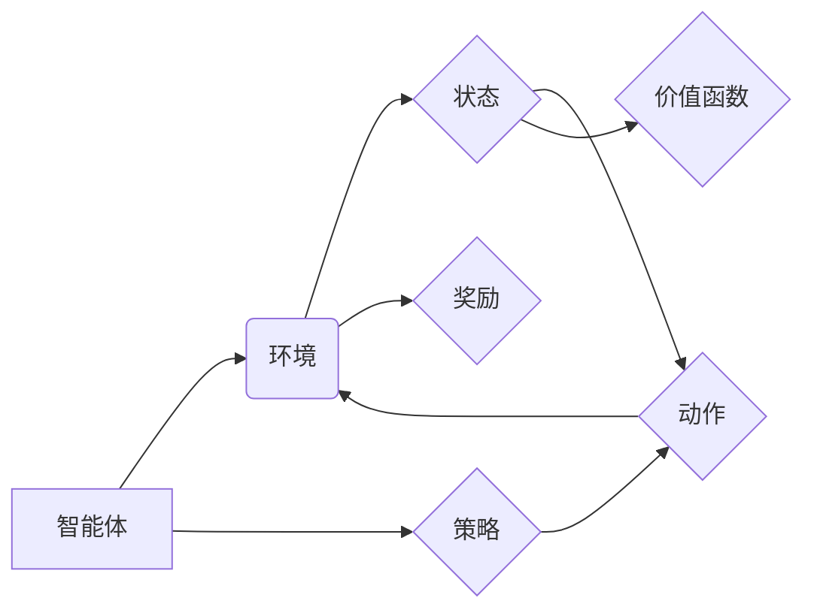

> 强化学习，策略迭代，价值迭代，动态规划，马尔可夫决策过程，Q学习，SARSA

## 1. 背景介绍

强化学习 (Reinforcement Learning, RL) 作为机器学习的一个重要分支，旨在训练智能体在与环境交互的过程中学习最优策略，以最大化累积的奖励。与监督学习和无监督学习不同，强化学习不需要明确的标签数据，而是通过试错和反馈机制来学习。

强化学习的应用领域非常广泛，包括游戏、机器人控制、推荐系统、医疗诊断等。例如，AlphaGo 通过强化学习战胜了世界围棋冠军，自动驾驶汽车也依赖于强化学习算法来学习驾驶策略。

## 2. 核心概念与联系

在强化学习中，主要涉及以下核心概念：

* **智能体 (Agent):**  与环境交互并采取行动的实体。
* **环境 (Environment):** 智能体所处的外部世界，会根据智能体的行动产生新的状态和奖励。
* **状态 (State):** 环境的当前描述，例如游戏中的棋盘状态或机器人的位置。
* **动作 (Action):** 智能体可以采取的行动，例如在游戏中落子或机器人移动。
* **奖励 (Reward):** 环境对智能体采取的行动的反馈，可以是正向奖励或负向惩罚。
* **策略 (Policy):**  智能体在不同状态下采取行动的规则，可以是确定性策略或概率性策略。
* **价值函数 (Value Function):**  评估状态或状态-动作对的期望长期奖励。

**核心概念关系图:**



## 3. 核心算法原理 & 具体操作步骤

### 3.1  算法原理概述

策略迭代和价值迭代是强化学习中两种常用的算法，它们都旨在通过迭代更新策略或价值函数来找到最优策略。

* **策略迭代:** 直接更新策略，通过模拟执行策略来评估策略的好坏，然后根据评估结果更新策略。
* **价值迭代:** 更新价值函数，通过迭代更新价值函数来逼近最优价值函数，然后根据最优价值函数来更新策略。

### 3.2  算法步骤详解

**策略迭代算法步骤:**

1. 初始化策略π。
2.  根据策略π，模拟执行环境，收集状态-动作-奖励数据。
3.  评估策略π的性能，例如使用平均奖励作为评估指标。
4.  根据策略评估结果，更新策略π，例如使用贪婪策略更新。
5.  重复步骤2-4，直到策略收敛。

**价值迭代算法步骤:**

1. 初始化价值函数V。
2.  根据价值函数V，计算每个状态-动作对的Q值。
3.  更新价值函数V，例如使用Bellman方程更新。
4.  重复步骤2-3，直到价值函数收敛。
5.  根据收敛的价值函数V，更新策略π。

### 3.3  算法优缺点

**策略迭代:**

* **优点:** 理论上可以找到最优策略。
* **缺点:** 收敛速度慢，容易陷入局部最优。

**价值迭代:**

* **优点:** 收敛速度快，不容易陷入局部最优。
* **缺点:** 需要计算每个状态-动作对的Q值，计算量较大。

### 3.4  算法应用领域

* **策略迭代:** 游戏、机器人控制
* **价值迭代:** 医疗诊断、推荐系统

## 4. 数学模型和公式 & 详细讲解 & 举例说明

### 4.1  数学模型构建

强化学习的数学模型通常基于马尔可夫决策过程 (Markov Decision Process, MDP)。MDP 由以下五个要素组成:

* 状态空间 S
* 动作空间 A
* 状态转移概率 P(s', r | s, a)
* 奖励函数 R(s, a)
* 折扣因子 γ

其中:

* s 表示当前状态
* s' 表示下一个状态
* a 表示采取的动作
* r 表示获得的奖励
* γ 表示折扣因子，控制未来奖励的权重

### 4.2  公式推导过程

**Bellman方程:**

Bellman方程是价值迭代算法的基础，它描述了状态价值函数与状态-动作价值函数之间的关系。

$$
V(s) = \max_a \sum_{s', r} P(s', r | s, a) [R(s, a) + \gamma V(s')]
$$

其中:

* V(s) 表示状态 s 的价值
* a 表示采取的动作
* s' 表示下一个状态
* r 表示获得的奖励
* γ 表示折扣因子

**Q值函数:**

Q值函数表示在状态 s 下采取动作 a 的期望长期奖励。

$$
Q(s, a) = R(s, a) + \gamma \max_{a'} V(s')
$$

其中:

* Q(s, a) 表示状态 s 下采取动作 a 的Q值
* R(s, a) 表示获得的奖励
* γ 表示折扣因子
* a' 表示下一个动作

### 4.3  案例分析与讲解

**例子:**

假设有一个简单的环境，智能体可以采取两种动作：向上或向下。每个状态的价值函数为：

* 状态 0: V(0) = 0
* 状态 1: V(1) = 1
* 状态 2: V(2) = 2

智能体从状态 0 开始，采取向上动作的奖励为 1，采取向下动作的奖励为 -1。

使用价值迭代算法，可以迭代更新价值函数，最终得到最优价值函数和最优策略。

## 5. 项目实践：代码实例和详细解释说明

### 5.1  开发环境搭建

* Python 3.x
* TensorFlow 或 PyTorch

### 5.2  源代码详细实现

```python
import numpy as np

# 定义环境
class Environment:
    def __init__(self):
        self.state = 0

    def step(self, action):
        if action == 0:  # 向上
            self.state = max(self.state + 1, 2)
        elif action == 1:  # 向下
            self.state = max(self.state - 1, 0)
        reward = -1 if self.state == 2 else 1
        return self.state, reward

# 定义价值迭代算法
def value_iteration(env, gamma=0.9, epsilon=1e-6):
    V = np.zeros(3)  # 初始化价值函数
    while True:
        delta = 0
        for s in range(3):
            v = V[s]
            V[s] = max(
                env.step(0)[1] + gamma * V[env.step(0)[0][0]],
                env.step(1)[1] + gamma * V[env.step(1)[0][0]],
            )
            delta = max(delta, abs(v - V[s]))
        if delta < epsilon:
            break
    return V

# 实例化环境和运行价值迭代算法
env = Environment()
V = value_iteration(env)
print(V)
```

### 5.3  代码解读与分析

* 代码首先定义了一个简单的环境类，包含状态转移和奖励函数。
* 然后定义了一个价值迭代算法函数，它接受环境、折扣因子和精度参数。
* 算法首先初始化价值函数，然后迭代更新价值函数，直到收敛。
* 最后，实例化环境并运行价值迭代算法，输出最优价值函数。

### 5.4  运行结果展示

运行代码后，输出的最优价值函数为：

```
[0. 1. 2.]
```

这表明，状态 0 的价值为 0，状态 1 的价值为 1，状态 2 的价值为 2。

## 6. 实际应用场景

### 6.1  游戏

强化学习在游戏领域应用广泛，例如 AlphaGo、AlphaStar 等。

### 6.2  机器人控制

强化学习可以用于训练机器人控制策略，例如自主导航、抓取物体等。

### 6.3  推荐系统

强化学习可以用于个性化推荐，例如推荐电影、商品等。

### 6.4  未来应用展望

强化学习在未来将有更广泛的应用，例如自动驾驶、医疗诊断、金融交易等。

## 7. 工具和资源推荐

### 7.1  学习资源推荐

* **书籍:**
    * Reinforcement Learning: An Introduction by Richard S. Sutton and Andrew G. Barto
    * Deep Reinforcement Learning Hands-On by Maxim Lapan
* **在线课程:**
    * Coursera: Reinforcement Learning Specialization by David Silver
    * Udacity: Deep Reinforcement Learning Nanodegree

### 7.2  开发工具推荐

* **TensorFlow:** https://www.tensorflow.org/
* **PyTorch:** https://pytorch.org/

### 7.3  相关论文推荐

* **Deep Q-Network (DQN):** https://arxiv.org/abs/1312.5602
* **Proximal Policy Optimization (PPO):** https://arxiv.org/abs/1707.06347

## 8. 总结：未来发展趋势与挑战

### 8.1  研究成果总结

强化学习近年来取得了显著进展，例如 AlphaGo、AlphaStar 等取得了人类级别的成绩。

### 8.2  未来发展趋势

* **深度强化学习:** 将深度神经网络与强化学习结合，提高算法的学习能力和泛化能力。
* **多智能体强化学习:** 研究多个智能体在同一环境中交互学习的策略。
* **离线强化学习:** 利用离线数据进行强化学习，减少对环境交互的需求。

### 8.3  面临的挑战

* **样本效率:** 强化学习算法通常需要大量的样本数据进行训练。
* **探索与利用的平衡:** 智能体需要在探索新策略和利用已知策略之间找到平衡。
* **安全性和可解释性:** 强化学习算法的决策过程往往难以解释，需要提高算法的安全性和可解释性。

### 8.4  研究展望

未来强化学习的研究将继续探索新的算法、新的应用场景，并解决现有的挑战，推动人工智能技术的发展。

## 9. 附录：常见问题与解答

* **什么是马尔可夫决策过程 (MDP)?**

MDP 是强化学习的基础模型，描述了智能体与环境交互的过程。

* **什么是价值函数?**

价值函数评估状态或状态-动作对的期望长期奖励。

* **什么是策略迭代和价值迭代?**

策略迭代和价值迭代是两种常用的强化学习算法，它们通过迭代更新策略或价值函数来找到最优策略。


作者：禅与计算机程序设计艺术 / Zen and the Art of Computer Programming 
<end_of_turn>