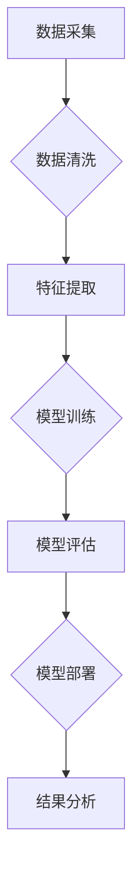

> 搜索数据分析, AI, 深度洞察, 搜索策略优化, 机器学习, 自然语言处理, 数据可视化, 搜索引擎, 用户行为分析

## 1. 背景介绍

在当今数据爆炸的时代，搜索引擎已成为人们获取信息的主要途径。用户每天通过搜索引擎提出数以亿计的查询，这些查询数据蕴含着丰富的用户需求、行为模式和市场趋势。如何有效地分析这些搜索数据，从中挖掘出有价值的洞察，并将其应用于优化搜索策略，已成为搜索引擎领域的一项重要课题。

传统的搜索数据分析方法主要依赖于统计分析和规则匹配，其分析深度有限，难以捕捉到用户行为背后的复杂关系。随着人工智能技术的快速发展，机器学习和自然语言处理等技术为搜索数据分析提供了新的思路和方法。

## 2. 核心概念与联系

**2.1 搜索数据分析的核心概念**

搜索数据分析是指对搜索引擎产生的各种数据进行收集、清洗、分析和挖掘，以获取用户行为、搜索趋势、市场动态等有价值的信息。

**2.2 搜索数据分析与AI的联系**

人工智能技术为搜索数据分析提供了强大的工具和方法，主要体现在以下几个方面：

* **机器学习:** 可以用于识别用户搜索意图、预测用户搜索行为、推荐相关搜索结果等。
* **自然语言处理:** 可以用于理解用户搜索词语的语义，提取关键词，识别用户情感等。
* **深度学习:** 可以用于构建更复杂的搜索模型，提高搜索结果的准确性和相关性。

**2.3 搜索数据分析的流程**



## 3. 核心算法原理 & 具体操作步骤

**3.1 算法原理概述**

搜索数据分析中常用的算法包括：

* **协同过滤:** 基于用户或物品之间的相似性，推荐相关的内容。
* **基于内容的推荐:** 根据用户历史行为和物品特征，推荐相关的内容。
* **深度学习模型:** 如循环神经网络（RNN）、长短期记忆网络（LSTM）等，用于理解用户搜索意图和预测用户行为。

**3.2 算法步骤详解**

以协同过滤算法为例，其步骤如下：

1. **构建用户-物品交互矩阵:** 将用户和物品作为行和列，记录用户对物品的交互行为（如点击、评分等）。
2. **计算用户相似度:** 使用余弦相似度等方法计算用户之间的相似度。
3. **推荐物品:** 对于给定用户，找到与其相似度最高的几个用户，并推荐他们喜欢的物品。

**3.3 算法优缺点**

* **协同过滤:**
    * **优点:** 可以发现隐含的用户偏好，推荐个性化内容。
    * **缺点:** 数据稀疏性问题，新用户和新物品的推荐效果较差。
* **基于内容的推荐:**
    * **优点:** 不需要用户历史行为数据，可以推荐新物品。
    * **缺点:** 难以捕捉用户隐含的偏好。
* **深度学习模型:**
    * **优点:** 可以学习更复杂的特征，提高推荐效果。
    * **缺点:** 需要大量的数据进行训练，模型训练成本较高。

**3.4 算法应用领域**

搜索数据分析算法广泛应用于以下领域：

* **搜索引擎结果排序:** 根据用户搜索意图和历史行为，排序搜索结果。
* **个性化推荐:** 为用户推荐个性化的搜索结果、产品和服务。
* **市场趋势分析:** 分析用户搜索趋势，预测市场需求和产品热度。
* **用户行为分析:** 了解用户搜索行为模式，优化用户体验。

## 4. 数学模型和公式 & 详细讲解 & 举例说明

**4.1 数学模型构建**

搜索数据分析中常用的数学模型包括：

* **概率模型:** 用于描述用户搜索行为的概率分布。
* **统计模型:** 用于分析用户搜索行为的统计特征。
* **机器学习模型:** 用于学习用户搜索行为的模式，并进行预测。

**4.2 公式推导过程**

以概率模型为例，假设用户对某个关键词的搜索概率为P(q)，其中q表示关键词。我们可以使用贝叶斯公式来计算用户对某个关键词的搜索概率，即：

$$P(q|D) = \frac{P(D|q)P(q)}{P(D)}$$

其中：

* $P(q|D)$ 表示用户在给定上下文D下搜索关键词q的概率。
* $P(D|q)$ 表示在用户搜索关键词q的情况下，观察到上下文D的概率。
* $P(q)$ 表示用户搜索关键词q的先验概率。
* $P(D)$ 表示观察到上下文D的概率。

**4.3 案例分析与讲解**

假设我们有一个搜索引擎，用户搜索关键词“人工智能”。我们可以使用贝叶斯公式来计算用户在搜索“人工智能”时，点击相关结果的概率。

* $P(q)$ 可以根据历史数据统计得到。
* $P(D|q)$ 可以根据用户点击行为数据统计得到。
* $P(D)$ 可以根据所有用户搜索行为数据统计得到。

通过计算以上公式，我们可以得到用户在搜索“人工智能”时，点击相关结果的概率。

## 5. 项目实践：代码实例和详细解释说明

**5.1 开发环境搭建**

* Python 3.x
* Jupyter Notebook
* scikit-learn
* TensorFlow

**5.2 源代码详细实现**

```python
# 导入必要的库
import pandas as pd
from sklearn.feature_extraction.text import TfidfVectorizer
from sklearn.metrics.pairwise import cosine_similarity

# 加载数据
data = pd.read_csv('search_data.csv')

# 特征提取
vectorizer = TfidfVectorizer()
tfidf_matrix = vectorizer.fit_transform(data['query'])

# 计算余弦相似度
similarity_matrix = cosine_similarity(tfidf_matrix)

# 推荐相关查询
def recommend_queries(query, top_n=5):
    query_vector = vectorizer.transform([query])
    similarity_scores = cosine_similarity(query_vector, tfidf_matrix)
    similar_indices = similarity_scores.argsort()[0][::-1]
    return data['query'].iloc[similar_indices[:top_n]]

# 示例
query = '人工智能'
recommendations = recommend_queries(query)
print(f'推荐查询: {recommendations}')
```

**5.3 代码解读与分析**

* 首先，我们导入必要的库，并加载搜索数据。
* 然后，我们使用TF-IDF方法提取查询的特征向量。
* 接着，我们计算查询之间的余弦相似度，并根据相似度推荐相关查询。

**5.4 运行结果展示**

运行以上代码，可以得到与输入查询相关的推荐查询结果。

## 6. 实际应用场景

**6.1 搜索结果排序**

搜索引擎可以利用搜索数据分析算法，根据用户搜索意图和历史行为，对搜索结果进行排序，提高搜索结果的准确性和相关性。

**6.2 个性化推荐**

电商平台可以利用搜索数据分析算法，为用户推荐个性化的商品和服务，提高用户体验和转化率。

**6.3 市场趋势分析**

市场调研机构可以利用搜索数据分析算法，分析用户搜索趋势，预测市场需求和产品热度，为企业提供决策支持。

**6.4 用户行为分析**

网站运营人员可以利用搜索数据分析算法，了解用户搜索行为模式，优化网站结构和内容，提高用户粘性和转化率。

**6.5 未来应用展望**

随着人工智能技术的不断发展，搜索数据分析将应用于更多领域，例如：

* **医疗诊断:** 利用搜索数据分析，辅助医生进行疾病诊断。
* **教育教学:** 利用搜索数据分析，个性化推荐学习资源，提高学习效率。
* **金融投资:** 利用搜索数据分析，预测市场趋势，辅助投资决策。

## 7. 工具和资源推荐

**7.1 学习资源推荐**

* **书籍:**
    * 《搜索引擎优化》
    * 《数据挖掘》
    * 《机器学习》
* **在线课程:**
    * Coursera: 数据科学
    * edX: 机器学习
    * Udacity: 深度学习

**7.2 开发工具推荐**

* **Python:** 
    * scikit-learn
    * TensorFlow
    * PyTorch
* **数据分析工具:**
    * Jupyter Notebook
    * Pandas
    * Matplotlib

**7.3 相关论文推荐**

* **论文:**
    * 《基于深度学习的搜索结果排序》
    * 《协同过滤推荐算法综述》
    * 《自然语言处理技术在搜索引擎中的应用》

## 8. 总结：未来发展趋势与挑战

**8.1 研究成果总结**

搜索数据分析已取得了显著的成果，为搜索引擎、电商平台、市场调研机构等领域提供了强大的工具和方法。

**8.2 未来发展趋势**

* **更精准的搜索结果:** 利用深度学习等技术，进一步提高搜索结果的准确性和相关性。
* **更个性化的推荐:** 基于用户行为和偏好，提供更个性化的商品和服务推荐。
* **更深入的用户行为分析:** 利用大数据分析技术，深入挖掘用户行为模式，为企业提供更精准的决策支持。

**8.3 面临的挑战**

* **数据隐私保护:** 搜索数据包含大量用户隐私信息，如何保护用户隐私是需要解决的关键问题。
* **算法公平性:** 搜索算法可能会存在偏见，导致搜索结果不公平，需要研究如何构建公平的搜索算法。
* **解释性问题:** 深度学习模型的决策过程难以解释，需要研究如何提高模型的解释性。

**8.4 研究展望**

未来，搜索数据分析将继续朝着更精准、更个性化、更深入的方向发展，并与其他人工智能技术融合，为人们提供更智能、更便捷的搜索体验。

## 9. 附录：常见问题与解答

**9.1 如何处理搜索数据中的噪声？**

可以使用数据清洗技术，例如去除重复数据、错误数据和无关数据，以减少噪声的影响。

**9.2 如何评估搜索数据分析算法的性能？**

可以使用各种评估指标，例如准确率、召回率、F1-score等，来评估算法的性能。

**9.3 如何应对数据稀疏性问题？**

可以使用协同过滤算法的变种，例如基于矩阵分解的协同过滤算法，来应对数据稀疏性问题。


作者：禅与计算机程序设计艺术 / Zen and the Art of Computer Programming 
<end_of_turn>