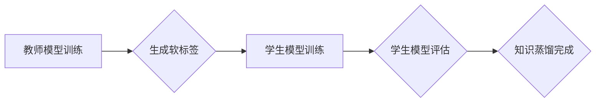

> 知识蒸馏，教师模型，学生模型，模型压缩，迁移学习，深度学习

## 1. 背景介绍

深度学习模型在图像识别、自然语言处理等领域取得了显著的成就，但其巨大的模型规模和高昂的计算成本限制了其在资源有限的设备上的部署。知识蒸馏（Knowledge Distillation）作为一种模型压缩技术，旨在将知识从一个大型的教师模型（Teacher Model）迁移到一个更小的学生模型（Student Model）中，从而实现模型压缩和加速。

知识蒸馏的核心思想是，除了预测结果外，教师模型的输出还可以包含其他有价值的信息，例如预测概率分布、中间层特征等。学生模型可以通过学习这些信息来提高其性能，即使其参数数量远小于教师模型。

## 2. 核心概念与联系

**2.1 教师模型与学生模型**

* **教师模型:** 通常是一个经过充分训练，具有高精度的预训练模型。它拥有大量的参数和复杂的结构，能够捕获丰富的特征和知识。
* **学生模型:** 通常是一个比教师模型更小的模型，参数数量更少，结构更简单。它通过学习教师模型的知识来提高其性能。

**2.2 知识蒸馏过程**

知识蒸馏的过程可以概括为以下步骤：

1. **训练教师模型:** 使用大量数据训练一个大型的教师模型，使其达到高精度。
2. **生成教师模型的软标签:** 将教师模型的输出概率分布作为软标签，而不是硬标签（即类别标签）。
3. **训练学生模型:** 使用教师模型的软标签来训练学生模型，使其学习教师模型的知识。

**2.3  知识蒸馏的优势**

* **模型压缩:** 学生模型的参数数量远小于教师模型，可以显著减少模型大小和计算成本。
* **性能提升:** 学生模型可以通过学习教师模型的知识来提高其性能，即使其参数数量更少。
* **迁移学习:** 教师模型的知识可以迁移到新的任务或领域，从而提高学生模型的泛化能力。

**2.4  知识蒸馏的挑战**

* **知识选择:** 如何选择教师模型中哪些信息对学生模型的学习最有效？
* **训练策略:** 如何设计有效的训练策略，使学生模型能够充分学习教师模型的知识？
* **评估指标:** 如何评估知识蒸馏的效果？

**2.5  Mermaid 流程图**



## 3. 核心算法原理 & 具体操作步骤

### 3.1  算法原理概述

知识蒸馏的核心算法是利用教师模型的软标签来训练学生模型。教师模型的输出概率分布可以看作是其对输入数据的预测概率，而学生模型的目标是学习到这个概率分布。

### 3.2  算法步骤详解

1. **训练教师模型:** 使用大量数据训练一个大型的教师模型，使其达到高精度。
2. **生成教师模型的软标签:** 将教师模型的输出概率分布作为软标签，而不是硬标签（即类别标签）。
3. **训练学生模型:** 使用教师模型的软标签来训练学生模型，使其学习教师模型的知识。
4. **评估学生模型:** 使用测试集评估学生模型的性能，并与教师模型的性能进行比较。

### 3.3  算法优缺点

**优点:**

* 模型压缩: 学生模型的参数数量远小于教师模型，可以显著减少模型大小和计算成本。
* 性能提升: 学生模型可以通过学习教师模型的知识来提高其性能，即使其参数数量更少。
* 迁移学习: 教师模型的知识可以迁移到新的任务或领域，从而提高学生模型的泛化能力。

**缺点:**

* 训练复杂度: 训练学生模型需要使用教师模型的软标签，这增加了训练的复杂度。
* 知识选择: 如何选择教师模型中哪些信息对学生模型的学习最有效？
* 训练策略: 如何设计有效的训练策略，使学生模型能够充分学习教师模型的知识？

### 3.4  算法应用领域

知识蒸馏技术在以下领域有广泛的应用:

* **图像识别:** 将大型的图像识别模型压缩到更小的模型，以便在移动设备上部署。
* **自然语言处理:** 将大型的语言模型压缩到更小的模型，以便在资源有限的设备上进行文本分类、机器翻译等任务。
* **语音识别:** 将大型的语音识别模型压缩到更小的模型，以便在嵌入式设备上进行语音识别。

## 4. 数学模型和公式 & 详细讲解 & 举例说明

### 4.1  数学模型构建

知识蒸馏的目标是让学生模型的输出分布尽可能接近教师模型的输出分布。我们可以使用KL散度（Kullback-Leibler Divergence）来度量这两个分布之间的差异。

### 4.2  公式推导过程

假设教师模型的输出概率分布为 $p(y|x)$，学生模型的输出概率分布为 $q(y|x)$，则KL散度可以表示为：

$$
D_{KL}(p||q) = \sum_{y} p(y|x) \log \frac{p(y|x)}{q(y|x)}
$$

其中，$x$ 表示输入数据，$y$ 表示输出类别。

### 4.3  案例分析与讲解

假设我们有一个图像分类任务，教师模型是一个ResNet-50模型，学生模型是一个MobileNet模型。我们可以使用知识蒸馏技术将ResNet-50的知识迁移到MobileNet中。

在训练过程中，我们将ResNet-50的输出概率分布作为MobileNet的软标签，并使用KL散度作为损失函数。通过训练，MobileNet能够学习到ResNet-50的知识，从而提高其分类精度。

## 5. 项目实践：代码实例和详细解释说明

### 5.1  开发环境搭建

* Python 3.6+
* PyTorch 1.0+
* CUDA 10.0+

### 5.2  源代码详细实现

```python
import torch
import torch.nn as nn
import torch.optim as optim

# 定义教师模型和学生模型
class TeacherModel(nn.Module):
    # ...

class StudentModel(nn.Module):
    # ...

# 加载预训练的教师模型
teacher_model = TeacherModel()
teacher_model.load_state_dict(torch.load('teacher_model.pth'))

# 实例化学生模型
student_model = StudentModel()

# 定义损失函数和优化器
criterion = nn.KLDivLoss(reduction='batchmean')
optimizer = optim.Adam(student_model.parameters(), lr=0.001)

# 训练循环
for epoch in range(num_epochs):
    for batch_idx, (data, target) in enumerate(train_loader):
        # 前向传播
        teacher_output = teacher_model(data)
        student_output = student_model(data)

        # 计算损失
        loss = criterion(teacher_output, student_output)

        # 反向传播
        optimizer.zero_grad()
        loss.backward()
        optimizer.step()

# 保存训练好的学生模型
torch.save(student_model.state_dict(), 'student_model.pth')
```

### 5.3  代码解读与分析

* 代码首先定义了教师模型和学生模型，并加载预训练的教师模型。
* 然后，实例化学生模型，定义损失函数和优化器。
* 训练循环中，首先使用教师模型对数据进行前向传播，得到教师模型的输出概率分布。
* 然后，使用学生模型对数据进行前向传播，得到学生模型的输出概率分布。
* 计算KL散度作为损失函数，并使用优化器更新学生模型的参数。
* 最后，保存训练好的学生模型。

### 5.4  运行结果展示

训练完成后，可以将训练好的学生模型与教师模型在测试集上进行比较，评估学生模型的性能。

## 6. 实际应用场景

知识蒸馏技术在实际应用中具有广泛的应用场景，例如：

* **移动设备上的图像识别:** 将大型的图像识别模型压缩到更小的模型，以便在移动设备上进行部署。
* **嵌入式设备上的语音识别:** 将大型的语音识别模型压缩到更小的模型，以便在嵌入式设备上进行语音识别。
* **资源有限的服务器上的机器翻译:** 将大型的机器翻译模型压缩到更小的模型，以便在资源有限的服务器上进行机器翻译。

### 6.4  未来应用展望

随着深度学习技术的不断发展，知识蒸馏技术将会得到更广泛的应用。未来，知识蒸馏技术可能会应用于以下领域：

* **自动驾驶:** 将大型的自动驾驶模型压缩到更小的模型，以便在嵌入式设备上进行部署。
* **医疗诊断:** 将大型的医疗诊断模型压缩到更小的模型，以便在移动设备上进行部署。
* **个性化推荐:** 将大型的个性化推荐模型压缩到更小的模型，以便在移动设备上进行部署。

## 7. 工具和资源推荐

### 7.1  学习资源推荐

* **论文:**
    * Hinton, G., Vinyals, O., & Dean, J. (2015). Distilling the knowledge in a neural network. arXiv preprint arXiv:1503.02531.
* **博客:**
    * https://blog.openai.com/better-language-models/
    * https://towardsdatascience.com/knowledge-distillation-a-powerful-technique-for-model-compression-a3999999999a

### 7.2  开发工具推荐

* **PyTorch:** https://pytorch.org/
* **TensorFlow:** https://www.tensorflow.org/

### 7.3  相关论文推荐

* **Teacher-Student Generative Adversarial Networks**
* **Multi-Teacher Knowledge Distillation**
* **Progressive Knowledge Distillation**

## 8. 总结：未来发展趋势与挑战

### 8.1  研究成果总结

知识蒸馏技术取得了显著的成果，成功地将大型模型的知识迁移到更小的模型中，实现了模型压缩和性能提升。

### 8.2  未来发展趋势

未来，知识蒸馏技术将会朝着以下方向发展：

* **更有效的知识选择和传输:** 研究更有效的知识选择和传输方法，提高知识蒸馏的效率。
* **跨模态知识蒸馏:** 研究跨模态知识蒸馏，将不同模态的知识进行迁移。
* **自监督知识蒸馏:** 研究自监督知识蒸馏，利用无标签数据进行知识蒸馏。

### 8.3  面临的挑战

知识蒸馏技术还面临着一些挑战：

* **知识选择:** 如何选择教师模型中哪些信息对学生模型的学习最有效？
* **训练策略:** 如何设计有效的训练策略，使学生模型能够充分学习教师模型的知识？
* **评估指标:** 如何评估知识蒸馏的效果？

### 8.4  研究展望

未来，知识蒸馏技术将会继续发展，并应用于更多领域。随着研究的深入，我们相信知识蒸馏技术将会成为深度学习模型压缩和性能提升的重要工具。

## 9. 附录：常见问题与解答

**Q1: 知识蒸馏的训练过程与传统的模型训练有什么区别？**

**A1:** 传统的模型训练使用硬标签（即类别标签）作为训练目标，而知识蒸馏使用教师模型的软标签（即输出概率分布）作为训练目标。

**Q2: 知识蒸馏的优势是什么？**

**A2:** 知识蒸馏可以实现模型压缩和性能提升，并具有迁移学习的能力。

**Q3: 知识蒸馏有哪些应用场景？**

**A3:** 知识蒸馏技术在图像识别、自然语言处理、语音识别等领域有广泛的应用场景。


作者：禅与计算机程序设计艺术 / Zen and the Art of Computer Programming 
<end_of_turn>