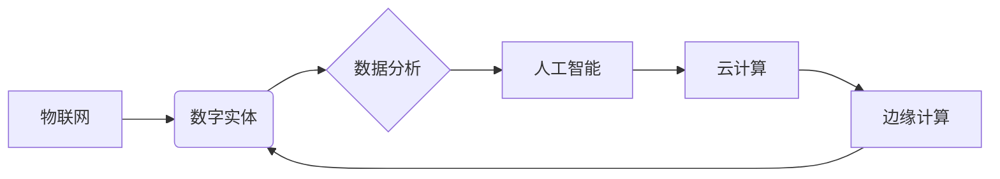

> 数字孪生、物理实体、数字实体、物联网、人工智能、边缘计算、云计算、数据融合、模型训练、仿真预测

## 1. 背景介绍

随着物联网、人工智能、云计算等技术的快速发展，数字世界与物理世界正在逐渐融合。数字实体与物理实体的融合，正在深刻地改变着我们的生活、工作和生产方式。

数字实体是指用数字模型来表示物理实体的虚拟副本。它可以实时收集物理实体的数据，并根据这些数据进行仿真、预测和控制。数字孪生是数字实体的一种典型应用，它可以模拟物理实体的整个生命周期，从设计、制造到使用和维护。

数字实体与物理实体的融合，带来了许多新的机遇和挑战。

**机遇：**

* **提高效率和生产力：** 数字实体可以帮助企业优化生产流程、降低成本、提高效率。
* **增强产品创新能力：** 数字实体可以帮助企业更快地开发和迭代新产品。
* **改善用户体验：** 数字实体可以提供更个性化、更智能的用户体验。
* **推动新兴产业发展：** 数字实体与物理实体的融合，将推动智能制造、智慧城市、智慧医疗等新兴产业的发展。

**挑战：**

* **数据安全和隐私保护：** 数字实体需要收集和处理大量的物理实体数据，因此数据安全和隐私保护是一个重要的挑战。
* **技术复杂性：** 数字实体的构建和维护需要复杂的算法和技术，需要跨多个领域的专业人才。
* **标准化和互操作性：** 目前，数字实体的标准化和互操作性还存在一些问题，需要进一步的探索和研究。

## 2. 核心概念与联系

数字实体与物理实体的融合，涉及到多个核心概念和技术，包括：

* **物联网 (IoT)：** 物联网是指通过传感器、网络和数据分析技术，将物理世界中的设备和物体连接起来，形成一个互联互通的网络。
* **人工智能 (AI)：** 人工智能是指模拟人类智能的计算机系统，包括机器学习、深度学习、自然语言处理等技术。
* **云计算 (Cloud Computing)：** 云计算是指通过互联网提供计算资源、存储资源和软件服务，用户可以按需使用这些资源。
* **边缘计算 (Edge Computing)：** 边缘计算是指将计算任务和数据处理从云端转移到靠近数据源的边缘设备，以降低延迟和提高效率。

**核心概念关系图：**



## 3. 核心算法原理 & 具体操作步骤

### 3.1  算法原理概述

数字实体的构建和维护需要多种算法，包括数据采集、数据处理、模型训练、仿真预测等。

* **数据采集：** 利用传感器、摄像头等设备，从物理实体收集各种数据，例如温度、湿度、位置、速度等。
* **数据处理：** 对采集到的数据进行清洗、预处理、特征提取等操作，以便于后续的模型训练和分析。
* **模型训练：** 利用机器学习、深度学习等算法，从处理后的数据中训练数字实体的模型，例如预测物理实体的未来状态、识别物理实体的异常情况等。
* **仿真预测：** 利用训练好的模型，对物理实体进行仿真模拟，预测其未来的状态和行为。

### 3.2  算法步骤详解

以数字孪生的构建为例，详细说明其算法步骤：

1. **数据采集：** 利用传感器、摄像头等设备，从物理实体收集各种数据，例如温度、湿度、位置、速度等。
2. **数据预处理：** 对采集到的数据进行清洗、去噪、缺失值填充等操作，确保数据的质量和完整性。
3. **特征提取：** 从预处理后的数据中提取关键特征，例如温度变化趋势、位置轨迹等，这些特征将作为模型训练的输入数据。
4. **模型选择：** 根据物理实体的特点和应用场景，选择合适的机器学习模型，例如回归模型、分类模型、时间序列模型等。
5. **模型训练：** 利用训练数据，训练选择的机器学习模型，调整模型参数，使其能够准确地预测物理实体的未来状态。
6. **模型评估：** 利用测试数据，评估模型的性能，例如预测精度、召回率、F1-score等。
7. **模型部署：** 将训练好的模型部署到云端或边缘设备，以便于实时地对物理实体进行仿真预测。

### 3.3  算法优缺点

数字实体构建算法的优缺点：

**优点：**

* **提高预测精度：** 利用机器学习算法，可以从海量数据中学习规律，提高对物理实体未来状态的预测精度。
* **实时性强：** 数字实体可以实时收集物理实体数据，并进行实时仿真预测，及时发现问题并采取措施。
* **可视化分析：** 数字实体可以将物理实体的状态和行为可视化，方便用户理解和分析。

**缺点：**

* **数据依赖性强：** 数字实体的性能取决于训练数据的质量和数量，如果训练数据不足或质量差，则模型的预测精度会降低。
* **算法复杂度高：** 数字实体的构建和维护需要复杂的算法和技术，需要专业的技术人员进行开发和维护。
* **计算资源消耗大：** 数字实体的仿真预测需要大量的计算资源，特别是对于复杂物理实体的仿真，计算资源消耗会更大。

### 3.4  算法应用领域

数字实体与物理实体的融合，在多个领域都有广泛的应用，例如：

* **智能制造：** 数字孪生可以帮助企业优化生产流程、降低成本、提高效率。
* **智慧城市：** 数字孪生可以帮助城市管理者更好地了解城市运行状况，优化城市规划和管理。
* **智慧医疗：** 数字孪生可以帮助医生模拟患者的病情，制定个性化的治疗方案。
* **交通运输：** 数字孪生可以帮助交通管理者优化交通流量，提高交通效率。

## 4. 数学模型和公式 & 详细讲解 & 举例说明

### 4.1  数学模型构建

数字实体的构建可以基于数学模型，例如状态空间模型、动力学模型等。

**状态空间模型：**

状态空间模型将物理实体的状态表示为一个状态向量，并将物理实体的动力学行为表示为一个状态转移方程。

**状态转移方程：**

$$
x(t+1) = f(x(t), u(t), w(t))
$$

其中：

* $x(t)$ 是物理实体的状态向量在时间 $t$ 的值。
* $u(t)$ 是物理实体的控制输入在时间 $t$ 的值。
* $w(t)$ 是物理实体的噪声输入在时间 $t$ 的值。
* $f$ 是状态转移函数，描述了物理实体的状态随时间变化的规律。

**举例说明：**

假设一个简单的机械系统，其状态向量包含位置和速度，状态转移方程可以表示为：

$$
\begin{bmatrix}
x_1(t+1) \\
x_2(t+1)
\end{bmatrix} = 
\begin{bmatrix}
1 & 1 \\
0 & 1
\end{bmatrix}
\begin{bmatrix}
x_1(t) \\
x_2(t)
\end{bmatrix} + 
\begin{bmatrix}
0 \\
u(t)
\end{bmatrix}
$$

其中：

* $x_1(t)$ 是位置。
* $x_2(t)$ 是速度。
* $u(t)$ 是控制输入（例如力）。

### 4.2  公式推导过程

根据状态转移方程，可以推导出物理实体的未来状态。例如，可以推导出物理实体在未来时间 $T$ 的位置：

$$
x_1(T) = \begin{bmatrix}
1 & 1 \\
0 & 1
\end{bmatrix}^{T}
\begin{bmatrix}
x_1(0) \\
x_2(0)
\end{bmatrix} + \sum_{t=0}^{T-1}
\begin{bmatrix}
0 \\
u(t)
\end{bmatrix}
$$

### 4.3  案例分析与讲解

通过对实际案例进行分析，可以更好地理解数字实体的构建和应用。例如，可以分析数字孪生在智能制造中的应用，例如预测机器设备的故障，优化生产流程等。

## 5. 项目实践：代码实例和详细解释说明

### 5.1  开发环境搭建

数字实体的开发环境需要包含以下软件：

* **编程语言：** Python、C++、Java等。
* **机器学习库：** TensorFlow、PyTorch、Scikit-learn等。
* **云计算平台：** AWS、Azure、GCP等。
* **物联网平台：** ThingSpeak、MQTT等。

### 5.2  源代码详细实现

以下是一个简单的数字孪生代码示例，使用 Python 和 TensorFlow 库实现：

```python
import tensorflow as tf

# 定义状态转移函数
def state_transition_function(x, u):
  # ...

# 定义模型
model = tf.keras.Sequential([
  tf.keras.layers.Dense(10, activation='relu'),
  tf.keras.layers.Dense(1)
])

# 训练模型
model.compile(optimizer='adam', loss='mse')
model.fit(X_train, y_train, epochs=10)

# 使用模型预测
prediction = model.predict(X_test)
```

### 5.3  代码解读与分析

代码示例中，定义了状态转移函数和模型，并使用 TensorFlow 库训练模型。训练完成后，可以使用模型预测物理实体的未来状态。

### 5.4  运行结果展示

运行结果展示可以包括模型的预测精度、仿真结果的可视化等。

## 6. 实际应用场景

### 6.1  智能制造

数字孪生可以帮助企业优化生产流程、降低成本、提高效率。例如，可以模拟生产线的运行状态，预测设备故障，优化生产计划等。

### 6.2  智慧城市

数字孪生可以帮助城市管理者更好地了解城市运行状况，优化城市规划和管理。例如，可以模拟交通流量，预测拥堵情况，优化交通信号灯控制等。

### 6.3  智慧医疗

数字孪生可以帮助医生模拟患者的病情，制定个性化的治疗方案。例如，可以模拟患者的生理指标变化，预测疾病发展趋势，优化治疗方案等。

### 6.4  未来应用展望

数字实体与物理实体的融合，未来将应用于更多领域，例如：

* **虚拟现实 (VR) 和增强现实 (AR)：** 数字实体可以为 VR 和 AR 应用提供虚拟环境和虚拟物体。
* **机器人技术：** 数字实体可以帮助机器人更好地感知环境、做出决策和执行任务。
* **个性化定制：** 数字实体可以帮助企业提供个性化的产品和服务。

## 7. 工具和资源推荐

### 7.1  学习资源推荐

* **书籍：**
    * 《数字孪生：构建数字世界》
    * 《物联网：基础、应用和未来》
    * 《人工智能：一种现代方法》
* **在线课程：**
    * Coursera 上的物联网和人工智能课程
    * edX 上的数字孪生课程

### 7.2  开发工具推荐

* **物联网平台：** ThingSpeak、MQTT
* **云计算平台：** AWS、Azure、GCP
* **机器学习库：** TensorFlow、PyTorch、Scikit-learn

### 7.3  相关论文推荐

* **数字孪生：概念、架构和应用**
* **数字孪生在智能制造中的应用**
* **数字孪生在智慧城市中的应用**

## 8. 总结：未来发展趋势与挑战

### 8.1  研究成果总结

数字实体与物理实体的融合，取得了显著的成果，在多个领域都有广泛的应用。