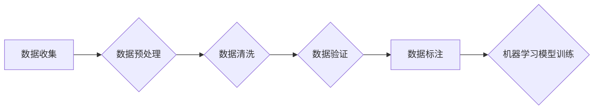

> 数据质量, 数据清洗, 数据标注, 数据噪音, 数据集甄别, 机器学习, 深度学习

## 1. 背景介绍

在当今数据驱动时代，数据已成为企业和研究机构的核心资产。机器学习和深度学习等人工智能技术的发展离不开海量高质量的数据支撑。然而，现实世界的数据往往存在着各种各样的问题，例如缺失值、异常值、重复数据、格式不一致等，这些问题统称为数据噪音。数据噪音会严重影响机器学习模型的训练效果，导致模型性能下降甚至失效。因此，甄别优质数据集，去除数据噪音，对于人工智能技术的发展至关重要。

## 2. 核心概念与联系

### 2.1 数据质量

数据质量是指数据能够满足其预期用途的程度。高质量的数据应具备以下特征：

* **准确性:** 数据内容真实可靠，无误差。
* **完整性:** 数据完整无缺，没有丢失或遗漏的部分。
* **一致性:** 数据在不同来源和不同时间点保持一致。
* **时效性:** 数据及时更新，反映最新的状态。
* **可信度:** 数据来源可靠，可信度高。

### 2.2 数据噪音

数据噪音是指数据中存在的错误、不完整或不准确的信息。数据噪音的类型包括：

* **缺失值:** 数据中存在缺少的部分。
* **异常值:** 数据中存在与其他数据明显不同的值。
* **重复数据:** 数据中存在重复的记录。
* **格式不一致:** 数据中不同字段的格式不一致。
* **语法错误:** 数据中存在语法错误。

### 2.3 数据清洗

数据清洗是指对数据进行处理，去除数据噪音，提高数据质量的过程。数据清洗通常包括以下步骤：

* **数据收集:** 从各种来源收集数据。
* **数据预处理:** 对数据进行格式转换、缺失值处理等预处理操作。
* **数据清洗:** 对数据进行异常值处理、重复数据删除、格式统一等操作。
* **数据验证:** 对清洗后的数据进行验证，确保数据质量。

### 2.4 数据标注

数据标注是指对数据进行人工标记，为机器学习模型提供训练数据的过程。数据标注通常用于分类、识别、情感分析等任务。

**数据清洗与数据标注的关系**

数据清洗和数据标注是数据处理的两大重要环节。数据清洗可以提高数据质量，为数据标注提供高质量的数据基础。数据标注可以为机器学习模型提供训练数据，而高质量的数据标注可以进一步提高模型的性能。

**Mermaid 流程图**



## 3. 核心算法原理 & 具体操作步骤

### 3.1 算法原理概述

数据清洗算法旨在识别和去除数据中的噪音，提高数据质量。常用的数据清洗算法包括：

* **缺失值处理:** 使用平均值、中位数、众数等方法填充缺失值。
* **异常值处理:** 使用箱线图、z-score等方法识别异常值，并进行删除或替换。
* **重复数据删除:** 使用哈希表、集合等数据结构识别重复数据，并进行删除。
* **格式统一:** 使用正则表达式、字符串操作等方法统一数据格式。

### 3.2 算法步骤详解

**缺失值处理:**

1. 识别缺失值。
2. 选择填充方法。
3. 填充缺失值。

**异常值处理:**

1. 识别异常值。
2. 选择处理方法。
3. 处理异常值。

**重复数据删除:**

1. 识别重复数据。
2. 删除重复数据。

**格式统一:**

1. 识别格式不一致的数据。
2. 使用正则表达式或字符串操作统一格式。

### 3.3 算法优缺点

**缺失值处理:**

* **优点:** 简单易行，可以有效填充部分缺失值。
* **缺点:** 可能引入新的偏差，无法处理复杂类型的缺失值。

**异常值处理:**

* **优点:** 可以有效去除异常值，提高数据质量。
* **缺点:** 识别异常值的方法存在主观性，可能误判正常数据为异常值。

**重复数据删除:**

* **优点:** 可以有效减少重复数据，节省存储空间。
* **缺点:** 可能删除部分有价值的数据。

**格式统一:**

* **优点:** 可以提高数据一致性，方便数据分析。
* **缺点:** 需要根据具体情况选择合适的格式转换方法。

### 3.4 算法应用领域

数据清洗算法广泛应用于各个领域，例如：

* **金融:** 处理客户数据、交易数据等。
* **医疗:** 处理患者数据、医疗记录等。
* **电商:** 处理商品数据、用户数据等。
* **教育:** 处理学生数据、考试成绩等。

## 4. 数学模型和公式 & 详细讲解 & 举例说明

### 4.1 数学模型构建

**缺失值处理:**

可以使用以下公式计算缺失值的填充值：

$$
\hat{x} = \mu + \sigma \cdot z
$$

其中：

* $\hat{x}$ 是填充后的值。
* $\mu$ 是数据的平均值。
* $\sigma$ 是数据的标准差。
* $z$ 是标准正态分布的随机数。

**异常值处理:**

可以使用以下公式计算异常值的 z-score：

$$
z = \frac{x - \mu}{\sigma}
$$

其中：

* $z$ 是 z-score。
* $x$ 是数据值。
* $\mu$ 是数据的平均值。
* $\sigma$ 是数据的标准差。

如果 z-score 超过一定阈值，则认为该数据为异常值。

### 4.2 公式推导过程

**缺失值填充:**

该公式基于正态分布的假设，将缺失值填充到符合该分布的范围内。

**异常值识别:**

该公式将数据值标准化，计算其与平均值的距离。

### 4.3 案例分析与讲解

**缺失值填充:**

假设一个数据集包含学生的年龄信息，其中部分学生年龄缺失。可以使用上述公式将缺失的年龄填充到符合该数据集年龄分布的范围内。

**异常值处理:**

假设一个数据集包含用户的消费金额信息，其中部分用户的消费金额异常高。可以使用 z-score 方法识别这些异常值，并进行删除或替换。

## 5. 项目实践：代码实例和详细解释说明

### 5.1 开发环境搭建

* Python 3.x
* pandas
* numpy
* scikit-learn

### 5.2 源代码详细实现

```python
import pandas as pd
from sklearn.impute import SimpleImputer
from sklearn.preprocessing import StandardScaler

# 加载数据
data = pd.read_csv('data.csv')

# 缺失值处理
imputer = SimpleImputer(strategy='mean')
data['age'] = imputer.fit_transform(data[['age']])

# 异常值处理
scaler = StandardScaler()
data['amount'] = scaler.fit_transform(data[['amount']])

# 数据清洗后的保存
data.to_csv('cleaned_data.csv', index=False)
```

### 5.3 代码解读与分析

* 使用 pandas 库加载数据。
* 使用 SimpleImputer 类填充缺失值，采用均值填充策略。
* 使用 StandardScaler 类标准化数据，将异常值转化为 z-score。
* 使用 pandas 库将清洗后的数据保存为新的 CSV 文件。

### 5.4 运行结果展示

运行上述代码后，将生成一个名为 `cleaned_data.csv` 的文件，其中包含了清洗后的数据。

## 6. 实际应用场景

数据清洗技术广泛应用于各个领域，例如：

* **金融:** 处理客户数据、交易数据等，提高数据质量，降低风险。
* **医疗:** 处理患者数据、医疗记录等，提高数据准确性，辅助诊断治疗。
* **电商:** 处理商品数据、用户数据等，提高数据一致性，优化推荐算法。
* **教育:** 处理学生数据、考试成绩等，提高数据可靠性，辅助教学管理。

### 6.4 未来应用展望

随着人工智能技术的不断发展，数据清洗技术将更加智能化、自动化。未来，数据清洗技术将更加注重数据隐私保护、数据安全等方面。

## 7. 工具和资源推荐

### 7.1 学习资源推荐

* **书籍:**
    * 数据清洗与数据质量管理
    * 数据挖掘与机器学习
* **在线课程:**
    * Coursera: Data Cleaning and Preprocessing
    * edX: Data Science Fundamentals

### 7.2 开发工具推荐

* **Python:** pandas, numpy, scikit-learn
* **R:** dplyr, tidyr, caret

### 7.3 相关论文推荐

* Data Cleaning Techniques for Machine Learning
* A Survey of Data Cleaning Techniques

## 8. 总结：未来发展趋势与挑战

### 8.1 研究成果总结

数据清洗技术已经取得了显著的成果，为人工智能技术的发展提供了重要的基础。

### 8.2 未来发展趋势

* **智能化:** 利用机器学习等技术，自动识别和处理数据噪音。
* **自动化:** 将数据清洗流程自动化，提高效率。
* **隐私保护:** 保护数据隐私，同时进行数据清洗。

### 8.3 面临的挑战

* **数据复杂性:** 现实世界的数据越来越复杂，数据清洗技术需要不断改进。
* **数据量大:** 数据量不断增长，数据清洗效率需要提高。
* **数据标准化:** 数据标准化问题仍然存在，需要进一步解决。

### 8.4 研究展望

未来，数据清洗技术将朝着智能化、自动化、隐私保护的方向发展，为人工智能技术的发展提供更强大的支持。

## 9. 附录：常见问题与解答

**常见问题:**

* 如何识别异常值？
* 如何处理缺失值？
* 如何统一数据格式？

**解答:**

* 异常值识别可以使用 z-score、箱线图等方法。
* 缺失值处理可以使用均值、中位数、众数等方法填充。
* 数据格式统一可以使用正则表达式、字符串操作等方法。


作者：禅与计算机程序设计艺术 / Zen and the Art of Computer Programming 
<end_of_turn>