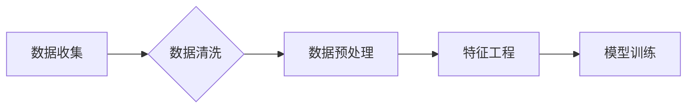

> 数据处理，大模型训练，数据清洗，数据预处理，特征工程，数据质量，机器学习，深度学习

## 1. 背景介绍

近年来，人工智能（AI）技术蓬勃发展，大模型的涌现更是推动了AI领域的飞速进步。从自然语言处理（NLP）到计算机视觉（CV），大模型在各个领域展现出强大的应用潜力。然而，构建一个强大的大模型并非仅仅依赖于模型架构和算法的创新，数据处理这一环节同样至关重要。

数据是机器学习和深度学习模型的燃料，高质量的数据能够有效提升模型的性能，而低质量的数据则可能导致模型训练不稳定、效果不佳甚至产生偏差。因此，数据处理成为了训练大模型的关键一环，其质量直接影响着大模型的最终效果。

## 2. 核心概念与联系

数据处理是指对原始数据进行一系列操作，使其能够被机器学习模型有效地理解和利用。数据处理流程通常包括以下几个步骤：

* **数据收集:** 从各种来源收集原始数据，例如文本文件、图像、音频、传感器数据等。
* **数据清洗:** 去除数据中的噪声、缺失值、重复数据等异常信息，保证数据的一致性和完整性。
* **数据预处理:** 对数据进行格式转换、特征缩放、标准化等操作，使其符合模型的输入要求。
* **特征工程:** 从原始数据中提取有意义的特征，并进行组合和转换，以增强模型的学习能力。

**数据处理流程图:**



## 3. 核心算法原理 & 具体操作步骤

### 3.1  算法原理概述

数据处理中常用的算法包括：

* **数据清洗算法:** 
    * 缺失值处理算法：例如平均值填充、中位数填充、K最近邻插值等。
    * 异常值处理算法：例如三倍标准差法、箱线图法等。
    * 重复值处理算法：例如去重操作等。
* **数据预处理算法:**
    * 特征缩放算法：例如标准化、归一化等。
    * 数据转换算法：例如one-hot编码、label encoding等。
* **特征工程算法:**
    * 特征组合算法：例如特征交叉、特征聚合等。
    * 特征提取算法：例如主成分分析（PCA）、线性判别分析（LDA）等。

### 3.2  算法步骤详解

以数据清洗为例，详细介绍其步骤：

1. **识别缺失值:** 遍历数据，识别缺失值的位置和类型。
2. **选择缺失值处理方法:** 根据缺失值的类型和数据特点，选择合适的处理方法。
3. **填充缺失值:** 使用选定的方法填充缺失值。
4. **识别异常值:** 使用统计方法或机器学习算法识别异常值。
5. **处理异常值:** 根据异常值的类型和数据特点，选择合适的处理方法，例如删除、替换或修正。

### 3.3  算法优缺点

不同的数据处理算法各有优缺点，需要根据实际情况选择合适的算法。例如，平均值填充简单易用，但可能导致数据信息丢失；K最近邻插值更精确，但计算量较大。

### 3.4  算法应用领域

数据处理算法广泛应用于各个领域，例如：

* **金融领域:** 识别欺诈交易、预测股票价格等。
* **医疗领域:** 诊断疾病、预测患者风险等。
* **电商领域:** 推荐商品、预测用户购买行为等。

## 4. 数学模型和公式 & 详细讲解 & 举例说明

### 4.1  数学模型构建

数据处理过程中，可以使用数学模型来描述数据之间的关系，例如：

* **线性回归模型:** 用于预测连续变量，其数学模型为：

$$y = mx + c$$

其中，y为预测值，x为输入变量，m为斜率，c为截距。

* **逻辑回归模型:** 用于预测分类变量，其数学模型为：

$$P(y=1|x) = \frac{1}{1 + e^{-(wx + b)}}$$

其中，P(y=1|x)为预测类别为1的概率，x为输入变量，w为权重，b为偏置。

### 4.2  公式推导过程

例如，线性回归模型的权重和偏置可以通过最小二乘法推导得到：

$$w = (X^T X)^{-1} X^T y$$

$$b = \bar{y} - w \bar{x}$$

其中，X为输入变量矩阵，y为目标变量向量，$\bar{x}$为输入变量的平均值，$\bar{y}$为目标变量的平均值。

### 4.3  案例分析与讲解

例如，可以使用线性回归模型预测房价，输入变量包括房屋面积、房间数量等，目标变量为房价。通过训练模型，可以得到房价预测公式，并根据新的房屋信息进行预测。

## 5. 项目实践：代码实例和详细解释说明

### 5.1  开发环境搭建

使用Python语言进行数据处理和模型训练，需要安装以下软件包：

* NumPy：用于数值计算
* Pandas：用于数据分析和处理
* Scikit-learn：用于机器学习算法

### 5.2  源代码详细实现

```python
import pandas as pd
from sklearn.linear_model import LinearRegression

# 加载数据
data = pd.read_csv('house_data.csv')

# 划分训练集和测试集
X = data[['area', 'rooms']]
y = data['price']
from sklearn.model_selection import train_test_split
X_train, X_test, y_train, y_test = train_test_split(X, y, test_size=0.2, random_state=42)

# 创建线性回归模型
model = LinearRegression()

# 训练模型
model.fit(X_train, y_train)

# 预测测试集数据
y_pred = model.predict(X_test)

# 评估模型性能
from sklearn.metrics import mean_squared_error
mse = mean_squared_error(y_test, y_pred)
print(f'Mean Squared Error: {mse}')
```

### 5.3  代码解读与分析

* 首先，加载数据并划分训练集和测试集。
* 然后，创建线性回归模型并训练模型。
* 最后，使用训练好的模型预测测试集数据，并评估模型性能。

### 5.4  运行结果展示

运行代码后，会输出模型的均方误差（MSE）值，该值越小，模型的预测性能越好。

## 6. 实际应用场景

数据处理在各个领域都有广泛的应用场景，例如：

### 6.1  自然语言处理

* **文本分类:** 对文本进行分类，例如垃圾邮件过滤、情感分析等。
* **文本摘要:** 自动生成文本摘要，例如新闻摘要、会议记录摘要等。
* **机器翻译:** 将文本从一种语言翻译成另一种语言。

### 6.2  计算机视觉

* **图像识别:** 识别图像中的物体，例如人脸识别、物体检测等。
* **图像分类:** 将图像分类到不同的类别，例如动物识别、场景识别等。
* **图像分割:** 将图像分割成不同的区域，例如医学图像分割、道路分割等。

### 6.3  推荐系统

* **商品推荐:** 根据用户的历史购买记录和偏好，推荐相关的商品。
* **内容推荐:** 根据用户的兴趣爱好，推荐相关的文章、视频、音乐等内容。
* **个性化广告:** 根据用户的特征和行为，推荐个性化的广告。

### 6.4  未来应用展望

随着人工智能技术的不断发展，数据处理将在未来发挥更加重要的作用。例如：

* **自动数据处理:** 利用机器学习算法自动完成数据清洗、预处理和特征工程等任务。
* **数据可视化:** 利用数据可视化技术，更直观地展示数据信息，帮助人们更好地理解数据。
* **数据安全:** 利用数据加密和匿名化技术，保护数据安全。

## 7. 工具和资源推荐

### 7.1  学习资源推荐

* **书籍:**
    * 《Python数据科学手册》
    * 《机器学习实战》
    * 《深度学习》
* **在线课程:**
    * Coursera
    * edX
    * Udacity

### 7.2  开发工具推荐

* **Python:** 
    * Jupyter Notebook
    * PyCharm
* **数据处理工具:**
    * Pandas
    * Scikit-learn
    * TensorFlow

### 7.3  相关论文推荐

* **数据清洗:**
    * "Data Cleaning Techniques" by J. Han and M. Kamber
* **特征工程:**
    * "Feature Engineering for Machine Learning" by A. Géron
* **数据可视化:**
    * "Data Visualization: A Practical Introduction" by Kieran Healy

## 8. 总结：未来发展趋势与挑战

### 8.1  研究成果总结

数据处理在训练大模型中扮演着至关重要的角色，其质量直接影响着模型的性能。近年来，数据处理领域取得了显著的进展，例如：

* 自动数据处理技术的发展
* 数据可视化技术的进步
* 数据安全技术的增强

### 8.2  未来发展趋势

未来，数据处理领域将继续朝着以下方向发展：

* **更智能的数据处理:** 利用人工智能技术，实现更智能、更自动的数据处理。
* **更个性化的数据处理:** 根据用户的需求和偏好，提供更个性化的数据处理服务。
* **更安全的的数据处理:** 加强数据安全保护，防止数据泄露和滥用。

### 8.3  面临的挑战

数据处理领域也面临着一些挑战，例如：

* **数据质量问题:** 现实世界的数据往往存在噪声、缺失值、重复数据等问题，需要开发更有效的解决方法。
* **数据规模问题:** 数据规模的不断增长，对数据处理能力提出了更高的要求。
* **数据隐私问题:** 如何保护用户数据隐私，是数据处理领域需要解决的重要问题。

### 8.4  研究展望

未来，数据处理领域的研究将继续围绕以下几个方面展开：

* **开发更智能、更自动的数据处理算法**
* **研究更有效的解决数据质量问题的方法**
* **探索更安全的、更隐私的数据处理技术**


## 9. 附录：常见问题与解答

### 9.1  常见问题

* **如何处理缺失值？**
* **如何识别异常值？**
* **如何进行特征工程？**

### 9.2  解答

* **处理缺失值:** 可以使用平均值填充、中位数填充、K最近邻插值等方法。
* **识别异常值:** 可以使用三倍标准差法、箱线图法等方法。
* **特征工程:** 可以使用特征组合、特征提取等方法。


作者：禅与计算机程序设计艺术 / Zen and the Art of Computer Programming 
<end_of_turn>