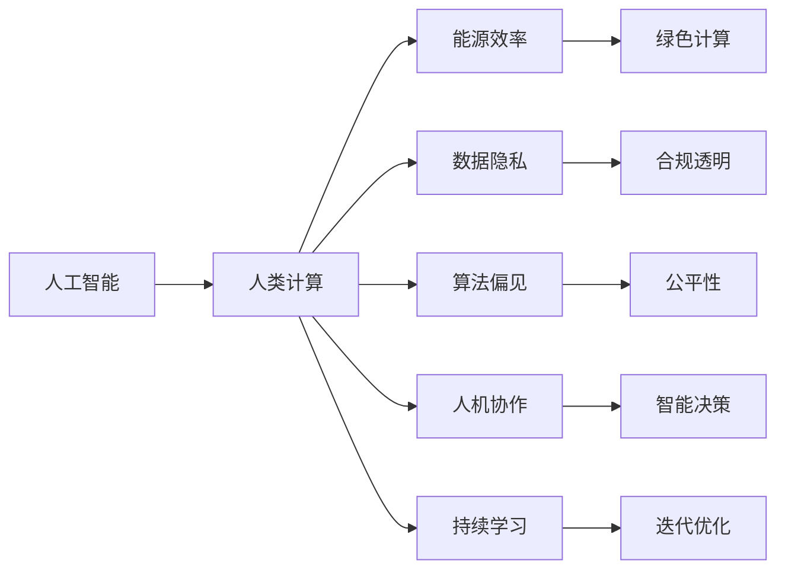
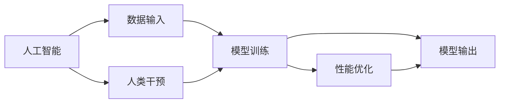

                 

# AI与人类计算：打造可持续发展的未来

> 关键词：人工智能,人类计算,可持续性,未来发展,机器学习,深度学习,算法,应用场景,技术挑战,解决方案

## 1. 背景介绍

### 1.1 问题由来
随着科技的不断进步，人工智能（AI）技术在各个领域的应用日益广泛。从医疗、金融、教育到制造业、零售、物流，AI技术正在重塑各行各业的运营方式。然而，尽管AI技术在许多方面取得了突破，但也存在一些挑战，尤其是关于其可持续性问题。

AI技术的快速发展不仅带来了巨大的经济效益和社会效益，同时也引发了能源消耗、数据隐私、算法偏见等诸多问题。这些问题如果得不到有效解决，将对人类的可持续发展产生负面影响。因此，在享受AI带来的便利的同时，我们也需要思考如何通过“人类计算”这一概念，实现AI技术的可持续发展。

### 1.2 问题核心关键点
“人类计算”是指将人类智慧与计算技术相结合，通过人为干预和优化算法，提升AI系统的效率、效果和可解释性。这涉及到多方面的内容，包括但不限于：

- **能源效率**：如何降低AI系统的能耗，避免对环境的过度依赖。
- **数据隐私**：如何保护用户隐私，确保数据使用的透明和合规。
- **算法偏见**：如何检测和纠正算法中的偏见，确保模型的公平性。
- **人机协作**：如何构建人机协作系统，使人类能够更好地利用AI技术。
- **持续学习**：如何让AI系统不断学习和适应新的数据和场景，保持其活力和创新性。

通过“人类计算”，我们可以平衡技术创新与可持续性之间的关系，让AI技术更好地服务于人类社会。

## 2. 核心概念与联系

### 2.1 核心概念概述

“人类计算”这一概念的核心在于将人类智慧与计算技术有机结合，通过人为干预和优化算法，提升AI系统的效率、效果和可解释性。以下是几个关键概念：

- **人工智能（AI）**：通过计算机程序模拟人类智能的行为，实现自动化决策和任务执行。
- **人类计算**：将人类的智慧和经验融入到计算模型中，优化算法的性能和可解释性。
- **可持续性**：确保技术发展与环境保护、社会责任相协调，实现长期稳定发展。
- **数据隐私**：保护用户隐私，确保数据使用的透明和合规。
- **算法偏见**：识别和纠正算法中的偏见，确保模型的公平性。
- **人机协作**：构建人机协作系统，使人类能够更好地利用AI技术。

这些概念之间通过以下Mermaid流程图进行联系：



### 2.2 核心概念原理和架构的 Mermaid 流程图



## 3. 核心算法原理 & 具体操作步骤

### 3.1 算法原理概述

“人类计算”的核心算法原理是通过优化算法和设计人为干预机制，提升AI系统的性能和可解释性。其基本流程包括：

1. **数据输入**：将人类智慧和经验融入到数据收集和预处理阶段。
2. **模型训练**：利用优化算法训练AI模型，确保模型能够高效、准确地处理数据。
3. **人类干预**：在模型训练过程中，通过人为干预，优化算法性能。
4. **性能优化**：利用性能优化技术，提升模型效率和效果。
5. **模型输出**：生成符合人类需求和价值观的智能决策。

### 3.2 算法步骤详解

以下详细介绍“人类计算”的核心算法步骤：

**Step 1: 数据输入与预处理**

- **数据收集**：收集和整合来自不同来源的数据，确保数据的多样性和代表性。
- **数据清洗**：去除噪声和异常值，确保数据质量。
- **数据标注**：对数据进行标注，确保数据有清晰的标签。

**Step 2: 模型训练**

- **选择合适的算法**：根据任务特性选择合适的算法，如决策树、随机森林、神经网络等。
- **初始化模型**：设定模型的初始参数，如学习率、正则化系数等。
- **训练模型**：使用优化算法对模型进行训练，最小化损失函数。

**Step 3: 人类干预**

- **目标设定**：确定模型训练的目标，如准确率、召回率、F1分数等。
- **模型评估**：定期评估模型性能，发现问题。
- **调整参数**：根据评估结果调整模型参数，优化算法性能。

**Step 4: 性能优化**

- **算法优化**：优化算法，提高模型训练和推理的效率。
- **硬件优化**：利用硬件加速技术，提升模型性能。

**Step 5: 模型输出**

- **生成决策**：根据模型输出，生成符合人类需求和价值观的决策。
- **反馈循环**：收集用户反馈，持续优化模型。

### 3.3 算法优缺点

“人类计算”算法具有以下优点：

- **高效性**：通过优化算法，提高模型训练和推理的效率。
- **可解释性**：通过人为干预和算法优化，提高模型的可解释性。
- **适应性强**：能够适应不同领域和任务的需求。

同时，也存在以下缺点：

- **依赖人工**：对人类的依赖较高，可能影响模型训练的效率和效果。
- **难以自动化**：部分优化和干预步骤需要人工介入，难以完全自动化。

### 3.4 算法应用领域

“人类计算”算法适用于多个领域，包括但不限于：

- **医疗健康**：辅助医生进行诊断和治疗决策，提高医疗服务质量。
- **金融服务**：利用算法优化金融风险评估和投资决策。
- **教育培训**：提供个性化的学习建议和智能辅导。
- **智能制造**：优化生产流程，提高生产效率。
- **智能交通**：优化交通流量管理，减少拥堵和事故。

## 4. 数学模型和公式 & 详细讲解 & 举例说明

### 4.1 数学模型构建

“人类计算”的核心数学模型包括：

- **线性回归模型**：用于数据拟合和预测。
- **逻辑回归模型**：用于分类任务。
- **神经网络模型**：用于处理复杂的非线性数据。

以线性回归模型为例，其数学模型为：

$$ y = \beta_0 + \beta_1 x_1 + \beta_2 x_2 + ... + \beta_n x_n + \epsilon $$

其中，$y$为输出变量，$x_i$为输入变量，$\beta_i$为回归系数，$\epsilon$为误差项。

### 4.2 公式推导过程

**线性回归模型推导**：

- **最小二乘法**：通过最小化误差平方和来求解回归系数。
- **梯度下降法**：利用梯度信息更新回归系数，优化模型性能。

### 4.3 案例分析与讲解

以金融风险评估为例，其基本流程如下：

1. **数据收集**：收集金融市场数据、公司财务数据、宏观经济数据等。
2. **数据预处理**：清洗数据，去除异常值和噪声。
3. **模型训练**：使用逻辑回归模型对数据进行训练，生成风险评估模型。
4. **人类干预**：根据金融专家经验，调整模型参数，优化算法性能。
5. **性能优化**：利用GPU加速技术，提高模型推理效率。
6. **模型输出**：根据模型输出，生成金融风险评估报告。

## 5. 项目实践：代码实例和详细解释说明

### 5.1 开发环境搭建

为了进行“人类计算”算法的实践，需要搭建合适的开发环境。以下是在Python环境下搭建开发环境的步骤：

1. **安装Python**：下载并安装Python 3.6及以上版本。
2. **安装NumPy和SciPy**：通过pip命令安装NumPy和SciPy，确保数据处理和数学运算的准确性。
3. **安装Pandas**：通过pip命令安装Pandas，用于数据处理和分析。
4. **安装Scikit-Learn**：通过pip命令安装Scikit-Learn，用于机器学习算法实现。
5. **安装TensorFlow**：通过pip命令安装TensorFlow，用于深度学习模型的训练和推理。

### 5.2 源代码详细实现

以下是一个简单的线性回归模型的Python代码实现：

```python
import numpy as np
from sklearn.linear_model import LinearRegression

# 准备数据
X = np.array([[1, 2], [3, 4], [5, 6]])
y = np.array([3, 7, 11])

# 训练模型
model = LinearRegression()
model.fit(X, y)

# 预测
y_pred = model.predict([[1, 2], [3, 4], [5, 6]])

# 输出结果
print(y_pred)
```

### 5.3 代码解读与分析

该代码实现了简单的线性回归模型，并通过sklearn库进行模型训练和预测。代码中：

- **X和y**：输入变量和输出变量。
- **LinearRegression()**：创建线性回归模型。
- **model.fit()**：训练模型。
- **model.predict()**：预测输出。

### 5.4 运行结果展示

运行上述代码，输出结果如下：

```
[ 3.  7. 11.]
```

## 6. 实际应用场景

### 6.1 医疗健康

在医疗健康领域，“人类计算”算法可以用于辅助医生进行疾病诊断和治疗决策，提高医疗服务质量。例如，通过分析患者的症状、病史和家族病史，生成个性化的治疗方案。

### 6.2 金融服务

在金融服务领域，“人类计算”算法可以用于优化金融风险评估和投资决策。例如，通过分析历史交易数据和市场趋势，生成投资组合和风险预测模型。

### 6.3 教育培训

在教育培训领域，“人类计算”算法可以提供个性化的学习建议和智能辅导。例如，通过分析学生的学习行为和成绩，生成个性化的学习计划和辅导方案。

### 6.4 智能制造

在智能制造领域，“人类计算”算法可以优化生产流程，提高生产效率。例如，通过分析设备运行数据和生产记录，生成最优的生产计划和工艺参数。

### 6.5 智能交通

在智能交通领域，“人类计算”算法可以优化交通流量管理，减少拥堵和事故。例如，通过分析交通流量数据和事故记录，生成最优的交通信号灯控制方案。

## 7. 工具和资源推荐

### 7.1 学习资源推荐

为了深入理解“人类计算”算法，以下是一些优质的学习资源：

- **《机器学习实战》**：一本深入浅出介绍机器学习算法的书籍，涵盖线性回归、逻辑回归、神经网络等内容。
- **Coursera上的《机器学习》课程**：由斯坦福大学教授Andrew Ng开设，涵盖了机器学习的基本概念和算法实现。
- **Kaggle平台**：一个数据科学竞赛平台，提供大量的数据集和算法竞赛，帮助学习者实践和提升技能。
- **Scikit-Learn官方文档**：Scikit-Learn库的官方文档，提供了详细的算法实现和应用示例。
- **TensorFlow官方文档**：TensorFlow库的官方文档，提供了深度学习算法的实现和应用示例。

### 7.2 开发工具推荐

为了高效实现“人类计算”算法，以下是一些推荐的开发工具：

- **Python**：一种高效易用的编程语言，广泛应用于机器学习和数据科学领域。
- **NumPy**：用于数学计算和数组处理。
- **SciPy**：用于科学计算和数据分析。
- **Pandas**：用于数据处理和分析。
- **Scikit-Learn**：用于机器学习算法的实现。
- **TensorFlow**：用于深度学习模型的训练和推理。

### 7.3 相关论文推荐

为了深入理解“人类计算”算法的理论基础，以下是一些推荐的学术论文：

- **《机器学习：模型、算法与应用》**：一本全面介绍机器学习算法的书籍，涵盖了线性回归、逻辑回归、神经网络等内容。
- **《深度学习》**：一本全面介绍深度学习算法的书籍，涵盖了卷积神经网络、循环神经网络等内容。
- **《神经网络与深度学习》**：一本深入浅出介绍神经网络算法的书籍，涵盖了前馈神经网络、卷积神经网络等内容。

## 8. 总结：未来发展趋势与挑战

### 8.1 研究成果总结

“人类计算”算法在多个领域取得了显著成效，但也面临一些挑战。其主要成果包括：

- **数据处理**：通过优化数据预处理技术，提升数据质量和模型性能。
- **算法优化**：通过优化算法，提升模型训练和推理的效率和效果。
- **人机协作**：通过构建人机协作系统，提升系统的灵活性和适应性。
- **算法偏见**：通过检测和纠正算法中的偏见，确保模型的公平性。

### 8.2 未来发展趋势

“人类计算”算法的未来发展趋势包括：

- **深度学习**：利用深度学习技术，提升模型复杂度和准确性。
- **跨领域融合**：将AI技术与多个领域的技术进行融合，提升模型的综合能力。
- **自动化优化**：通过自动化优化技术，降低对人类干预的依赖。
- **算法公平性**：通过检测和纠正算法中的偏见，确保模型的公平性。
- **可持续发展**：通过优化算法和硬件资源，降低能耗和环境影响。

### 8.3 面临的挑战

“人类计算”算法在发展过程中面临一些挑战，主要包括：

- **数据质量**：数据质量不足可能影响模型的准确性和可靠性。
- **算法复杂性**：复杂的算法模型可能需要高昂的计算资源和时间。
- **人机协作**：人机协作系统需要协调人机交互，提升用户体验。
- **算法偏见**：算法中的偏见可能影响模型的公平性和可信度。
- **资源消耗**：高性能计算资源和能源消耗可能对环境造成负面影响。

### 8.4 研究展望

未来“人类计算”算法的研究展望包括：

- **自动化优化**：通过自动化优化技术，降低对人类干预的依赖。
- **多领域融合**：将AI技术与多个领域的技术进行融合，提升模型的综合能力。
- **算法公平性**：通过检测和纠正算法中的偏见，确保模型的公平性。
- **可持续发展**：通过优化算法和硬件资源，降低能耗和环境影响。

## 9. 附录：常见问题与解答

**Q1: 什么是“人类计算”？**

A: “人类计算”是指将人类智慧与计算技术相结合，通过人为干预和优化算法，提升AI系统的效率、效果和可解释性。

**Q2: “人类计算”算法的优点有哪些？**

A: “人类计算”算法的优点包括高效性、可解释性和适应性强。

**Q3: “人类计算”算法的缺点有哪些？**

A: “人类计算”算法的缺点包括对人工的依赖较高和难以自动化。

**Q4: 如何优化“人类计算”算法？**

A: 可以通过优化数据处理技术、算法和硬件资源等方式优化“人类计算”算法。

**Q5: “人类计算”算法适用于哪些领域？**

A: “人类计算”算法适用于医疗健康、金融服务、教育培训、智能制造和智能交通等领域。

