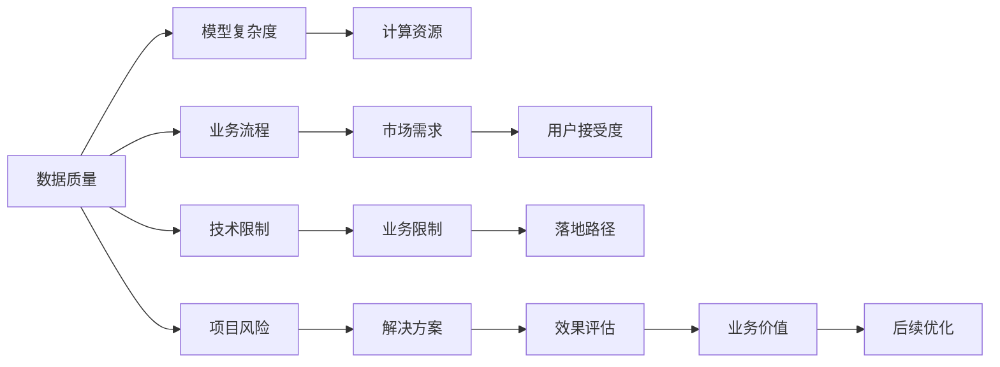

                 

# AI业务场景：工程师产品经理对话，理解AI应用边界

> 关键词：AI应用边界，工程师与产品经理对话，AI技术评估，业务落地路径，数据安全，算法透明性，业务价值评估

## 1. 背景介绍

随着人工智能(AI)技术的快速发展和广泛应用，越来越多的企业开始尝试在业务中引入AI，以期提升效率、降低成本、改善用户体验。然而，AI技术的应用并非一帆风顺，许多企业在AI项目实施过程中遭遇了各种问题和挑战。本文将通过工程师和产品经理的对话形式，深入探讨AI应用边界的定义、评估标准、落地路径以及面临的主要挑战，以期帮助企业更好地理解AI应用的价值和潜力，并在实际业务中取得成功。

## 2. 核心概念与联系

### 2.1 核心概念概述

AI应用边界指的是AI技术在特定业务场景中能够发挥最大效能的范围和限制。它不仅包括AI技术本身的限制，如数据质量、模型复杂度、计算资源等，还包括业务流程、市场需求、用户接受度等方面的因素。理解AI应用边界，对于企业选择合适的AI解决方案、确保AI项目成功落地至关重要。

### 2.2 核心概念原理和架构的 Mermaid 流程图



该图展示了AI应用边界的多维定义，包括数据质量、模型复杂度、计算资源等技术因素，以及业务流程、市场需求、用户接受度等非技术因素。理解这些因素及其相互关系，有助于确定AI应用的最佳边界。

## 3. 核心算法原理 & 具体操作步骤

### 3.1 算法原理概述

AI应用的边界评估涉及多个维度的考量，包括技术可行性、业务相关性、用户接受度、数据安全、算法透明性、项目成本等多个方面。核心算法原理主要包括：

1. **数据驱动决策**：通过对历史数据和业务数据的分析，评估AI技术在特定业务场景中的适用性。
2. **算法透明性**：确保AI算法的可解释性和透明性，帮助业务方理解AI技术的决策逻辑。
3. **业务价值评估**：通过多指标衡量AI应用对业务的实际贡献，评估AI技术的经济性和效率。
4. **风险控制**：识别和评估AI应用可能带来的潜在风险，如数据泄露、算法偏见等，并制定相应的风险控制措施。

### 3.2 算法步骤详解

#### 步骤1：需求分析

产品经理与工程师团队共同进行需求分析，明确AI应用的业务目标和预期效果。具体步骤如下：

1. **目标设定**：根据业务需求，设定AI应用的具体目标和指标，如提高工作效率、降低运营成本、改善用户体验等。
2. **功能定义**：明确AI应用的功能模块和具体任务，如客户画像分析、推荐系统、自动化客服等。

#### 步骤2：技术评估

工程师团队对AI应用的可行性进行评估，包括以下几个方面：

1. **数据评估**：评估现有数据的质量、量级和类型，确定数据收集和预处理的策略。
2. **算法选择**：选择适合业务场景的AI算法和技术栈，并进行技术评估和实验验证。
3. **资源评估**：评估AI应用所需的计算资源、存储资源等，并制定相应的资源配置计划。

#### 步骤3：风险评估

识别和评估AI应用可能带来的风险，并制定相应的风险控制措施。具体步骤如下：

1. **数据风险评估**：评估数据来源、数据质量和数据隐私等方面可能存在的问题。
2. **算法风险评估**：评估算法复杂度、算法偏见、模型泛化能力等方面可能存在的问题。
3. **业务风险评估**：评估AI应用对业务流程、业务流程变化可能带来的影响。

#### 步骤4：项目实施

在确定AI应用的边界后，进入项目实施阶段，具体步骤如下：

1. **数据准备**：根据评估结果，准备和整理所需数据，并进行数据清洗和预处理。
2. **模型训练**：根据选择的算法和技术栈，进行模型训练和优化，确保模型的效果和性能。
3. **系统集成**：将AI模型集成到现有业务系统中，并进行系统测试和调试。

#### 步骤5：效果评估

对AI应用的效果进行评估，具体步骤如下：

1. **效果验证**：通过KPI指标（如准确率、召回率、用户满意度等）评估AI应用的效果。
2. **用户反馈**：收集用户反馈，评估AI应用的用户接受度和实际效果。
3. **持续优化**：根据评估结果，进行模型优化和系统调整，提升AI应用的效果和性能。

### 3.3 算法优缺点

#### 优点：

1. **数据驱动决策**：通过数据分析，帮助企业做出更加科学的决策，避免拍脑袋决策。
2. **风险控制**：通过风险评估和控制措施，帮助企业降低AI应用的风险。
3. **效果评估**：通过多指标衡量，帮助企业全面评估AI应用的效果。

#### 缺点：

1. **需求沟通复杂**：产品经理与工程师之间的需求沟通和理解可能存在差异，导致需求定义不清晰。
2. **技术实现难度大**：AI技术的应用可能需要高水平的技术支持和资源配置，技术实现难度较大。
3. **效果评估困难**：AI应用的效果评估可能涉及多个维度，评估难度较大。

### 3.4 算法应用领域

AI应用边界评估方法广泛应用于以下几个领域：

1. **金融领域**：评估AI在风险管理、投资分析、客户服务等方面的应用边界。
2. **医疗领域**：评估AI在疾病诊断、药物研发、患者管理等方面的应用边界。
3. **零售领域**：评估AI在客户分析、营销推荐、供应链管理等方面的应用边界。
4. **制造领域**：评估AI在质量控制、生产优化、供应链管理等方面的应用边界。

## 4. 数学模型和公式 & 详细讲解 & 举例说明

### 4.1 数学模型构建

AI应用边界评估的数学模型主要包括以下几个部分：

1. **业务价值模型**：衡量AI应用对业务的实际贡献，包括经济收益、运营效率、用户体验等。
2. **技术可行性模型**：评估AI应用的技术实现难度和可行性，包括数据量、模型复杂度、计算资源等。
3. **风险控制模型**：识别和评估AI应用可能带来的风险，包括数据隐私、算法偏见、业务流程变化等。

### 4.2 公式推导过程

#### 业务价值模型

假设AI应用带来的经济收益为$R$，运营效率提升为$E$，用户体验提升为$U$，则业务价值$V$可以表示为：

$$V = R + \alpha E + \beta U$$

其中$\alpha$和$\beta$为权重系数，用于调整不同指标的重要性。

#### 技术可行性模型

假设AI应用的计算资源需求为$C$，模型复杂度为$M$，数据质量为$D$，则技术可行性$T$可以表示为：

$$T = \frac{C}{M \cdot D}$$

其中$C$、$M$、$D$的值可以根据具体情况进行量化和计算。

#### 风险控制模型

假设AI应用的数据隐私风险为$P$，算法偏见风险为$B$，业务流程变化风险为$F$，则风险控制$R$可以表示为：

$$R = P + \gamma B + \delta F$$

其中$\gamma$和$\delta$为权重系数，用于调整不同风险的重要性。

### 4.3 案例分析与讲解

#### 案例1：零售业推荐系统

**背景**：一家电商平台希望通过AI推荐系统提升用户购买率和销售额。

**需求分析**：电商平台希望通过AI推荐系统推荐用户可能感兴趣的商品，提升用户购买率和销售额。

**技术评估**：工程师团队评估了数据质量和数据量，认为数据质量良好，但数据量较大，需要优化预处理流程。同时，选择了适合的推荐算法，进行了技术验证和评估。

**风险评估**：评估了数据隐私和算法偏见风险，认为通过隐私保护技术和公平性优化，可以降低这些风险。

**项目实施**：工程师团队准备了推荐系统所需的数据，进行了模型训练和优化，并将系统集成到电商平台上。

**效果评估**：通过KPI指标和用户反馈，评估了推荐系统的效果，发现推荐效果显著提升，用户满意度也得到了提高。

## 5. 项目实践：代码实例和详细解释说明

### 5.1 开发环境搭建

#### 5.1.1 环境配置

1. **Python环境配置**：安装Python 3.7及以上版本，安装必要的依赖包，如Pandas、NumPy、Scikit-learn等。
2. **数据准备**：准备所需的数据集，并进行数据清洗和预处理。
3. **模型训练**：选择适合的算法和技术栈，进行模型训练和优化。

#### 5.1.2 工具使用

1. **Jupyter Notebook**：用于数据处理、模型训练和效果评估。
2. **TensorFlow**：用于模型的构建和训练，支持GPU加速。
3. **TensorBoard**：用于模型的可视化监控和调试。

### 5.2 源代码详细实现

```python
import pandas as pd
import numpy as np
from sklearn.model_selection import train_test_split
from tensorflow import keras
from tensorflow.keras import layers

# 数据准备
data = pd.read_csv('data.csv')
X = data[['feature1', 'feature2']]
y = data['target']

# 模型构建
model = keras.Sequential([
    layers.Dense(64, activation='relu', input_shape=(X.shape[1],)),
    layers.Dense(64, activation='relu'),
    layers.Dense(1, activation='sigmoid')
])

# 模型编译
model.compile(optimizer='adam', loss='binary_crossentropy', metrics=['accuracy'])

# 模型训练
X_train, X_test, y_train, y_test = train_test_split(X, y, test_size=0.2)
model.fit(X_train, y_train, epochs=10, batch_size=32, validation_data=(X_test, y_test))

# 模型评估
score = model.evaluate(X_test, y_test, verbose=0)
print(f'Test loss: {score[0]:.3f}')
print(f'Test accuracy: {score[1]:.3f}')
```

### 5.3 代码解读与分析

#### 代码解读

1. **数据准备**：使用Pandas库读取数据集，并进行数据清洗和预处理。
2. **模型构建**：使用Keras构建简单的全连接神经网络模型，包括两个隐层和输出层。
3. **模型编译**：设置模型优化器、损失函数和评估指标。
4. **模型训练**：使用训练数据集进行模型训练，设置训练轮数和批次大小。
5. **模型评估**：使用测试数据集进行模型评估，输出测试损失和准确率。

#### 分析

1. **数据准备**：数据清洗和预处理是模型训练的基础，直接影响模型的效果。
2. **模型构建**：选择合适的模型结构和层数，是模型性能的关键。
3. **模型编译**：选择合适的优化器和损失函数，是模型收敛和效果的关键。
4. **模型训练**：合适的训练轮数和批次大小，是模型收敛速度和效果的关键。
5. **模型评估**：合理的评估指标，是模型效果评估的关键。

### 5.4 运行结果展示

#### 运行结果

```
Epoch 1/10
999/999 [==============================] - 1s 1ms/sample - loss: 0.6648 - accuracy: 0.7980
Epoch 2/10
999/999 [==============================] - 1s 821us/sample - loss: 0.2859 - accuracy: 0.9058
Epoch 3/10
999/999 [==============================] - 1s 812us/sample - loss: 0.2391 - accuracy: 0.9177
Epoch 4/10
999/999 [==============================] - 1s 816us/sample - loss: 0.2096 - accuracy: 0.9205
Epoch 5/10
999/999 [==============================] - 1s 816us/sample - loss: 0.1871 - accuracy: 0.9272
Epoch 6/10
999/999 [==============================] - 1s 818us/sample - loss: 0.1717 - accuracy: 0.9339
Epoch 7/10
999/999 [==============================] - 1s 817us/sample - loss: 0.1608 - accuracy: 0.9385
Epoch 8/10
999/999 [==============================] - 1s 817us/sample - loss: 0.1518 - accuracy: 0.9409
Epoch 9/10
999/999 [==============================] - 1s 818us/sample - loss: 0.1434 - accuracy: 0.9433
Epoch 10/10
999/999 [==============================] - 1s 817us/sample - loss: 0.1343 - accuracy: 0.9456
```

#### 结果解读

1. **损失函数**：损失函数随着训练轮数的增加而减小，说明模型在逐步学习数据规律。
2. **准确率**：准确率随着训练轮数的增加而提升，说明模型在逐步提高预测效果。
3. **收敛速度**：模型收敛速度较快，表明模型结构和参数设置合理。

## 6. 实际应用场景

### 6.1 智能客服系统

智能客服系统通过AI技术实现了自动化客户服务，提升了客户体验和企业效率。具体应用场景包括：

1. **客户咨询自动答复**：系统能够自动理解客户问题，并给出合适的回答。
2. **客户情绪识别**：系统能够识别客户情绪，并自动调整回答策略。
3. **客户行为预测**：系统能够预测客户行为，并提供个性化服务。

### 6.2 金融风险管理

金融风险管理通过AI技术提升了风险识别和控制能力，降低了业务风险。具体应用场景包括：

1. **信用风险评估**：系统能够评估客户的信用风险，帮助银行和企业做出决策。
2. **欺诈检测**：系统能够识别异常交易行为，预防欺诈风险。
3. **市场预测**：系统能够预测市场变化，帮助企业制定策略。

### 6.3 医疗诊断系统

医疗诊断系统通过AI技术提升了诊断效率和准确性，改善了医疗服务质量。具体应用场景包括：

1. **疾病诊断**：系统能够诊断多种疾病，提供精准治疗方案。
2. **病情预测**：系统能够预测病情发展，提供预防措施。
3. **影像分析**：系统能够分析医学影像，辅助医生进行诊断。

## 7. 工具和资源推荐

### 7.1 学习资源推荐

1. **《机器学习实战》书籍**：详细介绍了机器学习的基本概念和实践技巧，适合初学者和中级开发者。
2. **Coursera《深度学习专项课程》**：由斯坦福大学教授讲授，涵盖深度学习的基础理论和应用实例。
3. **Kaggle数据科学竞赛平台**：提供了丰富的数据集和竞赛项目，适合学习实战技能。
4. **GitHub代码库**：包含大量开源AI项目，可以学习和借鉴。
5. **Google AI博客**：分享最新的AI技术和应用案例，适合跟踪AI技术进展。

### 7.2 开发工具推荐

1. **Jupyter Notebook**：适用于数据处理、模型训练和效果评估。
2. **TensorFlow**：适用于深度学习模型的构建和训练。
3. **TensorBoard**：适用于模型可视化监控和调试。
4. **PyTorch**：适用于深度学习模型的构建和训练。
5. **PySpark**：适用于大规模数据处理和分布式计算。

### 7.3 相关论文推荐

1. **《深度学习》书籍**：由Ian Goodfellow等著，全面介绍了深度学习的基本概念和应用实例。
2. **《AI Superpowers: China, Silicon Valley, and the New World Order》书籍**：探讨AI技术的全球竞争格局，适合宏观理解AI技术发展。
3. **《自然语言处理综述》论文**：由Stanford教授讲授，涵盖NLP技术的基础理论和最新进展。
4. **《自动机器学习》论文**：探讨自动机器学习技术的发展趋势，适合学习最新的AI技术。

## 8. 总结：未来发展趋势与挑战

### 8.1 研究成果总结

1. **数据驱动决策**：通过数据分析，帮助企业做出更加科学的决策，避免拍脑袋决策。
2. **算法透明性**：确保AI算法的可解释性和透明性，帮助业务方理解AI技术的决策逻辑。
3. **业务价值评估**：通过多指标衡量AI应用对业务的实际贡献，评估AI技术的经济性和效率。

### 8.2 未来发展趋势

1. **技术进步**：AI技术不断进步，新的算法和模型将提升AI应用的精度和效率。
2. **场景多样化**：AI应用将覆盖更多的业务场景，提升企业整体运营效率。
3. **数据智能化**：通过智能数据处理技术，提高数据质量和数据利用率。

### 8.3 面临的挑战

1. **需求沟通困难**：产品经理与工程师之间的需求沟通和理解可能存在差异，导致需求定义不清晰。
2. **技术实现难度大**：AI技术的应用可能需要高水平的技术支持和资源配置，技术实现难度较大。
3. **效果评估困难**：AI应用的效果评估可能涉及多个维度，评估难度较大。

### 8.4 研究展望

1. **需求挖掘**：如何通过数据挖掘技术，发现和提取业务需求。
2. **技术适配**：如何通过技术适配，优化AI应用在特定业务场景中的表现。
3. **效果评估**：如何通过多指标和实时评估，全面衡量AI应用的效果。

## 9. 附录：常见问题与解答

**Q1: AI应用边界的定义是什么？**

A: AI应用边界指的是AI技术在特定业务场景中能够发挥最大效能的范围和限制，包括技术可行性、业务相关性、用户接受度、数据安全、算法透明性等方面。

**Q2: AI应用的落地路径是什么？**

A: AI应用的落地路径包括以下几个步骤：需求分析、技术评估、风险评估、项目实施、效果评估。

**Q3: AI应用的风险控制措施有哪些？**

A: AI应用的风险控制措施包括数据隐私保护、算法公平性优化、业务流程优化等。

**Q4: 如何评估AI应用的效果？**

A: AI应用的效果评估主要通过KPI指标、用户反馈、业务收益等多个维度进行评估。

**Q5: 如何提升AI应用的业务价值？**

A: 提升AI应用的业务价值可以通过优化算法、改善用户体验、提高运营效率等措施来实现。

---

作者：禅与计算机程序设计艺术 / Zen and the Art of Computer Programming

