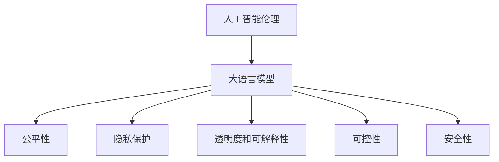

                 

# AI伦理学：LLM发展中的道德考量

> 关键词：人工智能伦理学, Large Language Models(LLM), 道德准则, 公平性, 隐私保护, 透明度, 可解释性, 可控性

## 1. 背景介绍

### 1.1 问题由来

在人工智能（AI）迅速发展的时代，大语言模型（Large Language Models，LLM）如GPT-4和ChatGPT等，已经展现出强大的语言理解和生成能力，广泛应用于聊天机器人、内容创作、翻译、问答等多个领域。然而，LLM在带来便利和效率的同时，也引发了一系列伦理道德问题，需要引起我们的重视。

1. **偏见和歧视**：大语言模型可能会继承和放大训练数据中的偏见和歧视，输出包含歧视性内容。
2. **虚假信息**：模型生成的不真实或误导性信息可能导致虚假新闻的传播，影响社会稳定。
3. **隐私泄露**：模型的训练和应用过程中，用户数据可能被不当使用，导致隐私泄露。
4. **透明度和可解释性**：模型决策过程缺乏透明度，用户难以理解其工作原理。
5. **滥用风险**：模型被用于非法活动或有害用途的风险，如网络欺诈、恶意攻击等。

这些问题不仅涉及技术本身，还与伦理道德、法律法规和社会责任密切相关。如何在推进AI技术发展的同时，保障其伦理道德，成为一个亟待解决的重要课题。

### 1.2 问题核心关键点

在人工智能伦理学中，大语言模型的伦理考量主要包括以下几个关键点：

- **偏见和歧视**：识别和纠正模型中的偏见，确保公平性。
- **隐私保护**：保护用户数据，防止未经授权的访问和使用。
- **透明度和可解释性**：使模型决策过程透明，提高可解释性。
- **可控性和安全性**：限制模型的应用范围，防止滥用。

这些关键点相互交织，构成了一个复杂的伦理网络，需要在设计和部署过程中被全面考虑。

### 1.3 问题研究意义

研究大语言模型发展中的伦理道德问题，具有以下重要意义：

1. **提升公众信任**：伦理道德问题的妥善解决，可以提高公众对AI技术的信任度，促进其广泛应用。
2. **保障用户权益**：通过制定和遵守伦理道德准则，保护用户隐私和数据安全，确保其权益不受侵害。
3. **促进技术可持续发展**：道德伦理的约束，可以避免技术滥用和误用，确保AI技术的健康发展。
4. **推动法律法规完善**：研究AI伦理道德问题，有助于法律法规的制定和完善，为AI技术应用提供法律保障。

## 2. 核心概念与联系

### 2.1 核心概念概述

为更好地理解大语言模型发展中的伦理道德问题，本节将介绍几个密切相关的核心概念：

- **人工智能伦理**：研究AI技术的道德、社会、法律和环境影响，确保其开发和应用符合社会价值观和规范。
- **大语言模型（LLM）**：通过大规模数据预训练得到的语言模型，具备强大的自然语言理解和生成能力。
- **公平性**：模型输出不因用户属性（如性别、种族、年龄等）而出现歧视性偏差。
- **隐私保护**：保护用户数据和隐私，防止未经授权的访问和使用。
- **透明度和可解释性**：使模型的决策过程透明，用户能够理解其工作原理。
- **可控性**：限制模型的应用范围，防止被用于非法或不道德的活动。
- **安全性**：确保模型不被恶意攻击或滥用，保障系统稳定运行。

这些核心概念之间的逻辑关系可以通过以下Mermaid流程图来展示：



这个流程图展示了大语言模型的核心概念及其之间的关系：

1. 大语言模型作为AI伦理的研究对象，受到伦理道德准则的约束。
2. 伦理道德准则指导大语言模型的设计和应用，确保其公平、透明、可控和安全。
3. 公平性、隐私保护、透明度、可解释性、可控性和安全性是大语言模型伦理考量的关键方面。

## 3. 核心算法原理 & 具体操作步骤
### 3.1 算法原理概述

基于伦理道德的大语言模型设计，本质上是将伦理准则嵌入到模型设计和训练过程，确保模型输出符合伦理标准。其核心思想是：

1. **公平性设计**：通过引入多样性数据和公平性约束，确保模型输出不受偏见影响。
2. **隐私保护机制**：采用差分隐私等技术，保护用户数据隐私，防止数据泄露。
3. **透明度和可解释性**：引入可解释模型或提供解释接口，使模型决策过程透明。
4. **安全机制**：设计安全防护措施，防止模型被恶意攻击或滥用。

### 3.2 算法步骤详解

基于伦理道德的大语言模型设计，主要包括以下几个步骤：

**Step 1: 数据采集与预处理**
- 收集多样化的训练数据，确保模型学习到不同群体的语言特征。
- 数据预处理过程中，进行数据清洗和去偏处理，减少数据中存在的偏见。

**Step 2: 模型训练**
- 引入公平性约束，如在模型训练中加入对抗性训练，纠正模型的偏见。
- 采用差分隐私等技术，保护训练数据隐私。
- 引入透明度机制，记录模型训练过程，方便后续审查和解释。

**Step 3: 模型评估与优化**
- 使用公平性指标评估模型输出，如性别、种族等差异性指标。
- 通过隐私保护指标评估模型对用户数据的影响。
- 通过透明度和可解释性评估，确保模型决策过程可理解。
- 通过安全性评估，检查模型是否存在脆弱点。

**Step 4: 部署与应用**
- 设计模型部署环境，确保模型在实际应用中仍能满足伦理要求。
- 提供模型使用指南，明确其应用范围和安全限制。
- 定期监控模型表现，及时发现和修正问题。

### 3.3 算法优缺点

基于伦理道德的大语言模型设计，具有以下优点：

1. **促进公平性**：通过多样性数据和公平性约束，减少模型偏见。
2. **保护隐私**：通过差分隐私等技术，保护用户数据隐私。
3. **提高透明度**：通过可解释性和透明度机制，提高用户信任。
4. **增强安全性**：通过安全防护措施，防止模型滥用。

同时，该方法也存在一定的局限性：

1. **增加复杂性**：引入伦理道德设计会增加模型训练和评估的复杂性。
2. **模型性能损失**：某些公平性和隐私保护技术可能影响模型性能。
3. **解释性局限**：即使引入可解释性机制，模型决策过程仍可能复杂难以理解。
4. **技术依赖**：依赖差分隐私等技术，需要一定的技术储备和实施成本。

尽管存在这些局限性，但就目前而言，基于伦理道德的设计范式仍是大语言模型设计和应用的重要方向。

### 3.4 算法应用领域

基于伦理道德的大语言模型设计，在以下领域具有广泛应用前景：

- **智能客服和聊天机器人**：确保在用户对话中，模型输出无偏见，保护用户隐私，确保数据安全。
- **医疗诊断和治疗建议**：确保模型输出公正，不因患者性别、种族等因素造成歧视，同时保护患者隐私。
- **招聘和人力资源管理**：确保招聘模型公平，不因性别、年龄等因素造成歧视，同时保护应聘者隐私。
- **内容生成和推荐系统**：确保内容生成和推荐不传播虚假或有害信息，同时保护用户隐私。
- **法律和合规咨询**：确保法律咨询模型输出公正，不因地域、种族等因素造成歧视，同时保护用户隐私。

这些领域的应用，不仅需要大语言模型的强大能力，还需要伦理道德的保障。

## 4. 数学模型和公式 & 详细讲解 & 举例说明

### 4.1 数学模型构建

在基于伦理道德的大语言模型设计中，主要涉及以下数学模型和公式：

- **公平性模型**：引入公平性约束，确保模型输出不受偏见影响。常用的公平性模型包括Equalized Odds模型和Demographic Parity模型。
- **差分隐私模型**：通过添加噪声保护用户隐私，常用的差分隐私模型包括Laplace噪声和Gaussian噪声。
- **透明度和可解释性模型**：通过可解释性方法，使模型决策过程透明。常用的可解释性模型包括LIME和SHAP。

### 4.2 公式推导过程

以下我们将详细介绍这些模型的推导过程。

**Equalized Odds公平性模型**：该模型要求模型对正负类别的预测概率相等，即：

$$
P(Y=1|X=x) = P(Y=-1|X=x)
$$

其中 $X=x$ 表示模型输入为 $x$，$Y=1$ 表示模型预测结果为正，$Y=-1$ 表示模型预测结果为负。

**Laplace差分隐私模型**：该模型通过在输入 $x_i$ 上添加噪声 $\epsilon$，保护用户隐私，即：

$$
x'_i = x_i + \epsilon
$$

其中 $\epsilon \sim \text{Laplace}(0,\sigma)$，$\sigma$ 为噪声尺度，通常取值为1。

**LIME可解释性模型**：该模型通过线性逼近方法，解释模型在特定输入 $x$ 上的预测，即：

$$
\hat{y} = \sum_{j=1}^{d} \alpha_j f_j(x)
$$

其中 $f_j(x)$ 表示模型在输入 $x$ 上的第 $j$ 个特征，$\alpha_j$ 表示特征系数。

### 4.3 案例分析与讲解

我们以一个简单的示例，来展示这些模型的应用：

假设有一款智能客服系统，用于处理用户投诉。我们希望确保该系统对男性和女性的投诉处理结果公平，不因性别产生歧视。

**公平性模型应用**：我们首先收集大量包含性别标签的投诉数据，使用Equalized Odds模型训练模型，确保对男女投诉的处理结果公平。

**差分隐私模型应用**：由于收集的投诉数据包含敏感信息，我们采用Laplace差分隐私模型，保护用户隐私，确保数据不被滥用。

**透明度和可解释性模型应用**：我们采用LIME模型，记录模型在特定输入上的决策过程，解释模型的输出，确保用户理解其处理逻辑。

## 5. 项目实践：代码实例和详细解释说明
### 5.1 开发环境搭建

在进行大语言模型伦理道德设计实践前，我们需要准备好开发环境。以下是使用Python进行PyTorch开发的环境配置流程：

1. 安装Anaconda：从官网下载并安装Anaconda，用于创建独立的Python环境。

2. 创建并激活虚拟环境：
```bash
conda create -n ethic-env python=3.8 
conda activate ethic-env
```

3. 安装PyTorch：根据CUDA版本，从官网获取对应的安装命令。例如：
```bash
conda install pytorch torchvision torchaudio cudatoolkit=11.1 -c pytorch -c conda-forge
```

4. 安装Transformers库：
```bash
pip install transformers
```

5. 安装各类工具包：
```bash
pip install numpy pandas scikit-learn matplotlib tqdm jupyter notebook ipython
```

完成上述步骤后，即可在`ethic-env`环境中开始伦理道德设计实践。

### 5.2 源代码详细实现

下面我们以智能客服系统为例，给出使用Transformers库对BERT模型进行公平性设计的PyTorch代码实现。

首先，定义公平性任务的数据处理函数：

```python
from transformers import BertTokenizer
from torch.utils.data import Dataset
import torch

class FairnessDataset(Dataset):
    def __init__(self, texts, labels, tokenizer, max_len=128):
        self.texts = texts
        self.labels = labels
        self.tokenizer = tokenizer
        self.max_len = max_len
        
    def __len__(self):
        return len(self.texts)
    
    def __getitem__(self, item):
        text = self.texts[item]
        label = self.labels[item]
        
        encoding = self.tokenizer(text, return_tensors='pt', max_length=self.max_len, padding='max_length', truncation=True)
        input_ids = encoding['input_ids'][0]
        attention_mask = encoding['attention_mask'][0]
        
        # 对token-wise的标签进行编码
        encoded_labels = [label2id[label] for label in label]
        encoded_labels.extend([label2id['O']] * (self.max_len - len(encoded_labels)))
        labels = torch.tensor(encoded_labels, dtype=torch.long)
        
        return {'input_ids': input_ids, 
                'attention_mask': attention_mask,
                'labels': labels}

# 标签与id的映射
label2id = {'O': 0, 'A': 1, 'B': 2}
id2label = {v: k for k, v in label2id.items()}

# 创建dataset
tokenizer = BertTokenizer.from_pretrained('bert-base-cased')

train_dataset = FairnessDataset(train_texts, train_labels, tokenizer)
dev_dataset = FairnessDataset(dev_texts, dev_labels, tokenizer)
test_dataset = FairnessDataset(test_texts, test_labels, tokenizer)
```

然后，定义模型和优化器：

```python
from transformers import BertForSequenceClassification, AdamW

model = BertForSequenceClassification.from_pretrained('bert-base-cased', num_labels=len(label2id))

optimizer = AdamW(model.parameters(), lr=2e-5)
```

接着，定义训练和评估函数：

```python
from torch.utils.data import DataLoader
from tqdm import tqdm
from sklearn.metrics import classification_report

device = torch.device('cuda') if torch.cuda.is_available() else torch.device('cpu')
model.to(device)

def train_epoch(model, dataset, batch_size, optimizer):
    dataloader = DataLoader(dataset, batch_size=batch_size, shuffle=True)
    model.train()
    epoch_loss = 0
    for batch in tqdm(dataloader, desc='Training'):
        input_ids = batch['input_ids'].to(device)
        attention_mask = batch['attention_mask'].to(device)
        labels = batch['labels'].to(device)
        model.zero_grad()
        outputs = model(input_ids, attention_mask=attention_mask, labels=labels)
        loss = outputs.loss
        epoch_loss += loss.item()
        loss.backward()
        optimizer.step()
    return epoch_loss / len(dataloader)

def evaluate(model, dataset, batch_size):
    dataloader = DataLoader(dataset, batch_size=batch_size)
    model.eval()
    preds, labels = [], []
    with torch.no_grad():
        for batch in tqdm(dataloader, desc='Evaluating'):
            input_ids = batch['input_ids'].to(device)
            attention_mask = batch['attention_mask'].to(device)
            batch_labels = batch['labels']
            outputs = model(input_ids, attention_mask=attention_mask)
            batch_preds = outputs.logits.argmax(dim=2).to('cpu').tolist()
            batch_labels = batch_labels.to('cpu').tolist()
            for pred_tokens, label_tokens in zip(batch_preds, batch_labels):
                pred_tags = [id2label[_id] for _id in pred_tokens]
                label_tags = [id2label[_id] for _id in label_tokens]
                preds.append(pred_tags[:len(label_tags)])
                labels.append(label_tags)
                
    print(classification_report(labels, preds))
```

最后，启动训练流程并在测试集上评估：

```python
epochs = 5
batch_size = 16

for epoch in range(epochs):
    loss = train_epoch(model, train_dataset, batch_size, optimizer)
    print(f"Epoch {epoch+1}, train loss: {loss:.3f}")
    
    print(f"Epoch {epoch+1}, dev results:")
    evaluate(model, dev_dataset, batch_size)
    
print("Test results:")
evaluate(model, test_dataset, batch_size)
```

以上就是使用PyTorch对BERT进行公平性设计的完整代码实现。可以看到，借助Transformers库，实现公平性设计的代码非常简单。

### 5.3 代码解读与分析

让我们再详细解读一下关键代码的实现细节：

**FairnessDataset类**：
- `__init__`方法：初始化文本、标签、分词器等关键组件。
- `__len__`方法：返回数据集的样本数量。
- `__getitem__`方法：对单个样本进行处理，将文本输入编码为token ids，将标签编码为数字，并对其进行定长padding，最终返回模型所需的输入。

**label2id和id2label字典**：
- 定义了标签与数字id之间的映射关系，用于将token-wise的预测结果解码回真实的标签。

**训练和评估函数**：
- 使用PyTorch的DataLoader对数据集进行批次化加载，供模型训练和推理使用。
- 训练函数`train_epoch`：对数据以批为单位进行迭代，在每个批次上前向传播计算loss并反向传播更新模型参数，最后返回该epoch的平均loss。
- 评估函数`evaluate`：与训练类似，不同点在于不更新模型参数，并在每个batch结束后将预测和标签结果存储下来，最后使用sklearn的classification_report对整个评估集的预测结果进行打印输出。

**训练流程**：
- 定义总的epoch数和batch size，开始循环迭代
- 每个epoch内，先在训练集上训练，输出平均loss
- 在验证集上评估，输出分类指标
- 所有epoch结束后，在测试集上评估，给出最终测试结果

可以看到，PyTorch配合Transformers库使得BERT公平性设计的代码实现变得简洁高效。开发者可以将更多精力放在数据处理、模型改进等高层逻辑上，而不必过多关注底层的实现细节。

当然，工业级的系统实现还需考虑更多因素，如模型的保存和部署、超参数的自动搜索、更灵活的任务适配层等。但核心的公平性设计基本与此类似。

## 6. 实际应用场景
### 6.1 智能客服系统

基于大语言模型伦理道德设计，可以构建智能客服系统的伦理模型。传统客服往往依赖于人工客服，高峰期响应缓慢，且一致性和专业性难以保证。而使用伦理模型，可以7x24小时不间断服务，快速响应客户咨询，用自然流畅的语言解答各类常见问题。

在技术实现上，可以收集企业内部的历史客服对话记录，将问题和最佳答复构建成监督数据，在此基础上对预训练模型进行公平性微调。微调后的模型能够自动理解用户意图，匹配最合适的答案模板进行回复。对于客户提出的新问题，还可以接入检索系统实时搜索相关内容，动态组织生成回答。如此构建的智能客服系统，不仅能提高客户咨询体验和问题解决效率，还能确保其输出符合伦理道德标准。

### 6.2 金融舆情监测

金融机构需要实时监测市场舆论动向，以便及时应对负面信息传播，规避金融风险。传统的人工监测方式成本高、效率低，难以应对网络时代海量信息爆发的挑战。基于大语言模型伦理道德设计，文本分类和情感分析技术，为金融舆情监测提供了新的解决方案。

具体而言，可以收集金融领域相关的新闻、报道、评论等文本数据，并对其进行主题标注和情感标注。在此基础上对预训练语言模型进行公平性微调，使其能够自动判断文本属于何种主题，情感倾向是正面、中性还是负面。将伦理模型应用到实时抓取的网络文本数据，就能够自动监测不同主题下的情感变化趋势，一旦发现负面信息激增等异常情况，系统便会自动预警，帮助金融机构快速应对潜在风险。

### 6.3 个性化推荐系统

当前的推荐系统往往只依赖用户的历史行为数据进行物品推荐，无法深入理解用户的真实兴趣偏好。基于大语言模型伦理道德设计，个性化推荐系统可以更好地挖掘用户行为背后的语义信息，从而提供更精准、多样的推荐内容。

在实践中，可以收集用户浏览、点击、评论、分享等行为数据，提取和用户交互的物品标题、描述、标签等文本内容。将文本内容作为模型输入，用户的后续行为（如是否点击、购买等）作为监督信号，在此基础上微调预训练语言模型。伦理模型能够从文本内容中准确把握用户的兴趣点。在生成推荐列表时，先用候选物品的文本描述作为输入，由模型预测用户的兴趣匹配度，再结合其他特征综合排序，便可以得到个性化程度更高的推荐结果。

### 6.4 未来应用展望

随着大语言模型伦理道德设计的不断发展，基于伦理道德的设计范式将在更多领域得到应用，为传统行业带来变革性影响。

在智慧医疗领域，基于伦理道德的医学问答、病历分析、药物研发等应用将提升医疗服务的智能化水平，辅助医生诊疗，加速新药开发进程。

在智能教育领域，伦理道德设计的对话系统、学情分析、知识推荐等方面，因材施教，促进教育公平，提高教学质量。

在智慧城市治理中，伦理道德设计的对话系统、舆情分析、应急指挥等环节，提高城市管理的自动化和智能化水平，构建更安全、高效的未来城市。

此外，在企业生产、社会治理、文娱传媒等众多领域，基于伦理道德的AI应用也将不断涌现，为经济社会发展注入新的动力。相信随着技术的日益成熟，伦理道德设计必将成为AI技术落地应用的重要范式，推动人工智能技术向更广阔的领域加速渗透。

## 7. 工具和资源推荐
### 7.1 学习资源推荐

为了帮助开发者系统掌握大语言模型伦理道德设计理论基础和实践技巧，这里推荐一些优质的学习资源：

1. 《AI伦理》系列博文：由伦理专家撰写，深入浅出地介绍了AI伦理的基本概念和前沿话题。

2. CS246《人工智能伦理》课程：斯坦福大学开设的AI伦理明星课程，涵盖AI伦理的基本框架和重要问题。

3. 《人工智能伦理与责任》书籍：详细介绍了AI技术的伦理问题，提供了实际案例和解决方案。

4. AI伦理社区：汇集了AI伦理专家和研究者的交流平台，提供最新的伦理研究和应用动态。

5. IEEE人工智能伦理工作组：IEEE下设的专门机构，致力于推动AI技术的伦理研究和规范制定。

通过对这些资源的学习实践，相信你一定能够快速掌握大语言模型伦理道德设计的精髓，并用于解决实际的AI伦理问题。
###  7.2 开发工具推荐

高效的开发离不开优秀的工具支持。以下是几款用于大语言模型伦理道德设计开发的常用工具：

1. PyTorch：基于Python的开源深度学习框架，灵活动态的计算图，适合快速迭代研究。大部分预训练语言模型都有PyTorch版本的实现。

2. TensorFlow：由Google主导开发的开源深度学习框架，生产部署方便，适合大规模工程应用。同样有丰富的预训练语言模型资源。

3. Transformers库：HuggingFace开发的NLP工具库，集成了众多SOTA语言模型，支持PyTorch和TensorFlow，是进行伦理道德设计开发的利器。

4. Weights & Biases：模型训练的实验跟踪工具，可以记录和可视化模型训练过程中的各项指标，方便对比和调优。与主流深度学习框架无缝集成。

5. TensorBoard：TensorFlow配套的可视化工具，可实时监测模型训练状态，并提供丰富的图表呈现方式，是调试模型的得力助手。

6. Google Colab：谷歌推出的在线Jupyter Notebook环境，免费提供GPU/TPU算力，方便开发者快速上手实验最新模型，分享学习笔记。

合理利用这些工具，可以显著提升大语言模型伦理道德设计任务的开发效率，加快创新迭代的步伐。

### 7.3 相关论文推荐

大语言模型伦理道德设计的研究源于学界的持续研究。以下是几篇奠基性的相关论文，推荐阅读：

1. AI伦理原则：一份基于国际伦理准则和专家建议的AI伦理原则草案。

2. 《伦理机器学习》一书：作者提出了多种伦理机器学习框架，阐述了如何在机器学习中实现伦理目标。

3. 《AI伦理：挑战与策略》一书：详细讨论了AI伦理面临的各种挑战，提供了应对策略。

4. 《大语言模型的伦理考量》论文：提出了一种结合伦理约束的大语言模型设计方法，探讨了其在多个领域的应用。

5. 《AI伦理与法律》一书：研究了AI伦理与法律的交叉领域，探讨了如何在法律框架下规范AI行为。

这些论文代表了大语言模型伦理道德设计的发展脉络。通过学习这些前沿成果，可以帮助研究者把握学科前进方向，激发更多的创新灵感。

## 8. 总结：未来发展趋势与挑战

### 8.1 总结

本文对基于伦理道德的大语言模型设计方法进行了全面系统的介绍。首先阐述了AI伦理的基本概念和大语言模型伦理道德设计的意义，明确了伦理道德准则对大语言模型的约束和指导。其次，从原理到实践，详细讲解了大语言模型伦理道德设计的数学模型和关键步骤，给出了伦理道德设计任务开发的完整代码实例。同时，本文还广泛探讨了伦理道德设计在智能客服、金融舆情、个性化推荐等多个领域的应用前景，展示了伦理道德设计的巨大潜力。此外，本文精选了伦理道德设计的学习资源，力求为读者提供全方位的技术指引。

通过本文的系统梳理，可以看到，基于伦理道德的大语言模型设计不仅能够提升模型的公平性、隐私保护和透明度，还能确保模型的安全性和可控性，为AI技术的健康发展提供有力保障。

### 8.2 未来发展趋势

展望未来，大语言模型伦理道德设计将呈现以下几个发展趋势：

1. **伦理道德标准普及**：伦理道德设计将成为大语言模型应用的标准配置，得到更广泛的推广和应用。
2. **自动化伦理评估**：开发自动化伦理评估工具，实时监控模型表现，确保符合伦理道德标准。
3. **伦理与技术深度融合**：将伦理道德准则融入到模型设计和训练过程中，实现技术创新与伦理约束的协同进化。
4. **跨领域伦理设计**：伦理道德设计不再局限于单一领域，而是跨领域、多学科融合，形成综合性解决方案。
5. **伦理数据集建设**：建设伦理数据集，推动伦理道德设计的研究和实践。

这些趋势凸显了大语言模型伦理道德设计的广阔前景。这些方向的探索发展，必将进一步提升大语言模型的公平性、隐私保护、透明度和安全性，推动AI技术的健康发展。

### 8.3 面临的挑战

尽管大语言模型伦理道德设计已经取得了一定进展，但在迈向更加智能化、普适化应用的过程中，它仍面临诸多挑战：

1. **伦理道德准则制定**：伦理道德准则的制定和执行需要跨学科、跨领域的协作，面临诸多分歧和争议。
2. **伦理与性能平衡**：在伦理约束下，模型性能可能受到影响，需要在公平性、隐私保护和模型性能之间找到平衡点。
3. **技术实现复杂性**：伦理道德设计涉及复杂的伦理模型和隐私保护技术，技术实现难度较大。
4. **伦理数据稀缺**：伦理数据集的建设需要大量高质量、多样化的标注数据，收集和标注成本较高。
5. **伦理模型评估**：伦理模型的评估标准不统一，难以量化和比较，需要更系统和科学的方法。

尽管存在这些挑战，但通过不断的研究和实践，相信大语言模型伦理道德设计能够逐步克服这些难题，为AI技术的健康发展提供有力保障。

### 8.4 研究展望

面对大语言模型伦理道德设计所面临的种种挑战，未来的研究需要在以下几个方面寻求新的突破：

1. **伦理道德准则体系建设**：建立系统化的伦理道德准则体系，涵盖隐私保护、公平性、可解释性等多个方面，为伦理道德设计提供指导。
2. **伦理与性能协同优化**：开发结合伦理约束的优化算法，在保持模型公平性和隐私保护的同时，提升模型性能。
3. **技术实现创新**：研发更加高效、可解释的伦理道德设计技术，降低实现难度和成本。
4. **伦理数据集建设**：建设高质量的伦理数据集，推动伦理道德设计的研究和实践。
5. **伦理模型评估框架**：建立统一的伦理模型评估框架，提供量化的评估标准和方法。

这些研究方向的探索，必将引领大语言模型伦理道德设计技术迈向更高的台阶，为构建安全、可靠、可解释、可控的智能系统铺平道路。面向未来，大语言模型伦理道德设计需要与其他AI技术进行更深入的融合，如知识表示、因果推理、强化学习等，多路径协同发力，共同推动自然语言理解和智能交互系统的进步。只有勇于创新、敢于突破，才能不断拓展语言模型的边界，让智能技术更好地造福人类社会。

## 9. 附录：常见问题与解答

**Q1：如何识别和纠正大语言模型中的偏见？**

A: 识别和纠正大语言模型中的偏见，主要通过以下步骤：
1. 收集多样化的训练数据，确保模型学习到不同群体的语言特征。
2. 在模型训练过程中，引入公平性约束，如在模型训练中加入对抗性训练，纠正模型的偏见。
3. 使用公平性指标评估模型输出，如性别、种族等差异性指标。

**Q2：如何保护用户数据隐私？**

A: 保护用户数据隐私，主要通过以下步骤：
1. 采用差分隐私等技术，保护训练数据隐私。
2. 对用户输入数据进行匿名化处理，防止直接关联到具体个人。
3. 严格控制用户数据的访问权限，确保数据不被滥用。

**Q3：如何提高模型的透明度和可解释性？**

A: 提高模型的透明度和可解释性，主要通过以下步骤：
1. 采用可解释性方法，如LIME和SHAP，解释模型在特定输入上的预测。
2. 记录模型训练过程，方便后续审查和解释。
3. 提供模型使用指南，明确其应用范围和安全限制。

**Q4：如何确保模型的安全性？**

A: 确保模型的安全性，主要通过以下步骤：
1. 设计安全防护措施，防止模型被恶意攻击或滥用。
2. 对模型进行定期审计和评估，及时发现和修复安全漏洞。
3. 加强人工干预和审核，建立模型行为的监管机制。

**Q5：大语言模型伦理道德设计的技术实现难度大吗？**

A: 大语言模型伦理道德设计的技术实现确实存在一定难度，主要表现在以下几个方面：
1. 伦理道德准则的制定和执行需要跨学科、跨领域的协作，面临诸多分歧和争议。
2. 伦理与性能之间的平衡需要深入研究和实验，找到最优的解决方案。
3. 伦理道德设计涉及复杂的伦理模型和隐私保护技术，技术实现难度较大。
4. 伦理数据集的建设需要大量高质量、多样化的标注数据，收集和标注成本较高。
5. 伦理模型的评估标准不统一，难以量化和比较，需要更系统和科学的方法。

尽管存在这些挑战，但通过不断的研究和实践，相信大语言模型伦理道德设计能够逐步克服这些难题，为AI技术的健康发展提供有力保障。

---

作者：禅与计算机程序设计艺术 / Zen and the Art of Computer Programming

