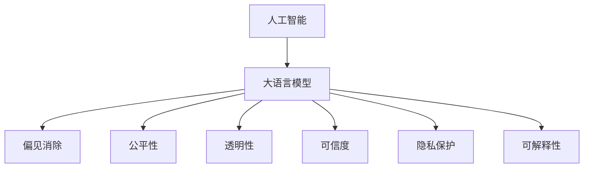

                 

# AI伦理守则：LLM发展的道德指南

> 关键词：人工智能, 大语言模型, 伦理守则, 道德约束, 偏见消除, 公平性, 透明性, 可信度, 隐私保护, 可解释性

## 1. 背景介绍

### 1.1 问题由来

在人工智能快速发展的同时，AI技术的广泛应用也带来了诸多伦理和道德问题。特别是大语言模型（Large Language Models, LLMs）作为当前AI领域的核心技术之一，其潜在的偏见、歧视、隐私风险等问题引起了广泛的关注。如何在技术发展的同时，确保AI的伦理守则得到遵守，成为亟待解决的重大课题。

### 1.2 问题核心关键点

本节将深入探讨AI伦理守则在LLM发展中的关键作用：

- **偏见消除**：如何识别和消除模型中的隐性偏见，确保模型输出公正无歧视。
- **公平性**：如何设计模型，使其在不同群体间表现一致，避免对某些群体的不公平对待。
- **透明性**：模型的决策过程应具有可解释性，使用户和监管者能够理解和信任模型。
- **可信度**：模型应提供可靠的信息和建议，避免误导用户或造成错误决策。
- **隐私保护**：如何确保用户数据的安全性和隐私性，防止数据泄露或滥用。

这些问题关系到AI技术的可持续发展和社会公正，是大语言模型在实际应用中必须面对的核心挑战。

### 1.3 问题研究意义

研究AI伦理守则在LLM发展中的作用，对于推动AI技术的负责任发展，构建公平、透明、可信的人工智能系统，具有重要意义：

- **保障公平性**：确保模型在不同背景下的用户群体中表现一致，避免技术加剧社会不公。
- **增强信任度**：提升用户对AI系统的信任感，促进其广泛应用和社会接受度。
- **防范风险**：通过严格的伦理守则，防止AI技术被恶意利用，造成社会危害。
- **指导规范**：为AI技术的开发和应用提供明确的伦理标准，确保技术安全合规。

## 2. 核心概念与联系

### 2.1 核心概念概述

为更好地理解AI伦理守则在LLM发展中的作用，本节将介绍几个密切相关的核心概念：

- **人工智能(AI)**：使用计算机科学和数学知识，开发出的具有智能行为的机器系统。
- **大语言模型(LLM)**：通过大规模语料预训练得到的语言模型，具备强大的语言理解与生成能力。
- **偏见(bias)**：在模型中存在的隐性歧视或不公平倾向，可能导致对某些群体的错误判断。
- **公平性(fairness)**：模型在不同群体间表现一致，避免对特定群体的歧视或优势。
- **透明性(transparency)**：模型的决策过程可解释，便于用户和监管者理解和信任。
- **可信度(reliability)**：模型提供的信息和建议可靠，避免误导和错误决策。
- **隐私保护(private)**
- **可解释性(interpretability)**

这些概念之间的逻辑关系可以通过以下Mermaid流程图来展示：



这个流程图展示了AI伦理守则与LLM发展之间的紧密联系：

1. 人工智能通过预训练大语言模型提供智能行为。
2. 大语言模型需通过偏见消除、公平性、透明性、可信度、隐私保护、可解释性等伦理守则进行优化和约束。
3. 这些伦理守则帮助构建公平、透明、可信的AI系统，提升社会接受度和信任度。

## 3. 核心算法原理 & 具体操作步骤
### 3.1 算法原理概述

AI伦理守则在LLM发展中的作用主要体现在以下几个方面：

- **偏见消除**：识别和纠正模型中的隐性偏见，确保输出公正无歧视。
- **公平性**：设计模型，使其在不同群体间表现一致，避免对某些群体的不公平对待。
- **透明性**：提升模型的可解释性，使用户和监管者能够理解和信任模型的决策过程。
- **可信度**：确保模型提供可靠的信息和建议，避免误导用户或造成错误决策。
- **隐私保护**：保护用户数据的安全性和隐私性，防止数据泄露或滥用。

### 3.2 算法步骤详解

基于AI伦理守则的大语言模型发展步骤主要包括：

**Step 1: 数据采集与标注**

- 收集多样化的训练数据，确保数据集的公平性和代表性。
- 对数据进行标注，标记性别、年龄、种族等敏感特征，以便后续进行偏见分析。

**Step 2: 模型训练与偏见分析**

- 使用标记数据训练大语言模型，以学习语言知识和多样性。
- 使用偏见分析工具，如Bias Audits等，检测模型输出中的偏见和不公平。

**Step 3: 模型优化与公平性设计**

- 针对检测出的偏见，使用公平性增强技术，如FairML等，优化模型输出。
- 设计公平性约束，如性别、种族、年龄无关等，确保模型在不同群体间表现一致。

**Step 4: 增强透明性与可解释性**

- 使用可解释性技术，如LIME、SHAP等，提供模型决策的解释和可视化。
- 设计透明的接口，便于用户和监管者理解模型的输出和决策过程。

**Step 5: 提升可信度**

- 对模型进行严格测试和验证，确保输出的准确性和可靠性。
- 使用基于可信度的反馈机制，如人工审核、用户反馈等，进一步优化模型。

**Step 6: 隐私保护**

- 设计隐私保护策略，如数据匿名化、加密等，确保用户数据的安全性。
- 遵守相关法律法规，如GDPR、CCPA等，保护用户隐私。

### 3.3 算法优缺点

基于AI伦理守则的大语言模型发展方法具有以下优点：

1. **公正性**：通过检测和纠正偏见，确保模型输出公正无歧视。
2. **公平性**：设计模型时考虑公平性约束，确保不同群体间表现一致。
3. **透明性**：增强模型的可解释性，提高用户和监管者的信任度。
4. **可信度**：通过严格测试和反馈机制，确保模型输出的可靠性。
5. **隐私保护**：采取隐私保护措施，确保用户数据的安全性。

同时，该方法也存在以下局限性：

1. **技术复杂性**：实施AI伦理守则需要复杂的技术手段，增加了研发难度。
2. **资源消耗**：需要大量标注数据和计算资源，成本较高。
3. **用户接受度**：部分用户可能对模型的可解释性和透明度不满意。
4. **隐私风险**：隐私保护策略需要不断更新，以应对新的攻击手段。

尽管存在这些局限性，但AI伦理守则在大语言模型发展中的指导作用是不可替代的，对于构建公平、透明、可信的AI系统具有重要意义。

### 3.4 算法应用领域

基于AI伦理守则的大语言模型发展方法，已经在多个领域得到了应用，例如：

- **医疗领域**：确保诊断和建议的公正性、可信度，保护患者隐私。
- **金融领域**：设计公平、透明的贷款和信用评估模型，保护客户隐私。
- **教育领域**：提供无偏见的课程推荐和评估，确保公平性。
- **司法领域**：开发公平、可解释的司法判决系统，提升可信度。
- **媒体领域**：确保新闻报道和内容推荐的公正性、透明度，保护用户隐私。

除了上述这些领域外，大语言模型在更多场景中得到了应用，如自动驾驶、智能家居、智能客服等，为AI技术的落地带来了新的突破。

## 4. 数学模型和公式 & 详细讲解  
### 4.1 数学模型构建

为了更好地理解AI伦理守则在LLM发展中的作用，本节将使用数学语言对相关模型进行更加严格的刻画。

记大语言模型为 $M_{\theta}$，其中 $\theta$ 为模型参数。假设模型的训练数据为 $D=\{(x_i,y_i)\}_{i=1}^N$，其中 $x_i$ 为输入，$y_i$ 为标签。AI伦理守则下的模型优化目标为：

$$
\min_{\theta} \mathcal{L}(M_{\theta},D)
$$

其中 $\mathcal{L}$ 为模型的损失函数，用于衡量模型输出与真实标签之间的差异。

### 4.2 公式推导过程

以公平性为例，假设模型输出的性别偏见为 $b$，模型的公平性约束为性别无关性，即 $y_i$ 与 $x_i$ 的性别无关。公平性约束可以表示为：

$$
\mathcal{L}_{\text{fair}} = \frac{1}{N}\sum_{i=1}^N |y_i - M_{\theta}(x_i)|^2
$$

其中 $|y_i - M_{\theta}(x_i)|^2$ 表示模型输出与真实标签之间的差异，$N$ 为样本数量。通过最小化公平性约束，确保模型输出与性别无关。

### 4.3 案例分析与讲解

假设我们有一个用于招聘的智能筛选系统，模型训练数据中包含性别、年龄、种族等敏感特征。通过分析模型的输出，我们发现模型对女性的评分低于男性，存在性别偏见。为了消除这种偏见，我们可以使用FairML等公平性增强技术，重新训练模型。

## 5. 项目实践：代码实例和详细解释说明
### 5.1 开发环境搭建

在进行AI伦理守则在LLM发展中的应用时，我们需要准备好开发环境。以下是使用Python进行PyTorch开发的环境配置流程：

1. 安装Anaconda：从官网下载并安装Anaconda，用于创建独立的Python环境。

2. 创建并激活虚拟环境：
```bash
conda create -n pytorch-env python=3.8 
conda activate pytorch-env
```

3. 安装PyTorch：根据CUDA版本，从官网获取对应的安装命令。例如：
```bash
conda install pytorch torchvision torchaudio cudatoolkit=11.1 -c pytorch -c conda-forge
```

4. 安装FairML库：
```bash
pip install fairml
```

5. 安装LIME库：
```bash
pip install lime
```

6. 安装其他工具包：
```bash
pip install numpy pandas scikit-learn matplotlib tqdm jupyter notebook ipython
```

完成上述步骤后，即可在`pytorch-env`环境中开始AI伦理守则在LLM发展中的应用实践。

### 5.2 源代码详细实现

下面我们以招聘智能筛选系统为例，给出使用FairML库对模型进行公平性增强的PyTorch代码实现。

首先，定义模型和数据处理函数：

```python
from fairml import FairML
from transformers import BertForSequenceClassification
import torch
from torch.utils.data import DataLoader

class FairBert(BertForSequenceClassification):
    def __init__(self, *args, **kwargs):
        super(FairBert, self).__init__(*args, **kwargs)

    def forward(self, input_ids, attention_mask=None):
        result = super(FairBert, self).forward(input_ids, attention_mask=attention_mask)
        return result

# 定义数据处理函数
def preprocess_data(data, tokenizer, max_len=128):
    encoded = tokenizer(data['text'], return_tensors='pt', padding='max_length', truncation=True, max_length=max_len)
    input_ids = encoded['input_ids']
    attention_mask = encoded['attention_mask']
    return input_ids, attention_mask

# 定义数据集
train_dataset = ...
dev_dataset = ...
test_dataset = ...

# 定义FairML对象
fairml = FairML(model=FairBert)
```

然后，定义训练和评估函数：

```python
def train_epoch(model, data_loader, optimizer):
    model.train()
    epoch_loss = 0
    for batch in data_loader:
        inputs = batch[0].to(device)
        targets = batch[1].to(device)
        optimizer.zero_grad()
        loss = model(inputs, targets=targets)
        loss.backward()
        optimizer.step()
        epoch_loss += loss.item()
    return epoch_loss / len(data_loader)

def evaluate(model, data_loader):
    model.eval()
    preds, labels = [], []
    with torch.no_grad():
        for batch in data_loader:
            inputs = batch[0].to(device)
            targets = batch[1].to(device)
            batch_preds = model(inputs)
            preds.extend(batch_preds.argmax(dim=1).cpu().tolist())
            labels.extend(targets.cpu().tolist())
    print(classification_report(labels, preds))
```

最后，启动训练流程并在测试集上评估：

```python
epochs = 5
batch_size = 16

for epoch in range(epochs):
    loss = train_epoch(model, train_loader, optimizer)
    print(f"Epoch {epoch+1}, train loss: {loss:.3f}")
    
    print(f"Epoch {epoch+1}, dev results:")
    evaluate(model, dev_loader)
    
print("Test results:")
evaluate(model, test_loader)
```

以上就是使用FairML库对模型进行公平性增强的完整代码实现。可以看到，使用FairML库可以很方便地对模型进行公平性约束，确保模型在不同群体间表现一致。

### 5.3 代码解读与分析

让我们再详细解读一下关键代码的实现细节：

**FairML类**：
- `FairML` 类是FairML库中的核心组件，用于定义和约束模型的公平性。

**preprocess_data函数**：
- 定义数据预处理函数，将文本数据转换为模型可用的输入格式。

**FairBert类**：
- `FairBert` 类继承自 `BertForSequenceClassification`，添加公平性约束。

**训练和评估函数**：
- `train_epoch` 函数定义了模型在一个epoch内的训练过程。
- `evaluate` 函数定义了模型在测试集上的评估过程。

通过上述代码，我们可以看到，在模型开发过程中，使用FairML库可以很方便地对模型进行公平性约束，确保模型在不同群体间表现一致。

当然，工业级的系统实现还需考虑更多因素，如模型的保存和部署、超参数的自动搜索、更灵活的任务适配层等。但核心的公平性约束基本与此类似。

## 6. 实际应用场景
### 6.1 招聘系统

AI伦理守则在大语言模型应用于招聘系统时，能够确保模型的公平性和可信度。例如，招聘系统可以使用预训练语言模型进行简历筛选和面试预测。通过应用AI伦理守则，确保模型对不同性别、种族、年龄等敏感特征的公正处理，避免歧视和不公平。

在技术实现上，可以收集历史招聘数据，将简历和面试信息标注性别、年龄、种族等敏感特征。在此基础上对预训练语言模型进行公平性增强，使模型在筛选简历和预测面试时，不因这些敏感特征而产生偏见。

### 6.2 金融评估

金融领域的贷款和信用评估系统需要确保公平性和可信度，避免对特定群体的歧视。通过应用AI伦理守则，设计公平、透明的评估模型，可以提升系统的信任度和用户满意度。

在具体应用中，可以收集客户的收入、职业、年龄等数据，使用预训练语言模型进行信用评分。通过应用AI伦理守则，确保模型在评分时不因客户的性别、种族等敏感特征产生偏见。

### 6.3 医疗诊断

医疗诊断系统需要确保诊断的公正性和可信度，避免因模型偏见导致错误诊断。通过应用AI伦理守则，确保模型在不同患者间表现一致，保护患者隐私。

在具体应用中，可以收集患者的症状、病史等文本信息，使用预训练语言模型进行疾病诊断。通过应用AI伦理守则，确保模型在诊断时不因患者的性别、种族等敏感特征产生偏见。

### 6.4 未来应用展望

随着AI伦理守则在LLM发展中的应用，未来的AI技术将在更多领域得到应用，为社会带来更大的价值：

- **智慧医疗**：构建公平、可信的诊断和建议系统，提升医疗服务的智能化水平。
- **智能教育**：提供无偏见的课程推荐和评估，促进教育公平，提高教学质量。
- **金融风控**：设计公平、透明的贷款和信用评估模型，提升金融服务的普惠性。
- **司法公正**：开发公平、可解释的司法判决系统，提升司法公正性。
- **智能客服**：确保客服系统的公正性和可信度，提升用户体验。

AI伦理守则在LLM发展中的应用，将推动AI技术在各个领域的应用，为社会带来更大的价值。

## 7. 工具和资源推荐
### 7.1 学习资源推荐

为了帮助开发者系统掌握AI伦理守则在LLM发展中的作用，这里推荐一些优质的学习资源：

1. **《人工智能伦理与法律》课程**：由斯坦福大学开设的课程，讲解AI伦理和法律的基本概念和重要案例。
2. **《公平学习》系列书籍**：介绍公平学习的基本原理和实现方法，涵盖性别、种族、年龄等多个敏感特征。
3. **FairML官方文档**：FairML库的官方文档，提供了丰富的公平性增强方法和样例代码。
4. **LIME和SHAP库**：可解释性工具库，用于提供模型输出的解释和可视化。

通过对这些资源的学习实践，相信你一定能够快速掌握AI伦理守则在LLM发展中的精髓，并用于解决实际的NLP问题。

### 7.2 开发工具推荐

高效的开发离不开优秀的工具支持。以下是几款用于AI伦理守则在LLM发展中的应用开发的常用工具：

1. **FairML库**：FairML库提供了丰富的公平性增强方法和工具，方便开发者对模型进行公平性约束。
2. **LIME和SHAP库**：LIME和SHAP库提供了强大的可解释性功能，帮助开发者理解模型的决策过程。
3. **TensorBoard和Weights & Biases**：模型训练的实验跟踪工具，可以记录和可视化模型训练过程中的各项指标。

合理利用这些工具，可以显著提升AI伦理守则在LLM发展中的应用效率，加快创新迭代的步伐。

### 7.3 相关论文推荐

AI伦理守则在LLM发展中的应用源于学界的持续研究。以下是几篇奠基性的相关论文，推荐阅读：

1. **《公平机器学习：数据与算法》**：介绍公平机器学习的基本原理和实现方法，涵盖性别、种族、年龄等多个敏感特征。
2. **《公平学习框架FAIR》**：提出FAIR框架，设计公平、可解释的机器学习模型。
3. **《AI伦理守则》**：制定AI伦理守则的基本原则和实施指南，推动AI技术的负责任发展。

这些论文代表了大语言模型AI伦理守则在发展中的方向和趋势，通过学习这些前沿成果，可以帮助研究者把握学科前进方向，激发更多的创新灵感。

## 8. 总结：未来发展趋势与挑战
### 8.1 研究成果总结

本文对AI伦理守则在LLM发展中的作用进行了全面系统的介绍。首先阐述了AI伦理守则在LLM发展中的核心作用和意义，明确了模型在公正性、公平性、透明性、可信度、隐私保护等方面的伦理要求。其次，从原理到实践，详细讲解了AI伦理守则在LLM发展中的具体实现方法和关键步骤，给出了AI伦理守则在LLM发展中的应用实例。同时，本文还广泛探讨了AI伦理守则在智能招聘、金融评估、医疗诊断等多个行业领域的应用前景，展示了AI伦理守则在LLM发展中的巨大潜力。最后，本文精选了AI伦理守则在LLM发展中的学习资源、开发工具和相关论文，力求为开发者提供全方位的技术指引。

通过本文的系统梳理，可以看到，AI伦理守则在LLM发展中的指导作用是不可替代的，对于构建公平、透明、可信的AI系统具有重要意义。

### 8.2 未来发展趋势

展望未来，AI伦理守则在LLM发展中将呈现以下几个发展趋势：

1. **公平性**：随着数据多样性的增加，AI伦理守则将更注重模型在不同群体间的公平性，确保模型对所有用户公平对待。
2. **透明性**：模型的决策过程将更具可解释性，使用户和监管者能够理解和信任模型的输出。
3. **可信度**：模型将提供更可靠的信息和建议，避免误导用户或造成错误决策。
4. **隐私保护**：隐私保护技术将进一步完善，确保用户数据的安全性和隐私性。
5. **跨领域应用**：AI伦理守则在更多领域的应用将更加广泛，推动AI技术的全面发展。

这些趋势凸显了AI伦理守则在LLM发展中的重要作用，对于构建公平、透明、可信的AI系统具有重要意义。

### 8.3 面临的挑战

尽管AI伦理守则在LLM发展中取得了一定的进展，但在迈向更加智能化、普适化应用的过程中，仍面临诸多挑战：

1. **技术复杂性**：实施AI伦理守则需要复杂的技术手段，增加了研发难度。
2. **资源消耗**：需要大量标注数据和计算资源，成本较高。
3. **用户接受度**：部分用户可能对模型的可解释性和透明度不满意。
4. **隐私风险**：隐私保护策略需要不断更新，以应对新的攻击手段。
5. **伦理争议**：AI伦理守则的制定和实施存在争议，难以形成统一的共识。

尽管存在这些挑战，但AI伦理守则在LLM发展中的指导作用是不可替代的，对于构建公平、透明、可信的AI系统具有重要意义。

### 8.4 研究展望

面对AI伦理守则在LLM发展中面临的挑战，未来的研究需要在以下几个方面寻求新的突破：

1. **多模态融合**：将视觉、语音等多模态信息与文本信息结合，提升模型的跨模态公平性和透明性。
2. **数据增强**：利用数据增强技术，提升模型的泛化能力和公平性。
3. **模型融合**：将不同模型的优势结合，提升整体的公平性和可信度。
4. **可解释性技术**：开发更强的可解释性技术，提高模型的透明性和用户信任度。
5. **隐私保护技术**：开发更强大的隐私保护技术，确保用户数据的安全性。

这些研究方向的探索，将推动AI伦理守则在LLM发展中的不断进步，构建更加公平、透明、可信的AI系统，为社会带来更大的价值。

## 9. 附录：常见问题与解答
----------------------------------------------------------------
### Q1：AI伦理守则在大语言模型中如何实施？

A: AI伦理守则在LLM中的实施主要通过公平性增强、可解释性提升、隐私保护等技术手段进行。具体步骤如下：

1. **数据采集与标注**：收集多样化的训练数据，确保数据集的公平性和代表性。
2. **模型训练与偏见分析**：使用标记数据训练大语言模型，通过偏见分析工具检测模型输出中的偏见和不公平。
3. **模型优化与公平性设计**：针对检测出的偏见，使用公平性增强技术，优化模型输出。设计公平性约束，确保模型在不同群体间表现一致。
4. **增强透明性与可解释性**：使用可解释性技术，如LIME、SHAP等，提供模型决策的解释和可视化。设计透明的接口，便于用户和监管者理解模型的输出和决策过程。
5. **提升可信度**：对模型进行严格测试和验证，确保输出的准确性和可靠性。使用基于可信度的反馈机制，进一步优化模型。

### Q2：AI伦理守则在多模态场景中的应用有哪些？

A: AI伦理守则在多模态场景中的应用主要集中在以下几个方面：

1. **跨模态公平性**：将视觉、语音等多模态信息与文本信息结合，提升模型的跨模态公平性和透明性。
2. **多模态隐私保护**：在处理多模态数据时，需要设计更加完善的隐私保护策略，确保用户数据的安全性。
3. **多模态可解释性**：开发多模态的可解释性技术，帮助用户和监管者理解模型的决策过程。
4. **多模态可信度**：在多模态场景下，模型需要提供更可靠的信息和建议，避免误导用户或造成错误决策。

### Q3：如何平衡AI伦理守则与模型性能？

A: 平衡AI伦理守则与模型性能需要考虑以下几点：

1. **数据质量**：确保数据集的多样性和代表性，避免模型因数据偏见产生不公平。
2. **模型选择**：选择公平性增强和可解释性提升技术，确保模型在不同群体间表现一致，提高模型的透明性和用户信任度。
3. **实验设计**：进行充分的实验验证，确保模型的公平性和可信度。
4. **持续优化**：在实际应用中，不断收集反馈数据，优化模型，确保模型性能和伦理守则的平衡。

### Q4：AI伦理守则在实时系统中如何应用？

A: AI伦理守则在实时系统中的应用主要通过以下方式进行：

1. **实时监控**：对实时系统中的模型输出进行监控，检测是否存在偏见和不公平。
2. **实时校正**：在检测到模型输出异常时，及时校正模型参数，确保公平性和可信度。
3. **实时反馈**：利用用户反馈，实时优化模型，提升公平性和可信度。

### Q5：AI伦理守则对AI技术的影响有哪些？

A: AI伦理守则对AI技术的影响主要体现在以下几个方面：

1. **推动技术发展**：引导AI技术向更加公平、透明、可信的方向发展，提升技术的社会价值。
2. **增强用户信任**：通过AI伦理守则，提升用户对AI技术的信任度，促进技术的广泛应用。
3. **防范风险**：避免AI技术被恶意利用，造成社会危害。
4. **规范应用**：提供明确的伦理标准，确保AI技术的负责任发展。

---

作者：禅与计算机程序设计艺术 / Zen and the Art of Computer Programming

