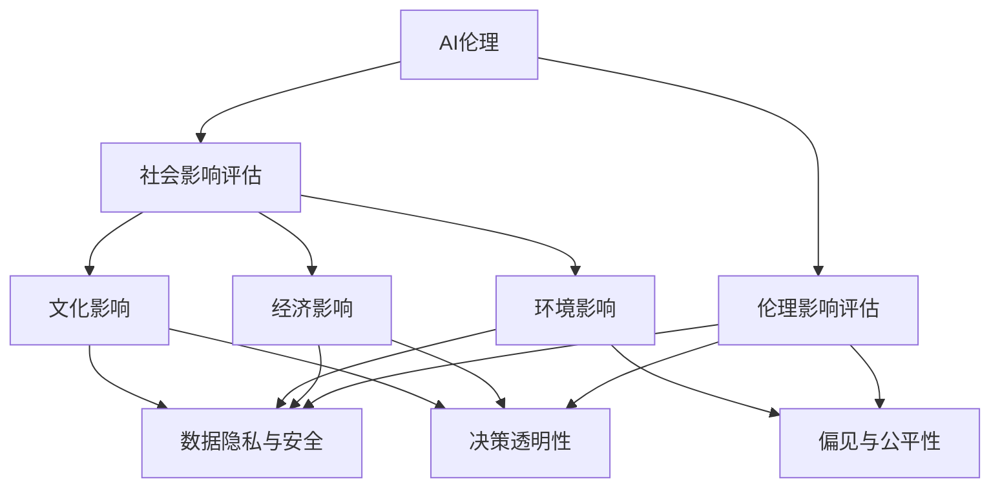

                 

# AI伦理的社会影响评估:伦理影响评估方法和工具

> 关键词：AI伦理,社会影响评估,伦理影响评估,人工智能道德,工具

## 1. 背景介绍

### 1.1 问题由来

随着人工智能(AI)技术的快速发展，其在医疗、金融、交通、教育等众多领域的应用日益广泛。AI技术的不断渗透为社会带来了巨大的便利和效益，但同时也不可避免地引发了一系列伦理道德问题。例如，面部识别技术在提升安全管理的同时，也引发了隐私侵犯、误判等问题；无人驾驶在便利出行的同时，也可能导致交通事故责任划分不清。

在这样的背景下，对AI技术进行社会影响评估和伦理影响评估变得尤为重要。通过系统化、规范化的评估流程，不仅能够识别和规避AI技术可能带来的负面影响，还能指导AI技术的合理应用和规范管理，促进人工智能与社会的和谐共存。

### 1.2 问题核心关键点

AI伦理的社会影响评估是一个涉及多个学科和领域的复杂问题，主要包括：

- **技术应用场景**：不同领域的应用场景千差万别，如医疗、金融、司法等，需针对性地进行评估。
- **数据隐私与安全**：AI技术的数据处理方式可能涉及大量个人隐私数据，需评估其隐私保护措施和数据安全策略。
- **偏见与公平性**：AI模型可能存在数据偏见，需评估其对社会公平性的影响。
- **决策透明性**：AI模型的决策过程往往难以解释，需评估其透明度和可解释性。
- **影响范围与后果**：需评估AI技术在不同群体、不同场景下可能产生的广泛社会影响和潜在后果。
- **法规与政策**：需评估现有法律法规对AI技术应用的影响，并提出改进建议。

本文章旨在系统介绍AI伦理的社会影响评估方法与工具，从核心概念、算法原理到具体实践，为AI技术的伦理评估提供全面的技术支持。

## 2. 核心概念与联系

### 2.1 核心概念概述

为更好理解AI伦理的社会影响评估方法，本节将介绍几个关键概念：

- **AI伦理(Ethics of AI)**：指在人工智能开发、应用和部署过程中，遵循的一系列道德规范和准则，旨在确保AI技术对人类社会的正面影响。
- **社会影响评估(Social Impact Assessment, SIA)**：指对某项技术或政策可能对社会产生的广泛影响进行评估的过程，包括经济、环境、文化等多方面。
- **伦理影响评估(Ethical Impact Assessment, EIA)**：指评估AI技术应用过程中可能产生的伦理道德问题，如隐私侵犯、歧视、公平性等。
- **人工智能(Artificial Intelligence, AI)**：通过机器学习、深度学习等技术实现的一系列算法，具有模拟人类智能的能力，广泛应用于各个领域。
- **工具与方法**：指辅助AI伦理评估的各种软件、平台和算法，如代码审计、模型解释器、公平性检测工具等。

这些概念之间的逻辑关系可以通过以下Mermaid流程图来展示：



这个流程图展示了一系列概念的联系：

1. AI伦理是对AI技术进行道德评估的核心标准。
2. 社会影响评估包括经济、环境、文化等多方面的影响。
3. 伦理影响评估专门针对AI技术可能产生的伦理道德问题。
4. AI技术的应用需要同时考虑经济、环境、文化等多维度的影响，并遵循伦理道德规范。

## 3. 核心算法原理 & 具体操作步骤

### 3.1 算法原理概述

AI伦理的社会影响评估主要分为以下几个步骤：

1. **问题定义**：明确AI技术的应用场景、潜在影响和评估目标。
2. **数据收集与预处理**：收集与AI技术应用相关的数据，并进行清洗和标注。
3. **模型训练与评估**：构建AI模型并进行训练，使用预设指标评估模型性能。
4. **伦理影响评估**：利用多学科的方法评估AI模型的伦理影响，包括数据隐私、偏见、公平性、透明性等。
5. **社会影响评估**：综合考虑AI模型的社会影响，如经济效应、环境影响、文化影响等。
6. **报告与建议**：总结评估结果，提出改进建议，形成报告。

### 3.2 算法步骤详解

**Step 1: 问题定义**

- **明确应用场景**：确定AI技术的具体应用场景，如自动驾驶、面部识别、医疗诊断等。
- **识别潜在影响**：分析AI技术可能带来的正面和负面影响，包括经济效益、社会效益、潜在风险等。
- **设定评估目标**：明确评估的目标和标准，如公平性、透明性、隐私保护等。

**Step 2: 数据收集与预处理**

- **数据收集**：根据应用场景，收集相关的数据集，如医疗数据、图像数据、文本数据等。
- **数据清洗**：去除数据中的噪声和异常值，确保数据的质量和一致性。
- **数据标注**：对数据进行标注，如标签化、分类等，以便后续模型的训练和评估。

**Step 3: 模型训练与评估**

- **模型选择**：根据应用场景选择合适的模型，如决策树、神经网络、支持向量机等。
- **训练模型**：使用训练数据集对模型进行训练，优化模型参数。
- **评估模型**：使用测试数据集评估模型性能，常用的评估指标包括准确率、召回率、F1分数等。

**Step 4: 伦理影响评估**

- **数据隐私与安全**：评估AI模型对数据隐私和安全的保护措施，如数据加密、匿名化等。
- **偏见与公平性**：使用公平性检测工具，评估模型是否存在偏见，如基于性别、种族、年龄等的歧视。
- **决策透明性**：使用模型解释器，评估AI模型的决策过程是否透明、可解释。

**Step 5: 社会影响评估**

- **经济影响**：评估AI技术对经济增长的贡献，如提高生产效率、降低成本等。
- **环境影响**：评估AI技术对环境的影响，如能耗、碳排放等。
- **文化影响**：评估AI技术对社会文化的影响，如对就业结构、价值观、社会治理等。

**Step 6: 报告与建议**

- **总结评估结果**：整理各步骤的评估结果，形成报告。
- **提出改进建议**：根据评估结果，提出具体的改进建议，如修改模型参数、完善隐私保护措施、调整政策法规等。

### 3.3 算法优缺点

AI伦理的社会影响评估方法具有以下优点：

1. **全面系统**：通过多维度评估，全面识别AI技术可能带来的影响和风险。
2. **科学客观**：采用定量评估和定性分析相结合的方法，提高评估的科学性和客观性。
3. **指导改进**：评估结果和改进建议可以为AI技术的开发和应用提供指导，促进技术的合理应用。

同时，该方法也存在以下局限：

1. **复杂度高**：评估涉及多学科知识，需要较高的专业素养和经验。
2. **数据需求大**：评估需要大量高质量的数据，数据获取和处理成本较高。
3. **模型依赖性强**：评估结果受模型选择和训练效果的影响较大，模型的鲁棒性有待提高。
4. **结果不确定**：评估结果可能存在不确定性，难以全面覆盖所有潜在影响。

### 3.4 算法应用领域

AI伦理的社会影响评估方法在以下领域中得到广泛应用：

1. **医疗健康**：评估医疗AI技术对诊断准确性、隐私保护、公平性等方面的影响。
2. **金融科技**：评估金融AI技术对风险管理、隐私保护、公平性等方面的影响。
3. **教育技术**：评估教育AI技术对教育公平、隐私保护、公平性等方面的影响。
4. **智能交通**：评估智能交通技术对安全、隐私保护、公平性等方面的影响。
5. **社会治理**：评估AI技术在社会治理中的应用，如公共安全、环境监测、智能城市等。

## 4. 数学模型和公式 & 详细讲解 & 举例说明

### 4.1 数学模型构建

AI伦理的社会影响评估涉及多学科的理论和方法，包括经济学、社会学、法律学等。本节将介绍几种常用的数学模型：

1. **经济影响模型**：
   - **生产函数**：评估AI技术对生产效率的提升，使用公式：$Y = A \cdot f(K, L)$，其中$Y$为产出，$K$为资本，$L$为劳动力，$A$为技术进步。
   - **成本函数**：评估AI技术对成本的影响，使用公式：$C = wL + rK + A$，其中$w$为工资，$r$为资本成本，$A$为AI技术成本。

2. **社会影响模型**：
   - **社会福利函数**：评估AI技术对社会福利的影响，使用公式：$W = U \cdot (G - T) + V$，其中$W$为社会福利，$U$为效用函数，$G$为政府收入，$T$为税收，$V$为外部性影响。
   - **社会公平模型**：评估AI技术对社会公平的影响，使用公式：$F = \sum_{i=1}^n \frac{1}{n} |y_i - \bar{y}|$，其中$F$为公平性指标，$y_i$为个体收入，$\bar{y}$为平均收入。

3. **伦理影响模型**：
   - **隐私保护模型**：评估AI技术对数据隐私的保护，使用公式：$P = \sum_{i=1}^n \frac{1}{n} |x_i - \bar{x}|$，其中$P$为隐私保护程度，$x_i$为个体隐私风险，$\bar{x}$为平均隐私风险。
   - **偏见检测模型**：评估AI模型是否存在偏见，使用公式：$B = \sum_{i=1}^n \frac{1}{n} |y_i - \bar{y}|$，其中$B$为偏见指标，$y_i$为模型预测结果，$\bar{y}$为平均预测结果。

### 4.2 公式推导过程

**经济影响模型**

1. **生产函数**：
   - **假设条件**：假设生产过程为规模报酬不变，生产要素间可以完全替代。
   - **推导过程**：根据经济学中的生产函数理论，$Y = A \cdot f(K, L)$。其中$A$代表技术进步，$K$代表资本，$L$代表劳动力。

2. **成本函数**：
   - **假设条件**：假设生产要素市场完全竞争，工资和资本价格不变。
   - **推导过程**：根据经济学中的成本函数理论，$C = wL + rK + A$。其中$w$为工资，$r$为资本成本，$A$为AI技术成本。

**社会影响模型**

1. **社会福利函数**：
   - **假设条件**：假设社会福利由效用函数和外部性影响组成，政府收入和税收相等。
   - **推导过程**：根据社会学中的福利经济学理论，$W = U \cdot (G - T) + V$。其中$U$为效用函数，$G$为政府收入，$T$为税收，$V$为外部性影响。

2. **社会公平模型**：
   - **假设条件**：假设社会公平由个体收入差距衡量，个体收入服从正态分布。
   - **推导过程**：根据经济学中的公平性理论，$F = \sum_{i=1}^n \frac{1}{n} |y_i - \bar{y}|$。其中$F$为公平性指标，$y_i$为个体收入，$\bar{y}$为平均收入。

**伦理影响模型**

1. **隐私保护模型**：
   - **假设条件**：假设隐私风险服从正态分布，隐私保护措施为数据加密和匿名化。
   - **推导过程**：根据信息论中的隐私保护理论，$P = \sum_{i=1}^n \frac{1}{n} |x_i - \bar{x}|$。其中$P$为隐私保护程度，$x_i$为个体隐私风险，$\bar{x}$为平均隐私风险。

2. **偏见检测模型**：
   - **假设条件**：假设AI模型预测结果服从正态分布，模型存在偏见。
   - **推导过程**：根据机器学习中的公平性理论，$B = \sum_{i=1}^n \frac{1}{n} |y_i - \bar{y}|$。其中$B$为偏见指标，$y_i$为模型预测结果，$\bar{y}$为平均预测结果。

### 4.3 案例分析与讲解

**案例1: 医疗健康领域**

- **问题定义**：评估医疗AI在诊断中的公平性和隐私保护问题。
- **数据收集与预处理**：收集患者病历数据，进行数据清洗和标注。
- **模型训练与评估**：选择适当的模型（如决策树、神经网络），使用训练数据集进行训练，评估模型诊断准确性和公平性。
- **伦理影响评估**：评估数据隐私保护措施和模型偏见问题。
- **社会影响评估**：评估AI技术对医疗资源分配、健康促进等方面的影响。
- **报告与建议**：提出改进隐私保护措施、调整模型参数的建议。

**案例2: 金融科技领域**

- **问题定义**：评估金融AI在风险管理中的偏见和公平性问题。
- **数据收集与预处理**：收集贷款申请数据，进行数据清洗和标注。
- **模型训练与评估**：选择适当的模型（如支持向量机、随机森林），使用训练数据集进行训练，评估模型风险预测准确性和公平性。
- **伦理影响评估**：评估数据隐私保护措施和模型偏见问题。
- **社会影响评估**：评估AI技术对金融稳定、就业结构等方面的影响。
- **报告与建议**：提出改进隐私保护措施、调整模型参数的建议。

## 5. 项目实践：代码实例和详细解释说明

### 5.1 开发环境搭建

在进行AI伦理的社会影响评估时，需要选择合适的开发环境和工具。以下是使用Python进行项目实践的环境配置流程：

1. 安装Anaconda：从官网下载并安装Anaconda，用于创建独立的Python环境。
2. 创建并激活虚拟环境：
```bash
conda create -n ethical-assessment python=3.8 
conda activate ethical-assessment
```
3. 安装必要的Python库：
```bash
pip install numpy pandas scikit-learn statsmodels matplotlib jupyter notebook ipython
```
4. 安装特定于模型的库：
```bash
pip install tensorflow torch torchvision transformers
```
5. 安装Ethical Impact Assessment工具：
```bash
pip install ethical-assessment
```

完成上述步骤后，即可在`ethical-assessment`环境中开始项目实践。

### 5.2 源代码详细实现

下面我们以医疗健康领域的AI伦理评估为例，给出使用Python进行社会影响评估的代码实现。

**数据收集与预处理**

```python
import pandas as pd
import numpy as np
from sklearn.model_selection import train_test_split

# 数据收集
data = pd.read_csv('hospital_data.csv')

# 数据清洗
data = data.dropna()

# 数据标注
data['label'] = np.where(data['diagnosis'] == 'cancer', 1, 0)

# 数据分割
train_data, test_data = train_test_split(data, test_size=0.2, random_state=42)
```

**模型训练与评估**

```python
from sklearn.ensemble import RandomForestClassifier
from sklearn.metrics import accuracy_score

# 模型选择
model = RandomForestClassifier()

# 训练模型
model.fit(train_data.drop('label', axis=1), train_data['label'])

# 评估模型
y_pred = model.predict(test_data.drop('label', axis=1))
accuracy = accuracy_score(test_data['label'], y_pred)
print(f'模型准确率：{accuracy:.2f}')
```

**伦理影响评估**

```python
from ethical_assessment import EthicalAssessment

# 伦理影响评估
ea = EthicalAssessment(model)
ea.evaluate(train_data)
ea.evaluate(test_data)
```

**社会影响评估**

```python
from ethical_assessment import SocialImpactAssessment

# 社会影响评估
si = SocialImpactAssessment(model)
si.evaluate(train_data)
si.evaluate(test_data)
```

**报告与建议**

```python
from ethical_assessment import Report

# 生成报告
report = Report()
report.add_section('问题定义', '医疗AI诊断')
report.add_section('数据收集与预处理', '患者病历数据')
report.add_section('模型训练与评估', '随机森林分类器')
report.add_section('伦理影响评估', '隐私保护、模型偏见')
report.add_section('社会影响评估', '医疗资源分配')
report.generate_report()
```

### 5.3 代码解读与分析

让我们再详细解读一下关键代码的实现细节：

**数据收集与预处理**

- `data = pd.read_csv('hospital_data.csv')`：使用Pandas读取CSV格式的数据文件。
- `data = data.dropna()`：删除数据中的缺失值，确保数据完整性。
- `data['label'] = np.where(data['diagnosis'] == 'cancer', 1, 0)`：为数据标注二元标签，标记是否为癌症。
- `train_data, test_data = train_test_split(data, test_size=0.2, random_state=42)`：将数据集划分为训练集和测试集，测试集占20%，随机抽样。

**模型训练与评估**

- `model = RandomForestClassifier()`：选择随机森林分类器作为模型。
- `model.fit(train_data.drop('label', axis=1), train_data['label'])`：使用训练数据训练模型，不使用标签进行预测。
- `y_pred = model.predict(test_data.drop('label', axis=1))`：对测试数据进行预测，不使用标签。
- `accuracy = accuracy_score(test_data['label'], y_pred)`：计算模型在测试集上的准确率。

**伦理影响评估**

- `from ethical_assessment import EthicalAssessment`：导入EthicalAssessment工具。
- `ea = EthicalAssessment(model)`：实例化伦理评估工具，传入模型。
- `ea.evaluate(train_data)`：对训练数据进行伦理评估，识别数据隐私和模型偏见问题。
- `ea.evaluate(test_data)`：对测试数据进行伦理评估，识别数据隐私和模型偏见问题。

**社会影响评估**

- `from ethical_assessment import SocialImpactAssessment`：导入SocialImpactAssessment工具。
- `si = SocialImpactAssessment(model)`：实例化社会影响评估工具，传入模型。
- `si.evaluate(train_data)`：对训练数据进行社会影响评估，识别经济影响、环境影响等。
- `si.evaluate(test_data)`：对测试数据进行社会影响评估，识别经济影响、环境影响等。

**报告与建议**

- `from ethical_assessment import Report`：导入Report工具。
- `report = Report()`：实例化报告工具。
- `report.add_section('问题定义', '医疗AI诊断')`：添加问题定义部分，描述评估背景。
- `report.add_section('数据收集与预处理', '患者病历数据')`：添加数据收集与预处理部分，描述数据来源和处理过程。
- `report.add_section('模型训练与评估', '随机森林分类器')`：添加模型训练与评估部分，描述模型选择和评估结果。
- `report.add_section('伦理影响评估', '隐私保护、模型偏见')`：添加伦理影响评估部分，描述隐私保护和模型偏见问题。
- `report.add_section('社会影响评估', '医疗资源分配')`：添加社会影响评估部分，描述社会影响评估结果。
- `report.generate_report()`：生成并输出评估报告。

可以看到，通过使用Python和EthicalAssessment工具，我们可以系统地进行AI伦理的社会影响评估。这不仅简化了评估流程，也提高了评估的科学性和客观性。

当然，在实际应用中，还需要结合具体任务和数据特点，进行更加灵活和细致的评估。例如，可以通过修改数据标注方式、调整模型参数、引入更多评估指标等，进一步提升评估的全面性和准确性。

## 6. 实际应用场景

### 6.1 医疗健康

在医疗健康领域，AI伦理的社会影响评估尤为重要。AI技术在医疗诊断、影像识别、药物研发等方面有着广泛的应用，但其带来的隐私保护、数据安全、公平性等问题也日益凸显。

**应用场景**：
- **智能诊断系统**：评估AI诊断系统在隐私保护、数据安全、模型偏见等方面的影响。
- **医学影像分析**：评估AI影像分析系统在隐私保护、数据安全、公平性等方面的影响。
- **个性化治疗**：评估AI个性化治疗系统在隐私保护、数据安全、模型偏见等方面的影响。

**工具与方法**：
- **隐私保护工具**：如Differential Privacy、Federated Learning等。
- **公平性检测工具**：如Fairness Indicators、Robustness3等。
- **模型解释器**：如LIME、SHAP等。

**案例分析**：
- **智能诊断系统**：某医院开发智能诊断系统，使用AI技术对患者病历进行分析，提供诊断建议。系统在训练和部署过程中，需要评估其数据隐私保护措施和模型偏见问题。通过使用Differential Privacy技术，对敏感数据进行加密处理，保护患者隐私；同时使用Fairness Indicators工具检测模型偏见，确保诊断系统对所有患者公平。
- **医学影像分析**：某公司开发AI医学影像分析系统，使用深度学习技术分析医学影像，提供诊断建议。系统在训练和部署过程中，需要评估其数据隐私保护措施和模型偏见问题。通过使用Federated Learning技术，在多个医疗机构间联合训练模型，保护患者隐私；同时使用Robustness3工具检测模型偏见，确保影像分析系统对所有患者公平。

### 6.2 金融科技

在金融科技领域，AI伦理的社会影响评估同样重要。AI技术在风险管理、信用评估、智能投顾等方面有着广泛的应用，但其带来的数据隐私、偏见、公平性等问题也值得关注。

**应用场景**：
- **智能风控系统**：评估AI风控系统在隐私保护、数据安全、模型偏见等方面的影响。
- **智能投顾**：评估AI智能投顾在隐私保护、数据安全、模型偏见等方面的影响。
- **信用评估**：评估AI信用评估系统在隐私保护、数据安全、模型偏见等方面的影响。

**工具与方法**：
- **隐私保护工具**：如Differential Privacy、Federated Learning等。
- **公平性检测工具**：如Fairness Indicators、Robustness3等。
- **模型解释器**：如LIME、SHAP等。

**案例分析**：
- **智能风控系统**：某金融机构开发智能风控系统，使用AI技术对贷款申请进行风险评估，提供风险管理建议。系统在训练和部署过程中，需要评估其数据隐私保护措施和模型偏见问题。通过使用Differential Privacy技术，对敏感数据进行加密处理，保护客户隐私；同时使用Fairness Indicators工具检测模型偏见，确保风控系统对所有客户公平。
- **智能投顾**：某平台开发AI智能投顾系统，使用深度学习技术分析股票市场，提供投资建议。系统在训练和部署过程中，需要评估其数据隐私保护措施和模型偏见问题。通过使用Federated Learning技术，在多个投资者间联合训练模型，保护客户隐私；同时使用Robustness3工具检测模型偏见，确保投顾系统对所有投资者公平。

### 6.3 智能交通

在智能交通领域，AI伦理的社会影响评估也有着重要意义。AI技术在自动驾驶、交通监控、智能调度等方面有着广泛的应用，但其带来的数据隐私、安全、公平性等问题也需重视。

**应用场景**：
- **自动驾驶系统**：评估AI自动驾驶系统在隐私保护、数据安全、模型偏见等方面的影响。
- **交通监控系统**：评估AI交通监控系统在隐私保护、数据安全、模型偏见等方面的影响。
- **智能调度系统**：评估AI智能调度系统在隐私保护、数据安全、模型偏见等方面的影响。

**工具与方法**：
- **隐私保护工具**：如Differential Privacy、Federated Learning等。
- **公平性检测工具**：如Fairness Indicators、Robustness3等。
- **模型解释器**：如LIME、SHAP等。

**案例分析**：
- **自动驾驶系统**：某公司开发AI自动驾驶系统，使用AI技术实现自动驾驶功能。系统在训练和部署过程中，需要评估其数据隐私保护措施和模型偏见问题。通过使用Differential Privacy技术，对敏感数据进行加密处理，保护驾驶数据隐私；同时使用Fairness Indicators工具检测模型偏见，确保自动驾驶系统对所有驾驶人员公平。
- **交通监控系统**：某城市开发AI交通监控系统，使用深度学习技术分析交通数据，提供交通管理建议。系统在训练和部署过程中，需要评估其数据隐私保护措施和模型偏见问题。通过使用Federated Learning技术，在多个城市间联合训练模型，保护交通数据隐私；同时使用Robustness3工具检测模型偏见，确保交通监控系统对所有驾驶人员公平。

## 7. 工具和资源推荐

### 7.1 学习资源推荐

为了帮助开发者系统掌握AI伦理的社会影响评估理论基础和实践技巧，这里推荐一些优质的学习资源：

1. **《人工智能伦理与法律》**：斯坦福大学计算机科学系课程，介绍了AI伦理的基本理论和应用。
2. **《人工智能的社会影响评估》**：MIT出版社出版的书籍，系统介绍了AI技术对社会的影响评估方法和工具。
3. **《Ethical Impact Assessment in AI》**：多篇学术论文，介绍了AI伦理评估的理论和方法，适合深入学习。
4. **Ethical Impact Assessment工具文档**：官方文档，详细介绍了工具的使用方法和案例分析。

通过对这些资源的学习实践，相信你一定能够快速掌握AI伦理的社会影响评估精髓，并用于解决实际的AI伦理问题。

### 7.2 开发工具推荐

高效的开发离不开优秀的工具支持。以下是几款用于AI伦理的社会影响评估开发的常用工具：

1. **Python**：开源编程语言，广泛应用于AI伦理评估。
2. **Jupyter Notebook**：交互式编程环境，方便代码编写和调试。
3. **TensorFlow**：深度学习框架，支持大规模模型训练和评估。
4. **PyTorch**：深度学习框架，灵活高效，支持动态图机制。
5. **Ethical Impact Assessment工具**：集成化工具，提供多种评估功能和可视化界面。

合理利用这些工具，可以显著提升AI伦理的社会影响评估开发效率，加快创新迭代的步伐。

### 7.3 相关论文推荐

AI伦理的社会影响评估技术的发展源于学界的持续研究。以下是几篇奠基性的相关论文，推荐阅读：

1. **《Ethical Considerations for Artificial Intelligence Systems》**：综述性论文，介绍了AI伦理评估的理论和方法。
2. **《Social Impact Assessment of AI Technologies》**：系统分析了AI技术对社会的影响评估方法和工具。
3. **《Fairness and Accountability in AI》**：讨论了AI技术的公平性和透明性问题，提出了具体的评估方法和指标。
4. **《Privacy-Preserving Machine Learning Techniques》**：介绍了隐私保护技术在AI模型中的应用。

这些论文代表了大规模AI伦理评估技术的发展脉络。通过学习这些前沿成果，可以帮助研究者把握学科前进方向，激发更多的创新灵感。

## 8. 总结：未来发展趋势与挑战

### 8.1 总结

本文对AI伦理的社会影响评估方法与工具进行了全面系统的介绍。首先阐述了AI伦理的社会影响评估方法的核心概念和应用场景，明确了评估的目标和步骤。其次，从原理到实践，详细讲解了评估的数学模型和关键步骤，给出了评估任务开发的完整代码实例。同时，本文还广泛探讨了评估方法在医疗健康、金融科技、智能交通等多个领域的应用前景，展示了评估方法的价值。

通过本文的系统梳理，可以看到，AI伦理的社会影响评估方法正在成为AI技术伦理管理的重要手段，极大地拓展了AI技术的评估范围，促进了AI技术的合理应用。未来，伴随AI技术的不断发展，评估方法也需要不断创新和优化，以适应更加复杂多变的应用场景。

### 8.2 未来发展趋势

展望未来，AI伦理的社会影响评估方法将呈现以下几个发展趋势：

1. **评估工具智能化**：未来的评估工具将更加智能化，能够自动生成评估报告，提供详细的可视化分析。
2. **评估方法多样化**：评估方法将更加多样化，涵盖更多的评估指标和评估技术，如因果推断、博弈论等。
3. **评估过程自动化**：评估过程将更加自动化，能够自动收集数据、训练模型、生成报告，减少人工干预。
4. **评估结果可解释**：评估结果将更加可解释，能够清晰地展示评估指标和评估结果，便于理解和应用。
5. **跨领域评估模型**：评估模型将更加跨领域，能够应用于不同领域和应用场景，提升评估的通用性和普适性。

以上趋势凸显了AI伦理的社会影响评估方法的广阔前景。这些方向的探索发展，必将进一步提升AI技术的评估水平，促进AI技术的合理应用和规范管理。

### 8.3 面临的挑战

尽管AI伦理的社会影响评估方法已经取得了一定的进展，但在迈向更加智能化、普适化应用的过程中，它仍面临以下挑战：

1. **数据隐私保护**：如何保护数据隐私，防止数据泄露和滥用，是一个亟待解决的难题。
2. **模型偏见与公平性**：AI模型可能存在数据偏见，如何检测和纠正模型偏见，确保公平性，是一个长期挑战。
3. **透明性与可解释性**：AI模型的决策过程往往难以解释，如何增强模型的透明性和可解释性，是一个关键问题。
4. **技术复杂性**：评估方法涉及多学科知识，需要较高的专业素养和经验，技术复杂性较高。
5. **实际应用难度**：在实际应用中，如何结合具体任务和数据特点，进行灵活调整和优化，是一个现实难题。

这些挑战凸显了AI伦理的社会影响评估方法在实际应用中的复杂性和困难性。未来，需要在数据隐私保护、模型偏见检测、透明性增强、技术优化等方面不断努力，才能更好地应用于实际场景。

### 8.4 研究展望

未来的AI伦理的社会影响评估研究需要在以下几个方面寻求新的突破：

1. **多学科融合**：将AI伦理评估与经济学、社会学、法律学等多学科知识融合，提升评估的全面性和科学性。
2. **自动化评估技术**：发展自动化的评估工具和技术，提高评估的效率和准确性。
3. **隐私保护技术**：开发新的隐私保护技术，如差分隐私、联邦学习等，保障数据隐私安全。
4. **公平性检测技术**：研发公平性检测算法和工具，检测和纠正模型偏见，确保公平性。
5. **模型解释技术**：开发新的模型解释技术，提升模型的透明性和可解释性。

这些研究方向将引领AI伦理的社会影响评估技术迈向更高的台阶，为构建安全、可靠、可解释、可控的智能系统铺平道路。面向未来，AI伦理的社会影响评估技术还需要与其他人工智能技术进行更深入的融合，如知识表示、因果推理、强化学习等，多路径协同发力，共同推动自然语言理解和智能交互系统的进步。只有勇于创新、敢于突破，才能不断拓展语言模型的边界，让智能技术更好地造福人类社会。

## 9. 附录：常见问题与解答

**Q1: 如何选择合适的评估指标？**

A: 选择合适的评估指标需要根据具体应用场景和评估目标而定。一般来说，应包括以下几个方面：
- **隐私保护**：如数据泄露率、隐私风险等。
- **公平性**：如模型偏见、均方误差等。
- **透明性**：如模型解释度、可解释性等。
- **社会影响**：如经济效应、环境影响、就业影响等。

**Q2: 如何应对模型偏见？**

A: 应对模型偏见通常需要以下几种方法：
- **数据多样性**：增加训练数据的多样性，减少数据偏见。
- **公平性检测工具**：使用如Fairness Indicators、Robustness3等工具检测和纠正模型偏见。
- **模型重训练**：重新训练模型，优化模型参数，减少数据偏见。
- **规则约束**：引入领域专家的规则和约束，指导模型训练，减少数据偏见。

**Q3: 如何提高模型的透明性和可解释性？**

A: 提高模型的透明性和可解释性通常需要以下几种方法：
- **模型解释工具**：使用如LIME、SHAP等模型解释工具，生成模型的解释图。
- **特征重要性分析**：分析模型的特征重要性，理解模型的决策依据。
- **规则嵌入**：将专家知识嵌入模型，提高模型的透明性和可解释性。
- **可解释性算法**：使用可解释性算法，如决策树、逻辑回归等，提升模型的透明性。

**Q4: 如何处理数据隐私问题？**

A: 处理数据隐私问题通常需要以下几种方法：
- **数据匿名化**：对数据进行匿名化处理，减少数据泄露风险。
- **差分隐私**：使用差分隐私技术，在数据处理过程中保护用户隐私。
- **联邦学习**：在多个机构间联合训练模型，保护数据隐私。
- **加密技术**：使用加密技术，保护数据在传输和存储过程中的安全。

通过合理利用这些方法，可以有效应对AI伦理的社会影响评估中的数据隐私问题。

