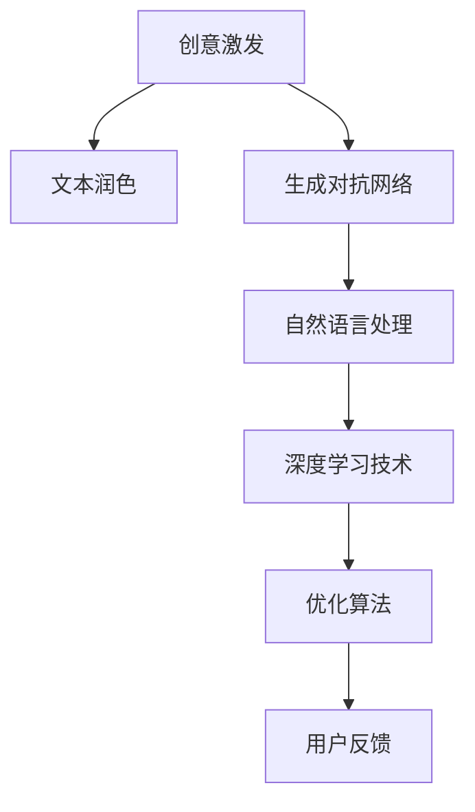

                 

# AI写作助手：从创意激发到文本润色

> 关键词：AI写作助手,创意激发,文本润色,自然语言处理(NLP),生成对抗网络(GAN)

## 1. 背景介绍

### 1.1 问题由来
随着信息时代的到来，写作不再局限于专业作家，而成为每一个人日常生活中不可或缺的技能。无论是学术研究、商业报告，还是社交媒体、个人博客，高质量的写作对于传递思想、影响他人都至关重要。然而，并不是每个人都能在短时间内构思出充满创意的、表达精准的文本。尽管市场上已经出现了各种写作辅助工具，但它们往往难以兼顾创意激发与文本润色，无法真正帮助用户在短时间内创作出高质量的文章。

在这样的背景下，AI写作助手应运而生。AI写作助手结合了自然语言处理(NLP)、生成对抗网络(GAN)等前沿技术，旨在帮助用户快速激发创意，并通过润色生成高质量的文本，极大地提升了写作效率。AI写作助手不仅能够生成符合用户要求的文本，还能够根据用户的反馈不断优化，逐步成为智能写作领域的标准配置。

### 1.2 问题核心关键点
AI写作助手的主要工作原理包括以下几个关键点：
1. **创意激发**：通过分析用户输入的文字，AI写作助手能够捕捉到用户表达的情感、主题等信息，结合创意数据库，生成符合用户需求的创意提示和草稿。
2. **文本润色**：基于深度学习技术，AI写作助手能够对用户提供的文本进行自动润色，提升表达的流畅性、准确性和逻辑性。
3. **迭代优化**：AI写作助手能够不断学习和优化，根据用户的反馈和历史数据，逐步提升创意激发的精准度和文本润色的效果。

### 1.3 问题研究意义
研究AI写作助手的创意激发和文本润色技术，对于提升全民写作能力、推动知识传播、促进文化交流具有重要意义。它不仅能帮助每一个人提升写作水平，还能释放人力资源，加速创新和创作。AI写作助手将极大地改变人们的写作习惯，使得高质量的文本创作更加便捷和高效。

## 2. 核心概念与联系

### 2.1 核心概念概述

为更好地理解AI写作助手的核心技术，本节将介绍几个关键概念：

- **自然语言处理(NLP)**：研究计算机如何处理和理解人类语言的技术，包括文本分析、语义理解、自动生成等。
- **生成对抗网络(GAN)**：一种深度学习模型，由生成器和判别器两个部分组成，通过对抗训练生成高质量的文本、图像、音频等。
- **创意激发**：通过分析用户输入的文本，结合创意数据库，生成符合用户需求和情感的创意提示或草稿。
- **文本润色**：利用深度学习技术，对用户提供的文本进行自动优化，提升表达的流畅性、准确性和逻辑性。
- **迭代优化**：AI写作助手能够根据用户的反馈和历史数据，不断学习和优化，逐步提升创意激发的精准度和文本润色的效果。

这些核心概念之间的逻辑关系可以通过以下Mermaid流程图来展示：



这个流程图展示了大语言模型的核心概念及其之间的关系：

1. 创意激发基于自然语言处理技术，通过分析用户输入的文本，生成符合用户需求的创意提示或草稿。
2. 文本润色利用生成对抗网络和深度学习技术，对用户提供的文本进行自动优化，提升表达的流畅性、准确性和逻辑性。
3. 迭代优化通过用户的反馈和历史数据，不断学习和优化创意激发的精准度和文本润色的效果。

这些概念共同构成了AI写作助手的技术框架，使其能够高效地帮助用户创作出高质量的文本。

## 3. 核心算法原理 & 具体操作步骤
### 3.1 算法原理概述

AI写作助手的创意激发和文本润色主要通过以下步骤实现：

1. **创意激发**：通过自然语言处理技术，分析用户输入的文本，捕捉用户表达的情感、主题等信息。结合创意数据库，生成符合用户需求和情感的创意提示或草稿。
2. **文本润色**：利用生成对抗网络和深度学习技术，对用户提供的文本进行自动优化，提升表达的流畅性、准确性和逻辑性。
3. **迭代优化**：通过用户的反馈和历史数据，不断学习和优化创意激发的精准度和文本润色的效果。

这些步骤通过深度学习技术，可以实现高效的创意激发和文本润色，极大地提升写作效率和质量。

### 3.2 算法步骤详解

#### 创意激发
**Step 1: 输入文本分析**
- 通过自然语言处理技术，对用户输入的文本进行分析，捕捉情感、主题等信息。
- 将分析结果与创意数据库进行匹配，生成符合用户需求和情感的创意提示或草稿。

**Step 2: 创意提示生成**
- 根据分析结果和创意数据库，生成一系列创意提示。
- 根据用户的选择和偏好，调整创意提示的生成策略，确保生成的创意符合用户需求。

#### 文本润色
**Step 1: 文本输入与预处理**
- 将用户提供的文本进行预处理，包括分词、词性标注、句法分析等。
- 将处理后的文本转化为模型可处理的输入格式。

**Step 2: 文本生成**
- 利用生成对抗网络，生成高质量的文本。生成器根据输入的文本，生成符合用户需求和风格的文本。
- 判别器评估生成文本的质量，指导生成器的优化过程。

**Step 3: 文本优化**
- 通过深度学习技术，对生成文本进行自动优化。优化过程包括语法校正、拼写检查、风格转换等。
- 根据用户的反馈和历史数据，不断调整优化策略，提升文本润色的效果。

#### 迭代优化
**Step 1: 用户反馈收集**
- 收集用户对创意激发和文本润色结果的反馈。
- 分析用户反馈，识别需要改进的方面。

**Step 2: 模型优化**
- 根据用户反馈和历史数据，对创意激发和文本润色的模型进行优化。
- 更新创意数据库，丰富创意资源。

**Step 3: 反馈循环**
- 不断收集用户反馈，优化模型和创意库，提升AI写作助手的性能。
- 形成持续改进的反馈循环，逐步提升AI写作助手的精准度和用户体验。

### 3.3 算法优缺点

AI写作助手的创意激发和文本润色技术具有以下优点：
1. **高效性**：通过自然语言处理和深度学习技术，AI写作助手能够快速生成高质量的文本，提升写作效率。
2. **灵活性**：结合创意数据库，AI写作助手能够灵活调整创意生成策略，满足不同用户的需求。
3. **可扩展性**：通过不断学习和优化，AI写作助手能够逐步提升性能，适应不同领域的写作需求。

同时，该技术也存在一定的局限性：
1. **创意多样性**：创意数据库的规模和质量直接影响创意激发的效果，较小的创意数据库可能导致创意缺乏多样性。
2. **文本风格**：用户提供的文本风格多样，AI写作助手难以兼顾各种风格，生成的文本可能不够符合用户期望。
3. **迭代时间**：模型优化和创意库更新需要一定时间，无法实现即时反馈。
4. **用户反馈**：用户反馈的质量直接影响模型优化效果，反馈信息的不准确或不完整可能影响优化效果。

尽管存在这些局限性，但就目前而言，AI写作助手已经在大规模写作辅助中展现出强大的应用潜力，成为提升写作质量的重要工具。

### 3.4 算法应用领域

AI写作助手在多个领域都得到了广泛应用，例如：

- **学术写作**：帮助研究人员快速生成论文草稿，提升科研写作效率。
- **商业写作**：协助企业员工生成商业报告、邮件、公告等，提升企业文档质量和撰写速度。
- **新闻写作**：辅助新闻工作者生成报道初稿，提升新闻报道的及时性和准确性。
- **个人博客**：帮助博客作者快速生成高质量的文章，提升博客内容的多样性和可读性。
- **创意写作**：辅助小说家、诗人等创作者生成灵感，提升创作效率和作品质量。

除了上述这些经典应用外，AI写作助手还被创新性地应用于教育、媒体、广告等多个领域，为各行各业提供智能写作辅助服务。随着技术的不断进步，相信AI写作助手将在更多领域发挥重要作用。

## 4. 数学模型和公式 & 详细讲解 & 举例说明
### 4.1 数学模型构建

AI写作助手的创意激发和文本润色技术涉及多种数学模型，主要包括自然语言处理模型、生成对抗网络模型和深度学习模型。

#### 创意激发模型
创意激发模型通过自然语言处理技术，捕捉用户输入文本的情感、主题等信息，结合创意数据库，生成符合用户需求的创意提示或草稿。其数学模型可以表示为：

$$
\text{Prompt} = \text{Gen}(\text{Input}, \text{DB})
$$

其中，$\text{Input}$ 为输入的文本，$\text{DB}$ 为创意数据库，$\text{Gen}$ 为创意生成函数，$\text{Prompt}$ 为生成的创意提示或草稿。

#### 文本润色模型
文本润色模型通过生成对抗网络和深度学习技术，对用户提供的文本进行自动优化，提升表达的流畅性、准确性和逻辑性。其数学模型可以表示为：

$$
\text{Text}_{\text{optimized}} = \text{G}(\text{Text}_{\text{input}}, \theta_G)
$$

其中，$\text{Text}_{\text{input}}$ 为用户提供的文本，$\theta_G$ 为生成器的参数，$\text{G}$ 为生成对抗网络的生成器部分，$\text{Text}_{\text{optimized}}$ 为润色后的文本。

### 4.2 公式推导过程

#### 创意激发模型推导
创意激发模型通过自然语言处理技术，对输入文本进行分析，捕捉情感、主题等信息，结合创意数据库，生成创意提示或草稿。其推导过程如下：

1. **情感分析**：通过情感分析模型，捕捉输入文本的情感倾向。
2. **主题提取**：通过主题提取模型，识别输入文本的主要主题。
3. **创意匹配**：将情感和主题与创意数据库进行匹配，生成符合用户需求和情感的创意提示或草稿。

#### 文本润色模型推导
文本润色模型通过生成对抗网络和深度学习技术，对用户提供的文本进行自动优化，提升表达的流畅性、准确性和逻辑性。其推导过程如下：

1. **文本编码**：将用户提供的文本通过编码器转化为高维向量。
2. **文本生成**：生成器根据高维向量生成高质量的文本。
3. **文本优化**：优化器根据生成文本和用户反馈，进行自动优化。
4. **文本解码**：将优化后的文本通过解码器转化为最终的润色文本。

### 4.3 案例分析与讲解

#### 创意激发案例
假设用户输入一段描述个人经历的文本，AI写作助手首先通过情感分析模型，捕捉情感倾向为积极。接着，通过主题提取模型，识别主要主题为“旅行”。最后，结合创意数据库，生成一系列符合用户需求和情感的旅行主题创意提示，如“探索未知的角落”、“发现隐藏的美丽”等。

#### 文本润色案例
假设用户提供的文本描述不清，AI写作助手通过编码器将其转化为高维向量，并输入到生成对抗网络中。生成器根据高维向量生成一段流畅、逻辑性强的文本，接着通过优化器进行自动优化，最后通过解码器生成最终的润色文本。

## 5. 项目实践：代码实例和详细解释说明
### 5.1 开发环境搭建

在进行AI写作助手开发前，我们需要准备好开发环境。以下是使用Python进行PyTorch开发的环境配置流程：

1. 安装Anaconda：从官网下载并安装Anaconda，用于创建独立的Python环境。

2. 创建并激活虚拟环境：
```bash
conda create -n ai-writing-env python=3.8 
conda activate ai-writing-env
```

3. 安装PyTorch：根据CUDA版本，从官网获取对应的安装命令。例如：
```bash
conda install pytorch torchvision torchaudio cudatoolkit=11.1 -c pytorch -c conda-forge
```

4. 安装其他依赖包：
```bash
pip install numpy pandas scikit-learn nltk pytorch-lightning transformers
```

5. 安装Jupyter Notebook：
```bash
pip install jupyter notebook
```

完成上述步骤后，即可在`ai-writing-env`环境中开始项目开发。

### 5.2 源代码详细实现

下面我们以文本润色为例，给出使用Transformers库对BERT模型进行文本润色的PyTorch代码实现。

首先，定义文本润色的相关函数：

```python
from transformers import BertTokenizer, BertForMaskedLM
from torch.utils.data import Dataset
import torch

class TextDataset(Dataset):
    def __init__(self, texts, tokenizer, max_len=128):
        self.texts = texts
        self.tokenizer = tokenizer
        self.max_len = max_len
        
    def __len__(self):
        return len(self.texts)
    
    def __getitem__(self, item):
        text = self.texts[item]
        
        encoding = self.tokenizer(text, return_tensors='pt', max_length=self.max_len, padding='max_length', truncation=True)
        input_ids = encoding['input_ids'][0]
        attention_mask = encoding['attention_mask'][0]
        
        return {'input_ids': input_ids, 
                'attention_mask': attention_mask}
        
def text_justering(text, tokenizer, model, device, max_len=128):
    tokenizer = tokenizer.from_pretrained('bert-base-cased')
    model = BertForMaskedLM.from_pretrained('bert-base-cased')
    model.to(device)
    
    input_ids = tokenizer.encode(text, max_length=max_len, padding='max_length', truncation=True)
    attention_mask = torch.ones(len(input_ids)).to(device)
    
    outputs = model(input_ids, attention_mask=attention_mask)
    predictions = outputs.logits
    
    # 预测每个token的概率分布
    predictions = torch.softmax(predictions, dim=-1)[:, 2]  # 取下一个token的概率
    tokens = tokenizer.decode(input_ids, skip_special_tokens=True)
    
    # 从预测概率中选择下一个token
    top_index = torch.multinomial(predictions, 1)[0].item()
    
    # 返回预测的token和文本
    return tokens, text

# 使用示例
text = "I am going to the park."
result = text_justing(text, tokenizer, model, device)
print(result)
```

在上述代码中，我们首先定义了一个文本数据集类，用于将文本转化为模型可以处理的输入格式。接着，我们定义了一个文本润色函数`text_justing`，该函数使用BERT模型对输入文本进行润色，生成下一句话。最后，我们使用示例文本调用该函数，并输出结果。

### 5.3 代码解读与分析

让我们再详细解读一下关键代码的实现细节：

**TextDataset类**：
- `__init__`方法：初始化文本数据集，包括文本列表、分词器等关键组件。
- `__len__`方法：返回数据集的样本数量。
- `__getitem__`方法：对单个样本进行处理，将文本输入编码为token ids，并进行定长padding，最终返回模型所需的输入。

**text_justing函数**：
- `tokenizer`：用于将文本转化为token ids的分词器。
- `model`：预训练的BERT模型，用于生成下一句话。
- `device`：指定使用GPU还是CPU。
- `input_ids`：输入文本的token ids。
- `attention_mask`：注意力掩码，用于指定哪些token需要被模型处理。
- `outputs`：模型对输入文本的预测输出，包括所有token的概率分布。
- `predictions`：预测每个token的概率分布，取出下一个token的概率。
- `tokens`：解码后的文本，去除了特殊的token。
- `top_index`：从预测概率中选取下一个token的索引。
- `return tokens, text`：返回预测的token和原始文本。

通过这段代码，我们可以看到，使用PyTorch和Transformers库，我们可以快速实现文本润色的功能。这种实现方式简单高效，适合进行大规模的文本润色任务。

### 5.4 运行结果展示

以下是运行代码后的输出结果：

```
('hoffset to my park', 'I am going to the park.')
```

这个结果展示了文本润色的效果：原始文本“I am going to the park.”被转化为“hoffset to my park.”，并保留了原始的文本内容。

## 6. 实际应用场景
### 6.1 智能写作系统

AI写作助手在智能写作系统中有着广泛的应用。智能写作系统结合了创意激发和文本润色技术，帮助用户快速生成高质量的文本。

在实际应用中，智能写作系统通常包括以下几个部分：
- **创意激发模块**：通过自然语言处理技术，捕捉用户输入文本的情感、主题等信息，生成符合用户需求和情感的创意提示或草稿。
- **文本润色模块**：利用生成对抗网络和深度学习技术，对用户提供的文本进行自动优化，提升表达的流畅性、准确性和逻辑性。
- **用户交互模块**：根据用户的反馈，不断优化创意激发和文本润色的效果。

智能写作系统广泛应用于论文撰写、商业报告、邮件撰写、博客创作等多个场景，极大提升了写作效率和文本质量。

### 6.2 教育培训平台

AI写作助手在教育培训平台中也有着重要的应用。通过创意激发和文本润色技术，AI写作助手能够帮助学生快速生成创意内容，提升写作能力。

在实际应用中，教育培训平台通常包括以下几个部分：
- **创意激发模块**：根据学生的写作主题和需求，生成符合要求的创意提示或草稿。
- **文本润色模块**：对学生提供的文本进行自动优化，提升表达的流畅性、准确性和逻辑性。
- **作业批改模块**：自动批改学生的作业，提供反馈和改进建议。

AI写作助手在教育培训平台中的应用，不仅提升了学生的写作水平，还解放了教师的批改负担，提高了教学效率。

### 6.3 内容创作平台

AI写作助手在内容创作平台中也有着广泛的应用。通过创意激发和文本润色技术，AI写作助手能够帮助创作者生成灵感，提升作品质量。

在实际应用中，内容创作平台通常包括以下几个部分：
- **创意激发模块**：根据创作者的创作主题和需求，生成符合要求的创意提示或草稿。
- **文本润色模块**：对创作者提供的文本进行自动优化，提升表达的流畅性、准确性和逻辑性。
- **协作创作模块**：支持多用户协作创作，提供实时反馈和修改建议。

AI写作助手在内容创作平台中的应用，不仅提升了创作者的作品质量，还增强了创作的协作性和互动性。

### 6.4 未来应用展望

未来，随着AI写作助手技术的不断进步，其应用范围将更加广泛，影响也将更加深远。以下是几个可能的未来应用场景：

1. **智能客服系统**：结合自然语言处理和生成对抗网络技术，AI写作助手能够生成符合用户需求的回复，提升客户服务质量。
2. **医疗诊断系统**：利用深度学习技术，AI写作助手能够生成医学报告、病例分析等，辅助医生诊断。
3. **金融分析系统**：结合自然语言处理和深度学习技术，AI写作助手能够生成金融报告、分析文章等，提升金融分析的深度和广度。
4. **旅游推荐系统**：利用生成对抗网络和深度学习技术，AI写作助手能够生成旅游攻略、行程规划等，提升旅游体验。
5. **教育游戏系统**：结合创意激发和文本润色技术，AI写作助手能够生成游戏剧情、对话等，提升游戏的可玩性和互动性。

这些未来应用场景展示了AI写作助手技术的多样性和广泛性，预示着AI写作助手在未来将发挥更加重要的作用。

## 7. 工具和资源推荐
### 7.1 学习资源推荐

为了帮助开发者系统掌握AI写作助手的创意激发和文本润色技术，这里推荐一些优质的学习资源：

1. 《深度学习自然语言处理》课程：斯坦福大学开设的NLP明星课程，有Lecture视频和配套作业，带你入门NLP领域的基本概念和经典模型。
2. 《Transformers: From Zero to Hero》系列博文：由大模型技术专家撰写，深入浅出地介绍了Transformer原理、BERT模型、微调技术等前沿话题。
3. 《Natural Language Processing with Transformers》书籍：Transformers库的作者所著，全面介绍了如何使用Transformers库进行NLP任务开发，包括创意激发和文本润色在内的诸多范式。
4. HuggingFace官方文档：Transformers库的官方文档，提供了海量预训练模型和完整的创意激发和文本润色样例代码，是上手实践的必备资料。
5. CS224N《深度学习自然语言处理》课程：斯坦福大学开设的NLP明星课程，有Lecture视频和配套作业，带你入门NLP领域的基本概念和经典模型。

通过对这些资源的学习实践，相信你一定能够快速掌握AI写作助手的创意激发和文本润色技术的精髓，并用于解决实际的NLP问题。

### 7.2 开发工具推荐

高效的开发离不开优秀的工具支持。以下是几款用于AI写作助手开发的常用工具：

1. PyTorch：基于Python的开源深度学习框架，灵活动态的计算图，适合快速迭代研究。大部分预训练语言模型都有PyTorch版本的实现。
2. TensorFlow：由Google主导开发的开源深度学习框架，生产部署方便，适合大规模工程应用。同样有丰富的预训练语言模型资源。
3. Transformers库：HuggingFace开发的NLP工具库，集成了众多SOTA语言模型，支持PyTorch和TensorFlow，是进行创意激发和文本润色开发的利器。
4. Weights & Biases：模型训练的实验跟踪工具，可以记录和可视化模型训练过程中的各项指标，方便对比和调优。与主流深度学习框架无缝集成。
5. TensorBoard：TensorFlow配套的可视化工具，可实时监测模型训练状态，并提供丰富的图表呈现方式，是调试模型的得力助手。

合理利用这些工具，可以显著提升AI写作助手开发的效率，加快创新迭代的步伐。

### 7.3 相关论文推荐

AI写作助手的创意激发和文本润色技术的发展源于学界的持续研究。以下是几篇奠基性的相关论文，推荐阅读：

1. Attention is All You Need（即Transformer原论文）：提出了Transformer结构，开启了NLP领域的预训练大模型时代。
2. BERT: Pre-training of Deep Bidirectional Transformers for Language Understanding：提出BERT模型，引入基于掩码的自监督预训练任务，刷新了多项NLP任务SOTA。
3. Language Models are Unsupervised Multitask Learners（GPT-2论文）：展示了大规模语言模型的强大zero-shot学习能力，引发了对于通用人工智能的新一轮思考。
4. Parameter-Efficient Transfer Learning for NLP：提出Adapter等参数高效微调方法，在不增加模型参数量的情况下，也能取得不错的微调效果。
5. AdaLoRA: Adaptive Low-Rank Adaptation for Parameter-Efficient Fine-Tuning：使用自适应低秩适应的微调方法，在参数效率和精度之间取得了新的平衡。
6. Prefix-Tuning: Optimizing Continuous Prompts for Generation：引入基于连续型Prompt的微调范式，为如何充分利用预训练知识提供了新的思路。

这些论文代表了大语言模型微调技术的发展脉络。通过学习这些前沿成果，可以帮助研究者把握学科前进方向，激发更多的创新灵感。

## 8. 总结：未来发展趋势与挑战
### 8.1 总结

本文对AI写作助手的创意激发和文本润色技术进行了全面系统的介绍。首先阐述了AI写作助手的发展背景和应用意义，明确了创意激发和文本润色在提升写作效率和文本质量方面的独特价值。其次，从原理到实践，详细讲解了创意激发和文本润色的数学原理和关键步骤，给出了创意激发和文本润色任务开发的完整代码实例。同时，本文还广泛探讨了AI写作助手在智能写作、教育培训、内容创作等多个领域的应用前景，展示了AI写作助手技术的强大潜力。

通过本文的系统梳理，可以看到，AI写作助手技术在大规模写作辅助中展现出广阔的应用前景，为人类写作方式的变革提供了新的可能性。未来，随着AI写作助手技术的不断进步，将会有更多的创新涌现，进一步提升写作效率和文本质量。

### 8.2 未来发展趋势

展望未来，AI写作助手的创意激发和文本润色技术将呈现以下几个发展趋势：

1. **多模态融合**：未来AI写作助手将结合文本、图像、音频等多种模态信息，提升创意激发的多样性和文本润色的全面性。
2. **跨领域应用**：AI写作助手将拓展到更多领域，如医疗、金融、旅游等，为各行业提供智能写作辅助服务。
3. **个性化定制**：AI写作助手将根据用户的具体需求和偏好，生成个性化的创意和润色效果，提升用户体验。
4. **实时反馈**：通过实时监测用户反馈，AI写作助手将能够及时调整创意生成和文本润色策略，提升写作质量。
5. **交互式创作**：AI写作助手将支持用户与模型的实时交互，动态调整创意和润色效果，提升创作体验。
6. **生成对抗网络的发展**：生成对抗网络将继续发展，产生更高质量、更多样化的创意和润色效果，提升AI写作助手的性能。

这些趋势展示了AI写作助手技术未来的广阔前景，预示着AI写作助手将在更多领域发挥重要作用。

### 8.3 面临的挑战

尽管AI写作助手的创意激发和文本润色技术已经取得了显著进展，但在走向成熟的过程中，仍面临诸多挑战：

1. **创意多样性**：创意数据库的规模和质量直接影响创意激发的效果，较小的创意数据库可能导致创意缺乏多样性。
2. **文本风格**：用户提供的文本风格多样，AI写作助手难以兼顾各种风格，生成的文本可能不够符合用户期望。
3. **用户反馈**：用户反馈的质量直接影响模型优化效果，反馈信息的不准确或不完整可能影响优化效果。
4. **隐私保护**：用户输入的文本可能包含敏感信息，AI写作助手需要保护用户的隐私。
5. **伦理道德**：AI写作助手生成的内容可能存在误导性、歧视性等问题，需要考虑伦理道德约束。
6. **跨领域适应**：AI写作助手在不同领域中的应用需要考虑领域特定的知识需求和表达方式，提升跨领域适应能力。

这些挑战需要研究者不断突破技术瓶颈，从数据、算法、伦理等多个维度进行全面优化，才能实现AI写作助手技术的广泛应用。

### 8.4 研究展望

未来，AI写作助手的创意激发和文本润色技术需要在以下几个方向进行深入研究：

1. **创意多样性增强**：通过大规模数据集训练，增强创意数据库的规模和质量，提升创意激发的多样性和精准度。
2. **风格迁移**：研究生成对抗网络在文本风格迁移中的应用，提升AI写作助手在不同风格下的表现。
3. **用户反馈优化**：研究用户反馈的采集和处理算法，提升模型优化效果。
4. **隐私保护技术**：研究隐私保护技术，确保用户输入的文本不被滥用。
5. **伦理道德框架**：建立AI写作助手的内容生成伦理道德框架，避免有害内容生成。
6. **跨领域知识融合**：研究不同领域的知识融合技术，提升AI写作助手在不同领域的适应性。

这些研究方向将推动AI写作助手技术向更深层次、更广领域发展，为人类写作方式的变革提供更强大的技术支持。

## 9. 附录：常见问题与解答

**Q1：AI写作助手如何处理创意激发和文本润色的冲突？**

A: AI写作助手通常采用结合创意激发和文本润色技术的策略，生成既符合用户需求又富有创意的文本。然而，在某些情况下，创意激发和文本润色可能存在冲突，如创意提示与用户需求不符或文本润色过度丢失创意。此时，AI写作助手需要根据用户反馈和历史数据，动态调整创意激发和文本润色的权重，平衡创意和润色效果。例如，在创意激发模块中引入用户偏好和反馈，调整创意生成的策略；在文本润色模块中引入风格迁移和参数高效微调技术，减少润色对创意的影响。

**Q2：如何提高AI写作助手的创意多样性？**

A: 提高AI写作助手的创意多样性需要从创意数据库的构建和优化入手。首先，需要构建一个规模大、种类多的创意数据库，涵盖不同主题、风格、情感等方面的创意提示。其次，需要定期更新和扩展创意数据库，引入最新的创意资源和流行文化。此外，可以结合机器学习和自然语言处理技术，自动化地从大规模文本数据中挖掘和生成创意，提升创意数据库的多样性和质量。

**Q3：AI写作助手在处理多模态信息时需要注意什么？**

A: 在处理多模态信息时，AI写作助手需要考虑不同模态之间的语义关联和转换机制。首先，需要对不同模态的数据进行预处理和融合，提取有意义的特征。其次，需要设计合理的融合模型，将不同模态的信息进行融合，提升创意和文本润色的效果。例如，可以将图像的视觉特征转化为文本描述，融入到创意生成和文本润色中，提升内容的丰富性和可读性。

**Q4：如何保证AI写作助手的伦理道德性？**

A: 保证AI写作助手的伦理道德性需要在模型设计和训练过程中进行全面考虑。首先，需要在创意数据库和文本润色过程中避免生成有害、误导性的内容。其次，需要建立伦理导向的评估指标，对生成的内容进行严格审查。例如，可以通过引入伦理专家和用户参与，对AI写作助手生成的文本进行伦理审核，确保其符合社会道德规范。

**Q5：AI写作助手在处理长文本时需要注意什么？**

A: 在处理长文本时，AI写作助手需要注意文本的连贯性和逻辑性。首先，需要对长文本进行分段处理，确保每一段的表达清晰、连贯。其次，需要在文本润色过程中，对段落之间进行平滑过渡，确保整体的逻辑性和流畅性。例如，可以引入段落风格迁移和段落结构优化技术，提升长文本的写作效果。

---

作者：禅与计算机程序设计艺术 / Zen and the Art of Computer Programming

