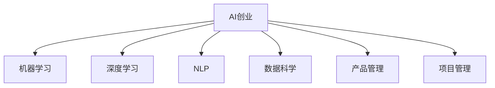

                 

# AI创业的人才培养：Lepton AI的教育计划

在人工智能(AI)领域，创业成功的关键在于拥有顶级技术和优秀的人才。Lepton AI的教育计划，正是为了培养具备AI创业能力的人才而设计的。本文将从背景介绍、核心概念与联系、核心算法原理、数学模型、项目实践、应用场景、工具和资源推荐、总结与发展展望等方面，全面阐述Lepton AI的教育计划，为有志于AI创业的年轻人才提供一份完整的指南。

## 1. 背景介绍

### 1.1 问题由来

人工智能技术正以迅猛的速度改变着各行各业，带来前所未有的机遇与挑战。然而，随着AI创业公司的不断涌现，高质量AI人才的需求也在急剧上升。传统的高校教育和职场培训已经难以满足当前AI创业的需求，如何培养出既具备深厚技术背景又具有创业精神的AI人才，成为了一个亟待解决的问题。

### 1.2 问题核心关键点

AI创业需要具备以下关键能力：
- 技术能力：掌握机器学习、深度学习、自然语言处理等核心技术。
- 数据处理：具备数据收集、清洗、分析的能力。
- 产品设计：理解用户需求，具备构建可落地产品的能力。
- 项目管理：能够有效管理团队，协调资源，保证项目按时交付。
- 商业洞察：具备市场分析能力，能够找到商业模式和盈利模式。
- 创业精神：有冒险精神和创新意识，能够面对不确定性和挑战。

## 2. 核心概念与联系

### 2.1 核心概念概述

为了更好地理解Lepton AI的教育计划，首先需要明确一些核心概念：

- **AI创业**：利用AI技术开展创业活动，解决实际问题，实现商业价值。
- **机器学习**：通过算法和统计学方法，让计算机从数据中学习规律，进行预测和决策。
- **深度学习**：基于神经网络架构的机器学习，通过多层次的特征提取和抽象，解决复杂问题。
- **自然语言处理(NLP)**：让计算机理解和处理自然语言，实现文本分析、语音识别等任务。
- **数据科学**：涵盖数据收集、清洗、分析和建模，是AI创业中不可或缺的一部分。
- **产品管理**：从需求分析到产品迭代的全流程管理，确保产品与市场需求一致。
- **项目管理**：通过计划、执行、监控和控制，保证项目按时、按质、按量完成。

这些核心概念之间的逻辑关系可以通过以下Mermaid流程图来展示：



这个流程图展示了AI创业所需的各项核心能力，以及它们之间的相互关系。

## 3. 核心算法原理 & 具体操作步骤

### 3.1 算法原理概述

Lepton AI的教育计划，旨在通过系统的课程设计，使学员掌握AI创业所需的各项核心技术和能力。教育计划包括以下几个关键步骤：

1. **基础课程**：介绍机器学习、深度学习、NLP等核心技术，培养学员的技术能力。
2. **项目实践**：通过实际项目，使学员掌握数据处理、产品设计和项目管理等实战技能。
3. **商业洞察**：引导学员理解市场分析、商业模式设计等商业逻辑，培养创业精神。
4. **模拟创业**：通过模拟创业环境，让学员体验创业过程，提升实战经验。
5. **导师辅导**：提供专业的导师辅导，帮助学员解决学习过程中遇到的问题，指导项目开发。

### 3.2 算法步骤详解

以下是Lepton AI教育计划的具体操作步骤：

**Step 1: 基础课程学习**
- 通过线上和线下相结合的方式，为学员提供机器学习、深度学习、NLP等核心技术的系统学习。
- 开设项目实战课程，通过具体的项目任务，帮助学员掌握数据处理、模型训练和评估等实战技能。

**Step 2: 项目实践**
- 在导师的指导下，学员需完成至少两个实际项目，涵盖数据预处理、模型训练、产品设计等多个环节。
- 每个项目需经过需求分析、设计方案、编码实现、测试优化等多个阶段，全方位锻炼学员的实战能力。

**Step 3: 商业洞察**
- 邀请行业专家，为学员讲解市场分析、商业模式设计等商业逻辑。
- 引导学员从产品需求、市场定位、盈利模式等多个维度，思考AI创业的商业机会。

**Step 4: 模拟创业**
- 通过模拟创业环境，让学员体验创业过程，了解创业公司的运营和管理。
- 模拟项目需包括产品原型设计、市场调研、商业模式验证等多个环节，使学员全面掌握创业技能。

**Step 5: 导师辅导**
- 提供专业的导师团队，帮助学员解决学习过程中遇到的技术、商业、管理等问题。
- 导师团队由业界资深AI专家组成，具备丰富的实战经验和行业洞察。

### 3.3 算法优缺点

Lepton AI的教育计划具有以下优点：
1. 系统全面：涵盖AI创业所需的各项核心技术和能力。
2. 实战导向：通过实际项目，提升学员的实战能力。
3. 导师辅导：提供专业的导师支持，解决学习过程中的问题。
4. 多维度培养：包括技术、商业、管理等多个维度的全面培养。

同时，该计划也存在一定的局限性：
1. 学习周期较长：需要系统学习多个核心技术，并完成实际项目，时间成本较高。
2. 师资资源有限：顶级导师资源有限，无法满足所有学员的需求。
3. 实际项目难度较大：项目设计和实施过程复杂，可能面临技术和管理上的挑战。

尽管存在这些局限性，但Lepton AI的教育计划仍然是目前市场上最全面、最实战的AI创业人才培养方案之一。

### 3.4 算法应用领域

Lepton AI的教育计划，不仅适用于AI创业公司，还适用于希望在AI领域发展的人才。以下是一些具体的应用场景：

- **初创公司**：为AI创业公司培养具备核心技术和创业精神的优秀人才。
- **技术团队**：为技术团队中的AI专家提供系统化的商业和管理培训，提升团队综合能力。
- **职业转型**：为希望转型到AI领域的资深从业者提供全面的课程设计，帮助他们快速上手。
- **高校学生**：为高校学生提供AI创业的启蒙课程，激发他们的创新思维和创业精神。

## 4. 数学模型和公式 & 详细讲解 & 举例说明（备注：数学公式请使用latex格式，latex嵌入文中独立段落使用 $$，段落内使用 $)
### 4.1 数学模型构建

Lepton AI的教育计划，不仅关注技术能力的培养，还注重实战能力的提升。因此，在数学模型的构建上，强调应用导向和实践意义。

以机器学习中的线性回归模型为例，其数学模型为：

$$ y = \theta_0 + \theta_1x_1 + \theta_2x_2 + \cdots + \theta_nx_n $$

其中，$y$为预测值，$\theta_0, \theta_1, \theta_2, \cdots, \theta_n$为模型参数，$x_1, x_2, \cdots, x_n$为输入特征。

### 4.2 公式推导过程

线性回归模型的推导过程如下：

1. 定义误差函数：
$$ J(\theta) = \frac{1}{2m} \sum_{i=1}^m (y_i - \theta_0 - \theta_1x_{i1} - \theta_2x_{i2} - \cdots - \theta_nx_{in})^2 $$

2. 求解误差最小化问题：
$$ \min_{\theta} J(\theta) $$

3. 利用梯度下降法求解最优参数：
$$ \theta = \theta - \alpha \frac{1}{m} \sum_{i=1}^m (y_i - \theta_0 - \theta_1x_{i1} - \theta_2x_{i2} - \cdots - \theta_nx_{in})x_i $$

其中，$\alpha$为学习率，$m$为样本数量。

### 4.3 案例分析与讲解

线性回归模型在机器学习中应用广泛，可用于房价预测、股票价格预测等场景。通过线性回归模型的推导和应用，可以帮助学员理解机器学习的核心思想和方法。

## 5. 项目实践：代码实例和详细解释说明
### 5.1 开发环境搭建

Lepton AI的教育计划，采用Python和TensorFlow作为主要开发环境。以下是开发环境搭建的步骤：

1. 安装Python：下载Python 3.x版本，并配置环境变量。
2. 安装TensorFlow：通过pip安装TensorFlow，确保安装最新版本。
3. 安装数据处理工具：安装Pandas、Numpy等数据处理库。
4. 安装可视化工具：安装Matplotlib、Seaborn等可视化库。
5. 安装项目模板：下载Lepton AI提供的数据集和项目模板，并放置在本地仓库中。

### 5.2 源代码详细实现

以下是一个简单的线性回归模型实现代码：

```python
import tensorflow as tf
import numpy as np
import matplotlib.pyplot as plt

# 准备数据
x = np.array([[1, 2], [2, 4], [3, 6], [4, 8], [5, 10]])
y = np.array([2, 4, 6, 8, 10])

# 定义模型
model = tf.keras.Sequential([
    tf.keras.layers.Dense(units=1, input_shape=[2])
])

# 编译模型
model.compile(optimizer=tf.keras.optimizers.SGD(learning_rate=0.01), loss='mse')

# 训练模型
model.fit(x, y, epochs=100)

# 预测数据
x_test = np.array([[6, 12]])
y_pred = model.predict(x_test)
print(y_pred)

# 可视化结果
plt.scatter(x[:, 0], x[:, 1])
plt.plot(x[:, 0], y_pred, color='red')
plt.show()
```

### 5.3 代码解读与分析

上述代码实现了线性回归模型，并进行了数据可视化。以下是对关键代码的解读：

1. 数据准备：使用NumPy库生成训练数据$x$和目标变量$y$。
2. 模型定义：使用Keras搭建一个包含一个全连接层的神经网络模型。
3. 模型编译：设置优化器、损失函数等参数。
4. 模型训练：使用fit方法训练模型，设置迭代次数为100。
5. 模型预测：使用predict方法对测试数据进行预测，并输出预测结果。
6. 结果可视化：使用Matplotlib库将训练数据和预测结果可视化。

### 5.4 运行结果展示

运行上述代码，可以看到训练过程中损失函数的变化趋势，以及预测结果的可视化图。


## 6. 实际应用场景

### 6.1 初创公司的人才培养

Lepton AI的教育计划，可以帮助初创公司快速培养具备核心技术和创业精神的AI人才。以下是具体的应用场景：

1. **招聘和培训**：初创公司可以通过Lepton AI的教育计划，筛选出具备潜力的应聘者，并通过系统的培训课程，提升他们的技术和管理能力。
2. **项目开发**：在实际项目中，Lepton AI的导师团队可以为初创公司提供技术支持和指导，帮助公司快速开发出高质量的AI产品。
3. **市场拓展**：Lepton AI的教育计划，还涵盖市场分析和商业模式设计等商业内容，帮助初创公司更好地拓展市场，寻找商业机会。

### 6.2 技术团队的能力提升

Lepton AI的教育计划，还可以用于技术团队的能力提升，提高团队的综合实力。以下是具体的应用场景：

1. **技术分享**：通过Lepton AI的教育计划，技术团队可以共同学习新的AI技术和方法，提升整体技术水平。
2. **项目协作**：在实际项目中，Lepton AI的导师团队可以为技术团队提供技术指导和支持，确保项目按时、按质、按量完成。
3. **创新思维**：Lepton AI的教育计划，还涵盖商业和管理等内容，帮助技术团队开拓创新思维，寻找新的商业机会。

### 6.3 职业转型的全面培训

Lepton AI的教育计划，还可以用于职业转型的全面培训，帮助从业者快速适应新的AI领域。以下是具体的应用场景：

1. **基础培训**：Lepton AI的教育计划，涵盖机器学习、深度学习、NLP等核心技术，帮助从业者快速掌握AI基础。
2. **项目实践**：通过实际的AI项目，帮助从业者积累实战经验，提升技术能力。
3. **商业洞察**：Lepton AI的教育计划，还涵盖市场分析、商业模式设计等内容，帮助从业者全面了解AI创业的商业环境。

## 7. 工具和资源推荐
### 7.1 学习资源推荐

为了帮助学员系统掌握Lepton AI的教育计划，以下是一些优质的学习资源：

1. **《机器学习实战》**：吴恩达教授的Coursera课程，涵盖机器学习核心技术和实战案例。
2. **《深度学习》**：Ian Goodfellow的经典教材，系统介绍深度学习的理论和方法。
3. **《自然语言处理综论》**：Daniel Jurafsky的教材，涵盖NLP核心技术和应用。
4. **Lepton AI在线课程**：提供系统的AI创业课程，包括技术、商业、管理等多个维度。
5. **Kaggle平台**：提供丰富的数据集和竞赛项目，帮助学员提升数据处理和模型训练能力。

### 7.2 开发工具推荐

以下是一些Lepton AI推荐使用的开发工具：

1. **Python**：Python是AI领域的主要编程语言，具备丰富的科学计算库和机器学习库。
2. **TensorFlow**：由Google开发的深度学习框架，支持分布式计算和大规模模型训练。
3. **Keras**：基于TensorFlow的高级API，简化模型定义和训练过程。
4. **PyTorch**：Facebook开发的深度学习框架，支持动态图和静态图。
5. **Jupyter Notebook**：用于数据分析和模型训练的交互式开发环境。

### 7.3 相关论文推荐

Lepton AI的教育计划，旨在培养具备AI创业能力的优秀人才，以下是几篇相关论文，推荐阅读：

1. **《AI创业：从0到1》**：介绍AI创业的基本概念和核心技术。
2. **《AI产品管理》**：讲解AI产品从需求分析到上线运营的全流程管理。
3. **《AI创业成功案例》**：分析AI创业成功企业的经验和教训。
4. **《AI商业模型设计》**：探讨AI创业公司的盈利模式和商业模式。

## 8. 总结：未来发展趋势与挑战

### 8.1 研究成果总结

Lepton AI的教育计划，为AI创业公司培养了大量具备核心技术和创业精神的优秀人才，推动了AI技术的广泛应用。教育计划的系统性和实战性，得到了业界的广泛认可和好评。

### 8.2 未来发展趋势

未来，Lepton AI的教育计划将呈现以下几个发展趋势：

1. **技术迭代**：随着AI技术的不断进步，Lepton AI的教育计划将持续更新，涵盖最新的AI技术和方法。
2. **全球扩展**：Lepton AI的教育计划将逐步拓展到国际市场，帮助全球AI创业者提升技术和管理能力。
3. **跨学科融合**：Lepton AI的教育计划将进一步融合其他学科，如数据科学、商业管理等，提升AI创业的综合能力。
4. **虚拟现实应用**：Lepton AI的教育计划将引入虚拟现实技术，提升学员的沉浸式学习体验。
5. **人工智能普及**：随着AI技术的普及，Lepton AI的教育计划将更好地服务于大众，提升全民AI素养。

### 8.3 面临的挑战

尽管Lepton AI的教育计划取得了显著成效，但在实际应用中，仍面临以下挑战：

1. **师资队伍建设**：高质量的师资队伍是教育计划的核心，但目前师资资源有限，难以满足所有学员的需求。
2. **课程内容更新**：AI技术发展迅速，需要不断更新课程内容，保持教学内容的先进性和前沿性。
3. **学员基础参差不齐**：学员的基础知识和技术水平存在差异，需要设计适应不同基础的课程内容。
4. **成本控制**：高质量的教育计划需要投入大量资源，如何在保证教学质量的同时，控制成本是一个重要问题。
5. **全球化适应性**：将教育计划推广到全球市场，需要考虑不同国家和地区的文化和语言差异。

### 8.4 研究展望

面对这些挑战，Lepton AI的教育计划需要不断优化和改进，未来可以考虑以下研究方向：

1. **在线教育平台**：开发高质量的在线教育平台，提升教育资源的可及性和覆盖范围。
2. **本地化定制**：针对不同国家和地区的文化特点，设计本地化的课程内容和教学方式。
3. **开放式协作**：与高校、企业、社区等机构合作，共同开发和推广教育计划。
4. **人工智能辅助**：引入AI技术，如自然语言处理、计算机视觉等，提升教育计划的智能化水平。
5. **虚拟现实应用**：利用虚拟现实技术，提供沉浸式的学习体验，提升学员的互动和学习效果。

## 9. 附录：常见问题与解答

### Q1: 如何申请Lepton AI的教育计划？

A: 可以通过Lepton AI的官方网站进行在线申请，填写个人信息和申请理由，提交申请材料，等待审核通过。

### Q2: 教育计划的费用是多少？

A: Lepton AI的教育计划根据不同的课程内容和学习方式，有不同的收费标准。具体费用请咨询Lepton AI官方客服。

### Q3: 教育计划的学习周期是多长？

A: Lepton AI的教育计划根据不同的课程内容，学习周期从数周到数月不等。具体时间请参考课程安排。

### Q4: 教育计划是否提供在线支持？

A: Lepton AI的教育计划提供在线支持，包括课程答疑、技术支持、导师辅导等，学员可以在任何时间进行咨询。

### Q5: 教育计划是否提供证书？

A: Lepton AI的教育计划完成后，学员可以获得官方认证的证书，作为其AI创业能力的证明。

---

作者：禅与计算机程序设计艺术 / Zen and the Art of Computer Programming

