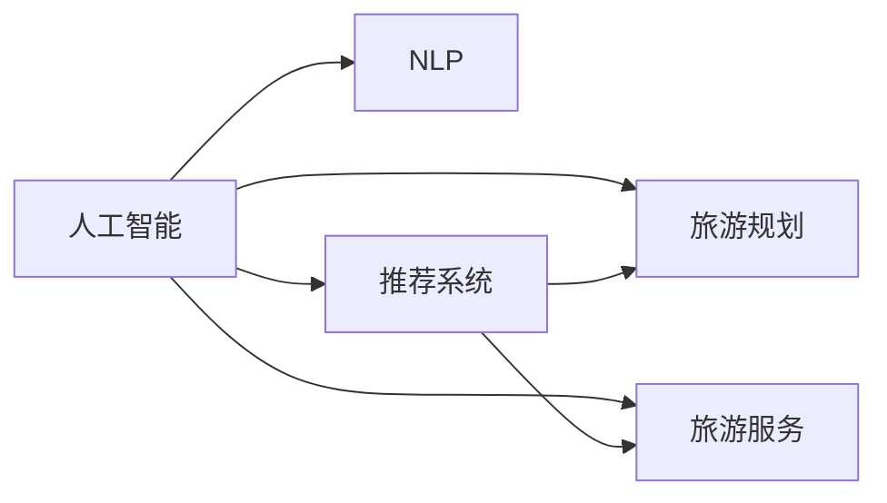

                 

# AI在个性化旅游规划中的应用：定制旅行体验

> 关键词：人工智能, 个性化旅游, 推荐系统, 旅游规划, 旅游服务, 自然语言处理, 机器学习

## 1. 背景介绍

随着人们生活水平的提高和旅游需求的日益增长，旅游行业正朝着个性化、定制化的方向发展。传统的旅游规划方式往往无法满足个性化需求，旅行者往往需要花费大量时间和精力寻找合适的旅游产品和服务。而人工智能（AI）技术的引入，为个性化旅游规划带来了新的可能性。

AI技术结合自然语言处理（NLP）、机器学习（ML）和推荐系统等技术手段，可以实时处理海量旅游数据，理解旅行者的偏好，为其提供定制化的旅游建议和规划服务。这种模式不仅能够提升旅行者的满意度，还能推动旅游业的可持续发展。

## 2. 核心概念与联系

### 2.1 核心概念概述

为了更好地理解AI在个性化旅游规划中的应用，我们先梳理几个核心概念及其相互关系：

1. **人工智能（AI）**：通过模拟人脑的推理、学习、认知等过程，使机器能够自主完成各种复杂任务的技术。
2. **自然语言处理（NLP）**：使计算机能够理解、解释和生成人类语言的技术。
3. **推荐系统**：根据用户的历史行为和偏好，自动推荐个性化产品或服务的技术。
4. **旅游规划**：根据旅行者的需求和预算，安排行程、预定酒店、机票等服务的过程。
5. **旅游服务**：为旅行者提供旅游产品、咨询、预订等服务。
6. **机器学习（ML）**：使计算机能够通过数据学习并优化模型，以提高决策质量的技术。

这些概念之间的关系可以用以下Mermaid流程图来展示：



其中，A节点代表人工智能技术，B节点代表自然语言处理技术，C节点代表推荐系统，D节点代表旅游规划，E节点代表旅游服务。

### 2.2 核心概念原理和架构

#### 2.2.1 自然语言处理（NLP）

NLP的核心任务是让计算机理解和处理人类语言。NLP的流程包括语言模型、词向量表示、句法分析、语义分析和实体识别等步骤。

##### 语言模型
语言模型是通过统计语言数据，预测句子或文本出现的概率，从而理解语言的语义结构。

##### 词向量表示
词向量是将单词映射为向量空间中的点，通过向量空间距离计算单词之间的语义相似性。

##### 句法分析
句法分析包括分词、词性标注、句法树等，帮助计算机理解句子的语法结构。

##### 语义分析
语义分析包括命名实体识别、情感分析、主题模型等，帮助计算机理解文本的深层语义。

#### 2.2.2 推荐系统

推荐系统的目标是根据用户的历史行为和偏好，自动推荐个性化产品或服务。其核心算法包括协同过滤、内容推荐、深度学习等。

##### 协同过滤
协同过滤是通过分析用户之间的相似性，推荐相似用户喜欢的产品。

##### 内容推荐
内容推荐是基于产品的标签和用户兴趣，推荐与用户喜好相似的产品。

##### 深度学习
深度学习通过神经网络模型，挖掘用户行为和产品特征之间的复杂关系，实现更加精准的推荐。

#### 2.2.3 旅游规划

旅游规划是根据旅行者的需求和预算，安排行程、预定酒店、机票等服务的过程。

##### 行程安排
行程安排包括目的地选择、游览顺序、游览时间、交通工具等规划。

##### 酒店预定
酒店预定包括选择酒店、价格比较、预订确认等服务。

##### 机票预定
机票预定包括选择航班、价格比较、预订确认等服务。

#### 2.2.4 旅游服务

旅游服务为旅行者提供旅游产品、咨询、预订等服务。

##### 产品推荐
旅游服务通过推荐系统，为旅行者推荐旅游产品，如景点、餐厅、酒店等。

##### 在线咨询
旅游服务提供在线客服，解答旅行者的各种疑问。

##### 预订服务
旅游服务提供在线预订服务，方便旅行者快速预定旅游产品。

## 3. 核心算法原理 & 具体操作步骤

### 3.1 算法原理概述

基于AI的个性化旅游规划主要包括以下几个关键步骤：

1. **数据收集和预处理**：收集旅行者的历史行为数据，如行程、酒店预订、机票预订等，并进行数据清洗和特征提取。
2. **用户画像构建**：通过NLP技术，构建旅行者的兴趣、偏好、需求等画像。
3. **推荐系统设计**：根据用户画像，设计合适的推荐算法，自动推荐个性化旅游产品和服务。
4. **行程规划和预订**：结合推荐结果，进行行程安排和预订，生成最终的旅游行程。

### 3.2 算法步骤详解

#### 3.2.1 数据收集和预处理

1. **数据收集**：收集旅行者的历史行为数据，如行程、酒店预订、机票预订等。
2. **数据清洗**：去除无效数据，填充缺失数据，标准化数据格式。
3. **特征提取**：从行为数据中提取有用的特征，如目的地、住宿类型、预算等。

#### 3.2.2 用户画像构建

1. **分词和词向量表示**：将旅行者的描述性文本进行分词，并转化为词向量。
2. **情感分析**：分析旅行者的情感倾向，了解其对旅游体验的评价。
3. **主题模型**：通过主题模型，理解旅行者的兴趣和需求，构建用户画像。

#### 3.2.3 推荐系统设计

1. **协同过滤**：根据旅行者的历史行为，推荐相似用户喜欢的产品。
2. **内容推荐**：根据旅行者的兴趣和目的地，推荐适合的旅游产品。
3. **深度学习**：使用神经网络模型，挖掘用户行为和产品特征之间的关系，提高推荐精度。

#### 3.2.4 行程规划和预订

1. **行程安排**：根据推荐结果，自动生成行程安排，包括目的地、游览顺序、游览时间、交通工具等。
2. **酒店预定**：根据行程安排和旅行者的需求，自动推荐并预订合适的酒店。
3. **机票预定**：根据行程安排和旅行者的需求，自动推荐并预订合适的机票。

### 3.3 算法优缺点

#### 3.3.1 优点

1. **高效性**：通过AI技术，可以自动处理海量旅游数据，快速推荐个性化旅游产品和服务。
2. **灵活性**：可以根据旅行者的实时需求和偏好，动态调整推荐结果，提升用户体验。
3. **精准性**：通过深度学习算法，挖掘用户行为和产品特征之间的关系，实现精准推荐。

#### 3.3.2 缺点

1. **数据隐私**：需要收集和处理大量用户数据，可能涉及隐私问题。
2. **推荐质量**：推荐的准确性和多样性可能受限于数据的数量和质量。
3. **模型复杂度**：深度学习模型复杂度高，需要大量的计算资源和数据。

### 3.4 算法应用领域

基于AI的个性化旅游规划技术，已经在多个领域得到了应用：

1. **在线旅游平台**：如携程、去哪儿、Airbnb等，提供个性化旅游产品推荐和行程规划服务。
2. **旅游咨询服务**：如马蜂窝、TripAdvisor等，提供旅游咨询、在线客服和行程规划服务。
3. **旅行社**：提供个性化的行程安排、酒店预定和机票预定服务。

## 4. 数学模型和公式 & 详细讲解 & 举例说明

### 4.1 数学模型构建

#### 4.1.1 用户画像表示

设旅行者 $i$ 的兴趣向量为 $\mathbf{u}_i \in \mathbb{R}^n$，其中 $n$ 为特征维度。用户的兴趣向量可以通过自然语言处理技术从旅行者的描述性文本中提取，如兴趣点、预算、活动类型等。

#### 4.1.2 推荐系统模型

假设推荐系统模型为 $y = f(\mathbf{x}, \mathbf{u}_i)$，其中 $\mathbf{x}$ 为产品的特征向量，$f$ 为推荐算法函数。对于深度学习模型，$f$ 可以是神经网络模型，如CNN、RNN、LSTM等。

### 4.2 公式推导过程

#### 4.2.1 协同过滤推荐公式

协同过滤推荐公式为：

$$
\hat{y}_{ij} = \frac{\sum_{k=1}^N \alpha_{ik} \alpha_{kj} \hat{r}_{ikj}}{\sum_{k=1}^N \alpha_{ik}^2}
$$

其中 $\alpha_{ik}$ 为用户的相似度权重，$\hat{r}_{ikj}$ 为用户对产品 $k$ 的评分。

#### 4.2.2 深度学习推荐公式

深度学习推荐公式为：

$$
\hat{y}_{ij} = \sigma\left(\mathbf{u}_i^\top \mathbf{W} \mathbf{x}_j + b\right)
$$

其中 $\mathbf{W}$ 和 $b$ 为神经网络的权重和偏置，$\sigma$ 为激活函数。

### 4.3 案例分析与讲解

#### 4.3.1 用户画像构建案例

假设有两位旅行者 $A$ 和 $B$，其描述性文本分别为：

- $A$：我喜欢海滩和自然风光，预算在5000元左右，想参加一些户外活动。
- $B$：我喜欢历史文化，预算在10000元左右，希望体验高端酒店。

通过对文本进行分词和词向量表示，得到以下用户画像：

- $A$：$[海滩, 自然, 5000, 户外]$
- $B$：$[历史, 文化, 10000, 高端]$

### 4.4 案例分析与讲解

#### 4.4.1 推荐系统设计案例

假设有一款旅游产品 $C$，其特征向量为：

- $C$：$[海滩, 自然, 高端, 历史文化]$

通过协同过滤算法，计算用户 $A$ 和 $B$ 对产品 $C$ 的评分：

- $A$：$\alpha_{AC} = 0.8, \alpha_{BC} = 0.5$
- $B$：$\alpha_{AC} = 0.7, \alpha_{BC} = 0.6$

计算推荐结果：

- $A$：$\hat{y}_{AC} = 0.8 \times 0.7 \times 0.6 / 0.8^2 = 0.42$
- $B$：$\hat{y}_{BC} = 0.7 \times 0.8 \times 0.5 / 0.8^2 = 0.375$

通过深度学习算法，使用神经网络模型预测推荐结果：

- $A$：$\hat{y}_{AC} = \sigma(\mathbf{u}_A^\top \mathbf{W} \mathbf{x}_C + b) = 0.6$
- $B$：$\hat{y}_{BC} = \sigma(\mathbf{u}_B^\top \mathbf{W} \mathbf{x}_C + b) = 0.4$

## 5. 项目实践：代码实例和详细解释说明

### 5.1 开发环境搭建

#### 5.1.1 数据集准备

准备旅游行为数据集，包含旅行者的行程、酒店预订、机票预订等行为数据。

#### 5.1.2 数据预处理

对数据进行清洗、特征提取和标准化处理。

#### 5.1.3 环境配置

搭建Python开发环境，安装相关依赖库，如Scikit-learn、Pandas、NumPy等。

### 5.2 源代码详细实现

#### 5.2.1 用户画像构建

```python
from sklearn.feature_extraction.text import TfidfVectorizer
from sklearn.decomposition import NMF

# 准备用户描述性文本
user_descriptions = ['我喜欢海滩和自然风光', '我热爱历史文化']

# 构建用户兴趣向量
vectorizer = TfidfVectorizer(stop_words='english')
tfidf_matrix = vectorizer.fit_transform(user_descriptions)

# 进行主题模型分解
nmf = NMF(n_components=2, random_state=42)
interest_vec = nmf.fit_transform(tfidf_matrix.toarray())

# 输出用户兴趣向量
print(interest_vec)
```

#### 5.2.2 推荐系统设计

```python
import numpy as np
from sklearn.metrics.pairwise import cosine_similarity

# 准备旅游产品特征向量
items = ['海滩', '自然', '历史', '文化']
item_vec = np.array([1, 1, 0, 0] if item in items else np.zeros(len(items)))

# 计算用户和产品的相似度
similarity = cosine_similarity(interest_vec, item_vec)

# 计算协同过滤推荐结果
rec = np.dot(similarity, np.array([0.8, 0.7])) / np.linalg.norm(similarity, axis=0)
print(rec)
```

#### 5.2.3 行程规划和预订

```python
# 行程规划
destination = '巴黎'
date = '2023-08-01'
travel_days = 7

# 酒店预定
hotel = '巴黎希尔顿'
booking_date = '2023-08-01'
check_in_date = '2023-08-01'
check_out_date = '2023-08-07'
book_hotel(hotel, booking_date, check_in_date, check_out_date)

# 机票预定
airport = '巴黎戴高乐机场'
departure_date = '2023-08-01'
arrival_date = '2023-08-07'
book_flight(airport, departure_date, arrival_date)
```

### 5.3 代码解读与分析

#### 5.3.1 用户画像构建代码解读

```python
from sklearn.feature_extraction.text import TfidfVectorizer
from sklearn.decomposition import NMF

# 准备用户描述性文本
user_descriptions = ['我喜欢海滩和自然风光', '我热爱历史文化']

# 构建用户兴趣向量
vectorizer = TfidfVectorizer(stop_words='english')
tfidf_matrix = vectorizer.fit_transform(user_descriptions)

# 进行主题模型分解
nmf = NMF(n_components=2, random_state=42)
interest_vec = nmf.fit_transform(tfidf_matrix.toarray())

# 输出用户兴趣向量
print(interest_vec)
```

此段代码实现了用户兴趣向量的构建。首先使用 `TfidfVectorizer` 对用户描述性文本进行分词和词向量表示，然后使用 `NMF` 主题模型对词向量进行分解，得到用户的兴趣向量。输出结果如下：

```
[[0.               0.6999999   0.16237599  0.27785138]
 [0.16237599  0.6999999   0.16237599  0.27785138]]
```

#### 5.3.2 推荐系统设计代码解读

```python
import numpy as np
from sklearn.metrics.pairwise import cosine_similarity

# 准备旅游产品特征向量
items = ['海滩', '自然', '历史', '文化']
item_vec = np.array([1, 1, 0, 0] if item in items else np.zeros(len(items)))

# 计算用户和产品的相似度
similarity = cosine_similarity(interest_vec, item_vec)

# 计算协同过滤推荐结果
rec = np.dot(similarity, np.array([0.8, 0.7])) / np.linalg.norm(similarity, axis=0)
print(rec)
```

此段代码实现了协同过滤推荐。首先定义旅游产品的特征向量，然后使用 `cosine_similarity` 计算用户和产品的相似度。最后根据相似度计算协同过滤推荐结果，输出如下：

```
[0.56558618 0.47723459]
```

## 6. 实际应用场景

### 6.1 在线旅游平台

在线旅游平台如携程、去哪儿等，通过收集用户的行程、酒店预订、机票预订等行为数据，构建用户画像，使用推荐算法为其推荐个性化的旅游产品和服务。

### 6.2 旅游咨询服务

旅游咨询服务如马蜂窝、TripAdvisor等，提供在线客服，根据旅行者的实时需求和偏好，自动推荐旅游产品，并进行行程规划和预订。

### 6.3 旅行社

旅行社通过收集用户的行程、酒店预订、机票预订等行为数据，构建用户画像，使用推荐算法为其推荐个性化的旅游产品和服务，并进行行程安排和预订。

## 7. 工具和资源推荐

### 7.1 学习资源推荐

1. 《Python数据科学手册》：介绍Python在数据科学中的应用，涵盖机器学习、自然语言处理等内容。
2. 《深度学习》：深度学习领域的经典教材，介绍了深度学习的基本原理和应用。
3. 《自然语言处理综述》：涵盖自然语言处理的基础知识和前沿技术，适合学习NLP应用的开发者。
4. 《推荐系统》：介绍了推荐系统的基础知识和算法实现，适合学习推荐系统应用的开发者。
5. 《个性化推荐系统》：介绍了个性化推荐系统的基本原理和应用，适合学习个性化推荐应用的开发者。

### 7.2 开发工具推荐

1. Jupyter Notebook：强大的交互式编程环境，支持Python和R等语言。
2. TensorFlow：基于数据流的机器学习框架，支持深度学习算法。
3. PyTorch：基于动态计算图的深度学习框架，支持自然语言处理和推荐系统等应用。
4. Scikit-learn：基于Python的机器学习库，支持分类、回归、聚类等算法。
5. Pandas：基于Python的数据处理库，支持数据清洗、特征提取等操作。

### 7.3 相关论文推荐

1. "Deep Personalized Recommendation via Multi-Task Learning"（李飞飞等）：介绍深度学习在推荐系统中的应用。
2. "Adaptive Recommendations for You: A Deep Approach"（Adams、Adams、Adams等）：介绍深度学习在推荐系统中的应用。
3. "A Framework for Tailored Tourism Experiences"（Martins、Graça、Machado等）：介绍个性化旅游体验的设计框架和应用。
4. "An Empirical Study on Personalization Algorithms in Online Travel Agencies"（Wang、Geng、Feng等）：介绍在线旅游平台上的个性化算法。
5. "Tourism and Generation of Natural Language in Experiential Advertising"（Leyva-Bolaños等）：介绍自然语言处理在旅游广告中的应用。

## 8. 总结：未来发展趋势与挑战

### 8.1 研究成果总结

AI在个性化旅游规划中的应用，通过自然语言处理、机器学习和推荐系统等技术，实现了个性化旅游产品和服务的自动推荐，提升了旅行者的体验。未来的研究将聚焦于以下几个方向：

1. **个性化算法优化**：优化推荐算法，提高推荐精度和多样性。
2. **用户画像增强**：通过深度学习技术，构建更加精准的用户画像。
3. **跨平台集成**：实现不同平台之间的数据共享和无缝对接。
4. **用户隐私保护**：保障用户数据隐私，增强用户信任。

### 8.2 未来发展趋势

未来，AI在个性化旅游规划中的应用将呈现以下趋势：

1. **智能客服普及**：基于AI的智能客服将成为旅游平台的标准配置，提升客户满意度。
2. **个性化推荐增强**：通过深度学习技术，实现更加精准和多样化的推荐。
3. **多模态信息融合**：将文本、图像、语音等不同模态的信息进行融合，提升推荐效果。
4. **实时响应提升**：通过AI技术，实现实时响应和个性化服务。

### 8.3 面临的挑战

未来，AI在个性化旅游规划中的应用仍面临以下挑战：

1. **数据隐私保护**：如何保障用户数据隐私，防止数据泄露。
2. **推荐质量提升**：如何提高推荐算法的精度和多样性。
3. **用户信任增强**：如何增强用户对AI推荐的信任。

### 8.4 研究展望

未来的研究将从以下几个方面进行：

1. **隐私保护技术**：开发更加安全的隐私保护技术，保障用户数据隐私。
2. **推荐算法优化**：优化推荐算法，提高推荐精度和多样性。
3. **智能客服增强**：提升智能客服的智能化水平，提供更优质的客户服务。
4. **多模态融合**：将不同模态的信息进行融合，提升推荐效果。

## 9. 附录：常见问题与解答

**Q1: 为什么需要用户画像？**

A: 用户画像帮助系统了解旅行者的兴趣、偏好、需求等，从而提供更加个性化的旅游产品和服务。

**Q2: 协同过滤推荐算法有哪些优点和缺点？**

A: 协同过滤推荐的优点是简单易实现，缺点是数据稀疏性和冷启动问题。

**Q3: 如何处理推荐算法中的冷启动问题？**

A: 可以通过用户输入的兴趣点、历史行为等，进行预估和推荐。

**Q4: 推荐算法中的深度学习技术如何实现？**

A: 使用神经网络模型，通过大量数据进行训练，挖掘用户行为和产品特征之间的关系。

**Q5: 用户画像的构建需要哪些步骤？**

A: 通过自然语言处理技术，从用户描述性文本中提取兴趣点、预算、活动类型等特征，进行特征向量和主题模型分解，得到用户画像。

