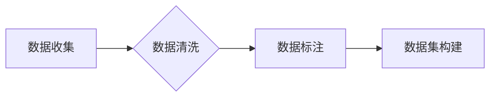

> 数据集、数据清洗、数据标注、机器学习、深度学习、软件工程、数据驱动

## 1. 背景介绍

软件工程正在经历一场深刻的变革，从传统的代码编写为主向数据驱动为主的模式转变。这被称为“软件2.0”。软件2.0的核心是利用机器学习和深度学习等人工智能技术，让软件能够自动学习、适应和进化。而这一切的基础，就是高质量的数据集。

数据是人工智能的燃料，高质量的数据集是人工智能模型训练和优化的关键。然而，现实世界中的数据往往是混乱、不完整、不一致的，需要经过一系列的处理和加工才能用于机器学习模型的训练。

本文将深入探讨数据集积累、清洗和标注的过程，以及这些过程对软件2.0工程师的重要性。

## 2. 核心概念与联系

### 2.1 数据集积累

数据集积累是指收集和整合来自各种来源的数据，形成一个用于机器学习模型训练的庞大数据池。数据来源可以是：

* **结构化数据：** 存储在数据库或表格中的数据，例如用户注册信息、商品信息、订单信息等。
* **非结构化数据：** 无法直接存储在数据库中的数据，例如文本、图像、音频、视频等。

### 2.2 数据清洗

数据清洗是指对收集到的数据进行处理，去除噪声、错误和重复数据，使其符合机器学习模型的训练要求。数据清洗的主要步骤包括：

* **缺失值处理：** 对于缺失的数据，可以选择删除、填充或使用其他方法进行处理。
* **异常值处理：** 对于超出正常范围的数据，可以选择删除、替换或进行其他处理。
* **数据格式转换：** 将数据转换为机器学习模型可以识别的格式。
* **数据去重：** 移除重复的数据。

### 2.3 数据标注

数据标注是指为数据添加人工标签，以便机器学习模型能够理解数据的含义。数据标注的类型包括：

* **文本标注：** 为文本数据添加标签，例如情感分类、主题分类、实体识别等。
* **图像标注：** 为图像数据添加标签，例如物体识别、图像分割等。
* **音频标注：** 为音频数据添加标签，例如语音识别、情感识别等。

**数据积累、清洗和标注流程图**



## 3. 核心算法原理 & 具体操作步骤

### 3.1 算法原理概述

数据清洗和标注通常涉及到一些常用的算法和技术，例如：

* **缺失值处理：** 平均值填充、中位数填充、K最近邻插值等。
* **异常值处理：** 箱线图法、z-score法等。
* **文本标注：** 朴素贝叶斯算法、支持向量机算法、深度学习模型等。
* **图像标注：** 区域生长算法、边缘检测算法、深度学习模型等。

### 3.2 算法步骤详解

以下以文本标注为例，详细介绍算法步骤：

1. **数据预处理：** 对文本数据进行清洗和格式转换，例如去除停用词、转换大小写等。
2. **特征提取：** 从文本数据中提取特征，例如词频、词向量等。
3. **模型训练：** 使用训练数据训练文本分类模型，例如朴素贝叶斯算法。
4. **模型评估：** 使用测试数据评估模型的性能，例如准确率、召回率等。
5. **模型调优：** 根据评估结果，调整模型参数，提高模型性能。

### 3.3 算法优缺点

不同的算法有不同的优缺点，需要根据具体任务选择合适的算法。例如：

* **朴素贝叶斯算法：** 简单易用，训练速度快，但对特征之间假设独立性，可能导致性能下降。
* **支持向量机算法：** 性能较好，但训练速度慢，参数设置较复杂。
* **深度学习模型：** 性能优异，但训练数据量大，训练时间长，参数设置复杂。

### 3.4 算法应用领域

数据清洗和标注技术广泛应用于各个领域，例如：

* **自然语言处理：** 文本分类、情感分析、机器翻译等。
* **计算机视觉：** 物体识别、图像分割、人脸识别等。
* **语音识别：** 语音转文本、语音助手等。
* **推荐系统：** 商品推荐、内容推荐等。

## 4. 数学模型和公式 & 详细讲解 & 举例说明

### 4.1 数学模型构建

数据清洗和标注过程中，可以使用一些数学模型来进行数据处理和分析。例如：

* **概率模型：** 用于描述数据之间的概率关系，例如朴素贝叶斯算法。
* **统计模型：** 用于描述数据的统计特征，例如均值、方差等。
* **机器学习模型：** 用于学习数据之间的模式，例如支持向量机算法、深度学习模型。

### 4.2 公式推导过程

例如，朴素贝叶斯算法的核心公式是：

$$P(C|X) = \frac{P(X|C)P(C)}{P(X)}$$

其中：

* $P(C|X)$ 是给定特征 $X$ 的条件下类别 $C$ 的概率。
* $P(X|C)$ 是给定类别 $C$ 的条件下特征 $X$ 的概率。
* $P(C)$ 是类别 $C$ 的先验概率。
* $P(X)$ 是特征 $X$ 的边缘概率。

### 4.3 案例分析与讲解

例如，假设我们有一个文本分类任务，需要将文本分类为“正面”或“负面”。我们可以使用朴素贝叶斯算法进行训练。

首先，我们需要收集一些文本数据，并为每个文本添加标签，例如“正面”或“负面”。然后，我们可以使用朴素贝叶斯算法训练模型，学习文本特征和类别之间的关系。

训练完成后，我们可以使用模型对新的文本进行分类。例如，如果一个新的文本的特征与“正面”类别的特征更相似，那么模型就会预测该文本为“正面”。

## 5. 项目实践：代码实例和详细解释说明

### 5.1 开发环境搭建

* Python 3.x
* scikit-learn 库
* NLTK 库
* pandas 库

### 5.2 源代码详细实现

```python
from sklearn.feature_extraction.text import TfidfVectorizer
from sklearn.naive_bayes import MultinomialNB
from sklearn.model_selection import train_test_split

# 数据集
texts = [
    "This movie is amazing!",
    "I loved the acting.",
    "The plot was boring.",
    "This book is terrible.",
]
labels = ["positive", "positive", "negative", "negative"]

# 数据预处理
vectorizer = TfidfVectorizer()
X = vectorizer.fit_transform(texts)

# 数据分割
X_train, X_test, y_train, y_test = train_test_split(X, labels, test_size=0.2)

# 模型训练
model = MultinomialNB()
model.fit(X_train, y_train)

# 模型评估
y_pred = model.predict(X_test)
accuracy = accuracy_score(y_test, y_pred)
print(f"Accuracy: {accuracy}")
```

### 5.3 代码解读与分析

* 首先，我们使用 `TfidfVectorizer` 将文本数据转换为特征向量。
* 然后，我们使用 `train_test_split` 将数据分割为训练集和测试集。
* 接着，我们使用 `MultinomialNB` 训练一个朴素贝叶斯模型。
* 最后，我们使用模型对测试集进行预测，并计算模型的准确率。

### 5.4 运行结果展示

运行代码后，会输出模型的准确率。

## 6. 实际应用场景

数据清洗和标注技术在软件2.0的各个领域都有着广泛的应用场景：

* **智能客服：** 使用自然语言处理技术，让聊天机器人能够理解用户的需求，并提供准确的回复。
* **个性化推荐：** 根据用户的行为数据，推荐用户感兴趣的内容或商品。
* **自动代码生成：** 使用机器学习模型，自动生成代码，提高开发效率。
* **代码缺陷检测：** 使用机器学习模型，检测代码中的缺陷，提高代码质量。

### 6.4 未来应用展望

随着人工智能技术的不断发展，数据清洗和标注技术将会更加智能化、自动化，并应用于更多领域。例如：

* **自动数据标注：** 使用深度学习模型，自动标注数据，降低人工标注成本。
* **数据质量监控：** 使用机器学习模型，实时监控数据质量，及时发现和解决问题。
* **数据合成：** 使用生成对抗网络（GAN）等技术，合成新的数据，丰富数据资源。

## 7. 工具和资源推荐

### 7.1 学习资源推荐

* **书籍：**
    * 《数据挖掘：概念与技术》
    * 《机器学习》
    * 《深度学习》
* **在线课程：**
    * Coursera
    * edX
    * Udacity

### 7.2 开发工具推荐

* **数据清洗工具：**
    * Pandas
    * Apache Spark
* **数据标注工具：**
    * LabelImg
    * Prodigy
* **机器学习库：**
    * scikit-learn
    * TensorFlow
    * PyTorch

### 7.3 相关论文推荐

* 《A Survey of Transfer Learning》
* 《Attention Is All You Need》
* 《Generative Adversarial Networks》

## 8. 总结：未来发展趋势与挑战

### 8.1 研究成果总结

数据清洗和标注技术已经取得了显著的成果，为软件2.0的发展提供了重要的基础。

### 8.2 未来发展趋势

未来，数据清洗和标注技术将会更加智能化、自动化，并应用于更多领域。

### 8.3 面临的挑战

数据清洗和标注技术仍然面临一些挑战，例如：

* 数据质量问题
* 数据标注成本高
* 模型解释性问题

### 8.4 研究展望

未来，需要进一步研究如何提高数据质量、降低数据标注成本、提高模型解释性，以及将数据清洗和标注技术应用于更多领域。

## 9. 附录：常见问题与解答

### 9.1 如何处理缺失值？

常见的处理缺失值的方法包括：删除、填充、插值等。

### 9.2 如何处理异常值？

常见的处理异常值的方法包括：删除、替换、winsorization等。

### 9.3 如何选择合适的算法？

选择合适的算法需要根据具体任务和数据特点进行选择。

### 9.4 如何评估模型性能？

常用的模型性能评估指标包括准确率、召回率、F1-score等。

### 9.5 如何提高模型性能？

可以尝试调整模型参数、增加训练数据、使用更复杂的模型等方法提高模型性能。


作者：禅与计算机程序设计艺术 / Zen and the Art of Computer Programming 
<end_of_turn>