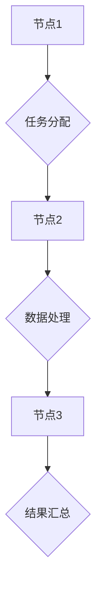

> 无领导集群，分布式系统，一致性，容错，算法设计，实践案例

## 1. 背景介绍

随着互联网技术的飞速发展，数据规模的爆炸式增长和对高可用性的需求日益迫切。传统的集中式架构已难以满足现代应用的需求，分布式系统成为解决这些问题的关键技术之一。其中，无领导集群作为一种分布式系统架构，凭借其简单、灵活、可扩展等特点，在高性能计算、大数据处理、云计算等领域得到了广泛应用。

无领导集群是指由多个节点组成的分布式系统，每个节点都是平等的，没有中心化的控制节点。节点之间通过网络通信进行数据交换和任务分配，共同完成系统目标。与传统的领导者-跟随者模式相比，无领导集群具有以下优势：

* **高可用性:** 由于没有单点故障，即使部分节点发生故障，集群仍然可以继续运行。
* **可扩展性:** 可以通过添加新的节点来扩展集群规模，满足不断增长的业务需求。
* **容错性:** 集群可以自动容忍节点故障，并重新分配任务，保证系统稳定运行。
* **简单性:** 无领导集群的架构相对简单，易于部署和维护。

## 2. 核心概念与联系

无领导集群的核心概念包括：

* **节点:** 集群中的基本单元，每个节点都具有计算能力和存储资源。
* **网络通信:** 节点之间通过网络进行数据交换和任务分配。
* **一致性:** 集群中的所有节点都保持着相同的状态和数据。
* **容错:** 集群能够自动容忍节点故障，并保证系统正常运行。

**Mermaid 流程图:**



## 3. 核心算法原理 & 具体操作步骤

### 3.1  算法原理概述

无领导集群的实现需要解决一致性、容错、任务分配等关键问题。常用的算法包括：

* **Paxos算法:** 用于解决一致性问题，保证集群中的所有节点都达成一致的决策。
* **Raft算法:** 是一种改进的Paxos算法，更易于理解和实现。
* **Gossip协议:** 用于节点间数据同步和状态传播，提高集群的容错性。

### 3.2  算法步骤详解

以Paxos算法为例，其核心步骤如下：

1. **提案阶段:** 一个节点提出一个提案，并将其广播到集群中的所有节点。
2. **承诺阶段:** 节点收到提案后，会进行投票，承诺支持该提案。
3. **接受阶段:** 当一个提案获得集群中大多数节点的支持后，这些节点会将该提案接受并执行。

### 3.3  算法优缺点

**Paxos算法:**

* **优点:** 能够保证一致性，即使节点发生故障。
* **缺点:** 实现复杂，性能较低。

**Raft算法:**

* **优点:** 相比Paxos算法更易于理解和实现，性能也相对较高。
* **缺点:** 仍然存在一定的复杂度。

### 3.4  算法应用领域

Paxos和Raft算法广泛应用于分布式数据库、分布式文件系统、分布式缓存等领域，用于保证数据一致性和系统可靠性。

## 4. 数学模型和公式 & 详细讲解 & 举例说明

### 4.1  数学模型构建

Paxos算法的数学模型可以抽象为一个状态机，每个状态机代表一个节点，状态机之间通过消息传递进行交互。

### 4.2  公式推导过程

Paxos算法的实现涉及到一些数学公式，例如：

* **多数投票:** 
$$
\text{多数投票}(S) = \begin{cases}
\text{true}, & \text{if } |S_1| > |S_2| \\
\text{false}, & \text{otherwise}
\end{cases}
$$

其中，$S_1$ 和 $S_2$ 分别代表支持提案和反对提案的节点集合，$|S|$ 表示集合的大小。

### 4.3  案例分析与讲解

通过Paxos算法的数学模型和公式，我们可以分析和解释Paxos算法的运行过程，例如：

* 如何保证提案的达成一致性
* 如何处理节点故障
* 如何提高算法的性能

## 5. 项目实践：代码实例和详细解释说明

### 5.1  开发环境搭建

为了实现无领导集群，需要搭建一个开发环境，包括：

* 操作系统: Linux
* 虚拟机: Docker
* 编程语言: Go

### 5.2  源代码详细实现

以下是一个简单的无领导集群的代码示例，使用Go语言实现：

```go
package main

import (
\t"fmt"
\t"net"
\t"sync"
)

type Node struct {
\tID   int
\tAddr string
\tData map[int]string
\tmu   sync.Mutex
}

func NewNode(id int, addr string) *Node {
\treturn &Node{
\t\tID:   id,
\t\tAddr: addr,
\t\tData: make(map[int]string),
\t}
}

func (n *Node) Put(key int, value string) {
\tn.mu.Lock()
\tdefer n.mu.Unlock()
\tn.Data[key] = value
}

func (n *Node) Get(key int) (string, bool) {
\tn.mu.Lock()
\tdefer n.mu.Unlock()
\tvalue, ok := n.Data[key]
\treturn value, ok
}

func main() {
\t// 创建三个节点
\tnode1 := NewNode(1, "127.0.0.1:8080")
\tnode2 := NewNode(2, "127.0.0.1:8081")
\tnode3 := NewNode(3, "127.0.0.1:8082")

\t// 节点间通信
\tgo node1.listen()
\tgo node2.listen()
\tgo node3.listen()

\t// 模拟数据写入
\tnode1.Put(1, "hello")
\tnode2.Put(2, "world")

\t// 模拟数据读取
\tvalue, ok := node1.Get(1)
\tif ok {
\t\tfmt.Println("node1 get:", value)
\t}

\tvalue, ok = node2.Get(2)
\tif ok {
\t\tfmt.Println("node2 get:", value)
\t}
}

func (n *Node) listen() {
\tlistener, err := net.Listen("tcp", n.Addr)
\tif err != nil {
\t\tfmt.Println("listen error:", err)
\t\treturn
\t}
\tdefer listener.Close()

\tfor {
\t\tconn, err := listener.Accept()
\t\tif err != nil {
\t\t\tfmt.Println("accept error:", err)
\t\t\tcontinue
\t\t}
\t\tgo handleConn(conn, n)
\t}
}

func handleConn(conn net.Conn, n *Node) {
\tdefer conn.Close()
\t// 处理客户端请求
}
```

### 5.3  代码解读与分析

这段代码演示了三个节点的简单无领导集群实现。每个节点都维护一个数据结构，用于存储数据。节点之间通过网络通信进行数据同步和操作。

### 5.4  运行结果展示

运行这段代码后，可以观察到三个节点之间的数据同步和操作。例如，当节点1写入数据时，其他节点也会同步该数据。

## 6. 实际应用场景

无领导集群在以下场景中得到广泛应用：

* **高可用性数据库:** 确保数据库的高可用性和数据一致性。
* **分布式文件系统:** 提供高性能、可扩展的文件存储服务。
* **大数据处理:** 分布式处理海量数据，提高数据分析效率。
* **云计算平台:** 提供弹性、可扩展的计算资源。

### 6.4  未来应用展望

随着云计算、物联网等技术的快速发展，无领导集群的应用场景将更加广泛。未来，无领导集群技术将朝着以下方向发展：

* **更复杂的算法:** 开发更复杂的算法，提高集群的容错性和性能。
* **更智能的管理:** 利用人工智能技术，实现对集群的智能管理和优化。
* **更广泛的应用:** 将无领导集群技术应用于更多领域，例如边缘计算、区块链等。

## 7. 工具和资源推荐

### 7.1  学习资源推荐

* **书籍:**
    * 《分布式系统的设计与实现》
    * 《Designing Data-Intensive Applications》
* **在线课程:**
    * Coursera: Distributed Systems
    * edX: Introduction to Distributed Systems

### 7.2  开发工具推荐

* **Docker:** 用于容器化部署和管理集群。
* **Kubernetes:** 用于容器编排和管理。
* **Apache ZooKeeper:** 用于分布式协调和配置管理。

### 7.3  相关论文推荐

* **Paxos Made Live: An Engineering Perspective**
* **Raft: In Search of an Understandable Consensus Algorithm**

## 8. 总结：未来发展趋势与挑战

### 8.1  研究成果总结

无领导集群技术已经取得了显著的成果，为分布式系统的发展做出了重要贡献。

### 8.2  未来发展趋势

未来，无领导集群技术将朝着更智能、更安全、更可靠的方向发展。

### 8.3  面临的挑战

无领导集群技术仍然面临一些挑战，例如：

* **复杂性:** 无领导集群的实现和维护相对复杂。
* **性能:** 无领导集群的性能仍然存在提升空间。
* **安全性:** 无领导集群需要保证数据安全和系统可靠性。

### 8.4  研究展望

未来，需要进一步研究和探索无领导集群技术的应用场景、算法设计、性能优化和安全性保障等方面。

## 9. 附录：常见问题与解答

* **Q1: 无领导集群和领导者-跟随者模式相比有什么优势？**
* **A1:** 无领导集群具有高可用性、可扩展性和容错性等优势，而领导者-跟随者模式则存在单点故障的风险。

* **Q2: 如何选择合适的无领导集群算法？**
* **A2:** 需要根据具体的应用场景和需求选择合适的算法，例如，Paxos算法适用于高可靠性场景，而Raft算法则更易于实现。


作者：禅与计算机程序设计艺术 / Zen and the Art of Computer Programming 
<end_of_turn>