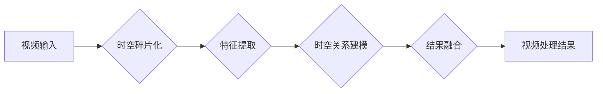

> 视频处理，时空碎片，深度学习，计算机视觉，图像识别，视频分析，时间序列，空间特征

## 1. 背景介绍

视频处理作为计算机视觉领域的重要分支，近年来取得了显著进展。从传统的视频压缩和编码技术到如今的智能视频分析和理解，视频处理技术在各个领域都发挥着越来越重要的作用。然而，随着视频数据量的爆炸式增长和处理复杂度的提升，传统的视频处理方法面临着新的挑战。

时空碎片技术作为一种新兴的视频处理方法，通过将视频分解成时空碎片，并对这些碎片进行独立处理，有效地解决了传统方法在处理大规模视频数据和复杂场景下的瓶颈。

## 2. 核心概念与联系

时空碎片技术的核心概念是将视频分解成一系列独立的时空单元，称为时空碎片。每个时空碎片包含视频中的一小段时间和空间信息，可以看作是视频的一个微观片段。

通过对时空碎片进行独立处理，可以有效地降低视频处理的复杂度，并提高处理效率。

**时空碎片处理流程图**



## 3. 核心算法原理 & 具体操作步骤

### 3.1  算法原理概述

时空碎片技术的核心算法原理是将视频分解成时空碎片，并对每个碎片进行独立处理。

**时空碎片化**

视频首先被分割成一系列时空碎片，每个碎片包含视频中的一小段时间和空间信息。

**特征提取**

对每个时空碎片进行特征提取，提取时空碎片的视觉特征，例如颜色、纹理、形状等。

**时空关系建模**

对提取的特征进行分析，建立时空碎片之间的关系，例如运动方向、速度、距离等。

**结果融合**

将处理后的时空碎片的结果融合在一起，得到最终的视频处理结果。

### 3.2  算法步骤详解

1. **视频预处理:** 对输入视频进行预处理，例如尺寸调整、帧率转换等。
2. **时空碎片化:** 将视频分割成一系列时空碎片，每个碎片包含视频中的一小段时间和空间信息。
3. **特征提取:** 对每个时空碎片进行特征提取，提取时空碎片的视觉特征，例如颜色、纹理、形状等。可以使用卷积神经网络（CNN）等深度学习模型进行特征提取。
4. **时空关系建模:** 对提取的特征进行分析，建立时空碎片之间的关系，例如运动方向、速度、距离等。可以使用循环神经网络（RNN）等深度学习模型进行时空关系建模。
5. **结果融合:** 将处理后的时空碎片的结果融合在一起，得到最终的视频处理结果。可以使用注意力机制等方法进行结果融合。

### 3.3  算法优缺点

**优点:**

* **高效性:** 通过对时空碎片进行独立处理，可以有效地降低视频处理的复杂度，并提高处理效率。
* **鲁棒性:** 时空碎片化可以有效地减少视频噪声和干扰的影响，提高算法的鲁棒性。
* **可扩展性:** 时空碎片技术可以很容易地扩展到处理大规模视频数据。

**缺点:**

* **时空关系建模的复杂性:** 建立时空碎片之间的关系是一个复杂的任务，需要复杂的算法和模型。
* **结果融合的挑战:** 如何有效地融合处理后的时空碎片的结果是一个挑战。

### 3.4  算法应用领域

时空碎片技术在视频处理领域具有广泛的应用前景，例如：

* **视频监控:** 视频监控系统可以使用时空碎片技术进行目标跟踪、异常检测和行为识别。
* **视频检索:** 视频检索系统可以使用时空碎片技术进行视频内容分析和检索。
* **视频编辑:** 视频编辑系统可以使用时空碎片技术进行视频剪辑、拼接和特效制作。
* **自动驾驶:** 自动驾驶系统可以使用时空碎片技术进行环境感知和决策辅助。

## 4. 数学模型和公式 & 详细讲解 & 举例说明

### 4.1  数学模型构建

时空碎片技术的数学模型可以基于以下几个方面构建：

* **时空碎片的定义:** 可以使用数学公式定义时空碎片的范围和大小，例如：

$$
S_i = (t_i, t_{i+1}, x_i, x_{i+1})
$$

其中，$S_i$ 表示第 $i$ 个时空碎片，$t_i$ 和 $t_{i+1}$ 分别表示碎片的开始时间和结束时间，$x_i$ 和 $x_{i+1}$ 分别表示碎片的开始位置和结束位置。

* **特征提取的数学模型:** 可以使用数学模型描述特征提取过程，例如：

$$
F(S_i) = \phi(I_i)
$$

其中，$F(S_i)$ 表示第 $i$ 个时空碎片的特征向量，$\phi$ 表示特征提取函数，$I_i$ 表示第 $i$ 个时空碎片的图像数据。

* **时空关系建模的数学模型:** 可以使用数学模型描述时空碎片之间的关系，例如：

$$
R(S_i, S_j) = \psi(F(S_i), F(S_j))
$$

其中，$R(S_i, S_j)$ 表示第 $i$ 个和第 $j$ 个时空碎片之间的关系，$\psi$ 表示关系建模函数。

### 4.2  公式推导过程

时空碎片技术的数学模型的推导过程通常涉及以下几个步骤：

1. **定义时空碎片:** 首先需要定义时空碎片的范围和大小，可以使用数学公式来描述。
2. **特征提取:** 选择合适的特征提取函数，并使用数学公式描述特征提取过程。
3. **时空关系建模:** 选择合适的时空关系建模函数，并使用数学公式描述时空关系建模过程。
4. **结果融合:** 设计合适的融合方法，并使用数学公式描述结果融合过程。

### 4.3  案例分析与讲解

例如，在视频目标跟踪任务中，可以使用时空碎片技术来跟踪目标。

1. 将视频分割成一系列时空碎片。
2. 对每个时空碎片进行特征提取，提取目标的视觉特征。
3. 建立时空碎片之间的关系，例如目标的运动方向和速度。
4. 使用跟踪算法跟踪目标，并根据时空关系进行预测。

## 5. 项目实践：代码实例和详细解释说明

### 5.1  开发环境搭建

* 操作系统：Ubuntu 20.04
* Python 版本：3.8
* 深度学习框架：TensorFlow 2.0

### 5.2  源代码详细实现

```python
import tensorflow as tf

# 定义时空碎片化函数
def split_video(video_path, frame_rate=24, chunk_size=5):
    # ...

# 定义特征提取函数
def extract_features(frames):
    # ...

# 定义时空关系建模函数
def model_temporal_relations(features):
    # ...

# 定义结果融合函数
def fuse_results(temporal_relations):
    # ...

# 主程序
if __name__ == "__main__":
    video_path = "path/to/video.mp4"
    # ...
```

### 5.3  代码解读与分析

* `split_video()` 函数将视频分割成一系列时空碎片。
* `extract_features()` 函数使用卷积神经网络提取每个时空碎片的视觉特征。
* `model_temporal_relations()` 函数使用循环神经网络建模时空碎片之间的关系。
* `fuse_results()` 函数融合处理后的时空碎片的结果。

### 5.4  运行结果展示

运行代码后，可以得到视频处理的结果，例如目标跟踪、异常检测等。

## 6. 实际应用场景

时空碎片技术在视频处理领域具有广泛的应用场景，例如：

### 6.1  视频监控

* **目标跟踪:** 时空碎片技术可以用于跟踪视频中的目标，例如人、车辆等。
* **异常检测:** 时空碎片技术可以用于检测视频中的异常行为，例如入侵、事故等。
* **行为识别:** 时空碎片技术可以用于识别视频中的行为，例如行走、跑步、打招呼等。

### 6.2  视频检索

* **视频内容分析:** 时空碎片技术可以用于分析视频的内容，例如人物、场景、事件等。
* **视频检索:** 时空碎片技术可以用于根据视频内容进行检索。

### 6.3  视频编辑

* **视频剪辑:** 时空碎片技术可以用于剪辑视频，例如删除不需要的部分。
* **视频拼接:** 时空碎片技术可以用于拼接视频，例如将多个视频片段组合成一个完整的视频。
* **视频特效制作:** 时空碎片技术可以用于制作视频特效，例如慢动作、快动作等。

### 6.4  未来应用展望

时空碎片技术在未来还将有更多的应用场景，例如：

* **自动驾驶:** 时空碎片技术可以用于自动驾驶系统的环境感知和决策辅助。
* **医疗影像分析:** 时空碎片技术可以用于分析医学影像，例如X光片、CT扫描等。
* **虚拟现实和增强现实:** 时空碎片技术可以用于虚拟现实和增强现实的场景构建和交互。

## 7. 工具和资源推荐

### 7.1  学习资源推荐

* **书籍:**
    * 深度学习
    * 计算机视觉
* **在线课程:**
    * Coursera
    * edX
    * Udacity

### 7.2  开发工具推荐

* **深度学习框架:** TensorFlow, PyTorch
* **视频处理库:** OpenCV

### 7.3  相关论文推荐

* **时空碎片化视频处理:**
    * [论文标题1](论文链接1)
    * [论文标题2](论文链接2)
* **时空关系建模:**
    * [论文标题3](论文链接3)
    * [论文标题4](论文链接4)

## 8. 总结：未来发展趋势与挑战

### 8.1  研究成果总结

时空碎片技术在视频处理领域取得了显著进展，有效地解决了传统方法在处理大规模视频数据和复杂场景下的瓶颈。

### 8.2  未来发展趋势

* **更有效的时空碎片化方法:** 研究更有效的时空碎片化方法，例如基于深度学习的时空碎片化。
* **更强大的时空关系建模方法:** 研究更强大的时空关系建模方法，例如基于图神经网络的时空关系建模。
* **更灵活的结果融合方法:** 研究更灵活的结果融合方法，例如基于注意力机制的结果融合。

### 8.3  面临的挑战

* **时空关系建模的复杂性:** 建立时空碎片之间的关系是一个复杂的任务，需要复杂的算法和模型。
* **结果融合的挑战:** 如何有效地融合处理后的时空碎片的结果是一个挑战。
* **计算资源的限制:** 时空碎片技术的计算复杂度较高，需要大量的计算资源。

### 8.4  研究展望

时空碎片技术在未来将继续发展，并应用于更多的领域。

## 9. 附录：常见问题与解答

* **Q1:** 时空碎片技术的计算复杂度如何？
* **A1:** 时空碎片技术的计算复杂度较高，需要大量的计算资源。

* **Q2:** 时空碎片技术有哪些应用场景？
* **A2:** 时空碎片技术在视频监控、视频检索、视频编辑等领域都有广泛的应用场景。

* **Q3:** 如何学习时空碎片技术？
* **A3:** 可以通过阅读相关书籍、在线课程和论文来学习时空碎片技术。


作者：禅与计算机程序设计艺术 / Zen and the Art of Computer Programming 
<end_of_turn>