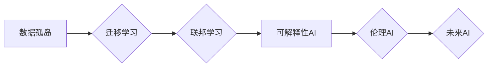

>  人工智能、深度学习、强化学习、迁移学习、联邦学习、可解释性、伦理

## 1. 背景介绍

人工智能（AI）技术近年来发展迅速，取得了令人瞩目的成就。从语音识别、图像识别到自然语言处理，AI已经渗透到我们生活的方方面面。然而，当前的AI发展模式主要依赖于海量数据和强大的计算能力，这导致了以下几个问题：

* **数据孤岛问题:** 数据分散在不同的机构和平台，难以共享和利用。
* **计算资源限制:** 训练大型AI模型需要大量的计算资源，成本高昂，难以普及。
* **可解释性问题:** 许多AI模型是“黑箱”模型，难以解释其决策过程，缺乏可信度。
* **伦理问题:** AI技术的应用可能带来一些伦理风险，例如算法偏见、隐私泄露等。

为了解决这些问题，我们需要探索新的AI发展驱动力，推动AI技术朝着更安全、更可持续、更普惠的方向发展。

## 2. 核心概念与联系

未来AI发展的新驱动力主要体现在以下几个方面：

* **迁移学习:** 迁移学习是指利用已训练好的模型知识，迁移到新的任务或领域，从而减少训练数据和计算资源的需求。
* **联邦学习:** 联邦学习是指在不共享原始数据的情况下，通过模型参数的迭代更新，实现多个参与方联合训练模型。
* **可解释性AI:** 可解释性AI是指能够解释AI模型决策过程的AI技术，提高AI模型的可信度和透明度。
* **伦理AI:** 伦理AI是指在AI技术开发和应用过程中，遵循伦理原则，避免算法偏见、隐私泄露等风险。

这些新驱动力相互关联，共同推动着AI技术的进步。

**Mermaid 流程图:**



## 3. 核心算法原理 & 具体操作步骤

### 3.1  算法原理概述

迁移学习的核心思想是利用源任务上已训练好的模型知识，迁移到目标任务中，从而提高目标任务的学习效率。

**具体来说，迁移学习的步骤如下：**

1. 在源任务上训练一个模型，并获得模型参数。
2. 将源任务模型的参数迁移到目标任务模型中。
3. 在目标任务上进行微调，优化模型参数。

### 3.2  算法步骤详解

**1. 源任务模型训练:**

* 选择一个与目标任务相关的源任务，并收集相应的训练数据。
* 使用深度学习算法训练源任务模型，例如卷积神经网络（CNN）或循环神经网络（RNN）。
* 训练完成后，获得源任务模型的参数。

**2. 参数迁移:**

* 将源任务模型的参数迁移到目标任务模型中。
* 可以直接将源任务模型的所有参数迁移到目标任务模型中，也可以只迁移部分参数，例如特征提取层或全连接层。

**3. 目标任务微调:**

* 在目标任务上收集少量数据进行微调。
* 使用目标任务数据对目标任务模型进行训练，优化模型参数。
* 微调过程中，可以冻结部分源任务模型的参数，防止模型过拟合。

### 3.3  算法优缺点

**优点:**

* 减少训练数据和计算资源的需求。
* 提高目标任务模型的学习效率。
* 能够应用于数据稀缺的领域。

**缺点:**

* 源任务和目标任务之间需要有一定的相关性。
* 参数迁移过程可能导致模型性能下降。
* 微调过程需要一定的训练数据。

### 3.4  算法应用领域

迁移学习在图像识别、自然语言处理、语音识别等领域都有广泛的应用。例如：

* **图像识别:** 利用预训练的图像分类模型，迁移到新的图像识别任务中，例如识别特定物体的图像。
* **自然语言处理:** 利用预训练的语言模型，迁移到新的自然语言处理任务中，例如文本分类、情感分析等。
* **语音识别:** 利用预训练的语音识别模型，迁移到新的语音识别任务中，例如识别特定方言的语音。

## 4. 数学模型和公式 & 详细讲解 & 举例说明

### 4.1  数学模型构建

迁移学习的数学模型可以表示为：

$$
f_{\theta}(x) = g(h(x; \phi))
$$

其中：

* $f_{\theta}(x)$ 是目标任务模型的输出。
* $x$ 是输入数据。
* $h(x; \phi)$ 是源任务模型的特征提取函数。
* $g(\cdot)$ 是目标任务模型的分类函数。
* $\theta$ 是目标任务模型的参数。
* $\phi$ 是源任务模型的参数。

### 4.2  公式推导过程

目标任务模型的训练目标是最小化预测值与真实值的损失函数。

$$
L(\theta) = \sum_{i=1}^{N} L(f_{\theta}(x_i), y_i)
$$

其中：

* $N$ 是训练数据的数量。
* $L(\cdot)$ 是损失函数。
* $y_i$ 是真实标签。

通过梯度下降算法，更新目标任务模型的参数：

$$
\theta = \theta - \eta \nabla_{\theta} L(\theta)
$$

其中：

* $\eta$ 是学习率。
* $\nabla_{\theta} L(\theta)$ 是损失函数对目标任务模型参数的梯度。

### 4.3  案例分析与讲解

假设我们想利用预训练的图像分类模型，迁移到识别特定物体的图像任务中。

* 源任务模型：预训练的ImageNet图像分类模型。
* 目标任务模型：识别特定物体的图像分类模型。

我们可以将源任务模型的特征提取层迁移到目标任务模型中，并对目标任务模型进行微调。

在微调过程中，我们可以冻结源任务模型的特征提取层参数，只更新目标任务模型的分类层参数。

## 5. 项目实践：代码实例和详细解释说明

### 5.1  开发环境搭建

* 操作系统：Ubuntu 20.04
* Python 版本：3.8
* 深度学习框架：TensorFlow 2.0

### 5.2  源代码详细实现

```python
# 导入必要的库
import tensorflow as tf

# 定义目标任务模型
class TargetModel(tf.keras.Model):
    def __init__(self):
        super(TargetModel, self).__init__()
        # ...

    def call(self, inputs):
        # ...

# 加载预训练的源任务模型
source_model = tf.keras.applications.ResNet50(weights='imagenet', include_top=False)

# 创建目标任务模型
target_model = TargetModel()

# 将源任务模型的特征提取层迁移到目标任务模型中
target_model.layers[:150] = source_model.layers

# 冻结源任务模型的特征提取层参数
for layer in target_model.layers[:150]:
    layer.trainable = False

# 编译目标任务模型
target_model.compile(optimizer='adam', loss='categorical_crossentropy', metrics=['accuracy'])

# 训练目标任务模型
target_model.fit(train_data, train_labels, epochs=10)
```

### 5.3  代码解读与分析

* 代码首先导入必要的库，并定义目标任务模型。
* 然后加载预训练的源任务模型，并创建目标任务模型。
* 将源任务模型的特征提取层迁移到目标任务模型中，并冻结源任务模型的特征提取层参数。
* 最后编译目标任务模型，并使用训练数据进行训练。

### 5.4  运行结果展示

训练完成后，可以评估目标任务模型的性能，例如准确率、召回率等。

## 6. 实际应用场景

### 6.1  医疗领域

* **疾病诊断:** 利用迁移学习，将预训练的医学图像分类模型迁移到新的疾病诊断任务中，提高诊断准确率。
* **药物研发:** 利用迁移学习，将预训练的分子结构分析模型迁移到新的药物研发任务中，加速药物研发过程。

### 6.2  金融领域

* **欺诈检测:** 利用迁移学习，将预训练的金融交易数据分析模型迁移到新的欺诈检测任务中，提高欺诈检测效率。
* **风险评估:** 利用迁移学习，将预训练的客户信用评分模型迁移到新的风险评估任务中，提高风险评估准确率。

### 6.3  教育领域

* **个性化学习:** 利用迁移学习，将预训练的学习行为分析模型迁移到新的个性化学习任务中，提供个性化的学习方案。
* **智能辅导:** 利用迁移学习，将预训练的知识问答模型迁移到新的智能辅导任务中，提供智能化的学习辅导。

### 6.4  未来应用展望

随着迁移学习技术的不断发展，其应用场景将更加广泛，例如：

* **边缘计算:** 将迁移学习模型部署到边缘设备上，实现本地数据处理和决策。
* **工业自动化:** 利用迁移学习，将预训练的工业图像识别模型迁移到新的工业自动化任务中，提高生产效率。
* **智能家居:** 利用迁移学习，将预训练的语音识别模型迁移到新的智能家居任务中，实现更加智能化的家居体验。

## 7. 工具和资源推荐

### 7.1  学习资源推荐

* **书籍:**
    * 《深度学习》
    * 《迁移学习》
* **在线课程:**
    * Coursera: 深度学习
    * Udacity: 迁移学习
* **博客:**
    * TensorFlow Blog
    * PyTorch Blog

### 7.2  开发工具推荐

* **深度学习框架:** TensorFlow, PyTorch
* **数据处理工具:** Pandas, NumPy
* **可视化工具:** Matplotlib, Seaborn

### 7.3  相关论文推荐

* **迁移学习:**
    * Pan, S. J., & Yang, Q. (2010). A survey on transfer learning. IEEE Transactions on Knowledge and Data Engineering, 22(10), 1345-1359.
* **联邦学习:**
    * McMahan, B., Moore, E., Ramage, D., Hampson, S., & y Arcas, B. (2017). Communication-efficient learning of deep networks from decentralized data. In Proceedings of the 2017 ACM International Conference on Learning Representations (ICLR) (pp. 1-16).
* **可解释性AI:**
    * Ribeiro, M. T., Singh, S., & Guestrin, C. (2016). "Why should I trust you?": Explaining the predictions of any classifier. In Proceedings of the 22nd ACM SIGKDD International Conference on Knowledge Discovery and Data Mining (pp. 1135-1144).

## 8. 总结：未来发展趋势与挑战

### 8.1  研究成果总结

近年来，迁移学习、联邦学习、可解释性AI和伦理AI等新驱动力取得了显著进展，为AI技术的进步提供了新的方向。

### 8.2  未来发展趋势

未来AI发展趋势主要体现在以下几个方面：

* **更强大的迁移学习算法:** 发展更有效的迁移学习算法，能够更好地利用源任务知识，提高目标任务学习效率。
* **更安全的联邦学习方法:** 发展更安全的联邦学习方法，保障数据隐私和模型安全。
* **更可解释的AI模型:** 发展更可解释的AI模型，提高AI模型的可信度和透明度。
* **更伦理的AI技术:** 发展更伦理的AI技术，避免算法偏见、隐私泄露等风险。

### 8.3  面临的挑战

AI技术发展也面临着一些挑战：

* **数据孤岛问题:** 数据分散在不同的机构和平台，难以共享和利用。
* **计算资源限制:** 训练大型AI模型需要大量的计算资源，成本